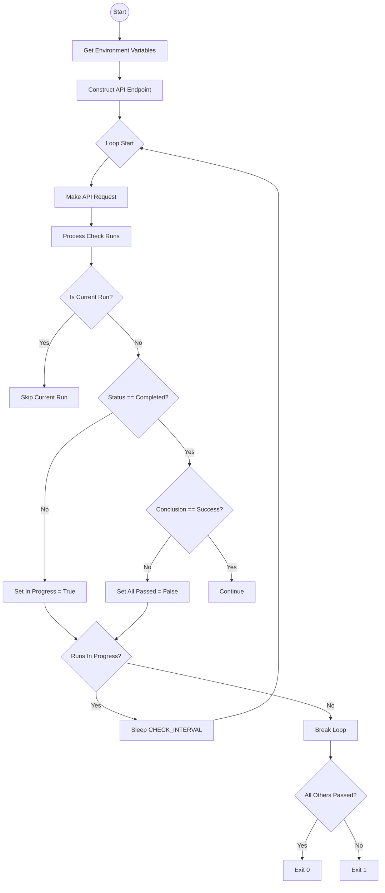
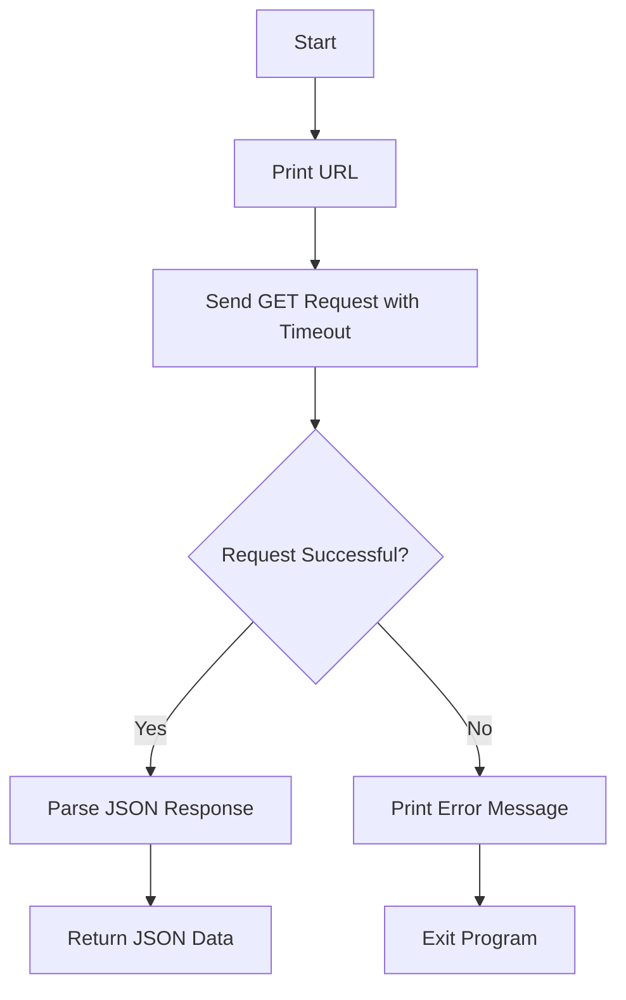
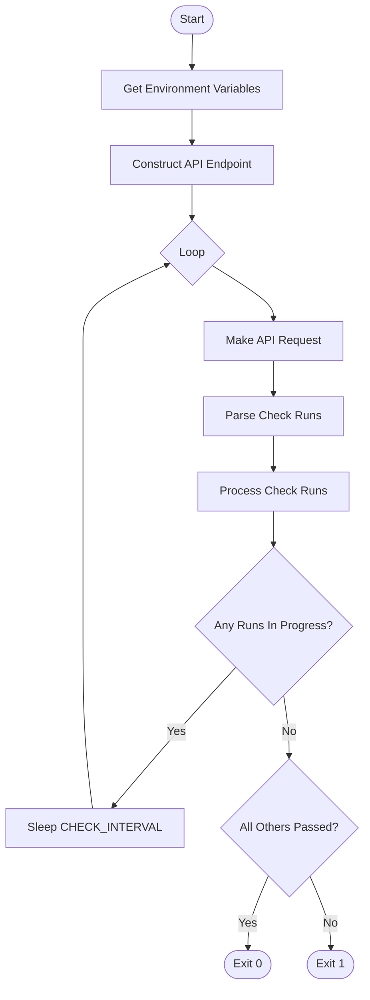

# `.\AutoGPT\.github\workflows\scripts\check_actions_status.py` 详细设计文档

This script is a GitHub Actions workflow script that polls the GitHub API to monitor the status of other CI/CD check runs associated with a specific commit or pull request, waiting until all non-current checks are completed and successful before exiting.

## 整体流程



## 类结构

```
No classes defined
```

## 全局变量及字段


### `CHECK_INTERVAL`
    
The number of seconds to wait between polling the GitHub API for check run status updates.

类型：`int`
    


    

## 全局函数及方法

### `get_environment_variables`

Retrieve and return necessary environment variables required for the script to function, specifically handling the SHA (commit hash) by checking for a pull request event or falling back to the standard environment variable.

参数：

-  无

返回值：`Tuple[str, str, str, str, str]`，一个包含 GitHub API URL、仓库名称、提交 SHA、认证令牌和当前运行 ID 的元组。

#### 流程图

```mermaid
flowchart TD
    Start([Start]) --> TryBlock{Try to open file}
    TryBlock -->|Success| ParseJSON[Parse JSON]
    ParseJSON --> CheckPR{Is 'pull_request' in event?}
    CheckPR -->|Yes| GetSHA_PR[Extract SHA from event['pull_request']['head']['sha']]
    CheckPR -->|No| GetSHA_ENV[Get SHA from os.environ['GITHUB_SHA']]
    GetSHA_PR --> ReturnTuple[Return Tuple]
    GetSHA_ENV --> ReturnTuple
    TryBlock -->|KeyError| PrintError[Print Error Message]
    PrintError --> Exit([Exit with code 1])
```

#### 带注释源码

```python
def get_environment_variables() -> Tuple[str, str, str, str, str]:
    """Retrieve and return necessary environment variables."""
    try:
        # 尝试打开 GitHub Actions 事件文件路径
        with open(os.environ["GITHUB_EVENT_PATH"]) as f:
            event = json.load(f)

        # Determine the commit SHA based on the event type
        # Handle both PR and merge group events
        if "pull_request" in event:
            # 如果是 PR 事件，从 PR 的 head 分支获取 SHA
            sha = event["pull_request"]["head"]["sha"]
        else:
            # 否则使用标准环境变量中的 SHA
            sha = os.environ["GITHUB_SHA"]

        # 返回所需的变量元组
        return (
            os.environ["GITHUB_API_URL"],
            os.environ["GITHUB_REPOSITORY"],
            sha,
            os.environ["GITHUB_TOKEN"],
            os.environ["GITHUB_RUN_ID"],
        )
    except KeyError as e:
        # Handle missing environment variables or event data
        print(f"Error: Missing required environment variable or event data: {e}")
        sys.exit(1)
```

### `make_api_request`

该函数负责向指定的 GitHub API 端点发起 HTTP GET 请求，包含超时设置，并返回解析后的 JSON 响应数据。如果请求过程中发生网络错误或 HTTP 状态码非 2xx，函数会捕获异常并打印错误信息，随后终止程序执行。

参数：

-  `url`：`str`，目标 API 的完整 URL 地址。
-  `headers`：`Dict[str, str]`，用于 HTTP 请求的头部信息字典，通常包含认证令牌和内容类型。

返回值：`Dict`，API 返回的 JSON 格式的响应数据。

#### 流程图



#### 带注释源码

```python
def make_api_request(url: str, headers: Dict[str, str]) -> Dict:
    """Make an API request and return the JSON response."""
    try:
        print("Making API request to:", url)
        # 发送 GET 请求，设置 10 秒超时以防止挂起
        response = requests.get(url, headers=headers, timeout=10)
        # 检查 HTTP 状态码，非 2xx 会抛出 HTTPError
        response.raise_for_status()
        # 解析并返回 JSON 响应
        return response.json()
    except requests.RequestException as e:
        # 捕获所有 requests 库相关的异常（连接错误、超时、HTTP 错误等）
        print(f"Error: API request failed. {e}")
        sys.exit(1)
```


### `process_check_runs`

该函数用于处理从 GitHub API 获取的检查运行列表，分析其中除当前运行外的其他检查运行的状态。它遍历列表，判断是否存在仍在进行中的检查运行，或者是否存在结论为失败（非 success/skipped/neutral）的检查运行，并返回相应的状态标志。

参数：

-  `check_runs`：`List[Dict]`，从 GitHub API 获取的检查运行对象列表。

返回值：`Tuple[bool, bool]`，一个包含两个布尔值的元组。第一个布尔值表示是否存在检查运行仍在进行中，第二个布尔值表示所有其他已完成的检查运行是否都通过了（结论为 success/skipped/neutral）。

#### 流程图

```mermaid
graph TD
    A[Start] --> B[Initialize runs_in_progress=False, all_others_passed=True]
    B --> C{Loop through check_runs}
    C --> D{run name == "Check PR Status"?}
    D -- Yes --> E[Print skip message]
    E --> C
    D -- No --> F[Get status and conclusion]
    F --> G{status == "completed"?}
    G -- Yes --> H{conclusion in success/skipped/neutral?}
    H -- Yes --> C
    H -- No --> I[Set all_others_passed=False]
    I --> J[Print failure message]
    J --> C
    G -- No --> K[Set runs_in_progress=True]
    K --> L[Set all_others_passed=False]
    L --> M[Print in progress message]
    M --> C
    C --> N[Return runs_in_progress, all_others_passed]
```

#### 带注释源码

```python
def process_check_runs(check_runs: List[Dict]) -> Tuple[bool, bool]:
    """Process check runs and return their status."""
    # 初始化标志位：假设没有运行中的检查，且其他检查都通过
    runs_in_progress = False
    all_others_passed = True

    # 遍历每一个检查运行
    for run in check_runs:
        # 检查是否为当前运行的检查（名称为 "Check PR Status"）
        if str(run["name"]) != "Check PR Status":
            status = run["status"]
            conclusion = run["conclusion"]

            # 如果检查运行已完成
            if status == "completed":
                # 检查结论是否为成功、跳过或中立
                # 如果不是，则认为失败
                if conclusion not in ["success", "skipped", "neutral"]:
                    all_others_passed = False
                    print(
                        f"Check run {run['name']} (ID: {run['id']}) has conclusion: {conclusion}"
                    )
            else:
                # 如果状态不是 completed，则认为仍在进行中
                runs_in_progress = True
                print(f"Check run {run['name']} (ID: {run['id']}) is still {status}.")
                all_others_passed = False
        else:
            # 跳过当前运行的检查
            print(
                f"Skipping check run {run['name']} (ID: {run['id']}) as it is the current run."
            )

    # 返回状态标志
    return runs_in_progress, all_others_passed
```


### `main`

The `main` function orchestrates the workflow to wait for other GitHub Check Runs to complete before determining the status of the current run. It retrieves necessary environment variables, constructs the API endpoint for the specific commit, and enters a polling loop to check the status of all check runs associated with that commit, excluding the current one.

参数：

-  (无)

返回值：`None`，该函数终止进程，返回退出码 0（成功）表示所有其他检查运行已通过，返回退出码 1（失败）表示存在失败或未完成的检查运行。

#### 流程图



#### 带注释源码

```python
def main():
    # Retrieve environment variables (API URL, Repo, SHA, Token, Run ID)
    api_url, repo, sha, github_token, current_run_id = get_environment_variables()

    # Construct the endpoint URL for the specific commit's check runs
    endpoint = f"{api_url}/repos/{repo}/commits/{sha}/check-runs"
    
    # Set headers for GitHub API authentication
    headers = {
        "Accept": "application/vnd.github.v3+json",
    }
    if github_token:
        headers["Authorization"] = f"token {github_token}"

    print(f"Current run ID: {current_run_id}")

    # Main polling loop
    while True:
        # Fetch check runs for the current commit
        data = make_api_request(endpoint, headers)

        check_runs = data["check_runs"]

        print("Processing check runs...")

        print(check_runs)

        # Process the list of check runs to filter out the current one and check statuses
        runs_in_progress, all_others_passed = process_check_runs(check_runs)

        # If no runs are in progress, exit the loop
        if not runs_in_progress:
            break

        print(
            "Some check runs are still in progress. "
            f"Waiting {CHECK_INTERVAL} seconds before checking again..."
        )
        time.sleep(CHECK_INTERVAL)

    # Determine final exit status based on the processed check runs
    if all_others_passed:
        print("All other completed check runs have passed. This check passes.")
        sys.exit(0)
    else:
        print("Some check runs have failed or have not completed. This check fails.")
        sys.exit(1)
```

## 关键组件


### 代码概述

这段代码是一个 GitHub Action 依赖检查脚本，其核心功能是轮询 GitHub API 以监控特定提交（Commit SHA）下的其他 GitHub Actions 检查运行（Check Runs）的状态。脚本会自动过滤掉当前正在运行的检查，并等待所有其他检查完成。如果所有已完成的检查都通过了（成功、跳过或中立），脚本将退出状态码 0；如果存在失败的检查或仍有检查在进行中，脚本将等待并在超时后重试，最终根据结果决定退出状态码 0 或 1。

### 整体运行流程

1.  **环境初始化**：脚本启动时，从环境变量中读取必要的上下文信息（如 API URL、仓库、SHA、Token 和当前运行 ID），并解析 GitHub 事件文件以确定提交 SHA。
2.  **API 轮询循环**：脚本进入一个无限循环，向 GitHub API 发送请求获取指定提交的检查运行列表。
3.  **状态处理**：在每次循环中，脚本过滤掉当前正在运行的检查，分析剩余检查的结论（成功、失败等）。
4.  **决策与等待**：
    *   如果没有检查正在运行且所有检查都通过，则退出状态码 0。
    *   如果有检查仍在运行，则等待 `CHECK_INTERVAL` 秒后重试。
    *   如果有检查失败，则退出状态码 1。

### 类与全局变量/函数详细信息

#### 全局变量

*   **`CHECK_INTERVAL`**
    *   **类型**: `int`
    *   **描述**: 轮询检查运行状态之间的等待时间（秒）。

#### 全局函数

*   **`get_environment_variables()`**
    *   **参数**:
        *   `None`
    *   **返回值**: `Tuple[str, str, str, str, str]` (api_url, repo, sha, github_token, current_run_id)
    *   **描述**: 从环境变量和 GitHub 事件 JSON 文件中检索并返回必要的配置参数。
    *   **Mermaid 流程图**:
        ```mermaid
        graph TD
        A[Start] --> B[Open GITHUB_EVENT_PATH]
        B --> C[Load JSON]
        C --> D{Has pull_request?}
        D -- Yes --> E[Get SHA from PR head]
        D -- No --> F[Get SHA from GITHUB_SHA]
        E --> G[Return Tuple]
        F --> G
        G --> H[End]
        ```
    *   **带注释源码**:
        ```python
        def get_environment_variables() -> Tuple[str, str, str, str, str]:
            """Retrieve and return necessary environment variables."""
            try:
                # 尝试打开并解析 GitHub 事件文件
                with open(os.environ["GITHUB_EVENT_PATH"]) as f:
                    event = json.load(f)

                # 处理 PR 和合并组事件，获取正确的 SHA
                if "pull_request" in event:
                    sha = event["pull_request"]["head"]["sha"]
                else:
                    sha = os.environ["GITHUB_SHA"]

                # 返回 API URL, 仓库, SHA, Token 和 Run ID
                return (
                    os.environ["GITHUB_API_URL"],
                    os.environ["GITHUB_REPOSITORY"],
                    sha,
                    os.environ["GITHUB_TOKEN"],
                    os.environ["GITHUB_RUN_ID"],
                )
            except KeyError as e:
                # 捕获缺失的环境变量或数据错误
                print(f"Error: Missing required environment variable or event data: {e}")
                sys.exit(1)
        ```

*   **`make_api_request(url, headers)`**
    *   **参数**:
        *   `url` (str): 请求的 API 端点。
        *   `headers` (Dict[str, str]): 请求头，包含认证信息。
    *   **返回值**: `Dict`: API 返回的 JSON 数据。
    *   **描述**: 向 GitHub API 发送 GET 请求并处理响应。
    *   **Mermaid 流程图**:
        ```mermaid
        graph TD
        A[Start] --> B[Print URL]
        B --> C[requests.get with timeout 10]
        C --> D{Status OK?}
        D -- Yes --> E[Return JSON]
        D -- No --> F[Print Error and Exit]
        E --> G[End]
        F --> G
        ```
    *   **带注释源码**:
        ```python
        def make_api_request(url: str, headers: Dict[str, str]) -> Dict:
            """Make an API request and return the JSON response."""
            try:
                print("Making API request to:", url)
                # 发送 GET 请求，设置 10 秒超时
                response = requests.get(url, headers=headers, timeout=10)
                response.raise_for_status() # 检查 HTTP 错误状态码
                return response.json()
            except requests.RequestException as e:
                print(f"Error: API request failed. {e}")
                sys.exit(1)
        ```

*   **`process_check_runs(check_runs)`**
    *   **参数**:
        *   `check_runs` (List[Dict]): 检查运行列表。
    *   **返回值**: `Tuple[bool, bool]` (runs_in_progress, all_others_passed)
    *   **描述**: 遍历检查运行列表，过滤掉当前运行，并检查其他运行的结论。
    *   **Mermaid 流程图**:
        ```mermaid
        graph TD
        A[Start] --> B[Init flags False]
        B --> C[Iterate runs]
        C --> D{Is current run?}
        D -- Yes --> E[Skip and continue]
        D -- No --> F{Status == completed?}
        F -- Yes --> G{Conclusion in success list?}
        G -- Yes --> H[Continue]
        G -- No --> I[Set all_others_passed = False]
        F -- No --> J[Set runs_in_progress = True]
        E --> K[Next run]
        H --> K
        I --> K
        J --> K
        K --> C
        C --> L[Return flags]
        ```
    *   **带注释源码**:
        ```python
        def process_check_runs(check_runs: List[Dict]) -> Tuple[bool, bool]:
            """Process check runs and return their status."""
            runs_in_progress = False
            all_others_passed = True

            for run in check_runs:
                # 跳过当前正在运行的检查
                if str(run["name"]) != "Check PR Status":
                    status = run["status"]
                    conclusion = run["conclusion"]

                    if status == "completed":
                        # 检查结论是否为成功、跳过或中立
                        if conclusion not in ["success", "skipped", "neutral"]:
                            all_others_passed = False
                            print(
                                f"Check run {run['name']} (ID: {run['id']}) has conclusion: {conclusion}"
                            )
                    else:
                        # 检查仍在进行中
                        runs_in_progress = True
                        print(f"Check run {run['name']} (ID: {run['id']}) is still {status}.")
                        all_others_passed = False
                else:
                    print(
                        f"Skipping check run {run['name']} (ID: {run['id']}) as it is the current run."
                    )

            return runs_in_progress, all_others_passed
        ```

*   **`main()`**
    *   **参数**:
        *   `None`
    *   **返回值**: `None`
    *   **描述**: 主逻辑控制器，协调整个轮询流程和退出状态。
    *   **Mermaid 流程图**:
        ```mermaid
        graph TD
        A[Start] --> B[Get Env Vars]
        B --> C[Construct Endpoint]
        C --> D{Loop}
        D --> E[Make API Request]
        E --> F[Process Check Runs]
        F --> G{Runs in progress?}
        G -- Yes --> H[Wait CHECK_INTERVAL]
        H --> D
        G -- No --> I{All passed?}
        I -- Yes --> J[Exit 0]
        I -- No --> K[Exit 1]
        ```
    *   **带注释源码**:
        ```python
        def main():
            # 获取环境变量
            api_url, repo, sha, github_token, current_run_id = get_environment_variables()

            # 构建检查运行的 API 端点
            endpoint = f"{api_url}/repos/{repo}/commits/{sha}/check-runs"
            headers = {
                "Accept": "application/vnd.github.v3+json",
            }
            if github_token:
                headers["Authorization"] = f"token {github_token}"

            print(f"Current run ID: {current_run_id}")

            while True:
                # 获取检查运行数据
                data = make_api_request(endpoint, headers)

                check_runs = data["check_runs"]

                print("Processing check runs...")

                print(check_runs)

                # 处理检查运行并获取状态
                runs_in_progress, all_others_passed = process_check_runs(check_runs)

                if not runs_in_progress:
                    break

                print(
                    "Some check runs are still in progress. "
                    f"Waiting {CHECK_INTERVAL} seconds before checking again..."
                )
                time.sleep(CHECK_INTERVAL)

            # 根据最终状态决定退出码
            if all_others_passed:
                print("All other completed check runs have passed. This check passes.")
                sys.exit(0)
            else:
                print("Some check runs have failed or have not completed. This check fails.")
                sys.exit(1)
        ```

### 关键组件信息

*   **环境变量解析组件**: 负责从 GitHub Actions 的上下文中提取 API URL、仓库信息、SHA 和认证令牌，确保脚本能正确连接到目标仓库。
*   **API 轮询机制**: 通过 `while True` 循环和 `requests.get` 实现的定时检查机制，用于持续监控依赖检查的完成状态。
*   **状态过滤与验证逻辑**: 在 `process_check_runs` 中实现的逻辑，能够识别并排除当前运行的检查，同时验证其他检查的结论是否符合通过标准。

### 潜在的技术债务或优化空间

1.  **硬编码的等待时间**: `CHECK_INTERVAL` 和 `requests.get` 的 `timeout` 参数是硬编码的，缺乏灵活性，无法根据网络状况或 API 响应速度动态调整。
2.  **缺乏指数退避**: 在轮询过程中，如果 API 速率受限，简单的固定间隔等待可能导致请求被拒绝，建议引入指数退避策略。
3.  **日志输出**: 使用 `print` 输出日志，在生产环境中可能不够灵活，建议使用 Python 的 `logging` 模块以支持日志级别和文件输出。
4.  **错误处理粒度**: `sys.exit(1)` 在辅助函数中被调用，如果这些函数被其他逻辑复用，会导致整个程序意外终止。建议将错误处理逻辑上移至调用方。

### 其它项目

*   **设计目标与约束**:
    *   **目标**: 确保一个 GitHub Action 在执行前，其依赖的其他 Action 检查必须全部通过。
    *   **约束**: 必须在 GitHub Actions 环境中运行，依赖标准的环境变量和 GitHub API。
*   **错误处理与异常设计**:
    *   捕获 `KeyError` 处理缺失的环境变量。
    *   捕获 `requests.RequestException` 处理网络请求失败。
    *   任何严重错误都会导致脚本立即退出（`sys.exit(1)`）。
*   **数据流与状态机**:
    *   **状态**: `waiting` (轮询中) -> `completed` (所有检查完成)。
    *   **转换**: 每次轮询检查 `runs_in_progress` 标志。如果为 `True`，保持 `waiting` 状态；如果为 `False`，检查 `all_others_passed` 标志决定最终状态。
*   **外部依赖与接口契约**:
    *   **依赖**: `requests` (HTTP 客户端), `json` (解析), `os` (文件系统), `sys` (系统退出)。
    *   **接口契约**: 期望 `GITHUB_EVENT_PATH` 包含有效的 JSON 结构，期望 `GITHUB_API_URL`, `GITHUB_REPOSITORY`, `GITHUB_SHA`, `GITHUB_TOKEN`, `GITHUB_RUN_ID` 存在。


## 问题及建议

### 已知问题

-   **硬编码的超时时间**：`make_api_request` 函数中的 `timeout=10` 设置较短，在大型仓库或网络延迟较高的情况下，可能导致请求过早失败。
-   **调试输出冗余**：`print(check_runs)` 语句会直接打印整个检查运行列表的 JSON 数据到标准输出，这会污染日志，且通常不是生产环境所需的信息。
-   **错误处理不完整**：`get_environment_variables` 函数仅捕获了 `KeyError`（环境变量缺失），未捕获文件读取异常或 JSON 解析异常，可能导致程序在文件损坏时静默失败。
-   **缺乏重试机制**：`make_api_request` 在遇到网络抖动或 API 临时不可用（如 5xx 错误）时直接退出，没有自动重试机制。
-   **日志记录方式**：使用 `print` 语句代替标准的 `logging` 模块，无法灵活控制日志级别（如仅记录错误），也不利于日志的持久化和结构化。

### 优化建议

-   **引入配置化参数**：将 `CHECK_INTERVAL` 改为从环境变量（如 `CHECK_INTERVAL_SECONDS`）读取，提高脚本的灵活性。
-   **使用日志模块**：替换 `print` 为 Python 标准库的 `logging` 模块，支持 INFO、WARNING、ERROR 等级别，并配置日志格式。
-   **实现重试策略**：在 `make_api_request` 中增加重试逻辑（例如使用 `tenacity` 库或手动实现指数退避），以应对临时的网络故障。
-   **增强异常处理**：在 `get_environment_variables` 中增加 `IOError` 和 `json.JSONDecodeError` 的捕获，确保文件读取和解析错误能被正确处理。
-   **移除或优化调试输出**：删除 `print(check_runs)` 语句，或将其改为 `logging.debug(check_runs)`，保持日志输出的整洁。

## 其它


### 一段话描述

该脚本是一个 GitHub Action 依赖检查器，用于确保当前 PR 或提交的所有前置检查（Check Runs）已完成且状态良好。它通过读取环境变量获取目标仓库和提交 SHA，定期轮询 GitHub API 获取检查运行状态，并在所有非自身的检查通过或完成前保持运行，最终根据检查结果返回 0（成功）或 1（失败）的退出码。

### 文件的整体运行流程

脚本启动后，首先初始化环境变量以确定 API 地址、仓库、SHA、令牌和运行 ID。随后进入一个无限循环，该循环通过 GitHub API 获取指定 SHA 的所有检查运行。系统会过滤掉当前正在运行的检查，并检查剩余检查的状态。如果存在仍在进行中的检查，脚本会休眠 30 秒后重新尝试；一旦所有检查均已完成，脚本会根据检查结论判断是否全部通过，并据此决定最终退出状态。

### 类的详细信息

本代码不包含类，仅包含全局变量和全局函数。

#### 全局变量

| 名称 | 类型 | 描述 |
| :--- | :--- | :--- |
| `CHECK_INTERVAL` | `int` | 轮询检查运行的间隔时间（秒）。 |

#### 全局函数

##### `get_environment_variables`

*   **参数**:
    *   无
*   **返回值类型**: `Tuple[str, str, str, str, str]`
*   **返回值描述**: 包含 API URL、仓库、SHA、Token 和运行 ID 的元组。
*   **Mermaid 流程图**:
    ```mermaid
    graph TD
    A[Start] --> B{Read GITHUB_EVENT_PATH}
    B -->|Success| C[Parse JSON]
    B -->|Error| E[Exit 1]
    C --> D{Check for 'pull_request'}
    D -->|Yes| F[Extract SHA from PR]
    D -->|No| G[Extract SHA from GITHUB_SHA]
    F --> H[Return Tuple]
    G --> H
    ```
*   **带注释源码**:
    ```python
    def get_environment_variables() -> Tuple[str, str, str, str, str]:
        """Retrieve and return necessary environment variables."""
        try:
            # 尝试读取 GitHub 事件文件以获取上下文
            with open(os.environ["GITHUB_EVENT_PATH"]) as f:
                event = json.load(f)

            # 处理 PR 事件和合并组事件，提取正确的 SHA
            if "pull_request" in event:
                sha = event["pull_request"]["head"]["sha"]
            else:
                sha = os.environ["GITHUB_SHA"]

            # 返回必要的配置参数
            return (
                os.environ["GITHUB_API_URL"],
                os.environ["GITHUB_REPOSITORY"],
                sha,
                os.environ["GITHUB_TOKEN"],
                os.environ["GITHUB_RUN_ID"],
            )
        except KeyError as e:
            # 如果缺少环境变量或事件数据，打印错误并退出
            print(f"Error: Missing required environment variable or event data: {e}")
            sys.exit(1)
    ```

##### `make_api_request`

*   **参数**:
    *   `url` (`str`): 请求的 API 端点 URL。
    *   `headers` (`Dict[str, str]`): HTTP 请求头，包含认证信息。
*   **返回值类型**: `Dict`
*   **返回值描述**: API 返回的 JSON 数据。
*   **Mermaid 流程图**:
    ```mermaid
    graph TD
    A[Start] --> B[Print URL]
    B --> C[requests.get with timeout]
    C --> D{Status Code < 400?}
    D -->|Yes| E[Return JSON]
    D -->|No| F[Print Error]
    F --> G[Exit 1]
    ```
*   **带注释源码**:
    ```python
    def make_api_request(url: str, headers: Dict[str, str]) -> Dict:
        """Make an API request and return the JSON response."""
        try:
            print("Making API request to:", url)
            # 发送 GET 请求，设置 10 秒超时
            response = requests.get(url, headers=headers, timeout=10)
            # 检查 HTTP 状态码，非 2xx 会抛出异常
            response.raise_for_status()
            return response.json()
        except requests.RequestException as e:
            print(f"Error: API request failed. {e}")
            sys.exit(1)
    ```

##### `process_check_runs`

*   **参数**:
    *   `check_runs` (`List[Dict]`): 检查运行列表。
*   **返回值类型**: `Tuple[bool, bool]`
*   **返回值描述**: 元组，第一个布尔值表示是否有检查正在进行，第二个布尔值表示其他检查是否全部通过。
*   **Mermaid 流程图**:
    ```mermaid
    graph TD
    A[Start] --> B[Init Flags: in_progress=False, all_passed=True]
    B --> C[Loop through runs]
    C --> D{Run Name == 'Check PR Status'?}
    D -->|Yes| E[Skip and continue]
    D -->|No| F[Check Status]
    F --> G{Status == 'completed'?}
    G -->|No| H[Set in_progress=True, all_passed=False]
    G -->|Yes| I{Conclusion in success/skipped/neutral?}
    I -->|Yes| J[Continue]
    I -->|No| K[Set all_passed=False]
    E --> C
    H --> C
    J --> C
    K --> C
    C --> L[Return Flags]
    ```
*   **带注释源码**:
    ```python
    def process_check_runs(check_runs: List[Dict]) -> Tuple[bool, bool]:
        """Process check runs and return their status."""
        runs_in_progress = False
        all_others_passed = True

        for run in check_runs:
            # 跳过当前正在运行的检查
            if str(run["name"]) != "Check PR Status":
                status = run["status"]
                conclusion = run["conclusion"]

                if status == "completed":
                    # 检查结论是否为成功、跳过或中立
                    if conclusion not in ["success", "skipped", "neutral"]:
                        all_others_passed = False
                        print(
                            f"Check run {run['name']} (ID: {run['id']}) has conclusion: {conclusion}"
                        )
                else:
                    # 检查仍在进行中
                    runs_in_progress = True
                    print(f"Check run {run['name']} (ID: {run['id']}) is still {status}.")
                    all_others_passed = False
            else:
                print(
                    f"Skipping check run {run['name']} (ID: {run['id']}) as it is the current run."
                )

        return runs_in_progress, all_others_passed
    ```

##### `main`

*   **参数**:
    *   无
*   **返回值类型**: `None`
*   **返回值描述**: 通过 `sys.exit` 设置进程退出码。
*   **Mermaid 流程图**:
    ```mermaid
    graph TD
    A[Start] --> B[Get Environment Variables]
    B --> C[Construct API Endpoint]
    C --> D[Setup Headers]
    D --> E[Print Run ID]
    E --> F[Loop Start]
    F --> G[Make API Request]
    G --> H[Process Check Runs]
    H --> I{Any runs in progress?}
    I -->|Yes| J[Print Waiting Msg]
    J --> K[Sleep CHECK_INTERVAL]
    K --> F
    I -->|No| L{All others passed?}
    L -->|Yes| M[Print Success and Exit 0]
    L -->|No| N[Print Failure and Exit 1]
    ```
*   **带注释源码**:
    ```python
    def main():
        # 1. 获取环境变量
        api_url, repo, sha, github_token, current_run_id = get_environment_variables()

        # 2. 构建请求端点
        endpoint = f"{api_url}/repos/{repo}/commits/{sha}/check-runs"
        headers = {
            "Accept": "application/vnd.github.v3+json",
        }
        # 如果提供了 Token，添加认证头
        if github_token:
            headers["Authorization"] = f"token {github_token}"

        print(f"Current run ID: {current_run_id}")

        # 3. 进入轮询循环
        while True:
            # 获取检查运行数据
            data = make_api_request(endpoint, headers)
            check_runs = data["check_runs"]

            print("Processing check runs...")
            print(check_runs)

            # 处理数据并获取状态标志
            runs_in_progress, all_others_passed = process_check_runs(check_runs)

            # 如果没有检查正在进行，退出循环
            if not runs_in_progress:
                break

            print(
                "Some check runs are still in progress. "
                f"Waiting {CHECK_INTERVAL} seconds before checking again..."
            )
            time.sleep(CHECK_INTERVAL)

        # 4. 根据最终结果退出
        if all_others_passed:
            print("All other completed check runs have passed. This check passes.")
            sys.exit(0)
        else:
            print("Some check runs have failed or have not completed. This check fails.")
            sys.exit(1)
    ```

### 关键组件信息

| 名称 | 描述 |
| :--- | :--- |
| **Environment Handler** | 负责从 `os.environ` 读取 GitHub Actions 特有的上下文变量（如 `GITHUB_SHA`, `GITHUB_TOKEN`）。 |
| **API Client** | 封装了 `requests` 库，用于与 GitHub REST API v3 交互，获取指定提交的检查运行列表。 |
| **Check Processor** | 核心逻辑组件，负责遍历检查运行列表，过滤掉当前运行项，并根据状态和结论判断是否通过。 |

### 潜在的技术债务或优化空间

1.  **硬编码的轮询间隔**: `CHECK_INTERVAL` 被硬编码为 30 秒，缺乏动态调整机制（如指数退避），在 API 响应慢时可能导致不必要的等待。
2.  **缺乏重试机制**: `make_api_request` 函数在遇到网络错误或 5xx 服务器错误时直接退出，没有实现自动重试逻辑，降低了系统的健壮性。
3.  **日志记录不足**: 使用 `print` 输出日志，在生产环境中难以管理和过滤，建议使用 Python 的 `logging` 模块。
4.  **魔法字符串**: 代码中硬编码了 `"Check PR Status"` 作为检查名称，如果检查名称发生变化，脚本将失效。建议通过环境变量或配置文件读取。
5.  **异常处理粒度**: 在 `get_environment_variables` 中，任何 `KeyError` 都会导致整个脚本退出，这可能会掩盖其他潜在问题。

### 其它项目

#### 设计目标与约束

*   **目标**: 确保当前 GitHub Action 的前置依赖检查全部通过后再执行后续步骤。
*   **约束**: 必须兼容 Pull Request 事件和直接 Commit 事件；必须忽略当前正在运行的检查本身。

#### 错误处理与异常设计

*   **环境变量缺失**: 捕获 `KeyError`，打印错误信息并调用 `sys.exit(1)`。
*   **API 请求失败**: 捕获 `requests.RequestException`，打印错误信息并调用 `sys.exit(1)`。
*   **退出码**: 成功返回 0，失败返回 1。

#### 数据流与状态机

*   **数据流**: 环境变量 -> JSON 解析 -> API 请求 -> 检查运行列表 -> 逻辑处理 -> 退出码。
*   **状态机**: 检查运行状态流转为 `in_progress` -> `completed`。脚本状态流转为 `polling` -> `finished`。

#### 外部依赖与接口契约

*   **外部依赖**: `requests` 库。
*   **接口契约**: 依赖 GitHub REST API v3 (`application/vnd.github.v3+json`)，端点为 `/repos/{owner}/{repo}/commits/{ref}/check-runs`。

    