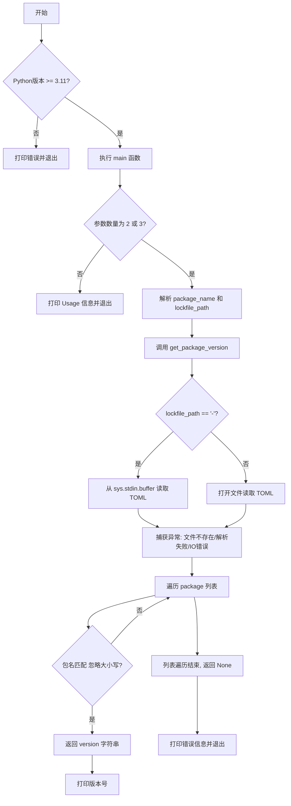

# `.\AutoGPT\.github\workflows\scripts\get_package_version_from_lockfile.py` 详细设计文档

该脚本是一个命令行工具，用于解析 Poetry 项目的 `poetry.lock` 文件，从中提取并输出指定依赖包的版本号；它支持从文件系统或标准输入读取数据，并依赖 Python 3.11 及以上版本引入的 `tomllib` 库进行 TOML 格式解析。

## 整体流程



## 类结构

```
No classes defined (纯函数式脚本)
```

## 全局变量及字段


    

## 全局函数及方法


### `get_package_version`

该函数用于从 `poetry.lock` 文件或标准输入流中读取并解析 TOML 格式的数据，根据指定的包名称（不区分大小写）查找并返回对应的版本号。

参数：

-  `package_name`：`str`，需要查找的 Python 包名称。
-  `lockfile_path`：`str`，`poetry.lock` 文件的路径。如果传值为 "-"，则从标准输入读取数据。

返回值：`str | None`，如果成功找到包则返回版本字符串；如果遍历完列表未找到则返回 None。注意：当发生文件读取或解析错误时，函数会调用 sys.exit(1) 终止程序。

#### 流程图

```mermaid
flowchart TD
    A([开始]) --> B{lockfile_path 是否为 '-'}
    B -- 是 --> C[data = tomllib.load<br>sys.stdin.buffer]
    B -- 否 --> D[打开文件 lockfile_path<br>以二进制读模式 'rb']
    D --> E[data = tomllib.load f]
    C --> F{文件读取或解析成功?}
    E --> F
    F -- 否 (FileNotFound/DecodeError/Other) --> G[打印错误信息至 stderr] --> H[sys.exit 1]
    F -- 是 --> I[获取 data 中的 'package' 列表<br>若不存在则默认为空列表]
    I --> J[遍历 packages 列表]
    J --> K{当前包名(小写) 是否等于<br>package_name(小写)}
    K -- 是 --> L[返回当前包的 version 字段]
    K -- 否 --> M{是否还有下一个包}
    M -- 是 --> J
    M -- 否 --> N([返回 None])
```

#### 带注释源码

```python
def get_package_version(package_name: str, lockfile_path: str) -> str | None:
    """Extract package version from poetry.lock file."""
    try:
        # 检查是否通过标准输入读取
        if lockfile_path == "-":
            data = tomllib.load(sys.stdin.buffer)
        else:
            # 否则从指定文件路径读取
            with open(lockfile_path, "rb") as f:
                data = tomllib.load(f)
    except FileNotFoundError:
        # 处理文件未找到错误
        print(f"Error: File '{lockfile_path}' not found", file=sys.stderr)
        sys.exit(1)
    except tomllib.TOMLDecodeError as e:
        # 处理TOML格式解析错误
        print(f"Error parsing TOML file: {e}", file=sys.stderr)
        sys.exit(1)
    except Exception as e:
        # 捕获其他读取过程中的异常
        print(f"Error reading file: {e}", file=sys.stderr)
        sys.exit(1)

    # 从解析后的数据中获取包列表，若键不存在则返回空列表
    packages = data.get("package", [])
    # 遍历包列表查找匹配项
    for package in packages:
        # 不区分大小写比较包名
        if package.get("name", "").lower() == package_name.lower():
            return package.get("version")

    # 未找到匹配的包
    return None
```


### `main`

该函数是程序的入口点，负责解析命令行参数以获取包名和Poetry锁文件路径（支持从标准输入读取），调用 `get_package_version` 获取版本，并根据结果输出版本信息或错误提示。

参数：

-   无（该函数不接受参数，直接从 `sys.argv` 获取输入）

返回值：`None`，无返回值，结果直接打印到标准输出或标准错误。

#### 流程图

```mermaid
flowchart TD
    A([开始]) --> B{检查参数数量}
    B -- 2 或 3 --> C[解析 package_name = sys.argv[1]]
    B -- 否则 --> D[打印使用说明到 stderr]
    D --> E[sys.exit 1]
    
    C --> F{参数长度 == 3?}
    F -- 是 --> G[lockfile_path = sys.argv[2]]
    F -- 否 --> H[lockfile_path = poetry.lock]
    
    G --> I[调用 get_package_version]
    H --> I
    
    I --> J{获取到版本?}
    J -- 是 --> K[打印 version 到 stdout]
    K --> L([正常结束])
    J -- 否 --> M[打印未找到错误到 stderr]
    M --> N[sys.exit 1]
```

#### 带注释源码

```python
def main():
    # 验证命令行参数的数量，必须是2（仅包名）或3（包名+路径）
    if len(sys.argv) not in (2, 3):
        # 如果参数数量不正确，打印使用说明到标准错误流
        print(
            "Usages: python get_package_version_from_lockfile.py <package name> [poetry.lock path]\n"
            "        cat poetry.lock | python get_package_version_from_lockfile.py <package name> -",
            file=sys.stderr,
        )
        # 以状态码1退出程序
        sys.exit(1)

    # 获取第一个参数作为包名
    package_name = sys.argv[1]
    # 确定锁文件路径：如果提供了第三个参数则使用，否则默认为当前目录下的 "poetry.lock"
    lockfile_path = sys.argv[2] if len(sys.argv) == 3 else "poetry.lock"

    # 调用辅助函数获取包版本
    version = get_package_version(package_name, lockfile_path)

    # 如果成功获取到版本字符串
    if version:
        # 将版本打印到标准输出
        print(version)
    else:
        # 如果未找到包，打印错误信息到标准错误流
        print(f"Package '{package_name}' not found in {lockfile_path}", file=sys.stderr)
        # 以状态码1退出程序
        sys.exit(1)
```


## 关键组件


### Poetry Lock 文件解析器

负责读取并解析 `poetry.lock` 文件内容，利用 `tomllib` 库将 TOML 格式的数据转换为 Python 字典，同时处理文件系统读取和标准输入流读取两种输入源。

### 包版本查找服务

核心业务逻辑，在解析后的数据结构中遍历包列表，根据不区分大小写的包名称匹配规则，定位并返回目标包的具体版本号。

### CLI 控制器

作为程序的入口点，处理命令行参数解析、Python 版本校验、错误消息打印以及程序退出状态码的管理，协调输入适配与版本查找的执行流程。

### 输入源适配

处理灵活的输入方式，支持通过文件路径直接读取 `poetry.lock` 文件或通过管道符从标准输入（stdin）读取文件内容。


## 问题及建议


### 已知问题

-   **函数职责混淆**：`get_package_version` 函数内部在发生文件异常或解析异常时直接调用 `sys.exit(1)`。这违反了单一职责原则，导致该函数产生了终止进程的副作用，使其难以在其他模块中复用，同时也增加了单元测试的难度（需要 mock `sys.exit`）。
-   **API 契约不一致**：函数签名返回 `str | None`，暗示在未找到包时返回 `None`。然而，在发生错误（如文件不存在或格式错误）时，函数直接退出程序而不返回值。这使得调用者无法通过返回值区分“未找到包”和“发生错误”这两种情况。
-   **Python 版本强依赖**：脚本强制要求 Python 3.11 或更高版本，仅因为使用了标准库中的 `tomllib`。这限制了脚本在旧版本 Python 环境（如 3.8, 3.10）中的通用性。

### 优化建议

-   **解耦异常处理与业务逻辑**：将 `get_package_version` 中的异常捕获逻辑移除或改为抛出异常（raise），让调用者（`main` 函数）决定如何处理错误（例如打印日志并退出）。这样可以提升函数的纯粹性和可复用性。
-   **使用参数解析库**：建议使用 Python 标准库 `argparse` 替代手动解析 `sys.argv`。`argparse` 能自动生成帮助信息，处理参数个数及默认值，使代码更健壮且易于维护。
-   **增加兼容性支持**：为了支持 Python 3.11 以下版本，可以引入 `tomli` 第三方库作为 `tomllib` 的 fallback，或者使用 `try-except` 动态导入，从而扩大脚本的适用范围。
-   **引入日志模块**：建议使用 `logging` 模块替代 `print(..., file=sys.stderr)` 进行错误输出，以便更好地控制日志级别（如 INFO, ERROR）和输出格式。


## 其它


### 设计目标与约束

**设计目标：**
1. **版本查询精确性**：核心目标是准确、快速地从 Poetry 项目的 `poetry.lock` 锁文件中提取指定依赖包的版本号。
2. **输入灵活性**：支持通过文件路径直接读取锁文件，同时也支持从标准输入（stdin，通过 `-` 参数指定）读取数据，以便于在 Unix/Linux 管道链中调用。
3. **查询鲁棒性**：执行不区分大小写的包名匹配，以适应 Poetry 锁文件中可能存在的名称格式差异。

**设计约束：**
1. **Python 版本限制**：严格依赖 Python 3.11 或更高版本，因为使用了该版本引入的标准库 `tomllib` 进行 TOML 格式解析。
2. **无副作用**：设计为只读操作，不修改任何本地文件或系统状态。
3. **无第三方依赖**：仅使用 Python 标准库（`sys`, `tomllib`），确保工具轻量且易于移植。

### 外部依赖与接口契约

**外部依赖：**
1. **Python 运行环境**：Python 3.11+。
2. **标准库模块**：
   - `sys`：用于获取命令行参数、访问标准输入/输出流以及控制进程退出码。
   - `tomllib`：用于解析 TOML 格式的数据流。

**接口契约：**
1. **命令行接口 (CLI)**：
   - **参数数量**：接受 2 个或 3 个参数（包含脚本名）。
   - **参数 1 (package_name)**：字符串类型，必填。表示需要查询的包名。
   - **参数 2 (lockfile_path)**：字符串类型，选填。默认值为 `"poetry.lock"`。若传入 `"-"`，则从 `stdin` 读取数据；否则视为文件系统路径。
2. **数据输入契约**：
   - 若读取文件，文件必须存在且为有效的 TOML 格式。
   - 若读取 `stdin`，输入流必须包含有效的 TOML 格式数据。
3. **输出接口**：
   - **成功输出**：将查询到的版本字符串（`str`）打印到标准输出 (`stdout`)，并以状态码 0 退出。
   - **失败输出**：将具体的错误信息（如文件未找到、解析错误、包未找到）打印到标准错误 (`stderr`)，并以状态码 1 退出。

### 错误处理与异常设计

**设计原则：**
采用“快速失败”策略，一旦遇到错误立即终止程序并反馈，避免继续执行无意义的操作。

**异常处理策略：**
1. **文件访问异常 (`FileNotFoundError`)**：
   - **触发条件**：指定的 `lockfile_path` 不存在。
   - **处理动作**：捕获异常，向 `stderr` 输出错误信息 `Error: File '{lockfile_path}' not found`，并调用 `sys.exit(1)` 终止程序。
2. **TOML 解析异常 (`tomllib.TOMLDecodeError`)**：
   - **触发条件**：文件或 `stdin` 流中的内容不符合 TOML 格式规范。
   - **处理动作**：捕获异常，向 `stderr` 输出包含具体解析错误的详细信息 `Error parsing TOML file: {e}`，并调用 `sys.exit(1)` 终止程序。
3. **通用 I/O 异常 (`Exception`)**：
   - **触发条件**：读取文件过程中发生的其他未知错误（如权限问题等）。
   - **处理动作**：捕获异常，向 `stderr` 输出 `Error reading file: {e}`，并调用 `sys.exit(1)` 终止程序。
4. **业务逻辑错误（包未找到）**：
   - **触发条件**：成功解析文件，但未在 `package` 列表中找到匹配的包名。
   - **处理动作**：不抛出异常，但在 `main` 函数中检测返回值为 `None`，输出 `Package '{package_name}' not found in {lockfile_path}` 到 `stderr`，并调用 `sys.exit(1)` 终止程序。
5. **参数校验错误**：
   - **触发条件**：命令行参数数量不符合要求。
   - **处理动作**：打印 Usage 信息到 `stderr`，并调用 `sys.exit(1)` 终止程序。

### 数据流与状态机

**数据流处理：**
1. **输入阶段**：
   - 数据源：`sys.argv` (元组) 或 `sys.stdin.buffer` (二进制流) / 物理文件。
   - 处理：验证参数长度，确定输入源类型（文件路径或标准输入）。
2. **解析阶段**：
   - 转换：二进制流/文件 -> `tomllib.load()` -> Python 字典 (`dict`) 数据结构。
   - 提取：从字典中获取 `package` 键对应的列表 (`list`)。
3. **处理阶段**：
   - 遍历：对包列表进行线性迭代。
   - 匹配逻辑：提取列表元素中的 `name` 字段，转换为小写后与目标包名（小写）进行比对。
   - 提取：若匹配成功，提取当前元素的 `version` 字段。
4. **输出阶段**：
   - 结果：`str` (版本号) 或 `None`。
   - 动作：将版本号写入 `stdout` 或将错误信息写入 `stderr`。

**逻辑状态机：**
由于本脚本属于线性批处理工具，不存在复杂的循环状态机，其执行路径为单一链条：
`初始化检查` -> `参数解析` -> `文件加载与异常处理` -> `数据遍历与匹配` -> `结果输出与退出`。
任何异常状态（IO错误、解析错误、参数错误）都会直接跳转到 `终止状态`，不返回正常流程。

    