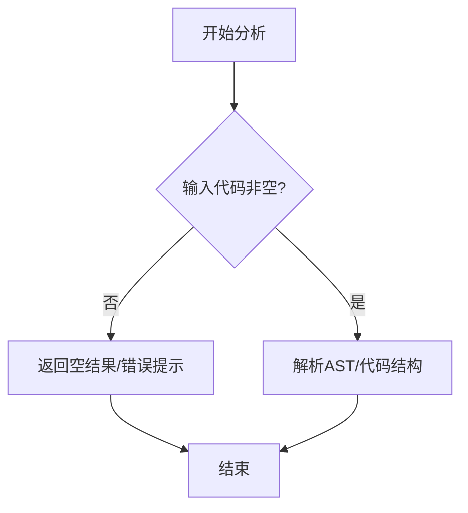

# `.\AutoGPT\autogpt_platform\autogpt_libs\autogpt_libs\__init__.py` 详细设计文档

提供的代码块为空，无法识别任何类、方法或变量。请提供有效的 Python 源代码以生成详细设计文档。

## 整体流程



## 类结构

```

```

## 全局变量及字段


    

## 全局函数及方法


## 关键组件


### 张量索引与惰性加载

用于高效访问大规模张量数据的特定切片，并支持按需从磁盘加载到内存，以优化资源使用。

### 反量化支持

提供运行时将低精度量化数值（如 INT8）转换回高精度数值（如 FP32）的功能，确保计算精度。

### 量化策略

定义模型权重的量化方案，包括量化类型、范围计算和校准方法，以平衡模型大小与性能。


## 问题及建议


### 已知问题

-   无具体代码输入，无法识别具体的已知问题或技术债务。

### 优化建议

-   建议提供目标代码，以便进行架构层面的静态分析和优化建议。


## 其它


### 设计目标与约束

本部分定义系统开发与运行必须遵循的非功能性需求和技术限制。
*   **设计目标**：明确系统的性能指标（如响应时间、吞吐量、并发用户数）、可用性指标（如 SLA 99.9%）、可扩展性（支持水平扩展）、可维护性及安全性目标。
*   **约束条件**：列举技术栈约束（如指定的编程语言版本、框架）、运行环境约束（如操作系统、容器规格）、法规合规性约束（如数据隐私保护）以及架构设计原则（如高内聚低耦合）。

### 错误处理与异常设计

本部分阐述系统如何应对和处理运行时错误及异常情况。
*   **异常体系**：定义自定义异常类的层次结构，区分业务异常、系统异常及第三方服务异常。
*   **处理策略**：描述全局异常拦截机制、统一的错误码规范、错误信息返回格式以及日志记录策略（如堆栈信息记录级别）。
*   **容错机制**：说明针对关键错误的重试策略（如指数退避）、熔断降级策略以及事务回滚规则。

### 数据流与状态机

本部分描述核心数据在系统内的流转路径及关键业务对象的状态变迁。
*   **数据流**：梳理数据从外部输入（如 API 请求、消息队列）经过各层组件（控制器、服务层、数据访问层）的处理逻辑，最终输出或持久化的全过程。
*   **状态机**：针对核心实体（如订单、任务）定义其生命周期内的所有状态（如初始化、处理中、成功、失败）、状态流转的触发事件、条件判断以及状态变更后的副作用（如发送通知、更新数据库）。

### 外部依赖与接口契约

本部分列出系统依赖的所有外部服务、组件及库，并明确交互规范。
*   **依赖清单**：列出数据库、中间件（缓存、消息队列）、第三方 API 等外部依赖。
*   **接口契约**：详细描述每个外部依赖的调用方式（同步/异步）、接口定义（URL、Method）、请求与响应的数据结构（Schema）、超时时间设置、限流策略以及依赖不可用时的降级处理方案。

    