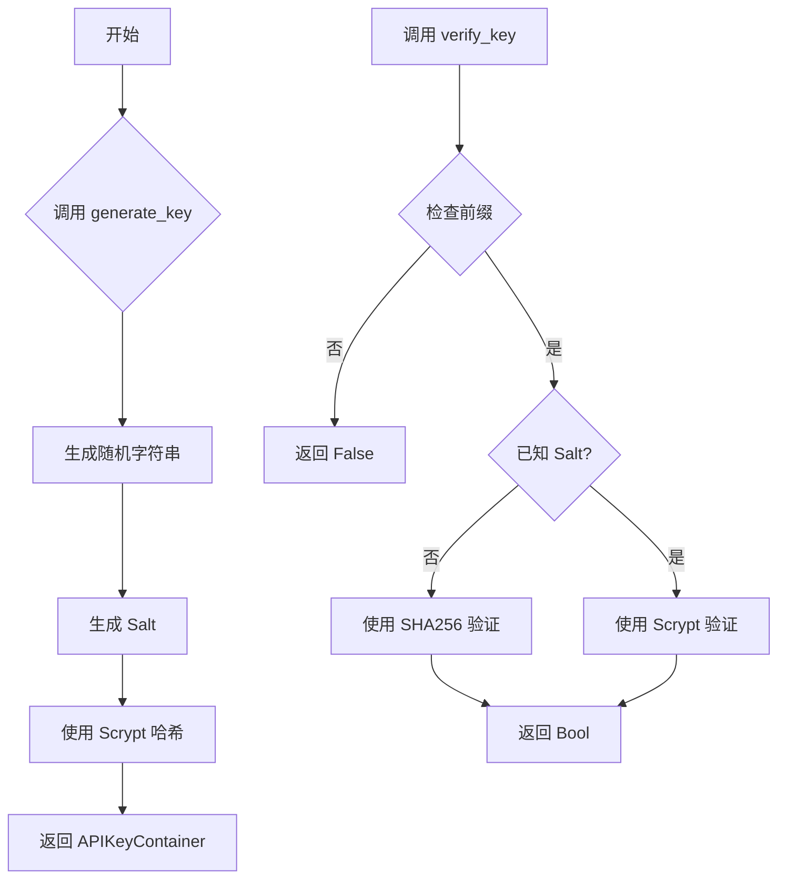
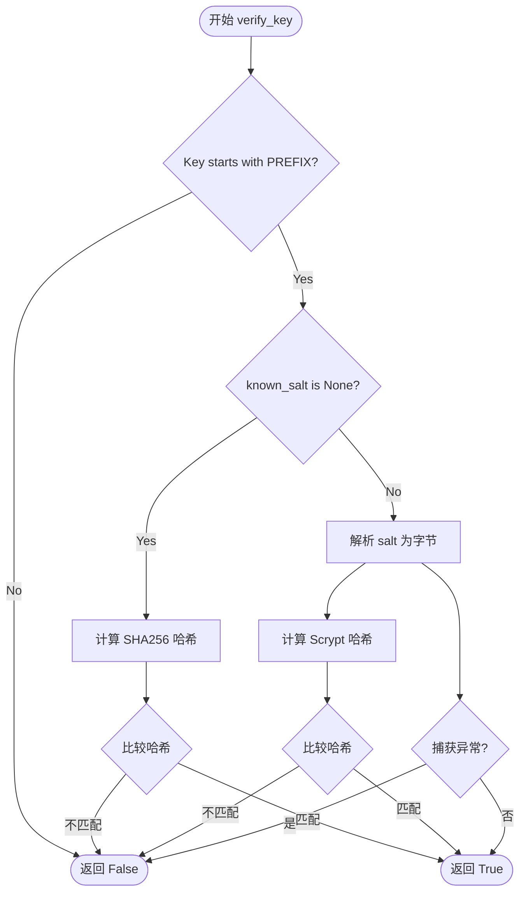
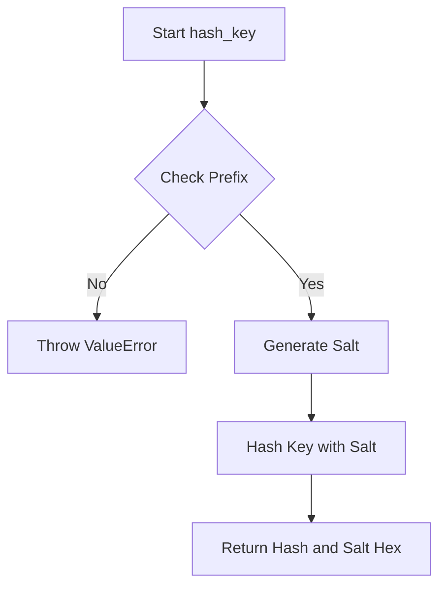
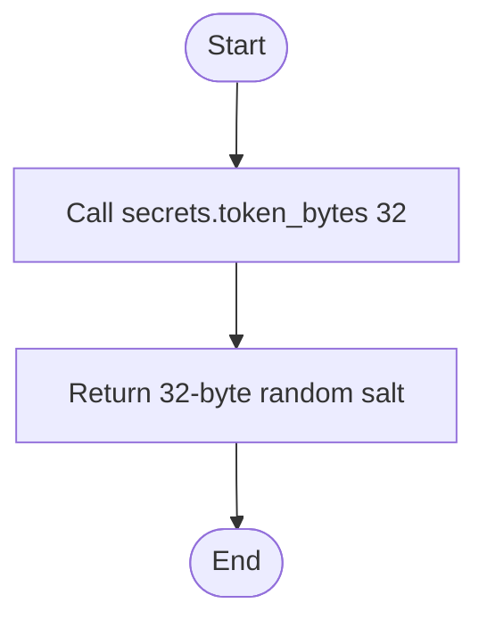
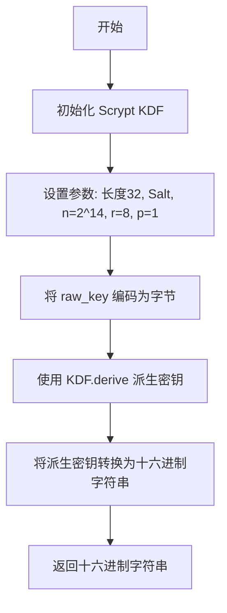

# `.\AutoGPT\autogpt_platform\autogpt_libs\autogpt_libs\api_key\keysmith.py` 详细设计文档

This module provides a secure utility for generating and validating API keys. It utilizes the 'secrets' module for cryptographic randomness and Scrypt (via the cryptography library) for secure key hashing. The system generates keys with a specific prefix, splits them into head and tail components for display, and stores a cryptographic hash and salt for verification, while also supporting legacy SHA256 hash verification for backward compatibility.

## 整体流程



## 类结构

```
APIKeyContainer (NamedTuple)
└── APIKeySmith (Class)
```

## 全局变量及字段


### `PREFIX`
    
The prefix added to all generated keys (e.g., 'agpt_').

类型：`str`
    


### `HEAD_LENGTH`
    
Length of the head part of the key (8 characters).

类型：`int`
    


### `TAIL_LENGTH`
    
Length of the tail part of the key (8 characters).

类型：`int`
    


### `APIKeyContainer.key`
    
The full generated API key string.

类型：`str`
    


### `APIKeyContainer.head`
    
The first 8 characters of the key.

类型：`str`
    


### `APIKeyContainer.tail`
    
The last 8 characters of the key.

类型：`str`
    


### `APIKeyContainer.hash`
    
The cryptographic hash of the key.

类型：`str`
    


### `APIKeyContainer.salt`
    
The salt used for hashing.

类型：`str`
    


### `APIKeySmith.PREFIX`
    
The prefix added to all generated keys (e.g., 'agpt_').

类型：`str`
    


### `APIKeySmith.HEAD_LENGTH`
    
Length of the head part of the key (8 characters).

类型：`int`
    


### `APIKeySmith.TAIL_LENGTH`
    
Length of the tail part of the key (8 characters).

类型：`int`
    
    

## 全局函数及方法


### `APIKeySmith.generate_key`

该方法负责生成一个新的 API 密钥，通过组合固定前缀和随机令牌创建唯一标识符，对其进行安全哈希处理以生成存储的哈希值和盐值，并返回一个包含原始密钥、头部、尾部、哈希值和盐值的容器对象。

参数：

-  无

返回值：`APIKeyContainer`，一个包含密钥、头部、尾部、哈希值和盐值的 NamedTuple。

#### 流程图

```mermaid
flowchart TD
    A[Start: generate_key] --> B[Construct raw_key: PREFIX + secrets.token_urlsafe]
    B --> C[Call hash_key to obtain hash and salt]
    C --> D[Extract head: raw_key[:HEAD_LENGTH]]
    C --> E[Extract tail: raw_key[-TAIL_LENGTH:]]
    D --> F[Return APIKeyContainer]
    E --> F
    F --> G[End]
```

#### 带注释源码

```python
def generate_key(self) -> APIKeyContainer:
    """Generate a new API key with secure hashing."""
    # 1. 构建原始密钥字符串，使用固定前缀和 32 字节的 URL 安全随机令牌
    raw_key = f"{self.PREFIX}{secrets.token_urlsafe(32)}"
    
    # 2. 对原始密钥进行哈希处理，获取安全哈希值和盐值
    hash, salt = self.hash_key(raw_key)

    # 3. 返回包含完整信息的容器对象
    return APIKeyContainer(
        key=raw_key,
        head=raw_key[: self.HEAD_LENGTH],  # 提取前 8 个字符作为头部
        tail=raw_key[-self.TAIL_LENGTH :],  # 提取后 8 个字符作为尾部
        hash=hash,
        salt=salt,
    )
```


### APIKeySmith.verify_key

该函数用于验证一个提供的 API 密钥是否与已知的哈希值（以及可选的盐值）匹配。它支持两种哈希算法：用于遗留系统的 SHA256 和用于现代系统的 Scrypt，确保了向后兼容性和安全性。

参数：

-  `provided_key`：`str`，待验证的 API 密钥。
-  `known_hash`：`str`，已知的哈希值。
-  `known_salt`：`str | None`，已知的盐值（可选，用于遗留 SHA256 支持）。

返回值：`bool`，如果密钥匹配哈希值则返回 `True`，否则返回 `False`。

#### 流程图



#### 带注释源码

```python
def verify_key(
    self, provided_key: str, known_hash: str, known_salt: str | None = None
) -> bool:
    """
    Verify an API key against a known hash (+ salt).
    Supports verifying both legacy SHA256 and secure Scrypt hashes.
    """
    # 1. 前缀验证：确保密钥以预期的前缀开头，防止无效输入。
    if not provided_key.startswith(self.PREFIX):
        return False

    # 2. 遗留支持：如果未提供 salt，则假定使用旧的 SHA256 哈希。
    if known_salt is None:
        legacy_hash = hashlib.sha256(provided_key.encode()).hexdigest()
        return secrets.compare_digest(legacy_hash, known_hash)

    # 3. 安全验证：使用 Scrypt 和提供的 salt 验证密钥。
    try:
        salt_bytes = bytes.fromhex(known_salt)
        provided_hash = self._hash_key_with_salt(provided_key, salt_bytes)
        return secrets.compare_digest(provided_hash, known_hash)
    # 4. 错误处理：处理无效的 salt 格式或类型错误。
    except (ValueError, TypeError):
        return False
```

### 1. 概述

该代码实现了一个安全的 API 密钥管理系统，利用 Scrypt 密钥派生函数（KDF）确保高安全性，同时提供对遗留 SHA256 哈希的向后兼容支持。它生成带有特定前缀、头部和尾部部分的密钥，并包含用于安全验证和迁移的实用方法。

### 2. 文件的整体运行流程

1.  **密钥生成 (`generate_key`)**：系统首先生成一个包含随机字符串和固定前缀的原始密钥，然后使用 Scrypt 算法对其进行哈希处理并生成随机盐值。最终返回一个包含密钥各部分（原始值、头部、尾部、哈希、盐）的容器对象。
2.  **密钥验证 (`verify_key`)**：验证过程首先检查密钥前缀，随后根据是否提供盐值决定使用 SHA256（遗留模式）还是 Scrypt（安全模式）进行哈希计算。最后使用安全的比较函数（`secrets.compare_digest`）将计算结果与已知哈希值进行比对。
3.  **密钥迁移 (`hash_key`)**：该函数用于将旧的 SHA256 哈希密钥迁移到新的 Scrypt 格式，通过生成新的盐值并重新计算哈希来实现。

### 3. 类的详细信息

#### 3.1 APIKeyContainer (NamedTuple)

**描述**：用于存储 API 密钥及其相关元数据的不可变容器。

**字段**：

-  `key`：`str`，完整的 API 密钥字符串。
-  `head`：`str`，密钥的前 8 个字符。
-  `tail`：`str`，密钥的后 8 个字符。
-  `hash`：`str`，密钥的哈希值。
-  `salt`：`str`，用于生成哈希的盐值。

#### 3.2 APIKeySmith

**描述**：API 密钥管理的主类，负责生成、验证和迁移密钥。

**类字段**：

-  `PREFIX`：`str`，API 密钥的前缀标识符，默认为 "agpt_"。
-  `HEAD_LENGTH`：`int`，密钥头部截取的长度，默认为 8。
-  `TAIL_LENGTH`：`int`，密钥尾部截取的长度，默认为 8。

**类方法**：

-  `generate_key`：生成一个新的 API 密钥。
-  `verify_key`：验证提供的密钥是否有效。
-  `hash_key`：将旧密钥迁移到新的哈希格式。
-  `_generate_salt`：生成随机的盐值。
-  `_hash_key_with_salt`：使用 Scrypt 算法对密钥进行哈希。

#### 3.3 全局变量与函数

-  `hashlib`：Python 标准库，用于遗留 SHA256 哈希计算。
-  `secrets`：Python 标准库，用于生成安全的随机数和安全的字符串比较。
-  `Scrypt`：来自 `cryptography` 库，用于实现高性能的密钥派生函数。

### 4. 关键组件信息

-  **APIKeySmith**：核心管理类，封装了所有密钥逻辑。
-  **Scrypt KDF**：用于生成高强度的密钥哈希，防止彩虹表攻击。
-  **secrets.compare_digest**：防止时序攻击的安全比较函数，用于验证哈希结果。

### 5. 潜在的技术债务或优化空间

1.  **硬编码参数**：Scrypt 的参数（n=2**14, r=8, p=1）是硬编码的。随着硬件性能的提升，这些参数可能需要定期调整以保持安全性。
2.  **缺少日志记录**：在 `verify_key` 中，当验证失败时（无论是前缀错误还是哈希不匹配），都没有记录日志。在生产环境中，这可能导致难以追踪安全尝试。
3.  **遗留逻辑耦合**：`verify_key` 方法中混合了遗留 SHA256 逻辑和现代 Scrypt 逻辑，虽然通过 `known_salt` 参数解决了，但代码分支较多，未来维护可能增加复杂度。

### 6. 其它项目

#### 设计目标与约束
-   **安全性**：优先使用 `secrets` 模块和 `Scrypt` 算法，避免使用不安全的 MD5 或 SHA1。
-   **向后兼容**：必须支持验证旧的 SHA256 哈希值，以便在系统迁移期间不中断现有服务。
-   **不可变性**：使用 `NamedTuple` 存储密钥数据，确保数据一旦生成不可被修改。

#### 错误处理与异常设计
-   **输入验证**：在 `verify_key` 中，如果 `known_salt` 格式错误（无法转换为字节），会捕获 `ValueError` 并返回 `False`，而不是抛出异常。
-   **前缀检查**：强制要求密钥必须以特定前缀开头，这是一种简单的防御性编程手段。

#### 数据流与状态机
-   **生成状态**：原始字符串 -> 哈希 + 盐 -> 容器对象。
-   **验证状态**：输入字符串 -> 前缀检查 -> 哈希计算 -> 比较结果 -> 布尔值。

#### 外部依赖与接口契约
-   **依赖**：依赖 `cryptography` 库（`Scrypt` 实现）。
-   **接口**：`verify_key` 接受字符串类型的密钥和哈希，返回布尔值，不涉及网络或文件 I/O。


### APIKeySmith.hash_key

该方法将原始 API Key 字符串转换为安全哈希值和随机盐值，使用 Scrypt 密钥派生函数，确保存储的密钥不可逆且安全，同时支持从旧版 SHA256 哈希的迁移。

#### 整体运行流程

该代码模块主要围绕 API Key 的生成、存储和验证展开。`APIKeySmith` 类作为核心控制器，通过 `generate_key` 方法生成包含原始 Key、头部、尾部、哈希值和盐值的完整容器对象。`verify_key` 方法负责验证 Key 的有效性，支持新旧两种哈希算法的兼容。`hash_key` 方法是核心转换器，它接收原始 Key，生成随机盐值并计算 Scrypt 哈希，返回用于存储的哈希和盐值对。

#### 类的详细信息

**类字段：**
- `PREFIX`: str
- `HEAD_LENGTH`: int
- `TAIL_LENGTH`: int

**类方法：**
- `generate_key()`
- `verify_key(provided_key, known_hash, known_salt)`
- `hash_key(raw_key)`
- `_generate_salt()`
- `_hash_key_with_salt(raw_key, salt)`

#### 类字段和全局变量详情

- **`PREFIX`**: `str`，API Key 的固定前缀，用于标识和快速过滤。
- **`HEAD_LENGTH`**: `int`，API Key 头部截取的长度，用于展示或部分验证。
- **`TAIL_LENGTH`**: `int`，API Key 尾部截取的长度，用于展示或部分验证。

#### 类方法和全局函数详情

**`hash_key`**

参数：

-  `raw_key`：`str`，The raw key string to hash

返回值：`tuple[str, str]`，A tuple containing the hash string and the salt string.

#### 流程图



#### 带注释源码

```python
def hash_key(self, raw_key: str) -> tuple[str, str]:
    """Migrate a legacy hash to secure hash format."""
    # 1. 验证输入格式，确保 Key 符合规范
    if not raw_key.startswith(self.PREFIX):
        raise ValueError("Key without 'agpt_' prefix would fail validation")

    # 2. 生成一个 32 字节的随机盐值，用于增加哈希的不可预测性
    salt = self._generate_salt()

    # 3. 使用 Scrypt 算法结合盐值对原始 Key 进行加密哈希
    hash = self._hash_key_with_salt(raw_key, salt)

    # 4. 返回哈希值和盐值的十六进制字符串，盐值用于后续验证
    return hash, salt.hex()
```

#### 关键组件信息

- **`APIKeyContainer`**: 一个命名元组，用于封装 API Key 的各个组成部分（原始 Key、头部、尾部、哈希、盐值），提供类型安全和结构化数据访问。
- **`Scrypt`**: 密钥派生函数，相比传统的 SHA256，Scrypt 更适合密码存储，因为它对内存使用有要求，能有效抵抗暴力破解和 GPU 攻击。
- **`secrets`**: Python 标准库，用于生成加密安全的随机数，确保盐值和 Token 的随机性。

#### 潜在的技术债务或优化空间

1.  **硬编码的 Scrypt 参数**：`_hash_key_with_salt` 方法中的 `n=2**14`, `r=8`, `p=1` 是硬编码的。在高性能计算环境或移动设备上，这些参数可能需要根据硬件能力动态调整，或者作为配置项暴露。
2.  **私有方法的依赖**：`hash_key` 方法依赖私有的 `_generate_salt` 和 `_hash_key_with_salt`。如果未来需要支持自定义盐值生成器或不同的哈希算法（例如 PBKDF2），可能需要重构这些私有方法为受保护的或可配置的。
3.  **错误处理粒度**：`verify_key` 方法中的异常捕获范围较宽（`except (ValueError, TypeError)`），虽然能防止崩溃，但可能掩盖了具体的错误原因，不利于调试。

#### 其它项目

**设计目标与约束：**
- **安全性**：核心目标是防止 API Key 被逆向推导，通过加盐哈希和 Scrypt 算法实现。
- **兼容性**：设计支持从旧版 SHA256 哈希迁移到新版 Scrypt 哈希，确保系统平滑升级。

**错误处理与异常设计：**
- 在 `hash_key` 中，如果输入的 `raw_key` 不以 `PREFIX` 开头，会抛出 `ValueError`，因为不符合预期的 Key 格式无法通过验证。
- 在 `verify_key` 中，如果遇到无效的盐值格式或类型错误，会捕获异常并返回 `False`，表示验证失败，这是一种防御性编程策略。

**数据流与状态机：**
- **生成状态**：`generate_key` -> 生成随机 Token -> 调用 `hash_key` -> 生成哈希/盐值 -> 封装为 `APIKeyContainer`。
- **验证状态**：`verify_key` -> 检查前缀 -> 判断哈希类型（旧版/新版） -> 计算哈希 -> 比较结果。

**外部依赖与接口契约：**
- **依赖**：`cryptography.hazmat.primitives.kdf.scrypt` (Scrypt 实现)。
- **接口契约**：`hash_key` 方法必须接收符合 `PREFIX` 规范的字符串，并返回一个包含哈希和盐值的元组。


### `APIKeySmith._generate_salt`

Generates a cryptographically secure random 32-byte salt to be used as a unique input for key derivation functions (specifically Scrypt) to ensure the hash is unique even if the same API key is used multiple times.

参数：

-  无

返回值：`bytes`，A 32-byte random salt.

#### 流程图



#### 带注释源码

```
    def _generate_salt(self) -> bytes:
        """Generate a random salt for hashing."""
        # 使用 secrets.token_bytes 生成加密安全的随机字节
        # 32 字节的长度与 Scrypt KDF 的配置参数相匹配
        return secrets.token_bytes(32)
```


### 核心功能概述

该函数利用 Scrypt 密钥派生函数，结合提供的随机 salt，将原始 API key 字符串安全地转换为十六进制格式的哈希值，旨在提供高强度的密钥保护，防止暴力破解。

### 文件整体运行流程

该代码实现了一个安全的 API Key 管理系统。`APIKeySmith` 类负责生成带有前缀的随机密钥，将其拆分为 head 和 tail 用于展示，并使用 Scrypt 算法配合随机 salt 对密钥进行哈希存储。`verify_key` 方法支持验证新旧两种格式的哈希（包括遗留的 SHA256 和现代的 Scrypt），而 `hash_key` 方法则用于将旧格式迁移到新格式。

### 类的详细信息

#### APIKeyContainer (NamedTuple)
**描述**: 用于存储 API Key 的各个组成部分的不可变数据结构。

**字段**:
- `key`: `str`, 原始的完整 API Key 字符串。
- `head`: `str`, Key 的前 8 个字符。
- `tail`: `str`, Key 的后 8 个字符。
- `hash`: `str`, Key 的哈希值。
- `salt`: `str`, 用于生成哈希的盐值（十六进制字符串）。

#### APIKeySmith
**描述**: API Key 的生成、验证和哈希处理的核心类。

**类字段**:
- `PREFIX`: `str`, API Key 的固定前缀，默认为 "agpt_"。
- `HEAD_LENGTH`: `int`, Key 头部截取长度，默认为 8。
- `TAIL_LENGTH`: `int`, Key 尾部截取长度，默认为 8。

**类方法**:
- `generate_key()`: 生成一个新的 API Key 实例。
- `verify_key(provided_key, known_hash, known_salt)`: 验证提供的 Key 是否匹配已知的哈希值。
- `hash_key(raw_key)`: 将原始 Key 迁移到新的 Scrypt 哈希格式。
- `_generate_salt()`: 生成 32 字节的随机盐值。
- `_hash_key_with_salt(raw_key, salt)`: 使用 Scrypt 对 Key 进行哈希处理（目标函数）。

### 关键组件信息
- **Scrypt**: 一种基于 CPU 和内存的密钥派生函数，比传统的 SHA256 更难通过 GPU 破解。
- **secrets**: Python 标准库，用于生成安全的随机数，确保盐值和 Token 的随机性。
- **APIKeyContainer**: 数据传输对象，封装了 Key 的所有相关元数据。

### 潜在的技术债务或优化空间
1.  **硬编码的 Scrypt 参数**: `n=2**14`, `r=8`, `p=1` 硬编码在方法中。在高性能计算环境或低性能设备上，这些参数可能需要根据硬件能力动态调整。
2.  **缺乏日志记录**: `verify_key` 方法在捕获异常时直接返回 `False`，如果发生错误（如无效的十六进制字符串），系统无法追踪潜在的安全问题。
3.  **前缀验证逻辑分散**: 前缀验证逻辑分散在 `verify_key` 和 `hash_key` 中，如果未来需要修改前缀，需要修改多处代码。

### 其它项目

#### 设计目标与约束
- **安全性**: 使用 Scrypt 和随机 Salt 确保存储的哈希值无法被逆向推导或通过彩虹表攻击。
- **向后兼容性**: `verify_key` 方法支持验证旧的 SHA256 哈希，允许平滑迁移。
- **可读性**: Key 被拆分为 head 和 tail，便于在 UI 或日志中展示部分信息而不暴露完整 Key。

#### 错误处理与异常设计
- **验证失败**: `verify_key` 在 Key 无效或哈希不匹配时返回 `False`，不抛出异常，确保 API 的健壮性。
- **迁移错误**: `hash_key` 在 Key 缺少前缀时会抛出 `ValueError`，提示调用者修正输入。

#### 数据流与状态机
- **生成流程**: 生成随机 Token -> 拆分 Head/Tail -> 生成 Salt -> Scrypt 哈希 -> 组装 Container。
- **验证流程**: 检查前缀 -> 判断是否有 Salt -> (有 Salt 则 Scrypt 哈希比对 / 无 Salt 则 SHA256 哈希比对) -> 返回布尔值。

#### 外部依赖与接口契约
- **依赖**: `cryptography.hazmat.primitives.kdf.scrypt.Scrypt`。
- **接口契约**: `_hash_key_with_salt` 接受字符串和字节，返回字符串；`verify_key` 接受字符串和可选的字符串/None，返回布尔值。

### `APIKeySmith._hash_key_with_salt`

该函数使用 Scrypt 算法对原始 Key 进行加密哈希，结合 Salt 增加安全性。

**参数**:
-  `raw_key`: `str`, 待哈希的原始 API Key 字符串。
-  `salt`: `bytes`, 用于混淆哈希结果的随机盐值。

**返回值**: `str`, 哈希后的十六进制字符串。

#### 流程图



#### 带注释源码

```python
    def _hash_key_with_salt(self, raw_key: str, salt: bytes) -> str:
        """Hash API key using Scrypt with salt."""
        # 初始化 Scrypt 密钥派生函数
        # length=32: 输出密钥长度
        # salt=salt: 提供的随机盐值
        # n=2**14: CPU/Memory 成本参数，越高越安全但越慢
        # r=8: 块大小参数
        # p=1: 并行化参数
        kdf = Scrypt(
            length=32,
            salt=salt,
            n=2**14,  # CPU/memory cost parameter
            r=8,  # Block size parameter
            p=1,  # Parallelization parameter
        )
        # 使用原始 Key 的字节表示派生密钥
        key_hash = kdf.derive(raw_key.encode())
        # 将派生出的二进制密钥转换为十六进制字符串以便存储
        return key_hash.hex()
```


## 关键组件


### 一段话描述

该代码实现了一个基于 Scrypt 算法的安全 API 密钥生成与验证系统。它通过 `APIKeyContainer` 存储密钥的各个部分（原始密钥、头部、尾部、哈希值和盐值），并利用 `APIKeySmith` 类处理密钥的生成、哈希计算以及兼容旧版 SHA256 的验证逻辑，确保了密钥存储和验证的安全性及向后兼容性。

### 文件的整体运行流程

整体运行流程始于 `generate_key` 方法，该方法生成随机令牌并添加固定前缀，随后使用 Scrypt 算法进行哈希处理，最后将密钥分割为头部和尾部。验证流程 `verify_key` 首先检查前缀，然后根据是否存在盐值决定使用 SHA256（旧版）还是 Scrypt（新版）进行哈希比对，最终返回验证结果。

### 类的详细信息

#### APIKeyContainer (NamedTuple)
*   **key**: str - 完整的 API 密钥字符串。
*   **head**: str - 密钥的前 8 个字符。
*   **tail**: str - 密钥的后 8 个字符。
*   **hash**: str - 密钥的哈希值。
*   **salt**: str - 用于哈希的盐值。

#### APIKeySmith
*   **类字段**:
    *   `PREFIX`: str - 密钥的前缀常量 "agpt_"。
    *   `HEAD_LENGTH`: int - 头部字符长度 (8)。
    *   `TAIL_LENGTH`: int - 尾部字符长度 (8)。

*   **类方法**:
    *   **generate_key()**
        *   **参数**: 无
        *   **返回值**: APIKeyContainer - 包含生成密钥各部分的容器。
        *   **流程图**:
            ```mermaid
            graph TD
            A[Start] --> B[Generate Random Token]
            B --> C[Add Prefix]
            C --> D[Generate Salt]
            D --> E[Hash Key with Scrypt]
            E --> F[Split Key into Head/Tail]
            F --> G[Return APIKeyContainer]
            ```
        *   **带注释源码**:
            ```python
            def generate_key(self) -> APIKeyContainer:
                """Generate a new API key with secure hashing."""
                # 生成随机令牌并添加前缀
                raw_key = f"{self.PREFIX}{secrets.token_urlsafe(32)}"
                # 生成哈希和盐值
                hash, salt = self.hash_key(raw_key)

                # 返回包含密钥各部分的容器
                return APIKeyContainer(
                    key=raw_key,
                    head=raw_key[: self.HEAD_LENGTH],
                    tail=raw_key[-self.TAIL_LENGTH :],
                    hash=hash,
                    salt=salt,
                )
            ```

    *   **verify_key(provided_key, known_hash, known_salt)**
        *   **参数**:
            *   `provided_key`: str - 待验证的密钥。
            *   `known_hash`: str - 已知的哈希值。
            *   `known_salt`: str | None - 已知的盐值（可选）。
        *   **返回值**: bool - 验证是否通过。
        *   **流程图**:
            ```mermaid
            graph TD
            A[Start] --> B{Check Prefix}
            B -- No --> C[Return False]
            B -- Yes --> D{Known Salt Present?}
            D -- No --> E[Hash with SHA256]
            E --> F[Compare Digests]
            D -- Yes --> G[Decode Salt]
            G --> H[Hash with Scrypt]
            H --> F
            F --> I[Return Boolean]
            ```
        *   **带注释源码**:
            ```python
            def verify_key(
                self, provided_key: str, known_hash: str, known_salt: str | None = None
            ) -> bool:
                """
                Verify an API key against a known hash (+ salt).
                Supports verifying both legacy SHA256 and secure Scrypt hashes.
                """
                # 检查前缀
                if not provided_key.startswith(self.PREFIX):
                    return False

                # 处理旧版 SHA256 哈希（迁移支持）
                if known_salt is None:
                    legacy_hash = hashlib.sha256(provided_key.encode()).hexdigest()
                    return secrets.compare_digest(legacy_hash, known_hash)

                try:
                    # 解码盐值并使用 Scrypt 验证
                    salt_bytes = bytes.fromhex(known_salt)
                    provided_hash = self._hash_key_with_salt(provided_key, salt_bytes)
                    return secrets.compare_digest(provided_hash, known_hash)
                except (ValueError, TypeError):
                    return False
            ```

    *   **hash_key(raw_key)**
        *   **参数**: `raw_key` (str) - 原始密钥。
        *   **返回值**: tuple[str, str] - (哈希值, 盐值十六进制字符串)。
        *   **流程图**:
            ```mermaid
            graph TD
            A[Start] --> B{Check Prefix}
            B -- No --> C[Raise ValueError]
            B -- Yes --> D[Generate Salt]
            D --> E[Hash Key with Scrypt]
            E --> F[Return Hash and Salt]
            ```
        *   **带注释源码**:
            ```python
            def hash_key(self, raw_key: str) -> tuple[str, str]:
                """Migrate a legacy hash to secure hash format."""
                if not raw_key.startswith(self.PREFIX):
                    raise ValueError("Key without 'agpt_' prefix would fail validation")

                salt = self._generate_salt()
                hash = self._hash_key_with_salt(raw_key, salt)
                return hash, salt.hex()
            ```

    *   **_generate_salt()**
        *   **参数**: 无
        *   **返回值**: bytes - 32 字节的随机盐值。
        *   **流程图**:
            ```mermaid
            graph TD
            A[Start] --> B[Generate 32 Random Bytes]
            B --> C[Return Salt]
            ```
        *   **带注释源码**:
            ```python
            def _generate_salt(self) -> bytes:
                """Generate a random salt for hashing."""
                return secrets.token_bytes(32)
            ```

    *   **_hash_key_with_salt(raw_key, salt)**
        *   **参数**:
            *   `raw_key` (str) - 原始密钥。
            *   `salt` (bytes) - 盐值。
        *   **返回值**: str - 哈希值的十六进制字符串。
        *   **流程图**:
            ```mermaid
            graph TD
            A[Start] --> B[Initialize Scrypt KDF]
            B --> C[Derive Key]
            C --> D[Return Hex String]
            ```
        *   **带注释源码**:
            ```python
            def _hash_key_with_salt(self, raw_key: str, salt: bytes) -> str:
                """Hash API key using Scrypt with salt."""
                # 配置 Scrypt 参数
                kdf = Scrypt(
                    length=32,
                    salt=salt,
                    n=2**14,  # CPU/memory cost parameter
                    r=8,      # Block size parameter
                    p=1,      # Parallelization parameter
                )
                # 派生密钥
                key_hash = kdf.derive(raw_key.encode())
                return key_hash.hex()
            ```

### 关键组件信息

*   **APIKeyContainer**: 一个不可变的 NamedTuple，用于封装生成的 API 密钥的所有相关部分（原始密钥、头部、尾部、哈希值和盐值）。
*   **APIKeySmith**: 核心业务类，负责 API 密钥的生成、哈希计算以及验证逻辑的实现。
*   **Scrypt KDF**: 一种基于密码学的密钥派生函数，用于生成安全的哈希值，防止彩虹表攻击。
*   **Legacy Support**: 一个兼容层，允许系统验证使用旧版 SHA256 算法生成的密钥，支持从旧系统平滑迁移。

### 潜在的技术债务或优化空间

*   **硬编码参数**: Scrypt 的参数（N=2^14, r=8, p=1）被硬编码在 `_hash_key_with_salt` 方法中。这限制了在不修改代码的情况下调整安全级别或性能权衡的能力。
*   **缺乏详细错误上下文**: `verify_key` 方法返回一个简单的布尔值，调用者无法区分验证失败是由于前缀错误、哈希不匹配还是盐值格式错误，这可能会增加调试难度。
*   **无密钥轮换机制**: 代码中没有提供撤销或轮换现有密钥的机制，一旦密钥泄露，只能通过更改系统逻辑来处理。

### 其它项目信息

*   **设计目标与约束**:
    *   **安全性**: 使用 Scrypt 和随机盐值确保密钥存储安全。
    *   **兼容性**: 支持旧版 SHA256 验证，确保系统升级时的平滑过渡。
    *   **约束**: 生成的密钥必须以 "agpt_" 前缀开头。
*   **错误处理与异常设计**:
    *   在 `hash_key` 中，如果输入的密钥没有前缀，会抛出 `ValueError`。
    *   在 `verify_key` 中，捕获了 `ValueError` 和 `TypeError`，以处理盐值解码失败或无效输入的情况，防止程序崩溃。
*   **数据流与状态机**:
    *   数据流从原始字符串输入开始，经过 Scrypt 派生函数，转换为十六进制字符串存储。
    *   验证过程是一个状态机，根据是否存在 `known_salt` 在 SHA256 和 Scrypt 两种验证模式之间切换。
*   **外部依赖与接口契约**:
    *   依赖 `cryptography` 库的 `Scrypt` 实现。
    *   `APIKeyContainer` 定义了数据交换的契约，确保所有生成的密钥都包含必要的验证信息。


## 问题及建议


### 已知问题

-   **硬编码的密钥结构参数**：`HEAD_LENGTH` 和 `TAIL_LENGTH` 硬编码在类中，缺乏灵活性，若需调整密钥格式需修改源码。
-   **Scrypt 参数硬编码**：`n`, `r`, `p` 参数硬编码，无法根据当前硬件性能动态调整，可能导致性能瓶颈或安全性不足。
-   **方法命名歧义**：`hash_key` 方法名暗示“迁移”，但实际上是“生成新哈希”，容易引起误解。
-   **内存安全风险**：`APIKeyContainer` 包含完整的 `key` 字符串，如果该对象被意外记录日志或存储在内存中，可能导致密钥泄露。
-   **验证逻辑的隐式假设**：`verify_key` 方法假设 `known_salt` 为 `None` 时即为 SHA256 旧格式，这种隐式约定在代码维护中容易出错。

### 优化建议

-   **配置外部化**：将 `PREFIX`, `HEAD_LENGTH`, `TAIL_LENGTH` 以及 Scrypt 参数提取为配置类或环境变量，提高系统的可维护性和可配置性。
-   **增强日志记录**：在 `verify_key` 方法中，当捕获异常返回 `False` 时，建议添加日志记录，以便在出现误报或攻击尝试时进行排查。
-   **方法重命名**：将 `hash_key` 重命名为更明确的名称，例如 `generate_secure_hash`，以准确反映其功能。
-   **内存安全优化**：考虑使用 `memoryview` 或 `bytearray` 处理密钥，减少内存中明文密钥的驻留时间，或者提供不存储完整 `key` 的容器选项。
-   **参数验证优化**：在 `verify_key` 中，如果 `known_salt` 为 `None` 但 `known_hash` 长度不符合 SHA256 (64 chars)，应直接返回 `False`，避免不必要的计算。


## 其它


### 核心功能概述

该代码实现了一个安全的 API 密钥生成与验证系统，利用 Scrypt 密钥派生函数进行哈希处理，并支持从旧版 SHA256 哈希的迁移，同时将密钥拆分为头部和尾部以便于展示。

### 整体运行流程

系统首先通过 `generate_key` 方法生成一个带有随机盐值的密钥，使用 Scrypt 算法进行哈希并分割密钥。随后，在验证阶段，`verify_key` 方法会检查密钥前缀，根据是否存在盐值判断使用旧版 SHA256 还是新版 Scrypt 进行比对，最终返回验证结果。

### 类的详细信息

#### APIKeyContainer
一个不可变的数据容器，用于封装 API 密钥的各个组成部分。

**类字段：**
*   **key**: `str` - 完整的原始 API 密钥字符串。
*   **head**: `str` - 密钥的前 8 个字符。
*   **tail**: `str` - 密钥的后 8 个字符。
*   **hash**: `str` - 密钥经过 Scrypt 哈希后的十六进制字符串。
*   **salt**: `str` - 用于生成哈希的随机盐值的十六进制字符串。

#### APIKeySmith
核心工具类，负责密钥的生成、哈希计算和验证逻辑。

**类字段：**
*   **PREFIX**: `str` - API 密钥的前缀标识，固定为 "agpt_"。
*   **HEAD_LENGTH**: `int` - 密钥头部截取的长度，固定为 8。
*   **TAIL_LENGTH**: `int` - 密钥尾部截取的长度，固定为 8。

**类方法：**

1.  **generate_key**
    *   **参数**: `self`
    *   **返回值**: `APIKeyContainer` - 包含生成密钥及其元数据的容器。
    *   **流程图**:
        ```mermaid
        flowchart TD
        A[Start generate_key] --> B[Generate Raw Key with Prefix]
        B --> C[Hash Key & Generate Salt]
        C --> D[Split Key into Head/Tail]
        D --> E[Return APIKeyContainer]
        ```
    *   **带注释源码**:
        ```python
        def generate_key(self) -> APIKeyContainer:
            """Generate a new API key with secure hashing."""
            # 1. 生成包含前缀的原始随机密钥
            raw_key = f"{self.PREFIX}{secrets.token_urlsafe(32)}"
            # 2. 对密钥进行哈希处理并生成随机盐值
            hash, salt = self.hash_key(raw_key)

            # 3. 将密钥拆分为头部和尾部
            return APIKeyContainer(
                key=raw_key,
                head=raw_key[: self.HEAD_LENGTH],
                tail=raw_key[-self.TAIL_LENGTH :],
                hash=hash,
                salt=salt,
            )
        ```

2.  **verify_key**
    *   **参数**: `self`, `provided_key` (str), `known_hash` (str), `known_salt` (str | None)
    *   **返回值**: `bool` - 验证是否通过。
    *   **流程图**:
        ```mermaid
        flowchart TD
        A[Start verify_key] --> B{Check Prefix}
        B -- No --> C[Return False]
        B -- Yes --> D{known_salt is None?}
        D -- Yes --> E[Legacy SHA256 Check]
        D -- No --> F[Parse Salt Bytes]
        F --> G[Hash Provided Key]
        G --> H[Compare Digests]
        E --> I[Compare Digests]
        H --> J[Return Result]
        I --> J
        ```
    *   **带注释源码**:
        ```python
        def verify_key(
            self, provided_key: str, known_hash: str, known_salt: str | None = None
        ) -> bool:
            """
            Verify an API key against a known hash (+ salt).
            Supports verifying both legacy SHA256 and secure Scrypt hashes.
            """
            # 1. 基础前缀检查
            if not provided_key.startswith(self.PREFIX):
                return False

            # 2. 处理旧版 SHA256 哈希（迁移支持）
            if known_salt is None:
                legacy_hash = hashlib.sha256(provided_key.encode()).hexdigest()
                return secrets.compare_digest(legacy_hash, known_hash)

            # 3. 处理新版 Scrypt 哈希
            try:
                salt_bytes = bytes.fromhex(known_salt)
                provided_hash = self._hash_key_with_salt(provided_key, salt_bytes)
                return secrets.compare_digest(provided_hash, known_hash)
            except (ValueError, TypeError):
                return False
        ```

3.  **hash_key**
    *   **参数**: `self`, `raw_key` (str)
    *   **返回值**: `tuple[str, str]` - (hash, salt_hex)
    *   **流程图**:
        ```mermaid
        flowchart TD
        A[Start hash_key] --> B{Check Prefix}
        B -- No --> C[Raise ValueError]
        B -- Yes --> D[Generate Salt]
        D --> E[Hash with Salt]
        E --> F[Return Tuple]
        ```
    *   **带注释源码**:
        ```python
        def hash_key(self, raw_key: str) -> tuple[str, str]:
            """Migrate a legacy hash to secure hash format."""
            # 1. 验证密钥格式
            if not raw_key.startswith(self.PREFIX):
                raise ValueError("Key without 'agpt_' prefix would fail validation")

            # 2. 生成盐值并哈希
            salt = self._generate_salt()
            hash = self._hash_key_with_salt(raw_key, salt)
            return hash, salt.hex()
        ```

4.  **_generate_salt**
    *   **参数**: `self`
    *   **返回值**: `bytes` - 32字节的随机盐值。
    *   **流程图**:
        ```mermaid
        flowchart TD
        A[Start _generate_salt] --> B[Return secrets.token_bytes 32]
        ```
    *   **带注释源码**:
        ```python
        def _generate_salt(self) -> bytes:
            """Generate a random salt for hashing."""
            return secrets.token_bytes(32)
        ```

5.  **_hash_key_with_salt**
    *   **参数**: `self`, `raw_key` (str), `salt` (bytes)
    *   **返回值**: `str` - 哈希后的十六进制字符串。
    *   **流程图**:
        ```mermaid
        flowchart TD
        A[Start _hash_key_with_salt] --> B[Init Scrypt KDF]
        B --> C[Derive Key]
        C --> D[Return Hex]
        ```
    *   **带注释源码**:
        ```python
        def _hash_key_with_salt(self, raw_key: str, salt: bytes) -> str:
            """Hash API key using Scrypt with salt."""
            # 1. 初始化 Scrypt 密钥派生函数
            kdf = Scrypt(
                length=32,
                salt=salt,
                n=2**14,  # CPU/memory cost parameter
                r=8,      # Block size parameter
                p=1,      # Parallelization parameter
            )
            # 2. 派生密钥哈希
            key_hash = kdf.derive(raw_key.encode())
            return key_hash.hex()
        ```

### 关键组件信息
*   **APIKeySmith**: 核心控制器，负责密钥生命周期管理。
*   **Scrypt**: 密码学安全的密钥派生函数，用于替代不安全的直接哈希。
*   **secrets**: Python 标准库，提供加密安全的随机数生成器。
*   **NamedTuple**: 用于定义不可变的数据结构，保证 APIKeyContainer 的数据完整性。

### 潜在的技术债务或优化空间
1.  **硬编码参数**: Scrypt 的参数 (`n=2**14`, `r=8`, `p=1`) 和密钥长度 (`32`) 硬编码在方法中，缺乏配置灵活性，难以根据硬件性能调整。
2.  **缺乏密钥轮换机制**: 代码没有提供更新或轮换现有密钥的功能，一旦密钥泄露，无法在不影响系统的情况下撤销。
3.  **无密钥过期策略**: 生成的密钥是永久有效的，没有过期时间限制。
4.  **异常处理过于宽泛**: `verify_key` 中的 `except (ValueError, TypeError)` 捕获了所有异常并返回 False，这可能会掩盖底层的编码错误或数据损坏问题。

### 设计目标与约束
*   **安全性**: 使用 Scrypt 和随机盐值防止彩虹表攻击。
*   **向后兼容**: 支持验证旧版 SHA256 哈希，确保现有系统平滑迁移。
*   **不可变性**: 使用 NamedTuple 保证密钥生成后的数据不被意外修改。
*   **前缀约束**: 强制要求密钥以特定前缀开头，便于识别。

### 错误处理与异常设计
*   **输入验证**: 在 `hash_key` 中，如果输入密钥缺少前缀，会抛出 `ValueError`。
*   **防御性编程**: 在 `verify_key` 中，对盐值的解析进行了异常捕获，防止因格式错误导致程序崩溃，并静默返回 False。
*   **安全比较**: 使用 `secrets.compare_digest` 进行哈希比对，防止时序攻击。

### 数据流与状态机
*   **生成状态**: `generate_key` -> 生成原始字符串 -> 哈希加盐 -> 拆分头部尾部 -> 返回容器。
*   **验证状态**: `verify_key` -> 检查前缀 -> 判断哈希类型 (Legacy/New) -> 重新哈希 -> 比对结果。

### 外部依赖与接口契约
*   **cryptography**: 用于实现 Scrypt 密钥派生。
*   **secrets**: 用于生成安全的随机数和盐值。
*   **接口契约**:
    *   `generate_key` 必须返回包含 `key`, `head`, `tail`, `hash`, `salt` 的 NamedTuple。
    *   `verify_key` 必须接受 `provided_key`, `known_hash`, `known_salt`，并返回布尔值。

    