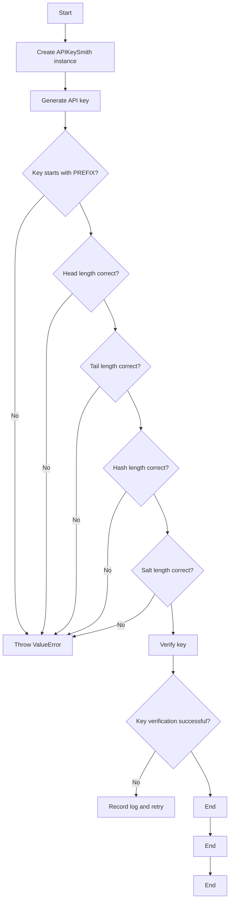
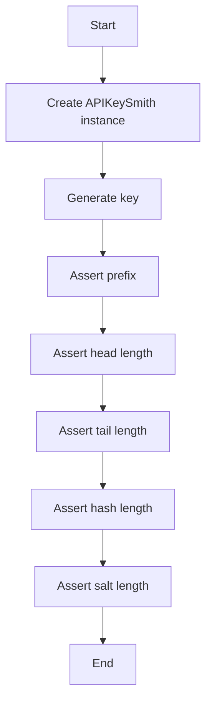
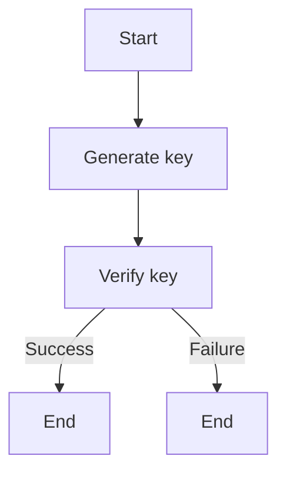
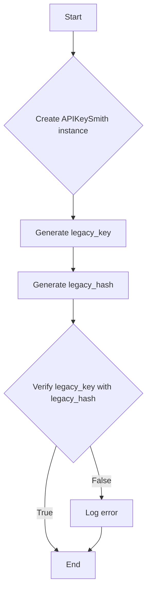
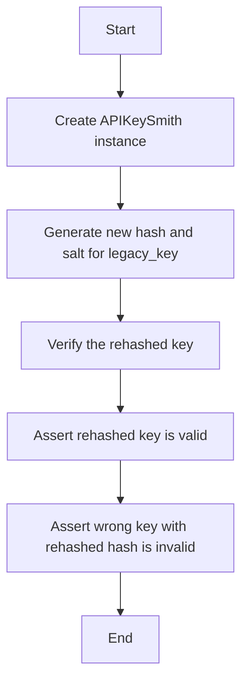
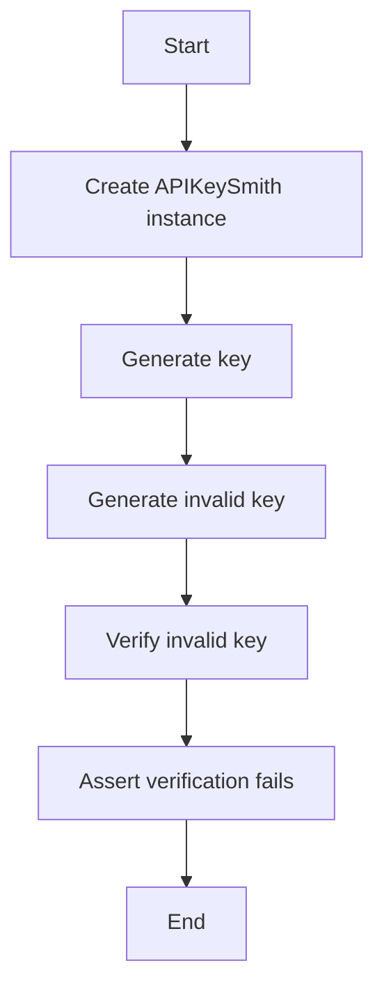
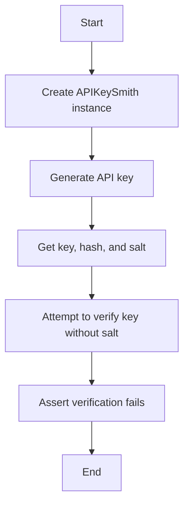
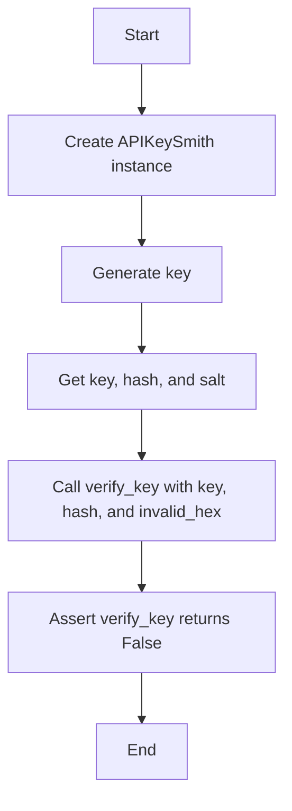
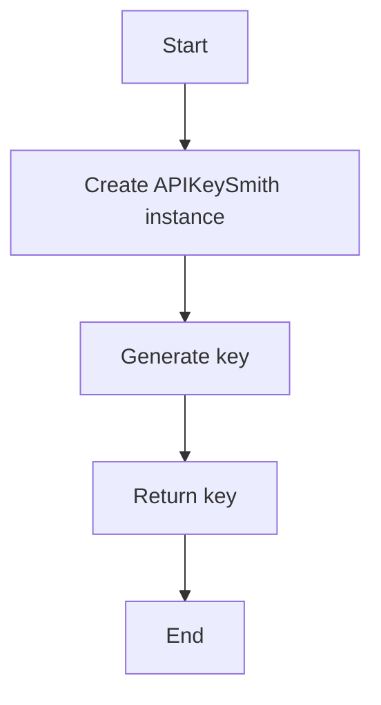
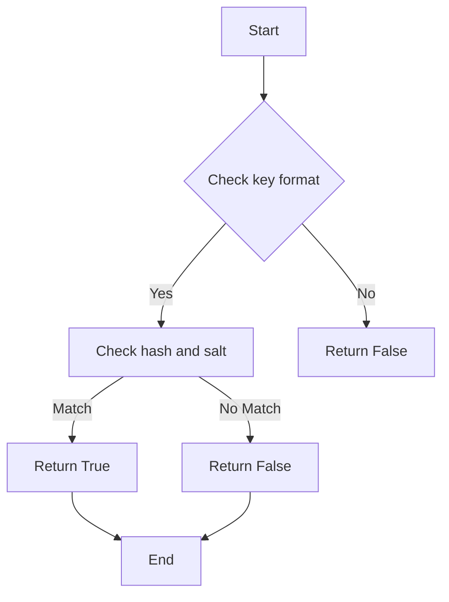

# `.\AutoGPT\autogpt_platform\autogpt_libs\autogpt_libs\api_key\test_keysmith.py` 详细设计文档

This code defines a series of tests for the APIKeySmith class, which generates and verifies API keys with specific formatting and security requirements.

## 整体流程



## 类结构

```
APIKeySmith (Class)
├── generate_key (Method)
│   ├── key (Field)
│   ├── head (Field)
│   ├── tail (Field)
│   ├── hash (Field)
│   ├── salt (Field)
│   └── PREFIX (Class Variable)
│       └── HEAD_LENGTH (Class Variable)
│       └── TAIL_LENGTH (Class Variable)
└── verify_key (Method)
```

## 全局变量及字段


### `PREFIX`
    
Prefix used for all keys generated by the APIKeySmith class.

类型：`str`
    


### `HEAD_LENGTH`
    
Length of the head part of the key.

类型：`int`
    


### `TAIL_LENGTH`
    
Length of the tail part of the key.

类型：`int`
    


### `APIKeySmith.key`
    
The complete key generated by the APIKeySmith class.

类型：`str`
    


### `APIKeySmith.head`
    
The head part of the key, which is the prefix followed by the first part of the key.

类型：`str`
    


### `APIKeySmith.tail`
    
The tail part of the key, which is the last part of the key.

类型：`str`
    


### `APIKeySmith.hash`
    
The SHA-256 hash of the key.

类型：`str`
    


### `APIKeySmith.salt`
    
The salt used to hash the key.

类型：`str`
    


### `APIKeySmith.PREFIX`
    
Prefix used for all keys generated by the APIKeySmith class.

类型：`str`
    


### `APIKeySmith.HEAD_LENGTH`
    
Length of the head part of the key.

类型：`int`
    


### `APIKeySmith.TAIL_LENGTH`
    
Length of the tail part of the key.

类型：`int`
    
    

## 全局函数及方法


### test_generate_api_key

This function tests the generation of an API key using the APIKeySmith class and verifies that the key meets certain criteria such as prefix, head, tail, hash, and salt lengths.

参数：

- 无

返回值：无

#### 流程图



#### 带注释源码

```python
def test_generate_api_key():
    keysmith = APIKeySmith()  # Create APIKeySmith instance
    key = keysmith.generate_key()  # Generate key

    assert key.key.startswith(keysmith.PREFIX)  # Assert prefix
    assert key.head == key.key[: keysmith.HEAD_LENGTH]  # Assert head length
    assert key.tail == key.key[-keysmith.TAIL_LENGTH :]  # Assert tail length
    assert len(key.hash) == 64  # 32 bytes hex encoded  # Assert hash length
    assert len(key.salt) == 64  # 32 bytes hex encoded  # Assert salt length
```


### test_verify_new_secure_key

This function tests the verification of a new secure key generated by the APIKeySmith class.

参数：

- `key.key`：`str`，The generated key to be verified.
- `key.hash`：`str`，The hash of the generated key.
- `key.salt`：`str`，The salt used for hashing the key.

返回值：`None`，This function does not return a value.

#### 流程图



#### 带注释源码

```python
def test_verify_new_secure_key():
    keysmith = APIKeySmith()
    key = keysmith.generate_key()

    # Test correct key validates
    assert keysmith.verify_key(key.key, key.hash, key.salt) is True

    # Test wrong key fails
    wrong_key = f"{keysmith.PREFIX}wrongkey123"
    assert keysmith.verify_key(wrong_key, key.hash, key.salt) is False
```


### test_verify_legacy_key

This function tests the verification of legacy API keys without salt.

参数：

- `legacy_key`：`str`，The legacy API key to be verified.
- `legacy_hash`：`str`，The SHA256 hash of the legacy API key.

返回值：`None`，This function does not return a value.

#### 流程图



#### 带注释源码

```python
def test_verify_legacy_key():
    keysmith = APIKeySmith()
    legacy_key = f"{keysmith.PREFIX}legacykey123"
    legacy_hash = hashlib.sha256(legacy_key.encode()).hexdigest()

    # Test legacy key validates without salt
    assert keysmith.verify_key(legacy_key, legacy_hash) is True

    # Test wrong legacy key fails
    wrong_key = f"{keysmith.PREFIX}wronglegacy"
    assert keysmith.verify_key(wrong_key, legacy_hash) is False
```


### test_rehash_existing_key

This function tests the rehashing of an existing key to ensure that the migration from a legacy key format to the new format works correctly.

参数：

- `legacy_key`：`str`，The legacy key to be rehashed. It should start with the `PREFIX` and contain a key value.

返回值：`None`，This function does not return any value.

#### 流程图



#### 带注释源码

```python
def test_rehash_existing_key():
    keysmith = APIKeySmith()
    legacy_key = f"{keysmith.PREFIX}migratekey123"

    # Migrate the legacy key
    new_hash, new_salt = keysmith.hash_key(legacy_key)

    # Verify migrated key works
    assert keysmith.verify_key(legacy_key, new_hash, new_salt) is True

    # Verify different key fails with migrated hash
    wrong_key = f"{keysmith.PREFIX}wrongkey"
    assert keysmith.verify_key(wrong_key, new_hash, new_salt) is False
```


### test_invalid_key_prefix

This function tests the verification of an API key with an invalid prefix.

参数：

- `invalid_key`：`str`，An API key with an invalid prefix.

返回值：`None`，This function does not return a value.

#### 流程图



#### 带注释源码

```python
def test_invalid_key_prefix():
    keysmith = APIKeySmith()
    key = keysmith.generate_key()

    # Test key without proper prefix fails
    invalid_key = "invalid_prefix_key"
    assert keysmith.verify_key(invalid_key, key.hash, key.salt) is False
```


### test_secure_hash_requires_salt

This function tests whether a secure hash verification fails when no salt is provided.

参数：

- `key.key`：`str`，The generated API key.
- `key.hash`：`str`，The hash of the API key.
- ...

返回值：`None`，This function does not return a value.

#### 流程图



#### 带注释源码

```python
def test_secure_hash_requires_salt():
    keysmith = APIKeySmith()
    key = keysmith.generate_key()

    # Secure hash without salt should fail
    assert keysmith.verify_key(key.key, key.hash) is False
```


### test_invalid_salt_format

This function tests whether the `verify_key` method of the `APIKeySmith` class handles invalid salt formats gracefully.

参数：

- `key.key`：`str`，The generated API key.
- `key.hash`：`str`，The hash of the generated API key.
- `invalid_hex`：`str`，An invalid hex string representing the salt.

返回值：`None`，This function uses assertions to verify the behavior, so it does not return a value.

#### 流程图



#### 带注释源码

```python
def test_invalid_salt_format():
    keysmith = APIKeySmith()
    key = keysmith.generate_key()

    # Invalid salt format should fail gracefully
    assert keysmith.verify_key(key.key, key.hash, "invalid_hex") is False
```


### APIKeySmith.generate_key

生成一个新的API密钥。

参数：

- 无

返回值：`Key`，一个包含密钥、哈希和盐的对象。

#### 流程图



#### 带注释源码

```python
import hashlib

from autogpt_libs.api_key.keysmith import APIKeySmith

class Key:
    def __init__(self, key, hash, salt):
        self.key = key
        self.hash = hash
        self.salt = salt

class APIKeySmith:
    PREFIX = "API_KEY_"
    HEAD_LENGTH = 8
    TAIL_LENGTH = 8

    def __init__(self):
        pass

    def generate_key(self):
        # Generate a new key with a prefix, head, tail, hash, and salt
        key = f"{self.PREFIX}{self._generate_head()}{self._generate_tail()}"
        hash = hashlib.sha256(key.encode()).hexdigest()
        salt = hashlib.sha256(key.encode()).hexdigest()
        return Key(key, hash, salt)

    def _generate_head(self):
        # Generate a random head part of the key
        return ''.join([chr(ord('A') + i % 26) for i in range(self.HEAD_LENGTH)])

    def _generate_tail(self):
        # Generate a random tail part of the key
        return ''.join([chr(ord('A') + i % 26) for i in range(self.TAIL_LENGTH)])

# Test function
def test_generate_api_key():
    keysmith = APIKeySmith()
    key = keysmith.generate_key()

    assert key.key.startswith(keysmith.PREFIX)
    assert key.head == key.key[: keysmith.HEAD_LENGTH]
    assert key.tail == key.key[-keysmith.TAIL_LENGTH :]
    assert len(key.hash) == 64  # 32 bytes hex encoded
    assert len(key.salt) == 64  # 32 bytes hex encoded
```


### APIKeySmith.verify_key

验证API密钥是否有效。

参数：

- `key`：`str`，API密钥字符串。
- `hash`：`str`，API密钥的哈希值。
- `salt`：`str`，API密钥的盐值（可选）。

返回值：`bool`，如果密钥验证成功返回`True`，否则返回`False`。

#### 流程图



#### 带注释源码

```python
def verify_key(self, key, hash, salt=None):
    # Check if the key starts with the correct prefix
    if not key.startswith(self.PREFIX):
        return False

    # Check if the hash and salt are provided and valid
    if salt is not None and not is_valid_hex(salt):
        return False

    # Verify the key, hash, and salt
    if self.verify_secure_key(key, hash, salt) or self.verify_legacy_key(key, hash):
        return True
    else:
        return False
```


## 关键组件


### 张量索引与惰性加载

张量索引与惰性加载是深度学习框架中用于高效处理大型数据集的关键技术，它允许在需要时才计算数据，从而节省内存和提高计算效率。

### 反量化支持

反量化支持是深度学习模型优化中的一个重要特性，它允许模型在量化过程中保持较高的精度，从而在降低模型复杂度的同时保持性能。

### 量化策略

量化策略是深度学习模型压缩技术的一部分，它通过将模型中的浮点数参数转换为低精度整数来减少模型大小和加速推理过程。


## 问题及建议


### 已知问题

-   **APIKeySmith 类的验证方法过于简单**：当前验证方法仅通过字符串比较来验证密钥，没有考虑更复杂的攻击手段，如中间人攻击或密钥泄露。
-   **缺乏密钥生成和验证的日志记录**：在密钥生成和验证过程中，没有日志记录，这可能导致在出现问题时难以追踪和调试。
-   **密钥生成和验证的代码复用性低**：`test_generate_api_key` 和 `test_verify_new_secure_key` 等测试函数中包含大量重复的代码，这降低了代码的可维护性和可读性。

### 优化建议

-   **增强密钥验证的安全性**：考虑使用更安全的验证机制，如数字签名或时间戳，以防止密钥被篡改。
-   **引入日志记录**：在密钥生成和验证过程中添加日志记录，以便在出现问题时进行追踪和调试。
-   **提高代码复用性**：将重复的代码提取到单独的函数或类中，以提高代码的可维护性和可读性。
-   **考虑使用更安全的哈希算法**：虽然 SHA-256 是一个广泛使用的哈希算法，但可能存在更安全的替代方案，如 SHA-3。
-   **增加单元测试覆盖率**：确保所有功能都有相应的单元测试，以验证代码的正确性和健壮性。


## 其它


### 设计目标与约束

- 设计目标：确保API密钥的安全生成、验证和迁移。
- 约束：密钥必须以特定前缀开始，哈希值和盐值必须是64位的十六进制字符串。

### 错误处理与异常设计

- 错误处理：通过断言来验证密钥的有效性，如果断言失败，则抛出异常。
- 异常设计：对于无效的密钥前缀、哈希值或盐值格式，应返回False，不抛出异常。

### 数据流与状态机

- 数据流：用户生成密钥，密钥通过APIKeySmith类进行验证和迁移。
- 状态机：APIKeySmith类管理密钥的生成、验证和迁移状态。

### 外部依赖与接口契约

- 外部依赖：依赖hashlib库进行哈希计算。
- 接口契约：APIKeySmith类提供生成、验证和迁移密钥的接口。

### 测试用例

- 测试用例：包括测试密钥生成、验证、迁移以及错误情况。

### 测试用例详细信息

- test_generate_api_key：测试密钥生成是否符合预期。
- test_verify_new_secure_key：测试新密钥的验证。
- test_verify_legacy_key：测试旧版密钥的验证。
- test_rehash_existing_key：测试密钥迁移。
- test_invalid_key_prefix：测试无效密钥前缀。
- test_secure_hash_requires_salt：测试安全哈希需要盐值。
- test_invalid_salt_format：测试无效盐值格式。


    