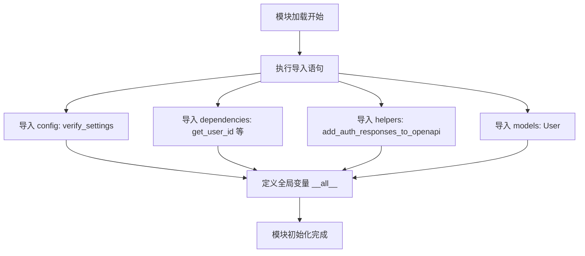

# `AutoGPT\autogpt_platform\autogpt_libs\autogpt_libs\auth\__init__.py` 详细设计文档

该代码作为身份验证相关功能模块的统一入口文件，主要负责从内部子模块（config, dependencies, helpers, models）中导入配置验证、用户依赖获取、OpenAPI 辅助函数及用户模型等核心组件，并通过 `__all__` 变量统一对外暴露接口，简化模块调用。

## 整体流程



## 类结构

```
该
文
件
不
包
含
任
何
类
的
定
义
，
仅
包
含
模
块
导
入
和
全
局
变
量
定
义
。
```

## 全局变量及字段


### `__all__`
    
定义了模块的公共 API 列表，控制 `from module import *` 时导入的符号。

类型：`list[str]`
    


    

## 全局函数及方法


## 关键组件


### verify_settings
核心配置验证机制，用于确保应用程序环境变量或设置符合预期要求。

### get_user_id
依赖注入函数，用于从请求上下文中提取当前已认证用户的标识符。

### requires_admin_user
路由保护机制，用于限制特定端点仅允许具备管理员权限的用户访问。

### requires_user
基础权限校验装饰器或依赖，用于确保请求由已登录的合法用户发起。

### get_optional_user_id
灵活的身份提取函数，用于在用户未登录时返回None而非抛出异常，支持可选认证。

### add_auth_responses_to_openapi
文档增强工具，用于向OpenAPI模式自动添加身份验证相关的响应示例和说明。

### User
领域模型对象，封装了用户数据结构、属性定义及相关行为逻辑。


## 问题及建议


### 已知问题

-   **扁平化命名空间污染**：当前设计将 `User` (模型)、`requires_admin_user` (依赖/装饰器)、`verify_settings` (配置) 等不同层级和职责的组件全部平铺导出到包的顶级命名空间中。这降低了代码的可读性，使用户难以区分组件的来源和职责，且容易造成命名冲突。
-   **初始化时的导入开销**：作为包的入口文件，执行 `from .xxx import ...` 会立即触发所有子模块（`config`, `dependencies`, `helpers`, `models`）的加载。如果某些子模块（如 `models` 或 `config`）包含耗时的初始化逻辑或重型依赖，将导致不必要的启动延迟和内存占用，即使调用者只需要使用其中一个小功能。
-   **缺乏模块级文档**：作为对外暴露的主要接口文件，缺少模块级的文档字符串。开发者无法通过 `help()` 或 IDE 智能提示快速了解该包的整体功能、授权机制概览或基本用法。

### 优化建议

-   **使用 PEP 562 实现懒加载**：建议在 `__init__.py` 中实现 `__getattr__` 和 `__dir__` 方法，按需导入子模块中的对象。这样可以显著减少包的导入时间，特别是对于包含重型模型或复杂配置初始化的项目，仅在用户实际访问特定属性时才加载对应模块。
-   **优化导出结构与 API 边界**：重新审视 `__all__` 列表，考虑是否需要将所有内部对象暴露给外部。建议仅暴露最核心的高层 API（例如仅暴露几个核心的依赖注入函数），或者通过子模块（如 `auth.models.User`, `auth.dependencies.requires_user`）引导用户使用，以保持包顶层命名空间的整洁和逻辑清晰。
-   **增加版本控制与元数据**：在 `__init__.py` 中显式定义 `__version__` 变量，方便运行时进行版本检查和日志记录，符合 Python 包管理的通用实践。


## 其它


### 设计目标与约束

**设计目标**：
1.  **模块化封装**：将用户认证与鉴权逻辑从业务路由中完全解耦，利用依赖注入模式提供高复用性的组件。
2.  **统一接口标准**：为应用提供标准化的用户身份获取（`get_user_id`）及权限校验入口（`requires_user`, `requires_admin_user`），确保各模块行为一致。
3.  **自动化文档集成**：通过 `add_auth_responses_to_openapi` 辅助函数，实现认证相关响应（如 401, 403）在 OpenAPI/Swagger 文档中的自动注解，提升 API 文档的可维护性。

**约束条件**：
1.  **框架强依赖**：本模块基于 FastAPI 框架的依赖注入系统构建，不兼容非 FastAPI 架构。
2.  **配置先行校验**：应用启动阶段必须通过 `verify_settings` 完成配置校验，若缺失关键认证参数（如密钥、算法），系统将拒绝启动。
3.  **模型契约**：导出的 `User` 模型需满足最小字段集要求，以支持鉴权逻辑中的身份识别与角色判断。

### 错误处理与异常设计

1.  **启动时配置错误**：
    *   当调用 `verify_settings` 时，若环境配置或设置对象中缺失必需的认证参数，应抛出 `ImproperlyConfigured` 或 `ValueError` 异常，中断应用启动过程，防止运行时崩溃。
2.  **认证失败**：
    *   在 `get_user_id` 或 `requires_user` 依赖项执行过程中，若请求头缺失 Token、Token 格式错误或签名无效，应抛出 `HTTPException`，状态码为 `401 Unauthorized`，提示用户登录失效。
3.  **鉴权失败**：
    *   在 `requires_admin_user` 依赖项执行过程中，若用户身份已确认但角色权限不足（非管理员），应抛出 `HTTPException`，状态码为 `403 Forbidden`，提示无权访问。
4.  **静默处理**：
    *   `get_optional_user_id` 设计为非阻断式，在无法获取用户信息时不抛出异常，而是返回 `None`，业务端需自行处理 `None` 情况。

### 数据流与状态机

**数据流**：
1.  **请求接入**：客户端发起 HTTP 请求至 FastAPI 路由。
2.  **依赖拦截**：框架检测到路由使用了本模块提供的依赖（如 `Depends(requires_user)`）。
3.  **凭证解析**：依赖函数从 HTTP Header（通常是 `Authorization: Bearer <token>`）提取凭证，并进行解密与签名验证。
4.  **上下文构建**：根据凭证中的 Payload 查询或重建 `User` 对象。
5.  **权限断言**：根据依赖类型（普通用户/管理员），检查 `User` 对象的角色属性。
6.  **参数注入**：将验证通过的 `User` 对象或 ID 注入到路由处理函数的参数中。
7.  **业务执行**：路由函数执行业务逻辑并返回响应。

**状态机**：
*   **匿名状态** -> (凭证有效) -> **已认证状态**
*   **已认证状态** -> (角色检查通过) -> **已授权状态**

### 外部依赖与接口契约

**外部依赖**：
1.  **FastAPI Core**：提供 `Depends` 依赖注入容器及 `Request` 上下文对象。
2.  **Pydantic**：用于数据模型的定义与验证（隐含于 `User` 模型及配置验证中）。
3.  **Settings/Config Module**：提供应用级配置数据，供 `verify_settings` 读取。

**接口契约**：
1.  **`get_user_id`**：
    *   **输入**：隐式获取 FastAPI `Request` 对象。
    *   **输出**：`str` | `int`，表示用户唯一标识符。
    *   **异常**：认证失败时抛出 401。
2.  **`requires_user`**：
    *   **输入**：无（从请求上下文解析）。
    *   **输出**：`User` 实例对象。
    *   **异常**：认证失败时抛出 401。
3.  **`requires_admin_user`**：
    *   **输入**：无（从请求上下文解析）。
    *   **输出**：`User` 实例对象（且具备管理员权限）。
    *   **异常**：认证失败抛出 401，权限不足抛出 403。
4.  **`add_auth_responses_to_openapi`**：
    *   **输入**：FastAPI `OpenAPI` 对象。
    *   **输出**：修改后的 `OpenAPI` 对象（通常为原位修改）。
    *   **功能**：向 OpenAPI Schema 注入全局的安全方案（Security Schemes）及响应定义。

### 扩展性设计

1.  **认证后端抽象**：当前导出的接口隐含了具体的认证逻辑（如 JWT）。架构上允许在 `.dependencies` 内部扩展其他认证方式（如 API Key, OAuth2），只要保持导出函数签名不变，业务代码无需修改。
2.  **用户模型多态**：`User` 模型被导出，允许开发者对其进行继承或扩展（例如添加 `is_active` 字段），依赖项内部通过抽象基类或鸭子类型进行适配，支持灵活的用户实体定义。
3.  **细粒度权限控制**：虽然当前仅导出 `requires_admin_user`，但模块设计支持添加更细粒度的权限装饰器或依赖函数（如 `requires_permission('write')`），通过 `__all__` 控制暴露级别。

    