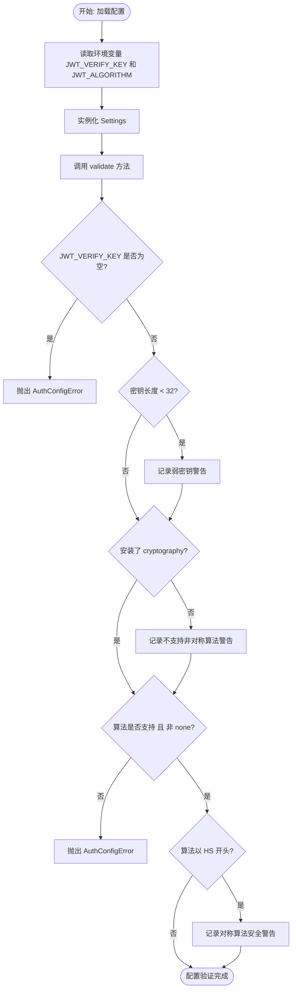
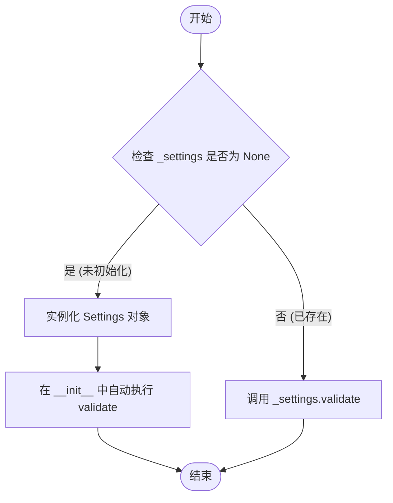
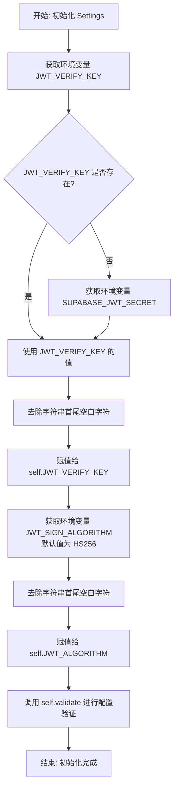
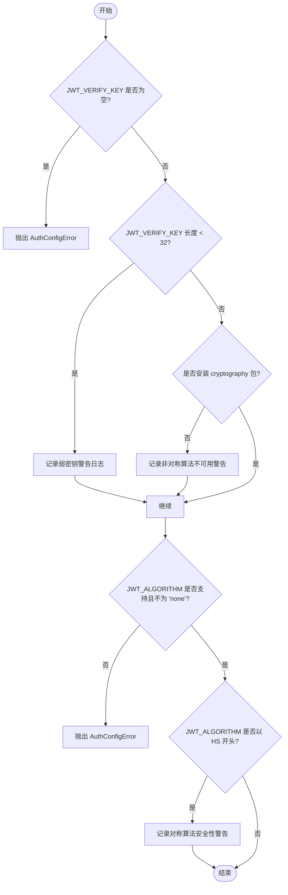

# `.\AutoGPT\autogpt_platform\autogpt_libs\autogpt_libs\auth\config.py` 详细设计文档

该代码主要负责管理和验证JWT认证相关的配置，包括从环境变量中加载JWT验证密钥（JWT_VERIFY_KEY）和签名算法（JWT_ALGORITHM），并在初始化时执行严格的安全校验，如检查密钥长度、算法支持性及加密库依赖，通过单例模式提供全局配置访问。

## 整体流程



## 类结构

```
AuthConfigError (Exception)
Settings
```

## 全局变量及字段


### `logger`
    
用于记录代码运行期间日志、警告和错误信息的标准日志记录器实例。

类型：`logging.Logger`
    


### `ALGO_RECOMMENDATION`
    
包含关于推荐使用非对称 JWT 签名算法以确保安全性的提示文本。

类型：`str`
    


### `_settings`
    
全局缓存变量，用于存储 Settings 类的单例实例，避免重复初始化。

类型：`Settings | None`
    


### `Settings.JWT_VERIFY_KEY`
    
用于验证 JWT 令牌签名的密钥字符串，从环境变量中读取。

类型：`str`
    


### `Settings.JWT_ALGORITHM`
    
指定用于 JWT 签名或验证的算法类型字符串，默认为 HS256。

类型：`str`
    
    

## 全局函数及方法


### `get_settings`

该函数实现了单例模式，用于获取全局唯一的 `Settings` 配置对象实例。如果实例尚未初始化，则创建新实例（触发配置验证）并将其存储在全局变量中，随后返回该实例。

参数：

- (无)

返回值：`Settings`，包含应用程序 JWT 认证相关配置的全局唯一实例。

#### 流程图

```mermaid
flowchart TD
    Start([开始]) --> CheckGlobal{全局变量 _settings 是否为 None?}
    CheckGlobal -- 是 --> Init[调用 Settings() 初始化]
    Init --> Assign[赋值给全局变量 _settings]
    Assign --> ReturnVal[返回 _settings]
    CheckGlobal -- 否 --> ReturnVal
    ReturnVal --> End([结束])
```

#### 带注释源码

```python
def get_settings() -> Settings:
    global _settings  # 声明引用全局变量 _settings，以便对其进行修改

    if not _settings:  # 检查全局变量是否尚未初始化
        _settings = Settings()  # 如果未初始化，则实例化 Settings 类（构造函数会自动调用 validate 方法）

    return _settings  # 返回全局唯一的 Settings 实例
```


### `verify_settings`

确保全局设置对象（`_settings`）已正确初始化并通过验证。若全局对象尚未实例化，则创建新实例（该过程会自动触发验证）；若已存在，则显式调用其验证逻辑以确保配置有效。

参数：

-  (无参数)

返回值：`None`，无返回值。

#### 流程图



#### 带注释源码

```python
def verify_settings() -> None:
    global _settings  # 声明使用全局变量 _settings

    if not _settings:
        # 如果全局设置对象为空（未初始化），则创建一个新的 Settings 实例。
        # 注意：Settings 的 __init__ 构造函数内部会调用 self.validate()，
        # 因此这里会间接完成配置的初始化和验证。
        _settings = Settings()
        return

    # 如果全局设置对象已经存在，显式调用其实例方法 validate()。
    # 用于在运行时重新检查配置的有效性。
    _settings.validate()
```


### `Settings.__init__`

初始化 `Settings` 类实例。该方法负责从环境变量中加载 JWT 验证密钥和签名算法配置，对属性进行赋值，并触发验证流程以确保配置的安全性和有效性。

参数：

-  `self`：`Settings`，类的实例引用，用于访问实例属性和方法。

返回值：`None`，构造函数不返回任何值。

#### 流程图



#### 带注释源码

```python
def __init__(self):
    # 尝试从环境变量 "JWT_VERIFY_KEY" 获取密钥
    # 如果未设置，则尝试从环境变量 "SUPABASE_JWT_SECRET" 获取
    # 如果两者均未设置，默认为空字符串，最后去除首尾空白字符
    self.JWT_VERIFY_KEY: str = os.getenv(
        "JWT_VERIFY_KEY", os.getenv("SUPABASE_JWT_SECRET", "")
    ).strip()

    # 从环境变量 "JWT_SIGN_ALGORITHM" 获取签名算法
    # 如果未设置，默认使用 "HS256"，最后去除首尾空白字符
    self.JWT_ALGORITHM: str = os.getenv("JWT_SIGN_ALGORITHM", "HS256").strip()

    # 调用验证方法，检查密钥强度和算法有效性
    # 如果配置无效（如密钥为空或算法不支持），将抛出 AuthConfigError
    self.validate()
```


### `Settings.validate`

该方法负责验证JWT认证配置的安全性及合法性。它检查JWT验证密钥是否为空或过短，检查当前环境是否支持非对称加密算法，验证签名算法是否受支持，并在检测到不安全的配置（如使用对称算法或弱密钥）时记录警告日志，或在配置无效时抛出异常。

参数：

- `self`：`Settings`，表示Settings类的实例，持有待验证的配置信息。

返回值：`None`，无返回值，验证失败时抛出 `AuthConfigError` 异常。

#### 流程图



#### 带注释源码

```python
def validate(self):
    # 检查JWT验证密钥是否为空，为空则抛出配置错误
    if not self.JWT_VERIFY_KEY:
        raise AuthConfigError(
            "JWT_VERIFY_KEY must be set. "
            "An empty JWT secret would allow anyone to forge valid tokens."
        )

    # 检查JWT验证密钥长度是否小于32个字符，如果是则记录警告
    if len(self.JWT_VERIFY_KEY) < 32:
        logger.warning(
            "⚠️ JWT_VERIFY_KEY appears weak (less than 32 characters). "
            "Consider using a longer, cryptographically secure secret."
        )

    # 获取PyJWT默认支持的算法列表
    supported_algorithms = get_default_algorithms().keys()

    # 检查是否安装了cryptography包，如果没有则警告无法使用非对称算法
    if not has_crypto:
        logger.warning(
            "⚠️ Asymmetric JWT verification is not available "
            "because the 'cryptography' package is not installed. "
            + ALGO_RECOMMENDATION
        )

    # 验证指定的算法是否受支持，且不能是 'none' 算法
    if (
        self.JWT_ALGORITHM not in supported_algorithms
        or self.JWT_ALGORITHM == "none"
    ):
        raise AuthConfigError(
            f"Invalid JWT_SIGN_ALGORITHM: '{self.JWT_ALGORITHM}'. "
            "Supported algorithms are listed on "
            "https://pyjwt.readthedocs.io/en/stable/algorithms.html"
        )

    # 如果使用的是对称算法（HS开头），记录安全性建议警告
    if self.JWT_ALGORITHM.startswith("HS"):
        logger.warning(
            f"⚠️ JWT_SIGN_ALGORITHM is set to '{self.JWT_ALGORITHM}', "
            "a symmetric shared-key signature algorithm. " + ALGO_RECOMMENDATION
        )
```


## 关键组件


### AuthConfigError
用于处理认证配置无效情况的自定义异常类，继承自 `ValueError`，在密钥缺失或算法不合法时抛出。

### Settings
核心配置管理类，负责从环境变量加载 JWT 密钥与算法，并执行包含密钥强度检查、算法合法性校验、加密依赖检查及安全建议在内的一系列验证逻辑。

### get_settings
实现单例模式的全局访问函数，提供 `Settings` 实例的惰性加载机制，确保全局上下文中仅维护一份配置实例。

### verify_settings
显式验证函数，用于强制触发 `Settings` 实例的初始化或执行其验证逻辑，以确保当前配置状态有效且符合安全策略。


## 问题及建议


### 已知问题

-   **全局单例模式带来的副作用**：使用全局变量 `_settings` 和 `get_settings()` 函数实现单例模式，虽然在运行时节省了资源，但在单元测试中会导致状态污染，难以在不同测试用例间隔离配置环境。
-   **默认配置与安全建议冲突**：代码默认将 `JWT_ALGORITHM` 设置为 `HS256`，但同时又在 `validate` 方法中强烈警告不建议使用对称算法。这种默认设置与最佳实践相悖，可能导致开发者无意中使用了不安全的默认配置。
-   **缺乏配置热重载机制**：`Settings` 类在初始化时从环境变量读取配置，一旦初始化完成，即便后续环境变量发生变化（如密钥轮换），程序也无法感知，必须重启服务才能生效。
-   **类型注解不完整**：代码中使用了 `# type: ignore` 来忽略类型检查错误（`_settings` 赋值为 `None`），这掩盖了类型系统的潜在问题，不利于静态代码分析工具发现 bug。

### 优化建议

-   **引入依赖注入（DI）**：建议将 `Settings` 实例通过构造函数或参数传递给需要使用它的类，而不是依赖全局的 `get_settings()` 函数。这将极大地提升代码的可测试性和模块解耦程度。
-   **实施“安全第一”的默认策略**：如果没有显式配置 `JWT_ALGORITHM`，建议抛出 `AuthConfigError` 强制要求开发者指定算法，或者默认使用更安全的算法（如果环境支持），而不是默认使用 HS256 并仅发出警告。
-   **动态化的配置验证逻辑**：增强 `validate` 方法，使其根据所选的算法类型应用不同的安全规则。例如，对于 HS256 严格要求密钥长度，而对于 ES256 等非对称算法，则应验证密钥格式是否符合特定标准。
-   **完善类型定义**：使用 `Optional[Settings]` 正确标注 `_settings` 的类型，移除 `# type: ignore`，并确保全局变量的初始化符合类型检查器的规则，提高代码的健壮性。


## 其它


### 设计目标与约束

本模块旨在提供集中式、安全的JWT（JSON Web Token）验证配置管理。其核心设计目标是确保应用程序在启动或运行时能够获取到安全有效的验证配置，并引导开发者使用更安全的加密实践。

主要约束如下：
1. **环境变量依赖**：必须通过环境变量 `JWT_VERIFY_KEY`（或 `SUPABASE_JWT_SECRET`）提供密钥，通过 `JWT_SIGN_ALGORITHM` 提供算法。
2. **密钥强度约束**：虽然系统不强制拒绝，但会在密钥长度小于32字符时发出警告，提示存在安全隐患。
3. **算法兼容性约束**：使用的算法必须被 PyJWT 库支持，且严禁使用 `none` 算法。若计划使用非对称算法（如 ES256），则运行环境必须安装 `cryptography` 依赖包。

### 错误处理与异常设计

模块采用明确的异常层级和日志记录来处理配置错误与潜在风险：

1. **自定义异常**：定义了 `AuthConfigError`（继承自 `ValueError`），专门用于标识认证配置无效的严重错误（如密钥缺失、算法不受支持）。遇到此类错误时，程序通常会中断启动，强制开发者修复配置。
2. **警告日志**：对于不阻碍程序运行但存在安全隐患的情况（如密钥过短、使用了对称算法 HS256、缺少 `cryptography` 库导致无法使用非对称算法），使用 `logger.warning` 输出警告信息。这些信息包含详细的安全建议（如推荐使用 ES256）。
3. **单例容错**：`get_settings()` 和 `verify_settings()` 函数通过检查全局变量 `_settings` 的状态，确保配置实例只被初始化一次，并在首次调用时触发验证逻辑。

### 外部依赖与接口契约

**外部依赖**：
1. **标准库**：
   - `os`：用于读取操作系统环境变量。
   - `logging`：用于记录配置过程中的警告和错误信息。
2. **第三方库**：
   - `jwt` (PyJWT)：用于获取支持的默认加密算法列表 (`get_default_algorithms`) 以及检查是否安装了加密库 (`has_crypto`)。
3. **运行时环境依赖**：
   - `cryptography`：可选依赖。如果需要使用非对称算法（如 ES256, RS256），必须安装此库，否则系统会发出警告。

**接口契约**：
- **`get_settings()`**：契约保证返回一个类型为 `Settings` 的全局唯一实例。该实例在返回前必须已通过内部验证（即 `validate()` 方法未抛出异常）。
- **`Settings.validate()`**：内部契约规定，如果 `JWT_VERIFY_KEY` 为空或 `JWT_ALGORITHM` 无效，必须抛出 `AuthConfigError`；否则，仅记录日志。

### 数据流与状态机

**数据流**：
1. **输入阶段**：从操作系统环境变量中读取原始字符串数据 (`JWT_VERIFY_KEY`, `JWT_SIGN_ALGORITHM`)。
2. **处理阶段**：`Settings` 构造函数接收数据并进行字符串处理 (`strip()`)，随后调用 `validate()` 方法。
3. **验证阶段**：`validate()` 检查密钥长度、算法有效性及依赖库情况，产生副作用（日志记录或抛出异常）。
4. **输出/缓存阶段**：验证通过的 `Settings` 实例被赋值给全局变量 `_settings`，后续请求直接从该缓存读取。

**状态机**：
全局配置管理器 `_settings` 主要包含两个状态：
1. **未初始化 (NULL)**：初始状态，此时 `_settings` 为 `None`。
2. **已就绪**：经过 `Settings()` 实例化和 `validate()` 校验后的状态。一旦进入此状态，全局配置对象将保持不变（直到进程重启）。

### 安全设计

本模块的核心设计围绕安全性展开，具体包含以下机制：
1. **防伪造机制**：强制要求 `JWT_VERIFY_KEY` 必须非空，防止空密钥导致任何人都能伪造令牌。
2. **算法推荐与降级检测**：代码内置了 `ALGO_RECOMMENDATION` 常量，强烈推荐使用非对称算法（如 ES256）。如果检测到开发者使用了较不安全的对称算法（如 HS256），或者因为缺少 `cryptography` 库而无法使用非对称算法，系统会记录安全警告。
3. **黑名单机制**：显式禁止使用 `none` 算法，防止签名绕过攻击。
4. **密钥强度提示**：通过检查密钥长度，对弱密钥（<32字符）进行提示，增强抗破解能力。

    