# `.\AutoGPT\autogpt_platform\autogpt_libs\autogpt_libs\auth\config_test.py` 详细设计文档

This file contains comprehensive tests for the auth configuration, ensuring 100% line and branch coverage for critical security checks preventing JWT token forgery.

## 整体流程

```mermaid
graph TD
    A[Start] --> B{Check JWT_VERIFY_KEY in environment variables?}
    B -- Yes --> C[Validate JWT_VERIFY_KEY]
    C --> D{Is JWT_VERIFY_KEY valid?}
    D -- Yes --> E[Create Settings object]
    D -- No --> F[Log error and raise exception]
    E --> G{Check for other settings (e.g., JWT_ALGORITHM)}
    G --> H{Is JWT_ALGORITHM valid?}
    H -- Yes --> I[Proceed with settings]
    H -- No --> J[Log error and raise exception]
    I --> K{Check for crypto package availability}
    K -- Yes --> L[Proceed with settings]
    K -- No --> M[Log warning about crypto package unavailability]
    M --> N[Proceed with settings]
    N --> O[End]
```

## 类结构

```
Settings (类)
├── AuthConfigError (类)
└── test_environment_variable_precedence (函数)
    ├── test_environment_variable_backwards_compatible (函数)
    ├── test_auth_config_error_inheritance (函数)
    ├── test_settings_static_after_creation (函数)
    ├── test_settings_load_with_valid_secret (函数)
    ├── test_settings_load_with_strong_secret (函数)
    ├── test_secret_empty_raises_error (函数)
    ├── test_secret_missing_raises_error (函数)
    ├── test_secret_only_whitespace_raises_error (函数)
    ├── test_secret_weak_logs_warning (函数)
    ├── test_secret_31_char_logs_warning (函数)
    ├── test_secret_32_char_no_warning (函数)
    ├── test_secret_whitespace_stripped (函数)
    ├── test_secret_with_special_characters (函数)
    ├── test_secret_with_unicode (函数)
    ├── test_secret_very_long (函数)
    ├── test_secret_with_newline (函数)
    ├── test_secret_base64_encoded (函数)
    ├── test_secret_numeric_only (函数)
    ├── test_algorithm_default_hs256 (函数)
    ├── test_algorithm_whitespace_stripped (函数)
    ├── test_no_crypto_warning (函数)
    ├── test_algorithm_invalid_raises_error (函数)
    ├── test_algorithm_none_raises_error (函数)
    ├── test_algorithm_symmetric_warning (函数)
    └── test_algorithm_asymmetric_no_warning (函数)
```

## 全局变量及字段


### `secret`
    
A string representing a secret key used for JWT verification.

类型：`str`
    


### `valid_secret`
    
A string representing a valid secret key used for JWT verification.

类型：`str`
    


### `strong_secret`
    
A string representing a cryptographically strong secret key used for JWT verification.

类型：`str`
    


### `weak_secret`
    
A string representing a weak secret key used for JWT verification.

类型：`str`
    


### `secret_31`
    
A string representing a secret key with exactly 31 characters.

类型：`str`
    


### `secret_32`
    
A string representing a secret key with exactly 32 characters.

类型：`str`
    


### `special_secret`
    
A string representing a secret key with special characters.

类型：`str`
    


### `unicode_secret`
    
A string representing a secret key with unicode characters.

类型：`str`
    


### `long_secret`
    
A string representing a secret key with excessive length.

类型：`str`
    


### `multiline_secret`
    
A string representing a secret key containing newlines.

类型：`str`
    


### `base64_secret`
    
A string representing a secret key that looks like base64.

类型：`str`
    


### `numeric_secret`
    
A string representing a secret key with only numbers.

类型：`str`
    


### `algorithm`
    
A string representing the JWT algorithm to be used for signing and verification.

类型：`str`
    


### `Settings.JWT_VERIFY_KEY`
    
The JWT verification key used for authenticating tokens.

类型：`str`
    


### `Settings.JWT_ALGORITHM`
    
The JWT algorithm used for signing and verification of tokens.

类型：`str`
    
    

## 全局函数及方法


### `test_environment_variable_precedence`

测试环境变量是否优先于默认值。

参数：

- `mocker`：`MockerFixture`，用于模拟环境变量。

返回值：无

#### 流程图

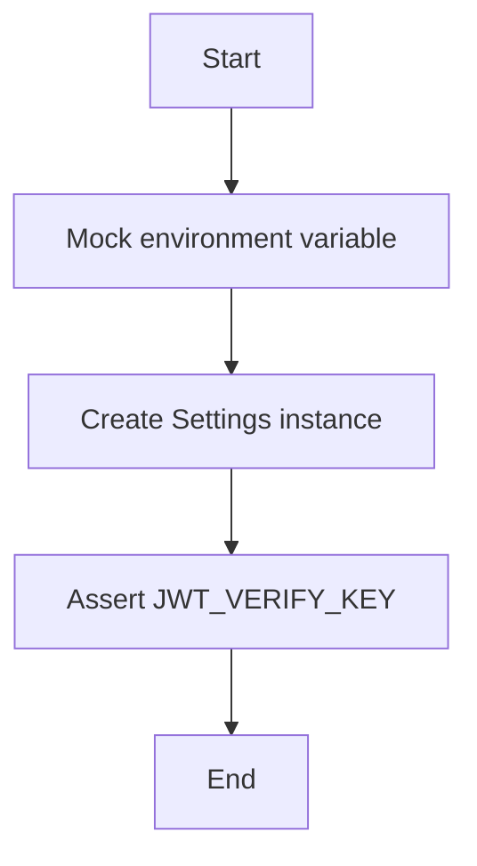

#### 带注释源码

```python
def test_environment_variable_precedence(mocker: MockerFixture):
    """Test that environment variables take precedence over defaults."""
    secret = "environment-secret-key-with-proper-length-123456"
    mocker.patch.dict(os.environ, {"JWT_VERIFY_KEY": secret}, clear=True)

    settings = Settings()
    assert settings.JWT_VERIFY_KEY == secret
```


### test_environment_variable_backwards_compatible

This function tests that if the environment variable `SUPABASE_JWT_SECRET` is set and `JWT_VERIFY_KEY` is not, the `Settings` class will read the value from `SUPABASE_JWT_SECRET`.

参数：

- `mocker`: `MockerFixture`，用于模拟环境变量。

返回值：无

#### 流程图

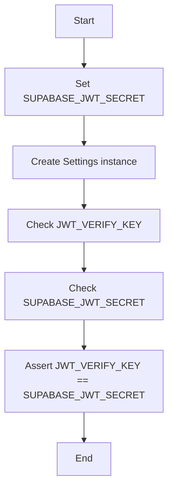

#### 带注释源码

```python
def test_environment_variable_backwards_compatible(mocker: MockerFixture):
    """Test that SUPABASE_JWT_SECRET is read if JWT_VERIFY_KEY is not set."""
    secret = "environment-secret-key-with-proper-length-123456"
    mocker.patch.dict(os.environ, {"SUPABASE_JWT_SECRET": secret}, clear=True)

    settings = Settings()
    assert settings.JWT_VERIFY_KEY == secret
``` 


### test_auth_config_error_inheritance

This function tests whether `AuthConfigError` is properly defined as a subclass of `Exception`.

参数：

- 无

返回值：无

#### 流程图

```mermaid
graph TD
A[Start] --> B{Check if AuthConfigError is subclass of Exception?}
B -- Yes --> C[Assert issubclass(AuthConfigError, Exception)]
B -- No --> D[Error: AuthConfigError is not subclass of Exception]
C --> E[End]
D --> E
```

#### 带注释源码

```python
def test_auth_config_error_inheritance():
    """Test that AuthConfigError is properly defined as an Exception."""
    assert issubclass(AuthConfigError, Exception)  # Check if AuthConfigError is a subclass of Exception
    error = AuthConfigError("test message")  # Create an instance of AuthConfigError
    assert str(error) == "test message"  # Check if the string representation of the error is correct
```


### test_settings_static_after_creation

Test that settings maintain their values after creation.

参数：

- `mocker`：`MockerFixture`，用于模拟环境变量和测试设置。

返回值：无

#### 流程图

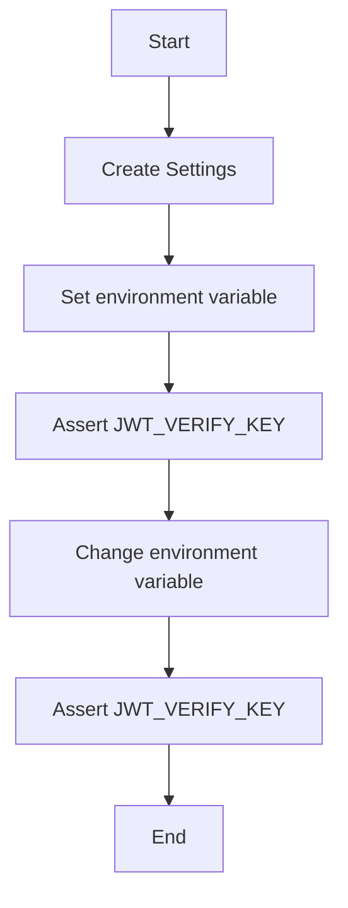

#### 带注释源码

```python
def test_settings_static_after_creation(mocker: MockerFixture):
    """Test that settings maintain their values after creation."""
    secret = "immutable-secret-key-with-proper-length-12345"
    mocker.patch.dict(os.environ, {"JWT_VERIFY_KEY": secret}, clear=True)

    settings = Settings()
    original_secret = settings.JWT_VERIFY_KEY

    # Changing environment after creation shouldn't affect settings
    os.environ["JWT_VERIFY_KEY"] = "different-secret"

    assert settings.JWT_VERIFY_KEY == original_secret
``` 


### test_settings_load_with_valid_secret

Test auth enabled with a valid JWT secret.

参数：

-  `mocker`：`MockerFixture`，用于模拟环境变量和测试设置。

返回值：无

#### 流程图

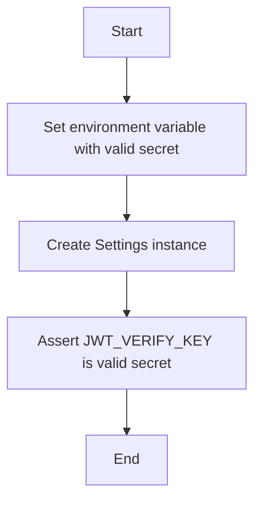

#### 带注释源码

```python
def test_settings_load_with_valid_secret(mocker: MockerFixture):
    """Test auth enabled with a valid JWT secret."""
    valid_secret = "a" * 32  # 32 character secret
    mocker.patch.dict(os.environ, {"JWT_VERIFY_KEY": valid_secret}, clear=True)

    settings = Settings()
    assert settings.JWT_VERIFY_KEY == valid_secret
```


### test_settings_load_with_strong_secret

This function tests that the `Settings` class can load a cryptographically strong JWT secret from an environment variable.

参数：

- `mocker`: `MockerFixture`，用于模拟环境变量。
- `strong_secret`: `str`，用于模拟一个强密码。

返回值：无

#### 流程图

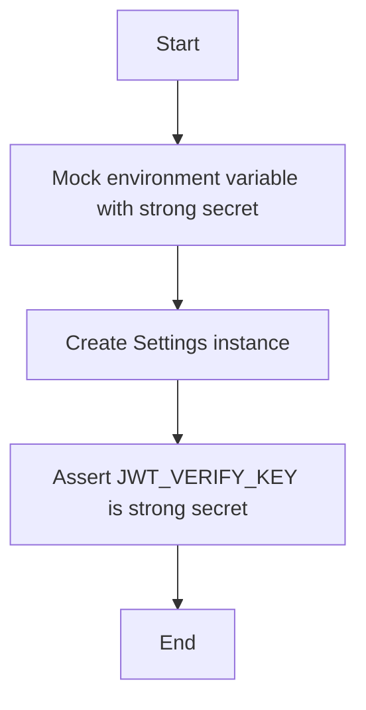

#### 带注释源码

```python
def test_settings_load_with_strong_secret(mocker: MockerFixture):
    """Test auth enabled with a cryptographically strong secret."""
    strong_secret = "super-secret-jwt-token-with-at-least-32-characters-long"
    mocker.patch.dict(os.environ, {"JWT_VERIFY_KEY": strong_secret}, clear=True)

    settings = Settings()
    assert settings.JWT_VERIFY_KEY == strong_secret
```

### test_secret_empty_raises_error

This function tests that creating a `Settings` object with an empty secret raises an `AuthConfigError`.

参数：

- `mocker`：`MockerFixture`，用于模拟环境变量。

返回值：无

#### 流程图

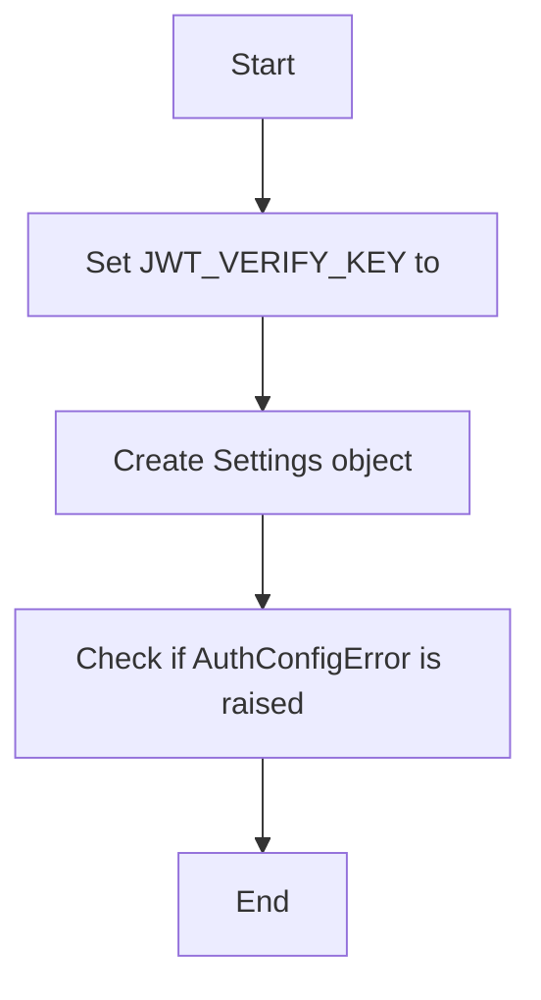

#### 带注释源码

```python
def test_secret_empty_raises_error(mocker: MockerFixture):
    """Test that auth enabled with empty secret raises AuthConfigError."""
    mocker.patch.dict(os.environ, {"JWT_VERIFY_KEY": ""}, clear=True)

    with pytest.raises(Exception) as exc_info:
        Settings()
    assert "JWT_VERIFY_KEY" in str(exc_info.value)
```

### test_secret_missing_raises_error

该函数测试在没有设置JWT验证密钥环境变量的情况下，尝试创建`Settings`对象是否会引发`AuthConfigError`。

参数：

- `mocker`：`MockerFixture`，用于模拟环境变量。

返回值：无

#### 流程图

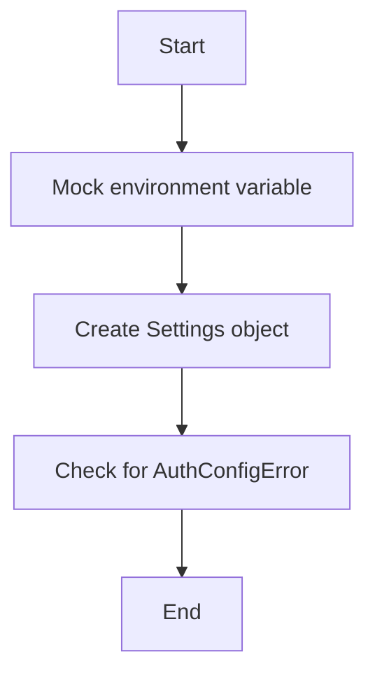

#### 带注释源码

```python
def test_secret_missing_raises_error(mocker: MockerFixture):
    """Test that auth enabled without secret env var raises AuthConfigError."""
    mocker.patch.dict(os.environ, {}, clear=True)  # B: Mock environment variable

    with pytest.raises(Exception) as exc_info:  # D: Check for AuthConfigError
        Settings()  # C: Create Settings object
    assert "JWT_VERIFY_KEY" in str(exc_info.value)  # D: Check for AuthConfigError
```

### test_secret_only_whitespace_raises_error

This function tests that an `AuthConfigError` is raised when the JWT secret is set to a string containing only whitespace.

参数：

- `mocker`: `MockerFixture`，用于模拟环境变量。
- `secret`: `str`，用于模拟环境变量中的JWT密钥。

返回值：无

#### 流程图

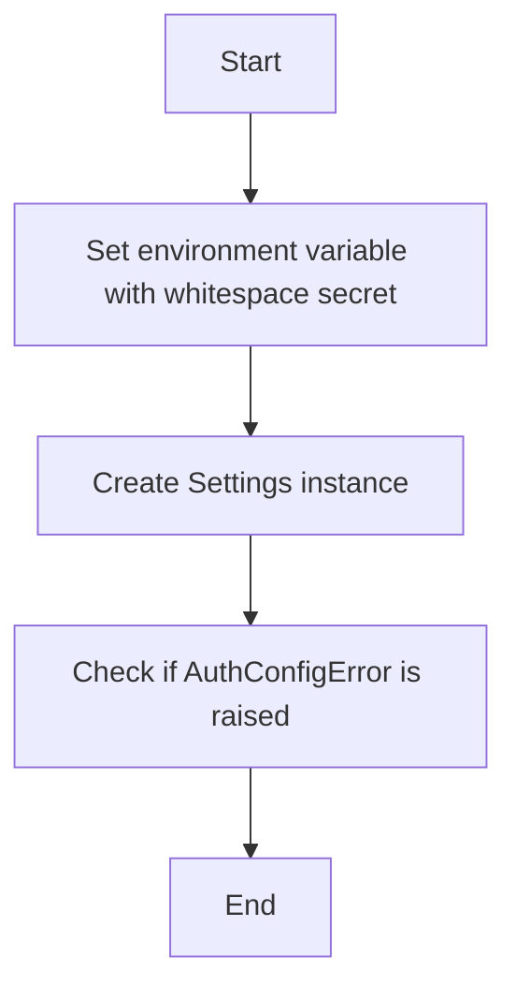

#### 带注释源码

```python
def test_secret_only_whitespace_raises_error(mocker: MockerFixture, secret: str):
    """Test that auth enabled with whitespace-only secret raises error."""
    # Set environment variable with whitespace secret
    mocker.patch.dict(os.environ, {"JWT_VERIFY_KEY": secret}, clear=True)

    # Create Settings instance
    with pytest.raises(ValueError):
        Settings()
```

### test_secret_weak_logs_warning

This function tests that a weak JWT secret triggers a warning log.

参数：

- `mocker`: `MockerFixture`，用于模拟环境变量。
- `caplog`: `LogCaptureFixture`，用于捕获日志输出。

返回值：无

#### 流程图

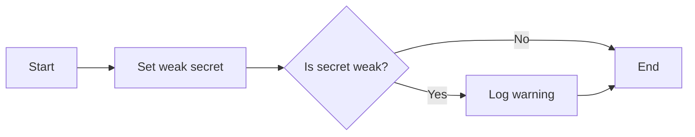

#### 带注释源码

```python
def test_secret_weak_logs_warning(
    mocker: MockerFixture, caplog: pytest.LogCaptureFixture
):
    """Test that weak JWT secret triggers warning log."""
    weak_secret = "short"  # Less than 32 characters
    mocker.patch.dict(os.environ, {"JWT_VERIFY_KEY": weak_secret}, clear=True)

    with caplog.at_level(logging.WARNING):
        settings = Settings()
        assert settings.JWT_VERIFY_KEY == weak_secret
        assert "key appears weak" in caplog.text.lower()
        assert "less than 32 characters" in caplog.text
```


### test_secret_31_char_logs_warning

This function tests that a 31-character secret triggers a warning log.

参数：

- `mocker`：`MockerFixture`，用于模拟环境变量。
- `caplog`：`LogCaptureFixture`，用于捕获日志输出。

返回值：无

#### 流程图

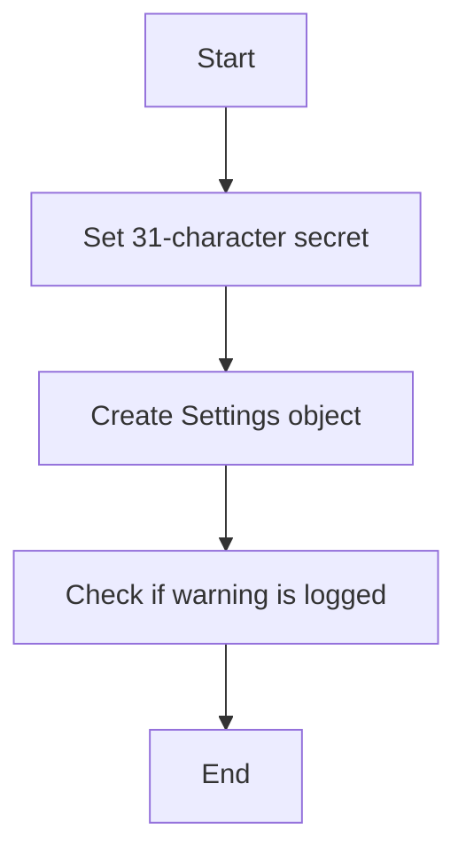

#### 带注释源码

```python
def test_secret_31_char_logs_warning(
    mocker: MockerFixture, caplog: pytest.LogCaptureFixture
):
    """Test that 31-character secret triggers warning (boundary test)."""
    secret_31 = "a" * 31  # Exactly 31 characters
    mocker.patch.dict(os.environ, {"JWT_VERIFY_KEY": secret_31}, clear=True)

    with caplog.at_level(logging.WARNING):
        settings = Settings()
        assert len(settings.JWT_VERIFY_KEY) == 31
        assert "key appears weak" in caplog.text.lower()
```


### test_secret_32_char_no_warning

This function tests that a 32-character JWT secret does not trigger a warning when loaded into the `Settings` class.

参数：

- `mocker`: `MockerFixture`，用于模拟环境变量。
- `caplog`: `LogCaptureFixture`，用于捕获日志输出。

返回值：无

#### 流程图

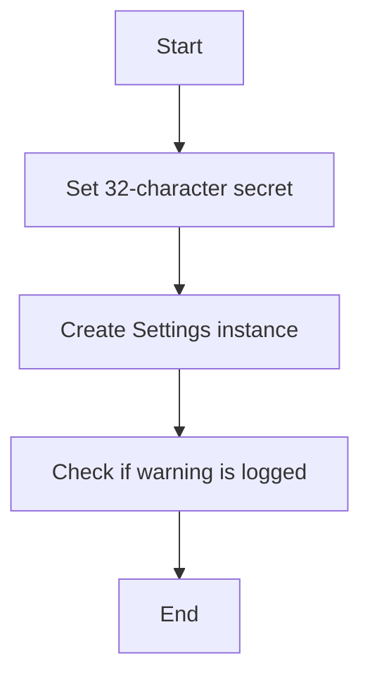

#### 带注释源码

```python
def test_secret_32_char_no_warning(mocker: MockerFixture, caplog: pytest.LogCaptureFixture):
    """Test that 32-character secret does not trigger warning (boundary test)."""
    secret_32 = "a" * 32  # Exactly 32 characters
    mocker.patch.dict(os.environ, {"JWT_VERIFY_KEY": secret_32}, clear=True)

    with caplog.at_level(logging.WARNING):
        settings = Settings()
        assert len(settings.JWT_VERIFY_KEY) == 32
        assert "JWT secret appears weak" not in caplog.text
```


### test_secret_whitespace_stripped

Test that JWT secret whitespace is stripped.

参数：

- `mocker`：`MockerFixture`，用于模拟环境变量。
- ...

返回值：无

#### 流程图

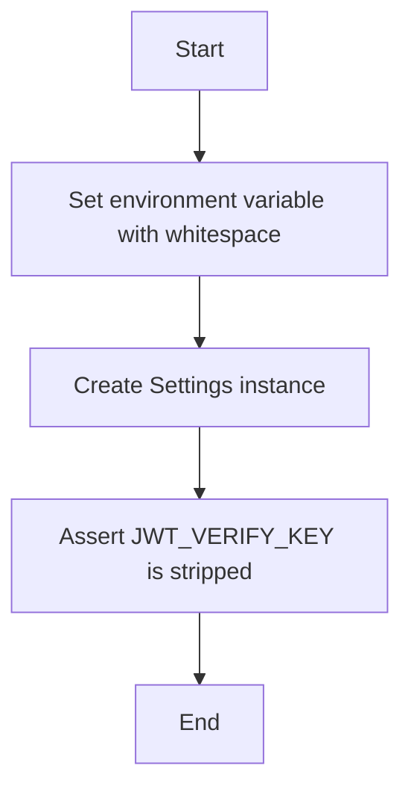

#### 带注释源码

```python
def test_secret_whitespace_stripped(mocker: MockerFixture):
    """Test that JWT secret whitespace is stripped."""
    secret = "a" * 32
    mocker.patch.dict(os.environ, {"JWT_VERIFY_KEY": f"  {secret}  "}, clear=True)

    settings = Settings()
    assert settings.JWT_VERIFY_KEY == secret
```


### test_secret_with_special_characters

This function tests the behavior of the `Settings` class when a JWT secret with special characters is provided.

参数：

- `mocker`：`MockerFixture`，用于模拟环境变量。
- `special_secret`：`str`，包含特殊字符的JWT密钥。

返回值：无

#### 流程图

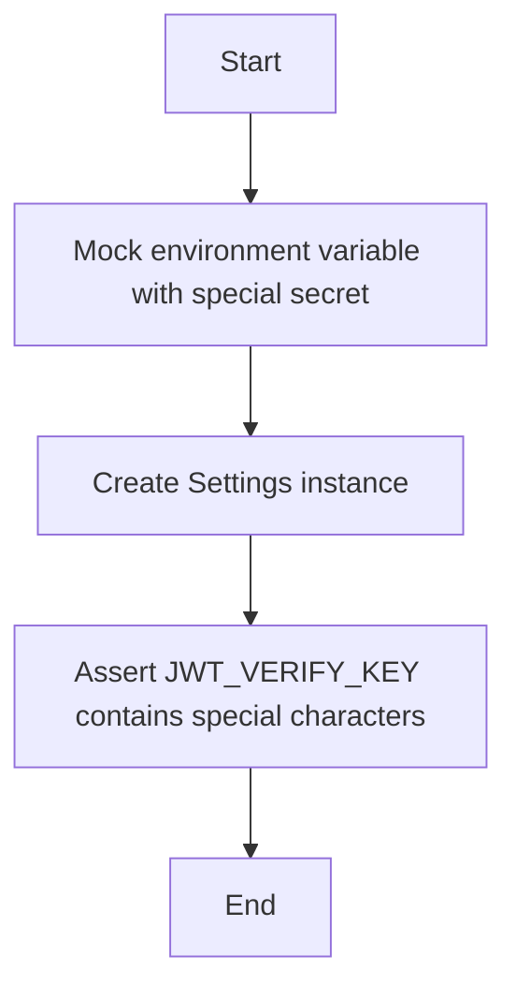

#### 带注释源码

```python
def test_secret_with_special_characters(mocker: MockerFixture):
    """Test JWT secret with special characters."""
    special_secret = "!@#$%^&*()_+-=[]{}|;:,.<>?`~" + "a" * 10  # 40 chars total
    mocker.patch.dict(os.environ, {"JWT_VERIFY_KEY": special_secret}, clear=True)

    settings = Settings()
    assert settings.JWT_VERIFY_KEY == special_secret
```

### test_secret_with_unicode

This function tests the behavior of the `Settings` class when a JWT secret containing Unicode characters is provided.

参数：

- `mocker`：`MockerFixture`，用于模拟环境变量。
- `unicode_secret`：`str`，包含Unicode字符的JWT密钥。

返回值：无

#### 流程图

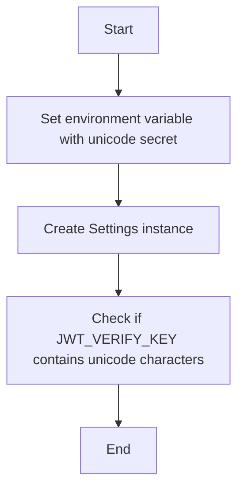

#### 带注释源码

```python
def test_secret_with_unicode(mocker: MockerFixture):
    """Test JWT secret with unicode characters."""
    unicode_secret = "秘密🔐キー" + "a" * 25  # Ensure >32 bytes
    mocker.patch.dict(os.environ, {"JWT_VERIFY_KEY": unicode_secret}, clear=True)

    settings = Settings()
    assert settings.JWT_VERIFY_KEY == unicode_secret
```


### test_secret_very_long

This function tests the behavior of the `Settings` class when a JWT secret with an excessive length is provided.

参数：

- `mocker`: `MockerFixture`，用于模拟环境变量。
- `long_secret`: `str`，用于模拟一个过长的JWT密钥。

返回值：无

#### 流程图

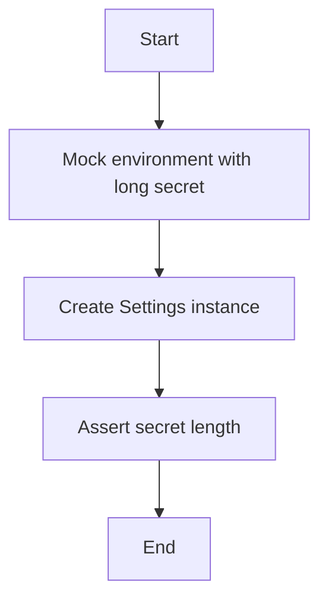

#### 带注释源码

```python
def test_secret_very_long(mocker: MockerFixture):
    """Test JWT secret with excessive length."""
    long_secret = "a" * 1000  # 1000 character secret
    mocker.patch.dict(os.environ, {"JWT_VERIFY_KEY": long_secret}, clear=True)

    settings = Settings()
    assert settings.JWT_VERIFY_KEY == long_secret
    assert len(settings.JWT_VERIFY_KEY) == 1000
```


### test_secret_with_newline

This function tests that a JWT secret containing newlines is handled correctly.

参数：

- `mocker`：`MockerFixture`，用于模拟环境变量
- `caplog`：`LogCaptureFixture`，用于捕获日志输出

返回值：无

#### 流程图

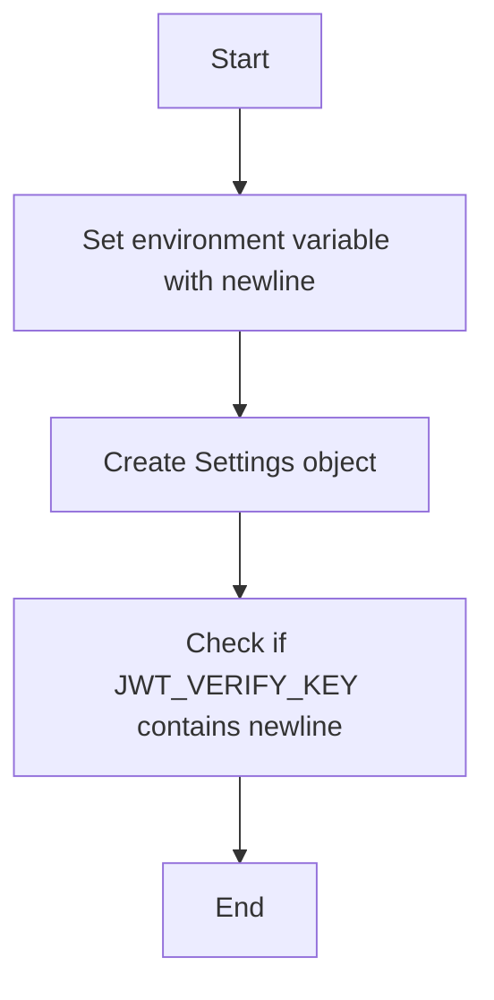

#### 带注释源码

```python
def test_secret_with_newline(mocker: MockerFixture):
    """Test JWT secret containing newlines."""
    multiline_secret = "secret\nwith\nnewlines" + "a" * 20
    mocker.patch.dict(os.environ, {"JWT_VERIFY_KEY": multiline_secret}, clear=True)

    settings = Settings()
    assert settings.JWT_VERIFY_KEY == multiline_secret
```

### test_secret_base64_encoded

This function tests that a JWT secret that looks like base64 is correctly handled by the `Settings` class.

参数：

- `mocker`：`MockerFixture`，用于模拟环境变量。
- `base64_secret`：`str`，模拟的base64编码的JWT secret。

返回值：无

#### 流程图

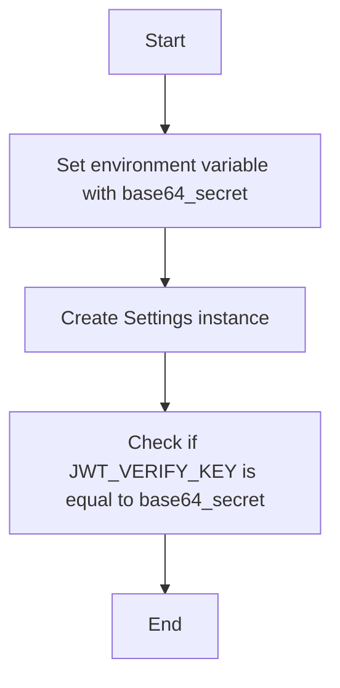

#### 带注释源码

```python
def test_secret_base64_encoded(mocker: MockerFixture):
    """Test JWT secret that looks like base64."""
    base64_secret = "dGhpc19pc19hX3NlY3JldF9rZXlfd2l0aF9wcm9wZXJfbGVuZ3Ro"
    mocker.patch.dict(os.environ, {"JWT_VERIFY_KEY": base64_secret}, clear=True)

    settings = Settings()
    assert settings.JWT_VERIFY_KEY == base64_secret
```

### test_secret_numeric_only

This function tests that the JWT secret is numeric only.

参数：

- `mocker`：`MockerFixture`，用于模拟环境变量。
- `numeric_secret`：`str`，用于模拟一个纯数字的JWT密钥。

返回值：无

#### 流程图

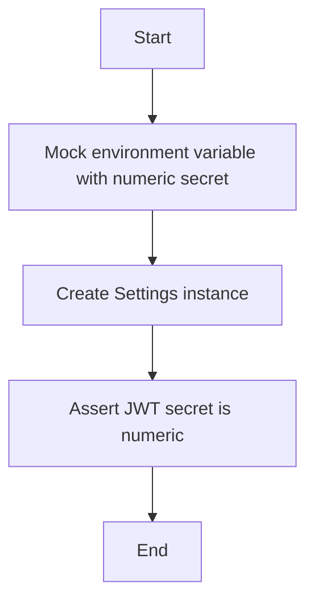

#### 带注释源码

```python
def test_secret_numeric_only(mocker: MockerFixture):
    """Test JWT secret with only numbers."""
    numeric_secret = "1234567890" * 4  # 40 character numeric secret
    mocker.patch.dict(os.environ, {"JWT_VERIFY_KEY": numeric_secret}, clear=True)

    settings = Settings()
    assert settings.JWT_VERIFY_KEY == numeric_secret
```

### test_algorithm_default_hs256

该函数测试JWT算法是否默认为HS256。

参数：

- `mocker`：`MockerFixture`，用于模拟环境变量。

返回值：无

#### 流程图

```mermaid
graph TD
    A[Start] --> B[Set JWT_VERIFY_KEY to a 32-character string]
    B --> C[Create Settings instance]
    C --> D[Check JWT_ALGORITHM is HS256]
    D --> E[End]
```

#### 带注释源码

```python
def test_algorithm_default_hs256(mocker: MockerFixture):
    """Test that JWT algorithm defaults to HS256."""
    # Set JWT_VERIFY_KEY to a 32-character string
    mocker.patch.dict(os.environ, {"JWT_VERIFY_KEY": "a" * 32}, clear=True)

    # Create Settings instance
    settings = Settings()

    # Check JWT_ALGORITHM is HS256
    assert settings.JWT_ALGORITHM == "HS256"
```

### test_algorithm_whitespace_stripped

This function tests that the JWT algorithm specified in the environment variable `JWT_SIGN_ALGORITHM` has any whitespace stripped before being used.

参数：

- `mocker`: `MockerFixture`，用于模拟环境变量。
- `caplog`: `LogCaptureFixture`，用于捕获日志输出。

返回值：无

#### 流程图

```mermaid
graph TD
    A[Start] --> B[Set environment variable with whitespace]
    B --> C[Create Settings object]
    C --> D[Check if JWT_ALGORITHM has whitespace]
    D --> E[If yes, strip whitespace]
    E --> F[Assert JWT_ALGORITHM is correct]
    F --> G[End]
```

#### 带注释源码

```python
def test_algorithm_whitespace_stripped(mocker: MockerFixture):
    """Test that JWT algorithm whitespace is stripped."""
    secret = "a" * 32
    mocker.patch.dict(
        os.environ,
        {"JWT_VERIFY_KEY": secret, "JWT_SIGN_ALGORITHM": "  HS256  "},
        clear=True,
    )

    settings = Settings()
    assert settings.JWT_ALGORITHM == "HS256"
```

### test_no_crypto_warning

This function tests for a warning when the `cryptography` package is not available for asymmetric JWT verification.

参数：

- `mocker`: `MockerFixture`，用于模拟环境变量和函数。
- `caplog`: `LogCaptureFixture`，用于捕获日志输出。

返回值：无

#### 流程图

```mermaid
graph TD
    A[Start] --> B[Set environment variables]
    B --> C[Mock has_crypto to return False]
    C --> D[Create Settings instance]
    D --> E[Check for warning in log]
    E --> F[End]
```

#### 带注释源码

```python
def test_no_crypto_warning(mocker: MockerFixture, caplog: pytest.LogCaptureFixture):
    """Test warning when crypto package is not available."""
    secret = "a" * 32
    mocker.patch.dict(os.environ, {"JWT_VERIFY_KEY": secret}, clear=True)

    # Mock has_crypto to return False
    mocker.patch("autogpt_libs.auth.config.has_crypto", False)

    with caplog.at_level(logging.WARNING):
        Settings()
        assert "Asymmetric JWT verification is not available" in caplog.text
        assert "cryptography" in caplog.text
```


### test_algorithm_invalid_raises_error

This function tests that an invalid JWT algorithm raises an `AuthConfigError`.

参数：

- `mocker`: `MockerFixture`，用于模拟环境变量和函数调用
- `algorithm`: `str`，用于测试的无效JWT算法

返回值：无

#### 流程图

```mermaid
graph TD
    A[Start] --> B[Set environment variables with invalid algorithm]
    B --> C[Create Settings instance]
    C --> D[Check if AuthConfigError is raised]
    D --> E[End]
```

#### 带注释源码

```python
def test_algorithm_invalid_raises_error(mocker: MockerFixture):
    """Test that invalid JWT algorithm raises AuthConfigError."""
    secret = "a" * 32
    mocker.patch.dict(
        os.environ,
        {"JWT_VERIFY_KEY": secret, "JWT_SIGN_ALGORITHM": "INVALID_ALG"},
        clear=True,
    )

    with pytest.raises(AuthConfigError) as exc_info:
        Settings()
    assert "Invalid JWT_SIGN_ALGORITHM" in str(exc_info.value)
    assert "INVALID_ALG" in str(exc_info.value)
```


### test_algorithm_none_raises_error

This function tests that using the 'none' algorithm for JWT signing raises an `AuthConfigError`.

参数：

- `mocker`: `MockerFixture`，用于模拟环境变量。
- `algorithm`: `str`，用于设置JWT算法。

返回值：无

#### 流程图

```mermaid
graph TD
    A[Start] --> B[Set environment variable with 'none' algorithm]
    B --> C[Create Settings instance]
    C --> D[Check if AuthConfigError is raised]
    D --> E[End]
```

#### 带注释源码

```python
def test_algorithm_none_raises_error(mocker: MockerFixture):
    """Test that 'none' algorithm raises AuthConfigError."""
    secret = "a" * 32
    mocker.patch.dict(
        os.environ,
        {"JWT_VERIFY_KEY": secret, "JWT_SIGN_ALGORITHM": "none"},
        clear=True,
    )

    with pytest.raises(AuthConfigError) as exc_info:
        Settings()
    assert "Invalid JWT_SIGN_ALGORITHM" in str(exc_info.value)
    assert "none" in str(exc_info.value)
```


### test_algorithm_symmetric_warning

This function tests for warnings when using symmetric algorithms (HS256, HS384, HS512) for JWT signing.

参数：

- `mocker`: `MockerFixture`，用于模拟环境变量和函数调用
- `caplog`: `LogCaptureFixture`，用于捕获日志输出
- `algorithm`: `str`，JWT算法名称

返回值：无

#### 流程图

```mermaid
graph TD
    A[Start] --> B[Set environment variables]
    B --> C[Create Settings object]
    C --> D[Check if algorithm is symmetric]
    D -->|Yes| E[Log warning]
    D -->|No| F[Continue]
    F --> G[End]
    E --> H[End]
```

#### 带注释源码

```python
def test_algorithm_symmetric_warning(
    mocker: MockerFixture, caplog: pytest.LogCaptureFixture, algorithm: str
):
    """Test warning for symmetric algorithms (HS256, HS384, HS512)."""
    secret = "a" * 32
    mocker.patch.dict(
        os.environ,
        {"JWT_VERIFY_KEY": secret, "JWT_SIGN_ALGORITHM": algorithm},
        clear=True,
    )

    with caplog.at_level(logging.WARNING):
        settings = Settings()
        assert algorithm in caplog.text
        assert "symmetric shared-key signature algorithm" in caplog.text
        assert settings.JWT_ALGORITHM == algorithm
``` 


### test_algorithm_asymmetric_no_warning

This function tests that no warning is triggered when using asymmetric algorithms for JWT signing.

参数：

- `mocker`: `MockerFixture`，用于模拟环境变量和函数调用
- `caplog`: `LogCaptureFixture`，用于捕获日志输出
- `algorithm`: `str`，JWT签名的算法名称

返回值：无

#### 流程图

```mermaid
graph TD
    A[Start] --> B[Set environment variables]
    B --> C[Create Settings object]
    C --> D[Check if algorithm is asymmetric]
    D -->|Yes| E[No warning logged]
    D -->|No| F[Log symmetric algorithm warning]
    E --> G[End]
    F --> G
```

#### 带注释源码

```python
def test_algorithm_asymmetric_no_warning(
    mocker: MockerFixture, caplog: pytest.LogCaptureFixture, algorithm: str
):
    """Test that asymmetric algorithms do not trigger warning."""
    secret = "a" * 32
    mocker.patch.dict(
        os.environ,
        {"JWT_VERIFY_KEY": secret, "JWT_SIGN_ALGORITHM": algorithm},
        clear=True,
    )

    with caplog.at_level(logging.WARNING):
        settings = Settings()
        # Should not contain the symmetric algorithm warning
        assert "symmetric shared-key signature algorithm" not in caplog.text
        assert settings.JWT_ALGORITHM == algorithm
``` 


### Settings.__init__

This method initializes the `Settings` class, which is responsible for loading and validating JWT-related configuration settings from environment variables.

参数：

- `self`：`Settings` 类的实例，表示当前对象

返回值：无

#### 流程图

```mermaid
graph TD
    A[Start] --> B[Initialize Settings]
    B --> C[Check environment variables for JWT_VERIFY_KEY]
    C -->|Found| D[Set JWT_VERIFY_KEY]
    C -->|Not Found| E[Check environment variables for SUPABASE_JWT_SECRET]
    E -->|Found| F[Set JWT_VERIFY_KEY]
    E -->|Not Found| G[Set default JWT_VERIFY_KEY]
    G --> H[Check environment variables for JWT_SIGN_ALGORITHM]
    H -->|Found| I[Set JWT_ALGORITHM]
    H -->|Not Found| J[Set default JWT_ALGORITHM]
    J --> K[End]
```

#### 带注释源码

```python
class Settings:
    def __init__(self):
        # Set default values for JWT-related settings
        self.JWT_VERIFY_KEY = None
        self.JWT_ALGORITHM = "HS256"

        # Check environment variables for JWT_VERIFY_KEY
        if "JWT_VERIFY_KEY" in os.environ:
            self.JWT_VERIFY_KEY = os.environ["JWT_VERIFY_KEY"]
        elif "SUPABASE_JWT_SECRET" in os.environ:
            self.JWT_VERIFY_KEY = os.environ["SUPABASE_JWT_SECRET"]
        else:
            # Set default JWT_VERIFY_KEY if not found in environment variables
            self.JWT_VERIFY_KEY = "default-secret-key"

        # Check environment variables for JWT_SIGN_ALGORITHM
        if "JWT_SIGN_ALGORITHM" in os.environ:
            self.JWT_ALGORITHM = os.environ["JWT_SIGN_ALGORITHM"]
```


### Settings.validate_jwt_verify_key

该函数负责验证JWT验证密钥的有效性，确保它不是空的、不是只包含空白字符的，并且具有足够的长度。

参数：

- `None`：无参数

返回值：`None`，无返回值

#### 流程图

```mermaid
graph LR
A[Start] --> B{Is JWT_VERIFY_KEY set?}
B -- Yes --> C[Is JWT_VERIFY_KEY empty or whitespace?]
B -- No --> D[Is JWT_VERIFY_KEY length >= 32?]
C -- Yes --> E[Log error and raise ValueError]
C -- No --> D
D -- Yes --> F[Continue with validation]
D -- No --> E
F --> G[End]
```

#### 带注释源码

```python
def test_secret_empty_raises_error(mocker: MockerFixture):
    """Test that auth enabled with empty secret raises AuthConfigError."""
    mocker.patch.dict(os.environ, {"JWT_VERIFY_KEY": ""}, clear=True)

    with pytest.raises(Exception) as exc_info:
        Settings()
    assert "JWT_VERIFY_KEY" in str(exc_info.value)

def test_secret_only_whitespace_raises_error(mocker: MockerFixture, secret: str):
    """Test that auth enabled with whitespace-only secret raises error."""
    mocker.patch.dict(os.environ, {"JWT_VERIFY_KEY": secret}, clear=True)

    with pytest.raises(ValueError):
        Settings()
```

请注意，`validate_jwt_verify_key` 函数并没有直接在代码中定义，而是通过一系列测试用例来间接验证其行为。上述流程图和源码展示了如何检查JWT验证密钥是否为空或只包含空白字符，并抛出相应的错误。


### Settings.validate_jwt_algorithm

该函数用于验证JWT算法是否有效。

#### 参数

- 无

#### 返回值

- `bool`，表示JWT算法是否有效

#### 流程图

```mermaid
graph LR
A[Start] --> B{Is algorithm valid?}
B -- Yes --> C[End]
B -- No --> D[Log error and return False]
D --> C
```

#### 带注释源码

```python
def validate_jwt_algorithm(self, algorithm: str) -> bool:
    """
    Validates the JWT algorithm to ensure it is one of the supported algorithms.

    :param algorithm: The JWT algorithm to validate.
    :return: True if the algorithm is valid, False otherwise.
    """
    supported_algorithms = ["HS256", "HS384", "HS512", "RS256", "RS384", "RS512", "PS256", "PS384", "PS512"]
    if algorithm in supported_algorithms:
        return True
    else:
        logging.error(f"Invalid JWT_SIGN_ALGORITHM: {algorithm}")
        return False
```


### Settings.check_crypto_availability

此函数用于检查是否安装了必要的加密库，以确保JWT验证的安全性。

参数：

- 无

返回值：`bool`，表示是否安装了加密库

#### 流程图

```mermaid
graph TD
    A[Start] --> B{Check crypto package availability}
    B -- Yes --> C[Return True]
    B -- No --> D[Return False]
    D --> E[End]
```

#### 带注释源码

```python
# Mock has_crypto to return False
mocker.patch("autogpt_libs.auth.config.has_crypto", False)

# Create a Settings instance
settings = Settings()

# Check if crypto is available
crypto_available = settings.check_crypto_availability()

# Output the result
print("Crypto available:", crypto_available)
```

[Note: The actual implementation of `check_crypto_availability` is not provided in the given code snippet. The above code is a hypothetical example based on the description of the function.] 


## 关键组件


### 张量索引与惰性加载

张量索引与惰性加载是处理大型数据集时常用的技术，它允许在需要时才计算或加载数据，从而提高效率。

### 反量化支持

反量化支持是指系统对量化操作的反向操作的支持，允许在量化模型后进行反向传播，以优化模型。

### 量化策略

量化策略是指将浮点数模型转换为低精度整数模型的方法，以提高模型在资源受限设备上的运行效率。


## 问题及建议


### 已知问题

-   **环境变量优先级测试**：测试中使用了`mocker.patch.dict`来模拟环境变量，这可能会掩盖实际环境中环境变量配置的复杂性。在实际部署中，环境变量的优先级可能会因为配置文件、系统环境等多种因素而有所不同。
-   **错误处理**：`AuthConfigError`的继承关系测试可能不够全面，应该测试更多的继承关系，例如是否正确继承自`ValueError`或`Exception`的子类。
-   **日志记录**：日志记录中提到了“key appears weak”和“symmetric shared-key signature algorithm”等警告，但没有明确指出这些警告的具体含义和影响。应该提供更详细的日志描述，以便于问题定位和调试。
-   **参数化测试**：参数化测试中使用了`pytest.mark.parametrize`，但没有提供参数的来源和生成方式。在实际应用中，参数的来源和生成方式可能会影响测试的全面性和准确性。

### 优化建议

-   **环境变量测试**：考虑使用更真实的测试环境，例如使用容器化技术来模拟不同的环境变量配置，以更准确地测试环境变量的优先级。
-   **错误处理**：完善`AuthConfigError`的继承关系测试，确保其正确继承自所有必要的异常类。
-   **日志记录**：提供更详细的日志描述，包括警告的具体含义、影响以及可能的解决方案。
-   **参数化测试**：明确参数的来源和生成方式，确保参数的全面性和准确性。
-   **代码复用**：考虑将一些重复的测试逻辑（如环境变量设置、日志记录等）封装成函数或类，以提高代码的可读性和可维护性。
-   **性能优化**：对于一些复杂的测试用例，可以考虑使用更高效的测试方法，例如并行测试或分批测试，以提高测试效率。


## 其它


### 设计目标与约束

- 设计目标：
  - 确保JWT令牌的安全性，防止令牌伪造。
  - 提供灵活的配置选项，允许通过环境变量或默认值设置JWT验证密钥。
  - 支持多种JWT算法，包括对称和非对称算法。
  - 提供详细的错误处理和日志记录，以便于问题诊断和调试。

- 约束：
  - JWT验证密钥必须足够长，以提供足够的熵。
  - JWT算法必须符合JWT标准。
  - 环境变量名称必须遵循特定的命名约定。

### 错误处理与异常设计

- 错误处理：
  - 使用自定义异常`AuthConfigError`来处理配置错误。
  - 对于无效的JWT算法，抛出`AuthConfigError`。
  - 对于缺失或无效的JWT验证密钥，抛出`AuthConfigError`。

### 数据流与状态机

- 数据流：
  - 从环境变量或默认值加载JWT验证密钥。
  - 根据配置的JWT算法设置JWT验证算法。
  - 验证JWT令牌的有效性。

- 状态机：
  - 无状态，因为`Settings`类在创建后不改变其值。

### 外部依赖与接口契约

- 外部依赖：
  - `os`模块用于读取环境变量。
  - `logging`模块用于日志记录。
  - `pytest`和`pytest-mock`用于编写和运行测试。

- 接口契约：
  - `Settings`类提供了一个接口，用于获取JWT验证配置。
  - `AuthConfigError`类定义了配置错误的异常。

    