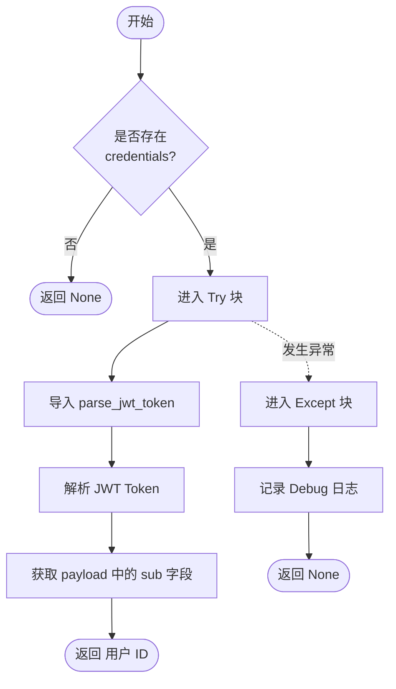
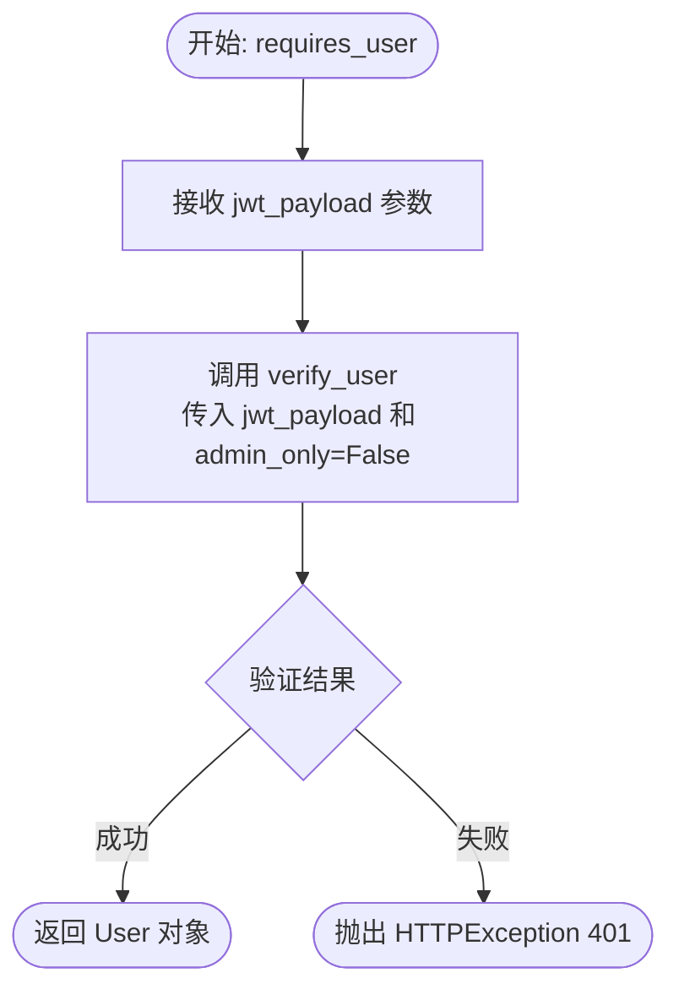
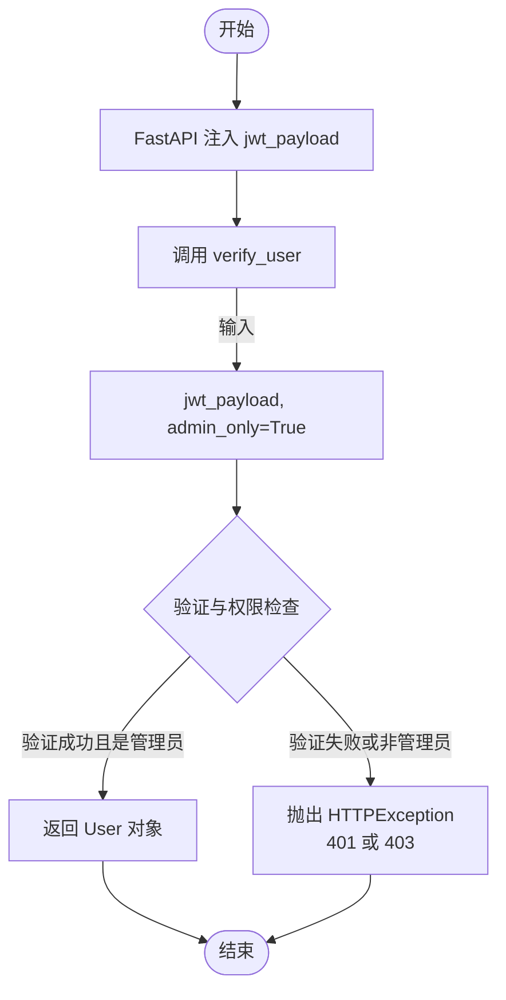
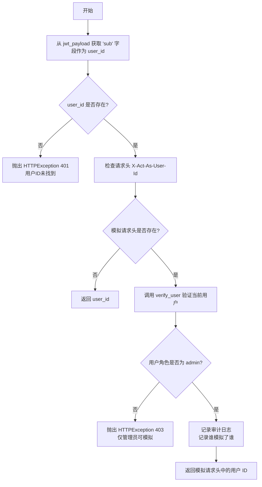

# `.\AutoGPT\autogpt_platform\autogpt_libs\autogpt_libs\auth\dependencies.py` 详细设计文档

该文件提供了一组基于 FastAPI 框架的依赖注入函数，用于处理 JWT 令牌的认证与授权，支持可选用户识别、强制用户/管理员权限验证以及管理员模拟用户身份的功能。

## 整体流程

```mermaid
graph TD
    A[请求开始] --> B{选择依赖类型}
    B -- get_optional_user_id --> C{是否存在Credentials?}
    C -- 否 --> D[返回 None (匿名访问)]
    C -- 是 --> E[解析 JWT Token]
    E --> F{解析成功?}
    F -- 是 --> G[返回 User ID]
    F -- 否 --> D
    B -- requires_user --> H[获取 JWT Payload]
    H --> I[验证用户身份]
    I --> J[返回 User 对象]
    B -- requires_admin_user --> K[获取 JWT Payload]
    K --> L[验证管理员身份]
    L --> M[返回 Admin User 对象]
    B -- get_user_id --> N[获取 JWT Payload]
    N --> O{检查模拟 Header X-Act-As-User-Id}
    O -- 不存在 --> P[返回当前 User ID]
    O -- 存在 --> Q[验证当前用户是否为 Admin]
    Q -- 否 --> R[抛出 403 Forbidden]
    Q -- 是 --> S[记录模拟审计日志]
    S --> T[返回模拟目标 User ID]
```

## 类结构

```
Module Scope (auth_dependencies.py)
├── get_optional_user_id (function)
├── requires_user (function)
├── requires_admin_user (function)
└── get_user_id (function)
```

## 全局变量及字段


### `optional_bearer`
    
An instance of HTTPBearer security scheme configured with auto_error=False to allow optional authentication.

类型：`fastapi.security.http.HTTPBearer`
    


### `IMPERSONATION_HEADER_NAME`
    
The HTTP header name used to specify the target user ID for admin impersonation.

类型：`str`
    


### `logger`
    
The standard logger instance for this module, used for recording authentication events and debug information.

类型：`logging.Logger`
    


    

## 全局函数及方法


### `get_optional_user_id`

尝试从提供的 Bearer JWT 中提取用户 ID（"sub"声明）。这是一个允许已认证和匿名访问的依赖项。如果提供了有效的 Bearer 令牌，它会解析 JWT 并提取用户 ID；如果令牌缺失或无效，则返回 None，将请求视为匿名访问。

参数：

- `credentials`：`HTTPAuthorizationCredentials | None`，FastAPI Security 依赖项提供的可选 HTTP 授权凭据对象，用于携带认证信息。

返回值：`str | None`，从 JWT "sub"声明提取的用户 ID 字符串，如果不存在有效令牌则为 None。

#### 流程图



#### 带注释源码

```python
def get_optional_user_id(
    credentials: HTTPAuthorizationCredentials | None = fastapi.Security(
        optional_bearer
    ),
) -> str | None:
    """
    Attempts to extract the user ID ("sub" claim) from a Bearer JWT if provided.

    This dependency allows for both authenticated and anonymous access. If a valid bearer token is
    supplied, it parses the JWT and extracts the user ID. If the token is missing or invalid, it returns None,
    treating the request as anonymous.

    Args:
        credentials: Optional HTTPAuthorizationCredentials object from FastAPI Security dependency.

    Returns:
        The user ID (str) extracted from the JWT "sub" claim, or None if no valid token is present.
    """
    # 检查是否传入了凭据对象，如果没有，说明未提供 Token，直接返回 None
    if not credentials:
        return None

    try:
        # 从内部库导入 JWT 解析工具函数
        from autogpt_libs.auth.jwt_utils import parse_jwt_token

        # 调用解析函数处理凭据中的 Token 字符串，获取载荷（Payload）
        payload = parse_jwt_token(credentials.credentials)
        # 从载荷中提取 "sub" (Subject) 声明，通常用于存储用户 ID
        return payload.get("sub")
    except Exception as e:
        # 如果解析或验证过程中出现任何异常（如 Token 过期、格式错误等）
        # 记录调试日志，但不抛出错误
        logger.debug(f"Auth token validation failed (anonymous access): {e}")
        # 返回 None，将当前请求视为匿名访问
        return None
```


### `requires_user`

FastAPI dependency that requires a valid authenticated user.

参数：

- `jwt_payload`：`dict`，通过 FastAPI 依赖注入的 JWT 载荷，由 `get_jwt_payload` 解析得到。

返回值：`User`，经过验证的用户对象。

#### 流程图



#### 带注释源码

```python
async def requires_user(jwt_payload: dict = fastapi.Security(get_jwt_payload)) -> User:
    """
    FastAPI dependency that requires a valid authenticated user.

    Raises:
        HTTPException: 401 for authentication failures
    """
    # 调用 verify_user 函数验证 JWT 载荷
    # admin_only=False 表示不需要管理员权限，只要是有效用户即可
    return verify_user(jwt_payload, admin_only=False)
```


### `requires_admin_user`

该函数是一个 FastAPI 依赖项，用于强制要求请求上下文中的用户必须是经过身份验证的管理员。它通过解析并验证 JWT 载荷来确保用户的身份及管理员权限，若验证失败则抛出 HTTP 异常。

参数：

-   `jwt_payload`：`dict`，通过 FastAPI Security 依赖注入的已解析 JWT 载荷数据，包含用户身份信息。

返回值：`User`，验证通过后的管理员用户对象实例。

#### 流程图



#### 带注释源码

```python
async def requires_admin_user(
    jwt_payload: dict = fastapi.Security(get_jwt_payload),
) -> User:
    """
    FastAPI dependency that requires a valid admin user.

    Raises:
        HTTPException: 401 for authentication failures, 403 for insufficient permissions
    """
    # 调用 verify_user 函数进行用户验证
    # admin_only=True 标识要求用户必须拥有管理员权限
    return verify_user(jwt_payload, admin_only=True)
```


### `get_user_id`

FastAPI 依赖函数，用于获取已认证用户的 ID。该函数支持通过 `X-Act-As-User-Id` 请求头进行管理员模拟操作：如果请求头存在且当前用户是管理员，则返回被模拟用户的 ID；否则返回认证用户自身的 ID。该函数会记录所有模拟操作以供审计，并在认证失败或权限不足时抛出 HTTP 异常。

参数：

- `request`：`fastapi.Request`，FastAPI 的请求对象，用于访问请求头以获取模拟用户的信息。
- `jwt_payload`：`dict`，通过 FastAPI Security 依赖注入的解析后的 JWT 负载字典，包含用户声明信息。

返回值：`str`，从 JWT "sub" 声明中提取的用户 ID，或从模拟请求头中获取的用户 ID。

#### 流程图



#### 带注释源码

```python
async def get_user_id(
    request: fastapi.Request, jwt_payload: dict = fastapi.Security(get_jwt_payload)
) -> str:
    """
    FastAPI dependency that returns the ID of the authenticated user.

    Supports admin impersonation via X-Act-As-User-Id header:
    - If the header is present and user is admin, returns the impersonated user ID
    - Otherwise returns the authenticated user's own ID
    - Logs all impersonation actions for audit trail

    Raises:
        HTTPException: 401 for authentication failures or missing user ID
        HTTPException: 403 if non-admin tries to use impersonation
    """
    # Get the authenticated user's ID from JWT
    # 从 JWT 的 'sub' (subject) 声明中获取基础用户 ID
    user_id = jwt_payload.get("sub")
    if not user_id:
        # 如果 token 中没有用户 ID，抛出 401 未授权异常
        raise fastapi.HTTPException(
            status_code=401, detail="User ID not found in token"
        )

    # Check for admin impersonation header
    # 检查是否存在模拟用户的请求头 (IMPERSONATION_HEADER_NAME = "X-Act-As-User-Id")
    impersonate_header = request.headers.get(IMPERSONATION_HEADER_NAME, "").strip()
    if impersonate_header:
        # Verify the authenticated user is an admin
        # 验证当前请求的用户是否为有效用户（用于获取用户详细信息）
        authenticated_user = verify_user(jwt_payload, admin_only=False)
        
        # 检查该用户的角色是否为 'admin'
        if authenticated_user.role != "admin":
            # 如果不是管理员尝试模拟其他用户，抛出 403 禁止访问异常
            raise fastapi.HTTPException(
                status_code=403, detail="Only admin users can impersonate other users"
            )

        # Log the impersonation for audit trail
        # 记录模拟操作的详细信息，包括管理员信息、被模拟用户ID及请求路径，用于安全审计
        logger.info(
            f"Admin impersonation: {authenticated_user.user_id} ({authenticated_user.email}) "
            f"acting as user {impersonate_header} for requesting {request.method} {request.url}"
        )

        # 返回被模拟用户的 ID
        return impersonate_header

    # 如果没有模拟请求头，返回认证用户原本的 ID
    return user_id
```


## 关键组件


### 可选认证依赖组件

一种 FastAPI 依赖机制，允许同时处理经过认证和匿名的请求，尝试从 Bearer JWT 中提取用户 ID 而不强制抛出错误。

### 基于角色的访问控制组件

一组依赖函数，根据用户角色（普通用户或管理员）强制执行严格的身份验证和授权策略，以确保操作的安全性。

### 管理员模拟组件

一种允许管理员用户通过特定的 HTTP 请求头模拟其他用户身份的机制，包含权限验证和审计日志记录功能。


## 问题及建议


### 已知问题

-   **局部导入不符合规范**：在 `get_optional_user_id` 函数内部使用了 `from autogpt_libs.auth.jwt_utils import parse_jwt_token` 进行局部导入。除非是为了解决循环依赖，否则这种做法违反了 PEP 8 规范，降低了代码可读性，并可能导致轻微的性能开销（每次调用都需检查导入）。
-   **硬编码的角色字符串**：在 `get_user_id` 函数中，直接使用了字符串 `"admin"` 来判断用户角色（`if authenticated_user.role != "admin"`）。这种“魔法字符串”缺乏类型安全，容易因拼写错误导致逻辑错误，且在角色名称变更时难以维护。
-   **异常捕获过于宽泛**：在 `get_optional_user_id` 函数中，使用了 `except Exception as e` 捕获所有异常。这会掩盖具体的 Token 解析错误（如签名错误、过期错误等），使得调试变得困难，且可能隐藏潜在的系统级错误。
-   **模拟用户 ID 缺乏有效性验证**：在 `get_user_id` 函数中，当检测到模拟请求头时，代码直接返回了 `impersonate_header` 的值，但没有验证该目标用户 ID 在系统中是否真实存在。如果管理员输入了错误的 ID，后续的业务逻辑可能会在用户不存在的情况下产生不可预期的行为（如 404 或 500 错误），而非立即反馈参数错误。

### 优化建议

-   **调整导入位置**：将 `autogpt_libs.auth.jwt_utils` 模块的导入语句移至文件顶部，保持代码结构的清晰和一致性。
-   **引入角色枚举或常量**：定义一个 `Role` 枚举类或使用常量（如 `ROLE_ADMIN = "admin"`）来替代硬编码字符串，以提高代码的可维护性和类型安全性。
-   **细化异常处理逻辑**：仅捕获与 JWT 解析相关的特定异常（如 `jwt.PyJWTError` 或自定义的 Auth 异常），确保非预期的异常能够正常向上抛出，便于监控和排查问题。
-   **增加模拟目标用户校验**：在返回模拟用户 ID 之前，增加一步校验逻辑（例如调用 UserService 检查用户是否存在），如果目标用户不存在，应直接抛出 `400 Bad Request` 或 `404 Not Found` 异常，防止无效 ID 流入业务层。


## 其它


### 设计目标与约束

**设计目标**
*   **依赖注入封装**：为 FastAPI 路由提供声明式的认证和授权依赖，简化控制器层的代码。
*   **灵活的访问控制**：支持必须认证、管理员认证和匿名/可选认证三种模式，以适应不同的业务场景。
*   **安全模拟**：提供管理员模拟其他用户身份的功能，用于客服或调试场景，同时确保审计追踪。

**约束**
*   **框架依赖**：必须运行在 FastAPI 框架内，依赖其 `Security` 和 `Request` 对象。
*   **异常处理策略**：`get_optional_user_id` 函数被约束为静默失败（返回 None），严禁抛出 HTTP 异常中断请求；而其他依赖函数在认证失败时必须抛出 `HTTPException`。
*   **模拟权限**：模拟功能（`X-Act-As-User-Id`）仅限于拥有 "admin" 角色的用户，且必须在请求头中显式声明。
*   **Token 标准**：依赖 JWT Token 中包含 `sub` (Subject) 声明作为用户标识。

### 错误处理与异常设计

**错误处理策略**
*   **静默降级**：在 `get_optional_user_id` 中，采用 `try-except Exception` 块捕获所有解析过程中的异常（如 Token 过期、签名错误、格式错误），记录 Debug 日志后返回 `None`。这允许系统在无凭证或凭证无效时继续处理为匿名请求，而非直接报错。
*   **显式拒绝**：在 `requires_user`, `requires_admin_user` 和 `get_user_id` 中，不进行捕获，而是抛出标准的 FastAPI `HTTPException`。
    *   **401 Unauthorized**：当 Token 无效、过期或缺失 `sub` 字段时抛出。
    *   **403 Forbidden**：当非管理员用户尝试使用模拟功能，或普通用户尝试访问管理员资源时抛出。

**具体异常触发点**
*   **`get_user_id`**：
    *   若 `jwt_payload` 中无 `sub` -> 401。
    *   若 `X-Act-As-User-Id` 存在但当前用户非 Admin -> 403。

### 数据流与关键逻辑

**1. 可选认证流程 (`get_optional_user_id`)**
*   **输入**：HTTP Authorization Header (Bearer Token)。
*   **流程**：检查是否存在凭证 -> 存在则调用 `parse_jwt_token` 解析 -> 提取 `sub` 字段 -> 返回用户 ID；若不存在或解析失败 -> 捕获异常 -> 返回 `None`。

**2. 强制认证流程 (`requires_user` / `requires_admin_user`)**
*   **输入**：HTTP Authorization Header (Bearer Token)。
*   **流程**：调用 `get_jwt_payload` (内部验证签名和有效期) -> 获得 Payload -> 调用 `verify_user` (验证用户存在性及角色) -> 返回 `User` 对象。若验证失败，由底层依赖抛出 HTTP 异常中断流程。

**3. 用户身份获取与模拟流程 (`get_user_id`)**
*   **输入**：HTTP Request (含 Headers), JWT Payload。
*   **流程**：
    1.  从 Payload 中提取基础 `user_id`。
    2.  检查 Header `X-Act-As-User-Id` 是否存在。
    3.  **分支 A (无模拟)**：直接返回基础 `user_id`。
    4.  **分支 B (模拟请求)**：
        *   验证当前用户角色是否为 `admin`。
        *   若非 Admin -> 抛出 403。
        *   若是 Admin -> 记录审计日志 -> 返回 Header 中的目标用户 ID。

### 外部依赖与接口契约

**外部模块依赖**
*   **`fastapi`**：
    *   `fastapi.Security`：依赖注入装饰器。
    *   `fastapi.HTTPException`：标准 HTTP 异常类。
    *   `fastapi.Request`：请求对象，用于访问 Headers。
    *   `fastapi.security.HTTPBearer` & `HTTPAuthorizationCredentials`：用于处理 Bearer Token 认证方案。
*   **`.jwt_utils` (内部模块)**：
    *   `get_jwt_payload`：契约 - 验证 JWT 并返回 Payload 字典，失败时抛出异常。
    *   `verify_user`：契约 - 接收 Payload 和 `admin_only` 布尔值，返回 `User` 对象或抛出异常。
    *   `parse_jwt_token`：契约 - 解码 JWT 字符串返回 Payload，不进行签名验证（或在内部验证）。
*   **`.models` (内部模块)**：
    *   `User`：数据模型类，至少包含 `user_id`, `email`, `role` 属性。

**接口契约**
*   **返回值类型**：严格遵循类型注解（`str | None`, `User`, `str`），确保下游调用者能获得确定的类型。
*   **常量契约**：`IMPERSONATION_HEADER_NAME` ("X-Act-As-User-Id") 必须与客户端请求中的 Header 键完全一致。

### 可观测性与日志

**日志记录策略**
*   **级别控制**：
    *   **DEBUG**：用于 `get_optional_user_id` 中 Token 验证失败的详情，避免在生产环境产生过多噪音，但便于开发调试。
    *   **INFO**：用于 `get_user_id` 中的管理员模拟操作。由于模拟涉及敏感权限提升，必须记录 INFO 级别日志，包含操作者 ID、被模拟者 ID、请求方法和 URL，用于审计追踪。
*   **日志内容**：包含足够的上下文信息（User ID, Email, Request URL, Method），确保在发生安全事件时可溯源。

    