# `.\AutoGPT\autogpt_platform\autogpt_libs\autogpt_libs\auth\dependencies_test.py` 详细设计文档

This file serves as a comprehensive test suite for the authentication dependencies module, validating the logic for user authentication, role-based access control (RBAC), and admin user impersonation with audit logging. It includes unit tests, integration tests with FastAPI, edge case handling for complex payloads and unicode, and specific tests for the impersonation feature.

## 整体流程

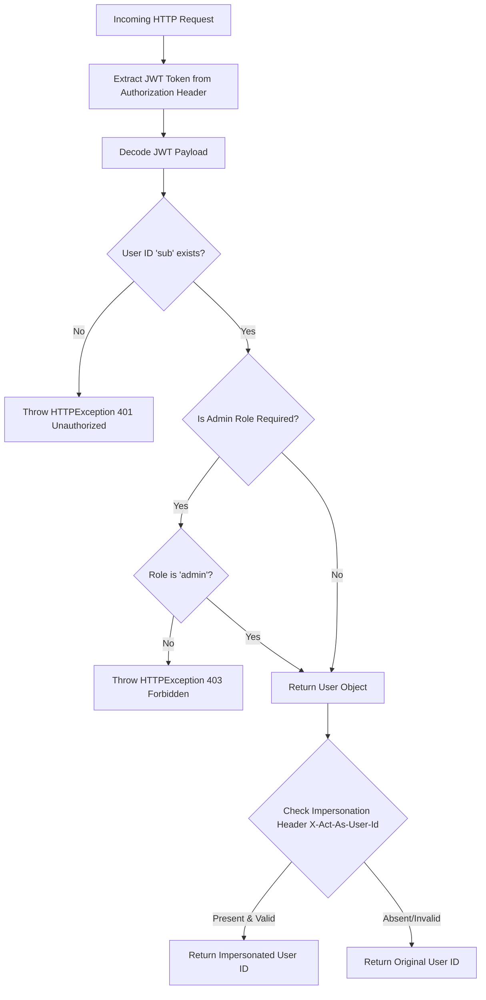

## 类结构

```
TestAuthDependencies (Unit Tests)
├── test_requires_user_with_valid_jwt_payload
├── test_requires_user_with_admin_jwt_payload
├── test_requires_user_missing_sub
├── test_requires_user_empty_sub
├── test_requires_admin_user_with_admin
├── test_requires_admin_user_with_regular_user
├── test_requires_admin_user_missing_role
├── test_get_user_id_with_valid_payload
├── test_get_user_id_missing_sub
├── test_get_user_id_none_sub
TestAuthDependenciesIntegration (Integration Tests)
├── test_endpoint_auth_enabled_no_token
├── test_endpoint_with_valid_token
├── test_admin_endpoint_requires_admin_role
TestAuthDependenciesEdgeCases (Edge Case Tests)
├── test_dependency_with_complex_payload
├── test_dependency_with_unicode_in_payload
├── test_dependency_with_null_values
├── test_concurrent_requests_isolation
├── test_dependency_error_cases
├── test_dependency_valid_user
TestAdminImpersonation (Impersonation Tests)
├── test_admin_impersonation_success
├── test_non_admin_impersonation_attempt
├── test_impersonation_empty_header
├── test_impersonation_missing_header
├── test_impersonation_audit_logging_details
├── test_impersonation_header_case_sensitivity
└── test_impersonation_with_whitespace_header
```

## 全局变量及字段


### `acceptable_jwt_secret`
    
A constant string used as the JWT signing secret for integration tests.

类型：`str`
    


### `TestAuthDependencies.app`
    
Creates a test FastAPI application with endpoints.

类型：`fixture`
    


### `TestAuthDependencies.client`
    
Creates a TestClient for the application.

类型：`fixture`
    


### `TestAuthDependenciesIntegration.acceptable_jwt_secret`
    
A hardcoded secret key for JWT generation during tests.

类型：`class variable`
    
    

## 全局函数及方法


### `TestAuthDependencies.test_requires_user_with_valid_jwt_payload`

该测试方法旨在验证 `requires_user` 认证依赖项在接收到包含有效用户信息的 JWT 负载时的行为。它通过模拟底层的 `get_jwt_payload` 函数来模拟成功的认证场景，并断言返回的 `User` 对象是否正确实例化且包含预期的属性（如 `user_id` 和 `role`）。

参数：

-  `self`: `TestAuthDependencies`，测试类的实例。
-  `mocker`: `MockerFixture`，来自 `pytest-mock` 的 fixture，用于模拟外部依赖（如 `get_jwt_payload`）。

返回值：`None`，该方法通过断言验证逻辑，不返回显式值。

#### 流程图

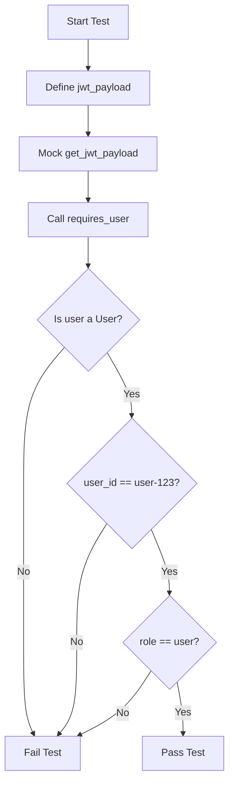

#### 带注释源码

```python
@pytest.mark.asyncio
async def test_requires_user_with_valid_jwt_payload(self, mocker: MockerFixture):
    """Test requires_user with valid JWT payload."""
    # 定义一个模拟的 JWT 负载，包含用户ID、角色和邮箱
    jwt_payload = {"sub": "user-123", "role": "user", "email": "user@example.com"}

    # Mock get_jwt_payload to return our test payload
    # 模拟 get_jwt_payload 函数，使其返回我们定义的测试负载
    # 这样可以隔离测试，不依赖实际的 JWT 解码逻辑
    mocker.patch(
        "autogpt_libs.auth.dependencies.get_jwt_payload", return_value=jwt_payload
    )
    
    # 调用 requires_user 依赖项，传入模拟的负载
    user = await requires_user(jwt_payload)
    
    # 断言返回的对象是 User 类的实例
    assert isinstance(user, User)
    
    # 断言用户ID是否匹配
    assert user.user_id == "user-123"
    
    # 断言用户角色是否匹配
    assert user.role == "user"
```


### `TestAuthDependencies.test_requires_user_with_admin_jwt_payload`

该测试方法用于验证 `requires_user` 依赖函数能够正确处理并接受包含 'admin' 角色的 JWT 载荷。它通过模拟 JWT 载荷的获取过程，断言返回的用户对象是否包含正确的用户 ID 和角色信息。

参数：

-  `self`: `TestAuthDependencies`，测试类的实例。
-  `mocker`: `pytest_mock.MockerFixture`，用于创建 Mock 对象和修补依赖的测试辅助工具。

返回值：`None`，该测试方法通过断言验证逻辑，不返回显式值。

#### 流程图

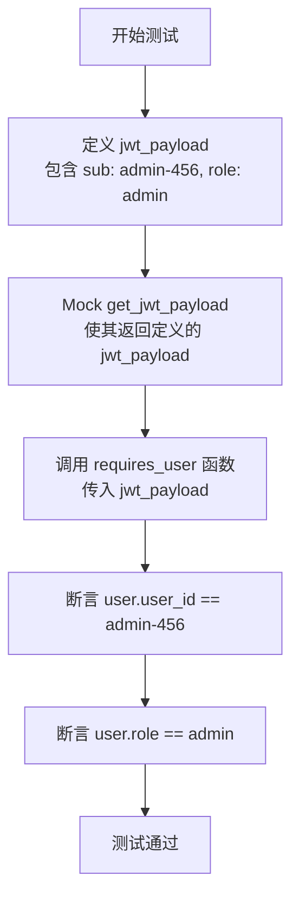

#### 带注释源码

```python
@pytest.mark.asyncio
async def test_requires_user_with_admin_jwt_payload(self, mocker: MockerFixture):
    """Test requires_user accepts admin users."""
    # 定义一个测试用的 JWT 载荷，其中包含 'admin' 角色
    jwt_payload = {
        "sub": "admin-456",
        "role": "admin",
        "email": "admin@example.com",
    }

    # 使用 mocker.patch 模拟 autogpt_libs.auth.dependencies.get_jwt_payload 函数
    # 强制其返回我们定义的 jwt_payload，从而隔离实际的 JWT 解码逻辑
    mocker.patch(
        "autogpt_libs.auth.dependencies.get_jwt_payload", return_value=jwt_payload
    )
    
    # 调用 requires_user 依赖函数，传入模拟的载荷
    user = await requires_user(jwt_payload)
    
    # 验证返回的用户对象的 user_id 是否正确
    assert user.user_id == "admin-456"
    
    # 验证返回的用户对象的 role 是否正确
    assert user.role == "admin"
```


### `TestAuthDependencies.test_requires_user_missing_sub`

该方法验证 `requires_user` 认证依赖在 JWT 载荷中缺少 `sub`（用户ID）字段时的行为。它断言当载荷不包含有效的用户标识时，依赖函数应抛出一个状态码为 401（未授权）的 `HTTPException`，并包含特定的错误信息 "User ID not found"，以确保认证失败时能正确返回错误响应。

#### 文件整体运行流程

该文件是一个全面的认证依赖测试套件，主要利用 FastAPI 的 `TestClient` 和 `pytest` 框架来验证认证逻辑。测试流程首先通过 fixtures 创建模拟的 FastAPI 应用和测试客户端，随后对 `requires_user`、`requires_admin_user` 和 `get_user_id` 等核心依赖函数进行单元测试（包括有效载荷、缺失字段、空值等场景），接着进行集成测试（使用真实的 JWT Token 访问端点），最后覆盖边缘情况（如 Unicode、并发请求）和管理员模拟功能。

#### 类的详细信息

**类名：** `TestAuthDependencies`

**类字段：**
*   无（类级别无持久化字段，仅包含 pytest fixtures）。

**类方法：**
1.  **`app`**: `pytest.fixture`，创建一个包含三个端点（`/user`, `/admin`, `/user-id`）的 FastAPI 应用实例。
2.  **`client`**: `pytest.fixture`，基于 `app` 创建 `TestClient` 实例。
3.  **`test_requires_user_with_valid_jwt_payload`**: 异步测试，验证 `requires_user` 在有效载荷下能正确解析用户信息。
4.  **`test_requires_user_with_admin_jwt_payload`**: 异步测试，验证 `requires_user` 能正确识别管理员角色。
5.  **`test_requires_user_missing_sub`**: **目标方法**，验证缺失 `sub` 字段时的错误处理。
6.  **`test_requires_user_empty_sub`**: 异步测试，验证空字符串 `sub` 字段时的错误处理。
7.  **`test_requires_admin_user_with_admin`**: 异步测试，验证管理员权限验证。
8.  **`test_requires_admin_user_with_regular_user`**: 异步测试，验证普通用户访问管理员端点被拒绝。
9.  **`test_requires_admin_user_missing_role`**: 异步测试，验证缺失角色字段时的异常处理。
10. **`test_get_user_id_with_valid_payload`**: 异步测试，验证 `get_user_id` 提取逻辑。
11. **`test_get_user_id_missing_sub`**: 异步测试，验证 `get_user_id` 缺失 `sub` 时的错误处理。
12. **`test_get_user_id_none_sub`**: 异步测试，验证 `get_user_id` `sub` 为 `None` 时的错误处理。

#### 关键组件信息

1.  **`requires_user`**: 核心认证依赖函数，负责从 JWT 载荷中提取并验证用户身份。
2.  **`pytest.raises`**: Pytest 断言工具，用于捕获并验证代码中抛出的异常。
3.  **`HTTPException`**: FastAPI 异常类，用于在认证失败时返回标准的 HTTP 错误响应。
4.  **`jwt_payload`**: 模拟的 JWT 载荷字典，用于测试输入数据。

#### 潜在的技术债务或优化空间

1.  **Mock 依赖不一致**：在同一个类中，其他测试方法（如 `test_requires_user_with_valid_jwt_payload`）使用了 `mocker.patch` 来模拟 `get_jwt_payload`，而 `test_requires_user_missing_sub` 直接调用了 `requires_user`。这暗示了 `requires_user` 的实现可能依赖于全局状态或未在测试中正确隔离的依赖，或者该测试依赖于外部库的实际行为。如果 `requires_user` 内部调用了 `get_jwt_payload` 且未在测试中 mock，测试可能会失败或产生不可预测的结果。
2.  **硬编码错误消息**：测试断言了具体的错误消息 "User ID not found"。如果后端实现修改了错误消息，测试将会失败。建议使用正则表达式或更通用的断言来匹配错误类型。

#### 其它项目

*   **设计目标与约束**：确保认证流程的安全性，强制要求所有受保护的端点必须提供有效的用户身份标识（`sub`）。测试遵循测试金字塔原则，覆盖了单元测试和集成测试。
*   **错误处理与异常设计**：定义了清晰的错误响应规范。当认证失败时，系统应返回 401 状态码，并附带描述性的错误详情，以便前端进行相应的 UI 反馈。
*   **数据流与状态机**：数据流为 `JWT Payload` -> `Dependency Validation` -> `User Object` 或 `HTTPException`。该测试验证了状态机在输入无效（缺失 `sub`）时的错误转换路径。

#### 流程图

```mermaid
flowchart TD
    A[Start: test_requires_user_missing_sub] --> B[Create jwt_payload without 'sub' key]
    B --> C[Call requires_user jwt_payload]
    C --> D{Exception Caught?}
    D -- No --> E[Test Failed: No Exception Raised]
    D -- Yes --> F[Capture HTTPException]
    F --> G[Assert status_code == 401]
    G --> H[Assert detail == "User ID not found"]
    H --> I[Test Passed]
    E --> J[End: Test Failed]
    I --> J
```

#### 带注释源码

```python
@pytest.mark.asyncio
async def test_requires_user_missing_sub(self):
    """
    Test requires_user with missing user ID.
    验证当 JWT 载荷中缺少 'sub' 字段时，requires_user 函数是否正确抛出异常。
    """
    # 构造一个不包含 'sub' 字段的 JWT 载荷
    jwt_payload = {"role": "user", "email": "user@example.com"}

    # 使用 pytest.raises 上下文管理器捕获可能抛出的 HTTPException
    with pytest.raises(HTTPException) as exc_info:
        # 调用 requires_user 依赖函数
        await requires_user(jwt_payload)
    
    # 断言异常的状态码为 401 (Unauthorized)
    assert exc_info.value.status_code == 401
    
    # 断言异常详情中包含预期的错误消息
    assert "User ID not found" in exc_info.value.detail
```


### `TestAuthDependencies.test_requires_user_empty_sub`

该测试方法旨在验证 `requires_user` 依赖函数在接收到 `sub` (subject/user ID) 字段为空字符串的 JWT 负载时的行为。它预期该函数会抛出一个 HTTPException 异常，状态码为 401 (Unauthorized)，以表明用户身份验证失败。

参数：

-  `self`: `TestAuthDependencies`，测试类的实例，用于访问类方法和上下文。

返回值：`None`，该测试方法执行断言检查，不返回任何值。

#### 流程图

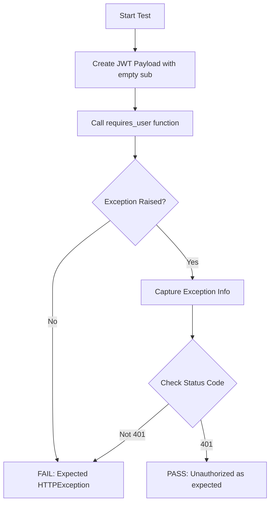

#### 带注释源码

```python
@pytest.mark.asyncio
async def test_requires_user_empty_sub(self):
    """Test requires_user with empty user ID."""
    # 构造一个 JWT 负载，其中 'sub' 字段为空字符串，模拟无效的用户标识
    jwt_payload = {"sub": "", "role": "user"}

    # 使用 pytest.raises 上下文管理器捕获可能抛出的 HTTPException
    with pytest.raises(HTTPException) as exc_info:
        # 调用 requires_user 函数处理该负载
        await requires_user(jwt_payload)
    
    # 验证抛出的异常状态码是否为 401 (Unauthorized)
    assert exc_info.value.status_code == 401
```

这段代码是一个针对认证依赖项的全面集成测试套件，主要验证了从HTTP请求到用户验证的完整认证流程，特别是针对管理员权限的验证逻辑。

### 文件的整体运行流程

该文件首先导入必要的测试框架（如 `pytest` 和 `unittest.mock`）以及被测模块（`autogpt_libs.auth`）。它定义了一个测试类 `TestAuthDependencies`，其中包含多个测试方法，分别测试普通用户验证、管理员用户验证、错误处理（如缺失用户ID或角色）、JWT载荷解析以及并发请求隔离。此外，还包含集成测试类 `TestAuthDependenciesIntegration`，用于测试FastAPI端点与认证依赖的交互，以及 `TestAuthDependenciesEdgeCases` 类，用于测试边缘情况（如Unicode字符、空值）。最后，`TestAdminImpersonation` 类专门测试管理员模拟其他用户的功能。所有测试均使用 `pytest` 的异步支持和 Mock 对象来隔离外部依赖（如JWT解析），确保测试的独立性和速度。

### 类的详细信息

**类名：** `TestAuthDependencies`

**类字段：**
*   无（标准测试类，通常不包含实例字段）。

**类方法：**
*   `app(self)`: 创建一个用于测试的 FastAPI 应用实例，并注册了几个测试端点（`/user`, `/admin`, `/user-id`）。
*   `client(self, app)`: 创建一个 `TestClient` 实例，用于模拟 HTTP 请求。
*   `test_requires_user_with_valid_jwt_payload(self, mocker)`: 测试 `requires_user` 在有效载荷下的行为。
*   `test_requires_admin_user_with_admin(self, mocker)`: **[目标方法]** 测试 `requires_admin_user` 接受管理员角色。
*   `test_requires_admin_user_with_regular_user(self)`: 测试 `requires_admin_user` 拒绝普通用户。
*   `test_requires_admin_user_missing_role(self)`: 测试 `requires_admin_user` 在缺失角色时的行为。
*   `test_get_user_id_with_valid_payload(self, mocker)`: 测试 `get_user_id` 提取逻辑。
*   `test_get_user_id_missing_sub(self)`: 测试 `get_user_id` 在缺失用户ID时的错误处理。
*   `test_get_user_id_none_sub(self)`: 测试 `get_user_id` 在用户ID为None时的行为。

### 关键组件信息

1.  **`requires_admin_user`**: 认证依赖函数，用于验证当前用户是否具有管理员权限，否则抛出 HTTPException。
2.  **`get_jwt_payload`**: 被模拟的函数，用于从请求上下文中提取JWT载荷，在测试中被替换为固定的测试数据。
3.  **`User`**: 用户模型类，包含 `user_id` 和 `role` 等属性，用于验证返回结果。
4.  **`TestClient`**: FastAPI 提供的测试客户端，用于模拟发送 HTTP 请求。

### 潜在的技术债务或优化空间

1.  **硬编码的 Mock 路径**: 在测试中直接使用 `autogpt_libs.auth.dependencies.get_jwt_payload` 进行 patch，如果模块内部结构发生变化，测试可能会失败。建议使用更灵活的 Mock 策略或依赖注入。
2.  **重复的测试数据设置**: 多个测试方法中重复定义了 `jwt_payload` 字典，可以考虑使用 `pytest.fixture` 来统一管理测试数据，减少代码冗余。
3.  **测试隔离性**: 虽然使用了 Mock，但部分测试（如 `test_requires_admin_user_missing_role`）直接调用了依赖函数，而其他测试通过 FastAPI Security 机制调用。这种混合调用方式虽然覆盖了不同场景，但在维护时可能需要分别理解两种调用路径。

### 其它项目

*   **设计目标与约束**: 测试旨在验证认证逻辑的健壮性，确保只有具备特定角色的用户才能访问受保护的资源。约束条件包括必须处理缺失的 JWT 字段、无效的角色以及并发请求的隔离。
*   **错误处理与异常设计**: 测试覆盖了多种异常情况，包括 HTTP 401 (未授权/用户ID缺失) 和 HTTP 403 (禁止访问/非管理员)，以及 KeyError。
*   **数据流与状态机**: 数据流从 JWT 载荷 -> 认证依赖函数 -> User 模型对象。状态机主要涉及用户角色的验证（User -> Admin）。
*   **外部依赖与接口契约**: 测试依赖于 `autogpt_libs.auth` 模块提供的接口契约，特别是 `requires_admin_user` 的输入输出规范。

---

### `TestAuthDependencies.test_requires_admin_user_with_admin`

测试 `requires_admin_user` 在接收到包含管理员角色的 JWT 载荷时，能够正确返回用户对象。

**参数：**

-  `self`: `TestAuthDependencies`，测试类的实例。
-  `mocker`: `pytest_mock.MockerFixture`，用于模拟对象和函数的 fixture。

**返回值：** `None`，无返回值，仅用于断言验证。

#### 流程图

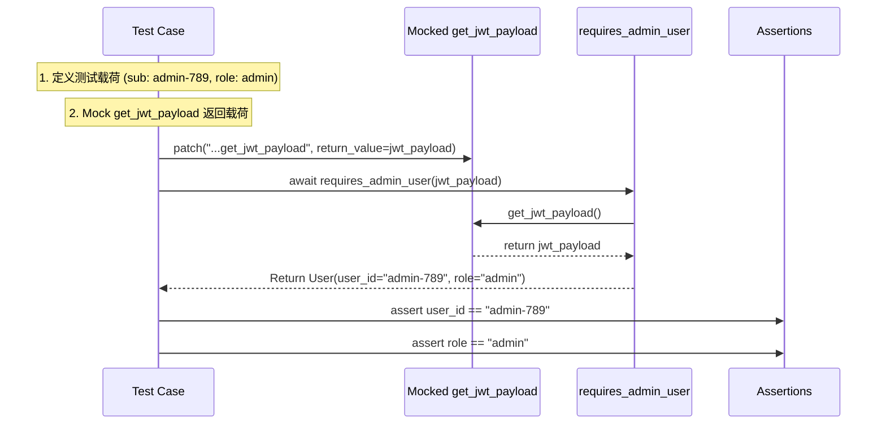

#### 带注释源码

```python
    @pytest.mark.asyncio
    async def test_requires_admin_user_with_admin(self, mocker: MockerFixture):
        """Test requires_admin_user with admin role."""
        # 定义一个包含管理员角色的 JWT 载荷
        jwt_payload = {
            "sub": "admin-789",
            "role": "admin",
            "email": "admin@example.com",
        }

        # 模拟 get_jwt_payload 函数，使其返回上述定义的载荷
        # 这样可以避免实际解析 JWT，加快测试速度并确保确定性
        mocker.patch(
            "autogpt_libs.auth.dependencies.get_jwt_payload", return_value=jwt_payload
        )
        
        # 调用被测函数
        user = await requires_admin_user(jwt_payload)
        
        # 断言返回的用户对象属性是否符合预期
        assert user.user_id == "admin-789"
        assert user.role == "admin"
```

### `TestAuthDependencies.test_requires_admin_user_with_regular_user`

该测试方法验证 `requires_admin_user` 依赖项能够正确拒绝普通用户（非管理员）的访问请求。它模拟了一个普通用户的 JWT 载荷，调用依赖项，并断言系统应抛出 HTTP 403 Forbidden 异常，且错误详情中包含 "Admin access required"。

参数：

-  `self`：`None`，测试类的实例引用。

返回值：`None`，测试方法不返回显式值，通过断言验证结果。

#### 流程图

```mermaid
flowchart TD
    A[Start Test] --> B[Create JWT Payload with role: user]
    B --> C[Mock get_jwt_payload to return payload]
    C --> D[Call requires_admin_user with payload]
    D --> E{Exception Raised?}
    E -- No --> F[FAIL: Expected HTTPException]
    E -- Yes --> G[Check Exception Status Code]
    G --> H{Status Code == 403?}
    H -- No --> I[FAIL: Wrong status code]
    H -- Yes --> J[Check Exception Detail]
    J --> K{Detail == "Admin access required"?}
    K -- No --> L[FAIL: Wrong detail message]
    K -- Yes --> M[PASS: Test Successful]
```

#### 带注释源码

```python
    @pytest.mark.asyncio
    async def test_requires_admin_user_with_regular_user(self):
        """Test requires_admin_user rejects regular users."""
        # 1. 定义一个模拟的 JWT 载荷，其中 role 为 'user'，表示这是一个普通用户
        jwt_payload = {"sub": "user-123", "role": "user", "email": "user@example.com"}

        # 2. 使用 pytest.raises 上下文管理器捕获调用 requires_admin_user 时可能抛出的异常
        with pytest.raises(HTTPException) as exc_info:
            # 3. 调用 requires_admin_user 依赖项，传入上述载荷
            await requires_admin_user(jwt_payload)
        
        # 4. 断言异常的状态码是否为 403 (Forbidden)，表示权限不足
        assert exc_info.value.status_code == 403
        
        # 5. 断言异常的详情信息中是否包含 "Admin access required" 字符串
        assert "Admin access required" in exc_info.value.detail
```

### `TestAuthDependencies.test_requires_admin_user_missing_role`

This test verifies that the `requires_admin_user` dependency function raises a `KeyError` when the provided JWT payload does not contain a 'role' field.

参数：

-  `self`：`TestAuthDependencies`，测试类的实例。

返回值：`None`，测试方法在断言通过后返回 `None`。

#### 流程图

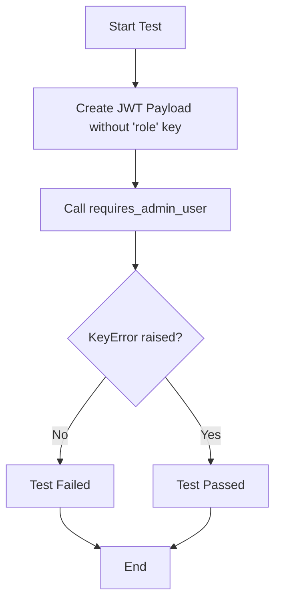

#### 带注释源码

```python
    @pytest.mark.asyncio
    async def test_requires_admin_user_missing_role(self):
        """Test requires_admin_user with missing role."""
        # 创建一个JWT载荷，其中不包含 'role' 字段
        jwt_payload = {"sub": "user-123", "email": "user@example.com"}

        # 断言调用 requires_admin_user 时会抛出 KeyError
        with pytest.raises(KeyError):
            await requires_admin_user(jwt_payload)
```

### `TestAuthDependencies.test_get_user_id_with_valid_payload`

该测试方法用于验证 `get_user_id` 依赖函数在接收到有效 JWT 负载时的行为。它通过模拟 HTTP 请求对象和 JWT 负载，并拦截 `get_jwt_payload` 的调用，来测试系统能否正确提取并返回用户 ID。

参数：

-  `self`: `TestAuthDependencies` 类的实例引用。
-  `mocker`: `pytest_mock.MockerFixture`，用于在测试过程中模拟（Mock）外部依赖或函数调用的工具。

返回值：`None`，作为测试方法，通常不返回显式值，但通过断言验证了 `get_user_id` 的返回值。

#### 流程图

```mermaid
graph TD
    A[开始测试] --> B[创建 Mock Request 对象]
    B --> C[定义 Mock JWT 负载]
    C --> D[Mock get_jwt_payload 函数]
    D --> E[调用 get_user_id 函数]
    E --> F{检查返回值}
    F -->|user_id == "user-id-xyz"| G[测试通过]
    F -->|user_id != "user-id-xyz"| H[测试失败]
    G --> I[结束测试]
    H --> I
```

#### 带注释源码

```python
    @pytest.mark.asyncio
    async def test_get_user_id_with_valid_payload(self, mocker: MockerFixture):
        """
        Test get_user_id extracts user ID correctly.
        """
        # 创建一个模拟的 Request 对象，用于模拟传入的 HTTP 请求
        request = Mock(spec=Request)
        request.headers = {}

        # 定义测试用的有效 JWT 负载，包含用户 ID "user-id-xyz"
        jwt_payload = {"sub": "user-id-xyz", "role": "user"}

        # 模拟 autogpt_libs.auth.dependencies.get_jwt_payload 函数
        # 让其返回我们定义的测试负载，而不是真实的 JWT 解析结果
        mocker.patch(
            "autogpt_libs.auth.dependencies.get_jwt_payload", return_value=jwt_payload
        )

        # 调用被测试的 get_user_id 函数
        user_id = await get_user_id(request, jwt_payload)

        # 断言返回的用户 ID 是否与预期值一致
        assert user_id == "user-id-xyz"
```

### `TestAuthDependencies.test_get_user_id_missing_sub`

This test method verifies the error handling logic within the `get_user_id` dependency when the provided JWT payload is missing the essential 'sub' (subject) field. It ensures that the system correctly raises an `HTTPException` with a 401 Unauthorized status code and a specific error message indicating the missing user ID.

参数：

-  `self`: Implicit instance parameter.
-  `request`: `Mock(spec=Request)`, A mocked FastAPI Request object used to simulate an incoming HTTP request context.
-  `jwt_payload`: `dict`, A dictionary representing the JWT payload, intentionally constructed without the 'sub' key to trigger the missing user ID error condition.

返回值：`None`，The test method does not return a value; it asserts the behavior of the dependency.

#### 流程图

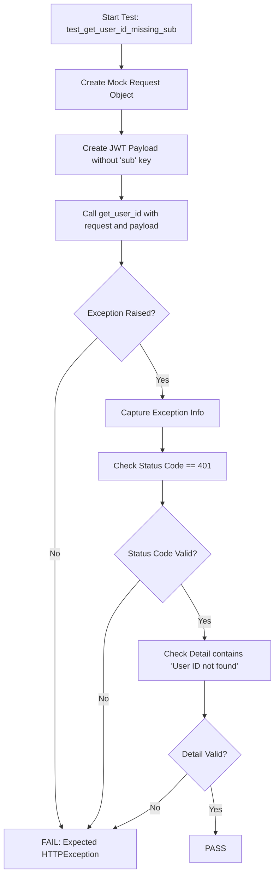

#### 带注释源码

```python
    @pytest.mark.asyncio
    async def test_get_user_id_missing_sub(self):
        """Test get_user_id with missing user ID."""
        # 1. Setup: Create a mock request object and a JWT payload missing the 'sub' key.
        request = Mock(spec=Request)
        request.headers = {}
        jwt_payload = {"role": "user"}

        # 2. Execution: Call get_user_id with the mocked request and payload.
        # Expecting an HTTPException to be raised due to missing user ID.
        with pytest.raises(HTTPException) as exc_info:
            await get_user_id(request, jwt_payload)

        # 3. Verification: Assert the exception details match the expected error response.
        assert exc_info.value.status_code == 401
        assert "User ID not found" in exc_info.value.detail
```

### `TestAuthDependencies.test_get_user_id_none_sub`

该测试方法旨在验证 `get_user_id` 依赖函数在处理 JWT 负载时，当 `sub` (subject) 字段值为 `None` 时的异常处理逻辑。它确保系统能够正确识别无效的身份标识，并抛出 HTTP 401 未授权异常，从而防止未定义的用户访问受保护资源。

参数：

-  `self`：`TestAuthDependencies`，测试类的实例，用于访问测试方法和上下文。

返回值：`None`，测试方法不返回显式值，而是通过断言验证异常行为。

#### 流程图

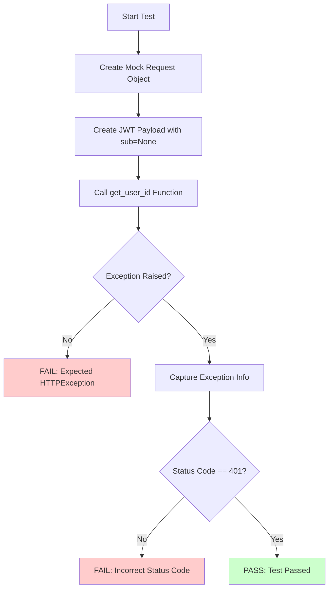

#### 带注释源码

```python
@pytest.mark.asyncio
async def test_get_user_id_none_sub(self):
    """Test get_user_id with None user ID."""
    # 创建一个模拟的 Request 对象，用于模拟 HTTP 请求上下文
    request = Mock(spec=Request)
    request.headers = {}
    
    # 构造一个包含 None 值的 JWT 负载，模拟无效的 'sub' (subject) 字段
    jwt_payload = {"sub": None, "role": "user"}

    # 验证 get_user_id 在接收到 None 值的 sub 时是否抛出 HTTPException
    with pytest.raises(HTTPException) as exc_info:
        await get_user_id(request, jwt_payload)
    
    # 断言异常的状态码为 401 (Unauthorized)
    assert exc_info.value.status_code == 401
```

### `TestAuthDependenciesIntegration.test_endpoint_auth_enabled_no_token`

This test method verifies that a FastAPI endpoint protected by the `requires_user` authentication dependency correctly rejects requests that do not include a valid JWT token in the Authorization header, specifically checking that the response status code is 401 (Unauthorized).

参数：

-  无

返回值：`None`，无返回值

#### 流程图

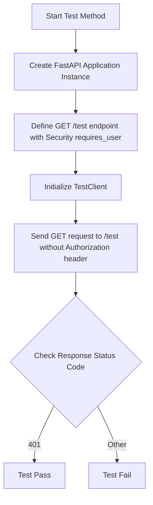

#### 带注释源码

```python
@pytest.mark.asyncio
async def test_endpoint_auth_enabled_no_token():
    """Test endpoints require token when auth is enabled."""
    # 1. 创建一个新的 FastAPI 应用实例用于测试
    app = FastAPI()

    # 2. 定义一个受保护的 GET 端点 '/test'，该端点强制要求用户身份验证
    @app.get("/test")
    def test_endpoint(user: User = Security(requires_user)):
        return {"user_id": user.user_id}

    # 3. 创建一个同步的测试客户端来模拟 HTTP 请求
    client = TestClient(app)

    # 4. 发送 GET 请求到受保护的端点，且不包含 Authorization 头
    response = client.get("/test")

    # 5. 断言响应状态码为 401 (Unauthorized)，验证未授权请求被正确拒绝
    assert response.status_code == 401
```


### `TestAuthDependenciesIntegration.test_endpoint_with_valid_token`

This test verifies the successful authentication flow when a valid JWT token is provided to a protected FastAPI endpoint. It ensures that the `requires_user` dependency correctly extracts the user ID and role from the token and returns a 200 OK status with the user details.

参数：

-  `create_token`：`mocker.MockerFixture`，一个辅助 fixture，用于生成有效的 JWT 令牌以进行测试。

返回值：`None`，测试方法执行断言，不返回显式值。

#### 流程图

```mermaid
graph TD
    A[Start Test] --> B[Create FastAPI App with /test endpoint]
    B --> C[Create TestClient]
    C --> D[Generate Valid JWT Token]
    D --> E[Send GET Request with Bearer Token]
    E --> F{Check Response Status}
    F -- 200 OK --> G[Assert JSON contains user_id]
    G --> H[End Test]
    F -- Other --> I[End Test (Fail)]
```

#### 带注释源码

```python
    @pytest.mark.asyncio
    async def test_endpoint_with_valid_token(self, create_token):
        """Test endpoint with valid JWT token."""
        app = FastAPI()

        @app.get("/test")
        def test_endpoint(user: User = Security(requires_user)):
            return {"user_id": user.user_id, "role": user.role}

        client = TestClient(app)

        token = create_token(
            {"sub": "test-user", "role": "user", "aud": "authenticated"},
            secret=self.acceptable_jwt_secret,
        )

        response = client.get("/test", headers={"Authorization": f"Bearer {token}"})
        assert response.status_code == 200
        assert response.json()["user_id"] == "test-user"
```


### `TestAuthDependenciesIntegration.test_admin_endpoint_requires_admin_role`

This test method verifies the authorization logic of the `/admin` endpoint by ensuring that the `requires_admin_user` dependency correctly enforces role-based access control. It validates that a request authenticated with a regular user's token is rejected with a 403 Forbidden status code, while a request authenticated with an admin's token is accepted and returns the admin's user ID.

参数：

-  `self`: `TestAuthDependenciesIntegration`，测试类的实例。
-  `create_token`: `Callable[[dict, str], str]`，一个辅助 fixture，用于生成带有特定载荷和密钥的有效 JWT 令牌。

返回值：`None`，测试方法执行完毕后返回空值，其成功与否由断言结果决定。

#### 流程图

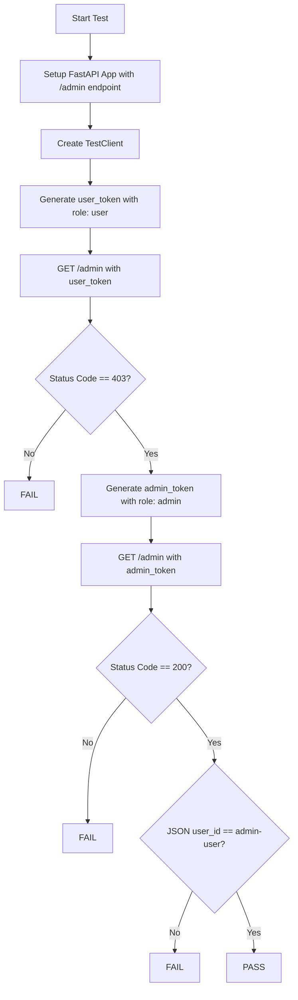

#### 带注释源码

```python
@pytest.mark.asyncio
async def test_admin_endpoint_requires_admin_role(self, create_token):
    """
    Test admin endpoint rejects non-admin users.
    This test verifies that the FastAPI endpoint decorated with requires_admin_user
    correctly validates the JWT token's role claim.
    """
    # 1. Setup: Create a fresh FastAPI application instance
    app = FastAPI()

    # 2. Define the endpoint under test
    # The 'user' parameter is injected via FastAPI Security (requires_admin_user)
    @app.get("/admin")
    def admin_endpoint(user: User = Security(requires_admin_user)):
        return {"user_id": user.user_id}

    # 3. Create a test client to simulate HTTP requests
    client = TestClient(app)

    # --- Scenario 1: Regular User Attempt ---
    # Generate a JWT token for a regular user (role: "user")
    user_token = create_token(
        {"sub": "regular-user", "role": "user", "aud": "authenticated"},
        secret=self.acceptable_jwt_secret,
    )

    # Attempt to access the /admin endpoint with the regular user's token
    response = client.get(
        "/admin", headers={"Authorization": f"Bearer {user_token}"}
    )
    
    # Assertion: Verify that the request is rejected with a 403 Forbidden status
    assert response.status_code == 403

    # --- Scenario 2: Admin User Attempt ---
    # Generate a JWT token for an admin user (role: "admin")
    admin_token = create_token(
        {"sub": "admin-user", "role": "admin", "aud": "authenticated"},
        secret=self.acceptable_jwt_secret,
    )

    # Attempt to access the /admin endpoint with the admin's token
    response = client.get(
        "/admin", headers={"Authorization": f"Bearer {admin_token}"}
    )
    
    # Assertion: Verify that the request succeeds with a 200 OK status
    assert response.status_code == 200
    
    # Assertion: Verify that the returned JSON contains the correct admin user ID
    assert response.json()["user_id"] == "admin-user"
```


### `TestAuthDependenciesEdgeCases.test_dependency_with_complex_payload`

该测试方法旨在验证认证依赖项（`requires_user` 和 `requires_admin_user`）能够正确处理包含额外非标准字段（如嵌套元数据对象）和标准 JWT 声明（如 `iat`, `exp`, `aud`）的复杂 JWT 载荷。它确保在载荷结构复杂的情况下，核心用户信息（用户 ID、邮箱、角色）依然能够被准确提取和验证。

参数：

-  `self`：`TestAuthDependenciesEdgeCases`，当前测试类的实例引用。

返回值：`None`，测试通过后不返回任何值，仅通过断言验证逻辑。

#### 流程图

```mermaid
graph TD
    A[Start Test] --> B[Define complex_payload with nested objects and JWT claims]
    B --> C[Call requires_user with complex_payload]
    C --> D{Extract user_id and email}
    D -->|Assert user_id| E[Assert user.user_id == "user-123"]
    D -->|Assert email| F[Assert user.email == "test@example.com"]
    E --> G[Call requires_admin_user with complex_payload]
    F --> G
    G --> H{Extract role}
    H --> I[Assert admin.role == "admin"]
    I --> J[End Test]
```

#### 带注释源码

```python
@pytest.mark.asyncio
async def test_dependency_with_complex_payload(self):
    """
    Test dependencies handle complex JWT payloads.
    This test verifies that the authentication dependencies can correctly
    parse and extract core user information (user_id, email, role) from
    JWT payloads that contain additional fields such as nested metadata
    objects and standard JWT claims (iat, exp, aud).
    """
    # 定义一个复杂的载荷字典，包含标准字段、嵌套对象以及标准的 JWT 声明
    # 目的是测试解析逻辑是否具备足够的鲁棒性，能够忽略非核心字段
    complex_payload = {
        "sub": "user-123",           # 标准的 Subject (用户 ID)
        "role": "admin",             # 标准的 Role (角色)
        "email": "test@example.com", # 标准的 Email
        # 嵌套的应用元数据对象
        "app_metadata": {"provider": "email", "providers": ["email"]},
        # 嵌套的用户元数据对象
        "user_metadata": {
            "full_name": "Test User",
            "avatar_url": "https://example.com/avatar.jpg",
        },
        # 标准 JWT 声明
        "aud": "authenticated",
        "iat": 1234567890,
        "exp": 9999999999,
    }

    # 测试 requires_user 函数是否能从复杂载荷中正确提取 user_id 和 email
    user = await requires_user(complex_payload)
    assert user.user_id == "user-123"
    assert user.email == "test@example.com"

    # 测试 requires_admin_user 函数是否能从复杂载荷中正确提取 role
    admin = await requires_admin_user(complex_payload)
    assert admin.role == "admin"
```

### `TestAuthDependenciesEdgeCases.test_dependency_with_unicode_in_payload`

Verifies that the authentication dependencies (`requires_user`) correctly handle and preserve Unicode characters (emoji, Chinese, Japanese) within the JWT payload fields such as `sub`, `email`, and `name`.

参数：

-  `self`：`TestAuthDependenciesEdgeCases`，测试类的隐式实例。

返回值：`None`，该方法执行断言验证，不返回显式值。

#### 流程图

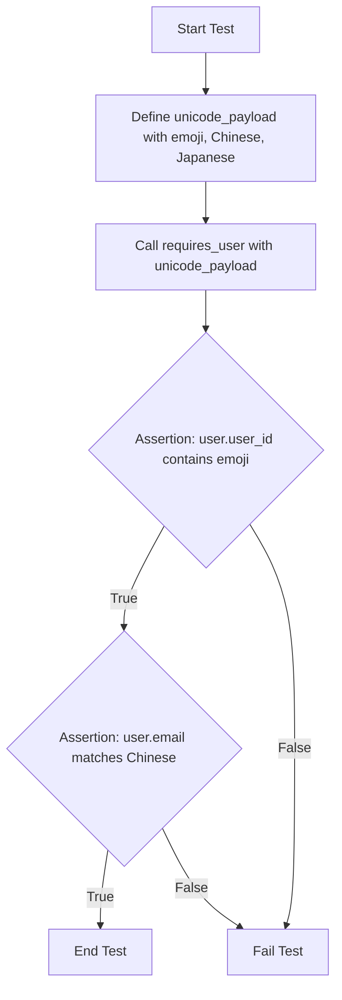

#### 带注释源码

```python
    @pytest.mark.asyncio
    async def test_dependency_with_unicode_in_payload(self):
        """Test dependencies handle unicode in JWT payloads."""
        # 定义包含多种 Unicode 字符的测试载荷
        # 包括 Emoji (😀), 中文 (测试), 和 日文 (日本語)
        unicode_payload = {
            "sub": "user-😀-123",
            "role": "user",
            "email": "测试@example.com",
            "name": "日本語",
        }

        # 调用 requires_user 依赖函数处理该载荷
        user = await requires_user(unicode_payload)

        # 断言：验证 user_id 中是否正确保留了 Emoji 字符
        assert "😀" in user.user_id
        # 断言：验证 email 字段是否正确保留了中文字符
        assert user.email == "测试@example.com"
```


### `TestAuthDependenciesEdgeCases.test_dependency_with_null_values`

该测试方法验证了认证依赖函数 `requires_user` 在处理包含 `None` 值的 JWT 负载时的健壮性，确保即使可选字段（如 `email`、`phone`、`metadata`）为空，系统也能正确解析并实例化用户对象，而不会抛出异常。

参数：

-  `self`：`object`，测试类的实例引用。

返回值：`None`，测试方法执行断言并返回空值。

#### 流程图

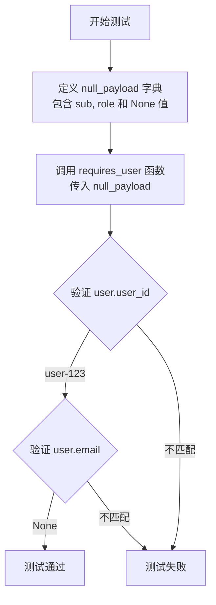

#### 带注释源码

```python
    @pytest.mark.asyncio
    async def test_dependency_with_null_values(self):
        """Test dependencies handle null values in payload."""
        # 定义一个包含 None 值的复杂负载，模拟后端数据库中某些字段缺失的情况
        null_payload = {
            "sub": "user-123",      # 必填字段，用户ID
            "role": "user",         # 必填字段，用户角色
            "email": None,          # 可选字段，邮箱为空
            "phone": None,          # 可选字段，电话为空
            "metadata": None,       # 可选字段，元数据为空
        }

        # 调用 requires_user 依赖函数，验证其能正确处理 None 值
        user = await requires_user(null_payload)

        # 断言：验证解析出的用户ID正确
        assert user.user_id == "user-123"
        
        # 断言：验证解析出的邮箱确实是 None，没有因为空值导致错误或默认值
        assert user.email is None
```


### `TestAuthDependenciesEdgeCases.test_concurrent_requests_isolation`

This test verifies that the authentication dependencies (`requires_user` and `requires_admin_user`) correctly process distinct user payloads without interfering with each other, ensuring that the context of one request does not affect the context of another.

参数：

-  无

返回值：`None`，测试执行结果（通过/失败）

#### 流程图

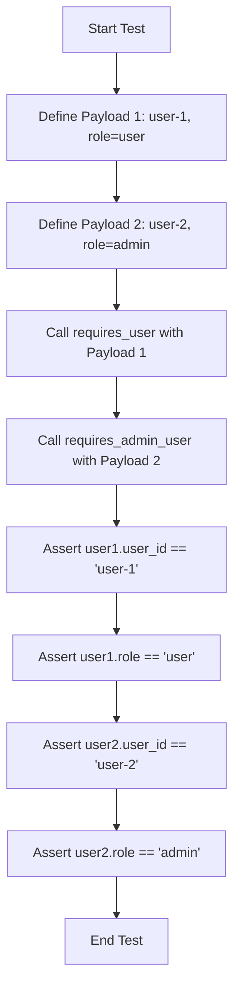

#### 带注释源码

```python
@pytest.mark.asyncio
async def test_concurrent_requests_isolation(self):
    """Test that concurrent requests don't interfere with each other."""
    # 定义两个不同的JWT负载，分别代表普通用户和管理员
    payload1 = {"sub": "user-1", "role": "user"}
    payload2 = {"sub": "user-2", "role": "admin"}

    # 模拟处理针对不同用户的请求
    # 此步骤验证依赖函数是否正确维护了请求上下文的隔离性
    user1 = await requires_user(payload1)
    user2 = await requires_admin_user(payload2)

    # 验证第一个用户上下文被正确隔离
    assert user1.user_id == "user-1"
    assert user1.role == "user"

    # 验证第二个用户上下文被正确隔离
    assert user2.user_id == "user-2"
    assert user2.role == "admin"
```


### `TestAuthDependenciesEdgeCases.test_dependency_error_cases`

该测试方法通过参数化测试用例，验证认证依赖在处理无效或非法 JWT 负载时的错误处理机制。它测试了从缺失授权头到无效用户 ID，再到权限不足（非管理员访问管理员端点）等多种边界情况，确保 `verify_user` 函数能正确抛出 `HTTPException` 并包含预期的错误描述。

参数：

-  `self`: `None`，测试类的实例引用。
-  `payload`: `Any`，待测试的无效 JWT 负载数据（可以是 `None`、空字典或缺少关键字段的字典）。
-  `expected_error`: `str`，期望在异常详情中出现的错误消息字符串。
-  `admin_only`: `bool`，标志位，指示 `verify_user` 是否应仅允许管理员访问。

返回值：`None`，该方法通过断言验证结果，不返回显式值。

#### 流程图

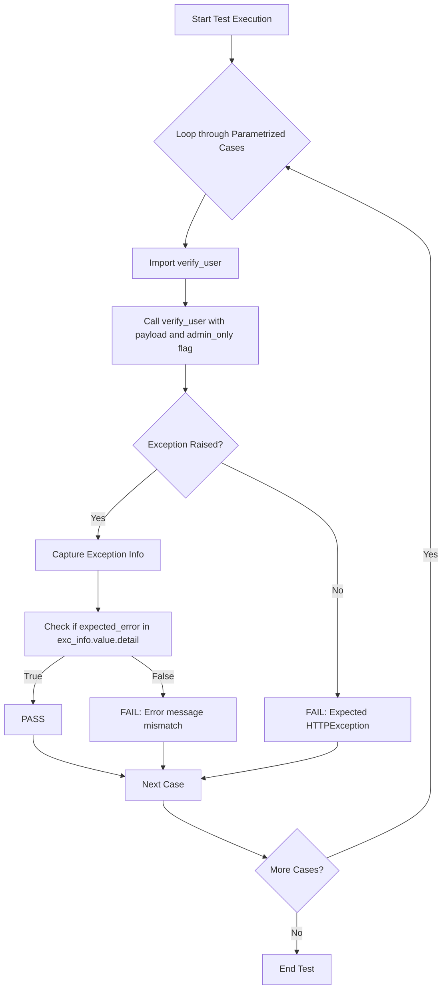

#### 带注释源码

```python
    @pytest.mark.asyncio
    @pytest.mark.parametrize(
        "payload,expected_error,admin_only",  # 定义测试参数：负载、期望的错误信息、是否仅限管理员
        [
            (None, "Authorization header is missing", False),  # 测试用例1: 空负载
            ({}, "User ID not found", False),                  # 测试用例2: 空字典
            ({"sub": ""}, "User ID not found", False),         # 测试用例3: 空用户ID
            ({"role": "user"}, "User ID not found", False),    # 测试用例4: 缺少用户ID字段
            ({"sub": "user", "role": "user"}, "Admin access required", True), # 测试用例5: 有效用户但非管理员(且admin_only=True)
        ],
    )
    @pytest.mark.asyncio
    async def test_dependency_error_cases(
        self, payload, expected_error: str, admin_only: bool
    ):
        """Test that errors propagate correctly through dependencies."""
        # Import verify_user to test it directly since dependencies use FastAPI Security
        from autogpt_libs.auth.jwt_utils import verify_user

        # 执行被测函数，预期会抛出 HTTPException
        with pytest.raises(HTTPException) as exc_info:
            verify_user(payload, admin_only=admin_only)
        
        # 断言异常详情中包含预期的错误消息
        assert expected_error in exc_info.value.detail
```


### `TestAuthDependenciesEdgeCases.test_dependency_valid_user`

This test method verifies the successful processing of a standard JWT payload by the `verify_user` function. It ensures that when a valid user ID (`sub`) and role are provided, the function returns a `User` object containing the correct attributes.

参数：

-  `self`：`None`，隐式实例参数。

返回值：`None`，测试方法本身不返回值，而是断言 `verify_user` 的返回值。

#### 流程图

```mermaid
flowchart TD
    A[Start Test] --> B[Define Valid Payload]
    B --> C[Call verify_user with payload and admin_only=False]
    C --> D{Verify User Object}
    D -- Success --> E[Assert user.user_id == "user"]
    E --> F[End Test]
    D -- Failure --> G[Test Fails]
```

#### 带注释源码

```
@pytest.mark.asyncio
async def test_dependency_valid_user(self):
    """Test valid user case for dependency."""
    # Import verify_user to test it directly since dependencies use FastAPI Security
    from autogpt_libs.auth.jwt_utils import verify_user

    # Valid case
    user = verify_user({"sub": "user", "role": "user"}, admin_only=False)
    assert user.user_id == "user"
```


### `TestAdminImpersonation.test_admin_impersonation_success`

This test method validates the successful execution of admin user impersonation logic. It simulates a scenario where an authenticated admin user attempts to impersonate a target user by setting the `X-Act-As-User-Id` header. The test verifies that the `get_user_id` function correctly returns the target user ID and that the audit logging mechanism captures the impersonation event with the required details (admin email and target ID).

参数：

-  `self`: `TestAdminImpersonation`，测试类的实例。
-  `mocker`: `pytest_mock.MockerFixture`，用于模拟外部依赖（如 `verify_user`、`get_jwt_payload` 和 `logger`）的测试工具。

返回值：`None`，测试方法通过断言验证逻辑，不返回显式值。

#### 流程图

```mermaid
graph TD
    A[Start Test] --> B[Create Mock Request with Header X-Act-As-User-Id]
    B --> C[Create Admin JWT Payload]
    C --> D[Mock verify_user to return Admin Mock Object]
    D --> E[Mock get_jwt_payload to return Admin Payload]
    E --> F[Call get_user_id with Request and Payload]
    F --> G{Check Return Value}
    G -- True --> H[Assert user_id is 'target-user-123']
    G -- False --> I[Fail Test]
    H --> J[Mock Logger]
    J --> K[Assert Logger.info called with specific message]
    K --> L[End Test]
```

#### 带注释源码

```python
@pytest.mark.asyncio
async def test_admin_impersonation_success(self, mocker: MockerFixture):
    """Test admin successfully impersonating another user."""
    # 1. 创建模拟的 Request 对象，并设置模拟的 X-Act-As-User-Id 头部
    request = Mock(spec=Request)
    request.headers = {"X-Act-As-User-Id": "target-user-123"}
    
    # 2. 创建模拟的 JWT 载荷，模拟管理员身份
    jwt_payload = {
        "sub": "admin-456",
        "role": "admin",
        "email": "admin@example.com",
    }

    # 3. Mock verify_user 函数，使其返回模拟的管理员用户对象
    mock_verify_user = mocker.patch("autogpt_libs.auth.dependencies.verify_user")
    mock_verify_user.return_value = Mock(
        user_id="admin-456", email="admin@example.com", role="admin"
    )

    # 4. Mock logger 以验证审计日志记录
    mock_logger = mocker.patch("autogpt_libs.auth.dependencies.logger")

    # 5. Mock get_jwt_payload 函数，使其返回测试载荷
    mocker.patch(
        "autogpt_libs.auth.dependencies.get_jwt_payload", return_value=jwt_payload
    )

    # 6. 执行被测试的函数 get_user_id
    user_id = await get_user_id(request, jwt_payload)

    # 7. 断言：应返回被冒充的用户 ID
    assert user_id == "target-user-123"

    # 8. 断言：应记录了冒充尝试的日志
    mock_logger.info.assert_called_once()
    log_call = mock_logger.info.call_args[0][0]
    assert "Admin impersonation:" in log_call
    assert "admin@example.com" in log_call
    assert "target-user-123" in log_call
```

### `TestAdminImpersonation.test_non_admin_impersonation_attempt`

该测试方法验证了管理员权限的隔离性，确保只有拥有管理员角色的用户才能通过 `X-Act-As-User-Id` 请求头执行用户伪装操作。当普通用户尝试伪装时，系统应拒绝请求并返回 403 禁止访问错误。

参数：

-  `self`：`TestAdminImpersonation`，测试类的实例。
-  `mocker`：`pytest_mock.MockerFixture`，用于创建 Mock 对象和修补依赖的测试辅助工具。

返回值：`None`，测试方法通过断言验证逻辑，不返回具体值。

#### 流程图

```mermaid
graph TD
    A[开始测试] --> B[创建 Mock Request 对象]
    B --> C[设置请求头 X-Act-As-User-Id]
    C --> D[创建 Mock JWT Payload]
    D --> E[设置 Payload 角色为 'user']
    E --> F[Mock verify_user 函数]
    F --> G[返回模拟的普通用户数据]
    G --> H[Mock get_jwt_payload 函数]
    H --> I[返回模拟的 JWT 载荷]
    I --> J[调用 get_user_id 函数]
    J --> K{检查是否抛出 HTTPException}
    K -->|未抛出异常| L[测试失败]
    K -->|抛出异常| M[断言状态码为 403]
    M --> N[断言错误详情包含特定文本]
    N --> O[测试通过]
```

#### 带注释源码

```python
@pytest.mark.asyncio
async def test_non_admin_impersonation_attempt(self, mocker: MockerFixture):
    """Test non-admin user attempting impersonation returns 403."""
    # 1. 创建模拟的 HTTP Request 对象
    request = Mock(spec=Request)
    # 设置伪装请求头，模拟普通用户试图伪装为 target-user-123
    request.headers = {"X-Act-As-User-Id": "target-user-123"}

    # 2. 创建模拟的 JWT 载荷
    jwt_payload = {
        "sub": "regular-user",  # 用户ID
        "role": "user",         # 角色为普通用户
        "email": "user@example.com",
    }

    # 3. Mock verify_user 函数，使其返回普通用户的数据
    mock_verify_user = mocker.patch("autogpt_libs.auth.dependencies.verify_user")
    mock_verify_user.return_value = Mock(
        user_id="regular-user", email="user@example.com", role="user"
    )

    # 4. Mock get_jwt_payload 函数，使其返回上述载荷
    mocker.patch(
        "autogpt_libs.auth.dependencies.get_jwt_payload", return_value=jwt_payload
    )

    # 5. 执行 get_user_id 函数，预期会抛出 HTTPException
    with pytest.raises(HTTPException) as exc_info:
        await get_user_id(request, jwt_payload)

    # 6. 验证异常状态码是否为 403 Forbidden
    assert exc_info.value.status_code == 403

    # 7. 验证异常详情消息是否包含权限拒绝的特定文本
    assert "Only admin users can impersonate other users" in exc_info.value.detail
```

### `TestAdminImpersonation.test_impersonation_empty_header`

该测试方法验证了当管理员用户尝试模拟其他用户，但提供的模拟头（`X-Act-As-User-Id`）为空字符串时，系统应回退到返回管理员自身的用户 ID，而不是抛出错误或模拟无效用户。

参数：

-  `self`: `TestAdminImpersonation`，测试类的实例。
-  `mocker`: `pytest_mock.MockerFixture`，用于模拟依赖项（如 `get_jwt_payload`、`verify_user` 和 `logger`）的测试工具。

返回值：`None`，测试方法通过断言验证逻辑，不返回显式值。

#### 流程图

```mermaid
flowchart TD
    Start([Start Test]) --> InitRequest[Create Mock Request with empty header]
    InitRequest --> InitPayload[Create JWT Payload for Admin]
    InitPayload --> MockPayload[mock get_jwt_payload to return payload]
    MockPayload --> CallFunction[Call get_user_id with request and payload]
    CallFunction --> CheckHeader{Check Header Value}
    CheckHeader -- Empty String --> ReturnAdmin[Return Admin's own User ID]
    ReturnAdmin --> AssertCheck[Assert user_id == "admin-456"]
    AssertCheck --> End([End Test])
```

#### 带注释源码

```python
@pytest.mark.asyncio
async def test_impersonation_empty_header(self, mocker: MockerFixture):
    """Test impersonation with empty header falls back to regular user ID."""
    # 1. 创建模拟的 Request 对象，并设置模拟头为空字符串
    request = Mock(spec=Request)
    request.headers = {"X-Act-As-User-Id": ""}
    
    # 2. 创建模拟的 JWT 载荷，代表一个管理员用户
    jwt_payload = {
        "sub": "admin-456",
        "role": "admin",
        "email": "admin@example.com",
    }

    # 3. 模拟 get_jwt_payload 函数，使其返回上述载荷
    mocker.patch(
        "autogpt_libs.auth.dependencies.get_jwt_payload", return_value=jwt_payload
    )

    # 4. 调用 get_user_id 函数
    user_id = await get_user_id(request, jwt_payload)

    # 5. 断言：验证当头为空时，系统回退返回了管理员的 ID
    # Should fall back to the admin's own user ID
    assert user_id == "admin-456"
```


### `TestAdminImpersonation.test_impersonation_missing_header`

该测试方法用于验证当缺少用户模拟头（`X-Act-As-User-Id`）时，`get_user_id` 函数的回退行为。它模拟了一个没有模拟头且包含管理员 JWT 载荷的请求，调用函数后断言返回值是否为管理员的原始用户 ID，以确保系统在未收到模拟指令时能正常返回当前登录用户的身份。

参数：

-  `self`: `TestAdminImpersonation`，测试类的实例。
-  `mocker`: `pytest_mock.MockerFixture`，用于模拟外部依赖（如 `get_jwt_payload`）的测试辅助对象。

返回值：`None`，该方法执行断言检查，不返回显式值，但通过断言验证逻辑的正确性。

#### 流程图

```mermaid
flowchart TD
    Start([Start Test]) --> SetupRequest[Create Mock Request with empty headers]
    SetupRequest --> SetupPayload[Create Mock JWT Payload for admin user]
    SetupPayload --> MockFunction[Mock get_jwt_payload to return payload]
    MockFunction --> CallFunction[Call get_user_id with request and payload]
    CallFunction --> AssertCheck{Check if user_id == "admin-456"}
    AssertCheck -- True --> End([Test Pass])
    AssertCheck -- False --> Fail([Test Fail])
```

#### 带注释源码

```python
@pytest.mark.asyncio
async def test_impersonation_missing_header(self, mocker: MockerFixture):
    """Test normal behavior when impersonation header is missing."""
    # 1. 创建模拟请求对象
    # 模拟一个没有 X-Act-As-User-Id 头的请求，测试系统应回退到默认行为
    request = Mock(spec=Request)
    request.headers = {}  # No impersonation header

    # 2. 创建模拟 JWT 载荷
    # 模拟一个已认证的管理员用户信息
    jwt_payload = {
        "sub": "admin-456",
        "role": "admin",
        "email": "admin@example.com",
    }

    # 3. 模拟外部依赖
    # 模拟 get_jwt_payload 函数，使其返回我们构造的测试载荷
    mocker.patch(
        "autogpt_libs.auth.dependencies.get_jwt_payload", return_value=jwt_payload
    )

    # 4. 执行被测逻辑
    # 调用 get_user_id 函数，传入模拟的请求和载荷
    user_id = await get_user_id(request, jwt_payload)

    # 5. 验证结果
    # 断言返回值应为管理员的原始 ID，而非模拟头中的 ID（因为模拟头不存在）
    assert user_id == "admin-456"
```


### `TestAdminImpersonation.test_impersonation_audit_logging_details`

该测试方法用于验证管理员用户在模拟其他用户时，审计日志记录功能的完整性。它确保系统在捕获目标用户ID的同时，正确记录了执行模拟操作的管理员邮箱地址。

参数：

-  `self`：`TestAdminImpersonation`，测试类的实例。
-  `mocker`：`pytest_mock.MockerFixture`，用于模拟（Mock）依赖项（如 `verify_user`、`logger` 和 `get_jwt_payload`）的测试工具。

返回值：`None`，测试方法通过断言验证逻辑，不返回显式值。

#### 流程图

```mermaid
graph TD
    A[开始测试] --> B[创建模拟请求对象 Request]
    B --> C[设置模拟请求头 X-Act-As-User-Id: victim-user-789]
    C --> D[创建模拟 JWT 载荷]
    D --> E[Mock verify_user 返回管理员数据]
    E --> F[Mock logger 以捕获日志]
    F --> G[Mock get_jwt_payload 返回载荷]
    G --> H[调用 get_user_id 函数]
    H --> I{断言 user_id == victim-user-789}
    I -- 是 --> J[断言 logger.info 被调用]
    J --> K[提取日志消息]
    K --> L{断言日志包含关键字}
    L -- 是 --> M[断言包含 superadmin@company.com]
    M --> N[断言包含 victim-user-789]
    N --> O[测试通过]
    L -- 否 --> P[测试失败]
```

#### 带注释源码

```python
@pytest.mark.asyncio
async def test_impersonation_audit_logging_details(self, mocker: MockerFixture):
    """Test that impersonation audit logging includes all required details."""
    
    # 1. 创建模拟的 HTTP 请求对象
    request = Mock(spec=Request)
    # 设置模拟的请求头，包含模拟目标用户的 ID
    request.headers = {"X-Act-As-User-Id": "victim-user-789"}
    
    # 2. 创建模拟的 JWT 载荷，包含管理员信息
    jwt_payload = {
        "sub": "admin-999",
        "role": "admin",
        "email": "superadmin@company.com",
    }

    # 3. Mock verify_user 函数，使其返回模拟的管理员用户数据
    mock_verify_user = mocker.patch("autogpt_libs.auth.dependencies.verify_user")
    mock_verify_user.return_value = Mock(
        user_id="admin-999", email="superadmin@company.com", role="admin"
    )

    # 4. Mock logger 对象，用于捕获审计日志输出
    mock_logger = mocker.patch("autogpt_libs.auth.dependencies.logger")

    # 5. Mock get_jwt_payload 函数，使其返回上述载荷
    mocker.patch(
        "autogpt_libs.auth.dependencies.get_jwt_payload", return_value=jwt_payload
    )

    # 6. 执行被测试函数 get_user_id
    user_id = await get_user_id(request, jwt_payload)

    # 7. 验证返回的用户 ID 是否为模拟的目标用户 ID
    assert user_id == "victim-user-789"
    
    # 8. 验证日志记录器是否被调用
    mock_logger.info.assert_called_once()

    # 9. 获取日志调用的具体消息内容
    log_message = mock_logger.info.call_args[0][0]
    
    # 10. 验证日志消息中包含所有必要的审计细节
    assert "Admin impersonation:" in log_message
    assert "superadmin@company.com" in log_message
    assert "victim-user-789" in log_message
```


### `TestAdminImpersonation.test_impersonation_header_case_sensitivity`

该测试方法用于验证管理员模拟功能中 impersonation header（`X-Act-As-User-Id`）的大小写敏感性。它确保当 header 的键名大小写不匹配（例如使用小写 'x'）时，系统不会触发模拟行为，而是回退到返回管理员自身的用户 ID。

参数：

-  `self`: `object`，隐式实例参数。
-  `mocker`: `pytest_mock.MockerFixture`，用于模拟外部依赖（如 `get_jwt_payload`、`verify_user` 和 `logger`）的测试工具。

返回值：`None`，测试方法通常不返回显式值，而是通过断言验证逻辑。

#### 流程图

```mermaid
graph TD
    A[Start Test] --> B[Create Mock Request with lowercase header key]
    B --> C[Create JWT Payload for Admin User]
    C --> D[Mock get_jwt_payload to return payload]
    D --> E[Call get_user_id with request and payload]
    E --> F{Check returned user_id}
    F -->|user_id == admin-456| G[Pass Test]
    F -->|user_id == target-user-123| H[Fail Test]
    G --> I[End Test]
    H --> I
```

#### 带注释源码

```python
@pytest.mark.asyncio
async def test_impersonation_header_case_sensitivity(self, mocker: MockerFixture):
    """Test that impersonation header is case-sensitive."""
    # 1. 创建模拟的 Request 对象
    # 设置 headers 为小写 'x-act-as-user-id'，以测试大小写敏感性
    request = Mock(spec=Request)
    request.headers = {"x-act-as-user-id": "target-user-123"}
    
    # 2. 创建模拟的 JWT 载荷，模拟一个管理员用户
    jwt_payload = {
        "sub": "admin-456",
        "role": "admin",
        "email": "admin@example.com",
    }

    # 3. 模拟 get_jwt_payload 函数，使其返回上述载荷
    mocker.patch(
        "autogpt_libs.auth.dependencies.get_jwt_payload", return_value=jwt_payload
    )

    # 4. 调用 get_user_id 函数
    # 由于 header 键名大小写不匹配，系统应忽略该 header 并回退到管理员自己的 ID
    user_id = await get_user_id(request, jwt_payload)

    # 5. 断言验证：返回值应为管理员自身的 ID (admin-456)
    # 如果 header 大小写匹配，这里会断言失败
    assert user_id == "admin-456"
```


### `TestAdminImpersonation.test_impersonation_with_whitespace_header`

该测试方法验证了管理员用户在执行用户模拟（Impersonation）时，对于包含前后空格的 `X-Act-As-User-Id` 请求头的处理逻辑。它确保系统能够正确去除请求头值中的空白字符，从而成功识别目标用户 ID，并触发相应的审计日志记录。

参数：

-  `self`: `TestAdminImpersonation`，当前测试类的实例。
-  `mocker`: `pytest_mock.MockerFixture`，用于在测试过程中模拟（Mock）对象和方法的 Pytest fixture。

返回值：`None`，该方法执行断言检查，不返回实际值。

#### 流程图

```mermaid
graph TD
    A[开始测试] --> B[创建 Mock Request 对象<br>设置 X-Act-As-User-Id 为 "  target-user-123  "]
    B --> C[创建管理员 JWT Payload<br>包含 admin-456 用户信息]
    C --> D[Mock verify_user 函数<br>返回模拟的管理员用户对象]
    D --> E[Mock get_jwt_payload 函数<br>返回步骤 C 中的 Payload]
    E --> F[Mock logger 对象<br>用于捕获审计日志]
    F --> G[调用 get_user_id 函数<br>传入 Request 和 Payload]
    G --> H{验证返回的 User ID}
    H -- 成功 --> I[断言 User ID 为 "target-user-123"<br>（验证空格已被去除）]
    I --> J{验证日志记录}
    J -- 已记录 --> K[断言 logger.info 被调用]
    K --> L[测试结束]
```

#### 带注释源码

```python
@pytest.mark.asyncio
async def test_impersonation_with_whitespace_header(self, mocker: MockerFixture):
    """Test impersonation with whitespace in header value."""
    # Step 1: 创建模拟的 Request 对象，模拟 HTTP 请求头中包含前后空格的目标用户 ID
    request = Mock(spec=Request)
    request.headers = {"X-Act-As-User-Id": "  target-user-123  "}
    
    # Step 2: 创建模拟的管理员 JWT 载荷
    jwt_payload = {
        "sub": "admin-456",
        "role": "admin",
        "email": "admin@example.com",
    }

    # Step 3: Mock verify_user 函数，使其返回模拟的管理员用户数据
    mock_verify_user = mocker.patch("autogpt_libs.auth.dependencies.verify_user")
    mock_verify_user.return_value = Mock(
        user_id="admin-456", email="admin@example.com", role="admin"
    )

    # Step 4: Mock logger 以便验证审计日志是否被正确记录
    mock_logger = mocker.patch("autogpt_libs.auth.dependencies.logger")

    # Step 5: Mock get_jwt_payload 函数，使其返回步骤 2 中的载荷
    mocker.patch(
        "autogpt_libs.auth.dependencies.get_jwt_payload", return_value=jwt_payload
    )

    # Step 6: 调用 get_user_id 函数，传入模拟的 request 和 jwt_payload
    user_id = await get_user_id(request, jwt_payload)

    # Step 7: 断言返回的 user_id 已去除前后空格，确认为目标用户 ID
    assert user_id == "target-user-123"
    
    # Step 8: 断言 logger.info 方法被调用，确认审计日志已生成
    mock_logger.info.assert_called_once()
```


## 关键组件


### 核心功能概述

这段代码是一个全面的认证依赖项测试套件，旨在验证 FastAPI 应用程序中的认证逻辑。它测试了 `requires_user`、`requires_admin_user` 和 `get_user_id` 等依赖函数，涵盖了 JWT 载荷解析、基于角色的访问控制（RBAC）、用户 ID 提取以及管理员用户模拟功能。测试包括单元测试、集成测试（使用模拟的 FastAPI 应用和客户端）以及边缘情况（如 Unicode 处理、并发请求和空值），确保认证流程的安全性和健壮性。

### 文件整体运行流程

该文件作为 Pytest 测试套件运行。首先，它定义了四个测试类：`TestAuthDependencies`、`TestAuthDependenciesIntegration`、`TestAuthDependenciesEdgeCases` 和 `TestAdminImpersonation`。每个类包含多个测试方法。测试流程通过 Pytest 框架自动发现并执行，利用 `pytest.fixture` 创建测试用的 FastAPI 应用、测试客户端和 JWT 令牌生成器。测试方法通过 `mocker` 模块模拟外部依赖（如 `get_jwt_payload` 和 `verify_user`），然后调用被测函数并断言返回结果或抛出的异常，以验证认证逻辑的正确性。

### 类的详细信息

#### TestAuthDependencies
*   **描述**: 测试认证依赖项函数的单元测试类。
*   **类字段**:
    *   `app`: `FastAPI`, 测试用的 FastAPI 应用实例。
    *   `client`: `TestClient`, 测试用的 HTTP 客户端。
*   **类方法**:
    *   `test_requires_user_with_valid_jwt_payload`: 测试有效的 JWT 载荷。
    *   `test_requires_user_with_admin_jwt_payload`: 测试管理员用户通过验证。
    *   `test_requires_user_missing_sub`: 测试缺少用户 ID 的情况。
    *   `test_requires_user_empty_sub`: 测试空用户 ID 的情况。
    *   `test_requires_admin_user_with_admin`: 测试管理员角色验证。
    *   `test_requires_admin_user_with_regular_user`: 测试普通用户访问管理员端点被拒绝。
    *   `test_requires_admin_user_missing_role`: 测试缺少角色的情况。
    *   `test_get_user_id_with_valid_payload`: 测试用户 ID 提取。
    *   `test_get_user_id_missing_sub`: 测试提取用户 ID 时缺少 ID。
    *   `test_get_user_id_none_sub`: 测试用户 ID 为 None 的情况。

#### TestAuthDependenciesIntegration
*   **描述**: 测试认证依赖项与 FastAPI 集成的测试类。
*   **类字段**:
    *   `acceptable_jwt_secret`: `str`, 用于测试的 JWT 密钥。
*   **类方法**:
    *   `test_endpoint_auth_enabled_no_token`: 测试未提供令牌时的 401 错误。
    *   `test_endpoint_with_valid_token`: 测试有效令牌的访问。
    *   `test_admin_endpoint_requires_admin_role`: 测试管理员端点的角色验证。

#### TestAuthDependenciesEdgeCases
*   **描述**: 测试认证依赖项边缘情况的测试类。
*   **类方法**:
    *   `test_dependency_with_complex_payload`: 测试复杂 JWT 载荷的处理。
    *   `test_dependency_with_unicode_in_payload`: 测试 Unicode 字符的处理。
    *   `test_dependency_with_null_values`: 测试空值的处理。
    *   `test_concurrent_requests_isolation`: 测试并发请求的隔离性。
    *   `test_dependency_error_cases`: 测试各种错误场景的参数化测试。
    *   `test_dependency_valid_user`: 测试有效的用户验证。

#### TestAdminImpersonation
*   **描述**: 测试管理员用户模拟功能的测试类。
*   **类方法**:
    *   `test_admin_impersonation_success`: 测试管理员成功模拟其他用户。
    *   `test_non_admin_impersonation_attempt`: 测试非管理员尝试模拟被拒绝。
    *   `test_impersonation_empty_header`: 测试空模拟头回退到管理员 ID。
    *   `test_impersonation_missing_header`: 测试缺少模拟头时的正常行为。
    *   `test_impersonation_audit_logging_details`: 测试审计日志记录的详细信息。
    *   `test_impersonation_header_case_sensitivity`: 测试模拟头的区分大小写。
    *   `test_impersonation_with_whitespace_header`: 测试模拟头中的空白字符处理。

### 类字段和全局变量详细信息

*   **acceptable_jwt_secret**
    *   **类型**: `str`
    *   **描述**: 用于生成和验证测试 JWT 令牌的硬编码密钥字符串。

### 类方法和全局函数详细信息

#### test_requires_user_with_valid_jwt_payload
*   **参数**:
    *   `self`: `TestAuthDependencies`, 测试实例。
    *   `mocker`: `MockerFixture`, Pytest-mock 提供的模拟器。
*   **返回值类型**: `None`
*   **返回值描述**: 无返回值，通过断言验证结果。
*   **Mermaid 流程图**:
    ```mermaid
    graph TD
    A[开始测试] --> B[设置 JWT 载荷]
    B --> C[Mock get_jwt_payload]
    C --> D[调用 requires_user]
    D --> E[断言返回 User 对象]
    E --> F[断言 user_id 和 role]
    F --> G[测试结束]
    ```
*   **带注释源码**:
    ```python
    @pytest.mark.asyncio
    async def test_requires_user_with_valid_jwt_payload(self, mocker: MockerFixture):
        """Test requires_user with valid JWT payload."""
        jwt_payload = {"sub": "user-123", "role": "user", "email": "user@example.com"}

        # Mock get_jwt_payload to return our test payload
        mocker.patch(
            "autogpt_libs.auth.dependencies.get_jwt_payload", return_value=jwt_payload
        )
        user = await requires_user(jwt_payload)
        assert isinstance(user, User)
        assert user.user_id == "user-123"
        assert user.role == "user"
    ```

#### test_admin_impersonation_success
*   **参数**:
    *   `self`: `TestAdminImpersonation`, 测试实例。
    *   `mocker`: `MockerFixture`, Pytest-mock 提供的模拟器。
*   **返回值类型**: `None`
*   **返回值描述**: 无返回值，通过断言验证结果。
*   **Mermaid 流程图**:
    ```mermaid
    graph TD
    A[开始测试] --> B[设置模拟请求头 X-Act-As-User-Id]
    B --> C[Mock verify_user 返回管理员数据]
    C --> D[Mock get_jwt_payload]
    D --> E[调用 get_user_id]
    E --> F[断言返回目标用户 ID]
    F --> G[断言日志记录包含模拟信息]
    G --> H[测试结束]
    ```
*   **带注释源码**:
    ```python
    @pytest.mark.asyncio
    async def test_admin_impersonation_success(self, mocker: MockerFixture):
        """Test admin successfully impersonating another user."""
        request = Mock(spec=Request)
        request.headers = {"X-Act-As-User-Id": "target-user-123"}
        jwt_payload = {
            "sub": "admin-456",
            "role": "admin",
            "email": "admin@example.com",
        }

        # Mock verify_user to return admin user data
        mock_verify_user = mocker.patch("autogpt_libs.auth.dependencies.verify_user")
        mock_verify_user.return_value = Mock(
            user_id="admin-456", email="admin@example.com", role="admin"
        )

        # Mock logger to verify audit logging
        mock_logger = mocker.patch("autogpt_libs.auth.dependencies.logger")

        mocker.patch(
            "autogpt_libs.auth.dependencies.get_jwt_payload", return_value=jwt_payload
        )

        user_id = await get_user_id(request, jwt_payload)

        # Should return the impersonated user ID
        assert user_id == "target-user-123"

        # Should log the impersonation attempt
        mock_logger.info.assert_called_once()
        log_call = mock_logger.info.call_args[0][0]
        assert "Admin impersonation:" in log_call
        assert "admin@example.com" in log_call
        assert "target-user-123" in log_call
    ```

### 关键组件信息

*   **requires_user**: 认证依赖项，用于验证用户身份并返回 User 对象。
*   **requires_admin_user**: 认证依赖项，用于验证用户是否为管理员。
*   **get_user_id**: 认证依赖项，用于提取用户 ID，支持管理员模拟功能。
*   **X-Act-As-User-Id**: HTTP 请求头，用于允许管理员模拟其他用户。
*   **TestClient**: FastAPI 提供的测试客户端，用于模拟 HTTP 请求。

### 潜在的技术债务或优化空间

*   **Mock 依赖过重**: 大量使用 `mocker.patch` 可能掩盖了依赖项（如 `get_jwt_payload` 或 `verify_user`）在真实环境中的潜在问题。建议增加对真实 JWT 解析或数据库查询的集成测试。
*   **测试代码重复**: 测试设置逻辑（如创建 Mock 请求和 JWT 载荷）在多个测试方法中重复出现，可以考虑使用辅助函数或更高级的 Fixtures 来减少重复。
*   **硬编码密钥**: 测试中使用了硬编码的 JWT 密钥，虽然对于单元测试是常见的，但在 CI/CD 环境中应确保环境变量配置的一致性。

### 其它项目

*   **设计目标与约束**:
    *   **安全性**: 确保只有经过验证的用户和特定角色的用户才能访问受保护的端点。
    *   **审计**: 记录管理员模拟行为，确保可追溯性。
    *   **健壮性**: 处理无效载荷、缺失字段和边缘情况（如 Unicode、空值）。
*   **错误处理与异常设计**:
    *   **401 Unauthorized**: 当用户 ID 缺失或无效时抛出。
    *   **403 Forbidden**: 当非管理员尝试访问管理员端点或非管理员尝试模拟用户时抛出。
    *   **KeyError**: 当 JWT 载荷中缺少必需字段（如 role）时抛出。
*   **数据流与状态机**:
    *   **请求流**: HTTP 请求 -> Authorization Header -> JWT Token -> `get_jwt_payload` -> Dependency Logic -> User Model -> Endpoint。
    *   **模拟流**: 请求头 `X-Act-As-User-Id` -> 检查管理员权限 -> 返回目标用户 ID -> 审计日志记录。
*   **外部依赖与接口契约**:
    *   **autogpt_libs.auth.dependencies**: 被测试的核心依赖库。
    *   **autogpt_libs.auth.models**: 定义 User 数据模型的库。
    *   **FastAPI Security**: 用于声明式依赖注入的接口。


## 问题及建议

### 已知问题

-   **Mocking 策略脆弱性**：测试代码在几乎所有方法中都直接 mock 了 `autogpt_libs.auth.dependencies.get_jwt_payload`。这种紧密耦合使得测试高度依赖于内部实现细节。如果 `get_jwt_payload` 的实现逻辑（如签名验证或内部结构）发生变化，所有这些测试都会失败，导致维护成本增加。
-   **测试覆盖缺口**：`TestAuthDependenciesEdgeCases` 类直接导入并测试 `verify_user` 函数，而其他测试类使用 FastAPI 的 `Security` 包装器。这导致错误处理逻辑可能在不同路径（直接调用 vs 依赖注入）之间不一致，存在潜在的集成测试盲区。
-   **并发测试无效**：`test_concurrent_requests_isolation` 测试按顺序执行，并未真正测试并发场景。它无法验证认证逻辑是否线程安全，或者是否存在共享状态导致的竞态条件。
-   **代码重复**：`TestAdminImpersonation` 类中存在大量重复代码，每个测试方法都重复 mock `verify_user`、`logger` 和 `get_jwt_payload`，导致测试套件体积庞大且执行缓慢。

### 优化建议

-   **提取公共 Fixture**：将 FastAPI 应用和测试客户端的创建逻辑提取到一个共享的 `@pytest.fixture` 中，消除 `TestAuthDependencies`、`TestAuthDependenciesIntegration` 和 `TestAdminImpersonation` 之间的代码重复。
-   **统一测试路径**：重构边缘情况测试，确保所有测试都通过 FastAPI 的 `Security` 依赖（`requires_user` 等）进行，而不是直接调用底层工具函数，以确保完整的集成路径和错误处理一致性。
-   **实现真正的并发测试**：使用 `pytest-asyncio` 结合线程或 `pytest-xdist` 分布式测试，真正模拟并发请求，验证认证逻辑在多线程环境下的隔离性和安全性。
-   **参数化测试**：使用 `@pytest.mark.parametrize` 合并 `TestAdminImpersonation` 中的多个测试方法（如 `test_admin_impersonation_success`、`test_impersonation_empty_header` 等），通过不同的输入参数复用测试逻辑，减少样板代码。

## 其它

### 1. 一段话描述
这段代码实现了一个全面的测试套件，用于验证 FastAPI 认证依赖项的功能，包括 JWT 负载解析、基于角色的访问控制（RBAC）以及管理员模拟功能。

### 2. 文件的整体运行流程
测试文件首先初始化 FastAPI 应用程序和测试客户端，然后通过 Mock 模拟外部依赖（如 JWT 解析和日志记录）。接着，代码执行一系列测试用例，覆盖有效/无效的 JWT 令牌、管理员权限检查、边界情况（如 Unicode、空值）以及管理员模拟行为。最后，测试断言验证了预期的 HTTP 状态码、用户对象属性以及审计日志记录。

### 3. 类的详细信息

#### 3.1 TestAuthDependencies
**描述**: 单元测试类，专门用于测试认证依赖函数的逻辑。

**类字段**:
*   无

**类方法**:
*   `app`: 创建一个包含测试端点的 FastAPI 应用实例。
*   `client`: 创建一个用于测试的 FastAPI 测试客户端。
*   `test_requires_user_with_valid_jwt_payload`: 测试 `requires_user` 在有效 JWT 负载下的行为。
*   `test_requires_user_with_admin_jwt_payload`: 测试 `requires_user` 接受管理员用户。
*   `test_requires_user_missing_sub`: 测试缺少用户 ID 时的异常处理。
*   `test_requires_user_empty_sub`: 测试空用户 ID 时的异常处理。
*   `test_requires_admin_user_with_admin`: 测试管理员权限验证。
*   `test_requires_admin_user_with_regular_user`: 测试普通用户访问管理员端点被拒绝。
*   `test_requires_admin_user_missing_role`: 测试缺少角色时的异常处理。
*   `test_get_user_id_with_valid_payload`: 测试提取用户 ID 的功能。
*   `test_get_user_id_missing_sub`: 测试获取用户 ID 时缺少 ID 的异常。
*   `test_get_user_id_none_sub`: 测试获取用户 ID 时 ID 为 None 的异常。

#### 3.2 TestAuthDependenciesIntegration
**描述**: 集成测试类，测试认证依赖与 FastAPI 端点的实际交互。

**类字段**:
*   `acceptable_jwt_secret`: 字符串类型，用于生成测试 JWT 令牌的密钥。

**类方法**:
*   `create_token`: 辅助方法，用于生成带有指定负载的 JWT 令牌。
*   `test_endpoint_auth_enabled_no_token`: 测试未提供令牌时的 401 错误。
*   `test_endpoint_with_valid_token`: 测试有效令牌的访问权限。
*   `test_admin_endpoint_requires_admin_role`: 测试管理员端点对普通用户的 403 拒绝。

#### 3.3 TestAuthDependenciesEdgeCases
**描述**: 边界情况测试类，测试复杂负载、Unicode 字符、并发请求和错误传播。

**类字段**:
*   无

**类方法**:
*   `test_dependency_with_complex_payload`: 测试处理包含丰富元数据的复杂 JWT 负载。
*   `test_dependency_with_unicode_in_payload`: 测试处理 Unicode 字符。
*   `test_dependency_with_null_values`: 测试处理 None 值。
*   `test_concurrent_requests_isolation`: 测试并发请求的隔离性。
*   `test_dependency_error_cases`: 测试各种错误场景的参数化测试。
*   `test_dependency_valid_user`: 测试有效的用户验证。

#### 3.4 TestAdminImpersonation
**描述**: 管理员模拟功能测试类，测试 `X-Act-As-User-Id` 头部的行为。

**类字段**:
*   无

**类方法**:
*   `test_admin_impersonation_success`: 测试管理员成功模拟其他用户。
*   `test_non_admin_impersonation_attempt`: 测试非管理员尝试模拟被拒绝。
*   `test_impersonation_empty_header`: 测试空模拟头部的回退行为。
*   `test_impersonation_missing_header`: 测试缺少模拟头部的正常行为。
*   `test_impersonation_audit_logging_details`: 测试审计日志记录的详细信息。
*   `test_impersonation_header_case_sensitivity`: 测试头部大小写敏感性。
*   `test_impersonation_with_whitespace_header`: 测试头部值中的空白字符处理。

### 4. 对于类字段和全局变量

#### acceptable_jwt_secret
*   **名称**: `acceptable_jwt_secret`
*   **类型**: `str`
*   **描述**: 定义用于生成测试 JWT 令牌的固定密钥，确保测试环境与生产环境密钥长度一致。

### 5. 对于类方法和全局函数

#### test_requires_user_with_valid_jwt_payload
*   **名称**: `test_requires_user_with_valid_jwt_payload`
*   **参数**: `self`, `mocker` (MockerFixture)
*   **参数类型**: `TestAuthDependencies`, `pytest_mock.MockerFixture`
*   **参数描述**: `self` 是测试实例，`mocker` 用于模拟 `get_jwt_payload` 函数。
*   **返回值类型**: `None`
*   **返回值描述**: 无返回值，通过断言验证结果。
*   **Mermaid 流程图**:
    ```mermaid
    graph TD
    A[Start Test] --> B[Mock get_jwt_payload]
    B --> C[Call requires_user]
    C --> D[Assert User Instance]
    D --> E[Assert user_id]
    E --> F[Assert role]
    F --> G[End Test]
    ```
*   **带注释源码**:
    ```python
    @pytest.mark.asyncio
    async def test_requires_user_with_valid_jwt_payload(self, mocker: MockerFixture):
        """Test requires_user with valid JWT payload."""
        # 定义测试用的 JWT 负载
        jwt_payload = {"sub": "user-123", "role": "user", "email": "user@example.com"}

        # 模拟 get_jwt_payload 返回测试负载
        mocker.patch(
            "autogpt_libs.auth.dependencies.get_jwt_payload", return_value=jwt_payload
        )
        # 调用被测试函数
        user = await requires_user(jwt_payload)
        # 验证返回对象类型和属性
        assert isinstance(user, User)
        assert user.user_id == "user-123"
        assert user.role == "user"
    ```

#### test_admin_impersonation_success
*   **名称**: `test_admin_impersonation_success`
*   **参数**: `self`, `mocker` (MockerFixture)
*   **参数类型**: `TestAdminImpersonation`, `pytest_mock.MockerFixture`
*   **参数描述**: `self` 是测试实例，`mocker` 用于模拟 `verify_user` 和 `logger`。
*   **返回值类型**: `None`
*   **返回值描述**: 无返回值，通过断言验证模拟 ID 和日志记录。
*   **Mermaid 流程图**:
    ```mermaid
    graph TD
    A[Start Test] --> B[Mock verify_user and logger]
    B --> C[Set X-Act-As-User-Id Header]
    C --> D[Call get_user_id]
    D --> E[Assert user_id is target]
    E --> F[Assert logger.info called]
    F --> G[End Test]
    ```
*   **带注释源码**:
    ```python
    @pytest.mark.asyncio
    async def test_admin_impersonation_success(self, mocker: MockerFixture):
        """Test admin successfully impersonating another user."""
        request = Mock(spec=Request)
        # 设置模拟头部
        request.headers = {"X-Act-As-User-Id": "target-user-123"}
        jwt_payload = {
            "sub": "admin-456",
            "role": "admin",
            "email": "admin@example.com",
        }

        # 模拟 verify_user 返回管理员数据
        mock_verify_user = mocker.patch("autogpt_libs.auth.dependencies.verify_user")
        mock_verify_user.return_value = Mock(
            user_id="admin-456", email="admin@example.com", role="admin"
        )

        # 模拟 logger
        mock_logger = mocker.patch("autogpt_libs.auth.dependencies.logger")
        mocker.patch(
            "autogpt_libs.auth.dependencies.get_jwt_payload", return_value=jwt_payload
        )

        user_id = await get_user_id(request, jwt_payload)

        # 验证返回的是目标用户 ID
        assert user_id == "target-user-123"
        # 验证审计日志被记录
        mock_logger.info.assert_called_once()
    ```

### 6. 关键组件信息
*   **TestClient**: FastAPI 提供的测试客户端，用于模拟 HTTP 请求并获取响应，无需启动服务器。
*   **Mock**: Python 标准库 `unittest.mock` 的一部分，用于替换或模拟外部依赖（如 JWT 解析、数据库查询、日志记录），确保测试隔离性。
*   **JWT Payload**: 模拟的 JSON Web Token 负载，包含用户身份信息（sub, role, email）。

### 7. 潜在的技术债务或优化空间
*   **硬编码密钥**: `acceptable_jwt_secret` 在测试类中硬编码，如果密钥长度要求变化，需要修改多处。
*   **测试代码重复**: `create_token` 辅助函数在 `TestAuthDependenciesIntegration` 中定义，且部分测试逻辑（如 Mock setup）存在重复。
*   **测试数据管理**: 测试数据（如 JWT 负载）直接硬编码在测试方法中，难以维护和扩展。

### 8. 其它项目

#### 设计目标与约束
*   **目标**: 确保认证依赖项（`requires_user`, `requires_admin_user`）正确处理 JWT 验证、角色检查和用户提取。
*   **约束**: 测试必须隔离外部依赖（如真实的 JWT 库或数据库），使用 Mock 进行模拟。测试需覆盖正常流程、异常流程和边界情况。

#### 错误处理与异常设计
*   **HTTPException**: 测试验证了当用户 ID 缺失或无效时，依赖项抛出 `HTTPException`（状态码 401）。
*   **KeyError**: 测试验证了当 JWT 负载中缺少必需字段（如 `role`）时，抛出 `KeyError`。
*   **权限拒绝**: 测试验证了普通用户访问管理员端点时抛出 `HTTPException`（状态码 403）。

#### 数据流与状态机
*   **流程**: HTTP 请求 -> FastAPI Security 依赖注入 -> `get_jwt_payload` (Mock) -> `verify_user` -> 返回 `User` 对象。
*   **状态**: 请求状态从“未认证” -> “认证中” -> “认证成功/失败” -> “返回响应”。

#### 外部依赖与接口契约
*   **依赖**: `autogpt_libs.auth.dependencies` (被测模块), `autogpt_libs.auth.models` (User 模型), `fastapi` (框架)。
*   **接口契约**:
    *   `requires_user(payload) -> User`: 验证用户身份。
    *   `requires_admin_user(payload) -> User`: 验证管理员身份。
    *   `get_user_id(request, payload) -> str`: 从请求中提取用户 ID（支持模拟）。
    *   `verify_user(payload, admin_only) -> User`: 底层验证逻辑。
    