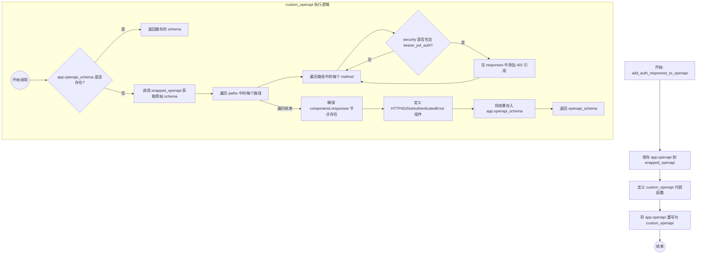

# `.\AutoGPT\autogpt_platform\autogpt_libs\autogpt_libs\auth\helpers.py` 详细设计文档

该代码通过修补 FastAPI 应用的 `openapi` 方法，自动为所有使用 JWT Bearer 认证的安全端点添加 401 未认证响应，以解决当 `auto_error=False` 时 FastAPI 自动生成的 OpenAPI 文档中缺失认证错误响应的问题。

## 整体流程

```mermaid
graph TD
    A[开始: add_auth_responses_to_openapi] --> B[保存原始 app.openapi 方法]
    B --> C[定义 custom_openapi 内部函数]
    C --> D{app.openapi_schema 是否已缓存?}
    D -- 是 --> E[返回已缓存的 schema]
    D -- 否 --> F[调用 wrapped_openapi 生成基础 schema]
    F --> G[遍历 openapi_schema['paths']]
    G --> H[遍历 path 下的 methods]
    H --> I[提取 security schemas]
    I --> J{包含 bearer_jwt_auth.scheme_name?}
    J -- 否 --> H
    J -- 是 --> K[初始化 responses 字段]
    K --> L[添加 401 响应引用]
    L --> H
    H --> M[路径遍历结束]
    M --> N[确保 components 存在]
    N --> O[确保 components.responses 存在]
    O --> P[定义 HTTP401NotAuthenticatedError 响应体]
    P --> Q[更新 app.openapi_schema]
    Q --> R[赋值 app.openapi = custom_openapi]
    R --> S[结束]
```

## 类结构

```

```

## 全局变量及字段


### `bearer_jwt_auth`
    
Imported authentication object used to provide the JWT scheme name for validation.

类型：`object`
    


    

## 全局函数及方法


### `add_auth_responses_to_openapi`

该函数用于修补 FastAPI 应用的 `openapi()` 方法，以便在使用 `HTTPBearer` 且 `auto_error=False` 时，自动为所有受保护的端点（即使用了 `bearer_jwt_auth` 的端点）添加标准的 401 未认证响应到 OpenAPI 文档中，解决 FastAPI 默认在此场景下不生成 401 响应定义的问题。

参数：

- `app`：`FastAPI`，需要修改其 OpenAPI 生成逻辑的 FastAPI 应用实例。

返回值：`None`，该函数没有返回值，直接修改传入的 `app` 实例的方法属性。

#### 流程图



#### 带注释源码

```python
def add_auth_responses_to_openapi(app: FastAPI) -> None:
    """
    Patch a FastAPI instance's `openapi()` method to add 401 responses
    to all authenticated endpoints.

    This is needed when using HTTPBearer with auto_error=False to get proper
    401 responses instead of 403, but FastAPI only automatically adds security
    responses when auto_error=True.
    """
    # Wrap current method to allow stacking OpenAPI schema modifiers like this
    # 保存原有的 openapi 方法引用，以便后续调用，支持链式修改
    wrapped_openapi = app.openapi

    def custom_openapi():
        # 检查是否已经生成并缓存了 schema，如果有则直接返回
        if app.openapi_schema:
            return app.openapi_schema

        # 调用原有的 openapi 方法生成基础的 OpenAPI schema
        openapi_schema = wrapped_openapi()

        # Add 401 response to all endpoints that have security requirements
        # 遍历所有路径和操作方法
        for path, methods in openapi_schema["paths"].items():
            for method, details in methods.items():
                # 提取当前端点的所有安全配置名称
                security_schemas = [
                    schema
                    for auth_option in details.get("security", [])
                    for schema in auth_option.keys()
                ]
                # 如果当前端点没有使用 bearer_jwt_auth，则跳过
                if bearer_jwt_auth.scheme_name not in security_schemas:
                    continue

                # 确保 responses 字段存在
                if "responses" not in details:
                    details["responses"] = {}

                # 添加 401 响应，引用全局定义的组件
                details["responses"]["401"] = {
                    "$ref": "#/components/responses/HTTP401NotAuthenticatedError"
                }

        # Ensure #/components/responses exists
        # 确保 components 和 responses 节点存在
        if "components" not in openapi_schema:
            openapi_schema["components"] = {}
        if "responses" not in openapi_schema["components"]:
            openapi_schema["components"]["responses"] = {}

        # Define 401 response
        # 定义 401 错误响应的具体结构
        openapi_schema["components"]["responses"]["HTTP401NotAuthenticatedError"] = {
            "description": "Authentication required",
            "content": {
                "application/json": {
                    "schema": {
                        "type": "object",
                        "properties": {"detail": {"type": "string"}},
                    }
                }
            },
        }

        # 缓存修改后的 schema 到 app 实例
        app.openapi_schema = openapi_schema
        return app.openapi_schema

    # 将 app.openapi 方法替换为自定义的 custom_openapi 函数
    app.openapi = custom_openapi
```


## 关键组件


### FastAPI OpenAPI 方法修饰器

该组件即 `add_auth_responses_to_openapi` 函数，它通过包装 FastAPI 应用的 `openapi` 方法，实现了对 OpenAPI 架构生成逻辑的动态拦截和修改。

### 安全方案遍历逻辑

位于 `custom_openapi` 闭包内部的逻辑，负责遍历 OpenAPI 架构中的路径与 HTTP 方法，检查安全要求（security）是否包含 `bearer_jwt_auth`。

### 401 未认证响应注入器

负责在 OpenAPI 的 `components/responses` 中定义标准的 401 错误响应结构（`HTTP401NotAuthenticatedError`），并将其引用添加到所有带有 JWT 认证要求的端点响应配置中。


## 问题及建议


### 已知问题

-   **强依赖全局变量**：代码直接引用外部模块的全局变量 `bearer_jwt_auth`，导致该函数难以复用、单元测试困难，且与特定认证逻辑强耦合。
-   **无检查覆盖数据**：函数在添加 `401` 响应或定义 `HTTP401NotAuthenticatedError` 组件时，未检查这些键是否已存在。如果用户已经在路由或 OpenAPI 组件中定义了这些内容，它们将被此函数强制覆盖，导致自定义配置丢失。
-   **硬编码缺乏灵活性**：状态码 `401`、组件引用名称 `HTTP401NotAuthenticatedError` 以及具体的响应结构（JSON schema）均为硬编码。这限制了函数在需要不同认证错误格式（例如 403 或自定义错误字段）场景下的使用。

### 优化建议

-   **参数化安全方案**：建议将 `scheme_name` 或具体的 Security Scheme 对象作为函数参数传入，而非直接使用全局变量 `bearer_jwt_auth`，以提高函数的通用性和解耦度。
-   **增加存在性检查**：在写入 `details["responses"]["401"]` 和 `openapi_schema["components"]["responses"][...]` 之前，先检查目标键是否存在。仅在未定义的情况下进行添加，从而保护用户自定义的 OpenAPI 配置不被覆盖。
-   **支持自定义配置**：允许通过参数传入自定义的状态码（默认为 401）、响应引用名称或具体的响应内容字典，以适应多样化的 API 规范需求。
-   **增强代码健壮性**：在遍历 `openapi_schema["paths"]` 和访问嵌套字典（如 `details.get("security")`）时，增加更严格的防御性编程检查，防止因 OpenAPI Schema 结构不符合预期而引发的潜在 `KeyError`。


## 其它


### 设计目标与约束

**设计目标**：该代码旨在解决 FastAPI 在使用 `HTTPBearer` 且 `auto_error=False` 时，自动生成的 OpenAPI 文档中缺少 401 未认证响应定义的问题。通过动态修改 FastAPI 应用的 `openapi` 方法，确保所有需要 JWT Bearer 认证的端点在文档中显式包含 401 响应，从而提高 API 文档的准确性和客户端的友好度。

**设计约束**：
1. **框架依赖**：必须基于 FastAPI 框架，且依赖于其 OpenAPI 模式生成的内部结构（字典结构）。
2. **执行时机**：必须在应用启动完成、路由注册完毕之后，但在 OpenAPI 文档首次被访问之前调用此函数进行 Patch。
3. **规范兼容性**：注入的 OpenAPI 结构必须遵循 OpenAPI Specification (OAS) 3.0 标准，特别是 `paths` 和 `components/responses` 字段的定义。
4. **外部依赖要求**：依赖于 `.jwt_utils.bearer_jwt_auth` 对象的存在及其 `scheme_name` 属性的正确性。

### 错误处理与异常设计

**异常处理策略**：
该模块采用防御性编程策略，主要处理潜在的字典键缺失异常，而不显式捕获或抛出业务异常，以免干扰 FastAPI 的核心运行流程。

1. **键值安全访问**：在访问 `details.get("security", [])` 和 `details.get("responses")` 时使用 `.get()` 方法，避免因端点定义中不包含 `security` 或 `responses` 字段而抛出 `KeyError`。
2. **结构完整性保证**：在向 `openapi_schema` 写入数据前，显式检查 `"components"` 和 `"responses"` 是否存在。如果不存在，则初始化为空字典，防止因基础模式不完整导致的写入错误。
3. **原始异常透传**：对于 `wrapped_openapi()` 的调用，如果 FastAPI 内部生成模式时发生错误，该函数不进行拦截，允许异常向上抛出，以便开发者发现 FastAPI 配置层面的根本错误。

### 数据流与状态机

**数据流**：
1. **输入**：接收一个 `FastAPI` 应用实例。
2. **拦截**：将 `app.openapi` 方法替换为 `custom_openapi` 闭包函数。
3. **生成**：当 OpenAPI 文档被请求时，调用原始的 `wrapped_openapi()` 获取基础模式数据（字典）。
4. **遍历与转换**：遍历 `openapi_schema["paths"]` 下的所有路径和方法，检查 `security` 配置。若匹配 `bearer_jwt_auth.scheme_name`，则在 `responses` 字段中注入 401 响应引用，并在 `components.responses` 中补充完整的 401 响应定义。
5. **输出**：返回修改后的 OpenAPI 模式字典给调用者（通常是 Swagger UI 或 Redoc）。

**状态管理**：
系统主要依赖于 `app.openapi_schema` 属性作为缓存状态。
- **初始状态**：`app.openapi_schema` 为 `None`。
- **计算中**：调用 `custom_openapi` 检查到缓存为空，生成新模式。
- **已缓存**：模式生成并赋值给 `app.openapi_schema` 后，后续调用直接返回缓存对象，不再重复遍历和修改，确保性能。

### 外部依赖与接口契约

**外部依赖**：
1. **FastAPI (`fastapi.FastAPI`)**：核心 Web 框架，提供应用实例和 OpenAPI 生成机制。
2. **内部模块 (`..jwt_utils.bearer_jwt_auth`)**：提供具体的 JWT 认证方案对象，用于判断哪些端点需要被添加 401 响应。

**接口契约**：
- **`add_auth_responses_to_openapi(app: FastAPI) -> None`**：
  - **输入参数**：必须是初始化后的 FastAPI 实例。
  - **副作用**：修改传入的 `app` 对象的 `openapi` 方法引用。
- **`bearer_jwt_auth.scheme_name`**：
  - **类型**：`str`。
  - **契约**：该对象必须暴露 `scheme_name` 属性，且其值必须与 OpenAPI `security` 字段中定义的 scheme 名称一致，否则匹配逻辑将失效。
- **OpenAPI Schema Structure**：
  - 假设 `app.openapi()` 返回的字典对象遵循 `{"paths": {...}, "components": {...}}` 的嵌套结构。

### 安全性与权限

**文档安全增强**：
该函数虽然不直接处理用户认证逻辑，但通过完善 API 文档，增强了安全性方面的透明度。它明确告知客户端：未提供有效 Token 的请求将返回 HTTP 401 状态码，而不是可能引起歧义的 403 Forbidden 或其他错误。

**权限假设**：
此函数通常在应用构建阶段由特权代码（应用初始化脚本）调用，拥有修改 `app` 实例内部方法的最高权限。它本身不涉及运行时的请求权限校验，但在生成的文档中定义了权限不足（未认证）的标准响应格式。

### 并发与性能考量

**性能考量**：
- **缓存机制**：利用 `app.openapi_schema` 进行结果缓存，确保在多次访问文档（如 `/docs` 和 `/openapi.json`）时，繁重的字典遍历和修改操作仅执行一次。
- **单次执行开销**：文档生成仅在应用启动初期或首次访问时发生，因此对请求处理路径的零运行时性能损耗。

**并发安全性**：
- 在多线程或多进程环境（如 Uvicorn with multiple workers）下，每个 Worker 进程拥有独立的 Python 解释器和内存空间，因此 `app.openapi_schema` 的缓存初始化在各进程中独立进行，不存在竞争条件。
- 在异步单进程环境下，FastAPI 处理 OpenAPI 请求通常是异步的，但由于 `if app.openapi_schema:` 检查和赋值操作在 Python 中是原子性的（针对对象引用），且重复赋值相同内容是幂等的，因此不会导致严重的数据不一致问题。

    