# `AutoGPT\autogpt_platform\autogpt_libs\autogpt_libs\auth\helpers_test.py` 详细设计文档

该文件是一套全面的单元测试，旨在验证 `autogpt_libs.auth.helpers` 模块中的 `add_auth_responses_to_openapi` 函数的功能，确保其能够正确地为 FastAPI 应用生成 OpenAPI schema，向需要认证的端点添加 401 响应，并处理缓存、保留现有响应配置以及支持多种安全方案。

## 整体流程

```mermaid
graph TD
    A[Start Test Function] --> B[Initialize FastAPI App Instance]
    B --> C[Define Test Routes (Public/Secured)]
    C --> D[Call add_auth_responses_to_openapi app]
    D --> E[Generate OpenAPI Schema via app.openapi]
    E --> F[Verify Schema Components (Responses)]
    F --> G{Assertions Passed?}
    G -- Yes --> H[Test Success]
    G -- No --> I[Assertion Error / Failure]
```

## 类结构

```
test_auth_helpers.py
├── test_add_auth_responses_to_openapi_basic
├── test_add_auth_responses_to_openapi_with_security
├── test_add_auth_responses_to_openapi_cached_schema
├── test_add_auth_responses_to_openapi_existing_responses
├── test_add_auth_responses_to_openapi_no_security_endpoints
├── test_add_auth_responses_to_openapi_multiple_security_schemes
├── test_add_auth_responses_to_openapi_empty_components
├── test_add_auth_responses_to_openapi_all_http_methods
├── test_bearer_jwt_auth_scheme_config
├── test_add_auth_responses_with_no_routes
├── test_custom_openapi_function_replacement
├── test_endpoint_without_responses_section
├── test_components_with_existing_responses
└── test_openapi_schema_persistence
```

## 全局变量及字段


    

## 全局函数及方法


### `test_add_auth_responses_to_openapi_basic`

该函数用于测试将 401 认证失败响应添加到 FastAPI 应用 OpenAPI schema 的基本功能。它创建了一个包含受保护端点和公共端点的 FastAPI 应用，应用认证响应的扩展逻辑，并验证生成的 OpenAPI schema 中是否正确包含了 `HTTP401NotAuthenticatedError` 组件及其内部结构（如描述、内容类型和 JSON Schema 定义）。

参数：

-  无

返回值：`None`，作为单元测试函数，主要用于验证逻辑正确性，无显式返回值。

#### 流程图

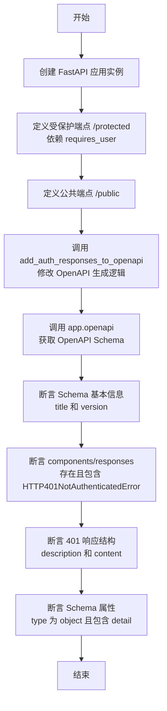

#### 带注释源码

```python
def test_add_auth_responses_to_openapi_basic():
    """Test adding 401 responses to OpenAPI schema."""
    # 初始化 FastAPI 应用，设置标题和版本
    app = FastAPI(title="Test App", version="1.0.0")

    # Add some test endpoints with authentication
    from fastapi import Depends

    from autogpt_libs.auth.dependencies import requires_user

    # 定义一个受保护的端点，使用 requires_user 依赖进行认证
    @app.get("/protected", dependencies=[Depends(requires_user)])
    def protected_endpoint():
        return {"message": "Protected"}

    # 定义一个公共端点，无需认证
    @app.get("/public")
    def public_endpoint():
        return {"message": "Public"}

    # Apply the OpenAPI customization
    # 调用辅助函数，修改 app 的 openapi 生成逻辑，添加认证响应
    add_auth_responses_to_openapi(app)

    # Get the OpenAPI schema
    # 触发生成 OpenAPI schema 字典
    schema = app.openapi()

    # Verify basic schema properties
    # 验证 schema 的基本元数据是否符合预期
    assert schema["info"]["title"] == "Test App"
    assert schema["info"]["version"] == "1.0.0"

    # Verify 401 response component is added
    # 验证 components 和 responses 键是否存在
    assert "components" in schema
    assert "responses" in schema["components"]
    # 验证自定义的 401 响应组件是否已被添加
    assert "HTTP401NotAuthenticatedError" in schema["components"]["responses"]

    # Verify 401 response structure
    # 获取 401 响应的具体定义
    error_response = schema["components"]["responses"]["HTTP401NotAuthenticatedError"]
    # 验证响应描述
    assert error_response["description"] == "Authentication required"
    # 验证内容类型包含 application/json
    assert "application/json" in error_response["content"]
    # 验证内容中包含 schema 定义
    assert "schema" in error_response["content"]["application/json"]

    # Verify schema properties
    # 获取响应体的 JSON Schema
    response_schema = error_response["content"]["application/json"]["schema"]
    # 验证类型为 object
    assert response_schema["type"] == "object"
    # 验证属性中包含 detail 字段
    assert "detail" in response_schema["properties"]
    # 验证 detail 字段类型为 string
    assert response_schema["properties"]["detail"]["type"] == "string"
```


### `test_add_auth_responses_to_openapi_with_security`

该函数是一个单元测试，用于验证 OpenAPI 模式生成逻辑能够正确区分安全端点和非安全端点，确保 401 未认证响应仅被添加到使用了 `Security` 依赖的受保护端点中，而不会添加到公共端点。

参数：

*   无

返回值：`None`，该函数为测试用例，主要执行断言逻辑，无显式返回值。

#### 流程图

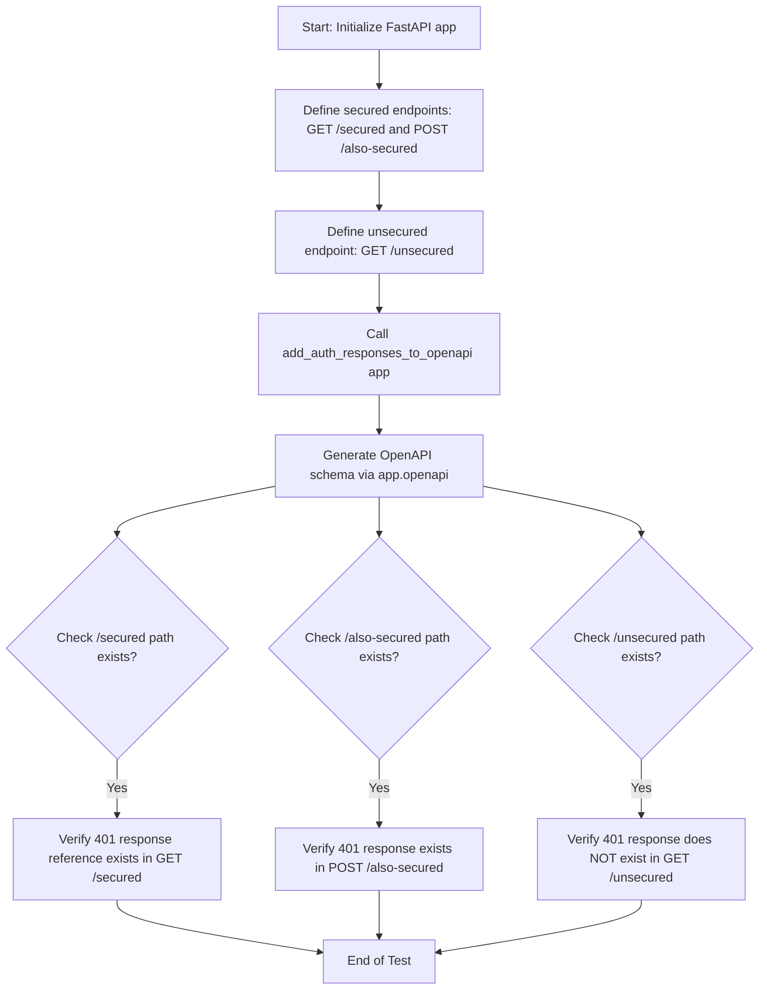

#### 带注释源码

```python
def test_add_auth_responses_to_openapi_with_security():
    """Test that 401 responses are added only to secured endpoints."""
    # 1. 初始化 FastAPI 应用实例
    app = FastAPI()

    # Mock endpoint with security
    from fastapi import Security

    from autogpt_libs.auth.dependencies import get_user_id

    # 2. 定义使用 Security 依赖的安全端点
    @app.get("/secured")
    def secured_endpoint(user_id: str = Security(get_user_id)):
        return {"user_id": user_id}

    @app.post("/also-secured")
    def another_secured(user_id: str = Security(get_user_id)):
        return {"status": "ok"}

    # 3. 定义不使用安全依赖的公共端点
    @app.get("/unsecured")
    def unsecured_endpoint():
        return {"public": True}

    # Apply OpenAPI customization
    # 4. 调用待测函数，修改 OpenAPI 生成逻辑
    add_auth_responses_to_openapi(app)

    # Get schema
    # 5. 生成最终的 OpenAPI Schema
    schema = app.openapi()

    # Check that secured endpoints have 401 responses
    # 6. 验证：检查安全端点 /secured 是否包含 401 响应引用
    if "/secured" in schema["paths"]:
        if "get" in schema["paths"]["/secured"]:
            secured_get = schema["paths"]["/secured"]["get"]
            if "responses" in secured_get:
                assert "401" in secured_get["responses"]
                assert (
                    secured_get["responses"]["401"]["$ref"]
                    == "#/components/responses/HTTP401NotAuthenticatedError"
                )

    # 7. 验证：检查另一个安全端点 /also-secured 是否包含 401 响应
    if "/also-secured" in schema["paths"]:
        if "post" in schema["paths"]["/also-secured"]:
            secured_post = schema["paths"]["/also-secured"]["post"]
            if "responses" in secured_post:
                assert "401" in secured_post["responses"]

    # Check that unsecured endpoint does not have 401 response
    # 8. 验证：确保非安全端点 /unsecured 不包含 401 响应
    if "/unsecured" in schema["paths"]:
        if "get" in schema["paths"]["/unsecured"]:
            unsecured_get = schema["paths"]["/unsecured"]["get"]
            if "responses" in unsecured_get:
                assert "401" not in unsecured_get.get("responses", {})
```


### `test_add_auth_responses_to_openapi_cached_schema`

该测试函数验证了在应用了 `add_auth_responses_to_openapi` 修改后，FastAPI 应用的 OpenAPI schema 生成机制是否实现了缓存，即连续多次调用 `app.openapi()` 应返回同一个对象引用，而不是重新生成。

参数：

-   无

返回值：`None`，该函数为单元测试，无返回值，主要通过断言验证缓存逻辑。

#### 流程图

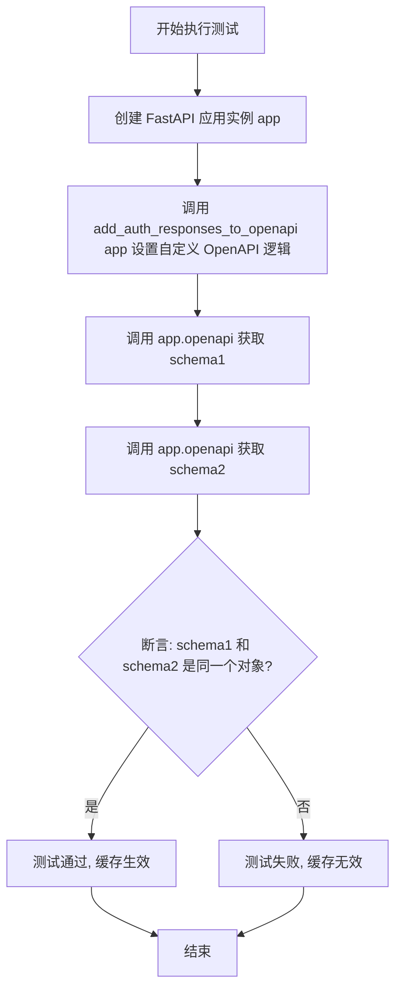

#### 带注释源码

```python
def test_add_auth_responses_to_openapi_cached_schema():
    """Test that OpenAPI schema is cached after first generation."""
    # 1. 创建一个基本的 FastAPI 应用实例
    app = FastAPI()

    # 2. 调用辅助函数，该函数通常会替换 app.openapi 方法以注入认证响应逻辑
    #    新的方法实现通常会包含缓存机制（如检查 app.openapi_schema 是否已存在）
    add_auth_responses_to_openapi(app)

    # 3. 第一次获取 OpenAPI schema，此时会生成并缓存 schema
    schema1 = app.openapi()

    # 4. 第二次获取 OpenAPI schema
    schema2 = app.openapi()

    # 5. 使用 'is' 操作符断言两个变量指向内存中的同一个对象
    #    这验证了自定义的 openapi 方法正确实现了缓存逻辑，避免了重复计算
    assert schema1 is schema2
```


### `test_add_auth_responses_to_openapi_existing_responses`

该测试函数用于验证在FastAPI端点已经定义了部分响应（如200、404）的情况下，`add_auth_responses_to_openapi` 函数能否正确地将认证相关的401响应添加到OpenAPI架构中，同时不覆盖或破坏现有的响应定义。

参数：

无

返回值：`None`，该函数为测试用例，不返回具体值，通过断言验证逻辑正确性。

#### 流程图

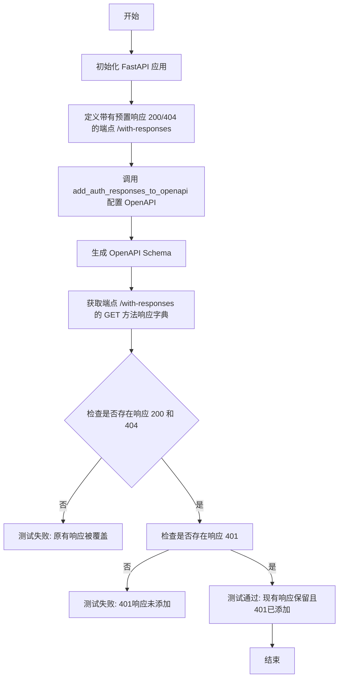

#### 带注释源码

```python
def test_add_auth_responses_to_openapi_existing_responses():
    """Test handling endpoints that already have responses defined."""
    # 初始化 FastAPI 应用实例
    app = FastAPI()

    from fastapi import Security

    from autogpt_libs.auth.jwt_utils import get_jwt_payload

    # 定义一个带有预置 responses 的端点
    # 这里模拟了业务场景：开发者已经手动定义了 200 和 404 的响应结构
    @app.get(
        "/with-responses",
        responses={
            200: {"description": "Success"},
            404: {"description": "Not found"},
        },
    )
    def endpoint_with_responses(jwt: dict = Security(get_jwt_payload)):
        return {"data": "test"}

    # 应用 OpenAPI 定制逻辑，这会修改 app.openapi 方法
    add_auth_responses_to_openapi(app)

    # 生成最终的 OpenAPI schema
    schema = app.openapi()

    # 检查 schema 中的路径定义
    if "/with-responses" in schema["paths"]:
        if "get" in schema["paths"]["/with-responses"]:
            # 获取该端点的所有响应定义
            responses = schema["paths"]["/with-responses"]["get"].get("responses", {})
            
            # 验证原始的 200 响应是否被保留
            if "200" in responses:
                assert responses["200"]["description"] == "Success"
            
            # 验证原始的 404 响应是否被保留
            if "404" in responses:
                assert responses["404"]["description"] == "Not found"
            
            # 验证是否自动添加了 401 认证失败响应
            if "401" in responses:
                assert (
                    responses["401"]["$ref"]
                    == "#/components/responses/HTTP401NotAuthenticatedError"
                )
```


### `test_add_auth_responses_to_openapi_no_security_endpoints`

Test with app that has no secured endpoints.

参数：

-  无

返回值：`None`，测试函数无返回值。

#### 流程图

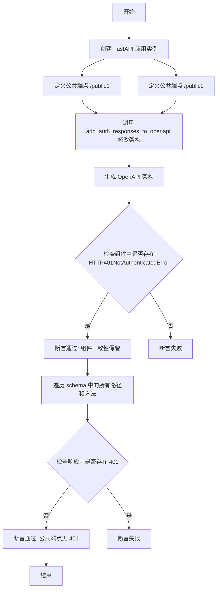

#### 带注释源码

```python
def test_add_auth_responses_to_openapi_no_security_endpoints():
    """Test with app that has no secured endpoints."""
    # 初始化 FastAPI 应用
    app = FastAPI()

    # 定义一个无需认证的 GET 公共端点
    @app.get("/public1")
    def public1():
        return {"message": "public1"}

    # 定义一个无需认证的 POST 公共端点
    @app.post("/public2")
    def public2():
        return {"message": "public2"}

    # 应用 OpenAPI 自定义逻辑，添加认证响应处理
    add_auth_responses_to_openapi(app)

    # 获取生成的 OpenAPI schema
    schema = app.openapi()

    # 验证：即使没有需要认证的端点，HTTP401NotAuthenticatedError 组件仍然应该被添加到 schema 的 components 中，以保持架构的一致性
    assert "HTTP401NotAuthenticatedError" in schema["components"]["responses"]

    # 验证：遍历 schema 中的所有路径和方法
    for path in schema["paths"].values():
        for method in path.values():
            # 确保我们正在处理的是包含响应定义的字典对象
            if isinstance(method, dict) and "responses" in method:
                # 断言：任何端点的响应中都不应包含 401 状态码，因为它们都是公开的
                assert "401" not in method["responses"]
```


### `test_add_auth_responses_to_openapi_multiple_security_schemes`

该测试函数用于验证当 API 端点同时应用多个安全方案（即多个依赖项）时，`add_auth_responses_to_openapi` 辅助函数是否能正确地将 401 未认证响应添加到 OpenAPI schema 中。

参数：

-   无

返回值：`None`，该函数为单元测试，通过断言验证逻辑，无显式返回值。

#### 流程图

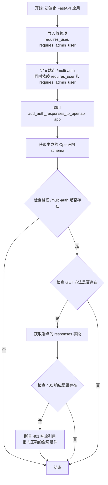

#### 带注释源码

```python
def test_add_auth_responses_to_openapi_multiple_security_schemes():
    """Test endpoints with multiple security requirements."""
    # 1. 初始化 FastAPI 应用实例
    app = FastAPI()

    from fastapi import Security

    from autogpt_libs.auth.dependencies import requires_admin_user, requires_user
    from autogpt_libs.auth.models import User

    # 2. 定义一个包含多重安全依赖的端点
    @app.get("/multi-auth")
    def multi_auth(
        user: User = Security(requires_user),
        admin: User = Security(requires_admin_user),
    ):
        return {"status": "super secure"}

    # 3. 调用辅助函数，修改 OpenAPI 生成逻辑
    add_auth_responses_to_openapi(app)

    # 4. 生成 OpenAPI schema
    schema = app.openapi()

    # 5. 验证多重安全方案的端点是否包含 401 响应
    if "/multi-auth" in schema["paths"]:
        if "get" in schema["paths"]["/multi-auth"]:
            responses = schema["paths"]["/multi-auth"]["get"].get("responses", {})
            if "401" in responses:
                # 断言 401 响应正确引用了预先定义的未认证错误组件
                assert (
                    responses["401"]["$ref"]
                    == "#/components/responses/HTTP401NotAuthenticatedError"
                )
```


### `test_add_auth_responses_to_openapi_empty_components`

测试当 OpenAPI schema 初始时没有 components 部分的情况。它验证了即使底层的 schema 生成器产生一个不包含 `components` 键的 schema，`add_auth_responses_to_openapi` 辅助函数也能正确地初始化 components 字典、添加 responses 哈希表，并确保 `HTTP401NotAuthenticatedError` 响应定义被正确创建。

参数：

无

返回值：`None`，该函数是一个测试用例，主要执行断言逻辑，没有返回值。

#### 流程图

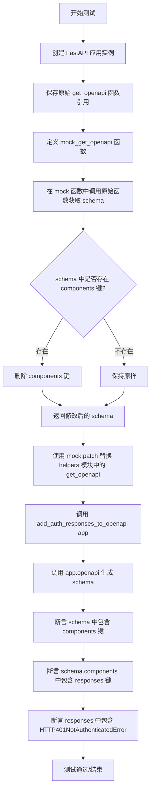

#### 带注释源码

```python
def test_add_auth_responses_to_openapi_empty_components():
    """Test when OpenAPI schema has no components section initially."""
    # 初始化一个 FastAPI 应用实例
    app = FastAPI()

    # 保存原始的 get_openapi 函数引用，用于后续调用
    original_get_openapi = get_openapi

    # 定义一个 mock 函数，用于模拟返回没有 components 的 schema
    def mock_get_openapi(*args, **kwargs):
        schema = original_get_openapi(*args, **kwargs)
        # 如果 schema 中存在 components，则将其删除
        # 以此来测试 add_auth_responses_to_openapi 处理空 components 的能力
        if "components" in schema:
            del schema["components"]
        return schema

    # 使用 mock.patch 替换 autogpt_libs.auth.helpers 模块中的 get_openapi
    with mock.patch("autogpt_libs.auth.helpers.get_openapi", mock_get_openapi):
        # 调用被测试的函数，将认证响应添加到 OpenAPI 配置中
        add_auth_responses_to_openapi(app)

        # 获取最终的 OpenAPI schema
        schema = app.openapi()

        # 验证：schema 应该包含 components 键（即使初始生成时没有）
        assert "components" in schema
        # 验证：components 下应该包含 responses 键
        assert "responses" in schema["components"]
        # 验证：responses 下应该包含定义的 401 未认证错误响应
        assert "HTTP401NotAuthenticatedError" in schema["components"]["responses"]
```


### `test_add_auth_responses_to_openapi_all_http_methods`

该测试函数旨在验证 `add_auth_responses_to_openapi` 辅助函数能否正确处理所有标准的 HTTP 方法（GET、POST、PUT、PATCH、DELETE），确保对于使用安全依赖项的受保护端点，无论其使用何种 HTTP 动词，都能在 OpenAPI schema 中正确添加 401 未认证响应。

参数：

*   (无)

返回值：`None`，该函数是一个单元测试，不返回具体值，通过断言来验证逻辑正确性。

#### 流程图

```mermaid
graph TD
    A[开始: test_add_auth_responses_to_openapi_all_http_methods] --> B[初始化 FastAPI app]
    B --> C[定义 GET /resource 端点 (Security)]
    B --> D[定义 POST /resource 端点 (Security)]
    B --> E[定义 PUT /resource 端点 (Security)]
    B --> F[定义 PATCH /resource 端点 (Security)]
    B --> G[定义 DELETE /resource 端点 (Security)]
    C & D & E & F & G --> H[调用 add_auth_responses_to_openapi app]
    H --> I[生成 OpenAPI schema app.openapi]
    I --> J{检查 /resource 路径是否存在}
    J -- 否 --> K[结束]
    J -- 是 --> L[遍历方法列表: get, post, put, patch, delete]
    L --> M{方法是否存在于路径中}
    M -- 是 --> N[获取方法的规范 method_spec]
    N --> O{是否存在 responses 字段}
    O -- 是 --> P[断言 401 响应存在]
    O -- 否 --> L
    M -- 否 --> L
    P --> L
    L --> Q[结束]
```

#### 带注释源码

```python
def test_add_auth_responses_to_openapi_all_http_methods():
    """Test that all HTTP methods are handled correctly."""
    # 1. 初始化一个 FastAPI 应用实例
    app = FastAPI()

    # 导入 FastAPI 的 Security 依赖和自定义的 JWT payload 获取工具
    from fastapi import Security

    from autogpt_libs.auth.jwt_utils import get_jwt_payload

    # 2. 定义多个使用相同路径 '/resource' 但使用不同 HTTP 方法的端点
    # 所有端点都应用了 JWT 安全依赖，模拟受保护的资源
    
    @app.get("/resource")
    def get_resource(jwt: dict = Security(get_jwt_payload)):
        return {"method": "GET"}

    @app.post("/resource")
    def post_resource(jwt: dict = Security(get_jwt_payload)):
        return {"method": "POST"}

    @app.put("/resource")
    def put_resource(jwt: dict = Security(get_jwt_payload)):
        return {"method": "PUT"}

    @app.patch("/resource")
    def patch_resource(jwt: dict = Security(get_jwt_payload)):
        return {"method": "PATCH"}

    @app.delete("/resource")
    def delete_resource(jwt: dict = Security(get_jwt_payload)):
        return {"method": "DELETE"}

    # 3. 应用自定义的 OpenAPI 修改逻辑
    # 这通常会替换 app.openapi 方法，注入认证相关的响应定义
    add_auth_responses_to_openapi(app)

    # 4. 获取生成的 OpenAPI schema
    schema = app.openapi()

    # 5. 验证所有 HTTP 方法在 schema 中都包含了 401 响应
    if "/resource" in schema["paths"]:
        for method in ["get", "post", "put", "patch", "delete"]:
            # 检查路径下是否存在该方法
            if method in schema["paths"]["/resource"]:
                method_spec = schema["paths"]["/resource"][method]
                # 确保响应字典存在
                if "responses" in method_spec:
                    # 核心断言：验证 401 响应是否已添加到 responses 中
                    assert "401" in method_spec["responses"]
```


### `test_bearer_jwt_auth_scheme_config`

该测试函数用于验证全局 `bearer_jwt_auth` 认证方案对象的配置是否符合预期，具体检查其方案名称是否为 "HTTPBearerJWT" 以及 `auto_error` 属性是否设置为 False。

参数：

- （无）

返回值：`None`，该函数为测试用例，无显式返回值，通过断言抛出异常以指示测试结果。

#### 流程图

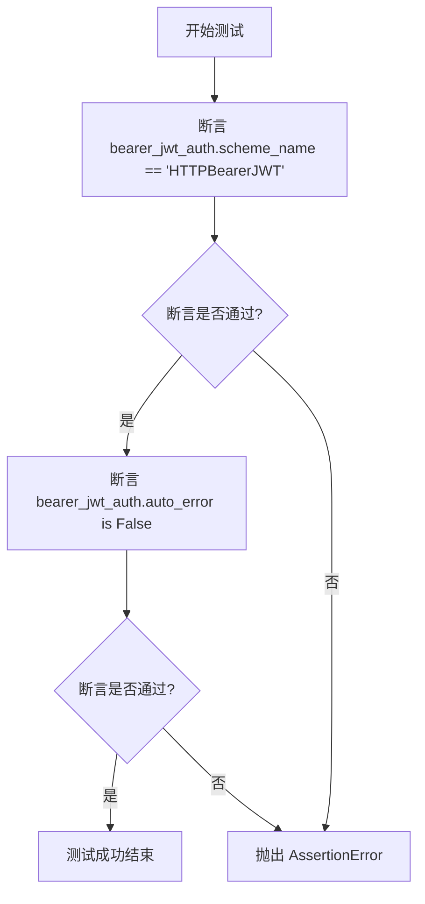

#### 带注释源码

```python
def test_bearer_jwt_auth_scheme_config():
    """Test that bearer_jwt_auth is configured correctly."""
    # 验证 bearer_jwt_auth 的 scheme_name 属性是否为预期的字符串 "HTTPBearerJWT"
    assert bearer_jwt_auth.scheme_name == "HTTPBearerJWT"
    # 验证 bearer_jwt_auth 的 auto_error 属性是否为 False，表示认证失败时不自动抛出 HTTP 错误
    assert bearer_jwt_auth.auto_error is False
```


### `test_add_auth_responses_with_no_routes`

该测试用例验证了当 FastAPI 应用实例中不包含任何路由时，`add_auth_responses_to_openapi` 函数仍能正确执行，确保生成的 OpenAPI schema 中包含基本的组件结构和认证错误响应定义。

参数：

-   (该函数不包含参数)

返回值：`None`，无返回值（通过断言验证逻辑正确性）

#### 流程图

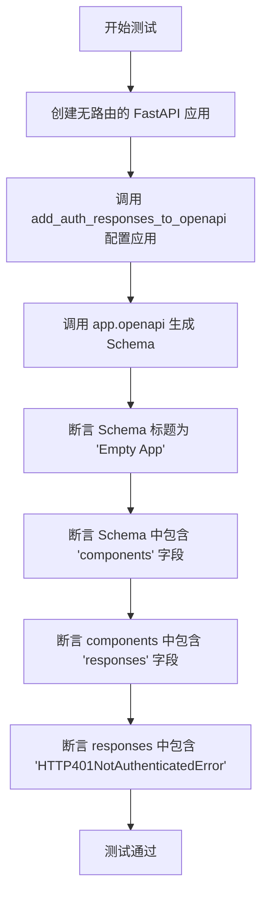

#### 带注释源码

```python
def test_add_auth_responses_with_no_routes():
    """Test OpenAPI generation with app that has no routes."""
    # 初始化一个标题为 "Empty App" 的 FastAPI 实例，且不添加任何路由
    app = FastAPI(title="Empty App")

    # 调用辅助函数，将认证响应逻辑注入到应用中
    add_auth_responses_to_openapi(app)

    # 生成 OpenAPI schema
    schema = app.openapi()

    # 验证：生成的 Schema 应该保留应用的基本信息
    assert schema["info"]["title"] == "Empty App"
    
    # 验证：Schema 应包含 components 部分
    assert "components" in schema
    
    # 验证：components 下应包含 responses 定义
    assert "responses" in schema["components"]
    
    # 验证：即使没有路由，全局的 401 未认证错误响应组件也应被正确添加
    assert "HTTP401NotAuthenticatedError" in schema["components"]["responses"]
```


### `test_custom_openapi_function_replacement`

该函数用于测试验证 `add_auth_responses_to_openapi` 辅助函数是否成功地将 FastAPI 应用实例的默认 `openapi` 方法替换为自定义实现，并确保替换后的方法仍然是可调用的。

参数：

*   无

返回值：`None`，无返回值。

#### 流程图

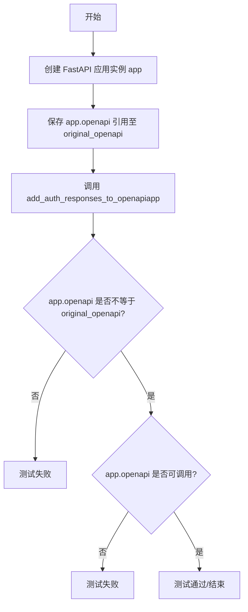

#### 带注释源码

```python
def test_custom_openapi_function_replacement():
    """Test that the custom openapi function properly replaces the default."""
    # 初始化一个 FastAPI 应用实例
    app = FastAPI()

    # 存储原始的 openapi 方法引用，用于后续比对
    original_openapi = app.openapi

    # 调用辅助函数应用自定义 OpenAPI 逻辑
    add_auth_responses_to_openapi(app)

    # 断言 app.openapi 已经不再是原来的方法（即已被替换）
    assert app.openapi != original_openapi
    # 断言新的 app.openapi 是可调用的函数
    assert callable(app.openapi)
```


### `test_endpoint_without_responses_section`

测试在 FastAPI 应用中，当一个受保护的端点（带有安全依赖）在 OpenAPI schema 生成阶段没有预先定义 `responses` 字段时，`add_auth_responses_to_openapi` 函数能否正确创建该字段并添加 401 未认证响应。

参数：

-   无

返回值：`None`，该函数为测试函数，不返回值，通过断言验证逻辑正确性。

#### 流程图

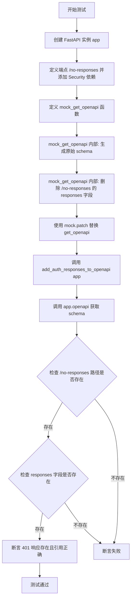

#### 带注释源码

```python
def test_endpoint_without_responses_section():
    """Test endpoint that has security but no responses section initially."""
    # 初始化 FastAPI 应用实例
    app = FastAPI()

    from fastapi import Security
    from fastapi.openapi.utils import get_openapi as original_get_openapi

    from autogpt_libs.auth.jwt_utils import get_jwt_payload

    # 创建一个带有 JWT 安全依赖的测试端点
    @app.get("/no-responses")
    def endpoint_without_responses(jwt: dict = Security(get_jwt_payload)):
        return {"data": "test"}

    # 定义一个 mock 函数来模拟 OpenAPI schema 的生成过程
    def mock_get_openapi(*args, **kwargs):
        # 调用原始的 get_openapi 生成基础 schema
        schema = original_get_openapi(*args, **kwargs)
        # Remove responses from our endpoint to trigger line 40
        # 如果目标路径存在于 schema 中
        if "/no-responses" in schema.get("paths", {}):
            if "get" in schema["paths"]["/no-responses"]:
                # Delete responses to force the code to create it
                # 删除 responses 字段，模拟端点未定义响应的情况，以测试代码是否能处理此边缘情况
                if "responses" in schema["paths"]["/no-responses"]["get"]:
                    del schema["paths"]["/no-responses"]["get"]["responses"]
        return schema

    # 使用 mock.patch 上下文管理器替换原始的 get_openapi 函数
    with mock.patch("autogpt_libs.auth.helpers.get_openapi", mock_get_openapi):
        # 应用自定义的 OpenAPI 修改逻辑
        add_auth_responses_to_openapi(app)

        # Get schema and verify 401 was added
        # 获取最终的 OpenAPI schema
        schema = app.openapi()

        # The endpoint should now have 401 response
        # 验证端点是否已包含 401 响应
        if "/no-responses" in schema["paths"]:
            if "get" in schema["paths"]["/no-responses"]:
                responses = schema["paths"]["/no-responses"]["get"].get("responses", {})
                # 断言存在 401 响应码
                assert "401" in responses
                # 断言 401 响应正确引用了已定义的组件 HTTP401NotAuthenticatedError
                assert (
                    responses["401"]["$ref"]
                    == "#/components/responses/HTTP401NotAuthenticatedError"
                )
```


### `test_components_with_existing_responses`

测试当 OpenAPI schema 的 `components` 部分中已存在 `responses` 部分时的处理逻辑。验证函数能够合并现有的响应定义，而非覆盖它们，同时正确添加新的 401 未认证响应。

参数：

-   无

返回值：`None`，不返回任何值（单元测试函数）

#### 流程图

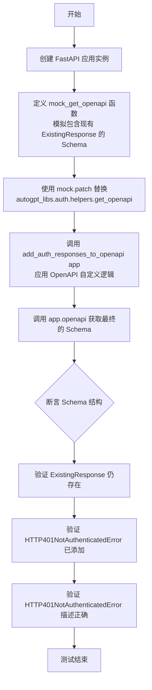

#### 带注释源码

```python
def test_components_with_existing_responses():
    """Test when components already has a responses section."""
    # 1. 初始化 FastAPI 应用实例
    app = FastAPI()

    # 2. 导入原始的 get_openapi 函数用于后续调用
    from fastapi.openapi.utils import get_openapi as original_get_openapi

    # 3. 定义一个模拟的 get_openapi 函数
    # 该函数在原始 schema 的基础上，模拟 components.responses 中已存在数据的情况
    def mock_get_openapi(*args, **kwargs):
        schema = original_get_openapi(*args, **kwargs)
        # 确保 components 键存在
        if "components" not in schema:
            schema["components"] = {}
        # 添加一个模拟的已存在响应定义 "ExistingResponse"
        schema["components"]["responses"] = {
            "ExistingResponse": {"description": "An existing response"}
        }
        return schema

    # 4. 使用 mock.patch 将 helpers 模块中的 get_openapi 替换为 mock_get_openapi
    # 这样在 add_auth_responses_to_openapi 内部调用 get_openapi 时就会使用我们的模拟版本
    with mock.patch("autogpt_libs.auth.helpers.get_openapi", mock_get_openapi):
        # 5. 调用被测试的函数，添加认证响应
        add_auth_responses_to_openapi(app)

        # 6. 获取生成的 OpenAPI schema
        schema = app.openapi()

        # 7. 断言：旧的 "ExistingResponse" 应该被保留，未被覆盖
        assert "ExistingResponse" in schema["components"]["responses"]

        # 8. 断言：新的 "HTTP401NotAuthenticatedError" 响应已被成功添加
        assert "HTTP401NotAuthenticatedError" in schema["components"]["responses"]

        # 9. 断言：验证添加的 401 响应结构是否正确
        error_response = schema["components"]["responses"][
            "HTTP401NotAuthenticatedError"
        ]
        assert error_response["description"] == "Authentication required"
```


### `test_openapi_schema_persistence`

验证对 OpenAPI 架构对象的修改在缓存失效后不会持久化，确保清除缓存后能正确重新生成原始架构。

参数：

无

返回值：`None`，无返回值，主要执行断言逻辑以验证行为。

#### 流程图

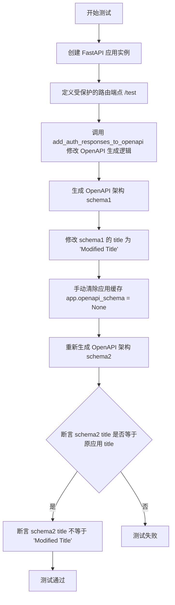

#### 带注释源码

```python
def test_openapi_schema_persistence():
    """Test that modifications to OpenAPI schema persist correctly."""
    # 初始化 FastAPI 应用
    app = FastAPI()

    from fastapi import Security

    from autogpt_libs.auth.jwt_utils import get_jwt_payload

    # 定义一个需要 JWT 认证的测试端点
    @app.get("/test")
    def test_endpoint(jwt: dict = Security(get_jwt_payload)):
        return {"test": True}

    # 应用自定义的 OpenAPI 修改逻辑，注入认证响应
    add_auth_responses_to_openapi(app)

    # 第一次获取 OpenAPI 架构
    schema1 = app.openapi()

    # 模拟外部对已生成架构对象的修改
    schema1["info"]["title"] = "Modified Title"

    # 清除 FastAPI 应用内部的 OpenAPI 架构缓存
    app.openapi_schema = None

    # 第二次获取 OpenAPI 架构，这将触发重新生成
    schema2 = app.openapi()

    # 断言：新生成的架构标题应为原始应用标题，证明重新生成生效且未受旧对象修改影响
    assert schema2["info"]["title"] == app.title
    assert schema2["info"]["title"] != "Modified Title"
```


## 关键组件


### OpenAPI Schema Customization
用于拦截和修改 FastAPI OpenAPI 生成过程的核心逻辑，负责向受保护的端点注入标准化的 401 响应引用。

### HTTP401NotAuthenticatedError Schema Component
可复用的 OpenAPI 模式定义，用于在文档中统一描述 401 未授权错误响应的结构和内容。

### JWT Bearer Authentication Configuration
基于 HTTPBearer 的 JWT 认证方案配置，定义了如何在 OpenAPI 文档中表示和执行安全验证。

### Endpoint Security Dependency Analysis
通过分析 FastAPI 依赖项（如 `Depends` 或 `Security`）来识别安全路由的机制，以此决定何处应用认证错误响应。


## 问题及建议


### 已知问题

-   **全局 `app.openapi` 方法替换风险**: 测试代码验证了 `add_auth_responses_to_openapi` 函数会替换 FastAPI 应用的 `openapi` 方法。虽然这是一种常见的扩展模式，但这属于一种技术债务，因为它不遵循"组合优于修改"的原则。如果项目中有其他库或模块也尝试覆盖 `app.openapi` 方法，会导致后加载的覆盖先加载的，从而引发功能冲突。
-   **深层字典结构操作的脆弱性**: 测试中对 OpenAPI schema 的验证涉及多层嵌套字典访问（如 `schema["paths"]["..."]["get"]["responses"]`）。这暗示了生产代码直接对复杂的字典结构进行深度修改。这种实现方式非常脆弱，一旦 FastAPI 升级改变了 OpenAPI schema 的内部结构，代码极易断裂。
-   **与 `get_openapi` 工具函数的紧耦合**: 多个测试用例通过 `mock.patch("autogpt_libs.auth.helpers.get_openapi", ...)` 来模拟行为。这表明被测模块直接依赖并调用了 `fastapi.openapi.utils.get_openapi`。这种紧耦合使得模块难以在不依赖 Mock 特定导入路径的情况下进行单元测试，增加了维护成本。

### 优化建议

-   **引入 Pytest Fixtures 减少重复代码**: 测试文件中存在大量重复的 `app = FastAPI()` 初始化以及路由注册代码。建议使用 `@pytest.fixture` 来封装不同场景的 App 实例（如带安全路由的 App、空 App 等），从而显著减少样板代码并提高测试的可读性。
-   **封装断言逻辑以提升可读性**: 代码中充斥着多层嵌套的 `if` 判断来检查 Schema 结构（例如 `if "/secured" in schema["paths"]: ...`）。建议编写自定义的辅助断言函数（如 `assert_response_exists(path, method, status_code)`），将嵌套逻辑封装起来，使测试意图一目了然。
-   **使用常量替代魔法字符串**: 诸如 `"401"`、`"HTTP401NotAuthenticatedError"`、`"application/json"` 等字符串在代码中反复出现。建议在模块顶部定义常量，不仅可以防止拼写错误，还能在未来需要修改响应格式或名称时只需改动一处。
-   **整合 Mock 上下文管理器**: 针对涉及 `get_openapi` mock 的测试用例，可以将 Mock 的配置逻辑提取为 fixture 或 conftest 中的配置，避免在每个测试函数中重复编写 `with mock.patch(...)` 块，使测试逻辑更加聚焦于业务验证。


## 其它


### 设计目标与约束

**设计目标：**
本测试套件的核心设计目标是全面验证 `autogpt_libs.auth.helpers` 模块中 `add_auth_responses_to_openapi` 函数的正确性、健壮性以及对 FastAPI OpenAPI 架构生成的增强能力。具体目标包括：
1.  **全覆盖测试**：确保涵盖所有代码分支和边缘情况，包括空应用、无安全路由、无初始组件、已存在响应等场景，以达到 100% 的代码覆盖率。
2.  **契约验证**：验证生成的 OpenAPI Schema 符合规范，确保 401 响应被正确注入到受保护的路由中，且公共路由不受影响。
3.  **隔离性**：每个测试用例应相互独立，通过 Mock 技术（`unittest.mock`）隔离外部依赖（如底层的 `get_openapi` 实现），仅关注被测函数的逻辑。

**设计约束：**
1.  **测试框架**：强制使用 `pytest` 风格的测试函数和 `unittest.mock` 进行模拟。
2.  **FastAPI 版本兼容性**：测试代码需兼容目标 FastAPI 版本的 OpenAPI 生成逻辑。
3.  **执行效率**：测试应快速执行，避免不必要的网络请求或真实的认证流程，全部在内存中完成 Schema 的生成与校验。

### 错误处理与异常设计

**测试层面的错误处理策略：**
本测试套件主要验证被测函数在特定输入下的 Schema 修改行为，而非处理运行时异常。但在测试设计和执行中包含以下错误处理与异常验证机制：

1.  **异常场景模拟**：
    *   通过 `mock.patch` 修改 `get_openapi` 的行为，模拟返回缺少 `components` 字段或缺少 `responses` 字段的异常 Schema，验证被测函数是否能自动初始化这些缺失结构而不抛出异常。
    *   模拟应用初始化后的各种状态（如无路由、无安全依赖），确保函数在空输入或边缘输入下不会导致程序崩溃。

2.  **断言反馈**：
    *   测试失败时（即 Schema 结构不符合预期），`assert` 语句会抛出 `AssertionError`，明确指出哪个路径、哪个方法或哪个响应字段不符合契约。例如验证 401 响应是否被错误地添加到了公共路由。

3.  **数据一致性校验**：
    *   验证在 Schema 已存在某些响应定义时，新增的 401 响应是否覆盖了原有逻辑或正确合并，防止数据丢失错误。

### 数据流与状态机

**测试数据流：**
测试过程中的数据流向遵循“构建 -> 修改 -> 生成 -> 验证”的模式：

```mermaid
graph TD
    A[初始化 FastAPI App] --> B[注册测试路由 (Protected/Public)]
    B --> C{是否需要 Mock?}
    C -- 是 --> D[替换/修改 get_openapi 内部逻辑]
    C -- 否 --> E[调用 add_auth_responses_to_openapi]
    D --> E
    E --> F[触发 app.openapi 生成 Schema]
    F --> G[获取最终 Schema 字典对象]
    G --> H[断言验证: 组件/路径/响应结构]
```

**状态变迁：**
1.  **初始状态**：一个干净的 FastAPI 实例，仅包含基础配置（如 title, version）。
2.  **路由注入状态**：通过装饰器 (`@app.get`, `@app.post`) 和依赖注入 (`Depends`, `Security`) 向应用添加路由，此时应用的路由表被填充。
3.  **中间件/扩展应用状态**：调用 `add_auth_responses_to_openapi(app)`，此时应用的 `openapi` 方法被替换为自定义闭包函数。
4.  **Schema 生成状态**：首次调用 `app.openapi()`，缓存生成结果。
5.  **验证状态**：检查生成的 Schema 对象的内部结构（字典键值），确认是否包含预期的 `HTTP401NotAuthenticatedError` 组件及相应的路径引用。

### 外部依赖与接口契约

**外部依赖：**
1.  **FastAPI**：核心框架依赖，用于构建应用实例、定义路由依赖以及生成基础 OpenAPI Schema。
2.  **autogpt_libs.auth**：
    *   `helpers.add_auth_responses_to_openapi`：被测的核心函数。
    *   `dependencies` (如 `requires_user`, `get_user_id`)：用于构造具有安全依赖的测试路由。
    *   `jwt_utils.bearer_jwt_auth`：被测试配置的认证方案对象。
3.  **unittest.mock**：用于模拟和修补 FastAPI 内部的 OpenAPI 生成过程，以便控制测试环境。

**接口契约：**
1.  **函数契约**：
    *   `add_auth_responses_to_openapi(app: FastAPI) -> None`：该函数接收一个 FastAPI 实例，原地修改其 `openapi` 属性，无返回值。
2.  **Schema 契约**：
    *   **Components 契约**：修改后的 Schema 必须包含 `components.responses.HTTP401NotAuthenticatedError`，且其描述必须为 "Authentication required"，内容类型为 `application/json`。
    *   **路由契约**：任何使用了 `Security` 或 `Depends` 且关联到认证依赖的路径操作，其 `responses` 字段中必须包含对 `#/components/responses/HTTP401NotAuthenticatedError` 的引用 (`$ref`)。
3.  **缓存契约**：
    *   `app.openapi_schema` 属性用于缓存生成的 Schema 字典。在首次调用后，再次调用应返回同一个对象（除非显式清空缓存）。

    