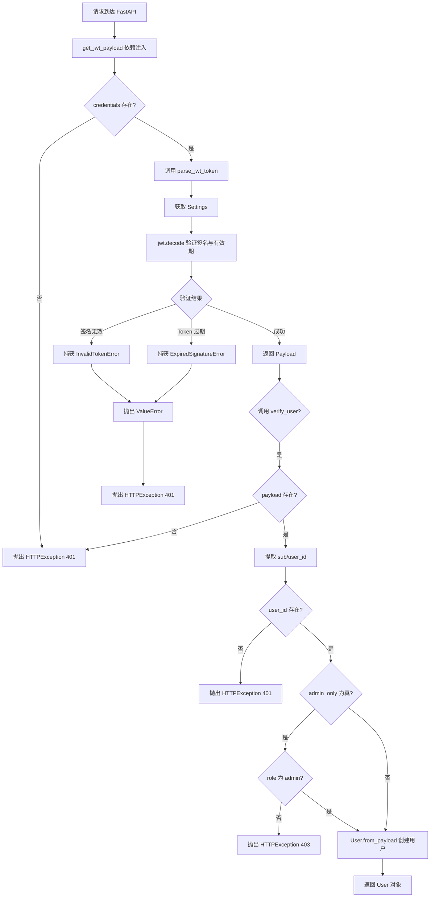
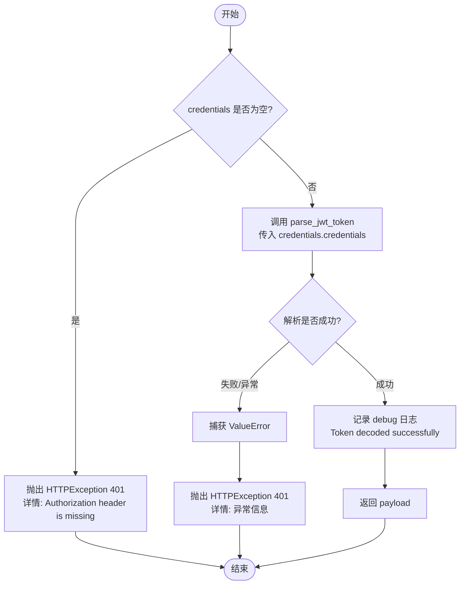
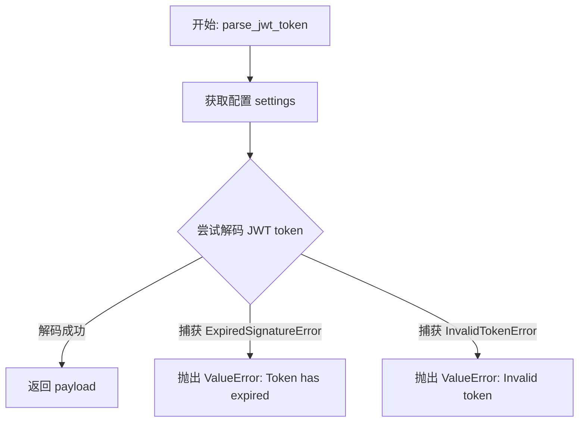

# `.\AutoGPT\autogpt_platform\autogpt_libs\autogpt_libs\auth\jwt_utils.py` 详细设计文档

该代码实现了基于 FastAPI 的 JWT 认证逻辑，负责从 HTTP 请求头中提取并验证 Bearer Token，解析 Token Payload，以及根据权限要求验证用户身份。

## 整体流程



## 类结构

```
(No classes defined in this file)
```

## 全局变量及字段


### `logger`
    
Standard logger instance for this module, used to record runtime information and debug messages.

类型：`logging.Logger`
    


### `bearer_jwt_auth`
    
FastAPI security scheme instance configured to extract and handle Bearer tokens in the Authorization header.

类型：`fastapi.security.HTTPBearer`
    


    

## 全局函数及方法


### `get_jwt_payload`

提取并验证 HTTP Authorization 头部中的 JWT 负载。该函数作为核心认证逻辑，负责检查凭证是否存在，调用解析器验证令牌有效性，并处理认证失败的情况。

参数：

- `credentials`：`HTTPAuthorizationCredentials | None`，FastAPI 依赖注入提供的 HTTP Authorization 凭证对象，包含 Bearer Token 字符串。

返回值：`dict[str, Any]`，解码并验证通过后的 JWT 负载数据字典。

#### 流程图



#### 带注释源码

```python
async def get_jwt_payload(
    credentials: HTTPAuthorizationCredentials | None = Security(bearer_jwt_auth),
) -> dict[str, Any]:
    """
    Extract and validate JWT payload from HTTP Authorization header.

    This is the core authentication function that handles:
    - Reading the `Authorization` header to obtain the JWT token
    - Verifying the JWT token's signature
    - Decoding the JWT token's payload

    :param credentials: HTTP Authorization credentials from bearer token
    :return: JWT payload dictionary
    :raises HTTPException: 401 if authentication fails
    """
    # 检查凭证对象是否存在，如果不存在则说明请求头中未包含 Authorization 信息
    if not credentials:
        raise HTTPException(status_code=401, detail="Authorization header is missing")

    try:
        # 调用辅助函数解析并验证 JWT 令牌
        # credentials.credentials 属性包含实际的 token 字符串
        payload = parse_jwt_token(credentials.credentials)
        
        # 记录调试日志，表示令牌解码成功
        logger.debug("Token decoded successfully")
        
        # 返回解码后的负载信息
        return payload
    except ValueError as e:
        # 捕获解析过程中的错误（如令牌过期、签名无效等），
        # 并将其转换为 FastAPI 的 HTTPException 响应
        raise HTTPException(status_code=401, detail=str(e))
```


### `parse_jwt_token`

解析并验证 JSON Web Token (JWT) 的有效性、签名及过期时间，并返回解码后的数据载荷。该函数是认证流程中的核心步骤，负责将原始 Token 字符串转换为应用程序可理解的字典数据，同时确保 Token 的安全性和时效性。

参数：

-   `token`：`str`，待解析和验证的 JWT 字符串，通常从 HTTP Authorization 头部获取。

返回值：`dict[str, Any]`，解码后的 JWT 载荷字典，包含如用户 ID、角色等声明信息。

#### 流程图



#### 带注释源码

```python
def parse_jwt_token(token: str) -> dict[str, Any]:
    """
    Parse and validate a JWT token.

    :param token: The token to parse
    :return: The decoded payload
    :raises ValueError: If the token is invalid or expired
    """
    # 获取全局配置，包括用于验证签名的密钥和算法
    settings = get_settings()
    try:
        # 使用 PyJWT 库进行解码操作
        # 传入 token、验证密钥、允许的算法以及预期的受众
        payload = jwt.decode(
            token,
            settings.JWT_VERIFY_KEY,
            algorithms=[settings.JWT_ALGORITHM],
            audience="authenticated",
        )
        # 解码成功，返回载荷数据
        return payload
    except jwt.ExpiredSignatureError:
        # 专门处理 Token 过期的情况，转换为 ValueError 以便上层统一处理
        raise ValueError("Token has expired")
    except jwt.InvalidTokenError as e:
        # 处理其他无效 Token 的情况（如签名错误、格式错误等），转换为 ValueError
        raise ValueError(f"Invalid token: {str(e)}")
```


### `verify_user`

该函数负责验证解析后的 JWT payload，检查用户身份是否存在，并根据传入的参数判断是否需要验证管理员权限，最终返回构建好的 User 对象。

参数：

-   `jwt_payload`：`dict | None`，经过解析和解码的 JWT 负载数据字典，可能为 None。
-   `admin_only`：`bool`，标志位，指示当前操作是否仅允许管理员访问。

返回值：`User`，根据 JWT payload 构建的用户实例对象。

#### 流程图

```mermaid
flowchart TD
    Start([开始]) --> CheckPayload{jwt_payload is None?}
    CheckPayload -- 是 --> Raise401_1[抛出 HTTPException 401<br/>Authorization header is missing]
    CheckPayload -- 否 --> GetUserId[获取 user_id = jwt_payload.get<br/>('sub')]
    GetUserId --> CheckUserId{user_id 存在?}
    CheckUserId -- 否 --> Raise401_2[抛出 HTTPException 401<br/>User ID not found in token]
    CheckUserId -- 是 --> CheckAdmin{admin_only 为 True?}
    CheckAdmin -- 否 --> ReturnUser[返回 User.from_payload<br/>(jwt_payload)]
    CheckAdmin -- 是 --> CheckRole{jwt_payload['role'] == 'admin'?}
    CheckRole -- 否 --> Raise403[抛出 HTTPException 403<br/>Admin access required]
    CheckRole -- 是 --> ReturnUser
    Raise401_1 --> End([结束])
    Raise401_2 --> End
    Raise403 --> End
    ReturnUser --> End
```

#### 带注释源码

```python
def verify_user(jwt_payload: dict | None, admin_only: bool) -> User:
    # 步骤 1: 检查 payload 是否为空，如果为空说明未提供认证信息
    if jwt_payload is None:
        raise HTTPException(status_code=401, detail="Authorization header is missing")

    # 步骤 2: 从 payload 中提取 subject claim，通常用作用户 ID
    user_id = jwt_payload.get("sub")

    # 步骤 3: 检查 payload 中是否包含有效的用户 ID
    if not user_id:
        raise HTTPException(status_code=401, detail="User ID not found in token")

    # 步骤 4: 如果要求仅限管理员访问，检查 payload 中的 role 字段
    if admin_only and jwt_payload["role"] != "admin":
        raise HTTPException(status_code=403, detail="Admin access required")

    # 步骤 5: 通过 payload 构建并返回 User 对象
    return User.from_payload(jwt_payload)
```


## 关键组件


### HTTPBearerJWT Scheme
FastAPI 安全配置实例，用于从 HTTP Authorization 头部提取 Bearer Token，指定格式为 JWT 并配置不自动抛出错误以便进行自定义认证逻辑处理。

### get_jwt_payload
核心认证依赖函数，负责接收 HTTP 凭证，验证其是否存在，调用底层的令牌解析逻辑，并处理认证失败时抛出 HTTP 401 异常的流程。

### parse_jwt_token
令牌解析与验证工具函数，利用 PyJWT 库根据配置的密钥、算法和受众要求解码令牌，校验签名有效性和过期时间，并将特定的 JWT 错误转换为通用的 ValueError。

### verify_user
用户身份验证与授权函数，负责从 JWT 负载中提取用户 ID 并实例化 User 模型，同时根据 `admin_only` 参数判断当前用户是否具备管理员权限。


## 问题及建议


### 已知问题

-   在 `verify_user` 函数中，当 `admin_only` 为 True 时，代码直接通过字典键访问 `jwt_payload["role"]`。如果 Token payload 中不包含 `role` 字段，将导致运行时 `KeyError`，这与获取 `user_id` 时使用的 `.get()` 安全访问方式不一致，容易引发服务异常。
-   `verify_user` 函数依赖 `User.from_payload` 方法，但未对 payload 中是否包含构建 User 对象所需的其他必要字段进行校验（除了 `sub`），如果 payload 数据不完整，可能导致该实例化方法内部失败。

### 优化建议

-   将硬编码的字符串常量（如 JWT 的 `audience="authenticated"` 和角色名称 `"admin"`）提取到配置文件中，以便于在不同环境或业务变更时进行灵活调整，提高代码的可维护性。
-   增强安全审计日志，当前仅在 Debug 级别记录 Token 解码成功，建议在认证失败（如 Token 过期、签名无效、权限不足）时记录 Warning 或 Error 级别日志，包含必要的上下文信息（如 Client IP、User ID），以便于安全监控和故障排查。
-   重构 `verify_user` 的权限校验逻辑，当前的 `admin_only` 布尔参数过于简单，无法满足复杂的业务需求。建议支持基于 Scope（作用域）或具体权限列表的校验机制，以支持更细粒度的访问控制。
-   在 `parse_jwt_token` 函数中，每次调用都会执行 `get_settings()`。虽然通常开销不大，但如果配置获取逻辑较重，建议通过依赖注入的方式传递 Settings 对象，或确保 Settings 是单例模式，以减少重复获取的开销。


## 其它


### 设计目标与约束

1.  **无状态认证**：采用 JSON Web Token (JWT) 标准，不在服务端存储会话状态，确保服务器的可扩展性。
2.  **安全性**：强制要求 Bearer Token 格式，验证签名，并包含 `audience` 声明以防止令牌重放或错误用途。
3.  **框架兼容性**：必须与 FastAPI 的依赖注入系统无缝集成，支持异步请求处理。
4.  **灵活性**：算法和密钥通过外部配置管理，不硬编码在逻辑中；支持基于角色的访问控制（RBAC）扩展（如 `admin_only` 参数）。
5.  **错误透明化**：将底层的加密/解码错误转换为标准的 HTTP 响应状态码，对客户端隐藏敏感的服务器内部细节，同时提供明确的错误原因。

### 错误处理与异常设计

系统采用分层异常处理策略，将底层库异常转化为业务逻辑异常，最终映射为 HTTP 响应：

1.  **认证层**：
    *   **场景**：缺少 `Authorization` 请求头或 Token 格式错误。
    *   **处理**：`get_jwt_payload` 直接抛出 `HTTPException(status_code=401)`，终止请求链。
2.  **解码层**：
    *   **场景**：Token 签名无效、格式错误或已过期 (`jwt.ExpiredSignatureError`, `jwt.InvalidTokenError`)。
    *   **处理**：`parse_jwt_token` 捕获特定库异常，转换为通用的 `ValueError` 并附带描述性消息（如 "Token has expired"），由上层再次捕获并转为 401 响应。
3.  **授权层**：
    *   **场景**：Token 中缺少用户标识 (`sub`)，或者用户权限不足（如非管理员访问管理员接口）。
    *   **处理**：`verify_user` 抛出 `HTTPException`。
        *   缺失 `sub` 或 Payload 无效 -> `401 Unauthorized`。
        *   权限不足 (`admin_only=True` 但非 admin) -> `403 Forbidden`。

### 外部依赖与接口契约

该模块依赖于以下外部组件和接口约定：

1.  **`pyjwt` 库**：
    *   **契约**：提供标准的 `decode` 方法用于验证签名和解析 Payload。
2.  **`fastapi` 框架**：
    *   **契约**：依赖 `HTTPBearer` 和 `Security` 上下文自动提取请求头。
3.  **内部配置模块 (`.config`)**：
    *   **接口**：`get_settings()` 函数。
    *   **契约**：返回的设置对象必须包含 `JWT_VERIFY_KEY` (用于验证签名的密钥)、`JWT_ALGORITHM` (加密算法，如 HS256) 等属性。
4.  **内部数据模型 (`.models.User`)**：
    *   **接口**：`User` 类。
    *   **契约**：必须实现类方法 `from_payload(cls, payload: dict) -> User`，用于将解码后的 JWT Payload 字典转换为 User 对象。
    *   **数据契约**：JWT Payload 必须包含键 `sub` (Subject/User ID) 和 `role` (用户角色)。

### 数据流与状态机

该模块主要处理请求进入后的身份验证与授权数据流，主要涉及以下状态转换：

1.  **初始状态**：
    *   HTTP 请求到达，携带（或不携带）`Authorization` 头。
2.  **提取状态**：
    *   FastAPI 自动触发 `get_jwt_payload`。
    *   `HTTPBearer` 尝试提取 Token。
    *   *分支*：若提取失败 -> **终止状态** (返回 401)。
3.  **验证状态**：
    *   调用 `parse_jwt_token` 进行解码和签名校验。
    *   *分支*：若签名无效或过期 -> **终止状态** (返回 401)。
    *   *分支*：若验证成功 -> 获得原始 Payload (Dict)。
4.  **用户构建状态**：
    *   Payload 传递给 `verify_user`。
    *   检查 Payload 完整性 (`sub` 存在)。
    *   *分支*：若数据缺失 -> **终止状态** (返回 401)。
5.  **授权状态**：
    *   检查角色权限 (`role` 是否匹配 `admin_only` 要求)。
    *   *分支*：若权限不足 -> **终止状态** (返回 403)。
6.  **最终状态**：
    *   `User.from_payload` 实例化用户对象。
    *   将 `User` 对象注入到路由处理函数中，业务逻辑开始执行。

    