# `.\AutoGPT\autogpt_platform\autogpt_libs\autogpt_libs\auth\jwt_utils_test.py` 详细设计文档

This code provides a suite of tests for JWT token parsing and validation, ensuring comprehensive coverage of JWT security functions.

## 整体流程

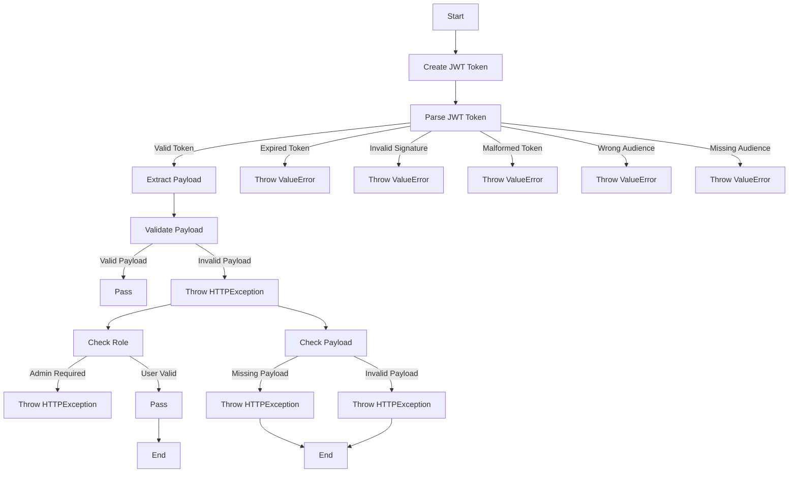

## 类结构

```
pytest.fixture(autouse=True)
def create_token(payload, secret=None, algorithm="HS256"):
def test_parse_jwt_token_valid():
def test_parse_jwt_token_expired():
def test_parse_jwt_token_invalid_signature():
def test_parse_jwt_token_malformed():
def test_parse_jwt_token_wrong_audience():
def test_parse_jwt_token_missing_audience():
async def test_get_jwt_payload_with_valid_token():
async def test_get_jwt_payload_no_credentials():
async def test_get_jwt_payload_invalid_token():
def test_verify_user_with_valid_user():
def test_verify_user_with_admin():
def test_verify_user_admin_only_with_regular_user():
def test_verify_user_no_payload():
def test_verify_user_missing_sub():
def test_verify_user_empty_sub():
def test_verify_user_none_sub():
def test_verify_user_missing_role_admin_check():
def test_jwt_with_additional_claims():
def test_jwt_with_numeric_sub():
def test_jwt_with_very_long_sub():
def test_jwt_with_special_characters_in_claims():
def test_jwt_with_future_iat():
def test_jwt_with_different_algorithms():
```

## 全局变量及字段


### `MOCK_JWT_SECRET`
    
A mock JWT secret key used for testing.

类型：`str`
    


### `TEST_USER_PAYLOAD`
    
A dictionary containing a test user payload for JWT tokens.

类型：`dict`
    


### `TEST_ADMIN_PAYLOAD`
    
A dictionary containing a test admin payload for JWT tokens.

类型：`dict`
    


### `Settings`
    
A class representing the configuration settings for JWT.

类型：`class`
    


### `jwt`
    
A module providing JWT encoding and decoding functionality.

类型：`module`
    


### `pytest`
    
A module providing a framework for writing tests.

类型：`module`
    


### `os`
    
A module providing a way to use operating system dependent functionality.

类型：`module`
    


### `datetime`
    
A module providing classes for manipulating dates and times.

类型：`module`
    


### `timedelta`
    
A class representing a duration representing the difference between two dates or times.

类型：`class`
    


### `timezone`
    
A module providing classes for dealing with time zones.

类型：`module`
    


### `HTTPException`
    
A class representing an HTTP exception.

类型：`class`
    


### `HTTPAuthorizationCredentials`
    
A class representing HTTP authorization credentials.

类型：`class`
    


### `MockerFixture`
    
A class representing a fixture for mocking objects in tests.

类型：`class`
    


### `User`
    
A class representing a user with user_id, role, and email fields.

类型：`class`
    


### `User.user_id`
    
The unique identifier for the user.

类型：`str`
    


### `User.role`
    
The role of the user.

类型：`str`
    


### `User.email`
    
The email address of the user.

类型：`str`
    
    

## 全局函数及方法


### create_token

Helper to create JWT tokens.

参数：

- `payload`：`dict`，The payload to be encoded into the JWT token.
- `secret`：`str`，The secret key used to encode the JWT token. Defaults to `MOCK_JWT_SECRET`.
- `algorithm`：`str`，The algorithm used to encode the JWT token. Defaults to `"HS256"`.

返回值：`str`，The JWT token encoded with the given payload and secret.

#### 流程图

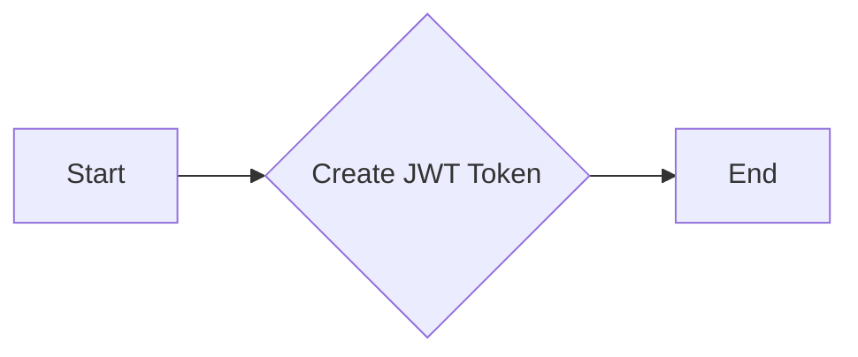

#### 带注释源码

```python
def create_token(payload, secret=None, algorithm="HS256"):
    """Helper to create JWT tokens."""
    if secret is None:
        secret = MOCK_JWT_SECRET
    return jwt.encode(payload, secret, algorithm=algorithm)
```


### `parse_jwt_token`

This function parses and validates a JWT token, returning the decoded payload if valid.

参数：

- `token`：`str`，The JWT token to be parsed and validated.

返回值：`dict`，The decoded payload of the JWT token if valid.

#### 流程图

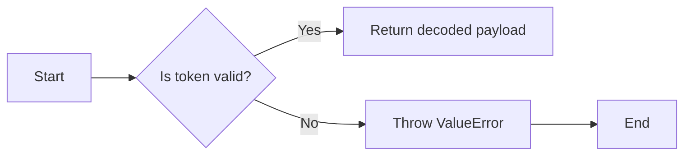

#### 带注释源码

```python
def parse_jwt_token(token: str) -> dict:
    try:
        # Decode the JWT token
        decoded_payload = jwt.decode(token, config._settings.JWT_VERIFY_KEY, algorithms=["HS256"])
        return decoded_payload
    except jwt.ExpiredSignatureError:
        # Token has expired
        raise ValueError("Token has expired")
    except jwt.InvalidTokenError:
        # Invalid token
        raise ValueError("Invalid token")
    except jwt.InvalidAudienceError:
        # Invalid audience
        raise ValueError("Invalid audience")
    except jwt.InvalidIssuerError:
        # Invalid issuer
        raise ValueError("Invalid issuer")
    except jwt.InvalidAlgorithmError:
        # Invalid algorithm
        raise ValueError("Invalid algorithm")
    except jwt.InvalidClaimError:
        # Invalid claim
        raise ValueError("Invalid claim")
```


### `jwt_utils.parse_jwt_token`

This function parses a JWT token and returns the decoded payload.

参数：

- `token`：`str`，The JWT token to parse.
- ...

返回值：`dict`，The decoded payload of the JWT token.

#### 流程图


#### 带注释源码

```python
def parse_jwt_token(token: str) -> dict:
    try:
        payload = jwt.decode(token, config._settings.JWT_VERIFY_KEY, algorithms=["HS256"])
        return payload
    except jwt.ExpiredSignatureError:
        raise ValueError("Token has expired")
    except jwt.InvalidTokenError:
        raise ValueError("Invalid token")
    except jwt.InvalidAudienceError:
        raise ValueError("Invalid audience")
    except jwt.InvalidIssuerError:
        raise ValueError("Invalid issuer")
    except jwt.InvalidAlgorithmError:
        raise ValueError("Invalid algorithm")
    except jwt.InvalidClaimError:
        raise ValueError("Invalid claim")
```


### `verify_user`

Verifies the user based on the provided JWT payload and checks if the user has admin privileges if required.

参数：

- `payload`：`dict`，The JWT payload containing user information.
- `admin_only`：`bool`，Indicates whether the user must have admin privileges.

返回值：`User`，A User object representing the verified user.

#### 流程图

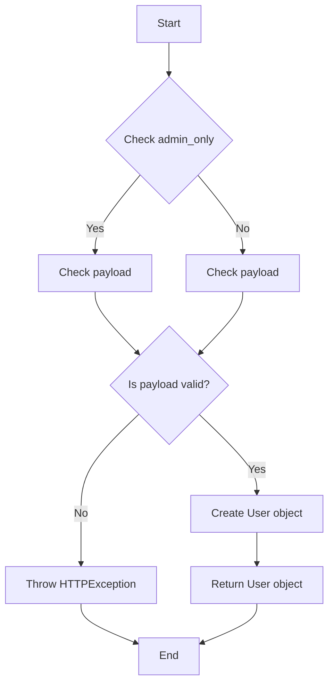

#### 带注释源码

```python
def test_verify_user_with_valid_user():
    """Test verifying a valid user."""
    user = jwt_utils.verify_user(TEST_USER_PAYLOAD, admin_only=False)
    assert isinstance(user, User)
    assert user.user_id == "test-user-id"
    assert user.role == "user"
    assert user.email == "test@example.com"
```

```python
def test_verify_user_with_admin():
    """Test verifying an admin user."""
    user = jwt_utils.verify_user(TEST_ADMIN_PAYLOAD, admin_only=True)
    assert isinstance(user, User)
    assert user.user_id == "admin-user-id"
    assert user.role == "admin"
```

```python
def test_verify_user_admin_only_with_regular_user():
    """Test verifying regular user when admin is required."""
    with pytest.raises(HTTPException) as exc_info:
        jwt_utils.verify_user(TEST_USER_PAYLOAD, admin_only=True)
    assert exc_info.value.status_code == 403
    assert "Admin access required" in exc_info.value.detail
```

```python
def test_verify_user_no_payload():
    """Test verifying user with no payload."""
    with pytest.raises(HTTPException) as exc_info:
        jwt_utils.verify_user(None, admin_only=False)
    assert exc_info.value.status_code == 401
    assert "Authorization header is missing" in exc_info.value.detail
```

```python
def test_verify_user_missing_sub():
    """Test verifying user with payload missing 'sub' field."""
    invalid_payload = {"role": "user", "email": "test@example.com"}
    with pytest.raises(HTTPException) as exc_info:
        jwt_utils.verify_user(invalid_payload, admin_only=False)
    assert exc_info.value.status_code == 401
    assert "User ID not found in token" in exc_info.value.detail
```

```python
def test_verify_user_empty_sub():
    """Test verifying user with empty 'sub' field."""
    invalid_payload = {"sub": "", "role": "user"}
    with pytest.raises(HTTPException) as exc_info:
        jwt_utils.verify_user(invalid_payload, admin_only=False)
    assert exc_info.value.status_code == 401
    assert "User ID not found in token" in exc_info.value.detail
```

```python
def test_verify_user_none_sub():
    """Test verifying user with None 'sub' field."""
    invalid_payload = {"sub": None, "role": "user"}
    with pytest.raises(HTTPException) as exc_info:
        jwt_utils.verify_user(invalid_payload, admin_only=False)
    assert exc_info.value.status_code == 401
    assert "User ID not found in token" in exc_info.value.detail
```

```python
def test_verify_user_missing_role_admin_check():
    """Test verifying admin when role field is missing."""
    no_role_payload = {"sub": "user-id"}
    with pytest.raises(KeyError):
        # This will raise KeyError when checking payload["role"]
        jwt_utils.verify_user(no_role_payload, admin_only=True)
``` 


### test_parse_jwt_token_valid

Test parsing a valid JWT token.

参数：

- `token`：`str`，The JWT token to be parsed.

返回值：`dict`，The decoded JWT payload.

#### 流程图

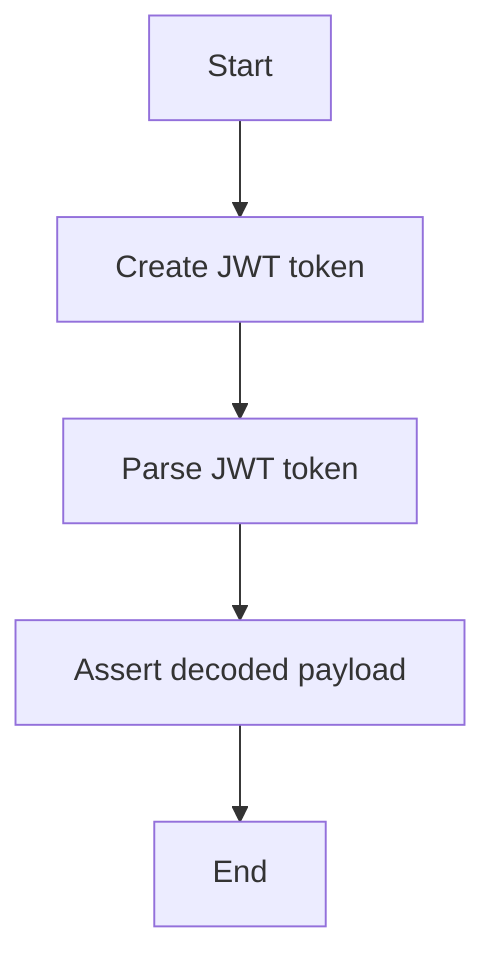

#### 带注释源码

```python
def test_parse_jwt_token_valid():
    """Test parsing a valid JWT token."""
    token = create_token(TEST_USER_PAYLOAD)
    result = jwt_utils.parse_jwt_token(token)

    assert result["sub"] == "test-user-id"
    assert result["role"] == "user"
    assert result["aud"] == "authenticated"
```


### test_parse_jwt_token_expired

Test parsing an expired JWT token.

参数：

- token：`str`，The JWT token to be parsed.

返回值：`None`

#### 流程图

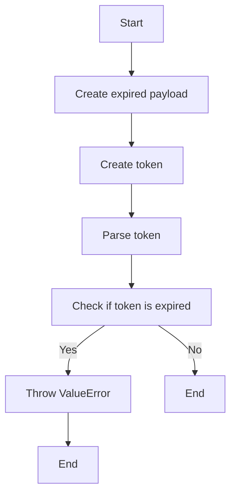

#### 带注释源码

```python
def test_parse_jwt_token_expired():
    """Test parsing an expired JWT token."""
    expired_payload = {
        **TEST_USER_PAYLOAD,
        "exp": datetime.now(timezone.utc) - timedelta(hours=1),
    }
    token = create_token(expired_payload)

    with pytest.raises(ValueError) as exc_info:
        jwt_utils.parse_jwt_token(token)
    assert "Token has expired" in str(exc_info.value)
```


### test_parse_jwt_token_invalid_signature

This function tests the parsing of a JWT token with an invalid signature.

参数：

- `token`：`str`，The JWT token to be parsed.
- ...

返回值：`None`，This function does not return a value.

#### 流程图

```mermaid
graph TD
    A[Start] --> B[Call jwt_utils.parse_jwt_token(token)]
    B --> C{Check if token is valid}
    C -->|Yes| D[End]
    C -->|No| E[Throw ValueError with message "Invalid token"]
```

#### 带注释源码

```python
def test_parse_jwt_token_invalid_signature():
    """Test parsing a token with invalid signature."""
    # Create token with different secret
    token = create_token(TEST_USER_PAYLOAD, secret="wrong-secret")

    with pytest.raises(ValueError) as exc_info:
        jwt_utils.parse_jwt_token(token)
    assert "Invalid token" in str(exc_info.value)
```


### test_parse_jwt_token_malformed

This function tests the parsing of malformed JWT tokens.

参数：

- `malformed_tokens`：`list`，A list of malformed JWT tokens to be tested.

返回值：`None`，This function does not return a value.

#### 流程图

```mermaid
graph TD
    A[Start] --> B[Iterate over malformed_tokens]
    B --> C{Is token malformed?}
    C -- Yes --> D[Throw ValueError with message "Invalid token"]
    C -- No --> E[Continue to next token]
    E --> B
    B --> F[End]
```

#### 带注释源码

```python
def test_parse_jwt_token_malformed():
    """Test parsing a malformed token."""
    malformed_tokens = [
        "not.a.token",
        "invalid",
        "",
        # Header only
        "eyJ0eXAiOiJKV1QiLCJhbGciOiJIUzI1NiJ9",
        # No signature
        "eyJ0eXAiOiJKV1QiLCJhbGciOiJIUzI1NiJ9.eyJzdWIiOiJ0ZXN0In0",
    ]

    for token in malformed_tokens:
        with pytest.raises(ValueError) as exc_info:
            jwt_utils.parse_jwt_token(token)
        assert "Invalid token" in str(exc_info.value)
```


### test_parse_jwt_token_wrong_audience

This function tests the parsing of a JWT token with an incorrect audience claim.

参数：

- `token`：`str`，The JWT token to be parsed.
- ...

返回值：`None`，This function raises a `ValueError` if the token is invalid.

#### 流程图

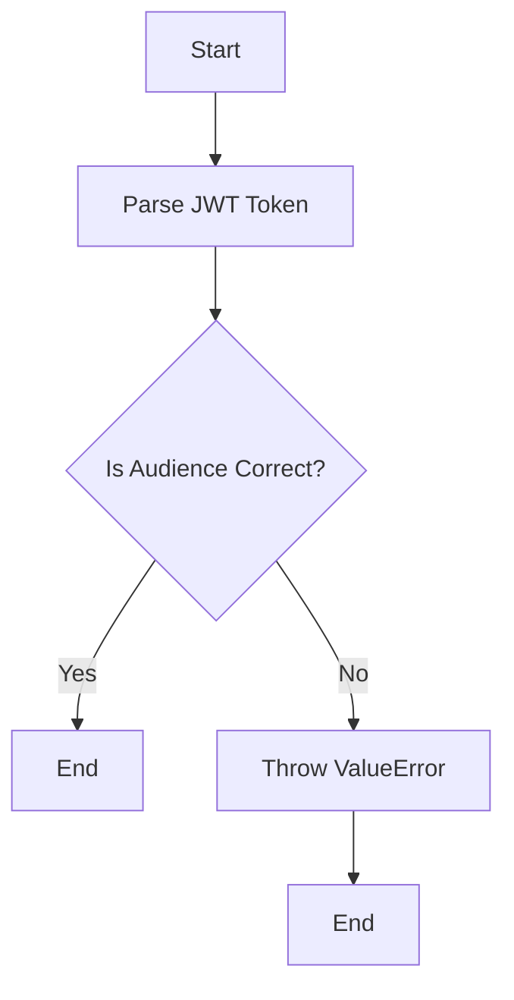

#### 带注释源码

```python
def test_parse_jwt_token_wrong_audience():
    """Test parsing a token with wrong audience."""
    wrong_aud_payload = {**TEST_USER_PAYLOAD, "aud": "wrong-audience"}
    token = create_token(wrong_aud_payload)

    with pytest.raises(ValueError) as exc_info:
        jwt_utils.parse_jwt_token(token)
    assert "Invalid token" in str(exc_info.value)
```


### test_parse_jwt_token_missing_audience

This function tests the parsing of a JWT token that is missing the audience claim.

参数：

- `token`：`str`，The JWT token to be parsed.

返回值：`None`，This function raises a `ValueError` if the token is invalid.

#### 流程图

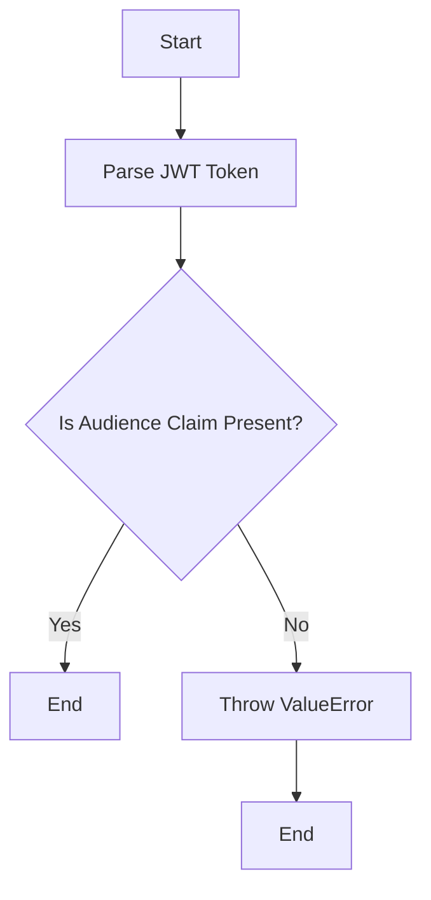

#### 带注释源码

```python
def test_parse_jwt_token_missing_audience():
    """Test parsing a token without audience claim."""
    no_aud_payload = {k: v for k, v in TEST_USER_PAYLOAD.items() if k != "aud"}
    token = create_token(no_aud_payload)

    with pytest.raises(ValueError) as exc_info:
        jwt_utils.parse_jwt_token(token)
    assert "Invalid token" in str(exc_info.value)
```


### test_get_jwt_payload_with_valid_token

Test extracting JWT payload with valid bearer token.

参数：

- credentials：`HTTPAuthorizationCredentials`，The credentials object containing the bearer token.

返回值：`dict`，The decoded JWT payload.

#### 流程图

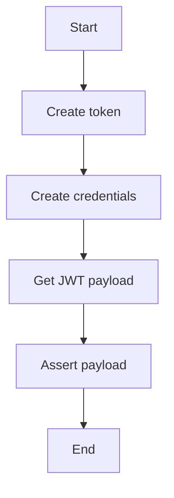

#### 带注释源码

```python
async def test_get_jwt_payload_with_valid_token():
    """Test extracting JWT payload with valid bearer token."""
    token = create_token(TEST_USER_PAYLOAD)
    credentials = HTTPAuthorizationCredentials(scheme="Bearer", credentials=token)

    result = await jwt_utils.get_jwt_payload(credentials)
    assert result["sub"] == "test-user-id"
    assert result["role"] == "user"
```


### test_get_jwt_payload_no_credentials

This function tests the behavior of the `get_jwt_payload` method when no credentials are provided.

参数：

- `credentials`：`HTTPAuthorizationCredentials`，The credentials object containing the authorization header.

返回值：`None`，No credentials provided, raises an HTTPException with status code 401.

#### 流程图

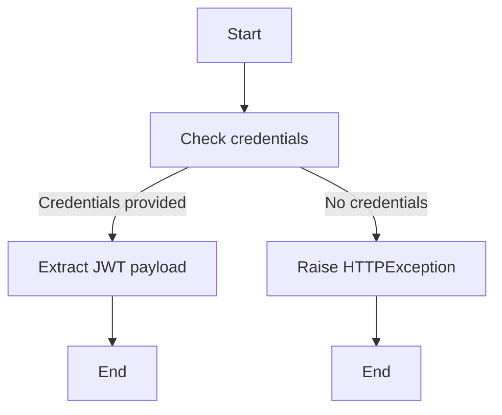

#### 带注释源码

```python
async def test_get_jwt_payload_no_credentials():
    """Test JWT payload when no credentials provided."""
    with pytest.raises(HTTPException) as exc_info:
        await jwt_utils.get_jwt_payload(None)
    assert exc_info.value.status_code == 401
    assert "Authorization header is missing" in exc_info.value.detail
```


### test_get_jwt_payload_invalid_token

This function tests the extraction of JWT payload with an invalid token.

参数：

- credentials：`HTTPAuthorizationCredentials`，The credentials object containing the authorization header with the token.

返回值：`None`，No return value, raises an HTTPException with a 401 status code and a detail message indicating the invalid token.

#### 流程图

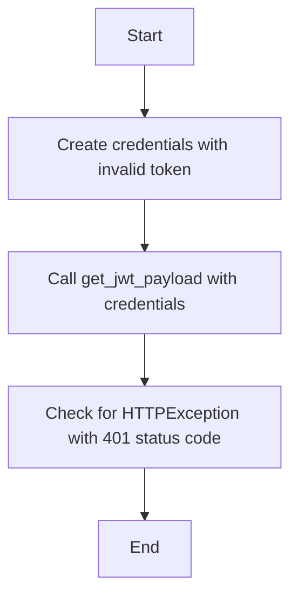

#### 带注释源码

```python
async def test_get_jwt_payload_invalid_token():
    """Test JWT payload extraction with invalid token."""
    credentials = HTTPAuthorizationCredentials(
        scheme="Bearer", credentials="invalid.token.here"
    )

    with pytest.raises(HTTPException) as exc_info:
        await jwt_utils.get_jwt_payload(credentials)
    assert exc_info.value.status_code == 401
    assert "Invalid token" in exc_info.value.detail
```


### test_verify_user_with_valid_user

Test verifying a valid user.

参数：

- user_payload：`dict`，The payload of the JWT token to verify.
- admin_only：`bool`，Whether the user must be an admin to pass the verification.

返回值：`User`，The verified user object.

#### 流程图

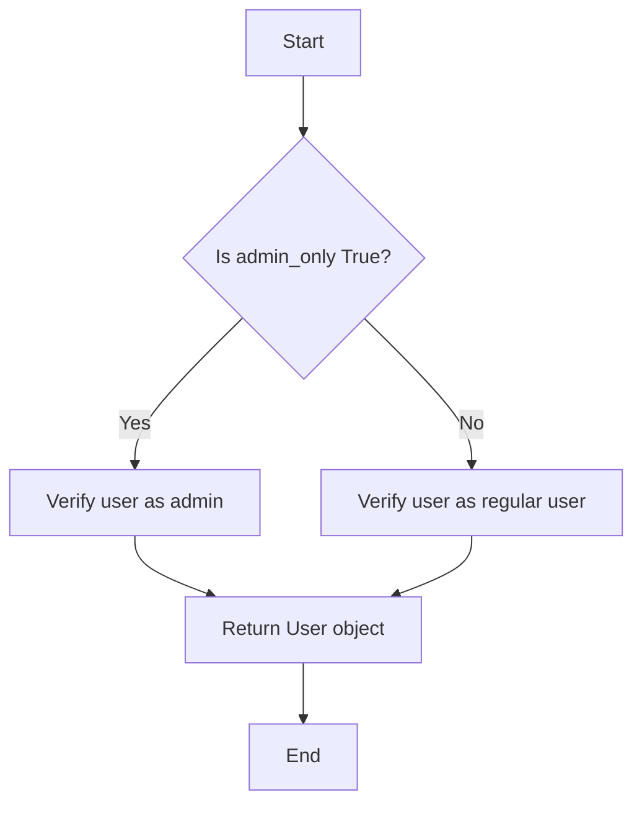

#### 带注释源码

```python
def test_verify_user_with_valid_user():
    """Test verifying a valid user."""
    user = jwt_utils.verify_user(TEST_USER_PAYLOAD, admin_only=False)
    assert isinstance(user, User)
    assert user.user_id == "test-user-id"
    assert user.role == "user"
    assert user.email == "test@example.com"
``` 


### test_verify_user_with_admin

Test verifying an admin user.

参数：

- `payload`：`dict`，The payload of the JWT token containing user information.
- `admin_only`：`bool`，Whether the user must be an admin to pass the verification.

返回值：`User`，The User object representing the verified user.

#### 流程图

```mermaid
graph TD
    A[Start] --> B{Is payload None?}
    B -- Yes --> C[Throw HTTPException with 401]
    B -- No --> D{Is admin_only True?}
    D -- Yes --> E{Is role "admin"?}
    E -- Yes --> F[Create User object]
    E -- No --> G[Throw HTTPException with 403]
    D -- No --> H[Create User object]
    F --> I[End]
    G --> I
    H --> I
```

#### 带注释源码

```python
def test_verify_user_with_admin():
    """Test verifying an admin user."""
    user = jwt_utils.verify_user(TEST_ADMIN_PAYLOAD, admin_only=True)
    assert isinstance(user, User)
    assert user.user_id == "admin-user-id"
    assert user.role == "admin"
``` 


### test_verify_user_admin_only_with_regular_user

This function tests the verification of a user with a regular role when admin access is required.

参数：

- `TEST_USER_PAYLOAD`：`dict`，A dictionary containing the payload for a user with a regular role.
- `admin_only`：`bool`，A flag indicating whether admin access is required.

返回值：`None`，This function raises an `HTTPException` with a status code of 403 and a detail message "Admin access required" if the user is not an admin.

#### 流程图

```mermaid
graph TD
    A[Start] --> B[Call jwt_utils.verify_user with TEST_USER_PAYLOAD and admin_only=True]
    B --> C[Check if user is an admin]
    C -->|Yes| D[Return user]
    C -->|No| E[ Raise HTTPException with status code 403 and detail "Admin access required"]
    E --> F[End]
```

#### 带注释源码

```python
def test_verify_user_admin_only_with_regular_user():
    """Test verifying regular user when admin is required."""
    with pytest.raises(HTTPException) as exc_info:
        jwt_utils.verify_user(TEST_USER_PAYLOAD, admin_only=True)
    assert exc_info.value.status_code == 403
    assert "Admin access required" in exc_info.value.detail
```


### test_verify_user_no_payload

Test verifying user with no payload.

参数：

- 无

返回值：`HTTPException`，If the authorization header is missing, it raises an HTTPException with status code 401 and the detail "Authorization header is missing".

#### 流程图

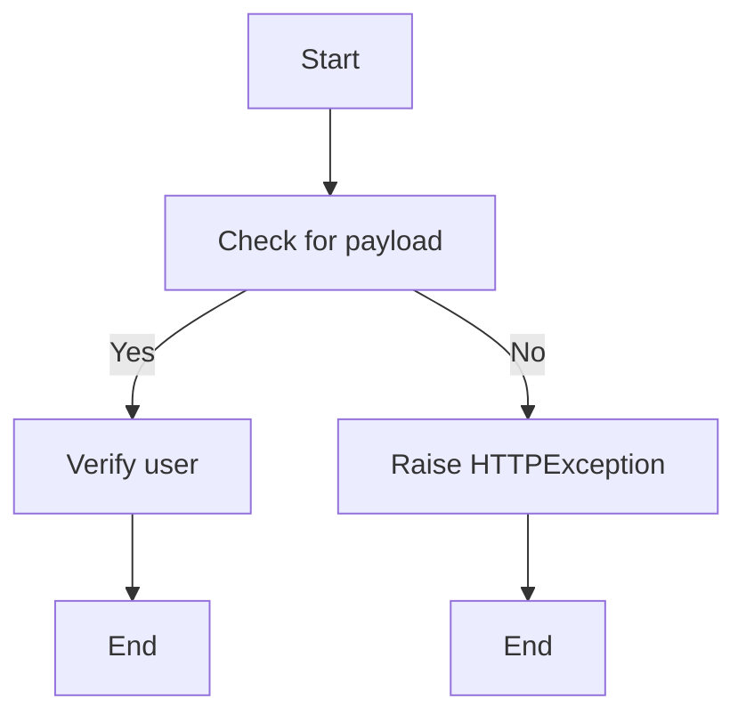

#### 带注释源码

```python
def test_verify_user_no_payload():
    """Test verifying user with no payload."""
    with pytest.raises(HTTPException) as exc_info:
        jwt_utils.verify_user(None, admin_only=False)
    assert exc_info.value.status_code == 401
    assert "Authorization header is missing" in exc_info.value.detail
```


### test_verify_user_missing_sub

This function tests the verification of a user with a JWT payload that is missing the 'sub' (subject) field.

参数：

- `invalid_payload`：`dict`，A dictionary representing the JWT payload without the 'sub' field.

返回值：`HTTPException`，An HTTP exception with a status code of 401 and a detail message indicating that the User ID is not found in the token.

#### 流程图

```mermaid
graph TD
    A[Start] --> B[Call jwt_utils.verify_user(invalid_payload, admin_only=False)]
    B --> C[Check if 'sub' field is missing]
    C -->|Yes| D[ Raise HTTPException with status code 401 and detail "User ID not found in token"]
    D --> E[End]
```

#### 带注释源码

```python
def test_verify_user_missing_sub():
    """Test verifying user with payload missing 'sub' field."""
    invalid_payload = {"role": "user", "email": "test@example.com"}
    with pytest.raises(HTTPException) as exc_info:
        jwt_utils.verify_user(invalid_payload, admin_only=False)
    assert exc_info.value.status_code == 401
    assert "User ID not found in token" in exc_info.value.detail
```


### test_verify_user_empty_sub

This function tests the behavior of the `verify_user` function when the 'sub' field in the JWT payload is empty.

参数：

- `payload`：`dict`，The JWT payload to verify.
- `admin_only`：`bool`，Whether to check if the user is an admin.

返回值：`None`，If the 'sub' field is empty, an HTTPException is raised with a status code of 401 and a detail message indicating that the User ID not found in token.

#### 流程图

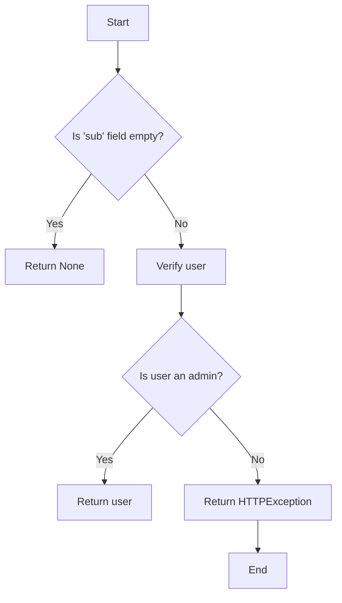

#### 带注释源码

```python
def test_verify_user_empty_sub():
    """Test verifying user with empty 'sub' field."""
    invalid_payload = {"sub": "", "role": "user"}
    with pytest.raises(HTTPException) as exc_info:
        jwt_utils.verify_user(invalid_payload, admin_only=False)
    assert exc_info.value.status_code == 401
    assert "User ID not found in token" in exc_info.value.detail
```


### test_verify_user_none_sub

This function tests the behavior of the `verify_user` function when the 'sub' field in the JWT payload is `None`.

参数：

- `payload`：`dict`，The JWT payload to verify.
- `admin_only`：`bool`，Whether to check if the user is an admin.

返回值：`None`，If the 'sub' field is `None`, an HTTPException with status code 401 is raised.

#### 流程图

```mermaid
graph TD
    A[Start] --> B{Is 'sub' field None?}
    B -- Yes --> C[Return None]
    B -- No --> D[Verify user]
    D --> E{Is user an admin?}
    E -- Yes --> F[Return user]
    E -- No --> G[Return HTTPException with status code 401]
```

#### 带注释源码

```python
def test_verify_user_none_sub():
    """Test verifying user with None 'sub' field."""
    invalid_payload = {"sub": None, "role": "user"}
    with pytest.raises(HTTPException) as exc_info:
        jwt_utils.verify_user(invalid_payload, admin_only=False)
    assert exc_info.value.status_code == 401
    assert "User ID not found in token" in exc_info.value.detail
```


### test_verify_user_missing_role_admin_check

This function tests the behavior of the `verify_user` function when the payload is missing the 'role' field and admin access is required.

参数：

- `no_role_payload`：`dict`，A dictionary representing the JWT payload without the 'role' field.

返回值：无

#### 流程图

```mermaid
graph TD
    A[Start] --> B[Call verify_user with no_role_payload and admin_only=True]
    B --> C[Check if KeyError is raised]
    C --> D[End]
```

#### 带注释源码

```python
def test_verify_user_missing_role_admin_check():
    """Test verifying admin when role field is missing."""
    no_role_payload = {"sub": "user-id"}
    with pytest.raises(KeyError):
        # This will raise KeyError when checking payload["role"]
        jwt_utils.verify_user(no_role_payload, admin_only=True)
```


### test_jwt_with_additional_claims

Test JWT token with additional custom claims.

参数：

- `extra_claims_payload`：`dict`，Contains the payload for the JWT token with additional custom claims.

返回值：`None`，No return value, the function asserts the expected results.

#### 流程图

```mermaid
graph TD
    A[Start] --> B[Create JWT token with extra claims]
    B --> C[Parse JWT token]
    C --> D[Assert custom claims]
    D --> E[End]
```

#### 带注释源码

```python
def test_jwt_with_additional_claims():
    """Test JWT token with additional custom claims."""
    extra_claims_payload = {
        "sub": "user-id",
        "role": "user",
        "aud": "authenticated",
        "custom_claim": "custom_value",
        "permissions": ["read", "write"],
        "metadata": {"key": "value"},
    }
    token = create_token(extra_claims_payload)

    result = jwt_utils.parse_jwt_token(token)
    assert result["sub"] == "user-id"
    assert result["custom_claim"] == "custom_value"
    assert result["permissions"] == ["read", "write"]
```


### test_jwt_with_numeric_sub

This function tests the behavior of the `jwt_utils.verify_user` method when the JWT token's subject (`sub`) claim is a numeric value.

#### 参数

- `payload`：`dict`，The payload of the JWT token, which includes the `sub` claim as a numeric value.

#### 返回值

- None

#### 流程图

```mermaid
graph TD
    A[Start] --> B[Create JWT token with numeric 'sub']
    B --> C[Verify user with 'verify_user']
    C --> D[Check if user_id is numeric]
    D --> E[End]
```

#### 带注释源码

```python
def test_jwt_with_numeric_sub():
    """Test JWT token with numeric user ID."""
    payload = {
        "sub": 12345,  # Numeric ID
        "role": "user",
        "aud": "authenticated",
    }
    # Should convert to string internally
    user = jwt_utils.verify_user(payload, admin_only=False)
    assert user.user_id == 12345
```


### test_jwt_with_very_long_sub

This function tests the JWT token parsing and validation with a very long user ID.

参数：

- `payload`：`dict`，The payload of the JWT token containing the user ID, role, and audience.
- `admin_only`：`bool`，Whether the user must be an admin to pass the verification.

返回值：`User`，The User object representing the verified user.

#### 流程图

```mermaid
graph TD
    A[Start] --> B[Create JWT token with very long user ID]
    B --> C[Parse JWT token]
    C --> D[Verify user]
    D --> E[Check if user is admin]
    E -->|Yes| F[Return User object]
    E -->|No| G[Return HTTPException]
    F --> H[End]
    G --> H
```

#### 带注释源码

```python
def test_jwt_with_very_long_sub():
    """Test JWT token with very long user ID."""
    long_id = "a" * 1000
    payload = {
        "sub": long_id,
        "role": "user",
        "aud": "authenticated",
    }
    user = jwt_utils.verify_user(payload, admin_only=False)
    assert user.user_id == long_id
```


### test_jwt_with_special_characters_in_claims

Test JWT token with special characters in claims.

参数：

- payload：`dict`，The payload of the JWT token containing special characters in claims.

返回值：`None`，No return value, the function asserts that the JWT token with special characters in claims is parsed correctly.

#### 流程图

```mermaid
graph TD
    A[Start] --> B[Create JWT token with special characters]
    B --> C[Parse JWT token]
    C --> D[Assert special characters in claims]
    D --> E[End]
```

#### 带注释源码

```python
def test_jwt_with_special_characters_in_claims():
    """Test JWT token with special characters in claims."""
    payload = {
        "sub": "user@example.com/special-chars!@#$%",
        "role": "admin",
        "aud": "authenticated",
        "email": "test+special@example.com",
    }
    user = jwt_utils.verify_user(payload, admin_only=True)
    assert "special-chars!@#$%" in user.user_id
```


### test_jwt_with_future_iat

Test JWT token with issued-at time in future.

参数：

- 无

返回值：无

#### 流程图

```mermaid
graph TD
    A[Start] --> B[Create JWT token with future iat]
    B --> C[Attempt to parse token]
    C --> D[Check for ValueError]
    D --> E[End]
```

#### 带注释源码

```python
def test_jwt_with_future_iat():
    """Test JWT token with issued-at time in future."""
    future_payload = {
        "sub": "user-id",
        "role": "user",
        "aud": "authenticated",
        "iat": datetime.now(timezone.utc) + timedelta(hours=1),
    }
    token = create_token(future_payload)

    # PyJWT validates iat claim and should reject future tokens
    with pytest.raises(ValueError, match="not yet valid"):
        jwt_utils.parse_jwt_token(token)
``` 


### test_jwt_with_different_algorithms

This function tests that only the HS256 algorithm is accepted for JWT tokens.

参数：

- 无

返回值：无

#### 流程图

```mermaid
graph TD
    A[Start] --> B[Create JWT token with different algorithms]
    B --> C{Is algorithm HS256?}
    C -- Yes --> D[Pass]
    C -- No --> E[Throw ValueError]
    D --> F[End]
    E --> F
```

#### 带注释源码

```python
def test_jwt_with_different_algorithms():
    """Test that only HS256 algorithm is accepted."""
    payload = {
        "sub": "user-id",
        "role": "user",
        "aud": "authenticated",
    }

    # Try different algorithms
    algorithms = ["HS384", "HS512", "none"]
    for algo in algorithms:
        if algo == "none":
            # Special case for 'none' algorithm (security vulnerability if accepted)
            token = create_token(payload, "", algorithm="none")
        else:
            token = create_token(payload, algorithm=algo)

        with pytest.raises(ValueError) as exc_info:
            jwt_utils.parse_jwt_token(token)
        assert "Invalid token" in str(exc_info.value)
``` 


### User.__init__

This method initializes a User object with the provided user details.

参数：

- `self`：`User`，当前User对象
- `user_id`：`str`，用户ID
- `role`：`str`，用户角色
- `email`：`str`，用户邮箱

返回值：无

#### 流程图

```mermaid
classDiagram
    User <|-- User
    User {
        +user_id: str
        +role: str
        +email: str
        +__init__(user_id: str, role: str, email: str)
    }
```

#### 带注释源码

```python
class User:
    def __init__(self, user_id: str, role: str, email: str):
        self.user_id = user_id
        self.role = role
        self.email = email
```


### User.__str__

This method provides a string representation of a User object.

参数：

- `self`：`User`，The instance of the User class.

返回值：`str`，A string representation of the User object.

#### 流程图

```mermaid
graph LR
A[Start] --> B{Is self None?}
B -- Yes --> C[Return "User object is None"]
B -- No --> D[Return "User object with attributes: user_id, role, email"]
D --> E[End]
```

#### 带注释源码

```python
class User:
    # ... other class methods and fields ...

    def __str__(self):
        """
        Return a string representation of the User object.
        """
        if self is None:
            return "User object is None"
        else:
            return f"User object with attributes: user_id, role, email"
```


## 关键组件


### 张量索引与惰性加载

张量索引与惰性加载是处理大型数据集时常用的技术，它允许在需要时才加载数据的一部分，从而减少内存消耗和提高效率。

### 反量化支持

反量化支持是指系统对量化操作的反向操作能力，即能够从量化后的数据中恢复出原始数据，这对于某些应用场景中的精度恢复非常重要。

### 量化策略

量化策略是指将浮点数数据转换为固定点数表示的方法，这可以减少模型的大小和计算量，但可能会牺牲一些精度。量化策略的选择对模型的性能和精度有重要影响。


## 问题及建议


### 已知问题

-   **代码重复**：`create_token` 函数在多个测试用例中被重复调用，这可能导致维护困难。建议将 `create_token` 函数移动到测试类或模块级别，以便重用。
-   **异常处理**：在 `test_parse_jwt_token_expired`、`test_parse_jwt_token_invalid_signature`、`test_parse_jwt_token_malformed`、`test_parse_jwt_token_wrong_audience`、`test_parse_jwt_token_missing_audience`、`test_get_jwt_payload_no_credentials`、`test_get_jwt_payload_invalid_token`、`test_verify_user_with_admin`、`test_verify_user_admin_only_with_regular_user`、`test_verify_user_no_payload`、`test_verify_user_missing_sub`、`test_verify_user_empty_sub`、`test_verify_user_none_sub`、`test_verify_user_missing_role_admin_check` 和 `test_jwt_with_future_iat` 测试中，异常处理使用了 `pytest.raises`，但没有提供具体的异常类型。建议明确指定异常类型，以便更精确地测试异常情况。
-   **测试覆盖率**：虽然代码注释中提到确保 100% 的行和分支覆盖率，但实际测试可能没有达到这个目标。建议使用代码覆盖率工具（如 `coverage.py`）来验证测试覆盖率。
-   **全局变量**：`MOCK_JWT_SECRET` 和 `TEST_USER_PAYLOAD` 是全局变量，这可能导致代码难以维护和理解。建议将这些变量移动到配置文件或模块级别，并使用适当的访问修饰符。

### 优化建议

-   **代码重构**：将 `create_token` 函数移动到测试类或模块级别，并使用 `@pytest.fixture` 装饰器来提供 `Settings` 对象。
-   **异常处理**：在测试中明确指定异常类型，例如 `pytest.raises(ValueError)`。
-   **测试覆盖率**：使用代码覆盖率工具（如 `coverage.py`）来验证测试覆盖率，并确保所有代码路径都被测试到。
-   **全局变量**：将全局变量移动到配置文件或模块级别，并使用适当的访问修饰符，例如将 `MOCK_JWT_SECRET` 和 `TEST_USER_PAYLOAD` 移动到 `config.py` 文件中。
-   **代码风格**：使用代码风格工具（如 `flake8` 或 `black`）来确保代码风格的一致性。
-   **文档**：为每个测试用例添加更详细的文档说明，包括测试目的、预期结果和实际结果。


## 其它


### 设计目标与约束

- 设计目标：
  - 确保JWT令牌解析和验证的全面测试，确保100%的行和分支覆盖率。
  - 提供一个安全可靠的JWT令牌处理机制。
  - 支持多种测试场景，包括有效令牌、过期令牌、无效签名、格式错误、错误的受众、缺少受众、缺少有效载荷等。
- 约束：
  - 必须使用HS256算法进行签名。
  - 令牌的秘密密钥必须至少32个字符。
  - 令牌的有效载荷必须包含特定的字段，如`sub`、`role`、`aud`和`email`。

### 错误处理与异常设计

- 错误处理：
  - 对于无效的令牌，抛出`ValueError`异常，并包含错误信息。
  - 对于缺少的必要字段，抛出`KeyError`异常。
  - 对于不正确的算法，抛出`ValueError`异常。
  - 对于未来的`iat`值，抛出`ValueError`异常。
- 异常设计：
  - 使用`pytest.raises`来捕获和处理预期的异常。
  - 使用`HTTPException`来处理HTTP错误响应。

### 数据流与状态机

- 数据流：
  - 用户请求JWT令牌。
  - 系统生成JWT令牌。
  - 用户发送JWT令牌进行验证。
  - 系统解析和验证JWT令牌。
  - 系统返回验证结果。
- 状态机：
  - JWT令牌生成状态：有效载荷、密钥、算法。
  - JWT令牌验证状态：解析、验证签名、验证字段、验证受众。

### 外部依赖与接口契约

- 外部依赖：
  - `os`：用于环境变量操作。
  - `datetime`：用于日期和时间操作。
  - `jwt`：用于JWT令牌处理。
  - `pytest`：用于测试。
  - `fastapi`：用于HTTP请求处理。
  - `pytest-mock`：用于模拟。
- 接口契约：
  - `create_token`函数：生成JWT令牌。
  - `parse_jwt_token`函数：解析JWT令牌。
  - `get_jwt_payload`函数：从HTTP请求中提取JWT有效载荷。
  - `verify_user`函数：验证用户身份。


    