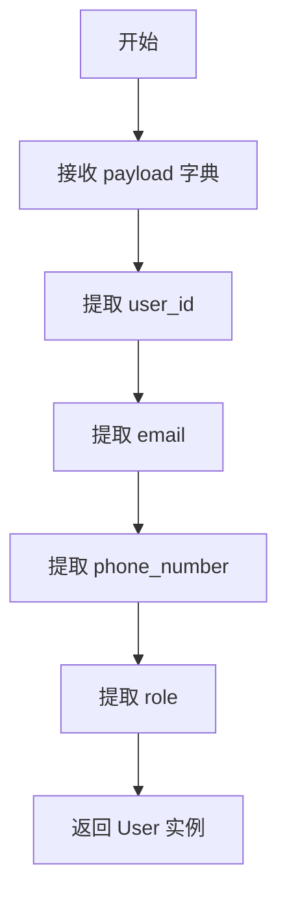

# `.\AutoGPT\autogpt_platform\autogpt_libs\autogpt_libs\auth\models.py` 详细设计文档

该代码定义了一个不可变的 `User` 数据类，用于表示用户实体，包含用户 ID、电子邮件、电话号码和角色等属性，并提供了一个类方法 `from_payload`，用于从字典载荷中实例化用户对象。

## 整体流程



## 类结构

```
User (继承自 dataclass)
```

## 全局变量及字段


### `DEFAULT_USER_ID`
    
默认用户 ID 的 UUID 字符串

类型：`str`
    


### `DEFAULT_EMAIL`
    
默认电子邮件地址的字符串

类型：`str`
    


### `User.user_id`
    
用户的唯一标识符字符串

类型：`str`
    


### `User.email`
    
用户的电子邮件地址字符串

类型：`str`
    


### `User.phone_number`
    
用户的电话号码字符串

类型：`str`
    


### `User.role`
    
用户的角色字符串

类型：`str`
    
    

## 全局函数及方法


### 1. 核心功能概述

该代码定义了一个不可变的 `User` 数据类，用于封装用户信息，并包含一个类方法 `from_payload`，用于将 JSON 或 Web 令牌载荷字典转换为 `User` 对象实例，同时处理可选字段并提供默认值。

### 2. 文件的整体运行流程

该文件首先导入 `dataclasses` 模块以支持数据类特性。接着定义了两个全局常量 `DEFAULT_USER_ID` 和 `DEFAULT_EMAIL` 作为默认值。随后定义了一个不可变的 `User` 数据类，包含 `user_id`、`email`、`phone_number` 和 `role` 四个字段。该类包含一个类方法 `from_payload`，该方法接收一个字典参数，从中提取特定键的值来初始化并返回一个新的 `User` 实例。

### 3. 类的详细信息

#### 类字段
- `user_id`: `str`，用户唯一标识符。
- `email`: `str`，用户的电子邮件地址。
- `phone_number`: `str`，用户的电话号码。
- `role`: `str`，用户的角色或权限级别。

#### 类方法
- `from_payload(cls, payload)`: 见下方详细说明。

#### 全局变量
- `DEFAULT_USER_ID`: `str`，默认的用户 ID 常量。
- `DEFAULT_EMAIL`: `str`，默认的电子邮件常量。

### 4. `User.from_payload` 详细信息

#### 名称
`User.from_payload`

#### 描述
这是一个类方法，用于从字典格式的载荷数据中解析用户信息并创建 `User` 实例。它处理了必填字段和可选字段，为可选字段提供了默认空字符串。

#### 参数
-  `cls`: `type`，调用该方法时隐式传入的类对象（即 `User` 类本身）。
-  `payload`: `dict`，包含用户数据的字典，通常来自 JWT 令牌或 API 请求体。

#### 返回值
`User`，一个新创建的 `User` 实例。

#### 流程图

```mermaid
flowchart TD
    A[Start: from_payload] --> B{Input: payload dict}
    B --> C[Extract user_id: payload['sub']]
    B --> D[Extract email: payload.get('email', '')]
    B --> E[Extract phone: payload.get('phone', '')]
    B --> F[Extract role: payload['role']]
    C --> G[Create User instance]
    D --> G
    E --> G
    F --> G
    G --> H[Return User instance]
    H --> I[End]
```

#### 带注释源码

```python
    @classmethod
    def from_payload(cls, payload):
        """
        从载荷字典创建 User 实例。
        
        Args:
            cls: User 类本身。
            payload (dict): 包含用户信息的字典。
            
        Returns:
            User: 初始化后的 User 对象。
        """
        # 使用 cls 而不是 User，支持继承和多态
        return cls(
            # 从 payload 中获取 'sub' 字段作为 user_id，这是 JWT 标准中的 Subject
            user_id=payload["sub"],
            
            # 使用 .get() 方法获取 'email'，如果不存在则返回空字符串
            email=payload.get("email", ""),
            
            # 使用 .get() 方法获取 'phone'，如果不存在则返回空字符串
            phone_number=payload.get("phone", ""),
            
            # 从 payload 中获取 'role' 字段
            role=payload["role"],
        )
```

### 5. 关键组件信息
- **User**: 不可变的数据容器，确保用户信息一旦创建即不可更改，符合不可变数据对象的设计原则。
- **from_payload**: 工厂方法，负责将外部数据结构（字典）转换为内部领域对象（User）。
- **frozen=True**: dataclass 装饰器参数，强制类为不可变，防止意外修改用户属性。

### 6. 潜在的技术债务或优化空间
1.  **缺少错误处理**: 代码中直接使用 `payload["key"]` 访问字典，如果 `payload` 中缺少 `sub` 或 `role`，会抛出 `KeyError` 异常，缺乏健壮性。
2.  **缺少类型提示**: 函数参数和返回值未使用 Python 类型注解（如 `payload: dict`），不利于静态类型检查工具（如 mypy）的使用。
3.  **硬编码默认值**: 默认值（如空字符串）是硬编码的，如果未来需要更复杂的默认值逻辑（如从配置文件读取），需要修改代码。
4.  **数据验证缺失**: 没有对 `email` 或 `phone_number` 的格式进行验证，可能导致无效数据进入系统。

### 7. 其它项目

#### 设计目标与约束
- **无依赖**: 使用 Python 内置的 `dataclasses` 避免引入 `pydantic` 等重型依赖，保持代码轻量。
- **不可变性**: 使用 `frozen=True` 保证对象状态安全，防止在多线程或异步环境中出现数据竞争。

#### 错误处理与异常设计
- 当前设计假设 `payload` 始终包含所有必填字段。在生产环境中，建议添加 `try-except` 块捕获 `KeyError`，并返回错误信息或抛出自定义异常。

#### 数据流与状态机
- 数据流为：外部输入 -> 字典解析 -> 对象实例化 -> 内存存储。由于使用了 `frozen=True`，状态机中不存在“修改状态”的转换，只有“创建新状态”的转换。

#### 外部依赖与接口契约
- 该方法期望外部输入（`payload`）遵循特定的键名约定：`sub` (用户ID), `email` (邮箱), `phone` (电话), `role` (角色)。如果接口契约变更，此方法将直接报错。


## 关键组件

该代码定义了一个不可变的 `User` 数据容器，用于表示用户实体，包含用户 ID、电子邮件、电话号码和角色。它提供了从字典（如 JWT payload）反序列化的能力，并定义了默认用户标识符和电子邮件常量。

文件首先定义了两个全局常量 `DEFAULT_USER_ID` 和 `DEFAULT_EMAIL`。随后定义了一个不可变的 `User` 数据类，包含用户 ID、电子邮件、电话号码和角色等字段。该类提供了一个类方法 `from_payload`，用于从字典（如 JWT payload）中提取数据并实例化 `User` 对象。

### 类的详细信息

#### 类字段
*   **user_id**: `str` - 用户唯一标识符。
*   **email**: `str` - 用户电子邮件地址。
*   **phone_number**: `str` - 用户电话号码。
*   **role**: `str` - 用户角色。

#### 类方法
*   **from_payload**
    *   **参数**:
        *   `cls`: `type` - User 类本身。
        *   `payload`: `dict` - 包含用户信息的字典（通常来自 JWT 或 API 请求体）。
    *   **返回值**: `User` - 新创建的 User 实例。
    *   **描述**: 从字典数据中提取字段并初始化 User 对象。使用 `get` 方法处理可选字段，使用直接索引处理必需字段。
    *   **Mermaid 流程图**:
        ```mermaid
        graph TD
        A[Start: from_payload] --> B{Check payload keys}
        B -->|Missing sub or role| C[Raise KeyError]
        B -->|All keys present| D[Extract values]
        D --> E[Return User instance]
        ```
    *   **带注释源码**:
        ```python
        @classmethod
        def from_payload(cls, payload):
            # 从字典中提取用户数据
            # 使用 .get() 处理可选字段，如 email 和 phone
            return cls(
                user_id=payload["sub"],  # 必需字段，如果缺失会引发 KeyError
                email=payload.get("email", ""),  # 可选字段，默认为空字符串
                phone_number=payload.get("phone", ""),  # 可选字段，默认为空字符串
                role=payload["role"],  # 必需字段，如果缺失会引发 KeyError
            )
        ```

#### 全局变量
*   **DEFAULT_USER_ID**: `str` - 默认的用户唯一标识符。
*   **DEFAULT_EMAIL**: `str` - 默认的电子邮件地址。

### 关键组件信息
*   **User 类**: 不可变的数据容器，用于封装用户信息。
*   **from_payload 方法**: 负责将字典数据反序列化为 User 对象的工厂方法。
*   **frozen=True**: 修饰符，确保 User 对象创建后其属性不可变，提高线程安全性。

### 潜在的技术债务或优化空间
1.  **缺少类型提示**: `from_payload` 方法的参数和返回值缺少类型注解（如 `payload: dict`），不利于静态类型检查工具（如 mypy）的使用。
2.  **缺乏输入验证**: 代码直接依赖 Python 的 `KeyError` 来处理缺失字段，没有进行数据格式验证（如邮箱格式、电话号码格式），可能导致无效数据进入系统。
3.  **依赖手动处理**: 虽然避免了 pydantic 依赖，但手动处理字段映射和默认值增加了维护成本和出错风险。

### 其它项目
*   **设计目标与约束**: 代码设计遵循了“零依赖”原则，仅使用 Python 标准库，并利用 `dataclass` 的 `frozen` 特性保证数据不可变性。
*   **错误处理与异常设计**: 采用 Python 原生的异常机制，当 payload 中缺少必需字段（如 `sub` 或 `role`）时，会抛出 `KeyError`。
*   **数据流与状态机**: 数据流为 `dict` -> `User` 对象。由于对象是 `frozen` 的，状态一旦创建即不可变，不存在状态变更逻辑。
*   **外部依赖与接口契约**: 该类作为数据传输对象（DTO），不直接依赖外部服务，但假设输入的 `payload` 结构符合 JWT 标准或特定的 API 契约。

## 问题及建议


### 已知问题

-   **缺少类型提示**：`from_payload` 方法和 `User` 类的字段均未定义类型提示，导致静态类型检查工具无法提供准确的代码补全和错误检测。
-   **缺乏错误处理**：代码中直接使用 `payload["sub"]` 和 `payload["role"]` 进行严格键访问，如果 payload 中缺少这些必需字段，会直接抛出 `KeyError` 导致程序崩溃，缺乏优雅的降级或异常处理机制。
-   **数据验证缺失**：虽然使用了 `frozen=True` 防止数据被修改，但代码未对输入数据进行格式验证（如邮箱格式、用户ID格式、角色是否合法），可能导致无效数据进入系统。
-   **全局变量污染**：`DEFAULT_USER_ID` 和 `DEFAULT_EMAIL` 定义在模块级别，虽然作为常量尚可接受，但在大型项目中可能造成命名空间污染，且不利于配置的集中管理。

### 优化建议

-   **引入类型提示**：为 `from_payload` 方法添加参数类型（如 `Dict[str, Any]`）和返回值类型（`-> User`），并为类字段添加类型注解，提升代码可读性和 IDE 支持能力。
-   **增强健壮性**：使用 `payload.get()` 方法替代严格索引访问，为 `sub` 和 `role` 等关键字段提供默认值或抛出明确的自定义异常，避免因数据缺失导致服务不可用。
-   **添加数据验证**：考虑引入 `pydantic` 或 `attrs` 库进行数据验证，或者手动实现验证逻辑（如正则校验邮箱），确保进入系统的数据符合业务规则。
-   **重构常量管理**：将默认常量移至专门的配置模块或类内部，遵循“配置与逻辑分离”的原则，便于后续进行环境变量替换或配置中心管理。


## 其它

### 设计目标与约束

**目标**:
构建一个轻量级、不可变的用户数据模型，旨在替代重型 ORM 或验证库（如 Pydantic），以降低系统依赖复杂度并提高性能。

**约束**:
1.  **零外部依赖**: 必须仅使用 Python 标准库（dataclasses）。
2.  **不可变性**: 对象实例必须保持不可变状态（frozen=True），防止运行时意外修改。
3.  **标准兼容**: 必须兼容 JWT 标准载荷格式，支持从认证令牌中反序列化用户信息。

### 错误处理与异常设计

**现状分析**:
*   **KeyError 风险**: `from_payload` 方法中直接访问 `payload["sub"]`，如果载荷中缺少 "sub" 字段，将抛出 `KeyError`，导致程序崩溃。
*   **默认值处理**: `email` 和 `phone_number` 使用 `.get()` 方法提供了空字符串默认值，这是一种防御性编程，但未验证格式。
*   **类型安全**: 未对 `role` 的值进行合法性校验，可能传入非法角色。

**建议设计**:
*   **自定义异常**: 定义 `InvalidUserPayloadError` 异常类，用于封装载荷解析错误。
*   **前置校验**: 在 `from_payload` 方法内部增加结构校验逻辑，确保 "sub" 和 "role" 存在，并验证 "role" 是否在预定义的白名单中。

### 数据流与状态机

**数据流**:
外部传入的字典载荷 -> `from_payload` 类方法 -> `User` 实例化 -> 内存中的不可变对象。

**状态机**:
该类为纯数据载体，不包含业务逻辑状态，因此不存在状态转换逻辑，始终处于“就绪”状态。

### 外部依赖与接口契约

**外部依赖**:
*   **Python 标准库**: `dataclasses` 模块。

**接口契约**:
*   **输入**: `from_payload` 方法期望输入为一个字典（Dict）。
*   **必需字段**: 键 "sub"（用户ID）和 "role"（角色）。
*   **可选字段**: 键 "email"（邮箱）和 "phone"（电话）。
*   **输出**: 返回一个冻结的 `User` 实例。

### 安全性考虑

**风险**:
直接将外部载荷反序列化可能导致注入攻击或权限提升。例如，攻击者可能篡改载荷中的 `role` 字段以获取管理员权限。

**措施**:
1.  **来源验证**: 确保 `from_payload` 调用前的载荷来源可信（如已验证签名的 JWT Token）。
2.  **角色白名单**: 在反序列化后，应立即检查 `role` 是否在允许的角色列表中，拒绝任何未授权的角色分配。
    