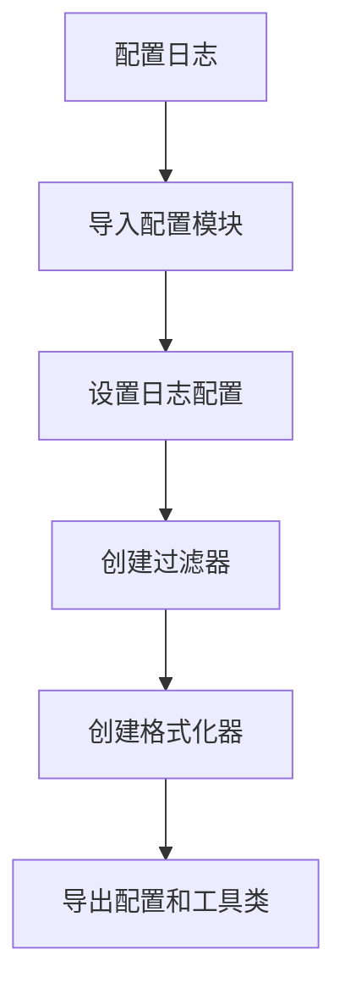
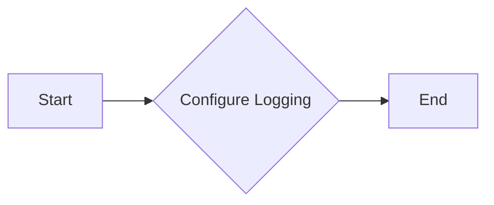

# `.\AutoGPT\autogpt_platform\autogpt_libs\autogpt_libs\logging\__init__.py` 详细设计文档

This code configures logging settings and provides utility classes for filtering and formatting log messages.

## 整体流程



## 类结构

```
LoggerConfig (配置模块)
├── configure_logging (全局函数)
│   ├── BelowLevelFilter (类)
│   └── FancyConsoleFormatter (类)
```

## 全局变量及字段


### `__all__`
    
A list of strings containing the names of the exported objects from the module.

类型：`list`
    


    

## 全局函数及方法


### configure_logging

该函数用于配置日志系统，包括设置日志级别、格式化器和过滤器。

参数：

- `logging_config`：`dict`，包含日志配置信息的字典，例如日志级别、格式化器等。

返回值：`None`，该函数不返回任何值。

#### 流程图



#### 带注释源码

```
# 从配置文件中导入configure_logging函数
from .config import configure_logging

# configure_logging函数的源码位于.config模块中，但此处无法直接展示
# 假设以下为.config模块中configure_logging函数的伪代码
def configure_logging(logging_config):
    # 设置日志级别
    logging.basicConfig(level=logging_config['level'])
    
    # 设置格式化器
    formatter = logging.Formatter(logging_config['format'])
    logging.getLogger().setFormatter(formatter)
    
    # 设置过滤器
    filter = BelowLevelFilter(logging_config['filter_level'])
    logging.getLogger().addFilter(filter)
    
    # 返回None，表示没有返回值
    return None
```

由于实际的`configure_logging`函数源码未提供，以上内容是基于假设的伪代码。实际代码可能有所不同。

## 关键组件


### configure_logging

配置日志系统。

### BelowLevelFilter

一个过滤器，用于过滤低于特定级别的日志消息。

### FancyConsoleFormatter

一个格式化器，用于美化控制台输出的日志信息。


## 问题及建议


### 已知问题

-   **模块依赖性**：代码中使用了相对导入，这可能导致在非模块化环境中运行时出现错误，例如在命令行脚本中。
-   **全局变量和函数**：代码中导入了全局变量和函数，但没有提供任何关于它们如何被使用的上下文，这可能导致代码难以理解和维护。
-   **文档缺失**：代码中没有提供任何文档说明，这会使得其他开发者难以理解代码的功能和目的。

### 优化建议

-   **使用绝对导入**：将相对导入改为绝对导入，以确保代码在不同环境中的一致性和可移植性。
-   **提供文档**：为每个导入的变量和函数提供文档说明，包括它们的用途和如何使用它们。
-   **模块化设计**：考虑将代码进一步模块化，以便更好地组织和管理代码，同时提高代码的可重用性。
-   **代码复用**：如果`configure_logging`、`BelowLevelFilter`和`FancyConsoleFormatter`在其他项目中也有用，考虑将它们封装成独立的模块或库，以便在其他项目中重用。
-   **单元测试**：为这些组件编写单元测试，以确保它们的正确性和稳定性。


## 其它


### 设计目标与约束

- 设计目标：确保日志配置、过滤和格式化功能高效、可扩展且易于维护。
- 约束条件：遵循模块化设计原则，确保代码的可重用性和可测试性。

### 错误处理与异常设计

- 错误处理：所有可能引发异常的操作都应进行异常捕获和处理。
- 异常设计：定义自定义异常类，以提供更具体的错误信息。

### 数据流与状态机

- 数据流：日志配置、过滤和格式化数据流应清晰定义，确保数据正确处理。
- 状态机：无状态机应用，但确保每个组件在特定状态下的行为是明确的。

### 外部依赖与接口契约

- 外部依赖：依赖配置、过滤器和格式化模块，确保接口契约明确。
- 接口契约：定义清晰的接口规范，确保模块间交互的一致性和稳定性。

### 测试与验证

- 测试策略：编写单元测试和集成测试，确保代码质量和功能正确性。
- 验证方法：使用代码审查和静态分析工具进行代码质量验证。

### 性能考量

- 性能指标：监控日志处理性能，确保系统在高负载下仍能稳定运行。
- 性能优化：根据性能指标进行代码优化，提高系统效率。

### 安全性考量

- 安全风险：评估日志处理过程中可能存在的安全风险。
- 安全措施：实施安全措施，如数据加密和访问控制，以保护敏感信息。

### 维护与支持

- 维护策略：制定代码维护和更新策略，确保系统长期稳定运行。
- 支持计划：提供用户支持和技术文档，帮助用户解决使用过程中遇到的问题。


    