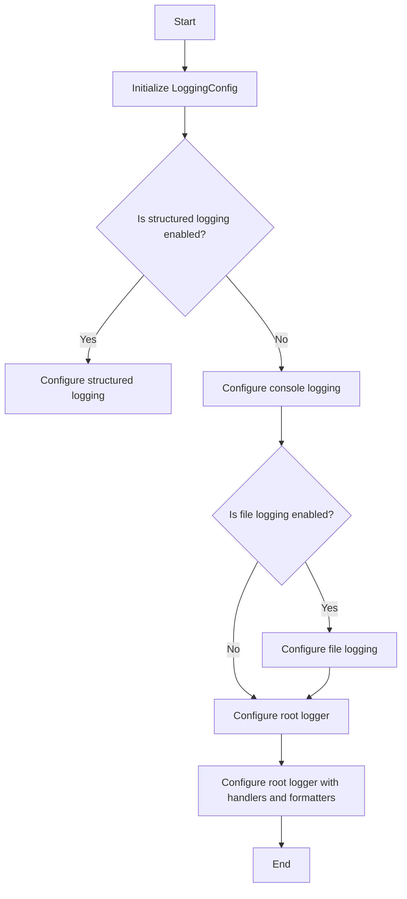
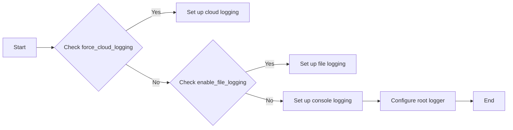

# `.\AutoGPT\autogpt_platform\autogpt_libs\autogpt_libs\logging\config.py` 详细设计文档

This module provides a logging configuration system for Auto-GPT, supporting various logging outputs including console, file, cloud, and JSON logging.

## 整体流程



## 类结构

```
LoggingConfig (配置类)
├── BaseSettings (基类)
│   ├── level (str)
│   ├── enable_cloud_logging (bool)
│   ├── enable_file_logging (bool)
│   └── log_dir (Path)
└── configure_logging (func)
```

## 全局变量及字段


### `LOG_DIR`
    
The directory where log files will be stored.

类型：`Path`
    


### `LOG_FILE`
    
The name of the activity log file.

类型：`str`
    


### `DEBUG_LOG_FILE`
    
The name of the debug log file.

类型：`str`
    


### `ERROR_LOG_FILE`
    
The name of the error log file.

类型：`str`
    


### `SIMPLE_LOG_FORMAT`
    
The format string for simple log messages.

类型：`str`
    


### `DEBUG_LOG_FORMAT`
    
The format string for debug log messages.

类型：`str`
    


### `LoggingConfig.level`
    
The logging level.

类型：`str`
    


### `LoggingConfig.enable_cloud_logging`
    
Whether to enable logging to Google Cloud Logging.

类型：`bool`
    


### `LoggingConfig.enable_file_logging`
    
Whether to enable logging to file.

类型：`bool`
    


### `LoggingConfig.log_dir`
    
The log directory for file logging.

类型：`Path`
    


### `Path.LOG_DIR`
    
The directory where log files will be stored.

类型：`Path`
    


### `Path.LOG_FILE`
    
The name of the activity log file.

类型：`str`
    


### `Path.DEBUG_LOG_FILE`
    
The name of the debug log file.

类型：`str`
    


### `Path.ERROR_LOG_FILE`
    
The name of the error log file.

类型：`str`
    


### `str.SIMPLE_LOG_FORMAT`
    
The format string for simple log messages.

类型：`str`
    


### `str.DEBUG_LOG_FORMAT`
    
The format string for debug log messages.

类型：`str`
    


### `LoggingConfig.LoggingConfig.level`
    
The logging level.

类型：`str`
    


### `LoggingConfig.LoggingConfig.enable_cloud_logging`
    
Whether to enable logging to Google Cloud Logging.

类型：`bool`
    


### `LoggingConfig.LoggingConfig.enable_file_logging`
    
Whether to enable logging to file.

类型：`bool`
    


### `LoggingConfig.LoggingConfig.log_dir`
    
The log directory for file logging.

类型：`Path`
    
    

## 全局函数及方法


### configure_logging

Configure the native logging module based on the LoggingConfig settings.

参数：

- `force_cloud_logging`：`bool`，If set to True, forces the use of cloud logging regardless of the configuration.

返回值：`None`，This function does not return any value.

#### 流程图



#### 带注释源码

```python
def configure_logging(force_cloud_logging: bool = False) -> None:
    """Configure the native logging module based on the LoggingConfig settings.

    This function sets up logging handlers and formatters according to the
    configuration specified in the LoggingConfig object. It supports various
    logging outputs including console, file, cloud, and JSON logging.

    The function uses the LoggingConfig object to determine which logging
    features to enable and how to configure them. This includes setting
    log levels, log formats, and output destinations.

    No arguments are required as the function creates its own LoggingConfig
    instance internally.

    Note: This function is typically called at the start of the application
    to set up the logging infrastructure.
    """
    config = LoggingConfig()
    log_handlers: list[logging.Handler] = []

    structured_logging = config.enable_cloud_logging or force_cloud_logging

    # Console output handlers
    if not structured_logging:
        stdout = logging.StreamHandler(stream=sys.stdout)
        stdout.setLevel(config.level)
        stdout.addFilter(BelowLevelFilter(logging.WARNING))
        if config.level == logging.DEBUG:
            stdout.setFormatter(AGPTFormatter(DEBUG_LOG_FORMAT))
        else:
            stdout.setFormatter(AGPTFormatter(SIMPLE_LOG_FORMAT))

        stderr = logging.StreamHandler()
        stderr.setLevel(logging.WARNING)
        if config.level == logging.DEBUG:
            stderr.setFormatter(AGPTFormatter(DEBUG_LOG_FORMAT))
        else:
            stderr.setFormatter(AGPTFormatter(SIMPLE_LOG_FORMAT))

        log_handlers += [stdout, stderr]

    # Cloud logging setup
    else:
        # Use Google Cloud Structured Log Handler. Log entries are printed to stdout
        # in a JSON format which is automatically picked up by Google Cloud Logging.
        from google.cloud.logging.handlers import StructuredLogHandler

        structured_log_handler = StructuredLogHandler(stream=sys.stdout)
        structured_log_handler.setLevel(config.level)
        log_handlers.append(structured_log_handler)

    # File logging setup
    if config.enable_file_logging:
        # create log directory if it doesn't exist
        if not config.log_dir.exists():
            config.log_dir.mkdir(parents=True, exist_ok=True)

        print(f"Log directory: {config.log_dir}")

        # Activity log handler (INFO and above)
        # Security fix: Use RotatingFileHandler with size limits to prevent disk exhaustion
        activity_log_handler = RotatingFileHandler(
            config.log_dir / LOG_FILE,
            mode="a",
            encoding="utf-8",
            maxBytes=10 * 1024 * 1024,  # 10MB per file
            backupCount=3,  # Keep 3 backup files (40MB total)
        )
        activity_log_handler.setLevel(config.level)
        activity_log_handler.setFormatter(
            AGPTFormatter(SIMPLE_LOG_FORMAT, no_color=True)
        )
        log_handlers.append(activity_log_handler)

        if config.level == logging.DEBUG:
            # Debug log handler (all levels)
            # Security fix: Use RotatingFileHandler with size limits
            debug_log_handler = RotatingFileHandler(
                config.log_dir / DEBUG_LOG_FILE,
                mode="a",
                encoding="utf-8",
                maxBytes=10 * 1024 * 1024,  # 10MB per file
                backupCount=3,  # Keep 3 backup files (40MB total)
            )
            debug_log_handler.setLevel(logging.DEBUG)
            debug_log_handler.setFormatter(
                AGPTFormatter(DEBUG_LOG_FORMAT, no_color=True)
            )
            log_handlers.append(debug_log_handler)

        # Error log handler (ERROR and above)
        # Security fix: Use RotatingFileHandler with size limits
        error_log_handler = RotatingFileHandler(
            config.log_dir / ERROR_LOG_FILE,
            mode="a",
            encoding="utf-8",
            maxBytes=10 * 1024 * 1024,  # 10MB per file
            backupCount=3,  # Keep 3 backup files (40MB total)
        )
        error_log_handler.setLevel(logging.ERROR)
        error_log_handler.setFormatter(AGPTFormatter(DEBUG_LOG_FORMAT, no_color=True))
        log_handlers.append(error_log_handler)

    # Configure the root logger
    logging.basicConfig(
        format=(
            "%(levelname)s  %(message)s"
            if structured_logging
            else (
                DEBUG_LOG_FORMAT if config.level == logging.DEBUG else SIMPLE_LOG_FORMAT
            )
        ),
        level=config.level,
        handlers=log_handlers,
    )
```


### LoggingConfig.parse_log_level

This method is a field validator for the `level` attribute of the `LoggingConfig` class. It ensures that the log level provided is one of the valid options: "DEBUG", "INFO", "WARNING", "ERROR", or "CRITICAL".

参数：

- `v`：`str`，The log level string to be validated.

返回值：`str`，The validated log level string.

#### 流程图

```mermaid
graph LR
A[Start] --> B{Is v a string?}
B -- Yes --> C[Convert v to uppercase]
B -- No --> D[Throw ValueError]
C --> E{Is v in ["DEBUG", "INFO", "WARNING", "ERROR", "CRITICAL"?]}
E -- Yes --> F[Return v]
E -- No --> D
D --> G[End]
```

#### 带注释源码

```python
@field_validator("level", mode="before")
@classmethod
def parse_log_level(cls, v):
    if isinstance(v, str):
        v = v.upper()
        if v not in ["DEBUG", "INFO", "WARNING", "ERROR", "CRITICAL"]:
            raise ValueError(f"Invalid log level: {v}")
        return v
    return v
```


## 关键组件


### 张量索引与惰性加载

张量索引与惰性加载是用于高效处理大规模数据集的关键组件，通过延迟计算和按需加载数据，减少内存消耗并提高处理速度。

### 反量化支持

反量化支持是针对量化模型的组件，它允许模型在量化过程中保持精度，通过精确的反量化操作恢复原始数据。

### 量化策略

量化策略是用于优化模型性能的组件，通过减少模型中权重和激活值的精度来降低计算复杂度和内存占用，同时尽量保持模型的准确性。


## 问题及建议


### 已知问题

-   **全局变量配置**：代码中直接在全局范围内设置了socket超时和gRPC的keepalive参数，这可能会影响到整个应用程序，而不是仅仅限于日志模块。这种全局配置可能导致难以追踪的问题，特别是在大型应用程序中。
-   **日志级别配置**：`configure_logging`函数中，日志级别是通过`LoggingConfig`对象设置的，但该对象在函数内部创建。如果需要动态更改日志级别，可能需要重新调用`configure_logging`函数，这可能导致不必要的性能开销。
-   **日志格式**：代码中定义了两种日志格式，但它们在`configure_logging`函数中被覆盖。如果需要不同的日志格式，可能需要修改代码以支持多种格式。
-   **错误处理**：代码中没有明确的错误处理机制，如果日志配置失败或日志文件无法写入，应用程序可能会遇到未处理的异常。

### 优化建议

-   **局部化全局配置**：将socket超时和gRPC的keepalive参数的配置移到日志模块之外，或者提供一个配置选项来允许用户选择是否应用这些全局设置。
-   **动态日志级别配置**：实现一个机制，允许在运行时动态更改日志级别，而不是重新配置整个日志系统。
-   **支持多种日志格式**：提供一种方法来支持多种日志格式，或者允许用户自定义日志格式。
-   **增强错误处理**：添加错误处理逻辑，确保在日志配置失败或日志文件无法写入时，应用程序能够优雅地处理这些情况。
-   **代码复用**：考虑将日志配置和格式化逻辑提取到单独的模块或类中，以提高代码的可重用性和可维护性。
-   **性能优化**：对于日志文件的处理，可以考虑使用异步写入或批量写入来提高性能，尤其是在高负载情况下。


## 其它


### 设计目标与约束

- 设计目标：
  - 提供灵活的日志配置选项，支持多种日志输出方式（控制台、文件、云日志）。
  - 确保日志记录的可靠性和持久性，防止日志文件过大导致磁盘空间耗尽。
  - 支持不同级别的日志记录，包括DEBUG、INFO、WARNING、ERROR和CRITICAL。
  - 支持日志格式化，包括自定义格式和预定义格式。
  - 确保日志配置的配置文件和环境变量兼容性。

- 约束：
  - 日志配置应易于理解和修改。
  - 日志记录不应影响应用程序的性能。
  - 日志记录应遵循最佳实践，如使用RotatingFileHandler限制日志文件大小。
  - 日志记录应支持多线程环境。

### 错误处理与异常设计

- 错误处理：
  - 在配置日志时，如果遇到无效的日志级别，应抛出ValueError异常。
  - 在文件操作中，如果目录不存在，应创建目录。
  - 在日志记录过程中，如果发生异常，应记录异常信息并继续执行。

- 异常设计：
  - 使用try-except块捕获和处理可能发生的异常。
  - 异常信息应包含足够的信息，以便于调试。

### 数据流与状态机

- 数据流：
  - 日志数据从应用程序流向日志处理器。
  - 日志处理器根据配置将日志数据输出到指定的目的地（控制台、文件、云日志）。

- 状态机：
  - 日志配置状态机，根据配置参数设置日志级别、格式和输出目的地。

### 外部依赖与接口契约

- 外部依赖：
  - pydantic：用于配置管理。
  - logging：Python标准库中的日志模块。
  - os：Python标准库中的操作系统模块。
  - socket：Python标准库中的套接字模块。
  - google.cloud.logging：用于云日志记录。

- 接口契约：
  - LoggingConfig类定义了日志配置的接口。
  - configure_logging函数定义了日志配置和初始化的接口。
  - AGPTFormatter类定义了日志格式化的接口。
  - BelowLevelFilter类定义了日志过滤的接口。


    