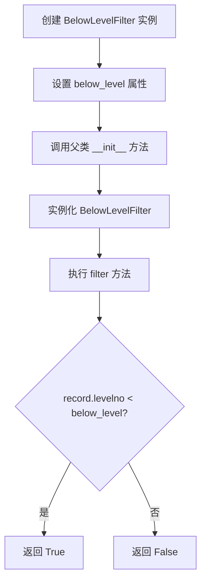
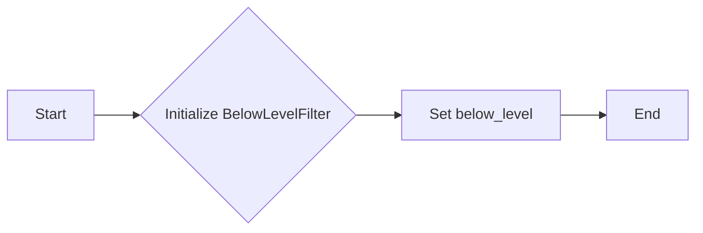
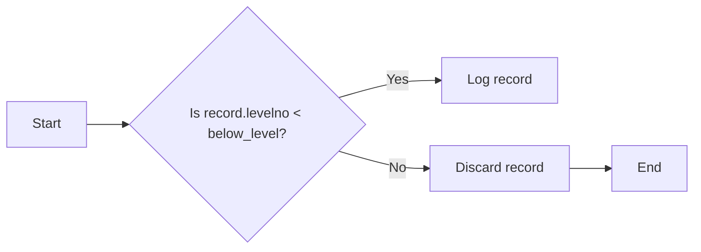

# `.\AutoGPT\autogpt_platform\autogpt_libs\autogpt_libs\logging\filters.py` 详细设计文档

The code defines a custom logging filter that filters out log records with levels below a specified threshold.

## 整体流程



## 类结构

```
BelowLevelFilter (类)
```

## 全局变量及字段


### `below_level`
    
The logging level threshold below which logs will be filtered out.

类型：`int`
    


### `BelowLevelFilter.below_level`
    
The logging level threshold below which logs will be filtered out.

类型：`int`
    
    

## 全局函数及方法


### BelowLevelFilter.__init__

This method initializes a new instance of the `BelowLevelFilter` class, setting the logging level threshold below which messages should be filtered.

参数：

- `below_level`：`int`，The logging level threshold below which messages should be filtered.

返回值：`None`，This method does not return a value.

#### 流程图



#### 带注释源码

```python
import logging

class BelowLevelFilter(logging.Filter):
    """Filter for logging levels below a certain threshold."""

    def __init__(self, below_level: int):
        # Call the constructor of the base class (logging.Filter)
        super().__init__()
        # Set the instance variable 'below_level' to the provided threshold
        self.below_level = below_level

    def filter(self, record: logging.LogRecord):
        # Check if the log record's level number is below the threshold
        return record.levelno < self.below_level
```


### BelowLevelFilter.filter

This method filters log records based on their logging level, only allowing records with a level below a specified threshold to be logged.

参数：

- `record`：`logging.LogRecord`，A log record containing the event message, its severity level, and other information.

返回值：`bool`，Returns `True` if the log record's level is below the threshold, otherwise `False`.

#### 流程图



#### 带注释源码

```python
import logging

class BelowLevelFilter(logging.Filter):
    """Filter for logging levels below a certain threshold."""

    def __init__(self, below_level: int):
        super().__init__()
        self.below_level = below_level

    def filter(self, record: logging.LogRecord):
        # Check if the log record's level is below the threshold
        return record.levelno < self.below_level
```


## 关键组件


### 张量索引与惰性加载

该代码中没有直接涉及张量索引与惰性加载的组件。

### 反量化支持

该代码中没有直接涉及反量化支持的组件。

### 量化策略

该代码中没有直接涉及量化策略的组件。


## 问题及建议


### 已知问题

-   {问题1}：代码中未包含对日志级别常量的引用，如`logging.DEBUG`或`logging.INFO`，这可能导致在代码外部难以理解`below_level`参数的具体含义。
-   {问题2}：`BelowLevelFilter`类仅实现了`filter`方法，但未提供任何配置或设置日志级别的方法，这限制了类的灵活性。

### 优化建议

-   {建议1}：在`BelowLevelFilter`类的文档字符串中明确指出`below_level`参数应与`logging`模块中的常量对应，例如`logging.DEBUG`或`logging.INFO`。
-   {建议2}：增加一个方法，如`set_level`，允许用户将`below_level`参数与`logging`模块中的常量关联，从而提高代码的可读性和灵活性。
-   {建议3}：考虑添加一个方法来设置或获取当前的过滤级别，以便用户可以动态地调整过滤条件。
-   {建议4}：如果该过滤器是作为日志配置的一部分，考虑将其集成到日志配置中，而不是作为单独的类实例，这样可以更好地与日志配置管理器协同工作。


## 其它


### 设计目标与约束

- 设计目标：实现一个日志过滤器，用于过滤掉低于特定级别的日志记录。
- 约束条件：过滤器必须能够处理不同级别的日志记录，并且能够灵活地设置过滤级别。

### 错误处理与异常设计

- 错误处理：在初始化过滤器时，如果传入的日志级别不是有效的日志级别，应抛出异常。
- 异常设计：使用Python内置的`ValueError`来处理无效的日志级别。

### 数据流与状态机

- 数据流：日志记录通过`filter`方法传递给过滤器，根据记录的级别与设定的阈值进行比较。
- 状态机：过滤器没有状态机，它是一个简单的条件判断逻辑。

### 外部依赖与接口契约

- 外部依赖：依赖于Python的`logging`模块。
- 接口契约：`BelowLevelFilter`类必须遵循`logging.Filter`类的接口契约，包括`filter`方法。


    