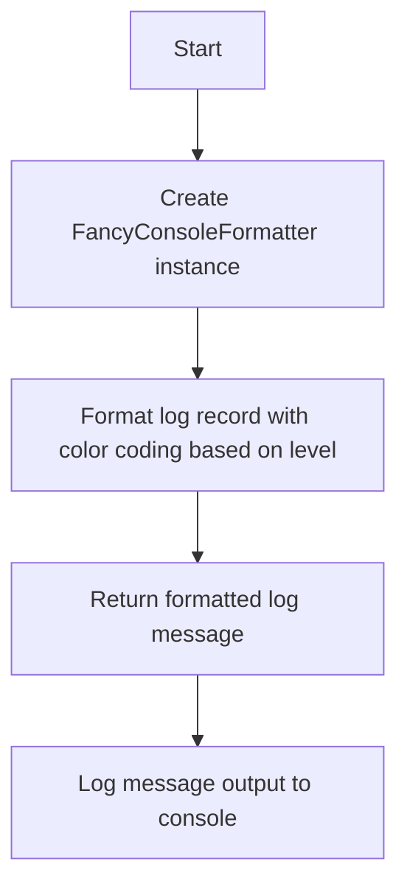
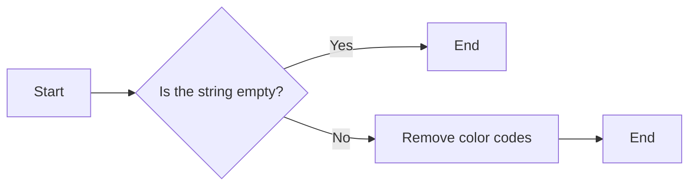
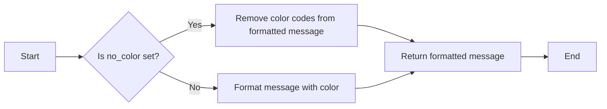

# `.\AutoGPT\autogpt_platform\autogpt_libs\autogpt_libs\logging\formatters.py` 详细设计文档

The code defines a custom logging formatter for console output that enhances standard logging with color coding based on log message levels.

## 整体流程



## 类结构

```
FancyConsoleFormatter (class)
├── AGPTFormatter (class, inherits from FancyConsoleFormatter)
```

## 全局变量及字段


### `Fore`
    
Module for colorama Fore class.

类型：`module`
    


### `Style`
    
Module for colorama Style class.

类型：`module`
    


### `logging`
    
Python standard logging module.

类型：`module`
    


### `remove_color_codes`
    
Function to remove color codes from a string.

类型：`function`
    


### `FancyConsoleFormatter.LEVEL_COLOR_MAP`
    
Dictionary mapping logging levels to color codes.

类型：`dict`
    


### `AGPTFormatter.no_color`
    
Flag indicating whether to disable color in the formatter output.

类型：`bool`
    


### `FancyConsoleFormatter.FancyConsoleFormatter.LEVEL_COLOR_MAP`
    
Dictionary mapping logging levels to color codes for console output.

类型：`dict`
    


### `AGPTFormatter.AGPTFormatter.no_color`
    
Flag to control whether color should be used in the formatter output.

类型：`bool`
    
    

## 全局函数及方法


### remove_color_codes

This function removes color codes from a given string.

参数：

- `text`: `str`，The string from which color codes should be removed.

返回值：`str`，The input string with color codes removed.

#### 流程图



#### 带注释源码

```python
def remove_color_codes(text: str) -> str:
    """
    Remove color codes from the given string.

    :param text: The string from which color codes should be removed.
    :return: The input string with color codes removed.
    """
    # Replace color codes with an empty string
    return text.replace(Fore.RED, "").replace(Style.RESET_ALL, "")
```


### FancyConsoleFormatter.format

This method is responsible for formatting log records for console output, enhancing the standard logging output with color coding based on the log message level.

参数：

- `record`：`logging.LogRecord`，The log record to be formatted.

返回值：`str`，The formatted log message.

#### 流程图

```mermaid
graph LR
A[Start] --> B{Is msg a string?}
B -- Yes --> C[Format msg with color if specified]
B -- No --> D[Convert msg to string]
C --> E[Format record with super()]
D --> E
E --> F[Return formatted message]
F --> G[End]
```

#### 带注释源码

```python
def format(self, record: logging.LogRecord) -> str:
    # Make sure `msg` is a string
    if not hasattr(record, "msg"):
        record.msg = ""
    elif type(record.msg) is not str:
        record.msg = str(record.msg)

    # Determine default color based on error level
    level_color = ""
    if record.levelno in self.LEVEL_COLOR_MAP:
        level_color = self.LEVEL_COLOR_MAP[record.levelno]
        record.levelname = f"{level_color}{record.levelname}{Style.RESET_ALL}"

    # Determine color for message
    color = getattr(record, "color", level_color)
    color_is_specified = hasattr(record, "color")

    # Don't color INFO messages unless the color is explicitly specified.
    if color and (record.levelno != logging.INFO or color_is_specified):
        record.msg = f"{color}{record.msg}{Style.RESET_ALL}"

    return super().format(record)
```


### AGPTFormatter.__init__

This method initializes an instance of the `AGPTFormatter` class, which is a subclass of `FancyConsoleFormatter`. It sets up the formatter with optional color coding based on the log level and allows for disabling color output.

参数：

- `*args`：`*args`，Variable length argument list passed to the parent class `FancyConsoleFormatter`.
- `**kwargs`：`**kwargs`，Variable length keyword argument list passed to the parent class `FancyConsoleFormatter`.
- `no_color`：`bool`，Optional boolean flag to disable color output. Defaults to `False`.

返回值：`None`，This method does not return a value.

#### 流程图

```mermaid
graph LR
A[AGPTFormatter.__init__] --> B{Pass *args and **kwargs to super().__init__}
B --> C{Set self.no_color to the value of no_color parameter}
C --> D{Return}
```

#### 带注释源码

```python
class AGPTFormatter(FancyConsoleFormatter):
    def __init__(self, *args, no_color: bool = False, **kwargs):
        # Call the constructor of the parent class with the provided arguments
        super().__init__(*args, **kwargs)
        
        # Set the no_color attribute based on the no_color parameter
        self.no_color = no_color
```


### AGPTFormatter.format

This method is a custom formatter for logging messages, enhancing the standard logging output with color coding based on the log message level. It also has the capability to strip color codes from messages to prevent color spoofing.

参数：

- `record`：`logging.LogRecord`，The log record to be formatted. This contains information about the log message, such as the message text, the logger name, the level, timestamp, etc.

返回值：`str`，The formatted log message as a string.

#### 流程图



#### 带注释源码

```python
def format(self, record: logging.LogRecord) -> str:
    # Make sure `msg` is a string
    if not hasattr(record, "msg"):
        record.msg = ""
    elif type(record.msg) is not str:
        record.msg = str(record.msg)

    # Strip color from the message to prevent color spoofing
    if record.msg and not getattr(record, "preserve_color", False):
        record.msg = remove_color_codes(record.msg)

    # Determine color for title
    title = getattr(record, "title", "")
    title_color = getattr(record, "title_color", "") or self.LEVEL_COLOR_MAP.get(
        record.levelno, ""
    )
    if title and title_color:
        title = f"{title_color + Style.BRIGHT}{title}{Style.RESET_ALL}"
    # Make sure record.title is set, and padded with a space if not empty
    record.title = f"{title} " if title else ""

    if self.no_color:
        return remove_color_codes(super().format(record))
    else:
        return super().format(record)
```


## 关键组件


### FancyConsoleFormatter

A custom logging formatter designed for console output with color coding based on the level of the log message.

### AGPTFormatter

A subclass of FancyConsoleFormatter that allows for disabling color output and stripping color codes from messages to prevent color spoofing.


## 问题及建议


### 已知问题

-   **颜色编码的潜在问题**：代码中使用了颜色编码来区分不同的日志级别，这可能会在不同终端或日志文件中导致颜色显示不一致，影响可读性。
-   **颜色编码的滥用**：在`AGPTFormatter`中，如果`no_color`参数为`True`，则所有颜色都会被移除，这可能导致日志消息在无色环境中难以区分。
-   **代码重复**：`format`方法在`FancyConsoleFormatter`和`AGPTFormatter`中都有实现，但`AGPTFormatter`中进行了额外的处理，这可能导致维护困难。

### 优化建议

-   **使用日志级别来控制颜色**：考虑使用日志级别来控制是否应用颜色编码，而不是使用`no_color`参数，这样可以在配置日志级别时统一控制颜色显示。
-   **提供更灵活的颜色配置**：允许用户自定义颜色编码，以便在不同环境中更好地适应。
-   **合并`format`方法**：将`FancyConsoleFormatter`和`AGPTFormatter`中的`format`方法合并，以减少代码重复，并简化维护。
-   **考虑日志消息的持久化**：在将日志消息写入文件时，应考虑移除颜色编码，以保持日志文件的一致性和可读性。


## 其它


### 设计目标与约束

- 设计目标：
  - 提供一个易于使用的日志记录格式化器，用于控制台输出。
  - 支持不同日志级别的颜色编码，以便于区分不同类型的日志消息。
  - 允许用户禁用颜色输出，以适应不同的环境需求。
- 约束：
  - 必须兼容Python标准库中的logging模块。
  - 应尽可能减少对第三方库的依赖。

### 错误处理与异常设计

- 错误处理：
  - 在格式化过程中，如果遇到无法处理的异常，应记录错误并返回默认的日志格式。
- 异常设计：
  - 使用try-except块捕获并处理可能发生的异常。

### 数据流与状态机

- 数据流：
  - 日志消息通过logging模块传递给FancyConsoleFormatter。
  - 格式化器根据日志级别和配置决定是否添加颜色。
  - 格式化后的日志消息返回给logging模块进行进一步处理。
- 状态机：
  - 无需状态机，因为格式化过程是线性的。

### 外部依赖与接口契约

- 外部依赖：
  - colorama库用于颜色编码。
  - logging库用于日志记录。
- 接口契约：
  - FancyConsoleFormatter和AGPTFormatter都继承自logging.Formatter。
  - FancyConsoleFormatter提供了format方法，用于格式化日志记录。
  - AGPTFormatter扩展了FancyConsoleFormatter，增加了颜色禁用和消息清理功能。


    