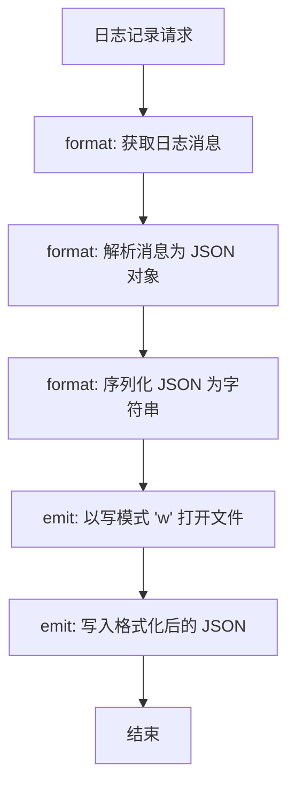
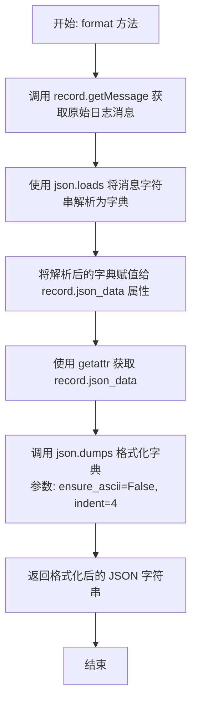
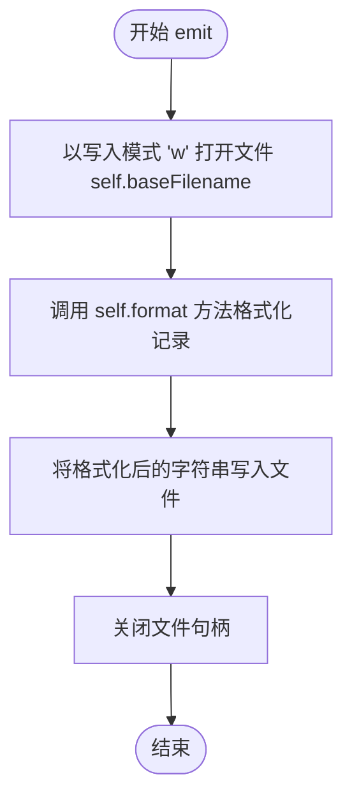

# `AutoGPT\autogpt_platform\autogpt_libs\autogpt_libs\logging\handlers.py` 详细设计文档

该代码实现了一个自定义的日志处理器 JsonFileHandler，继承自 logging.FileHandler，旨在将日志消息解析为 JSON 对象，并将其以格式化的 JSON 字符串形式写入文件，注意其 emit 方法使用 'w' 模式会覆盖文件内容。

## 整体流程



## 类结构

```
logging.FileHandler (Python 标准库)
└── JsonFileHandler
```

## 全局变量及字段


    

## 全局函数及方法


### `JsonFileHandler.format`

该方法重写了 `logging.Handler` 的格式化方法，用于将日志记录中的消息字符串解析为 JSON 对象，并将其重新格式化为带有缩进且支持 Unicode 字符的 JSON 字符串以便于阅读。

参数：

- `record`：`logging.LogRecord`，表示日志记录事件的对象，包含日志消息、级别、时间等信息。

返回值：`str`，格式化后的 JSON 字符串，已去除 ASCII 转义并包含缩进。

#### 流程图



#### 带注释源码

```python
def format(self, record: logging.LogRecord) -> str:
    # 从日志记录对象中获取消息字符串，并尝试将其解析为 JSON 对象（字典）
    record.json_data = json.loads(record.getMessage())
    
    # 获取刚刚解析并存储在 record 上的 json_data
    # 将其转储回 JSON 字符串，ensure_ascii=False 允许正常显示非 ASCII 字符（如中文）
    # indent=4 设置缩进为 4 个空格，使输出格式美观
    return json.dumps(getattr(record, "json_data"), ensure_ascii=False, indent=4)
```


### `JsonFileHandler.emit`

该方法负责将格式化后的日志记录输出到指定的文件中。它通过覆盖文件内容的方式将日志写入，确保数据以 JSON 格式持久化存储。

参数：

-  `record`：`logging.LogRecord`，表示需要被记录的日志记录对象，包含日志的所有相关信息。

返回值：`None`，无返回值。

#### 流程图



#### 带注释源码

```python
    def emit(self, record: logging.LogRecord) -> None:
        # 使用 'w' 模式打开基础文件名对应的文件，编码设置为 utf-8
        # 注意：此处使用 'w' 模式意味着每次调用 emit 都会覆盖原文件内容，
        # 这通常用于只保留最新一条日志的场景，如果是追加日志通常应为 'a'。
        with open(self.baseFilename, "w", encoding="utf-8") as f:
            # 调用 format 方法将 record 转换为格式化的字符串（此处为 JSON 字符串）
            # 并将结果写入文件
            f.write(self.format(record))
```


## 关键组件


### 日志格式化
将日志记录的消息解析为 JSON 对象，并将其重新序列化为带有缩进的 JSON 字符串以便于阅读。

### 文件写入处理
覆盖默认的日志发送逻辑，以写入模式打开目标文件并将格式化后的 JSON 内容写入文件。


## 问题及建议


### 已知问题

-   日志内容丢失风险：`emit` 方法中打开文件使用的是 `'w'` (写入) 模式，这会导致每次调用日志记录时文件被**截断（清空）并重写**。结果是该文件中永远只会保留最后一条日志记录，严重违背了日志文件应当持久化和追加记录的基本原则。
-   缺乏异常安全性：`format` 方法中直接调用 `json.loads()` 解析消息内容。如果用户传入的日志消息不是合法的 JSON 字符串，会抛出 `json.JSONDecodeError`。这将导致日志流程中断，且由于缺乏异常捕获，可能导致上层应用受影响。
-   性能与并发隐患：重写 `emit` 方法并在其中执行 `with open(...)` 手动操作文件，绕过了父类 `logging.FileHandler` 内置的文件流管理、缓冲机制以及线程锁。这会导致频繁打开和关闭文件句柄，极大地降低 I/O 性能，且在多线程环境下可能引发文件访问冲突。

### 优化建议

-   修正文件写入逻辑：强烈建议删除自定义的 `emit` 方法，仅保留对 `format` 方法的重写。让父类 `FileHandler` 负责文件的打开、追加写入（默认为追加模式）和关闭，从而修复日志覆盖问题并复用成熟的 I/O 处理机制。
-   增加解析容错处理：在 `format` 方法中为 `json.loads()` 添加 `try-except` 块。当解析失败时，不应抛出异常，而应回退策略，例如将原始消息封装进一个字典结构中，或者返回包含错误信息的标准 JSON，确保日志系统健壮性。
-   优化日志存储格式：建议移除 `json.dumps` 中的 `indent=4` 参数。紧凑的 JSON 格式（无缩进）能显著减少磁盘占用和 I/O 带宽消耗，更适合生产环境的高频日志记录。如果必须阅读，可使用外部工具格式化。
-   参数化配置：将 `ensure_ascii` 等格式化参数提取为类的初始化参数（`__init__`），以便在实例化 Handler 时灵活配置，而不是硬编码在方法内部。


## 其它


### 设计目标与约束

1.  **设计目标**：
    *   提供一个结构化的日志处理器，将日志消息以格式化的 JSON 形式存储，便于日志解析工具（如 ELK、Splunk）读取和分析。
    *   确保输出的 JSON 文件具有良好的可读性（通过 `indent=4`）和 UTF-8 编码支持（`ensure_ascii=False`）。

2.  **约束条件**：
    *   **输入约束**：调用方传入的日志消息（`record.getMessage()` 的结果）必须是符合 JSON 规范的字符串，否则会导致解析失败。
    *   **文件模式约束**：当前实现固定使用覆盖模式（`"w"`），这意味着每次日志记录都会重写整个文件，导致仅保留最后一条日志记录（这与通常的日志追加需求相悖）。

### 错误处理与异常设计

1.  **数据解析异常**：
    *   在 `format` 方法中，如果日志消息不是合法的 JSON 字符串，`json.loads()` 将抛出 `json.JSONDecodeError`。
    *   当前代码未显式捕获此异常，该异常将向上传递至 logging 模块的 `handleError` 机制，可能导致日志记录中断或程序崩溃，具体取决于全局日志配置。

2.  **IO 异常**：
    *   在 `emit` 方法中，文件打开和写入操作可能因权限不足、磁盘已满或路径错误抛出 `IOError` 或 `OSError`。
    *   当前代码未包含 `try-except` 块来处理文件操作异常，未实现重试机制或降级处理，直接依赖于 Python logging 框架的默认错误处理逻辑。

### 外部依赖与接口契约

1.  **外部依赖**：
    *   **Python 标准库 `logging`**：核心日志框架，`JsonFileHandler` 继承自 `logging.FileHandler`。
    *   **Python 标准库 `json`**：用于日志消息的反序列化和序列化处理。

2.  **接口契约**：
    *   **继承契约**：必须实现 `logging.Handler` 的接口规范，主要是 `format(self, record)` 和 `emit(self, record)` 方法。
    *   **数据契约**：输入的 `logging.LogRecord` 对象中的 `message` 属性必须是一个可被 `json.loads` 解析的字符串。输出结果必须是一个写入到 `self.baseFilename` 的 JSON 格式字符串。

### 数据流

1.  **输入阶段**：
    *   调用方生成日志记录，`logging.LogRecord` 对象被创建，其中包含格式化前的消息字符串。
2.  **处理阶段**：
    *   `format` 方法被调用：原始消息字符串 -> `json.loads` -> Python 字典对象 -> `json.dumps` -> 格式化后的 JSON 字符串。
    *   `emit` 方法被调用：接收格式化后的字符串。
3.  **输出阶段**：
    *   打开目标日志文件（模式为 `"w"`，覆盖写入）。
    *   将 JSON 字符串写入文件并关闭文件句柄。

### 并发与性能考量

1.  **性能瓶颈**：
    *   `emit` 方法在每次记录日志时都会执行 `open(..., "w")` 操作。频繁的文件打开和关闭会带来显著的 I/O 开销，严重影响高频日志场景下的性能。
    *   `format` 方法中进行了两次序列化/反序列化操作（`loads` 和 `dumps`），增加了 CPU 消耗。

2.  **并发安全性**：
    *   虽然继承自 `FileHandler`，但当前 `emit` 的实现通过手动 `open` 绕过了父类的流管理和锁机制。在多线程或多进程环境下，多个线程同时触发日志记录可能导致文件内容竞争，由于使用了覆盖模式（`"w"`），极大概率导致日志数据丢失或文件损坏。
    