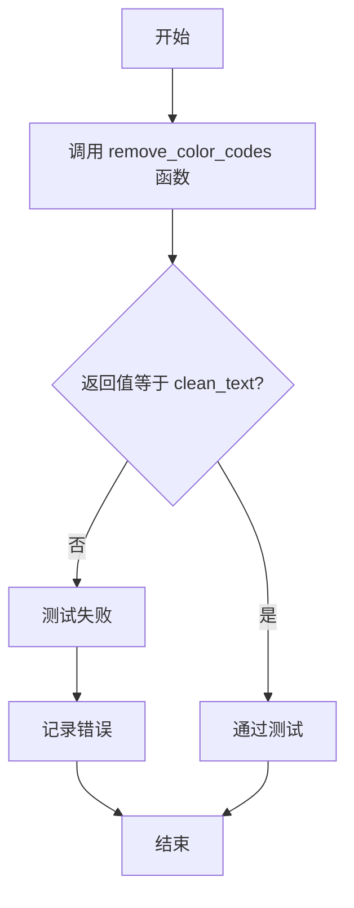

# `.\AutoGPT\autogpt_platform\autogpt_libs\autogpt_libs\logging\test_utils.py` 详细设计文档

The code removes color codes from given text strings, ensuring that the output text is free of ANSI escape sequences.

## 整体流程



## 类结构

```
pytest (测试框架)
├── test_remove_color_codes (测试函数)
│   ├── raw_text (输入文本)
│   ├── clean_text (预期输出文本)
│   └── remove_color_codes (被测试函数)
```

## 全局变量及字段


### `pytest`
    
Python testing framework that makes it easier to write simple tests even more readable and maintainable.

类型：`module`
    


### `remove_color_codes`
    
Function to remove color codes from a given string.

类型：`function`
    


    

## 全局函数及方法


### test_remove_color_codes

测试 `remove_color_codes` 函数是否正确移除了文本中的颜色代码。

参数：

- `raw_text`：`str`，包含颜色代码的原始文本
- `clean_text`：`str`，移除颜色代码后的预期文本

返回值：无

#### 流程图

```mermaid
graph TD
    A[Start] --> B[Call remove_color_codes(raw_text)]
    B --> C[Assert remove_color_codes(raw_text) == clean_text]
    C --> D[End]
```

#### 带注释源码

```python
import pytest

from .utils import remove_color_codes

@pytest.mark.parametrize(
    "raw_text, clean_text",
    [
        (
            "COMMAND = \x1b[36mbrowse_website\x1b[0m  "
            "ARGUMENTS = \x1b[36m{'url': 'https://www.google.com',"
            " 'question': 'What is the capital of France?'}\x1b[0m",
            "COMMAND = browse_website  "
            "ARGUMENTS = {'url': 'https://www.google.com',"
            " 'question': 'What is the capital of France?'}",
        ),
        (
            "{'Schaue dir meine Projekte auf github () an, als auch meine Webseiten': "
            "'https://github.com/Significant-Gravitas/AutoGPT,"
            " https://discord.gg/autogpt und https://twitter.com/Auto_GPT'}",
            "{'Schaue dir meine Projekte auf github () an, als auch meine Webseiten': "
            "'https://github.com/Significant-Gravitas/AutoGPT,"
            " https://discord.gg/autogpt und https://twitter.com/Auto_GPT'}",
        ),
        ("", ""),
        ("hello", "hello"),
        ("hello\x1b[31m world", "hello world"),
        ("\x1b[36mHello,\x1b[32m World!", "Hello, World!"),
        (
            "\x1b[1m\x1b[31mError:\x1b[0m\x1b[31m file not found",
            "Error: file not found",
        ),
    ],
)
def test_remove_color_codes(raw_text, clean_text):
    assert remove_color_codes(raw_text) == clean_text
```


## 关键组件


### 张量索引与惰性加载

张量索引与惰性加载是深度学习框架中用于高效处理大型数据集的关键技术，它允许在需要时才计算数据，从而减少内存消耗和提高计算效率。

### 反量化支持

反量化支持是深度学习模型优化中的一个重要特性，它允许模型在量化过程中保持较高的精度，从而在降低模型大小和计算量的同时，保持模型性能。

### 量化策略

量化策略是深度学习模型压缩技术的一部分，它通过将模型中的浮点数权重转换为低精度整数来减少模型大小和计算需求，同时保持可接受的性能损失。


## 问题及建议


### 已知问题

-   {问题1}：代码中使用了`pytest`的`parametrize`装饰器进行测试，但测试用例中的`raw_text`和`clean_text`值是硬编码的，这可能导致测试不够全面，无法覆盖所有可能的输入情况。
-   {问题2}：`remove_color_codes`函数的实现细节没有在代码中展示，无法评估其效率和正确性。

### 优化建议

-   {建议1}：扩展测试用例，包括更多不同类型的输入，例如包含更多颜色代码、特殊字符、空字符串等，以确保`remove_color_codes`函数能够处理各种情况。
-   {建议2}：在代码中实现`remove_color_codes`函数，并展示其逻辑，以便进行性能和正确性的评估。
-   {建议3}：考虑使用正则表达式来匹配和移除颜色代码，这通常比逐字符检查更高效。
-   {建议4}：如果`remove_color_codes`函数是用于处理用户输入，应考虑添加异常处理来确保程序的健壮性。
-   {建议5}：如果该代码是库的一部分，应提供文档说明如何使用`remove_color_codes`函数，以及它的限制和假设。


## 其它


### 设计目标与约束

- 设计目标：确保代码能够有效地去除文本中的颜色代码，同时保持文本的原始格式和内容。
- 约束条件：代码应尽可能简洁，避免引入不必要的复杂性，同时要保证测试覆盖率。

### 错误处理与异常设计

- 错误处理：代码中未直接处理异常，但通过断言确保`remove_color_codes`函数的输出符合预期。
- 异常设计：未设计特定的异常处理机制，因为函数的预期行为是处理字符串并返回结果。

### 数据流与状态机

- 数据流：输入为包含颜色代码的文本，输出为去除颜色代码后的文本。
- 状态机：无状态机设计，函数直接处理输入并返回结果。

### 外部依赖与接口契约

- 外部依赖：依赖于`pytest`库进行测试。
- 接口契约：`remove_color_codes`函数接受一个字符串参数并返回一个字符串结果。

### 测试用例

- 测试用例涵盖了多种包含和不含颜色代码的文本情况，包括空字符串、普通文本、包含颜色代码的文本等。

### 代码覆盖率

- 代码覆盖率：测试用例应覆盖所有可能的输入情况，确保代码的健壮性。

### 性能考量

- 性能考量：代码应尽可能高效，避免不必要的计算和内存使用。

### 安全性考量

- 安全性考量：代码应避免执行任何可能的安全风险，如注入攻击等。

### 维护与扩展性

- 维护：代码应易于维护，遵循良好的编程实践。
- 扩展性：代码应易于扩展，以便在未来添加新的功能或改进现有功能。

### 代码风格与规范

- 代码风格：代码应遵循Python的PEP 8风格指南。
- 规范：代码应遵循项目内部编码规范。


    