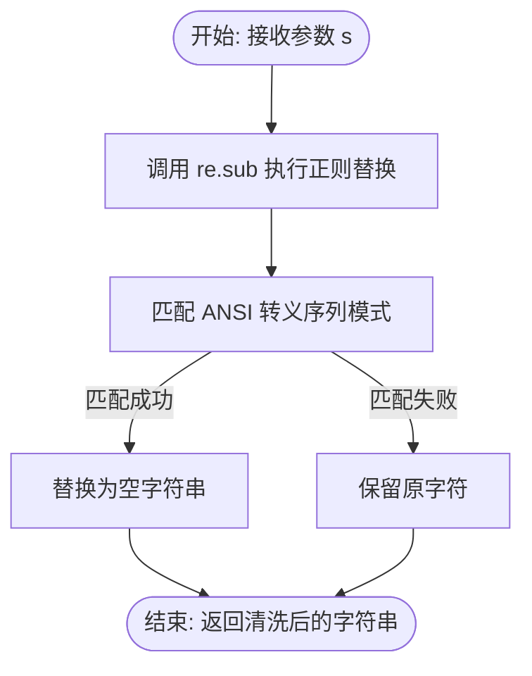
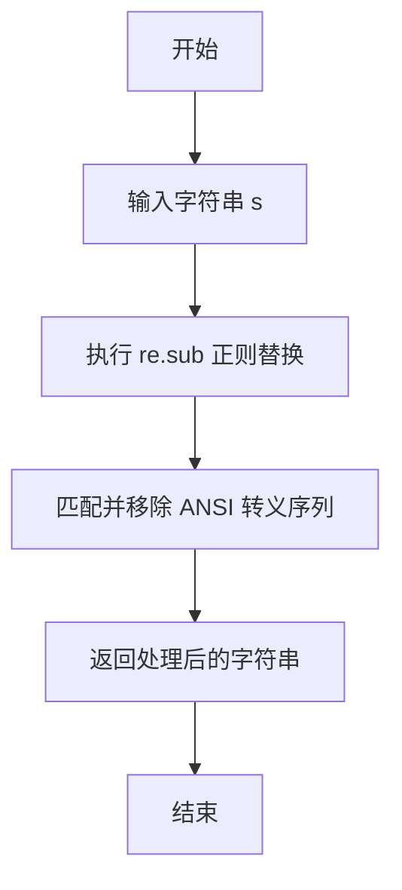

# `AutoGPT\autogpt_platform\autogpt_libs\autogpt_libs\logging\utils.py` 详细设计文档

该代码提供了一个文本处理工具函数，通过正则表达式识别并移除字符串中的 ANSI 转义序列（即终端控制字符，如颜色代码），从而实现对包含格式控制符的文本进行清洗，输出纯文本内容。

## 整体流程



## 类结构

```
Module (string_utils.py)
└── remove_color_codes (全局函数)
```

## 全局变量及字段


    

## 全局函数及方法


### `remove_color_codes`

该函数用于从输入字符串中移除ANSI转义码（通常用于控制终端的颜色和样式）。

参数：

- `s`：`str`，需要处理的原字符串，可能包含ANSI颜色代码。

返回值：`str`，移除ANSI转义码后的纯净字符串。

#### 流程图



#### 带注释源码

```python
import re

def remove_color_codes(s: str) -> str:
    """
    从字符串中移除 ANSI 转义序列（颜色代码）。
    
    参数:
        s (str): 可能包含 ANSI 颜色代码的原始字符串。
        
    返回:
        str: 已移除颜色代码的字符串。
    """
    # 正则表达式解释:
    # \x1B        : 匹配转义字符 (Escape character)
    # (?: ... )   : 非捕获组
    # [@-Z\\-_]   : 匹配 2 字节序列中的特定字节范围
    # |           : 或逻辑
    # \[          : 匹配 CSI (Control Sequence Introducer) 序列的起始字符 [
    # [0-?]*      : 匹配参数字节 (如颜色代码数字)
    # [ -/]*      : 匹配中间字节
    # [@-~]       : 匹配终结字节
    # 将匹配到的上述模式替换为空字符串 ""
    return re.sub(r"\x1B(?:[@-Z\\-_]|\[[0-?]*[ -/]*[@-~])", "", s)
```


## 关键组件


### ANSI 转义码移除逻辑
负责从输入字符串中识别并去除 ANSI 转义序列（如终端颜色代码）的功能模块。


## 问题及建议


### 已知问题

-   每次调用函数时都会重新编译正则表达式，导致在高频调用场景下产生不必要的性能开销。
-   代码缺少文档字符串，未说明函数的具体用途、参数含义及返回值细节，不利于代码维护。
-   当前的正则表达式主要针对 CSI（控制序列引导符）序列进行了匹配，可能无法覆盖所有类型的 ANSI 转义码（例如 OSC 操作系统命令），存在边缘情况清理不彻底的风险。

### 优化建议

-   使用 `re.compile` 在模块加载时预编译正则表达式，并将其存储在全局变量中，以消除重复编译的开销。
-   添加标准的 Docstring，详细描述函数功能、参数类型、返回值类型及异常处理情况。
-   如果场景对终端兼容性要求极高，建议引入成熟的第三方库（如 `colorama` 或 `strip-ansi`）替代手动正则匹配；否则应增强正则表达式以支持更广泛的 ANSI 转义序列标准。


## 其它


### 设计目标与约束

**设计目标**：
该函数的核心目标是提供一种高效、可靠的方法来清洗字符串，移除其中包含的 ANSI 转义序列（如终端颜色代码、光标移动指令等），使其适用于日志记录或纯文本显示等场景。

**约束**：
1.  **输入约束**：函数仅接受 Python `str` 类型的输入。对于 `bytes` 或其他类型，底层库可能会抛出异常。
2.  **兼容性约束**：依赖 Python 内置的 `re` 模块，无需安装第三方库，但在处理非标准或极其复杂的转义序列时可能存在覆盖率限制。
3.  **不可变性**：遵循字符串不可变原则，该函数不会修改原始字符串，而是返回一个新的字符串对象。
4.  **正则表达式限制**：当前的正则表达式主要针对 CSI (Control Sequence Introducer) 序列和简单的 ESC 序列进行优化，可能无法覆盖所有厂商的私有转义码。

### 错误处理与异常设计

该函数采用**显式传递策略**，即不包含内部的 `try-except` 异常捕获块，将错误处理的责任交给调用方。

1.  **类型错误**：如果传入的参数 `s` 不是字符串类型（例如 `None`、`int` 或 `list`），底层的 `re.sub` 函数将抛出 `TypeError`。函数设计上允许此异常向上冒泡，以便调用方发现数据类型错误。
2.  **内存错误**：在处理极大字符串时，如果内存不足，Python 解释器将抛出 `MemoryError`，函数本身不对此做特殊处理。
3.  **正则异常**：由于正则表达式模式是硬编码的常量，不存在运行时编译错误的风险（`re.error` 仅在编译时发生，因此此处不会触发）。

### 数据流

由于该函数是无状态的纯函数，数据流是线性的且没有复杂的内部状态转换：

1.  **输入阶段**：外部调用者传入包含潜在 ANSI 转义码的原始字符串 `s`。
2.  **处理阶段**：
    *   `re.sub` 模块接收输入字符串和预定义的正则模式。
    *   正则引擎遍历字符串，识别以 `\x1B` (ESC) 开头的控制序列。
    *   匹配到的子串被替换为空字符串 `""`。
3.  **输出阶段**：生成一个新的、已移除控制序列的字符串，并返回给调用者。

*(注：本函数不涉及复杂的状态机，状态转换逻辑封装在 `re` 模块的正则引擎内部。)*

### 外部依赖与接口契约

**外部依赖**：
*   **Python 标准库 `re`**：用于执行正则表达式替换操作。

**接口契约**：

*   **前置条件**：
    *   参数 `s` 必须为 `str` 类型。
    *   参数 `s` 应为有效的 Python 字符串编码（通常是 UTF-8 或 Unicode）。

*   **后置条件**：
    *   返回值必定是一个 `str` 类型的实例。
    *   返回的字符串中将不包含匹配正则表达式 `\x1B(?:[@-Z\\-_]|\[[0-?]*[ -/]*[@-~])` 的任何子序列。

*   **副作用**：
    *   无。该函数不修改全局变量，不进行 I/O 操作，也不改变输入参数的状态。

### 性能分析

1.  **时间复杂度**：$O(N)$，其中 $N$ 是输入字符串的长度。`re.sub` 需要遍历整个字符串一次来进行模式匹配和替换。
2.  **空间复杂度**：$O(N)$。由于 Python 字符串的不可变性，必须分配新的内存来存储处理后的结果字符串。
3.  **正则效率**：使用的正则表达式包含回溯控制，但在绝大多数常见文本情况下性能表现良好。对于超大规模文本处理，建议分块处理以避免峰值内存占用。


    