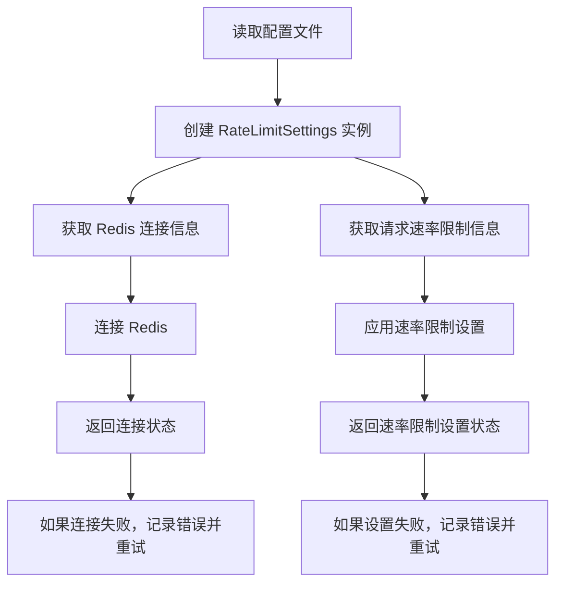
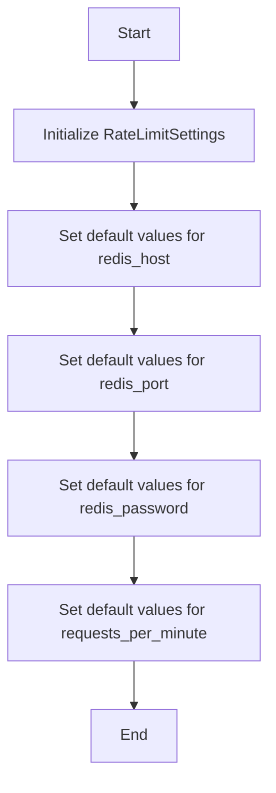
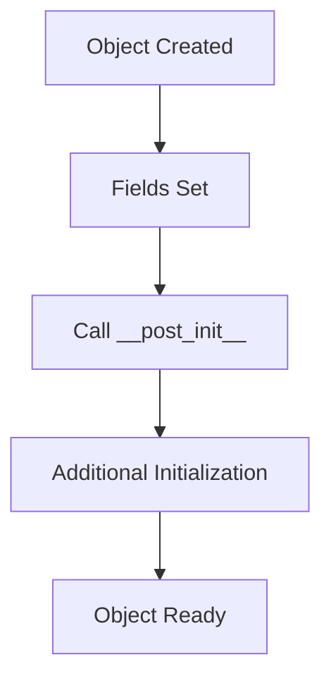

# `.\AutoGPT\autogpt_platform\autogpt_libs\autogpt_libs\rate_limit\config.py` 详细设计文档

This code defines a configuration class for rate limit settings, including Redis connection details and rate limit parameters.

## 整体流程



## 类结构

```
RateLimitSettings (配置类)
```

## 全局变量及字段


### `RATE_LIMIT_SETTINGS`
    
The global instance of RateLimitSettings class containing rate limit configuration parameters.

类型：`RateLimitSettings`
    


### `RateLimitSettings.redis_host`
    
The Redis host address.

类型：`str`
    


### `RateLimitSettings.redis_port`
    
The Redis port number.

类型：`str`
    


### `RateLimitSettings.redis_password`
    
The password for Redis authentication, if any.

类型：`Optional[str]`
    


### `RateLimitSettings.requests_per_minute`
    
The maximum number of requests allowed per minute per API key.

类型：`int`
    
    

## 全局函数及方法


### RateLimitSettings.__init__

This method initializes the `RateLimitSettings` class, setting default values for various Redis configuration parameters and rate limit settings.

参数：

- `redis_host`：`str`，The Redis host address. Defaults to "redis://localhost:6379".
- `redis_port`：`str`，The Redis port number. Defaults to "6379".
- `redis_password`：`Optional[str]`，The Redis password. Defaults to None.
- `requests_per_minute`：`int`，The maximum number of requests allowed per minute per API key. Defaults to 60.

返回值：`None`，This method does not return any value.

#### 流程图



#### 带注释源码

```
from pydantic import Field
from pydantic_settings import BaseSettings, SettingsConfigDict

class RateLimitSettings(BaseSettings):
    redis_host: str = Field(
        default="redis://localhost:6379",
        description="Redis host",
        validation_alias="REDIS_HOST",
    )

    redis_port: str = Field(
        default="6379", description="Redis port", validation_alias="REDIS_PORT"
    )

    redis_password: Optional[str] = Field(
        default=None,
        description="Redis password",
        validation_alias="REDIS_PASSWORD",
    )

    requests_per_minute: int = Field(
        default=60,
        description="Maximum number of requests allowed per minute per API key",
        validation_alias="RATE_LIMIT_REQUESTS_PER_MINUTE",
    )

    model_config = SettingsConfigDict(case_sensitive=True, extra="ignore")

RATE_LIMIT_SETTINGS = RateLimitSettings()
```


### RateLimitSettings.__post_init__

The `__post_init__` method is a special method in Python classes that is called after the object is created but before it is returned to the caller. It is used to perform any additional initialization that needs to be done after the object's fields have been set.

参数：

- 无参数

返回值：无返回值

#### 流程图



#### 带注释源码

```
from pydantic import Field
from pydantic_settings import BaseSettings, SettingsConfigDict

class RateLimitSettings(BaseSettings):
    redis_host: str = Field(
        default="redis://localhost:6379",
        description="Redis host",
        validation_alias="REDIS_HOST",
    )

    redis_port: str = Field(
        default="6379", description="Redis port", validation_alias="REDIS_PORT"
    )

    redis_password: Optional[str] = Field(
        default=None,
        description="Redis password",
        validation_alias="REDIS_PASSWORD",
    )

    requests_per_minute: int = Field(
        default=60,
        description="Maximum number of requests allowed per minute per API key",
        validation_alias="RATE_LIMIT_REQUESTS_PER_MINUTE",
    )

    model_config = SettingsConfigDict(case_sensitive=True, extra="ignore")

    def __post_init__(self):
        # This method is called after the object's fields have been set.
        # Here, you can perform any additional initialization that is needed.
        # For example, you might want to validate the fields or set default values.
        pass

RATE_LIMIT_SETTINGS = RateLimitSettings()
```

### 类字段

- `redis_host`: `str`，Redis host address
- `redis_port`: `str`，Redis port number
- `redis_password`: `Optional[str]`，Optional Redis password
- `requests_per_minute`: `int`，Maximum number of requests allowed per minute per API key

### 全局变量

- `RATE_LIMIT_SETTINGS`: `RateLimitSettings`，The instance of `RateLimitSettings` class

### 潜在的技术债务或优化空间

- The `__post_init__` method is currently empty and does not perform any additional initialization. This method could be used to validate the fields or set default values based on certain conditions.
- The class could be extended to include more settings related to rate limiting, such as different limits for different API keys or different time periods.
- The class could be refactored to use inheritance from a more general settings class if there are other settings classes with similar functionality.
```

## 关键组件


### 张量索引与惰性加载

张量索引与惰性加载是处理大型数据集时常用的技术，它允许在需要时才加载数据的一部分，从而减少内存消耗和提高效率。

### 反量化支持

反量化支持是指系统对量化操作的反向操作的支持，即能够从量化后的模型中恢复出原始的未量化模型。

### 量化策略

量化策略是指将浮点数模型转换为低精度定点数模型的方法，以提高模型的运行效率。


## 问题及建议


### 已知问题

-   **配置硬编码**: `RateLimitSettings` 类中的配置项如 `redis_host`、`redis_port` 和 `redis_password` 默认值是硬编码的，这可能导致在生产环境中需要更改配置时需要修改代码。
-   **缺乏环境区分**: 代码中没有区分不同环境（如开发、测试、生产）的配置，这可能导致配置不一致或错误。
-   **缺乏配置验证**: 代码中没有对配置进行验证，例如检查端口是否有效，Redis URL格式是否正确等。

### 优化建议

-   **使用环境变量**: 将配置项的默认值改为从环境变量中获取，这样可以在不同环境中使用不同的配置而无需修改代码。
-   **配置文件**: 使用配置文件来管理不同环境的配置，例如使用 `.env` 文件或 JSON/YAML 配置文件。
-   **配置验证**: 在设置配置之前添加验证逻辑，确保配置项的值是有效的。
-   **日志记录**: 添加日志记录，以便在配置错误或异常时能够追踪问题。
-   **文档化**: 为配置项提供详细的文档说明，包括每个配置项的作用、默认值和可能的值范围。


## 其它


### 设计目标与约束

- 设计目标：提供一种配置Redis连接和API速率限制的机制。
- 约束：使用Pydantic库进行数据验证，确保配置的健壮性。

### 错误处理与异常设计

- 错误处理：在配置字段验证失败时，抛出Pydantic的`ValidationError`异常。
- 异常设计：确保所有外部依赖（如Redis）的错误都被捕获并适当处理。

### 数据流与状态机

- 数据流：配置从环境变量或默认值加载，并通过Pydantic进行验证。
- 状态机：无状态机，配置加载后即使用。

### 外部依赖与接口契约

- 外部依赖：Redis客户端库。
- 接口契约：通过Pydantic的`BaseSettings`类定义配置接口。


    