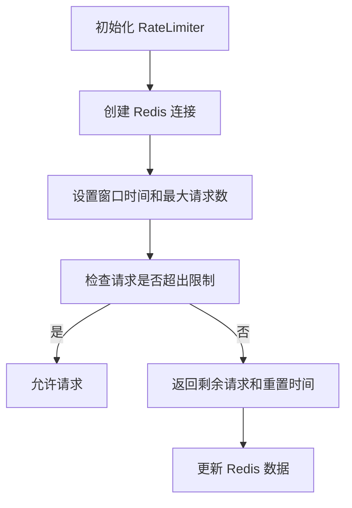
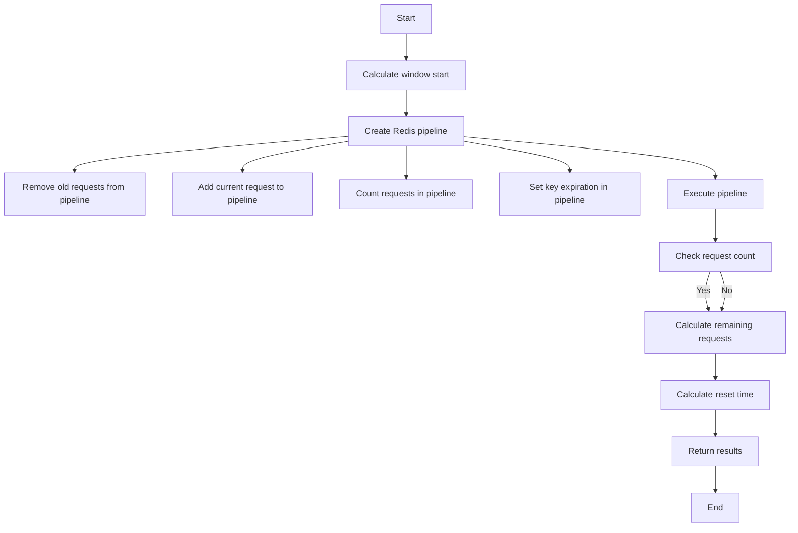

# `.\AutoGPT\autogpt_platform\autogpt_libs\autogpt_libs\rate_limit\limiter.py` 详细设计文档

The RateLimiter class is designed to enforce rate limiting on API requests using Redis as a backend to track request counts.

## 整体流程



## 类结构

```
RateLimiter (类)
```

## 全局变量及字段


### `RATE_LIMIT_SETTINGS`
    
Contains configuration settings for the rate limiter, such as Redis host, port, password, and rate limit per minute.

类型：`dict`
    


### `RateLimiter.redis_host`
    
The Redis host address for the connection.

类型：`str`
    


### `RateLimiter.redis_port`
    
The Redis port number for the connection.

类型：`str`
    


### `RateLimiter.redis_password`
    
The password for the Redis connection, if any.

类型：`str | None`
    


### `RateLimiter.requests_per_minute`
    
The maximum number of requests allowed per minute for the API key.

类型：`int`
    


### `RateLimiter.redis`
    
The Redis client instance used for rate limiting operations.

类型：`Redis`
    


### `RateLimiter.window`
    
The time window in seconds for rate limiting.

类型：`int`
    


### `RateLimiter.max_requests`
    
The maximum number of requests allowed within the time window.

类型：`int`
    
    

## 全局函数及方法


### RateLimiter.__init__

初始化RateLimiter类，配置Redis连接参数和速率限制设置。

参数：

- `redis_host`：`str`，Redis服务器的地址。
- `redis_port`：`str`，Redis服务器的端口。
- `redis_password`：`str | None`，Redis服务器的密码，可选。
- `requests_per_minute`：`int`，每分钟允许的最大请求次数。

返回值：无

#### 流程图

```mermaid
classDiagram
    RateLimiter <|-- Redis
    RateLimiter {
        +redis_host: str
        +redis_port: str
        +redis_password: str | None
        +requests_per_minute: int
        +redis: Redis
        +window: int
        +max_requests: int
        +__init__(redis_host: str, redis_port: str, redis_password: str | None, requests_per_minute: int)
    }
    Redis {
        +host: str
        +port: int
        +password: str
        +decode_responses: bool
        +__init__(host: str, port: int, password: str, decode_responses: bool)
    }
```

#### 带注释源码

```python
import time
from typing import Tuple

from redis import Redis

from .config import RATE_LIMIT_SETTINGS


class RateLimiter:
    def __init__(
        self,
        redis_host: str = RATE_LIMIT_SETTINGS.redis_host,
        redis_port: str = RATE_LIMIT_SETTINGS.redis_port,
        redis_password: str | None = RATE_LIMIT_SETTINGS.redis_password,
        requests_per_minute: int = RATE_LIMIT_SETTINGS.requests_per_minute,
    ):
        # Initialize Redis connection
        self.redis = Redis(
            host=redis_host,
            port=int(redis_port),
            password=redis_password,
            decode_responses=True,
        )
        # Set the window size for rate limiting
        self.window = 60
        # Set the maximum number of requests allowed per minute
        self.max_requests = requests_per_minute
```


### RateLimiter.check_rate_limit

Check if a request is within the rate limits for a given API key.

参数：

- `api_key_id`：`str`，The API key identifier to check. This is used to identify the rate limit for a specific API key.

返回值：`Tuple[bool, int, int]`，A tuple containing three elements:
- `bool` indicating whether the request is allowed.
- `int` representing the number of remaining requests within the rate limit window.
- `int` representing the reset time in seconds for the rate limit window.

#### 流程图



#### 带注释源码

```python
async def check_rate_limit(self, api_key_id: str) -> Tuple[bool, int, int]:
    """
    Check if request is within rate limits.

    Args:
        api_key_id: The API key identifier to check

    Returns:
        Tuple of (is_allowed, remaining_requests, reset_time)
    """
    now = time.time()
    window_start = now - self.window
    key = f"ratelimit:{api_key_id}:1min"

    pipe = self.redis.pipeline()
    pipe.zremrangebyscore(key, 0, window_start)  # Remove old requests
    pipe.zadd(key, {str(now): now})  # Add current request
    pipe.zcount(key, window_start, now)  # Count requests
    pipe.expire(key, self.window)  # Set key expiration

    _, _, request_count, _ = pipe.execute()

    remaining = max(0, self.max_requests - request_count)
    reset_time = int(now + self.window)

    return request_count <= self.max_requests, remaining, reset_time
```


## 关键组件


### 张量索引与惰性加载

张量索引与惰性加载是处理大型数据集时常用的技术，它允许在需要时才加载数据的一部分，从而减少内存消耗和提高效率。

### 反量化支持

反量化支持是指系统在处理数据时，能够根据数据的特点和需求，灵活地调整量化策略，以优化性能和资源使用。

### 量化策略

量化策略是指对数据或模型进行量化处理的方法，它可以将高精度数据转换为低精度数据，以减少计算量和存储需求。


## 问题及建议


### 已知问题

-   {问题1}：代码中使用了 `redis` 库的 `Redis` 类，但没有处理可能的连接异常或连接断开的情况。
-   {问题2}：`check_rate_limit` 方法是异步的，但使用了同步的 `redis` 操作，这可能导致性能瓶颈。
-   {问题3}：`check_rate_limit` 方法中使用了 `zremrangebyscore` 和 `zadd` 操作，这些操作可能会对性能有影响，特别是在高并发场景下。
-   {问题4}：代码中没有对 `api_key_id` 参数进行验证，如果传入无效的 `api_key_id`，可能会导致错误。

### 优化建议

-   {建议1}：增加异常处理，确保在连接 Redis 时能够处理异常情况。
-   {建议2}：考虑使用异步 Redis 客户端，如 `aioredis`，以支持异步操作，提高性能。
-   {建议3}：优化 Redis 操作，例如使用 `pipeline` 来减少网络往返次数。
-   {建议4}：在 `check_rate_limit` 方法中添加对 `api_key_id` 的验证逻辑，确保其有效性。
-   {建议5}：考虑使用缓存策略，减少对 Redis 的直接访问，提高系统性能。
-   {建议6}：对代码进行单元测试，确保在各种情况下都能正常工作。


## 其它


### 设计目标与约束

- 设计目标：实现一个基于Redis的API请求速率限制器，以防止滥用和保护系统资源。
- 约束条件：使用Redis作为后端存储，确保高可用性和性能。

### 错误处理与异常设计

- 错误处理：在初始化Redis连接时，如果连接失败，应抛出异常。
- 异常设计：使用try-except块捕获可能发生的异常，并记录错误信息。

### 数据流与状态机

- 数据流：用户请求通过API发送到速率限制器，速率限制器检查Redis中的请求计数，并根据结果允许或拒绝请求。
- 状态机：速率限制器没有明确的状态机，但可以视为一个状态转换过程，从“允许”到“拒绝”或“重置”。

### 外部依赖与接口契约

- 外部依赖：依赖Redis库进行数据存储和操作。
- 接口契约：速率限制器通过`check_rate_limit`方法与外部系统交互，该方法接受API密钥ID并返回一个元组，包含是否允许请求、剩余请求次数和重置时间。


    