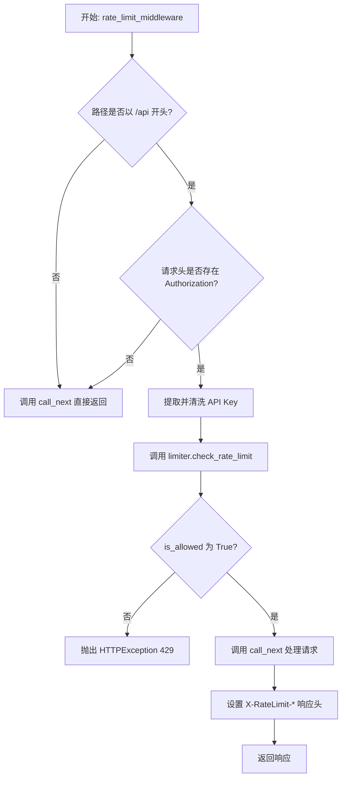
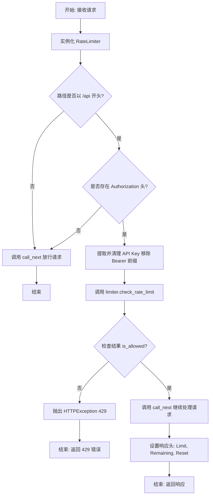

# `AutoGPT\autogpt_platform\autogpt_libs\autogpt_libs\rate_limit\middleware.py` 详细设计文档

该代码实现了一个 FastAPI 中间件，用于拦截请求，基于 API Key 对访问 /api 路径的请求进行速率限制检查，处理未授权及超限情况，并在响应头中返回剩余请求配额等信息。

## 整体流程



## 类结构

```
middleware.py (模块)
└── rate_limit_middleware (全局异步函数)
```

## 全局变量及字段


    

## 全局函数及方法


### `rate_limit_middleware`

这是一个 FastAPI 中间件函数，用于对 API 请求进行速率限制。它拦截进入的请求，检查请求路径和 Authorization 头，利用 RateLimiter 验证 API 密钥的请求频率。如果请求超过限制，则抛出 429 异常；否则，在响应头中添加剩余配额和重置时间信息并继续处理请求。

参数：

-  `request`：`Request`，FastAPI/Starlette 的请求对象，包含请求的路径、头部等信息。
-  `call_next`：`RequestResponseEndpoint`，Starlette 的端点调用函数，用于将请求传递给下一个中间件或路由处理器。

返回值：`Response`，Starlette 的响应对象。如果请求未被限流，则返回经过处理的响应并附加速率限制相关的头部信息；如果触发限流，则抛出异常，无返回值。

#### 流程图



#### 带注释源码

```python
async def rate_limit_middleware(request: Request, call_next: RequestResponseEndpoint):
    """FastAPI middleware for rate limiting API requests."""
    # 实例化速率限制器
    limiter = RateLimiter()

    # 检查请求路径是否以 "/api" 开头，如果不是则跳过限流检查
    if not request.url.path.startswith("/api"):
        return await call_next(request)

    # 从请求头中获取 Authorization 字段
    api_key = request.headers.get("Authorization")
    # 如果没有提供 API Key，则跳过限流检查（或可根据需求改为拒绝）
    if not api_key:
        return await call_next(request)

    # 移除 "Bearer " 前缀，提取纯 API Key
    api_key = api_key.replace("Bearer ", "")

    # 调用限流器检查该 API Key 的请求状态
    # 返回值: (是否允许请求, 剩余配额, 重置时间戳)
    is_allowed, remaining, reset_time = await limiter.check_rate_limit(api_key)

    # 如果请求不被允许（超过限流），抛出 HTTP 429 异常
    if not is_allowed:
        raise HTTPException(
            status_code=429, detail="Rate limit exceeded. Please try again later."
        )

    # 继续调用下一个中间件或实际的路由处理函数获取响应
    response = await call_next(request)
    
    # 在响应头中添加速率限制相关的元数据
    response.headers["X-RateLimit-Limit"] = str(limiter.max_requests)      # 最大请求数
    response.headers["X-RateLimit-Remaining"] = str(remaining)            # 剩余请求数
    response.headers["X-RateLimit-Reset"] = str(reset_time)               # 配额重置时间

    return response
```


## 关键组件


### 路由过滤组件
检查请求 URL 路径是否以 `/api` 开头，仅针对 API 请求执行限流逻辑，从而豁免非 API 路径的限流检查。

### API 凭证解析组件
从 HTTP 请求头的 `Authorization` 字段中提取 Bearer Token，将其标准化为 API Key，作为客户端身份的唯一标识符用于后续的限流计算。

### 限流执行与拦截组件
调用 `RateLimiter` 核心逻辑验证请求频率，根据返回结果决定是否允许请求通过；若超出阈值则触发 HTTP 429 异常，中断请求处理。

### 限流状态注入组件
在响应对象中追加 `X-RateLimit-Limit`、`X-RateLimit-Remaining` 和 `X-RateLimit-Reset` 等标准响应头，向客户端反馈当前的限流配额状态。


## 问题及建议


### 已知问题

-   **RateLimiter 实例生命周期错误**：在中间件内部每次请求都通过 `limiter = RateLimiter()` 创建新实例。由于限流器需要维护请求计数状态，每次重新初始化会导致状态丢失，使得限流功能完全失效。
-   **Authorization Header 解析逻辑脆弱**：使用 `api_key.replace("Bearer ", "")` 解析 Token 过于简单，无法处理 "bearer"（小写）、头部值包含多个空格、或没有空格等边缘情况。
-   **错误处理不够精确**：当 Authorization 头部存在但格式错误（例如仅包含 "Bearer" 而无 Token）时，代码仍会尝试使用空字符串进行限流检查，而非返回 401 Unauthorized 错误。

### 优化建议

-   **使用单例或依赖注入管理 RateLimiter**：将 `RateLimiter` 的实例化移至中间件函数外部，或利用 FastAPI 的 `app.state` 或 `depends` 机制，确保在整个应用生命周期内共享同一个限流器实例，以维持计数状态。
-   **增强 Token 提取的健壮性**：使用正则表达式（如 `re.match(r"Bearer\s+(.+)", api_key, re.IGNORECASE)`）或专门的库来安全地提取 Bearer Token，以兼容各种格式变体。
-   **配置参数外部化**：将路径前缀（`/api`）等硬编码字符串提取到配置文件或环境变量中，提高代码的可维护性和灵活性。
-   **引入日志记录与监控**：在触发限流（429 错误）或解析 Token 失败时记录日志，包含 IP、API Key 等脱敏信息，便于安全审计和故障排查。
-   **细化响应头处理逻辑**：在设置 `X-RateLimit-*` 响应头之前，确认 `call_next` 返回的响应对象支持头部修改（标准响应支持，但在某些流式响应中可能受限），并确保数据类型转换安全。


## 其它


### 设计目标与约束

**设计目标：**
该中间件旨在保护 API 资源免受恶意滥用或过度调用，通过基于 API Key 的速率限制策略，确保服务的稳定性和公平性。同时，它需要以非侵入式的方式集成到 FastAPI 应用中，仅对特定路径的请求生效。

**设计约束：**
1.  **路径约束**：中间件仅对以 `/api` 开头的路径进行速率限制检查，其他路径直接放行。
2.  **认证约束**：依赖 HTTP 请求头中的 `Authorization` 字段提取 API Key，且期望格式为 `Bearer <token>`。
3.  **实例化约束**：当前实现在每次请求处理时都创建一个新的 `RateLimiter` 实例（`limiter = RateLimiter()`），这意味着 `RateLimiter` 类必须是无状态的，或者依赖于外部持久化存储（如 Redis、数据库）来维护计数器状态，否则限流将无法生效。
4.  **性能约束**：由于处于中间件层，限流检查逻辑必须轻量且高效，以最小化对请求响应延迟（Latency）的影响。

### 错误处理与异常设计

**异常处理策略：**
1.  **速率限制超出（429 Error）**：
    *   当 `limiter.check_rate_limit(api_key)` 返回 `is_allowed` 为 `False` 时，系统将主动抛出 `HTTPException`。
    *   **状态码**：429 (Too Many Requests)。
    *   **响应体**：JSON 格式，`{"detail": "Rate limit exceeded. Please try again later."}`。
    *   此异常会中断当前请求的处理链，直接返回错误响应给客户端，不会调用后续的视图函数。

2.  **缺少 API Key（Pass-through）**：
    *   如果请求头中缺少 `Authorization` 字段，代码采用“静默放行”策略（`return await call_next(request)`）。这通常意味着系统允许未认证用户访问，或者认证逻辑在其他中间件中处理。此逻辑不属于错误处理，而是特定的业务规则。

3.  **依赖组件异常**：
    *   代码未显式捕获 `RateLimiter` 内部可能抛出的异常（如数据库连接错误）。根据 FastAPI 设计，这应由全局异常处理器或 Starlette 的错误中间件处理，可能导致 500 Internal Server Error。

### 数据流与状态机

**数据流：**
1.  **请求流入**：HTTP Request 进入 FastAPI 应用，到达中间件。
2.  **路径过滤**：检查 `request.url.path`。若非 `/api` 开头，数据流直接转至 `call_next`。
3.  **凭证提取**：从 `request.headers` 获取 `Authorization` 字符串，去除 `Bearer ` 前缀得到纯 API Key。
4.  **状态查询**：将 API Key 传递给 `RateLimiter`。`RateLimiter` 查询外部存储或内存状态，计算当前请求是否允许。
5.  **决策分支**：
    *   **拒绝分支**：若超出限制，抛出异常，数据流中断，生成 429 响应。
    *   **允许分支**：若未超出限制，调用 `call_next(request)`，将请求传递给下一个中间件或路由处理器。
6.  **响应流出**：获取下游返回的 `response` 对象，注入 `X-RateLimit-*` 头部信息，返回给客户端。

**状态机：**
该中间件本身不维护持久状态机。状态的维护委托给了 `RateLimiter` 组件。请求在中间件中的生命周期状态为：
`Pending (待处理)` -> `Checking (检查中)` -> `Rejected (已拒绝)` 或 `Proxied (已转发/处理中)` -> `Modified (响应已修改)` -> `Finished (完成)`。

### 外部依赖与接口契约

**外部依赖：**
1.  **`RateLimiter` 类** (来自 `.limiter` 模块)：
    *   这是核心依赖组件，负责实际的身份识别和频率计数逻辑。

**接口契约：**
1.  **`RateLimiter.check_rate_limit` 方法**：
    *   **输入参数**：`api_key` (str)，代表客户端的唯一标识。
    *   **返回类型**：`Tuple[bool, int, int]`。
    *   **返回值描述**：
        *   `is_allowed` (bool): True 表示请求允许通过，False 表示被限流。
        *   `remaining` (int): 在当前时间窗口内剩余的请求次数。
        *   `reset_time` (int): 限流窗口重置的时间戳（通常是 Unix 时间戳）。
    *   **隐式契约**：由于中间件每次都实例化 `RateLimiter`，该方法必须是幂等的，或者类实例化开销极低。

2.  **HTTP 接口契约**：
    *   **输入 Header**：`Authorization: Bearer <api_key>`。
    *   **输出 Headers**（仅在成功时注入）：
        *   `X-RateLimit-Limit`: 时间窗口内的最大请求次数（取自 `limiter.max_requests`）。
        *   `X-RateLimit-Remaining`: 当前窗口剩余次数。
        *   `X-RateLimit-Reset`: 重置时间。

    