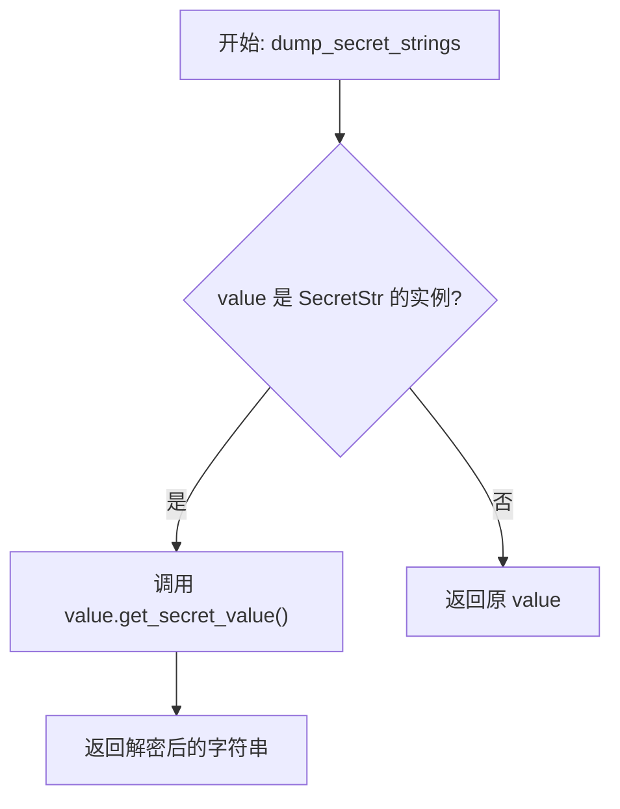
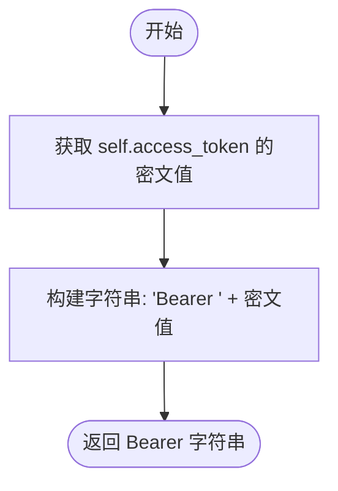
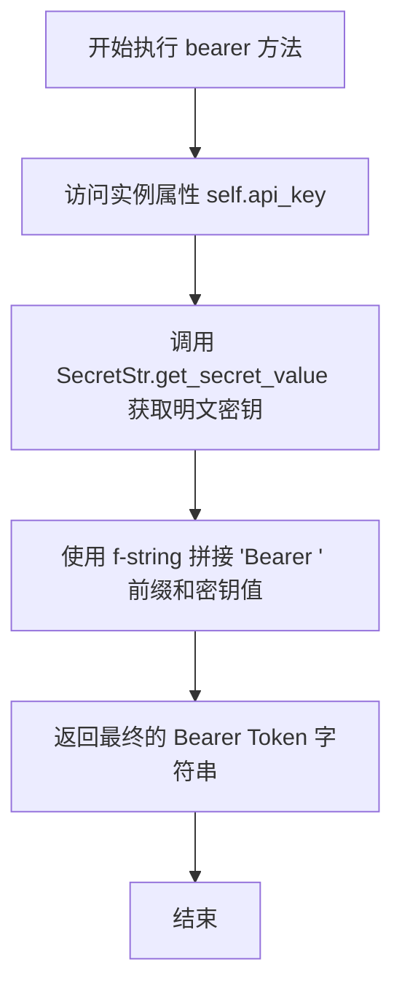

# `AutoGPT\autogpt_platform\autogpt_libs\autogpt_libs\supabase_integration_credentials_store\types.py` 详细设计文档

该代码定义了一套用于管理第三方服务凭证（OAuth2 和 API Key）的数据模型，基于 Pydantic 实现，包含安全的令牌处理、过期时间管理、用户元数据存储以及相关的类型定义和序列化逻辑。

## 整体流程

```mermaid
graph TD
    A[开始] --> B{凭证类型?}
    B -- OAuth2 --> C[实例化 OAuth2Credentials]
    B -- API Key --> D[实例化 APIKeyCredentials]
    C --> E[Pydantic 验证字段]
    D --> E
    E --> F[自动生成 ID (UUID)]
    F --> G[调用 bearer() 获取令牌]
    G --> H[模型序列化 (dump_secret_strings)]
    H --> I[结束]
```

## 类结构

```
BaseModel (Pydantic)
├── _BaseCredentials
│   ├── OAuth2Credentials
│   └── APIKeyCredentials
├── OAuthState
├── UserMetadata
├── UserIntegrations
└── UserMetadataRaw (TypedDict)
```

## 全局变量及字段


### `Credentials`
    
A union type representing either OAuth2Credentials or APIKeyCredentials, discriminated by the 'type' field.

类型：`Annotated[OAuth2Credentials | APIKeyCredentials, Field(discriminator="type")]`
    


### `CredentialsType`
    
A literal type representing the supported credential types: 'api_key' or 'oauth2'.

类型：`Literal["api_key", "oauth2"]`
    


### `_BaseCredentials.id`
    
The unique identifier for the credentials, generated as a UUID4 string.

类型：`str`
    


### `_BaseCredentials.provider`
    
The name of the service provider (e.g., 'github', 'google').

类型：`str`
    


### `_BaseCredentials.title`
    
An optional display title for the credentials.

类型：`Optional[str]`
    


### `OAuth2Credentials.type`
    
The discriminator field for the credential type, fixed to 'oauth2'.

类型：`Literal["oauth2"]`
    


### `OAuth2Credentials.username`
    
The username of the third-party service user that these credentials belong to.

类型：`Optional[str]`
    


### `OAuth2Credentials.access_token`
    
The secret access token string used for authorization.

类型：`SecretStr`
    


### `OAuth2Credentials.access_token_expires_at`
    
Unix timestamp (seconds) indicating when the access token expires (if at all).

类型：`Optional[int]`
    


### `OAuth2Credentials.refresh_token`
    
The secret refresh token string used to obtain new access tokens.

类型：`Optional[SecretStr]`
    


### `OAuth2Credentials.refresh_token_expires_at`
    
Unix timestamp (seconds) indicating when the refresh token expires (if at all).

类型：`Optional[int]`
    


### `OAuth2Credentials.scopes`
    
A list of scopes granted to the access token.

类型：`list[str]`
    


### `OAuth2Credentials.metadata`
    
Additional metadata associated with the credentials.

类型：`dict[str, Any]`
    


### `APIKeyCredentials.type`
    
The discriminator field for the credential type, fixed to 'api_key'.

类型：`Literal["api_key"]`
    


### `APIKeyCredentials.api_key`
    
The secret API key string used for authorization.

类型：`SecretStr`
    


### `APIKeyCredentials.expires_at`
    
Unix timestamp (seconds) indicating when the API key expires (if at all).

类型：`Optional[int]`
    


### `OAuthState.token`
    
The unique token for the OAuth state.

类型：`str`
    


### `OAuthState.provider`
    
The name of the OAuth provider.

类型：`str`
    


### `OAuthState.expires_at`
    
Unix timestamp (seconds) indicating when this OAuth state expires.

类型：`int`
    


### `OAuthState.code_verifier`
    
The PKCE code verifier used in the OAuth flow.

类型：`Optional[str]`
    


### `OAuthState.scopes`
    
The list of scopes requested during the OAuth flow.

类型：`list[str]`
    


### `UserMetadata.integration_credentials`
    
A list of integration credentials associated with the user.

类型：`list[Credentials]`
    


### `UserMetadata.integration_oauth_states`
    
A list of OAuth states associated with the user.

类型：`list[OAuthState]`
    


### `UserIntegrations.credentials`
    
A list of credentials.

类型：`list[Credentials]`
    


### `UserIntegrations.oauth_states`
    
A list of OAuth states.

类型：`list[OAuthState]`
    


### `UserMetadataRaw.integration_credentials`
    
A raw list of dictionaries representing integration credentials.

类型：`list[dict]`
    


### `UserMetadataRaw.integration_oauth_states`
    
A raw list of dictionaries representing integration OAuth states.

类型：`list[dict]`
    
    

## 全局函数及方法


### `_BaseCredentials.dump_secret_strings`

这是一个 Pydantic 字段序列化器，用于在模型序列化过程中处理字段。其主要功能是检测字段值是否为 `SecretStr` 类型（Pydantic 用于存储敏感字符串的类型），如果是，则调用其 `get_secret_value()` 方法返回明文字符串；否则，直接返回原值。这确保了在导出模型数据时，敏感信息被正确解密/解包。

参数：

-  `value`：`Any`，当前正在序列化的字段值。
-  `_info`：`Any`，Pydantic 内部传递的字段序列化上下文信息（此处未使用，参数名带有下划线前缀表示有意忽略）。

返回值：`Any`，如果输入是 `SecretStr`，则返回解密后的字符串；否则返回原始值。

#### 流程图



#### 带注释源码

```python
    @field_serializer("*")
    def dump_secret_strings(value: Any, _info):
        # 检查当前字段的值是否为 SecretStr 类型（用于安全存储字符串）
        if isinstance(value, SecretStr):
            # 如果是 SecretStr，调用其方法获取并返回实际的明文字符串值
            return value.get_secret_value()
        # 如果不是 SecretStr，直接返回原始值
        return value
```


### `OAuth2Credentials.bearer`

该方法用于获取标准的 HTTP Bearer 认证字符串，通过提取内部存储的访问令牌并添加 "Bearer" 前缀来构建。

参数：

- `self`：`OAuth2Credentials`，表示类的实例本身，用于访问存储的 `access_token`。

返回值：`str`，格式化后的 Bearer 认证字符串（例如："Bearer my_token_value"）。

#### 流程图



#### 带注释源码

```python
def bearer(self) -> str:
    # 获取 access_token 的实际字符串值，并加上 "Bearer " 前缀
    return f"Bearer {self.access_token.get_secret_value()}"
```


### `APIKeyCredentials.bearer`

该方法用于将存储的 API 密钥封装为标准的 HTTP Bearer 认证令牌格式字符串。

参数：

-   `self`：`APIKeyCredentials`，表示当前凭据类的实例，用于访问内部存储的 `api_key` 属性。

返回值：`str`，格式化后的 Bearer Token 字符串，结构为 "Bearer <actual_api_key>"。

#### 流程图



#### 带注释源码

```python
    def bearer(self) -> str:
        # 返回符合 Bearer Token 认证标准的字符串
        # self.api_key 是 SecretStr 类型，需要调用 get_secret_value() 获取实际明文值
        return f"Bearer {self.api_key.get_secret_value()}"
```


## 关键组件


### _BaseCredentials
凭证系统的抽象基类，提供通用的唯一标识符、服务提供商和标题字段，并包含处理敏感字符串序列化的通用逻辑。

### OAuth2Credentials
基于 OAuth2 协议的凭证实现，封装了访问令牌、刷新令牌、令牌过期时间及授权范围，支持生成 Bearer 认证头。

### APIKeyCredentials
基于 API Key 的凭证实现，封装了密钥字符串及其过期时间，支持生成 Bearer 认证头。

### Credentials
使用 Pydantic 的可辨识联合类型，将 OAuth2 和 API Key 凭证统一为一个类型，通过 `type` 字段进行自动反序列化和分发。

### OAuthState
OAuth2 授权流程的中间状态模型，用于存储临时令牌、代码验证器、过期时间及请求的权限范围，以支持安全的认证流程。

### UserIntegrations
用户集成数据的聚合模型，统一管理用户的凭证列表和当前的 OAuth 状态列表，作为应用层与用户集成数据交互的主要接口。


## 问题及建议


### 已知问题

-   `_BaseCredentials` 中的 `dump_secret_strings` 序列化器强制将所有 `SecretStr` 字段转换为明文字符串，这破坏了 `SecretStr` 类型的安全封装设计，极易导致敏感信息（如 Token、API Key）在日志打印、调试输出或 API 响应中意外泄露。
-   `UserMetadata` 和 `UserIntegrations` 两个类的结构几乎完全一致（均包含 `credentials` 和 `oauth_states` 列表），存在明显的功能冗余和语义混淆，增加了代码维护的复杂度。
-   `OAuth2Credentials` 和 `APIKeyCredentials` 中分别实现了 `bearer()` 方法，基类未定义统一接口，这违反了面向对象设计的依赖倒置原则，当新增凭据类型时容易遗忘实现该方法。
-   缺少对 Unix 时间戳字段（如 `expires_at`）的有效性校验，代码中未防止过期时间为负数或过去时间的非法状态。

### 优化建议

-   移除或重构全局的 `dump_secret_strings` 方法。建议仅在数据持久化层显式处理敏感字段解密，或者在 API 响应层通过 `model_dump(mode='json', exclude={'access_token', ...})` 显式控制字段暴露，确保默认行为是安全的。
-   定义抽象基类（如使用 `abc.ABC`）或协议，在基类中声明 `bearer()` 为抽象方法，强制所有子类实现该逻辑，从而统一凭据使用的接口标准。
-   合并 `UserMetadata` 和 `UserIntegrations`，明确单一职责，并移除 `UserMetadataRaw`。利用 Pydantic 强大的 `model_validate` 功能直接处理字典输入，无需维护额外的 TypedDict 类型。
-   在凭据和状态类中添加便捷方法（如 `is_expired()`）来封装 Unix 时间戳的比较逻辑，提高业务代码的可读性并减少重复的时间计算代码。
-   利用 Pydantic 的 `field_validator` 对 `expires_at` 和时间戳字段进行校验，确保其为有效的未来时间（或合理的非负数），从数据层面防止脏数据进入系统。


## 其它


### 设计目标与约束

- **安全性优先**：核心设计目标是安全地管理第三方服务的敏感认证信息。利用 Pydantic 的 `SecretStr` 类型封装敏感字段（如 `api_key`、`access_token`），确保在对象日志打印或调试时不会意外泄露明文密码。同时，通过自定义序列化器 `dump_secret_strings`，在数据持久化或传输时按需解密，平衡了安全性与可用性。
- **类型安全与多态支持**：采用 Python 的类型提示和 Pydantic 的模型系统，确保强类型约束。通过 `Literal` 和 `Annotated` 联合类型以及 `discriminator` 机制，构建了一个支持多种认证方式（OAuth2 和 API Key）的可扩展系统，约束了数据结构必须包含明确的 `type` 字段以区分具体实现。
- **生命周期管理**：设计包含了凭证的生命周期管理概念。所有凭证均包含 `id`（UUID）以确保唯一性。针对 OAuth2 和 API Key 均设计了 `expires_at` 字段（Unix 时间戳），强制要求系统在运行时必须处理令牌的过期逻辑。

### 错误处理与异常设计

- **数据验证异常**：代码严重依赖 Pydantic 的运行时验证机制。当传入的字典数据不符合模型定义（例如 `expires_at` 不是整数，`scopes` 不是列表，或缺少必填字段）时，Pydantic 将抛出 `ValidationError`，阻止非法对象的创建。
- **多态解析失败**：在处理 `Credentials` 联合类型时，如果输入数据的 `type` 字段既不是 `"oauth2"` 也不是 `"api_key"`，或者匹配到的类型缺少对应的结构（如 OAuth2 缺少 `access_token`），解析过程将立即失败。
- **序列化安全**：`SecretStr` 的设计目的是防止非显式访问。虽然 `dump_secret_strings` 处理了序列化时的解密，但如果在非序列化上下文中错误地处理了 `SecretStr` 对象，可能会导致类型错误或逻辑异常，这是一种通过类型系统进行的防御性设计。

### 数据流与状态机

- **凭证数据流**：
  1.  **输入阶段**：外部系统提供原始字典数据（通常对应 `UserMetadataRaw` 结构）。
  2.  **验证与转换**：Pydantic 解析器根据 `type` 鉴别器将字典路由至 `OAuth2Credentials` 或 `APIKeyCredentials` 类进行实例化，自动生成 UUID 并验证时间戳。
  3.  **业务使用**：应用层通过 `bearer()` 方法获取格式化的授权头字符串（`Bearer <token>`）。
  4.  **输出存储**：通过模型序列化将对象转回字典，此时触发 `dump_secret_strings` 将敏感数据还原为明文（通常随后由数据库层加密存储）。

- **OAuth2 状态机**：
  1.  **初始状态**：系统创建 `OAuthState` 实例，生成 `token` 和 `code_verifier`，并设置 `expires_at`。
  2.  **待授权状态**：用户被重定向至第三方提供商，此时系统仅持有 `OAuthState`。
  3.  **兑换状态**：用户授权回调后，系统使用 `OAuthState` 中的信息换取访问令牌。
  4.  **激活状态**：创建 `OAuth2Credentials`，此时进入令牌使用期。系统需定期检查 `access_token_expires_at`。
  5.  **刷新状态**：若访问令牌过期且 `refresh_token` 有效，系统使用刷新令牌更新凭证，重置过期时间；否则进入失效状态。

### 外部依赖与接口契约

- **外部依赖**：
  - `pydantic`：核心框架库，用于定义数据模型（`BaseModel`）、字段验证（`Field`）、敏感字符串封装（`SecretStr`）及序列化逻辑。版本需支持 `Annotated` 和 `discriminator` 特性（通常为 v2+）。
  - `typing` 与 `uuid`：Python 标准库，用于支持类型注解和生成唯一的凭证 ID。

- **接口契约**：
  - **数据存储契约**：`UserMetadataRaw` 定义了与底层存储层（如数据库的 JSONB 列）交互的原始格式。存储层必须能读写包含 `integration_credentials` 和 `integration_oauth_states` 列表的字典结构。
  - **鉴别器契约**：任何输入到 `Credentials` 类型的数据源必须提供一个名为 `type` 的键，且其值必须是 `"oauth2"` 或 `"api_key"` 之一。
  - **认证接口契约**：所有凭证子类（`OAuth2Credentials`, `APIKeyCredentials`）必须实现 `bearer()` 方法，返回符合 RFC 6750 OAuth 2.0 Bearer Token Usage 标准的字符串格式。

    