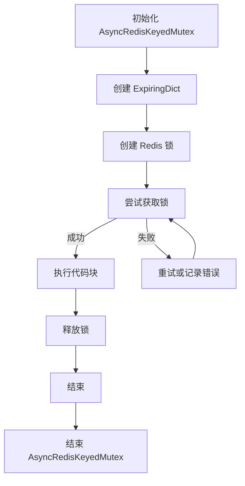
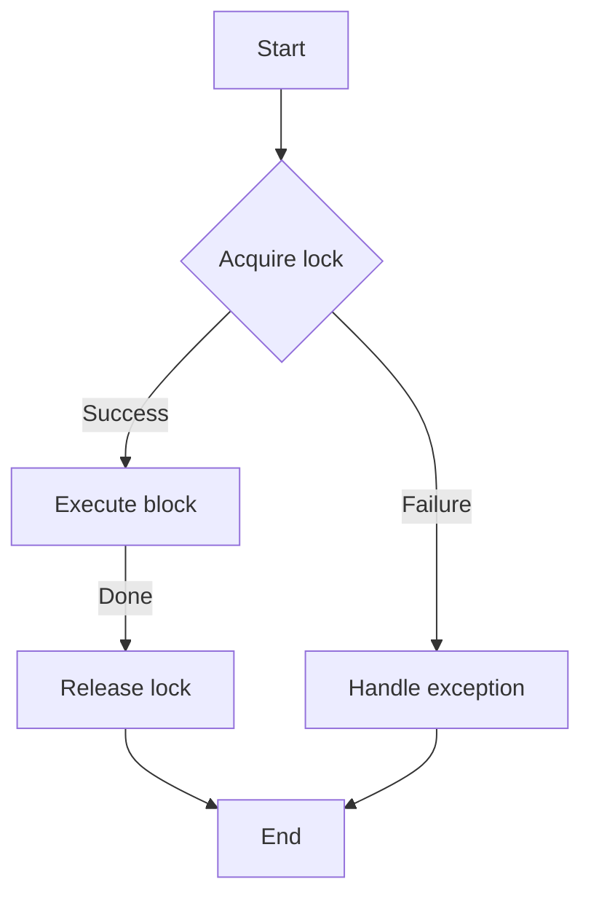
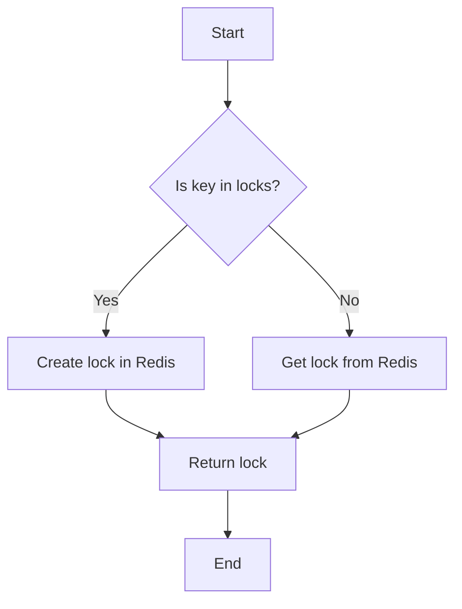
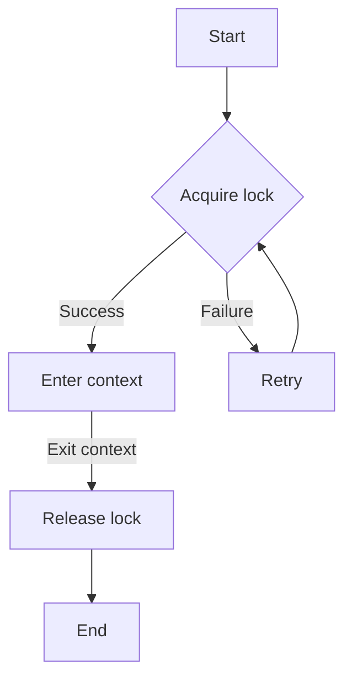
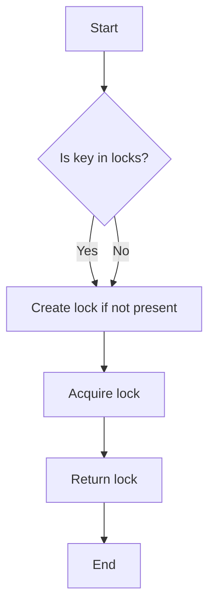
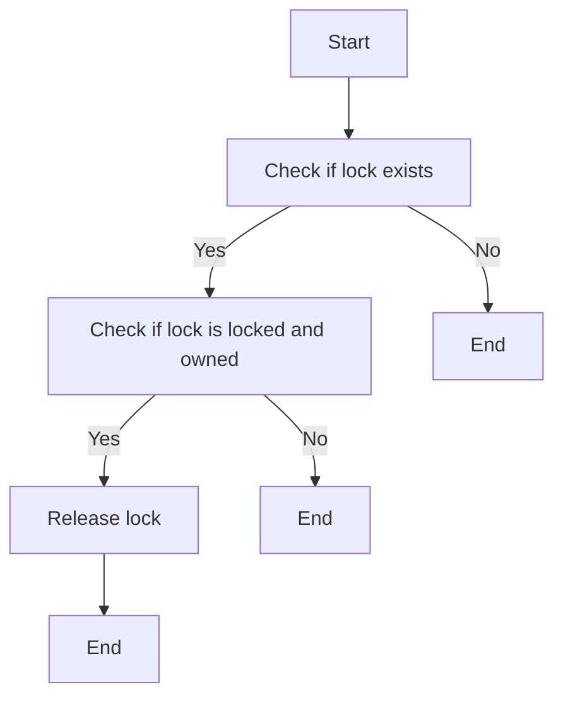
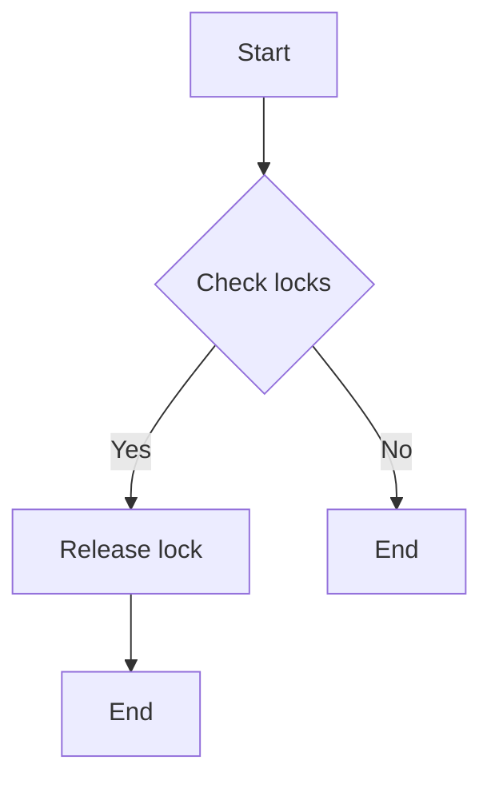

# `.\AutoGPT\autogpt_platform\autogpt_libs\autogpt_libs\utils\synchronize.py` 详细设计文档

The code provides a mutex mechanism using Redis for distributed locking, with automatic lock expiration to prevent memory leaks.

## 整体流程



## 类结构

```
AsyncRedisKeyedMutex (类)
├── redis (AsyncRedis 对象)
│   ├── timeout (int)
│   ├── locks (ExpiringDict)
│   └── locks_lock (asyncio.Lock)
├── locked (asynccontextmanager)
│   ├── acquire (async def)
│   └── release (async def)
└── release_all_locks (async def)
```

## 全局变量及字段


### `AsyncRedis`
    
The asynchronous Redis client class.

类型：`from redis.asyncio import Redis as AsyncRedis`
    


### `AsyncRedisLock`
    
The asynchronous Redis lock class.

类型：`from redis.asyncio.lock import Lock as AsyncRedisLock`
    


### `ExpiringDict`
    
A dictionary that automatically expires entries after a specified time.

类型：`from expiringdict import ExpiringDict`
    


### `TYPE_CHECKING`
    
A type checking flag for conditional type checking.

类型：`from typing import TYPE_CHECKING`
    


### `AsyncRedisKeyedMutex.redis`
    
The Redis client instance used for locking.

类型：`AsyncRedis`
    


### `AsyncRedisKeyedMutex.timeout`
    
The timeout duration for the locks in seconds. Defaults to 60 seconds.

类型：`int | None`
    


### `AsyncRedisKeyedMutex.locks`
    
A dictionary to store the locks with their associated keys and Redis lock instances.

类型：`ExpiringDict`
    


### `AsyncRedisKeyedMutex.locks_lock`
    
A lock to synchronize access to the 'locks' dictionary.

类型：`asyncio.Lock`
    
    

## 全局函数及方法


### `AsyncRedisKeyedMutex.locked`

This method is an async context manager that locks a specific key using Redis, providing a way to synchronize access to shared resources across multiple processes or machines.

参数：

- `key`：`Any`，The key used to identify the lock. This key is used to store and retrieve the lock in Redis.

返回值：`None`，This method does not return a value but yields control back to the caller after acquiring the lock, and releases the lock when the context manager is exited.

#### 流程图



#### 带注释源码

```python
    @asynccontextmanager
    async def locked(self, key: Any):
        lock = await self.acquire(key)
        try:
            yield
        finally:
            if (await lock.locked()) and (await lock.owned()):
                await lock.release()
```


### `AsyncRedisKeyedMutex.acquire`

Acquires and returns a lock with the given key.

参数：

- `key`：`Any`，The key used to identify the lock. This key is used to store and retrieve the lock from the Redis store.

返回值：`AsyncRedisLock`，The lock object that can be used to control access to the resource.

#### 流程图



#### 带注释源码

```python
async def acquire(self, key: Any) -> "AsyncRedisLock":
    """Acquires and returns a lock with the given key"""
    async with self.locks_lock:
        if key not in self.locks:
            self.locks[key] = self.redis.lock(
                str(key), self.timeout, thread_local=False
            )
        lock = self.locks[key]
    await lock.acquire()
    return lock
```


### AsyncRedisKeyedMutex.locked

This method is an async context manager that locks a mutex using a specific key, provided by the Redis async client. It ensures that only one coroutine can hold the lock at a time, and it will automatically release the lock if it is not unlocked within the specified timeout.

参数：

- `key`：`Any`，The key used to identify the mutex. This key is used to acquire and release the lock.

返回值：`None`，This method does not return a value but yields control back to the caller after acquiring the lock, and releases it when the context manager is exited.

#### 流程图



#### 带注释源码

```python
    @asynccontextmanager
    async def locked(self, key: Any):
        lock = await self.acquire(key)
        try:
            yield
        finally:
            if (await lock.locked()) and (await lock.owned()):
                await lock.release()
```


### AsyncRedisKeyedMutex.acquire

This method is used to acquire a lock with a specific key from the Redis distributed locking provider.

参数：

- `key`：`Any`，The key used to identify the lock. This key is used to retrieve the corresponding lock from the Redis server.

返回值：`AsyncRedisLock`，The lock object that has been acquired.

#### 流程图



#### 带注释源码

```
async def acquire(self, key: Any) -> "AsyncRedisLock":
    """Acquires and returns a lock with the given key"""
    async with self.locks_lock:
        if key not in self.locks:
            self.locks[key] = self.redis.lock(
                str(key), self.timeout, thread_local=False
            )
        lock = self.locks[key]
    await lock.acquire()
    return lock
``` 


### AsyncRedisKeyedMutex.release

Releases the lock associated with the specified key.

参数：

- `key`：`Any`，The key associated with the lock to be released.

返回值：`None`，Indicates that the lock has been successfully released.

#### 流程图



#### 带注释源码

```python
async def release(self, key: Any):
    if (
        (lock := self.locks.get(key))
        and (await lock.locked())
        and (await lock.owned())
    ):
        await lock.release()
```


### AsyncRedisKeyedMutex.release_all_locks

This method is called on process termination to ensure all locks are released, preventing any potential deadlocks or resource leaks.

参数：

- 无

返回值：`None`，无返回值

#### 流程图



#### 带注释源码

```
async def release_all_locks(self):
    """Call this on process termination to ensure all locks are released"""
    async with self.locks_lock:
        for lock in self.locks.values():
            if (await lock.locked()) and (await lock.owned()):
                await lock.release()
``` 


## 关键组件


### 张量索引与惰性加载

提供对张量的索引支持，并在需要时才加载张量数据，以优化内存使用和性能。

### 反量化支持

支持对量化策略的反量化操作，以便在需要时恢复原始数据。

### 量化策略

实现量化策略，用于将浮点数张量转换为低精度表示，以减少模型大小和加速推理。


## 问题及建议


### 已知问题

-   **类型注解依赖性**：代码中使用了`TYPE_CHECKING`来避免在运行时导入`redis`库，但这样做可能导致在类型检查时无法正确识别`AsyncRedis`和`AsyncRedisLock`的类型。
-   **全局状态管理**：`AsyncRedisKeyedMutex`类维护了一个全局的`locks`字典，这可能导致在多实例或并发环境中出现状态共享问题。
-   **异常处理**：代码中没有显式处理可能发生的异常，例如在`acquire`和`release`方法中，如果Redis操作失败，可能会导致未处理的异常。

### 优化建议

-   **类型注解改进**：考虑使用`runtime_checking`代替`TYPE_CHECKING`，以便在运行时也能进行类型检查，或者确保在类型检查阶段导入必要的库。
-   **状态管理**：考虑使用依赖注入或上下文管理器来管理`AsyncRedisKeyedMutex`的实例，以避免全局状态管理。
-   **异常处理**：在`acquire`和`release`方法中添加异常处理逻辑，确保在发生错误时能够适当地处理异常，并释放资源。
-   **资源清理**：在`release_all_locks`方法中，确保在释放锁之前检查锁是否被持有，以避免不必要的资源释放。
-   **文档和注释**：增加对类方法和全局函数的详细文档和注释，以提高代码的可读性和可维护性。


## 其它


### 设计目标与约束

- 设计目标：实现一个基于Redis的分布式互斥锁，用于在异步环境中同步访问共享资源。
- 约束条件：互斥锁必须支持自动过期，以防止死锁和内存泄漏。
- 性能要求：互斥锁操作应尽可能高效，以减少对系统性能的影响。

### 错误处理与异常设计

- 错误处理：在互斥锁操作中，应捕获并处理可能出现的异常，如Redis连接错误、锁获取失败等。
- 异常设计：定义自定义异常类，以提供更清晰的错误信息。

### 数据流与状态机

- 数据流：数据流从外部请求开始，通过互斥锁的获取和释放操作，最终返回结果。
- 状态机：互斥锁可能处于以下状态之一：未锁定、已锁定、已释放。

### 外部依赖与接口契约

- 外部依赖：依赖于Redis异步客户端库和expiringdict库。
- 接口契约：定义了互斥锁的接口，包括获取锁、释放锁、释放所有锁等操作。

### 安全性与权限控制

- 安全性：确保互斥锁只能由授权用户操作，防止未授权访问。
- 权限控制：实现权限检查机制，确保只有具有相应权限的用户才能获取和释放锁。

### 测试与验证

- 测试策略：编写单元测试和集成测试，以确保互斥锁的功能正确性和性能。
- 验证方法：使用模拟Redis服务器进行测试，验证互斥锁在不同场景下的行为。

### 维护与扩展性

- 维护策略：定期审查代码，修复潜在的错误和性能问题。
- 扩展性：设计灵活的接口，以便在未来添加新的功能或支持不同的锁策略。


    