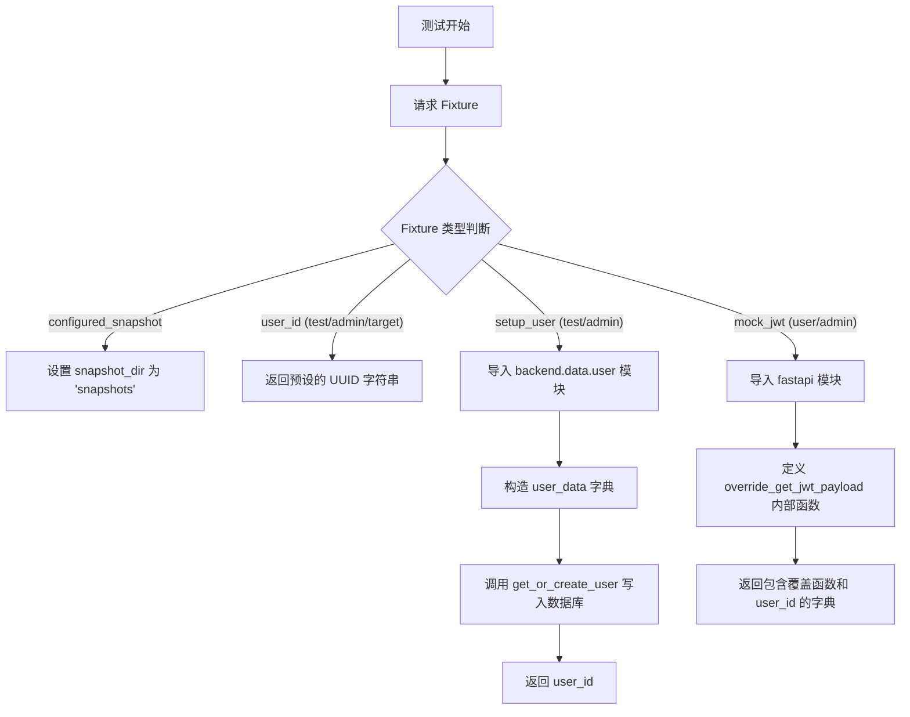
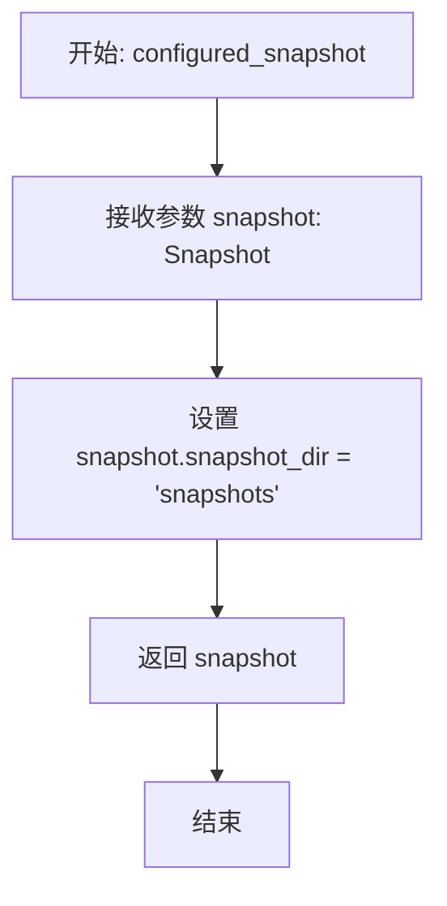
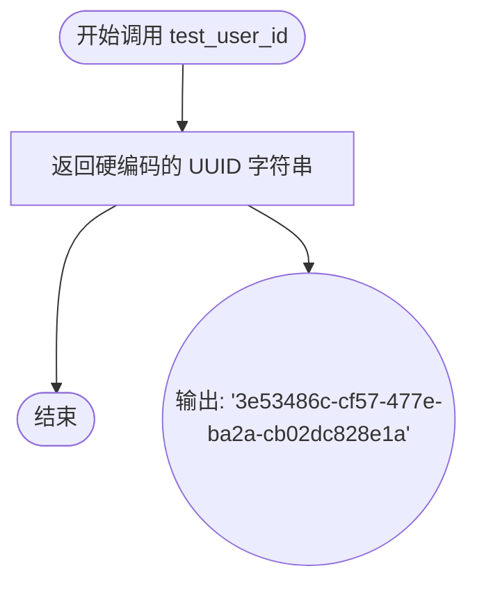
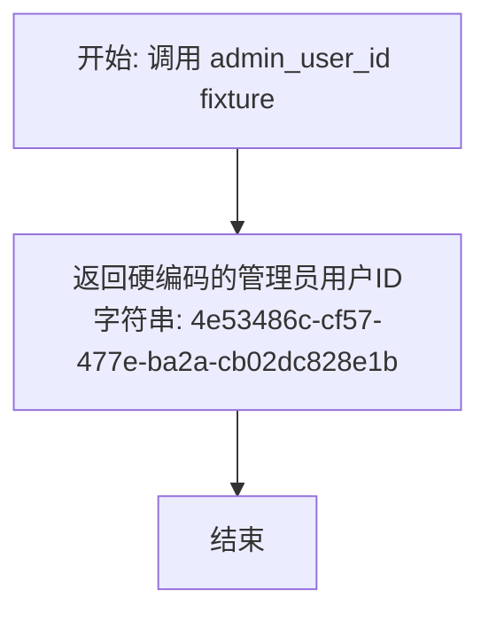
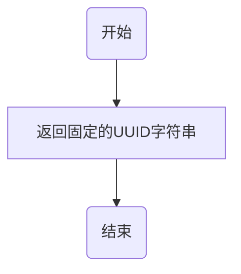
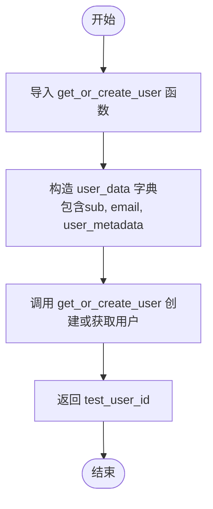
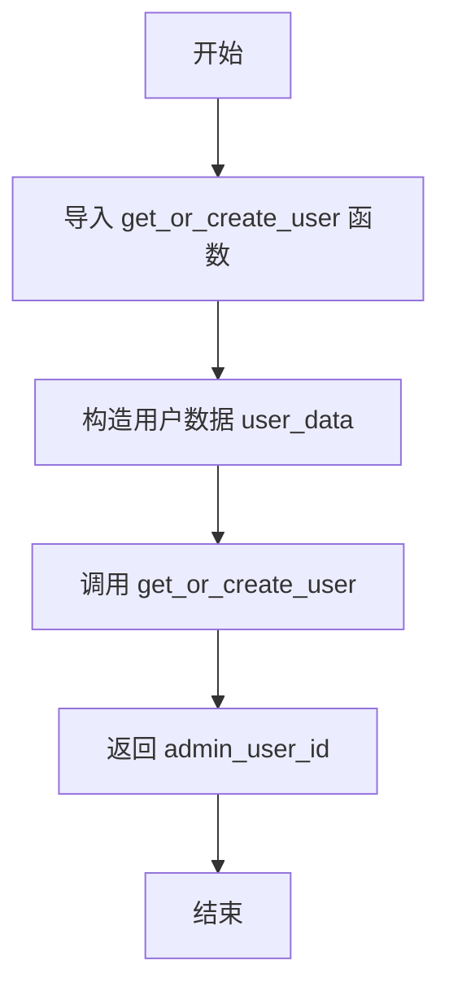
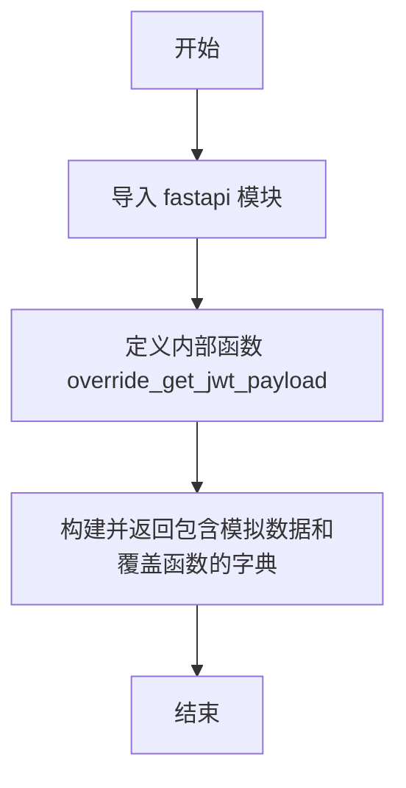
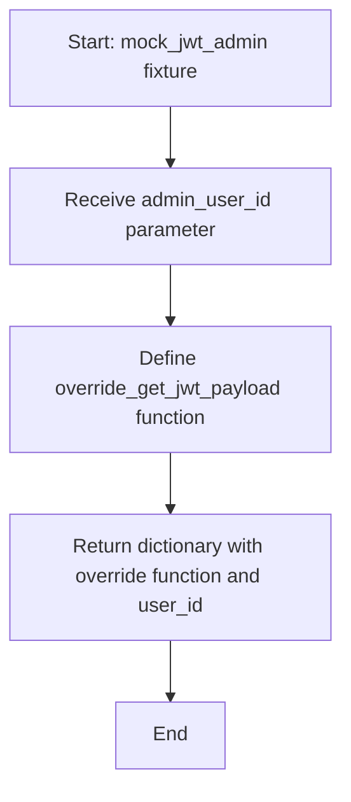

# `AutoGPT\autogpt_platform\backend\backend\api\conftest.py` 详细设计文档

该文件定义了用于服务端测试的通用 Pytest 测试夹具，涵盖了快照测试配置、测试/管理员/目标用户的 ID 定义、数据库用户初始化以及基于 FastAPI 的 JWT 认证模拟。

## 整体流程



## 类结构

```
Test Fixtures (测试夹具)
├── Configuration (配置)
│   └── configured_snapshot
├── Data Constants (数据常量)
│   ├── test_user_id
│   ├── admin_user_id
│   └── target_user_id
├── Database Setup (数据库初始化)
│   ├── setup_test_user
│   └── setup_admin_user
└── Authentication Mocks (认证模拟)
    ├── mock_jwt_user
    └── mock_jwt_admin
```

## 全局变量及字段


    

## 全局函数及方法


### `configured_snapshot`

Pre-configured snapshot fixture with standard settings.

参数：

-  `snapshot`：`Snapshot`，由 pytest-snapshot 插件提供的原始快照对象。

返回值：`Snapshot`，配置了默认快照存储目录的快照对象。

#### 流程图



#### 带注释源码

```python
@pytest.fixture
def configured_snapshot(snapshot: Snapshot) -> Snapshot:
    """Pre-configured snapshot fixture with standard settings."""
    # 设置快照文件的保存目录为 "snapshots"
    snapshot.snapshot_dir = "snapshots"
    # 返回配置完成后的 snapshot 对象供测试使用
    return snapshot
```


### `test_user_id`

这是一个 Pytest 测试固件（Fixture），用于在测试过程中提供一个固定的、硬编码的测试用户 ID（UUID 字符串）。其目的是为了确保在服务端测试中，涉及普通用户的操作能够使用一致且有效的标识符，便于模拟用户行为和验证数据一致性。

参数：

-  `无`：`None`，该函数不接受任何参数

返回值：`str`，返回一个表示测试用户 ID 的 UUID 字符串，具体值为 `"3e53486c-cf57-477e-ba2a-cb02dc828e1a"`。

#### 流程图



#### 带注释源码

```python
# 使用 pytest.fixture 装饰器将函数标记为一个测试固件
# 该固件可以在测试用例中通过参数名直接引用
@pytest.fixture
# 定义函数，指定返回类型为字符串 (str)
def test_user_id() -> str:
    """Test user ID fixture."""
    # 返回一个预设的 UUID 字符串，用于模拟测试用户的唯一标识
    return "3e53486c-cf57-477e-ba2a-cb02dc828e1a"
```


### `admin_user_id`

这是一个 Pytest 测试夹具，用于在测试过程中提供一个固定的管理员用户 ID 字符串。

参数：

无

返回值：`str`，表示管理员用户的 UUID 字符串，值为 "4e53486c-cf57-477e-ba2a-cb02dc828e1b"。

#### 流程图



#### 带注释源码

```python
@pytest.fixture
def admin_user_id() -> str:
    """Admin user ID fixture."""
    # 返回一个预定义的 UUID 字符串，用于模拟测试场景下的管理员用户标识
    return "4e53486c-cf57-477e-ba2a-cb02dc828e1b"
```


### `target_user_id`

这是一个 Pytest 测试固件，用于在测试用例中提供一个固定的目标用户 ID 字符串，通常用于模拟被操作、查询或管理的特定用户对象。

参数：

-   无参数

返回值：`str`，表示目标用户 ID 的 UUID 字符串（"5e53486c-cf57-477e-ba2a-cb02dc828e1c"）。

#### 流程图



#### 带注释源码

```python
# 使用 pytest.fixture 装饰器将函数标记为测试固件
@pytest.fixture
# 定义返回类型为字符串
def target_user_id() -> str:
    """Target user ID fixture."""
    # 返回硬编码的目标用户 UUID 字符串
    return "5e53486c-cf57-477e-ba2a-cb02dc828e1c"
```


### `setup_test_user`

Create test user in database before tests.

参数：

- `test_user_id`：`str`，由pytest fixture提供的测试用户ID，用于标识测试用户。

返回值：`str`，返回创建的测试用户ID。

#### 流程图



#### 带注释源码

```python
@pytest.fixture
async def setup_test_user(test_user_id):
    """Create test user in database before tests."""
    from backend.data.user import get_or_create_user

    # Create the test user in the database using JWT token format
    # 模拟 JWT token 格式的数据结构
    user_data = {
        "sub": test_user_id,
        "email": "test@example.com",
        "user_metadata": {"name": "Test User"},
    }
    # 调用异步函数在数据库中创建或获取用户
    await get_or_create_user(user_data)
    # 返回测试用户ID，供测试使用
    return test_user_id
```


### `setup_admin_user`

Create admin user in database before tests.

参数：

-  `admin_user_id`：`str`，管理员用户的唯一标识符，由 `admin_user_id` fixture 注入。

返回值：`str`，创建的管理器用户 ID。

#### 流程图



#### 带注释源码

```python
@pytest.fixture
async def setup_admin_user(admin_user_id):
    """Create admin user in database before tests."""
    # 从后端数据模块导入用户获取或创建函数
    from backend.data.user import get_or_create_user

    # Create the admin user in the database using JWT token format
    # 构造符合 JWT token 格式的用户数据字典
    user_data = {
        "sub": admin_user_id,
        "email": "test-admin@example.com",
        "user_metadata": {"name": "Test Admin"},
    }
    # 异步调用函数，确保数据库中存在该管理员用户
    await get_or_create_user(user_data)
    # 返回管理员用户 ID 供测试使用
    return admin_user_id
```


### `mock_jwt_user`

这是一个 pytest fixture，用于为常规用户测试提供模拟的 JWT 载荷。它返回一个包含覆盖函数和用户 ID 的字典，以便在测试环境中模拟身份验证逻辑。

参数：

- `test_user_id`：`str`，测试用户 ID 的 fixture，用于指定模拟用户的唯一标识。

返回值：`dict[str, any]`，包含键 `get_jwt_payload`（用于覆盖获取 JWT 载荷的函数）和 `user_id`（测试用户 ID）的字典。

#### 流程图



#### 带注释源码

```python
@pytest.fixture
def mock_jwt_user(test_user_id):
    """Provide mock JWT payload for regular user testing."""
    import fastapi

    # 定义一个内部函数，用于覆盖 FastAPI 依赖中获取 JWT Payload 的逻辑
    def override_get_jwt_payload(request: fastapi.Request) -> dict[str, str]:
        # 返回模拟的用户信息载荷，包含用户ID(sub)、角色和邮箱
        return {"sub": test_user_id, "role": "user", "email": "test@example.com"}

    # 返回一个字典，包含覆盖函数和用户 ID，方便测试时调用和断言
    return {"get_jwt_payload": override_get_jwt_payload, "user_id": test_user_id}
```


### `mock_jwt_admin`

Provide mock JWT payload for admin user testing.

参数：

- `admin_user_id`：`str`，Admin user ID provided by the `admin_user_id` fixture.

返回值：`dict[str, Any]`，A dictionary containing the `get_jwt_payload` override function and the `user_id`.

#### 流程图



#### 带注释源码

```python
@pytest.fixture
def mock_jwt_admin(admin_user_id):
    """Provide mock JWT payload for admin user testing."""
    import fastapi

    # 定义一个内部函数，用于模拟 FastAPI 依赖项中的 JWT payload 获取逻辑
    # 该函数接收一个 FastAPI 请求对象，但在模拟实现中通常忽略它
    def override_get_jwt_payload(request: fastapi.Request) -> dict[str, str]:
        return {
            "sub": admin_user_id,            # 设置用户 ID 主题
            "role": "admin",                 # 设置角色为管理员
            "email": "test-admin@example.com", # 设置测试邮箱
        }

    # 返回包含覆盖函数和用户 ID 的字典，供测试用例使用
    return {"get_jwt_payload": override_get_jwt_payload, "user_id": admin_user_id}
```


## 关键组件


### Snapshot Configuration Component

封装 pytest-snapshot 插件配置，将快照存储目录标准化为 "snapshots"，以确保跨测试的一致性。

### User Identity Constants

为普通用户、管理员用户和目标用户实体提供确定性的 UUID 标识符，以隔离测试数据和逻辑。

### Database Initialization Component

通过异步与后端数据层交互处理用户实体的生命周期管理，确保在测试运行前这些用户存在于持久化存储中。

### Authentication Simulation Component

模拟 FastAPI 请求的 JWT 载荷提取，覆盖生产级身份验证逻辑，以方便在隔离环境中进行基于角色的访问控制测试。


## 问题及建议


### 已知问题

-   **缺少测试数据清理机制**：`setup_test_user` 和 `setup_admin_user` 这两个异步 Fixture 仅负责在测试前创建数据，但缺乏对应的清理逻辑（未使用 `yield` 或添加 `finalizer`）。这会导致测试数据库随着测试运行次数的增加而积累冗余数据，可能引发数据冲突或影响测试结果的隔离性。
-   **代码重复违反 DRY 原则**：`setup_test_user` 和 `setup_admin_user` 的逻辑高度相似，仅传入的参数（ID、邮箱、元数据）不同。这种重复增加了维护成本，若用户创建逻辑发生变更，需同步修改多处。
-   **Fixture 职责划分不明确**：`mock_jwt_user` 和 `mock_jwt_admin` 返回一个字典，期望测试使用者手动将 `override_get_jwt_payload` 应用于 FastAPI 的依赖覆盖。这种设计将“模拟对象生成”与“依赖注入配置”分离，增加了测试代码的编写复杂度，容易遗漏 `dependency_overrides` 的重置，导致测试间相互污染。
-   **硬编码测试数据**：用户 ID (`test_user_id`)、邮箱等信息均为硬编码的魔法字符串。虽然在某些场景下需要固定的 ID 以匹配快照，但在大多数隔离测试中，硬编码限制了并发测试的能力，且难以扩展多样化的测试场景。

### 优化建议

-   **引入自动清理机制**：修改 `setup_test_user` 和 `setup_admin_user` 为生成器函数（使用 `yield`），在测试执行完成后自动调用数据库删除操作清理创建的用户，确保测试环境的干净与隔离。
-   **抽象通用用户工厂 Fixture**：创建一个参数化的工厂 Fixture（如 `make_user`），接收角色、权限等参数来动态生成用户数据。原有的 `setup_test_user` 和 `setup_admin_user` 可以改为调用该通用 Fixture 的轻量级封装，以消除代码重复。
-   **增强 JWT 模拟 Fixture 的封装性**：改进 `mock_jwt_user` 相关 Fixture，使其直接接收 FastAPI 的 `app` 对象，并在 Fixture 内部自动处理 `app.dependency_overrides` 的设置与重置。这样测试代码只需依赖该 Fixture，无需关心依赖注入的具体实现细节。
-   **使用动态生成或配置化数据**：对于非强依赖固定 ID 的测试场景，建议使用 `uuid.uuid4()` 或 `faker` 库动态生成测试数据。对于需要固定数据的场景，建议将这些常量集中管理在专门的配置模块或常量类中，便于统一维护。


## 其它


### 设计目标与约束

**设计目标**：
本模块旨在为服务器端测试提供一组标准化、可复用的测试夹具。核心目标是简化测试用例的编写，确保测试环境的一致性，并提供对常见场景（如普通用户、管理员、数据库初始化、JWT 认证模拟）的快速支持。

**约束条件**：
1.  **硬编码依赖**：测试用户ID（`test_user_id` 等）是硬编码的 UUID 字符串，这意味着测试数据与数据库中的特定记录绑定，不适用于需要动态随机 ID 的场景。
2.  **环境假设**：快照目录被硬编码为 `"snapshots"`，这要求测试运行时的工作目录或项目结构必须包含该路径。
3.  **异步支持**：部分 Fixture（如 `setup_test_user`）是异步的，因此使用这些 Fixture 的测试用例也必须是异步测试函数。
4.  **数据库状态**：Fixture 仅负责数据创建，不负责数据清理（ teardown），依赖于 `get_or_create_user` 的幂等性或测试环境的自我清理能力。

### 外部依赖与接口契约

**外部依赖**：
1.  **pytest**：测试框架，用于定义和识别 `@pytest.fixture`。
2.  **pytest_snapshot**：插件依赖，用于快照测试功能。
3.  **backend.data.user**：内部业务模块依赖，用于实际的用户数据操作。
4.  **fastapi**：Web 框架依赖，用于定义 JWT 模拟函数中的类型注解。

**接口契约**：
1.  **`backend.data.user.get_or_create_user`**：
    *   **输入**：接受一个字典，必须包含 `"sub"` (用户ID), `"email"`, `"user_metadata"` 等键。
    *   **行为**：应具有幂等性，即多次调用相同参数不应抛出错误（例如，用户已存在时返回现有用户，或静默更新）。
    *   **上下文**：必须在异步上下文中调用。
2.  **Mock JWT Payload 函数**：
    *   **输入**：接收 `fastapi.Request` 对象（尽管在当前实现中未使用，但必须符合 FastAPI 依赖注入的签名要求）。
    *   **输出**：返回包含 `"sub"`, `"role"`, `"email"` 的字典。

### 数据流与状态管理

**数据流**：
1.  **初始化阶段**：当测试请求某个 Fixture 时（例如 `setup_test_user`），Pytest 查找并执行对应的函数。
2.  **数据处理**：
    *   对于 ID 类 Fixture：直接返回静态字符串。
    *   对于数据库 Setup Fixture：构建用户数据字典 -> 调用异步 `get_or_create_user` -> 将数据写入数据库 -> 返回用户 ID。
    *   对于 Mock Fixture：定义内部函数 -> 返回包含该函数和 ID 的字典。
3.  **使用阶段**：测试用例接收返回值或对象，执行业务逻辑测试。
4.  **清理阶段**：当前代码未显式实现清理逻辑。数据库状态的持久化取决于外部测试配置（如使用事务回滚或测试数据库重置）。

**状态管理**：
*   **静态配置状态**：`snapshot_dir` 被配置为 `snapshots`，在整个测试会话期间生效。
*   **数据库状态**：通过 `setup_*_user` Fixture 创建的用户记录在测试周期内存在于数据库中。由于未实现 `yield` 后的清理代码，这些记录可能会在测试结束后残留（取决于 `backend.data.user` 的具体实现）。

### 错误处理与异常设计

**异常传播策略**：
本模块作为测试基础设施，通常不主动捕获和处理业务异常，而是允许异常向上传播至测试框架，以便测试失败。

**潜在异常点**：
1.  **`get_or_create_user` 调用失败**：如果数据库连接断开、Schema 不匹配或违反唯一性约束，异常将直接抛出，导致依赖该 Fixture 的测试标记为 Error 或 Failed。
2.  **导入错误**：如果 `backend.data.user` 或 `fastapi` 模块未安装或路径不可用，模块导入阶段即会失败，阻止测试运行。
3.  **类型不匹配**：如果 Mock JWT 函数被期望返回未提供的字段，测试代码逻辑本身会抛出 `KeyError`，但这属于测试用例逻辑错误而非 Fixture 错误。

**设计建议**：
虽然当前代码未包含 `try-catch` 块，但在生产级测试基建中，建议在 Fixture 中增加自定义的错误提示，以便当数据库连接失败时，能明确提示是因为测试环境未就绪，而非单纯的业务逻辑失败。

    