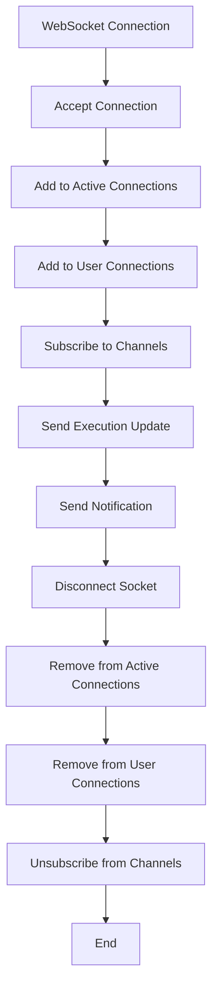
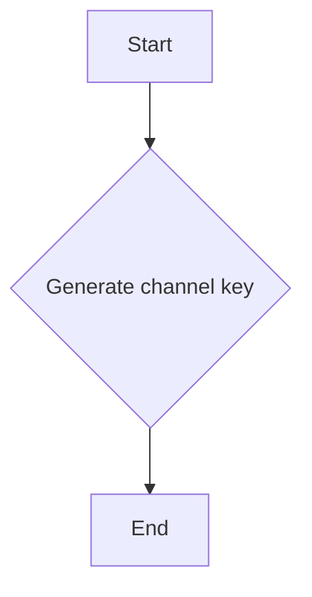
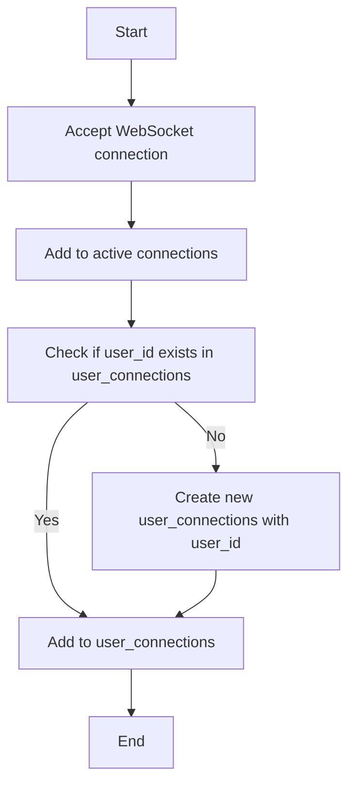
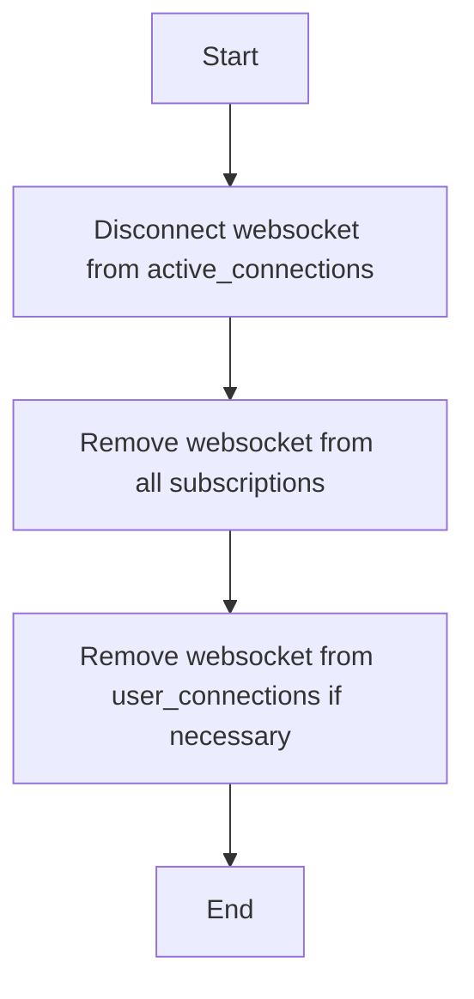
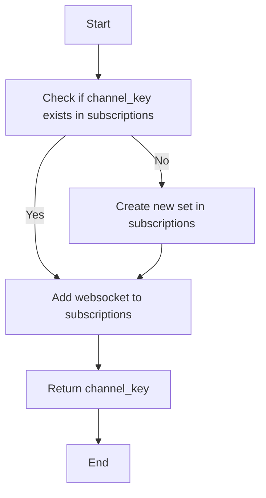
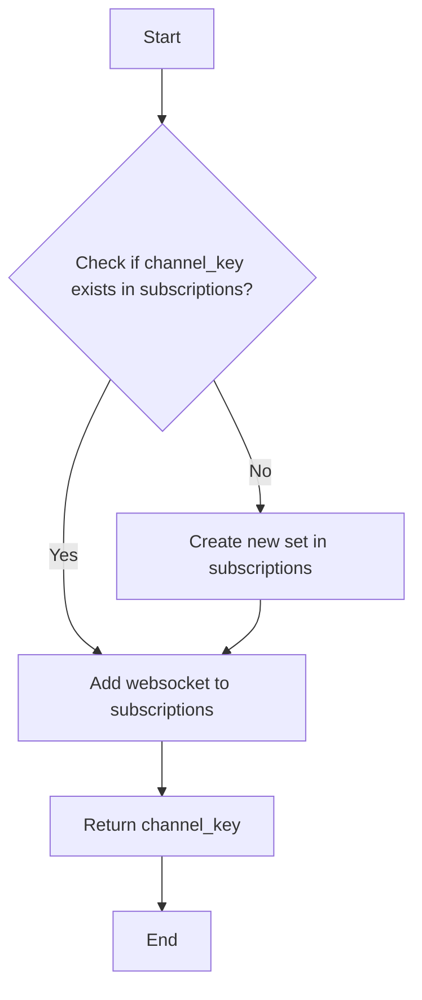
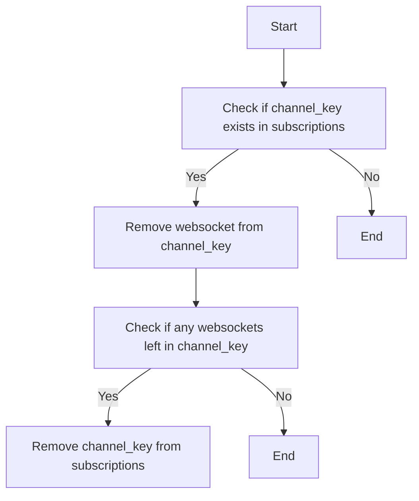
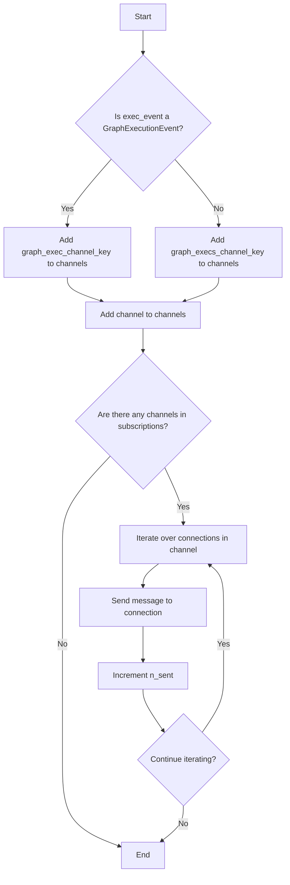
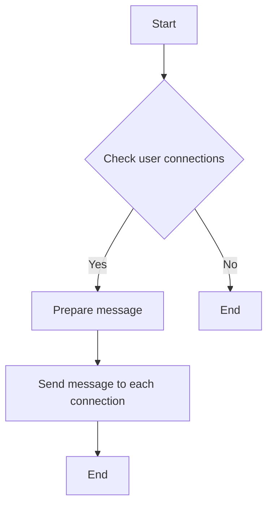
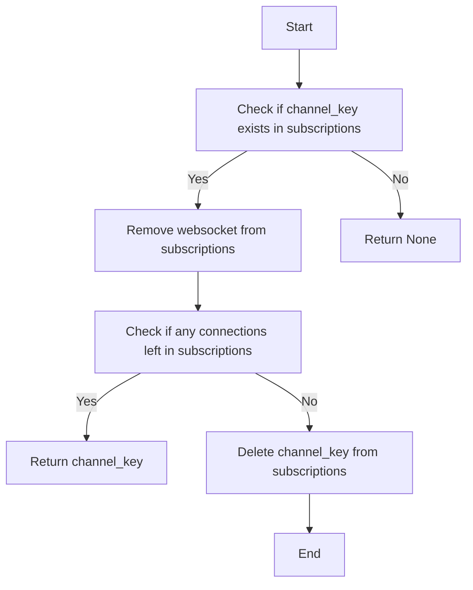

# `.\AutoGPT\autogpt_platform\backend\backend\api\conn_manager.py` 详细设计文档

The ConnectionManager class manages WebSocket connections, subscriptions, and message distribution for execution updates and notifications in a distributed system.

## 整体流程



## 类结构

```
ConnectionManager (管理类)
├── active_connections (WebSocket集合)
│   ├── WebSocket连接
│   └── ...
├── subscriptions (字典)
│   ├── channel_key (字符串)
│   └── WebSocket集合
│       ├── WebSocket连接
│       └── ...
└── user_connections (字典)
    ├── user_id (字符串)
    └── WebSocket集合
        ├── WebSocket连接
        └── ... 
```

## 全局变量及字段


### `_EVENT_TYPE_TO_METHOD_MAP`
    
Mapping of execution event types to WebSocket methods.

类型：`dict[ExecutionEventType, WSMethod]`
    


### `_graph_exec_channel_key`
    
Function to generate a channel key for a single graph execution.

类型：`function(str, *, graph_exec_id: str) -> str`
    


### `_graph_execs_channel_key`
    
Function to generate a channel key for all executions of a graph.

类型：`function(str, *, graph_id: str) -> str`
    


### `ConnectionManager.active_connections`
    
Set of active WebSocket connections.

类型：`Set[WebSocket]`
    


### `ConnectionManager.subscriptions`
    
Dictionary mapping channel keys to sets of WebSocket connections subscribed to those channels.

类型：`Dict[str, Set[WebSocket]]`
    


### `ConnectionManager.user_connections`
    
Dictionary mapping user IDs to sets of WebSocket connections for those users.

类型：`Dict[str, Set[WebSocket]]`
    
    

## 全局函数及方法


### `_graph_exec_channel_key`

Generate a unique channel key for a specific graph execution.

参数：

- `user_id`：`str`，The unique identifier for the user.
- `graph_exec_id`：`str`，The unique identifier for the graph execution.

返回值：`str`，A unique channel key for the specified graph execution.

#### 流程图



#### 带注释源码

```python
def _graph_exec_channel_key(user_id: str, *, graph_exec_id: str) -> str:
    return f"{user_id}|graph_exec#{graph_exec_id}"
```


### `_graph_exec_channel_key`

Generate a unique channel key for a specific graph execution.

参数：

- `user_id`：`str`，The unique identifier for the user.
- `graph_exec_id`：`str`，The unique identifier for the graph execution.

返回值：`str`，A unique channel key for the specified graph execution.

#### 流程图


#### 带注释源码

```python
def _graph_exec_channel_key(user_id: str, *, graph_exec_id: str) -> str:
    return f"{user_id}|graph_exec#{graph_exec_id}"
```


### `ConnectionManager.connect_socket`

Establishes a WebSocket connection and adds it to the active connections and user-specific connections.

参数：

- `websocket`：`WebSocket`，The WebSocket connection to be established.
- `user_id`：`str`，The identifier of the user associated with the WebSocket connection.

返回值：`None`，No return value.

#### 流程图



#### 带注释源码

```python
async def connect_socket(self, websocket: WebSocket, *, user_id: str):
    await websocket.accept()  # Accept the WebSocket connection
    self.active_connections.add(websocket)  # Add to active connections
    if user_id not in self.user_connections:  # Check if user_id exists in user_connections
        self.user_connections[user_id] = set()  # Create new set if not existing
    self.user_connections[user_id].add(websocket)  # Add to user_connections
```


### ConnectionManager.disconnect_socket

Disconnects a WebSocket connection from the system.

参数：

- `websocket`：`WebSocket`，The WebSocket connection to be disconnected.
- `user_id`：`str`，The user ID associated with the WebSocket connection.

返回值：`None`，No return value.

#### 流程图



#### 带注释源码

```python
def disconnect_socket(self, websocket: WebSocket, *, user_id: str):
    # Remove the websocket from the active_connections set
    self.active_connections.discard(websocket)
    
    # Remove the websocket from all subscriptions
    for subscribers in self.subscriptions.values():
        subscribers.discard(websocket)
    
    # Remove the websocket from user_connections if it's the last one
    user_conns = self.user_connections.get(user_id)
    if user_conns is not None:
        user_conns.discard(websocket)
        if not user_conns:
            self.user_connections.pop(user_id, None)
```


### ConnectionManager.subscribe_graph_exec

This method allows a user to subscribe to graph execution updates for a specific graph execution ID.

参数：

- `user_id`：`str`，The unique identifier for the user.
- `graph_exec_id`：`str`，The unique identifier for the graph execution.
- `websocket`：`WebSocket`，The WebSocket connection to which updates should be sent.

返回值：`str`，The channel key for the subscription.

#### 流程图



#### 带注释源码

```python
async def _subscribe(self, channel_key: str, websocket: WebSocket) -> str:
    # Check if the channel_key exists in the subscriptions dictionary
    if channel_key not in self.subscriptions:
        # If not, create a new set for this channel_key
        self.subscriptions[channel_key] = set()
    # Add the websocket to the set of websockets for this channel_key
    self.subscriptions[channel_key].add(websocket)
    # Return the channel_key
    return channel_key
```


### `ConnectionManager.subscribe_graph_execs`

This method allows a user to subscribe to receive updates for all executions of a specific graph.

参数：

- `user_id`：`str`，The unique identifier for the user.
- `graph_id`：`str`，The unique identifier for the graph.
- `websocket`：`WebSocket`，The WebSocket connection to which updates should be sent.

返回值：`str`，The channel key for the subscription.

#### 流程图



#### 带注释源码

```python
async def subscribe_graph_execs(
    self, *, user_id: str, graph_id: str, websocket: WebSocket
) -> str:
    return await self._subscribe(
        _graph_execs_channel_key(user_id, graph_id=graph_id), websocket
    )
```


### `ConnectionManager.unsubscribe_graph_exec`

This method unsubscribes a WebSocket connection from receiving updates for a specific graph execution.

参数：

- `user_id`：`str`，The unique identifier for the user.
- `graph_exec_id`：`str`，The unique identifier for the graph execution.
- `websocket`：`WebSocket`，The WebSocket connection to unsubscribe.

返回值：`str | None`，The channel key if the unsubscribe was successful, otherwise `None`.

#### 流程图


#### 带注释源码

```python
async def unsubscribe_graph_exec(
    self, *, user_id: str, graph_exec_id: str, websocket: WebSocket
) -> str | None:
    return await self._unsubscribe(
        _graph_exec_channel_key(user_id, graph_exec_id=graph_exec_id), websocket
    )
```


### `ConnectionManager.unsubscribe_graph_exec`

This method unsubscribes a WebSocket connection from receiving updates for a specific graph execution.

参数：

- `user_id`：`str`，The unique identifier for the user.
- `graph_exec_id`：`str`，The unique identifier for the graph execution.
- `websocket`：`WebSocket`，The WebSocket connection to unsubscribe.

返回值：`str | None`，The channel key if the unsubscribe was successful, otherwise `None`.

#### 流程图



#### 带注释源码

```python
async def _unsubscribe(self, channel_key: str, websocket: WebSocket) -> str | None:
    # Check if the channel_key exists in the subscriptions
    if channel_key in self.subscriptions:
        # Remove the websocket from the channel_key
        self.subscriptions[channel_key].discard(websocket)
        # Check if there are any websockets left in the channel_key
        if not self.subscriptions[channel_key]:
            # Remove the channel_key from the subscriptions
            del self.subscriptions[channel_key]
        # Return the channel_key if the unsubscribe was successful
        return channel_key
    # Return None if the unsubscribe was not successful
    return None
```


### send_execution_update

This function sends an execution update to all WebSocket connections that are subscribed to the relevant channels based on the execution event provided.

参数：

- `exec_event`：`GraphExecutionEvent | NodeExecutionEvent`，The execution event that contains the update information.

返回值：`int`，The number of connections that received the update.

#### 流程图



#### 带注释源码

```python
async def send_execution_update(self, exec_event: GraphExecutionEvent | NodeExecutionEvent) -> int:
    graph_exec_id = (
        exec_event.id
        if isinstance(exec_event, GraphExecutionEvent)
        else exec_event.graph_exec_id
    )

    n_sent = 0

    channels: set[str] = {
        # Send update to listeners for this graph execution
        _graph_exec_channel_key(exec_event.user_id, graph_exec_id=graph_exec_id)
    }
    if isinstance(exec_event, GraphExecutionEvent):
        # Send update to listeners for all executions of this graph
        channels.add(
            _graph_execs_channel_key(
                exec_event.user_id, graph_id=exec_event.graph_id
            )
        )

    for channel in channels.intersection(self.subscriptions.keys()):
        message = WSMessage(
            method=_EVENT_TYPE_TO_METHOD_MAP[exec_event.event_type],
            channel=channel,
            data=exec_event.model_dump(),
        ).model_dump_json()
        for connection in self.subscriptions[channel]:
            await connection.send_text(message)
            n_sent += 1

    return n_sent
```


### `ConnectionManager.send_notification`

Send a notification to all websocket connections belonging to a user.

参数：

- `user_id`：`str`，The identifier of the user to send the notification to.
- `payload`：`NotificationPayload`，The payload containing the notification data.

返回值：`int`，The number of connections that received the notification.

#### 流程图



#### 带注释源码

```python
async def send_notification(
    self, *, user_id: str, payload: NotificationPayload
) -> int:
    """Send a notification to all websocket connections belonging to a user."""
    message = WSMessage(
        method=WSMethod.NOTIFICATION,
        data=payload.model_dump(),
    ).model_dump_json()

    connections = tuple(self.user_connections.get(user_id, set()))
    if not connections:
        return 0

    await asyncio.gather(
        *(connection.send_text(message) for connection in connections),
        return_exceptions=True,
    )

    return len(connections)
```


### ConnectionManager._subscribe

This method is responsible for subscribing a WebSocket connection to a specific channel based on the provided channel key.

参数：

- `channel_key`：`str`，The unique key for the channel to which the WebSocket connection is to be subscribed.
- `websocket`：`WebSocket`，The WebSocket connection to be subscribed to the channel.

返回值：`str`，The channel key of the subscribed channel.

#### 流程图

```mermaid
graph TD
    A[Start] --> B[Check if channel_key exists in subscriptions]
    B -- Yes --> C[Add websocket to subscriptions[channel_key]]
    B -- No --> D[Create new set for channel_key in subscriptions]
    D --> C
    C --> E[Return channel_key]
    E --> F[End]
```

#### 带注释源码

```python
async def _subscribe(self, channel_key: str, websocket: WebSocket) -> str:
    # Check if the channel_key exists in the subscriptions dictionary
    if channel_key not in self.subscriptions:
        # If not, create a new set for this channel_key
        self.subscriptions[channel_key] = set()
    # Add the websocket to the set of websockets for this channel_key
    self.subscriptions[channel_key].add(websocket)
    # Return the channel_key
    return channel_key
```


### ConnectionManager._unsubscribe

This method is responsible for unsubscribing a WebSocket connection from a specific channel in the ConnectionManager.

参数：

- `channel_key`：`str`，The key of the channel from which the WebSocket connection should be unsubscribed.
- `websocket`：`WebSocket`，The WebSocket connection to be unsubscribed from the channel.

返回值：`str | None`，The channel key if the unsubscribe was successful, otherwise `None`.

#### 流程图



#### 带注释源码

```python
async def _unsubscribe(self, channel_key: str, websocket: WebSocket) -> str | None:
    # Check if the channel_key exists in the subscriptions
    if channel_key in self.subscriptions:
        # Remove the websocket from the subscriptions
        self.subscriptions[channel_key].discard(websocket)
        # Check if there are any connections left in the subscriptions
        if not self.subscriptions[channel_key]:
            # If no connections left, delete the channel_key from subscriptions
            del self.subscriptions[channel_key]
        # Return the channel_key if the unsubscribe was successful
        return channel_key
    # Return None if the channel_key does not exist
    return None
```


## 关键组件


### 张量索引与惰性加载

张量索引与惰性加载是代码中处理数据访问和存储的关键组件，它允许对大型数据集进行高效访问，同时延迟实际数据的加载，以优化性能和资源使用。

### 反量化支持

反量化支持是代码中用于处理量化数据的关键组件，它允许在量化过程中进行反向操作，以恢复原始数据，确保数据处理的准确性。

### 量化策略

量化策略是代码中用于优化数据表示和存储的关键组件，它通过减少数据精度来减少内存使用，同时保持足够的精度以满足应用需求。


## 问题及建议


### 已知问题

-   **全局状态管理**: `ConnectionManager` 类中使用了全局状态来管理活跃的连接和订阅，这可能导致状态难以追踪和维护。建议考虑使用依赖注入或服务定位器模式来管理这些状态。
-   **错误处理**: 代码中没有明确的错误处理机制。在发送消息到 WebSocket 连接时，如果连接已经关闭或发生其他错误，应该有相应的错误处理逻辑。
-   **并发控制**: `send_execution_update` 方法中使用了 `asyncio.gather` 来并发发送消息，但没有考虑到并发控制。如果多个事件同时触发，可能会导致重复发送消息。
-   **代码复用**: `_graph_exec_channel_key` 和 `_graph_execs_channel_key` 函数的逻辑相似，可以考虑将它们合并为一个函数以减少代码重复。

### 优化建议

-   **引入依赖注入**: 将 `ConnectionManager` 的状态管理移至外部服务，通过构造函数注入，以便更好地控制和管理状态。
-   **增加错误处理**: 在发送消息到 WebSocket 连接时，增加异常处理逻辑，确保在发生错误时能够优雅地处理。
-   **实现并发控制**: 在发送消息前，检查事件是否已经被处理，以避免重复发送。
-   **合并代码重复**: 将 `_graph_exec_channel_key` 和 `_graph_execs_channel_key` 函数的逻辑合并，减少代码重复。
-   **使用异步队列**: 考虑使用异步队列来管理事件和消息，这样可以更好地控制消息的发送顺序和并发处理。
-   **日志记录**: 增加日志记录功能，以便于调试和监控系统的运行状态。


## 其它


### 设计目标与约束

- 设计目标：
  - 实现一个高效的WebSocket连接管理器，能够处理多个用户和多个图执行的订阅和通知。
  - 确保消息的及时传递，减少延迟和消息丢失。
  - 提供灵活的订阅和取消订阅机制，允许用户根据需要订阅特定的图执行或所有图执行。
- 约束：
  - 使用FastAPI框架进行WebSocket通信。
  - 限制每个用户可以订阅的图执行数量，以防止资源耗尽。
  - 确保所有操作都是异步执行的，以避免阻塞事件循环。

### 错误处理与异常设计

- 错误处理：
  - 在WebSocket连接过程中，捕获并处理可能的异常，如连接拒绝、发送失败等。
  - 对于发送消息时发生的异常，记录错误信息并尝试重新发送。
- 异常设计：
  - 定义自定义异常类，用于处理特定的错误情况，如订阅失败、取消订阅失败等。
  - 异常类应提供清晰的错误信息和恢复策略。

### 数据流与状态机

- 数据流：
  - 用户通过WebSocket连接到服务器。
  - 用户可以订阅特定的图执行或所有图执行。
  - 当图执行事件发生时，服务器将事件通知给所有订阅了该事件的WebSocket连接。
- 状态机：
  - WebSocket连接状态：连接中、已订阅、未订阅。
  - 图执行订阅状态：已订阅、未订阅。

### 外部依赖与接口契约

- 外部依赖：
  - FastAPI框架：用于创建WebSocket服务器。
  - asyncio库：用于异步编程。
  - typing库：用于类型注解。
- 接口契约：
  - WebSocket连接接口：提供连接、断开连接、发送消息等功能。
  - 图执行事件接口：定义图执行事件的数据结构和事件类型。
  - 通知接口：定义通知的数据结构和发送通知的功能。

    