# `.\AutoGPT\autogpt_platform\backend\backend\api\conn_manager_test.py` 详细设计文档

This code manages WebSocket connections for a real-time application, handling connection, disconnection, subscription, unsubscription, and sending execution results and notifications to connected users.

## 整体流程

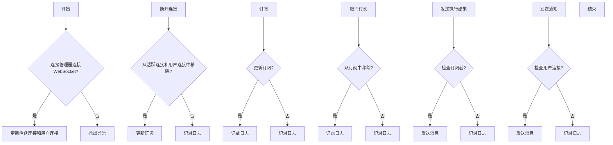

## 类结构

```
ConnectionManager (连接管理器)
├── active_connections (活跃连接)
│   ├── WebSocket (WebSocket连接)
│   └── ...
├── subscriptions (订阅)
│   ├── user_id|graph_exec#graph_exec_id (用户ID和执行ID)
│   └── ...
├── user_connections (用户连接)
│   ├── user_id (用户ID)
│   └── WebSocket (WebSocket连接)
└── ... 
```

## 全局变量及字段


### `ConnectionManager`
    
Manages WebSocket connections and subscriptions.

类型：`class`
    


### `WebSocket`
    
Represents a WebSocket connection.

类型：`class`
    


### `NotificationPayload`
    
Represents a notification payload.

类型：`class`
    


### `WSMessage`
    
Represents a WebSocket message.

类型：`class`
    


### `WSMethod`
    
Represents a WebSocket method type.

类型：`class`
    


### `ExecutionStatus`
    
Represents the status of an execution.

类型：`class`
    


### `GraphExecutionEvent`
    
Represents an event for a graph execution.

类型：`class`
    


### `NodeExecutionEvent`
    
Represents an event for a node execution.

类型：`class`
    


### `ConnectionManager.active_connections`
    
Set of active WebSocket connections.

类型：`set[WebSocket]`
    


### `ConnectionManager.subscriptions`
    
Dictionary of subscriptions, keyed by channel and mapping to a set of WebSocket connections.

类型：`dict[str, set[WebSocket]]`
    


### `ConnectionManager.user_connections`
    
Dictionary of user connections, keyed by user ID and mapping to a set of WebSocket connections.

类型：`dict[str, set[WebSocket]]`
    


### `WebSocket.send_text`
    
Method to send text to the WebSocket connection.

类型：`Callable[[str], Awaitable[None]]`
    


### `NotificationPayload.type`
    
Type of the notification.

类型：`str`
    


### `NotificationPayload.event`
    
Event associated with the notification.

类型：`str`
    


### `WSMessage.method`
    
Method type of the WebSocket message.

类型：`WSMethod`
    


### `WSMessage.channel`
    
Channel associated with the WebSocket message.

类型：`str`
    


### `WSMessage.data`
    
Data associated with the WebSocket message.

类型：`dict`
    


### `GraphExecutionEvent.id`
    
ID of the graph execution.

类型：`str`
    


### `GraphExecutionEvent.user_id`
    
User ID associated with the graph execution.

类型：`str`
    


### `GraphExecutionEvent.graph_id`
    
Graph ID associated with the graph execution.

类型：`str`
    


### `GraphExecutionEvent.graph_version`
    
Version of the graph associated with the graph execution.

类型：`int`
    


### `GraphExecutionEvent.preset_id`
    
Preset ID associated with the graph execution.

类型：`Optional[str]`
    


### `GraphExecutionEvent.status`
    
Status of the graph execution.

类型：`ExecutionStatus`
    


### `GraphExecutionEvent.started_at`
    
Start time of the graph execution.

类型：`datetime`
    


### `GraphExecutionEvent.ended_at`
    
End time of the graph execution.

类型：`datetime`
    


### `GraphExecutionEvent.stats`
    
Statistics of the graph execution.

类型：`GraphExecutionEvent.Stats`
    


### `GraphExecutionEvent.inputs`
    
Inputs associated with the graph execution.

类型：`dict[str, str]`
    


### `GraphExecutionEvent.credential_inputs`
    
Credential inputs associated with the graph execution.

类型：`Optional[dict[str, str]]`
    


### `GraphExecutionEvent.nodes_input_masks`
    
Nodes input masks associated with the graph execution.

类型：`Optional[dict[str, str]]`
    


### `GraphExecutionEvent.outputs`
    
Outputs associated with the graph execution.

类型：`dict[str, list[str]]`
    


### `NodeExecutionEvent.node_exec_id`
    
ID of the node execution.

类型：`str`
    


### `NodeExecutionEvent.node_id`
    
ID of the node associated with the node execution.

类型：`str`
    


### `NodeExecutionEvent.block_id`
    
ID of the block associated with the node execution.

类型：`str`
    


### `NodeExecutionEvent.status`
    
Status of the node execution.

类型：`ExecutionStatus`
    


### `NodeExecutionEvent.input_data`
    
Input data associated with the node execution.

类型：`dict[str, str]`
    


### `NodeExecutionEvent.output_data`
    
Output data associated with the node execution.

类型：`dict[str, list[str]]`
    


### `NodeExecutionEvent.add_time`
    
Time when the node execution was added.

类型：`datetime`
    


### `NodeExecutionEvent.queue_time`
    
Queue time of the node execution.

类型：`Optional[datetime]`
    


### `NodeExecutionEvent.start_time`
    
Start time of the node execution.

类型：`datetime`
    


### `NodeExecutionEvent.end_time`
    
End time of the node execution.

类型：`datetime`
    
    

## 全局函数及方法


### test_connect

This function tests the connection of a WebSocket to a ConnectionManager instance.

参数：

- `connection_manager`：`ConnectionManager`，The ConnectionManager instance to which the WebSocket is connected.
- `mock_websocket`：`AsyncMock`，The WebSocket object that is being tested for connection.

返回值：`None`，This function does not return any value.

#### 流程图

```mermaid
graph TD
    A[Start] --> B[connection_manager.connect_socket(mock_websocket, user_id="user-1")]
    B --> C[assert mock_websocket in connection_manager.active_connections]
    C --> D[assert mock_websocket in connection_manager.user_connections["user-1"]]
    D --> E[assert mock_websocket.accept.assert_called_once()]
    E --> F[End]
```

#### 带注释源码

```python
@pytest.mark.asyncio
async def test_connect(
    connection_manager: ConnectionManager, mock_websocket: AsyncMock
) -> None:
    # Connect the mock_websocket to the connection_manager with user_id "user-1"
    await connection_manager.connect_socket(mock_websocket, user_id="user-1")
    
    # Assert that the mock_websocket is in the active_connections list
    assert mock_websocket in connection_manager.active_connections
    
    # Assert that the mock_websocket is in the user_connections dictionary under "user-1"
    assert mock_websocket in connection_manager.user_connections["user-1"]
    
    # Assert that the accept method of mock_websocket was called once
    mock_websocket.accept.assert_called_once()
```


### test_disconnect

This function tests the disconnection of a WebSocket connection from the ConnectionManager.

参数：

- connection_manager：`ConnectionManager`，The ConnectionManager instance to perform the disconnection.
- mock_websocket：`AsyncMock`，The WebSocket mock object to be disconnected.

返回值：`None`，This function does not return any value.

#### 流程图

```mermaid
graph TD
    A[Start] --> B[Add mock_websocket to active_connections]
    B --> C[Add mock_websocket to subscriptions["test_channel_42"]]
    C --> D[Add mock_websocket to user_connections["user-1"]]
    D --> E[Call disconnect_socket(mock_websocket, user_id="user-1")]
    E --> F[Assert mock_websocket not in active_connections]
    F --> G[Assert mock_websocket not in subscriptions["test_channel_42"]]
    G --> H[Assert "user-1" not in user_connections]
    H --> I[End]
```

#### 带注释源码

```python
def test_disconnect(
    connection_manager: ConnectionManager, mock_websocket: AsyncMock
) -> None:
    connection_manager.active_connections.add(mock_websocket)
    connection_manager.subscriptions["test_channel_42"] = {mock_websocket}
    connection_manager.user_connections["user-1"] = {mock_websocket}

    connection_manager.disconnect_socket(mock_websocket, user_id="user-1")

    assert mock_websocket not in connection_manager.active_connections
    assert mock_websocket not in connection_manager.subscriptions["test_channel_42"]
    assert "user-1" not in connection_manager.user_connections
``` 


### test_subscribe

This function tests the subscription of a WebSocket connection to a graph execution event.

参数：

- `connection_manager`：`ConnectionManager`，The connection manager instance.
- `mock_websocket`：`AsyncMock`，The mock WebSocket object used for testing.

返回值：`None`，No return value.

#### 流程图

```mermaid
graph TD
    A[Start] --> B[Call connection_manager.subscribe_graph_exec]
    B --> C{Is mock_websocket in connection_manager.subscriptions["user-1|graph_exec#graph-exec-1"]?}
    C -- Yes --> D[End]
    C -- No --> E[Error: WebSocket not subscribed]
    E --> F[End]
```

#### 带注释源码

```python
@pytest.mark.asyncio
async def test_subscribe(
    connection_manager: ConnectionManager, mock_websocket: AsyncMock
) -> None:
    await connection_manager.subscribe_graph_exec(
        user_id="user-1",
        graph_exec_id="graph-exec-1",
        websocket=mock_websocket,
    )
    assert (
        mock_websocket
        in connection_manager.subscriptions["user-1|graph_exec#graph-exec-1"]
    )
```


### test_unsubscribe

This function tests the unsubscribe functionality of the ConnectionManager class, ensuring that a websocket connection is removed from the appropriate subscriptions when the unsubscribe operation is called.

参数：

- connection_manager：`ConnectionManager`，The ConnectionManager instance used to manage connections.
- mock_websocket：`AsyncMock`，A mock WebSocket object representing the connection to be unsubscribed.
- user_id：`str`，The user ID associated with the connection to be unsubscribed.
- graph_exec_id：`str`，The graph execution ID associated with the connection to be unsubscribed.

返回值：`None`，This function does not return any value.

#### 流程图

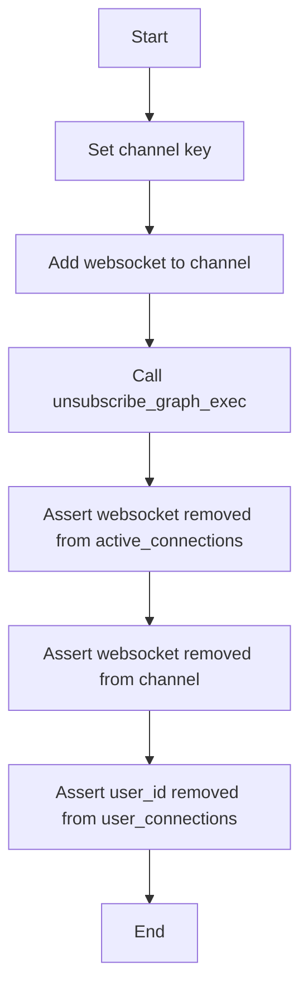

#### 带注释源码

```python
@pytest.mark.asyncio
async def test_unsubscribe(
    connection_manager: ConnectionManager, mock_websocket: AsyncMock
) -> None:
    channel_key = "user-1|graph_exec#graph-exec-1"
    connection_manager.subscriptions[channel_key] = {mock_websocket}

    await connection_manager.unsubscribe_graph_exec(
        user_id="user-1",
        graph_exec_id="graph-exec-1",
        websocket=mock_websocket,
    )

    assert "test_graph" not in connection_manager.subscriptions
```


### test_send_graph_execution_result

This function tests the sending of a graph execution result to a WebSocket connection.

参数：

- `connection_manager`：`ConnectionManager`，The connection manager instance that manages WebSocket connections.
- `mock_websocket`：`AsyncMock`，A mock WebSocket object used to simulate a real WebSocket connection.

返回值：`None`，This function does not return any value.

#### 流程图

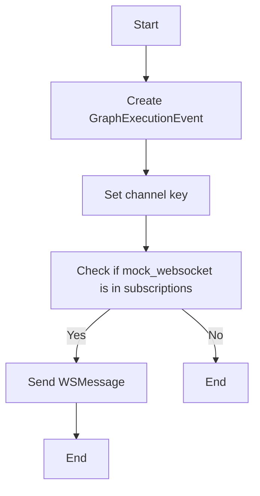

#### 带注释源码

```python
@pytest.mark.asyncio
async def test_send_graph_execution_result(
    connection_manager: ConnectionManager, mock_websocket: AsyncMock
) -> None:
    channel_key = "user-1|graph_exec#graph-exec-1"
    connection_manager.subscriptions[channel_key] = {mock_websocket}
    result = GraphExecutionEvent(
        id="graph-exec-1",
        user_id="user-1",
        graph_id="test_graph",
        graph_version=1,
        preset_id=None,
        status=ExecutionStatus.COMPLETED,
        started_at=datetime.now(tz=timezone.utc),
        ended_at=datetime.now(tz=timezone.utc),
        stats=GraphExecutionEvent.Stats(
            cost=0,
            duration=1.2,
            node_exec_time=0.5,
            node_exec_count=2,
        ),
        inputs={
            "input_1": "some input value :)",
            "input_2": "some *other* input value",
        },
        credential_inputs=None,
        nodes_input_masks=None,
        outputs={
            "the_output": ["some output value"],
            "other_output": ["sike there was another output"],
        },
    )

    await connection_manager.send_execution_update(result)

    mock_websocket.send_text.assert_called_once_with(
        WSMessage(
            method=WSMethod.GRAPH_EXECUTION_EVENT,
            channel="user-1|graph_exec#graph-exec-1",
            data=result.model_dump(),
        ).model_dump_json()
    )
```


### test_send_node_execution_result

This function tests the sending of a node execution result to a WebSocket connection.

参数：

- connection_manager：`ConnectionManager`，The connection manager instance that manages WebSocket connections.
- mock_websocket：`AsyncMock`，A mock WebSocket object used to simulate a real WebSocket connection.

返回值：`None`，This function does not return any value.

#### 流程图

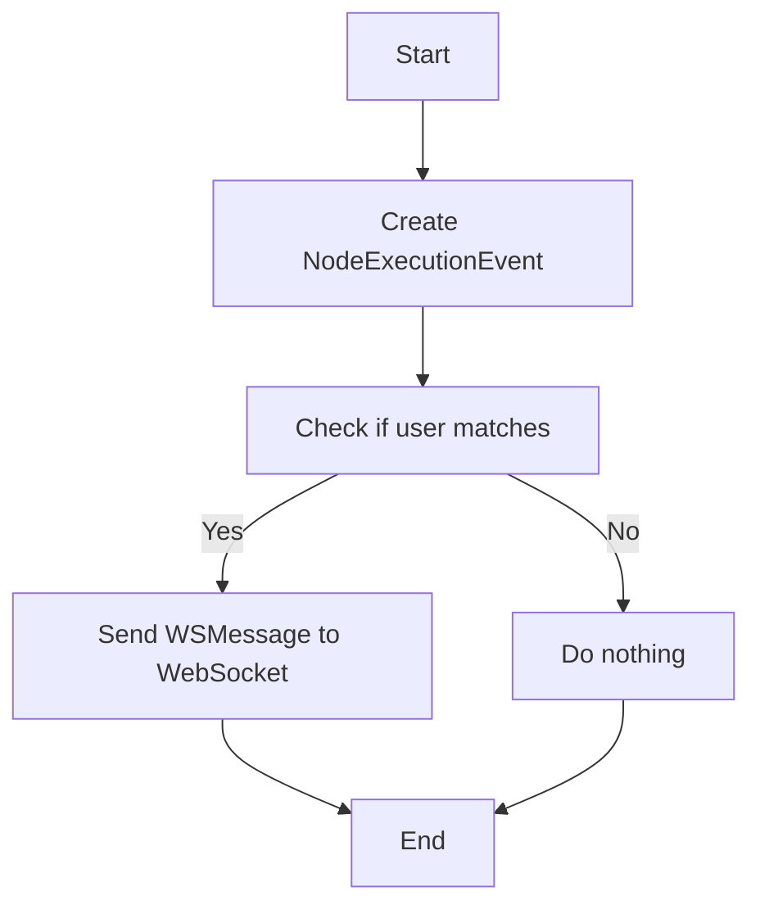

#### 带注释源码

```python
@pytest.mark.asyncio
async def test_send_node_execution_result(
    connection_manager: ConnectionManager, mock_websocket: AsyncMock
) -> None:
    channel_key = "user-1|graph_exec#graph-exec-1"
    connection_manager.subscriptions[channel_key] = {mock_websocket}
    result = NodeExecutionEvent(
        user_id="user-1",
        graph_id="test_graph",
        graph_version=1,
        graph_exec_id="graph-exec-1",
        node_exec_id="test_node_exec_id",
        node_id="test_node_id",
        block_id="test_block_id",
        status=ExecutionStatus.COMPLETED,
        input_data={"input1": "value1"},
        output_data={"output1": ["result1"]},
        add_time=datetime.now(tz=timezone.utc),
        queue_time=None,
        start_time=datetime.now(tz=timezone.utc),
        end_time=datetime.now(tz=timezone.utc),
    )

    await connection_manager.send_execution_update(result)

    mock_websocket.send_text.assert_called_once_with(
        WSMessage(
            method=WSMethod.NODE_EXECUTION_EVENT,
            channel="user-1|graph_exec#graph-exec-1",
            data=result.model_dump(),
        ).model_dump_json()
    )
```


### test_send_execution_result_user_mismatch

This function tests the behavior of the `send_execution_update` method when an execution result is sent with a user ID that does not match the subscribed user ID.

参数：

- connection_manager：`ConnectionManager`，The connection manager instance used to manage WebSocket connections.
- mock_websocket：`AsyncMock`，A mock WebSocket object used to simulate a WebSocket connection.

返回值：`None`，This function does not return any value.

#### 流程图

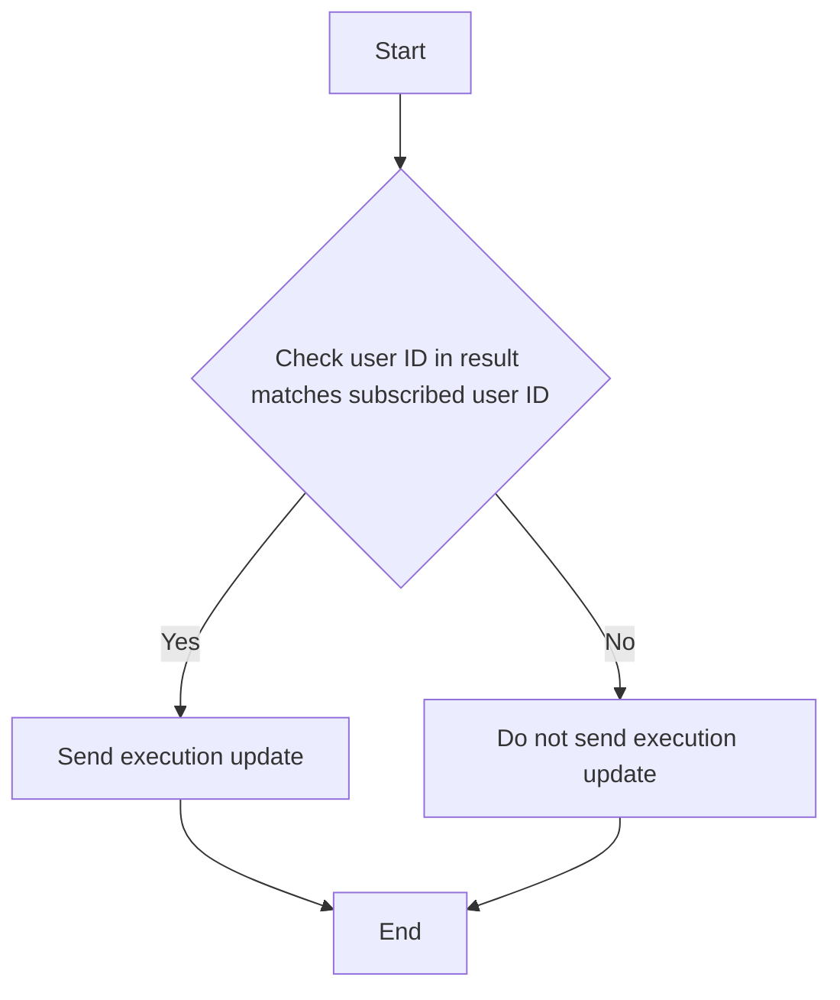

#### 带注释源码

```python
@pytest.mark.asyncio
async def test_send_execution_result_user_mismatch(
    connection_manager: ConnectionManager, mock_websocket: AsyncMock
) -> None:
    channel_key = "user-1|graph_exec#graph-exec-1"
    connection_manager.subscriptions[channel_key] = {mock_websocket}
    result = NodeExecutionEvent(
        user_id="user-2",
        graph_id="test_graph",
        graph_version=1,
        graph_exec_id="graph-exec-1",
        node_exec_id="test_node_exec_id",
        node_id="test_node_id",
        block_id="test_block_id",
        status=ExecutionStatus.COMPLETED,
        input_data={"input1": "value1"},
        output_data={"output1": ["result1"]},
        add_time=datetime.now(tz=timezone.utc),
        queue_time=None,
        start_time=datetime.now(tz=timezone.utc),
        end_time=datetime.now(tz=timezone.utc),
    )

    await connection_manager.send_execution_update(result)

    mock_websocket.send_text.assert_not_called()
```


### test_send_execution_result_no_subscribers

This function tests the behavior of the `send_execution_update` method when there are no subscribers for the given execution result.

参数：

- connection_manager：`ConnectionManager`，The connection manager instance used to manage WebSocket connections.
- mock_websocket：`AsyncMock`，A mock WebSocket object used to simulate a WebSocket connection.

返回值：`None`，This function does not return any value.

#### 流程图

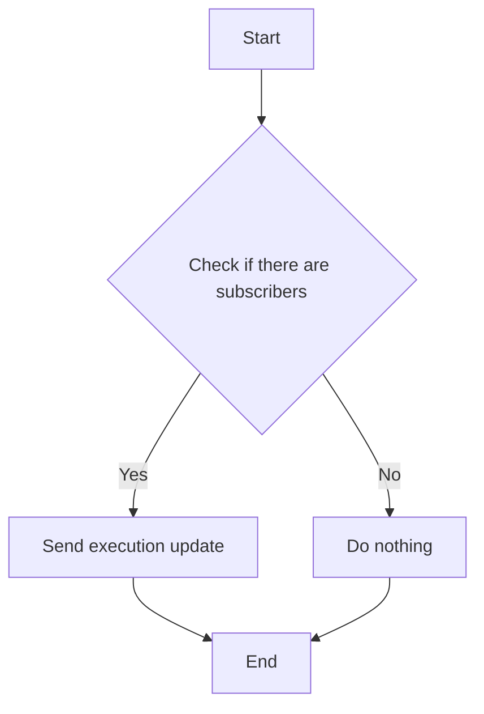

#### 带注释源码

```python
@pytest.mark.asyncio
async def test_send_execution_result_no_subscribers(
    connection_manager: ConnectionManager, mock_websocket: AsyncMock
) -> None:
    result = NodeExecutionEvent(
        user_id="user-1",
        graph_id="test_graph",
        graph_version=1,
        graph_exec_id="test_exec_id",
        node_exec_id="test_node_exec_id",
        node_id="test_node_id",
        block_id="test_block_id",
        status=ExecutionStatus.COMPLETED,
        input_data={"input1": "value1"},
        output_data={"output1": ["result1"]},
        add_time=datetime.now(),
        queue_time=None,
        start_time=datetime.now(),
        end_time=datetime.now(),
    )

    await connection_manager.send_execution_update(result)

    mock_websocket.send_text.assert_not_called()
```


### test_send_notification

This function tests the sending of a notification to a specific user through a WebSocket connection.

参数：

- connection_manager：`ConnectionManager`，The connection manager instance used to manage WebSocket connections.
- mock_websocket：`AsyncMock`，A mock WebSocket object used to simulate a WebSocket connection.

返回值：`None`，This function does not return any value.

#### 流程图

```mermaid
graph TD
    A[Start] --> B[connection_manager.user_connections["user-1"] contains mock_websocket]
    B -->|Yes| C[await connection_manager.send_notification(user_id="user-1", payload=NotificationPayload(type="info", event="hey"))]
    C --> D[assert mock_websocket.send_text.assert_called_once()]
    D --> E[assert expected_message == sent_message]
    E --> F[End]
```

#### 带注释源码

```python
@pytest.mark.asyncio
async def test_send_notification(
    connection_manager: ConnectionManager, mock_websocket: AsyncMock
) -> None:
    # Ensure that the mock_websocket is in the user_connections dictionary for user-1
    connection_manager.user_connections["user-1"] = {mock_websocket}

    # Send a notification to user-1 with the specified payload
    await connection_manager.send_notification(
        user_id="user-1", payload=NotificationPayload(type="info", event="hey")
    )

    # Assert that send_text was called once on the mock_websocket
    mock_websocket.send_text.assert_called_once()

    # Retrieve the sent message and the expected message
    sent_message = mock_websocket.send_text.call_args[0][0]
    expected_message = WSMessage(
        method=WSMethod.NOTIFICATION,
        data={"type": "info", "event": "hey"},
    ).model_dump_json()

    # Assert that the sent message matches the expected message
    assert sent_message == expected_message
``` 


### ConnectionManager.connect_socket

连接WebSocket客户端到服务器。

参数：

- `websocket`：`WebSocket`，WebSocket客户端实例，用于发送和接收消息。
- `user_id`：`str`，用户ID，用于标识连接的用户。

返回值：`None`，无返回值。

#### 流程图

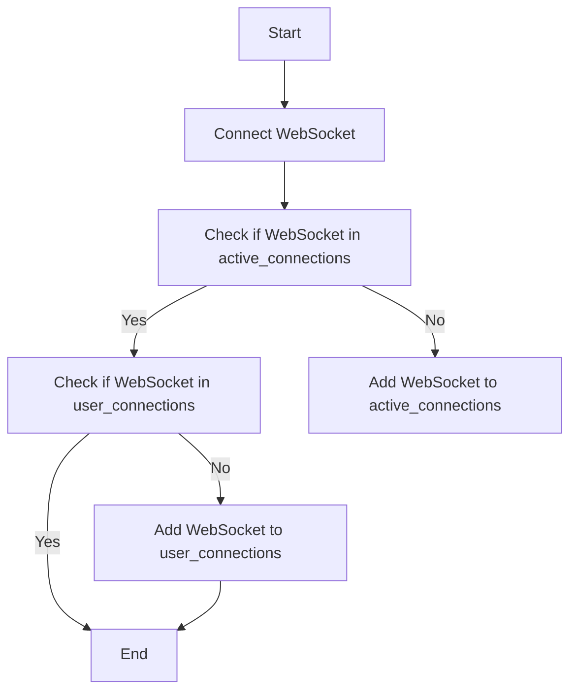

#### 带注释源码

```python
from fastapi import WebSocket

class ConnectionManager:
    def __init__(self):
        self.active_connections: set = set()
        self.user_connections: dict = {}

    async def connect_socket(self, websocket: WebSocket, user_id: str) -> None:
        self.active_connections.add(websocket)
        self.user_connections.setdefault(user_id, set()).add(websocket)
``` 


### ConnectionManager.disconnect_socket

断开与指定WebSocket连接的连接。

参数：

- `websocket`：`WebSocket`，要断开的WebSocket连接。
- `user_id`：`str`，与连接关联的用户ID。

返回值：无

#### 流程图

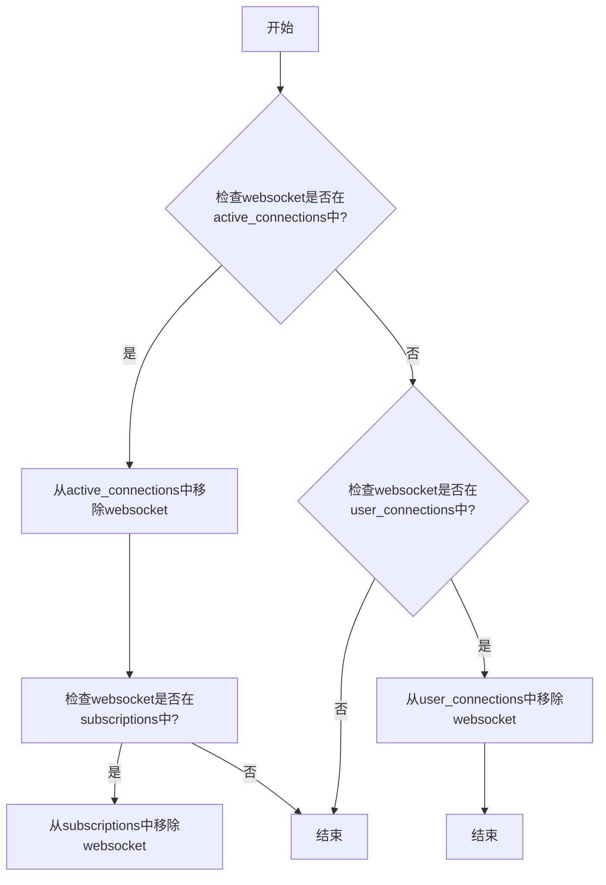

#### 带注释源码

```python
def disconnect_socket(self, websocket: WebSocket, user_id: str) -> None:
    # 从active_connections中移除websocket
    self.active_connections.discard(websocket)
    
    # 从user_connections中移除websocket
    if user_id in self.user_connections:
        self.user_connections[user_id].discard(websocket)
    
    # 从subscriptions中移除websocket
    for channel, websockets in self.subscriptions.items():
        if websocket in websockets:
            websockets.discard(websocket)
            if not websockets:
                del self.subscriptions[channel]
```


### ConnectionManager.subscribe_graph_exec

This function is responsible for subscribing a WebSocket connection to receive graph execution events for a specific user and graph execution ID.

参数：

- `user_id`：`str`，The user ID of the user to subscribe.
- `graph_exec_id`：`str`，The ID of the graph execution to subscribe to.
- `websocket`：`WebSocket`，The WebSocket connection to subscribe.

返回值：`None`，This function does not return any value.

#### 流程图

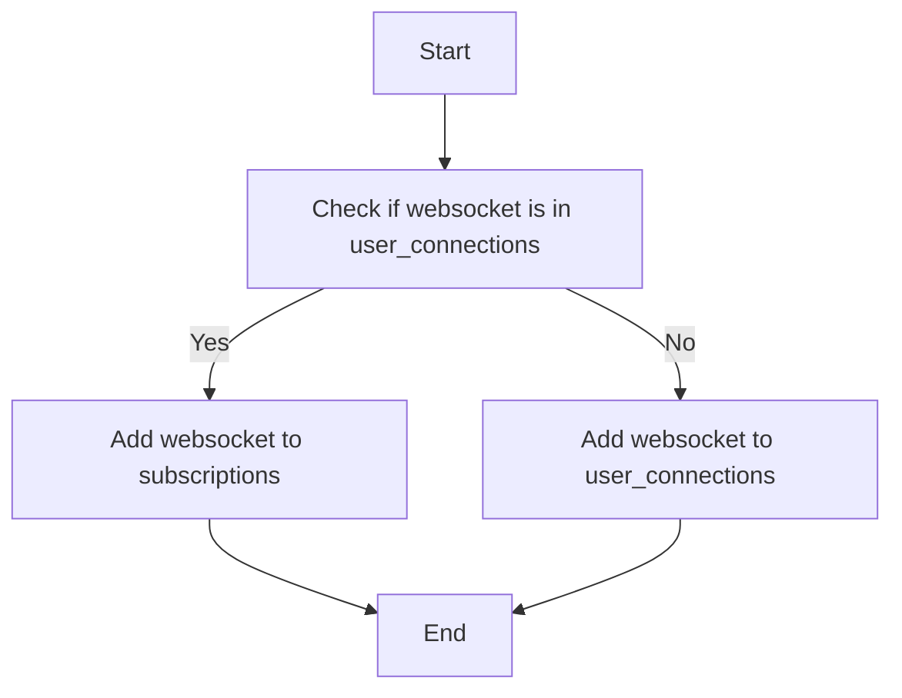

#### 带注释源码

```python
@pytest.mark.asyncio
async def test_subscribe(
    connection_manager: ConnectionManager, mock_websocket: AsyncMock
) -> None:
    await connection_manager.subscribe_graph_exec(
        user_id="user-1",
        graph_exec_id="graph-exec-1",
        websocket=mock_websocket,
    )
    assert (
        mock_websocket
        in connection_manager.subscriptions["user-1|graph_exec#graph-exec-1"]
    )
```


### ConnectionManager.unsubscribe_graph_exec

取消用户对特定图执行的订阅。

参数：

- `user_id`：`str`，用户的唯一标识符。
- `graph_exec_id`：`str`，图执行的唯一标识符。
- `websocket`：`WebSocket`，WebSocket连接对象。

返回值：`None`，无返回值。

#### 流程图

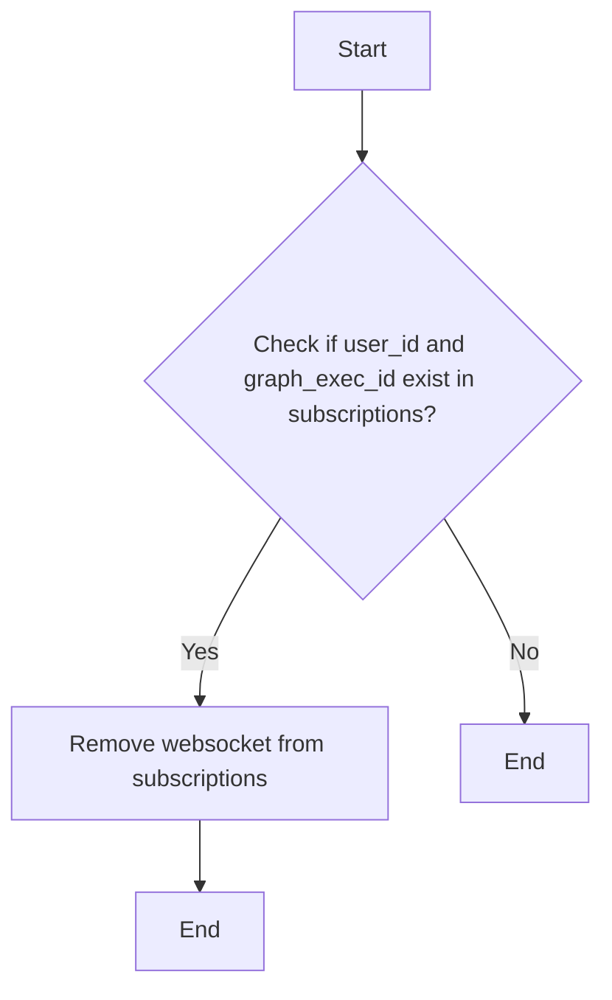

#### 带注释源码

```python
from backend.api.conn_manager import ConnectionManager

class ConnectionManager:
    # ... 其他代码 ...

    async def unsubscribe_graph_exec(self, user_id: str, graph_exec_id: str, websocket: WebSocket) -> None:
        channel_key = f"{user_id}|graph_exec#{graph_exec_id}"
        if channel_key in self.subscriptions:
            self.subscriptions[channel_key].remove(websocket)
            if not self.subscriptions[channel_key]:
                del self.subscriptions[channel_key]
```


### ConnectionManager.send_execution_update

This function sends an execution update to a WebSocket connection based on the provided result object.

参数：

- `result`：`NodeExecutionEvent` 或 `GraphExecutionEvent`，The result object containing the execution update information.

返回值：`None`，No return value.

#### 流程图

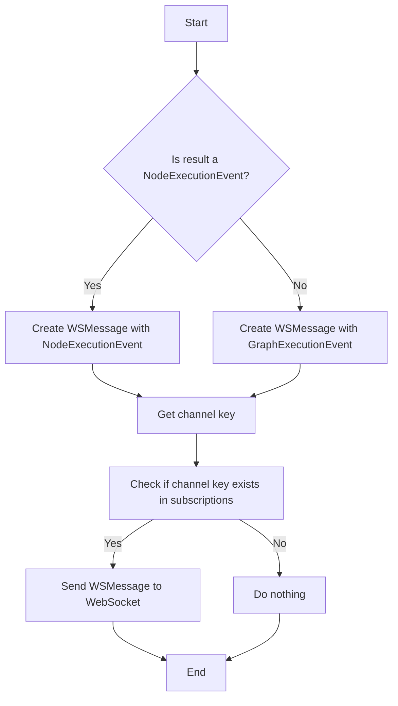

#### 带注释源码

```python
@pytest.mark.asyncio
async def test_send_execution_update(
    connection_manager: ConnectionManager, mock_websocket: AsyncMock
) -> None:
    channel_key = "user-1|graph_exec#graph-exec-1"
    connection_manager.subscriptions[channel_key] = {mock_websocket}
    result = GraphExecutionEvent(
        id="graph-exec-1",
        user_id="user-1",
        graph_id="test_graph",
        graph_version=1,
        preset_id=None,
        status=ExecutionStatus.COMPLETED,
        started_at=datetime.now(tz=timezone.utc),
        ended_at=datetime.now(tz=timezone.utc),
        stats=GraphExecutionEvent.Stats(
            cost=0,
            duration=1.2,
            node_exec_time=0.5,
            node_exec_count=2,
        ),
        inputs={
            "input_1": "some input value :)",
            "input_2": "some *other* input value",
        },
        credential_inputs=None,
        nodes_input_masks=None,
        outputs={
            "the_output": ["some output value"],
            "other_output": ["sike there was another output"],
        },
    )

    await connection_manager.send_execution_update(result)

    mock_websocket.send_text.assert_called_once_with(
        WSMessage(
            method=WSMethod.GRAPH_EXECUTION_EVENT,
            channel="user-1|graph_exec#graph-exec-1",
            data=result.model_dump(),
        ).model_dump_json()
    )
``` 


### ConnectionManager.send_notification

该函数负责向特定用户发送通知。

参数：

- `user_id`：`str`，用户的唯一标识符。
- `payload`：`NotificationPayload`，包含通知的类型和事件信息。

返回值：`None`，该函数不返回任何值。

#### 流程图

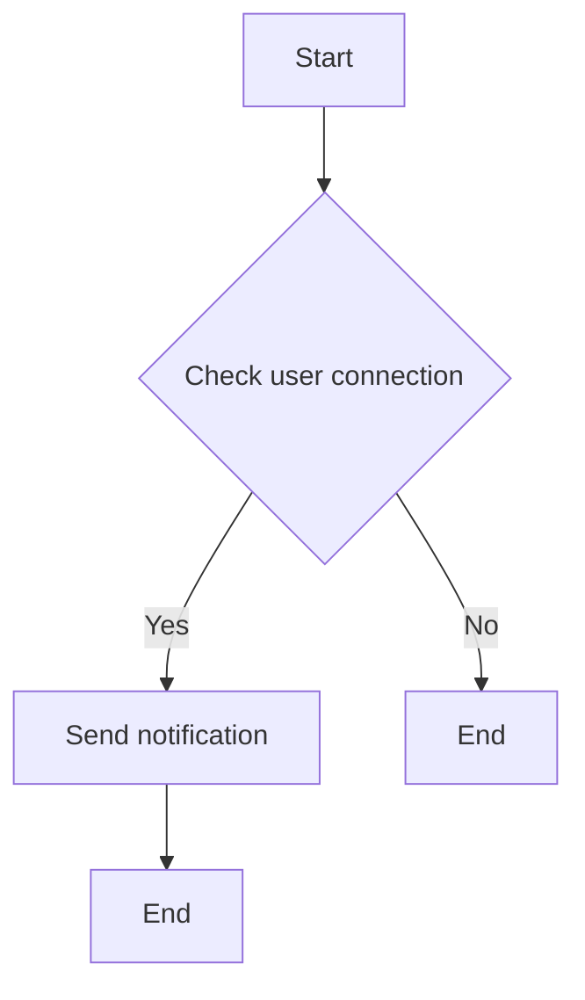

#### 带注释源码

```python
from backend.api.model import NotificationPayload, WSMessage, WSMethod

class ConnectionManager:
    # ... 其他代码 ...

    async def send_notification(self, user_id: str, payload: NotificationPayload) -> None:
        # 检查用户是否已连接
        if user_id in self.user_connections:
            # 获取用户的所有WebSocket连接
            websockets = self.user_connections[user_id]
            # 遍历WebSocket连接并发送通知
            for websocket in websockets:
                # 构建WSMessage对象
                ws_message = WSMessage(
                    method=WSMethod.NOTIFICATION,
                    data=payload.model_dump(),
                )
                # 发送JSON格式的消息
                await websocket.send_text(ws_message.model_dump_json())
```


## 关键组件


### 张量索引与惰性加载

张量索引与惰性加载是代码中处理数据结构的核心组件，它允许对大型数据集进行高效访问，同时减少内存消耗。

### 反量化支持

反量化支持是代码中用于处理量化数据的核心组件，它允许在量化过程中进行反向操作，以恢复原始数据。

### 量化策略

量化策略是代码中用于优化数据表示和处理的组件，它通过减少数据精度来减少内存和计算需求。


## 问题及建议


### 已知问题

-   **代码复用性低**：测试函数中使用了大量的`mock_websocket`和`connection_manager`实例，这可能导致代码难以维护和扩展。
-   **异常处理不足**：代码中没有明显的异常处理逻辑，如果发生错误，可能会导致测试失败或程序崩溃。
-   **测试覆盖率**：虽然代码中包含了一些测试用例，但可能没有覆盖所有可能的错误路径和边界条件。

### 优化建议

-   **使用工厂模式**：创建`mock_websocket`和`connection_manager`实例时，可以使用工厂模式来提高代码的复用性和可维护性。
-   **增加异常处理**：在关键操作中添加异常处理逻辑，确保程序在遇到错误时能够优雅地处理。
-   **提高测试覆盖率**：编写更多的测试用例，覆盖所有可能的错误路径和边界条件，确保代码的健壮性。
-   **代码重构**：对代码进行重构，提高代码的可读性和可维护性，例如使用更清晰的命名和模块化设计。
-   **使用异步编程的最佳实践**：确保异步代码遵循最佳实践，例如使用`async/await`语法和避免阻塞操作。


## 其它


### 设计目标与约束

- 设计目标：
  - 实现一个高效的WebSocket连接管理器，用于处理用户连接、订阅、消息发送等功能。
  - 确保消息的准确性和实时性，支持异步处理。
  - 提供单元测试，确保代码质量和稳定性。

- 约束条件：
  - 使用FastAPI框架进行WebSocket通信。
  - 遵循RESTful API设计原则。
  - 代码应具有良好的可读性和可维护性。

### 错误处理与异常设计

- 错误处理：
  - 使用try-except语句捕获和处理可能出现的异常。
  - 对于WebSocket连接错误，记录错误信息并尝试重新连接。
  - 对于数据解析错误，返回错误信息并终止操作。

- 异常设计：
  - 定义自定义异常类，用于处理特定错误情况。
  - 异常类应包含错误信息和错误代码。

### 数据流与状态机

- 数据流：
  - 用户连接到WebSocket服务器。
  - 用户订阅特定的事件或消息。
  - 服务器处理事件或消息，并发送回用户。
  - 用户断开连接。

- 状态机：
  - 用户连接状态：连接、断开、重新连接。
  - 订阅状态：未订阅、已订阅、取消订阅。

### 外部依赖与接口契约

- 外部依赖：
  - FastAPI框架：用于创建WebSocket服务器。
  - Pytest：用于编写和运行单元测试。

- 接口契约：
  - WebSocket连接接口：用于处理用户连接和断开。
  - 订阅接口：用于处理用户订阅和取消订阅。
  - 消息发送接口：用于处理消息的发送和接收。

    