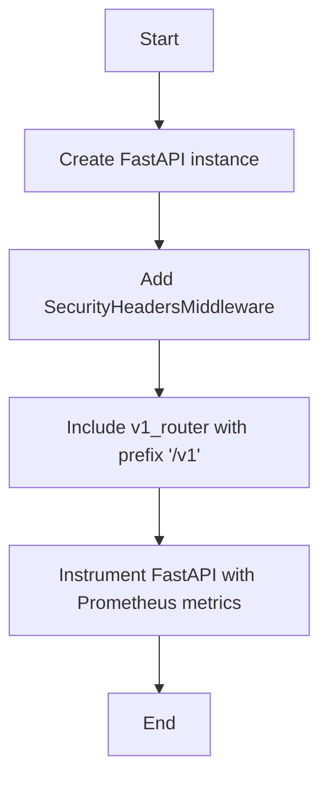
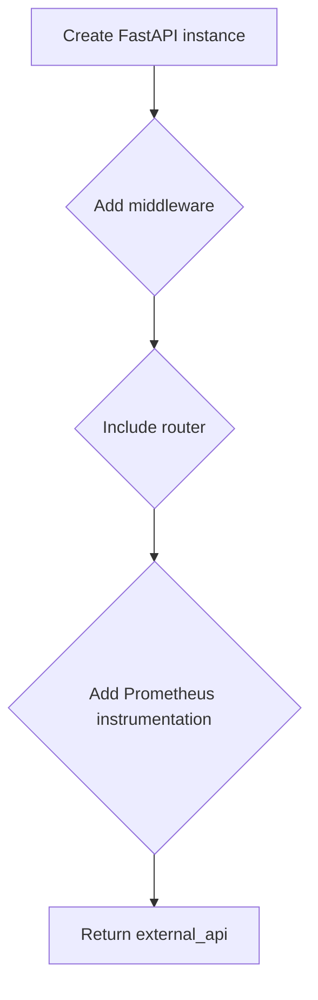
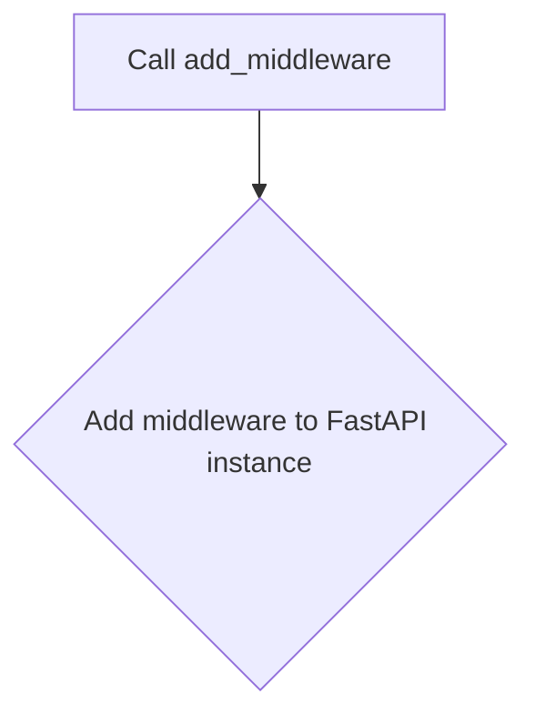
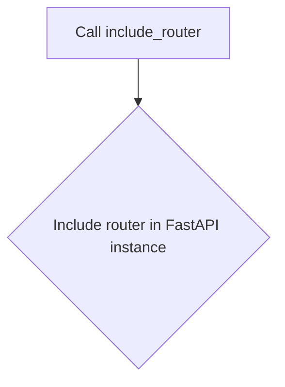
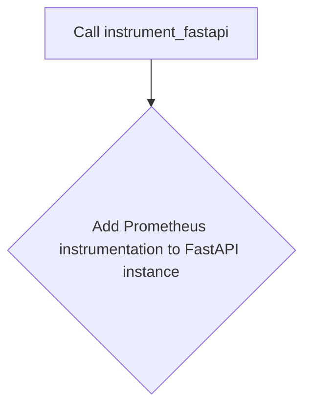
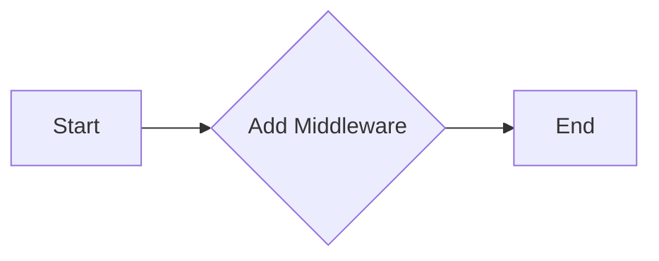
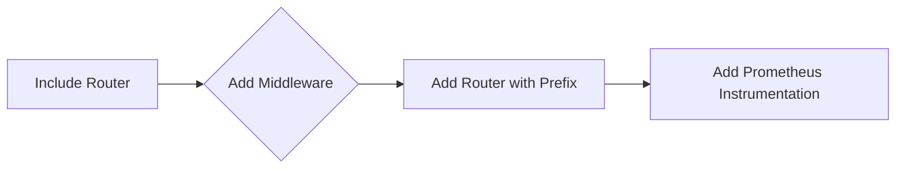
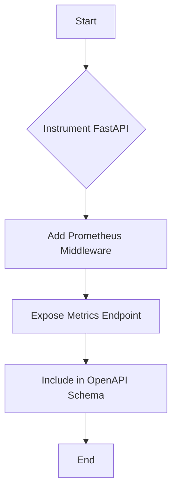
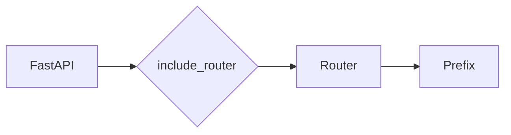
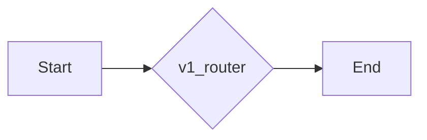

# `.\AutoGPT\autogpt_platform\backend\backend\api\external\fastapi_app.py` 详细设计文档

This code defines a FastAPI application that serves as an external API for AutoGPT integrations, including middleware for security and monitoring, and routes for version 1 of the API.

## 整体流程



## 类结构

```
FastAPI (Application)
├── SecurityHeadersMiddleware (Middleware)
├── v1_router (Router)
└── instrument_fastapi (Function)
```

## 全局变量及字段


### `external_api`
    
The main FastAPI instance for the AutoGPT External API.

类型：`FastAPI`
    


### `SecurityHeadersMiddleware`
    
Middleware for adding security headers to the API responses.

类型：`SecurityHeadersMiddleware`
    


### `v1_router`
    
The router for the v1 API endpoints.

类型：`Router`
    


### `instrument_fastapi`
    
Function for instrumenting the FastAPI instance with Prometheus metrics.

类型：`function`
    


### `service_name`
    
The name of the service for Prometheus metrics.

类型：`str`
    


### `expose_endpoint`
    
Whether to expose the metrics endpoint.

类型：`bool`
    


### `endpoint`
    
The endpoint to expose the metrics at.

类型：`str`
    


### `include_in_schema`
    
Whether to include the metrics endpoint in the OpenAPI schema.

类型：`bool`
    


### `FastAPI.title`
    
The title of the API.

类型：`str`
    


### `FastAPI.description`
    
The description of the API.

类型：`str`
    


### `FastAPI.docs_url`
    
The URL to the API documentation.

类型：`str`
    


### `FastAPI.version`
    
The version of the API.

类型：`str`
    


### `Router.prefix`
    
The prefix for the routes in the router.

类型：`str`
    


### `Router.routes`
    
The list of routes in the router.

类型：`list`
    
    

## 全局函数及方法


### `external_api`

`external_api` 是 FastAPI 应用的实例，用于创建和配置外部 API。

参数：

- 无

返回值：`FastAPI`，表示创建的 FastAPI 应用实例

#### 流程图



#### 带注释源码

```python
from fastapi import FastAPI

# Create a FastAPI instance with specified configurations
external_api = FastAPI(
    title="AutoGPT External API",
    description="External API for AutoGPT integrations",
    docs_url="/docs",
    version="1.0",
)

# Add middleware for security headers
external_api.add_middleware(SecurityHeadersMiddleware)

# Include the v1 router with a prefix of /v1
external_api.include_router(v1_router, prefix="/v1")

# Add Prometheus instrumentation to the FastAPI instance
instrument_fastapi(
    external_api,
    service_name="external-api",
    expose_endpoint=True,
    endpoint="/metrics",
    include_in_schema=True,
)
```


### `add_middleware`

`add_middleware` 是 FastAPI 应用的一个方法，用于添加中间件。

参数：

- `middleware`: `Middleware`，要添加的中间件实例

返回值：无

#### 流程图



#### 带注释源码

```python
from fastapi import FastAPI

# Add middleware for security headers
external_api.add_middleware(SecurityHeadersMiddleware)
```


### `include_router`

`include_router` 是 FastAPI 应用的一个方法，用于包含一个路由器。

参数：

- `router`: `Router`，要包含的路由器实例
- `prefix`: `str`，可选，指定路由器前缀

返回值：无

#### 流程图



#### 带注释源码

```python
# Include the v1 router with a prefix of /v1
external_api.include_router(v1_router, prefix="/v1")
```


### `instrument_fastapi`

`instrument_fastapi` 是一个全局函数，用于添加 Prometheus 监控到 FastAPI 应用。

参数：

- `app`: `FastAPI`，要添加监控的 FastAPI 应用实例
- `service_name`: `str`，服务名称
- `expose_endpoint`: `bool`，是否暴露监控端点
- `endpoint`: `str`，监控端点路径
- `include_in_schema`: `bool`，是否在 OpenAPI 规范中包含监控端点

返回值：无

#### 流程图



#### 带注释源码

```python
# Add Prometheus instrumentation to the FastAPI instance
instrument_fastapi(
    external_api,
    service_name="external-api",
    expose_endpoint=True,
    endpoint="/metrics",
    include_in_schema=True,
)
```


### `add_middleware`

`add_middleware` 是一个用于添加中间件到 FastAPI 应用的方法。

参数：

- `middleware`: `SecurityHeadersMiddleware`，一个用于添加安全头部的中间件。

返回值：无，该方法不返回任何值。

#### 流程图



#### 带注释源码

```
from fastapi import FastAPI

# ... (其他导入)

external_api = FastAPI(
    # ... (其他配置)
)

# 添加安全头部中间件
external_api.add_middleware(SecurityHeadersMiddleware)

# ... (其他代码)
```


### `external_api.include_router(v1_router, prefix="/v1")`

该函数将路由器 `v1_router` 添加到 FastAPI 应用 `external_api` 中，并指定了路由前缀为 `/v1`。

参数：

- `v1_router`：`Router`，表示包含路由定义的路由器对象。它描述了如何处理进入应用的HTTP请求。
- `prefix`：`str`，指定了路由器中所有路由的前缀。

返回值：无，该函数不返回任何值。

#### 流程图



#### 带注释源码

```
# Include the v1 router with a prefix of /v1
external_api.include_router(v1_router, prefix="/v1")
```


### instrument_fastapi

This function is used to add Prometheus instrumentation to a FastAPI application.

参数：

- `external_api`：`FastAPI`，The FastAPI application instance to be instrumented.
- `service_name`：`str`，The name of the service for which the metrics are being collected.
- `expose_endpoint`：`bool`，Whether to expose the metrics endpoint.
- `endpoint`：`str`，The endpoint path where the metrics will be exposed.
- `include_in_schema`：`bool`，Whether to include the metrics endpoint in the OpenAPI schema.

返回值：`None`，This function does not return any value.

#### 流程图



#### 带注释源码

```python
def instrument_fastapi(
    external_api: FastAPI,
    service_name: str,
    expose_endpoint: bool = True,
    endpoint: str = "/metrics",
    include_in_schema: bool = True,
):
    # Add Prometheus instrumentation to the FastAPI application
    # This is a placeholder for the actual implementation
    pass
```


### FastAPI.add_middleware

该函数用于向FastAPI应用中添加一个中间件。

参数：

- `middleware`: `SecurityHeadersMiddleware`，一个中间件实例，用于添加安全头部。

返回值：无

#### 流程图


#### 带注释源码

```
from fastapi import FastAPI

# ... (其他导入和初始化代码)

external_api.add_middleware(SecurityHeadersMiddleware)

# ... (其他代码)
```


### FastAPI.include_router

该函数用于将一个路由器（Router）包含到FastAPI应用中，并为其指定一个前缀。

参数：

- `router`：`Router`，要包含的路由器实例。它应该是一个FastAPI路由器对象，通常是通过`include_router`方法创建的。
- `prefix`：`str`，可选参数，指定包含的路由器的前缀。

返回值：无，该函数不返回任何值。

#### 流程图



#### 带注释源码

```
from fastapi import FastAPI

# ... (其他代码)

external_api.include_router(v1_router, prefix="/v1")

# ... (其他代码)
```


### FastAPI.instrument_fastapi

This function is used to add Prometheus instrumentation to a FastAPI application.

参数：

- `external_api`：`FastAPI`，The FastAPI application instance to be instrumented.
- `service_name`：`str`，The name of the service for which the metrics are being collected.
- `expose_endpoint`：`bool`，Whether to expose the metrics endpoint.
- `endpoint`：`str`，The endpoint path where the metrics will be exposed.
- `include_in_schema`：`bool`，Whether to include the metrics endpoint in the OpenAPI schema.

返回值：`None`，This function does not return any value.

#### 流程图


#### 带注释源码

```
# Add Prometheus instrumentation
instrument_fastapi(
    external_api,
    service_name="external-api",
    expose_endpoint=True,
    endpoint="/metrics",
    include_in_schema=True,
)
```


### SecurityHeadersMiddleware

SecurityHeadersMiddleware 是一个用于添加安全头部的中间件。

参数：

- `external_api`：`FastAPI`，外部API实例，用于添加中间件。

返回值：无，该函数不返回任何值。

#### 流程图


#### 带注释源码

```
# from backend.api.middleware.security import SecurityHeadersMiddleware
# 这行代码导入了 SecurityHeadersMiddleware 类。

# external_api.add_middleware(SecurityHeadersMiddleware)
# 这行代码将 SecurityHeadersMiddleware 作为中间件添加到 external_api 实例中。
```

由于 SecurityHeadersMiddleware 的具体实现细节没有在提供的代码片段中展示，无法提供更详细的流程图和源码。如果需要进一步的信息，需要查看 `backend/api/middleware/security.py` 文件中的 SecurityHeadersMiddleware 类的实现。


### `v1_router`

`v1_router` 是一个 FastAPI 路由器，用于定义和注册 AutoGPT 外部 API 的 v1 版本的端点。

参数：

- 无

返回值：`Router`，一个 FastAPI 路由器对象，用于处理 v1 版本的 API 请求。

#### 流程图



#### 带注释源码

```
# from .v1.routes import v1_router
# 这行代码导入了 v1 路由器，它是一个 FastAPI 路由器对象，用于处理 v1 版本的 API 请求。

v1_router = v1_router  # 将导入的路由器赋值给 v1_router 变量
```

请注意，由于源代码中没有提供 `v1_router` 的具体实现细节，以上流程图和源码仅展示了其作为路由器的存在和赋值过程。实际的端点定义和路由逻辑需要查看 `v1.routes` 模块中的代码。

## 关键组件


### 张量索引与惰性加载

支持对张量进行索引操作，并在需要时才加载数据，以优化内存使用和性能。

### 反量化支持

提供对反量化操作的支持，允许在量化过程中进行逆量化处理。

### 量化策略

实现多种量化策略，以适应不同的应用场景和性能需求。


## 问题及建议


### 已知问题

-   {问题1}：代码中使用了 `fastapi` 库，但没有明确说明如何处理跨域资源共享（CORS）问题。虽然添加了 `SecurityHeadersMiddleware`，但这并不解决所有CORS相关的问题。
-   {问题2}：代码中使用了 `instrument_fastapi` 函数来添加Prometheus监控，但没有配置具体的监控指标和阈值，这可能导致监控数据不完整或难以分析。
-   {问题3}：代码中使用了 `v1_router`，但没有提供关于 `v1_router` 的详细信息，例如它包含哪些路由和资源，这可能导致维护和扩展困难。

### 优化建议

-   {建议1}：添加CORS处理，可以使用 `CORSMiddleware` 或配置 `fastapi` 的 `dependencies` 来处理跨域请求。
-   {建议2}：配置具体的监控指标和阈值，确保Prometheus能够收集到有用的监控数据，并设置警报机制来通知维护人员。
-   {建议3}：提供 `v1_router` 的详细信息，包括其包含的路由和资源，以便于理解和维护。
-   {建议4}：考虑使用环境变量或配置文件来管理API的标题、描述、版本等配置，以便于在不同环境中进行配置管理。
-   {建议5}：对代码进行单元测试和集成测试，确保API的稳定性和可靠性。


## 其它


### 设计目标与约束

- 设计目标：确保API提供稳定、高效、安全的接口，支持AutoGPT的集成和扩展。
- 约束条件：遵循RESTful API设计原则，使用FastAPI框架实现，支持Prometheus监控。

### 错误处理与异常设计

- 异常处理：使用FastAPI的异常处理机制，定义自定义异常类，并在全局异常处理器中捕获和处理。
- 错误返回：确保错误信息清晰、具体，便于客户端识别和处理。

### 数据流与状态机

- 数据流：API请求经过中间件处理，路由到相应的处理函数，返回响应。
- 状态机：无状态设计，每个请求独立处理，无会话状态。

### 外部依赖与接口契约

- 外部依赖：FastAPI框架、SecurityHeadersMiddleware、instrument_fastapi函数。
- 接口契约：遵循RESTful API设计原则，使用JSON格式进行数据交换。

### 安全性与认证

- 安全性：通过SecurityHeadersMiddleware添加安全头部，提高API安全性。
- 认证：未提及具体认证机制，需根据实际需求设计。

### 性能优化

- 性能监控：通过Prometheus进行性能监控，及时发现并优化性能瓶颈。
- 缓存策略：根据实际情况考虑使用缓存策略，提高API响应速度。

### 日志记录

- 日志记录：记录API请求、响应、异常等信息，便于问题追踪和调试。

### 版本控制

- 版本控制：遵循语义化版本控制，确保API兼容性和向后兼容性。

### 文档与测试

- 文档：提供详细的API文档，包括接口描述、参数说明、示例等。
- 测试：编写单元测试和集成测试，确保API功能的正确性和稳定性。


    