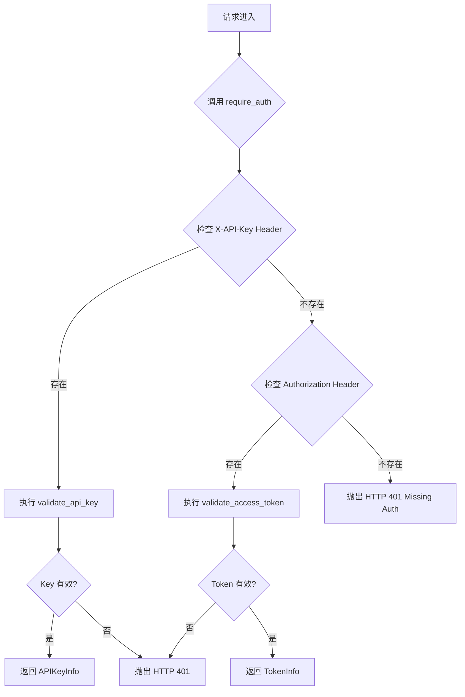
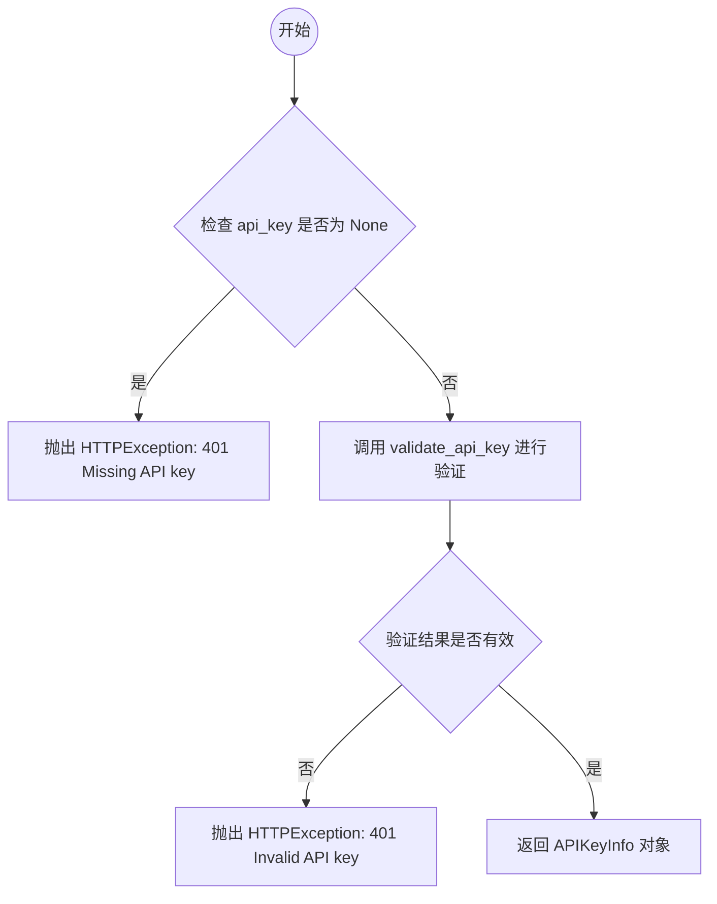
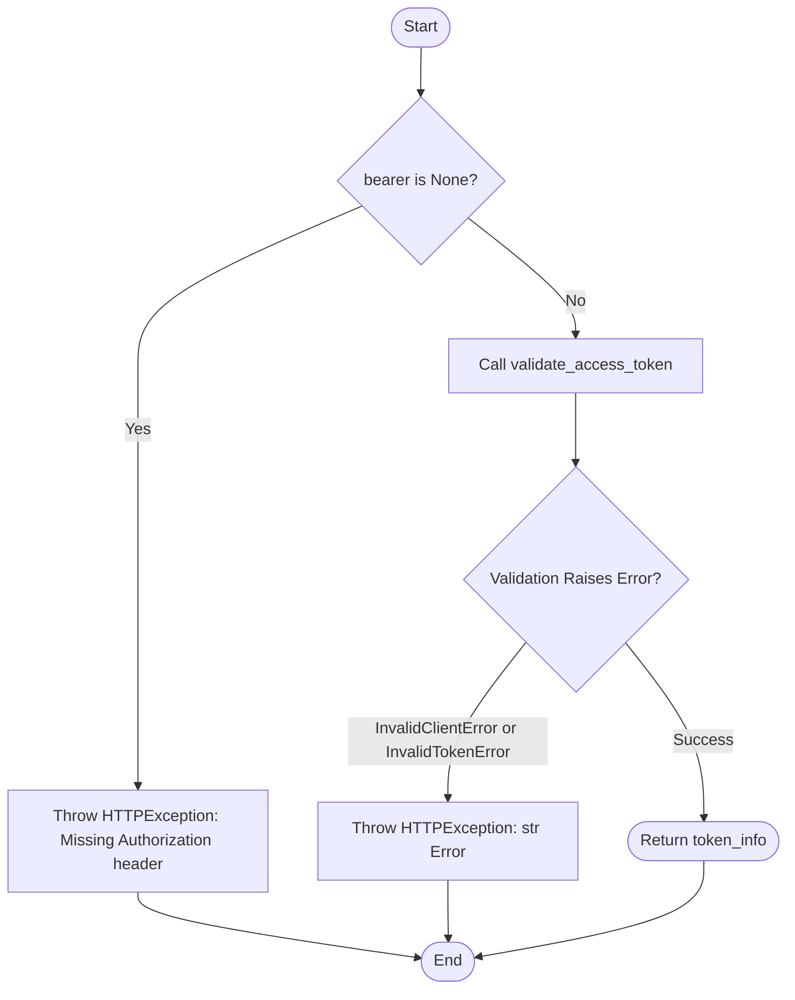
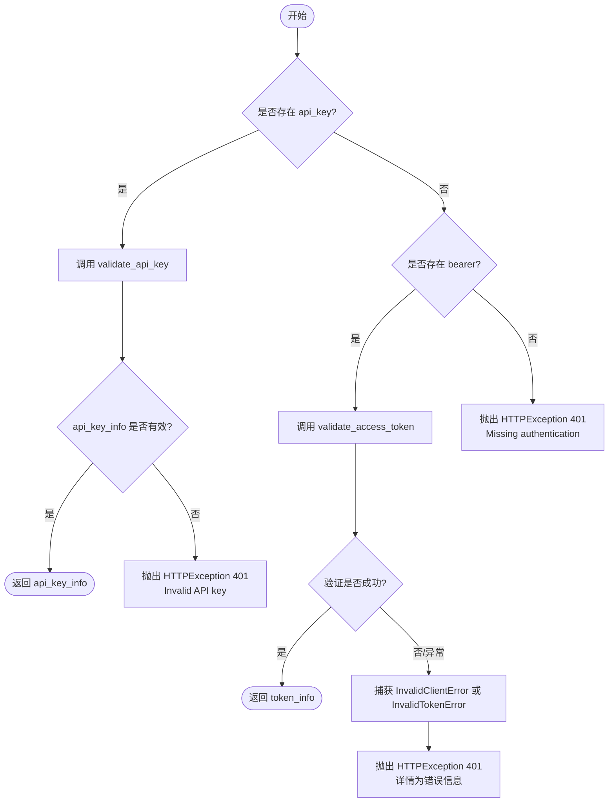
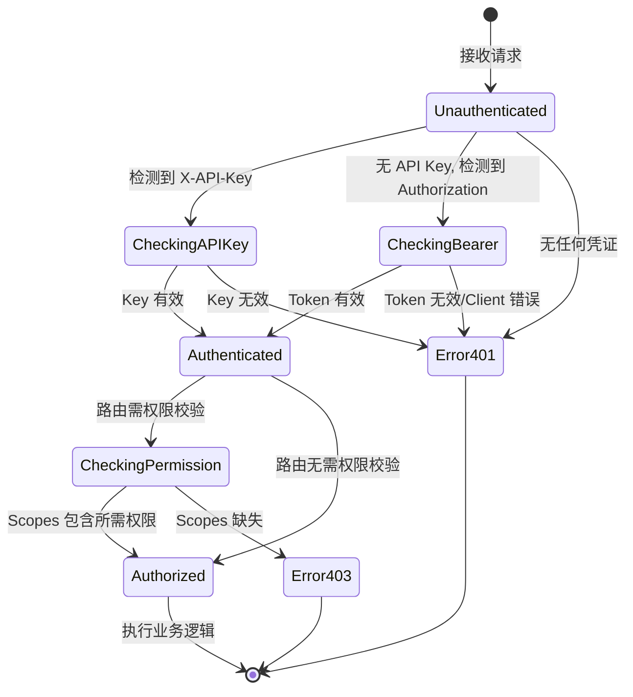

# `AutoGPT\autogpt_platform\backend\backend\api\external\middleware.py` 详细设计文档

该代码实现了基于 FastAPI 的身份验证依赖模块，提供了使用 API Key 和 OAuth Bearer Token 进行用户身份验证的中间件函数，并包含一个统一入口函数以及用于检查特定权限的依赖工厂函数。

## 整体流程



## 类结构

```
该文件主要包含全局函数和变量，未定义自定义类结构。
```

## 全局变量及字段


### `api_key_header`
    
FastAPI安全方案，用于从请求头的'X-API-Key'字段提取API密钥，并在缺失时不自动报错。

类型：`APIKeyHeader`
    


### `bearer_auth`
    
FastAPI安全方案，用于从请求头的Authorization字段提取Bearer令牌，并在缺失时不自动报错。

类型：`HTTPBearer`
    


    

## 全局函数及方法


### `require_api_key`

用于 API 密钥认证的 FastAPI 依赖中间件。它从请求头中提取 `X-API-Key` 并验证其有效性。

参数：

-   `api_key`：`str | None`，从请求头 "X-API-Key" 中提取的 API 密钥字符串，如果未提供则为 None。

返回值：`APIKeyInfo`，包含已验证的 API 密钥信息的对象。

#### 流程图



#### 带注释源码

```python
async def require_api_key(api_key: str | None = Security(api_key_header)) -> APIKeyInfo:
    """Middleware for API key authentication only"""
    # 检查 API 密钥是否缺失
    if api_key is None:
        # 如果缺失，抛出 401 未授权异常
        raise HTTPException(
            status_code=status.HTTP_401_UNAUTHORIZED, detail="Missing API key"
        )

    # 调用异步函数验证 API 密钥
    api_key_obj = await validate_api_key(api_key)

    # 检查验证是否失败（返回的对象为空或假）
    if not api_key_obj:
        # 如果无效，抛出 401 未授权异常
        raise HTTPException(
            status_code=status.HTTP_401_UNAUTHORIZED, detail="Invalid API key"
        )

    # 验证通过，返回包含密钥信息的对象
    return api_key_obj
```


### `require_access_token`

Middleware for OAuth access token authentication only（仅用于OAuth访问令牌身份验证的中间件）

参数：

-   `bearer`：`HTTPAuthorizationCredentials | None`，从Authorization头中解析出的Bearer凭据对象，若未提供则为None。

返回值：`OAuthAccessTokenInfo`，包含已验证的OAuth访问令牌信息的对象。

#### 流程图



#### 带注释源码

```python
async def require_access_token(
    bearer: HTTPAuthorizationCredentials | None = Security(bearer_auth),
) -> OAuthAccessTokenInfo:
    """Middleware for OAuth access token authentication only"""
    # 检查是否缺少 Authorization header
    if bearer is None:
        raise HTTPException(
            status_code=status.HTTP_401_UNAUTHORIZED,
            detail="Missing Authorization header",
        )

    try:
        # 尝试验证 bearer 凭据中的 access token
        # validate_access_token 返回 token_info 和其他信息，这里只取 token_info
        token_info, _ = await validate_access_token(bearer.credentials)
    except (InvalidClientError, InvalidTokenError) as e:
        # 如果验证过程中抛出客户端错误或令牌错误，转换为 HTTP 401 异常
        raise HTTPException(status_code=status.HTTP_401_UNAUTHORIZED, detail=str(e))

    # 返回验证通过的令牌信息
    return token_info
```


### `require_auth`

统一认证中间件，支持同时通过 API 密钥或 OAuth 令牌进行身份验证，优先检查 API 密钥。

参数：

- `api_key`：`str | None`，从请求头 `X-API-Key` 中提取的 API 密钥。
- `bearer`：`HTTPAuthorizationCredentials | None`，从请求头 `Authorization` 中提取的 Bearer 令牌凭证。

返回值：`APIAuthorizationInfo`，鉴权成功后的信息对象（是 `APIKeyInfo` 和 `OAuthAccessTokenInfo` 的基类实例）。

#### 流程图



#### 带注释源码

```python
async def require_auth(
    api_key: str | None = Security(api_key_header),
    bearer: HTTPAuthorizationCredentials | None = Security(bearer_auth),
) -> APIAuthorizationInfo:
    """
    Unified authentication middleware supporting both API keys and OAuth tokens.

    Supports two authentication methods, which are checked in order:
    1. X-API-Key header (existing API key authentication)
    2. Authorization: Bearer <token> header (OAuth access token)

    Returns:
        APIAuthorizationInfo: base class of both APIKeyInfo and OAuthAccessTokenInfo.
    """
    # 优先尝试使用 API 密钥进行认证
    if api_key is not None:
        api_key_info = await validate_api_key(api_key)
        if api_key_info:
            return api_key_info
        # 如果提供了 API 密钥但无效，直接返回 401 错误
        raise HTTPException(
            status_code=status.HTTP_401_UNAUTHORIZED, detail="Invalid API key"
        )

    # 如果没有 API 密钥，尝试使用 OAuth Bearer 令牌进行认证
    if bearer is not None:
        try:
            token_info, _ = await validate_access_token(bearer.credentials)
            return token_info
        except (InvalidClientError, InvalidTokenError) as e:
            # 捕获令牌验证过程中的异常，并转换为 HTTP 401 响应
            raise HTTPException(status_code=status.HTTP_401_UNAUTHORIZED, detail=str(e))

    # 既没有提供有效的 API 密钥，也没有提供 Bearer 令牌
    raise HTTPException(
        status_code=status.HTTP_401_UNAUTHORIZED,
        detail="Missing authentication. Provide API key or access token.",
    )
```


### `require_permission`

这是一个依赖工厂函数，用于生成检查特定权限的依赖项。它与API密钥或OAuth令牌认证配合工作，以验证调用方是否具有所需的范围/权限。

参数：

- `permission`：`APIKeyPermission`，需要检查的具体权限类型。

返回值：`Callable`，返回一个内部异步函数 `check_permission`，该函数在验证权限通过后返回 `APIAuthorizationInfo` 对象。

#### 流程图

```mermaid
graph TD
    A[开始: check_permission 被调用] --> B[通过依赖 require_auth 获取 auth 信息]
    B --> C{检查: permission 是否在 auth.scopes 中?}
    C -- 是 --> D[返回 auth 对象 (权限验证通过)]
    C -- 否 --> E[抛出 HTTPException 403 Forbidden]
    E --> F[结束]
    D --> F
```

#### 带注释源码

```python
def require_permission(permission: APIKeyPermission):
    """
    Dependency function for checking specific permissions
    (works with API keys and OAuth tokens)
    """
    # 定义内部异步函数，实际作为 FastAPI 的依赖项运行
    async def check_permission(
        # 通过 Security 依赖注入，先执行 require_auth 进行身份认证并获取 auth 对象
        auth: APIAuthorizationInfo = Security(require_auth),
    ) -> APIAuthorizationInfo:
        # 验证请求的权限是否存在于认证对象的权限 scopes 中
        if permission not in auth.scopes:
            # 如果权限不存在，则抛出 HTTP 403 禁止访问异常
            raise HTTPException(
                status_code=status.HTTP_403_FORBIDDEN,
                detail=f"Missing required permission: {permission.value}",
            )
        # 权限验证通过，返回认证信息对象供后续端点使用
        return auth

    # 返回内部定义的异步函数，使其成为一个可调用的依赖工厂
    return check_permission
```


## 关键组件


### api_key_header
用于从 HTTP 请求头 `X-API-Key` 中提取 API Key 字符串的 FastAPI 安全依赖项配置。

### bearer_auth
用于从 HTTP 请求头 `Authorization` 中提取 Bearer 令牌凭据的 FastAPI 安全依赖项配置。

### require_api_key
强制执行 API Key 身份验证的异步中间件，负责检查 Key 是否存在以及调用底层验证逻辑，失败时抛出 401 异常。

### require_access_token
强制执行 OAuth 访问令牌身份验证的异步中间件，负责验证令牌有效性并捕获令牌无效或客户端错误的异常。

### require_auth
统一身份验证中间件，优先检查 API Key，若不存在则回退到 OAuth Bearer Token 认证，成功后返回统一的授权信息对象。

### require_permission
权限校验依赖生成器，用于创建检查已认证用户是否包含特定 API 权限范围的中间件函数。


## 问题及建议


### 已知问题

-   **认证策略的硬编码优先级与回退缺失**：在 `require_auth` 函数中，如果检测到了 `X-API-Key` header，无论该 Key 是否有效，系统都会直接抛出异常，而不会回退尝试检查 `Authorization: Bearer` token。这导致客户端如果配置错误（例如同时发送了过期的 API Key 和有效的 Token）将无法通过认证，缺乏灵活性。
-   **返回类型为基类导致类型收窄困难**：`require_auth` 返回基类 `APIAuthorizationInfo`。在业务逻辑中，如果需要访问特定于 API Key（如 Key ID）或 OAuth Token（如 User ID）的字段，开发者必须手动进行类型收窄，这在大型项目中容易导致类型检查警告或运行时错误。
-   **潜在的敏感信息泄露**：在 `require_access_token` 函数中，捕获异常后直接使用 `str(e)` 作为 HTTP 响应的 `detail`。如果底层验证库抛出的异常包含内部堆栈信息或敏感的系统状态，这将直接暴露给客户端。
-   **缺乏审计日志**：所有的认证失败（401）和权限拒绝（403）仅抛出 HTTP 异常，未集成日志记录机制。这在安全审计和故障排查时无法追踪是谁、在何时、通过何种方式尝试访问但失败了。

### 优化建议

-   **引入缓存层减少数据库压力**：`validate_api_key` 和 `validate_access_token` 内部通常涉及数据库查询或加密解密操作，且高频调用。建议引入 Redis 等缓存机制，对已验证的 Token 或 Key 信息进行短时缓存，降低后端负载。
-   **统一错误处理与响应格式**：定义一个内部统一的认证异常类，并在中间件或全局异常处理器中将其转换为标准的 HTTP 响应。这样可以避免在每个函数中重复构造 `HTTPException`，并能更好地控制错误信息的安全脱敏。
-   **增强日志与监控埋点**：在认证失败和权限校验的关键节点添加结构化日志（如包含请求路径、IP、User-Agent 和 失败原因），以便于安全审计和入侵检测。
-   **支持配置化的认证组合策略**：优化 `require_auth` 的逻辑，允许通过配置定义是否在一种认证方式失败后继续尝试另一种（即 "Fail-over" 模式与 "Strict" 模式的切换），以适应不同的业务场景需求。


## 其它


### 设计目标与约束

**设计目标**：
1.  **统一认证接口**：提供单一的入口点（`require_auth`），同时支持 API Key 和 OAuth Bearer Token 两种认证机制，简化客户端调用逻辑。
2.  **灵活的权限控制**：通过 `require_permission` 依赖注入，实现对不同接口的细粒度权限校验。
3.  **标准化错误处理**：将内部认证逻辑的异常统一转换为标准的 HTTP 响应，隐藏底层实现细节。
4.  **模块化设计**：利用 FastAPI 的依赖注入系统，实现认证逻辑的解耦和复用。

**约束条件**：
1.  **异步执行**：所有校验函数必须是异步的（`async def`），以适应 FastAPI 的异步请求处理模型，避免阻塞 I/O。
2.  **返回类型一致性**：所有认证函数必须返回 `APIAuthorizationInfo` 或其子类（`APIKeyInfo`、`OAuthAccessTokenInfo`），以便于后续业务逻辑统一处理。
3.  **Header 命名规范**：强制要求 API Key 必须位于 `X-API-Key` Header，OAuth Token 必须使用标准的 `Authorization: Bearer <token>` 格式。
4.  **优先级约束**：在混合认证模式下，必须优先校验 API Key，若 Key 存在则忽略 Bearer Token。

### 错误处理与异常设计

**设计策略**：
1.  **分层错误转换**：底层模块（如 `oauth` 模块）抛出的业务异常（如 `InvalidTokenError`）在中间件层被捕获并转换为 `HTTPException`。
2.  **HTTP 状态码规范**：
    *   **401 Unauthorized**：用于认证失败场景，包括凭证缺失（Missing）、凭证无效（Invalid）、客户端错误（Invalid Client）等。
    *   **403 Forbidden**：用于认证成功但权限不足的场景（Permission Denied）。
3.  **自动错误抑制**：FastAPI Security 对象（`APIKeyHeader`, `HTTPBearer`）设置 `auto_error=False`，将错误检测权限交给当前模块的函数处理，以便返回自定义的错误详情（detail）。

**异常映射表**：
| 源异常/条件 | 触发场景 | 目标 HTTP 状态码 | 返回 Detail 内容 |
| :--- | :--- | :--- | :--- |
| `api_key is None` | 未提供 API Key Header | 401 | "Missing API key" |
| `api_key_obj is None` | API Key 不存在或失效 | 401 | "Invalid API key" |
| `InvalidTokenError` | OAuth Token 签名无效或过期 | 401 | 异常信息 (str(e)) |
| `InvalidClientError` | OAuth Client ID 无效 | 401 | 异常信息 (str(e)) |
| `permission not in scopes` | 用户权限不足 | 403 | "Missing required permission: {permission.value}" |

### 数据流与状态机

**整体数据流**：
1.  **请求接收**：FastAPI 接收 HTTP 请求。
2.  **凭证提取**：Security 依赖项从 Header 中提取 `X-API-Key` 或 `Authorization` 字段。
3.  **认证路由**：
    *   路径 A（API Key）：调用 `validate_api_key` -> 查询数据库 -> 返回 `APIKeyInfo`。
    *   路径 B（OAuth）：调用 `validate_access_token` -> 验证签名/缓存 -> 返回 `OAuthAccessTokenInfo`。
4.  **权限校验**（可选）：若声明了 `require_permission` 依赖，检查上一步返回对象中的 `scopes` 字段。
5.  **上下文注入**：将认证成功的信息对象注入到路由处理函数的参数中。
6.  **业务逻辑执行**：路由函数使用认证信息处理业务。

**认证状态机**：


### 外部依赖与接口契约

**外部组件依赖**：
1.  **FastAPI Security (`fastapi.security`)**：
    *   `APIKeyHeader`：用于提取自定义 Header 中的 API Key。
    *   `HTTPBearer`：用于提取标准 Bearer Token。
2.  **Prisma Enums (`prisma.enums`)**：
    *   `APIKeyPermission`：定义系统中所有可用的权限枚举值。

**内部接口契约（调用约定）**：

1.  **`backend.data.auth.api_key.validate_api_key`**
    *   **输入**：`api_key: str` (原始 Key 字符串)
    *   **输出**：`APIKeyInfo | None`
    *   **契约**：若 Key 有效返回包含权限范围的用户信息对象；若 Key 不存在、已禁用或格式错误，返回 `None`（不应抛出异常，异常应在内部消化）。

2.  **`backend.data.auth.oauth.validate_access_token`**
    *   **输入**：`token: str` (Access Token 字符串)
    *   **输出**：`Tuple[OAuthAccessTokenInfo, Any]`
    *   **异常契约**：
        *   抛出 `InvalidTokenError`：当 Token 签名错误、过期或格式非法时。
        *   抛出 `InvalidClientError`：当 Token 关联的 Client 不合法时。
    *   **返回值契约**：元组第一项为包含 Scopes 的 Token 信息对象。

3.  **`backend.data.auth.base.APIAuthorizationInfo`**
    *   **属性契约**：所有子类必须实现 `scopes` 属性（通常是 `List[APIKeyPermission]` 或类似集合），供 `require_permission` 函数读取检查。

    