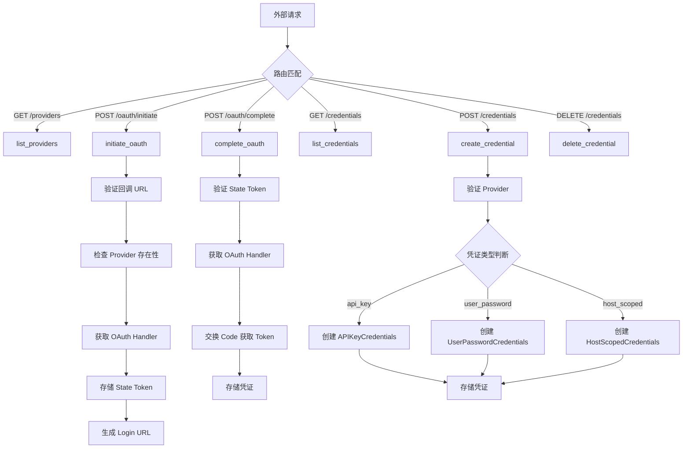
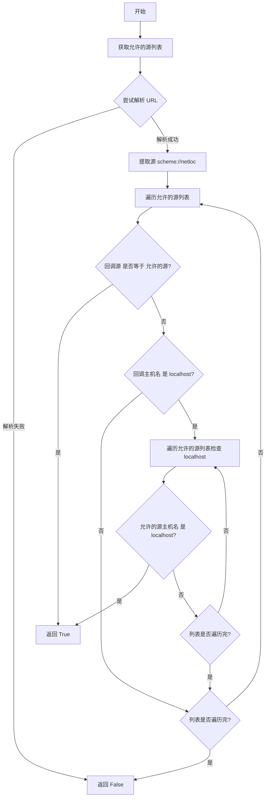
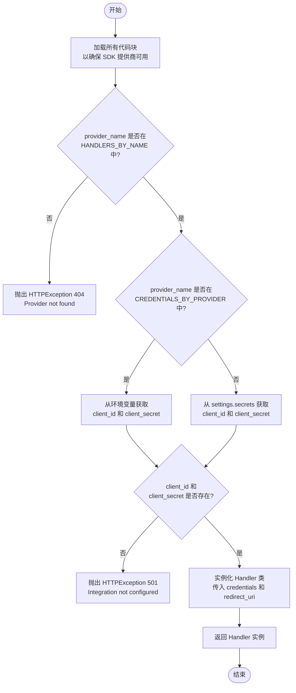
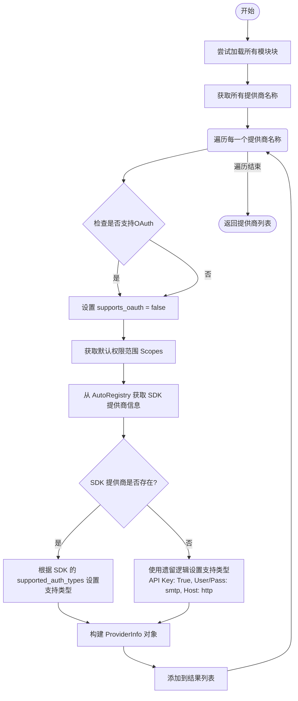
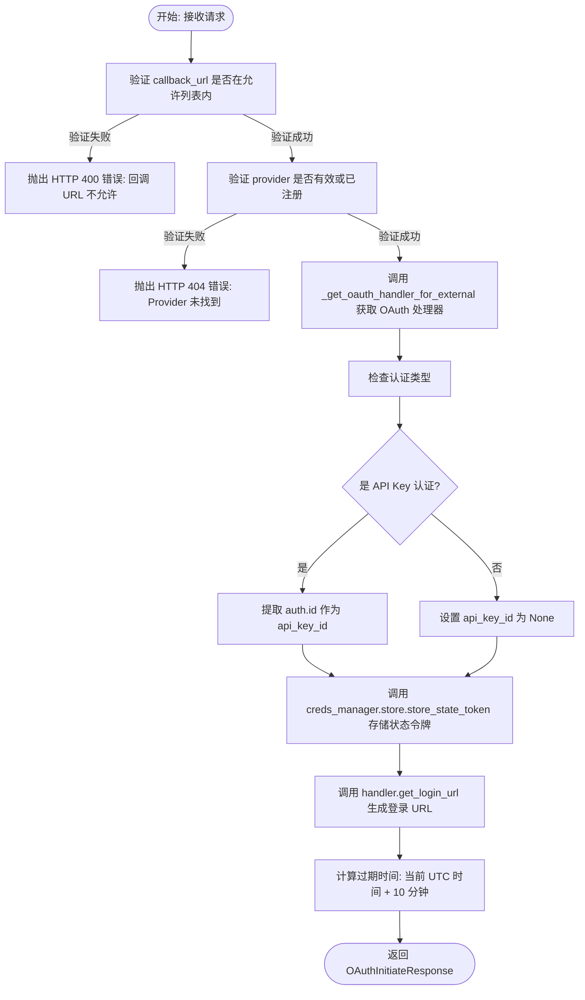
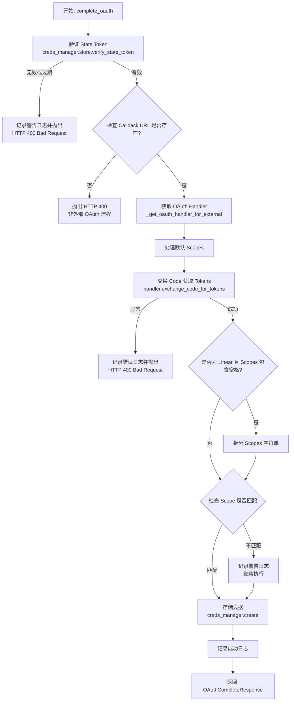
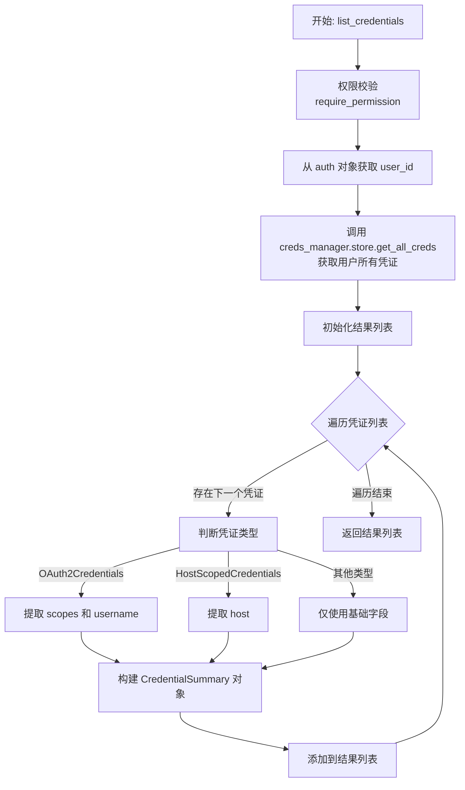
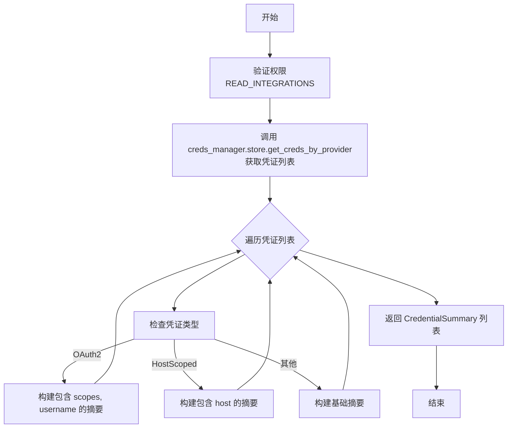
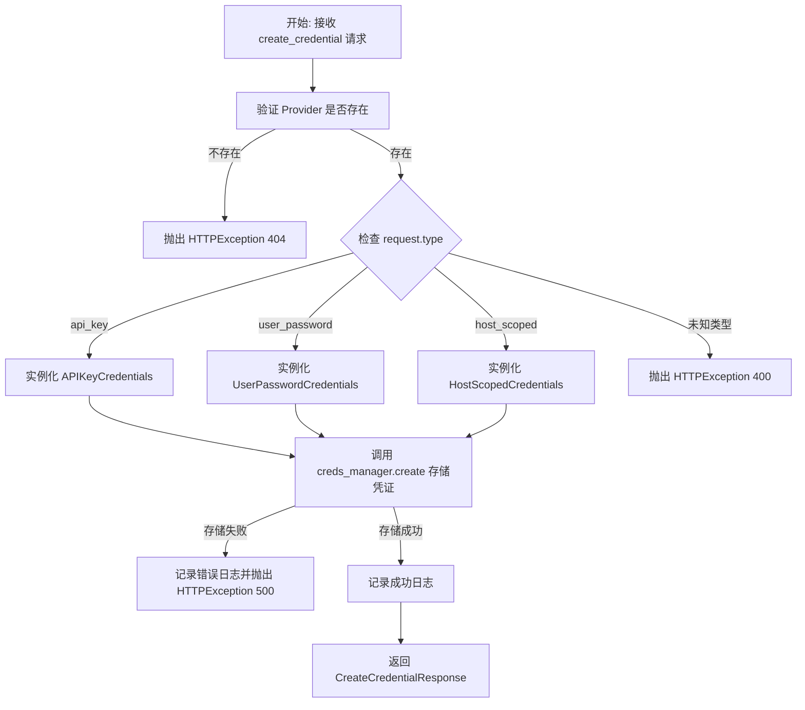
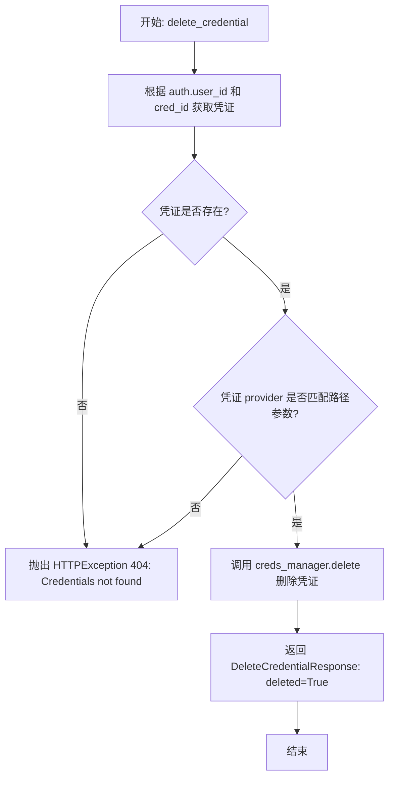

# `AutoGPT\autogpt_platform\backend\backend\api\external\v1\integrations.py` 详细设计文档

该模块定义了 FastAPI 路由，为外部应用提供集成和凭证管理的端点，支持通过自定义回调 URL 启动和完成 OAuth 流程，创建 API Key、用户密码及 Host Scoped 等类型的凭证，并提供了列出提供商及用户凭证的功能。

## 整体流程



## 类结构

```
pydantic.BaseModel (抽象基类)
├── OAuthInitiateRequest
├── OAuthInitiateResponse
├── OAuthCompleteRequest
├── OAuthCompleteResponse
├── CredentialSummary
├── ProviderInfo
├── CreateAPIKeyCredentialRequest
├── CreateUserPasswordCredentialRequest
├── CreateHostScopedCredentialRequest
├── CreateCredentialResponse
└── DeleteCredentialResponse
```

## 全局变量及字段


### `logger`
    
Logger instance for this module.

类型：`logging.Logger`
    


### `settings`
    
Global application settings instance.

类型：`Settings`
    


### `creds_manager`
    
Manager instance for handling integration credentials.

类型：`IntegrationCredentialsManager`
    


### `integrations_router`
    
FastAPI router instance for integration endpoints.

类型：`APIRouter`
    


### `OAuthInitiateRequest.callback_url`
    
The external app's callback URL for OAuth redirect.

类型：`str`
    


### `OAuthInitiateRequest.scopes`
    
OAuth scopes to request.

类型：`list[str]`
    


### `OAuthInitiateRequest.state_metadata`
    
Arbitrary metadata to echo back on completion.

类型：`dict[str, Any]`
    


### `OAuthInitiateResponse.login_url`
    
URL to redirect user for OAuth consent.

类型：`str`
    


### `OAuthInitiateResponse.state_token`
    
State token for CSRF protection.

类型：`str`
    


### `OAuthInitiateResponse.expires_at`
    
Unix timestamp when the state token expires.

类型：`int`
    


### `OAuthCompleteRequest.code`
    
Authorization code from OAuth provider.

类型：`str`
    


### `OAuthCompleteRequest.state_token`
    
State token from initiate request.

类型：`str`
    


### `OAuthCompleteResponse.credentials_id`
    
ID of the stored credentials.

类型：`str`
    


### `OAuthCompleteResponse.provider`
    
Provider name.

类型：`str`
    


### `OAuthCompleteResponse.type`
    
Credential type (oauth2).

类型：`str`
    


### `OAuthCompleteResponse.title`
    
Credential title.

类型：`Optional[str]`
    


### `OAuthCompleteResponse.scopes`
    
Granted scopes.

类型：`list[str]`
    


### `OAuthCompleteResponse.username`
    
Username from provider.

类型：`Optional[str]`
    


### `OAuthCompleteResponse.state_metadata`
    
Echoed metadata from initiate request.

类型：`dict[str, Any]`
    


### `CredentialSummary.id`
    
The unique identifier of the credential.

类型：`str`
    


### `CredentialSummary.provider`
    
The name of the integration provider.

类型：`str`
    


### `CredentialSummary.type`
    
The type of the credential.

类型：`CredentialsType`
    


### `CredentialSummary.title`
    
The title of the credential.

类型：`Optional[str]`
    


### `CredentialSummary.scopes`
    
The OAuth scopes associated with the credential.

类型：`Optional[list[str]]`
    


### `CredentialSummary.username`
    
The username associated with the credential.

类型：`Optional[str]`
    


### `CredentialSummary.host`
    
The host associated with the credential.

类型：`Optional[str]`
    


### `ProviderInfo.name`
    
The name of the integration provider.

类型：`str`
    


### `ProviderInfo.supports_oauth`
    
Indicates if the provider supports OAuth.

类型：`bool`
    


### `ProviderInfo.supports_api_key`
    
Indicates if the provider supports API key authentication.

类型：`bool`
    


### `ProviderInfo.supports_user_password`
    
Indicates if the provider supports username/password authentication.

类型：`bool`
    


### `ProviderInfo.supports_host_scoped`
    
Indicates if the provider supports host-scoped credentials.

类型：`bool`
    


### `ProviderInfo.default_scopes`
    
Default OAuth scopes for the provider.

类型：`list[str]`
    


### `CreateAPIKeyCredentialRequest.type`
    
The literal type discriminator for the credential.

类型：`Literal['api_key']`
    


### `CreateAPIKeyCredentialRequest.api_key`
    
The API key string.

类型：`str`
    


### `CreateAPIKeyCredentialRequest.title`
    
A name for this credential.

类型：`str`
    


### `CreateAPIKeyCredentialRequest.expires_at`
    
Unix timestamp when the API key expires.

类型：`Optional[int]`
    


### `CreateUserPasswordCredentialRequest.type`
    
The literal type discriminator for the credential.

类型：`Literal['user_password']`
    


### `CreateUserPasswordCredentialRequest.username`
    
Username for authentication.

类型：`str`
    


### `CreateUserPasswordCredentialRequest.password`
    
Password for authentication.

类型：`str`
    


### `CreateUserPasswordCredentialRequest.title`
    
A name for this credential.

类型：`str`
    


### `CreateHostScopedCredentialRequest.type`
    
The literal type discriminator for the credential.

类型：`Literal['host_scoped']`
    


### `CreateHostScopedCredentialRequest.host`
    
Host/domain pattern to match.

类型：`str`
    


### `CreateHostScopedCredentialRequest.headers`
    
Headers to include in requests.

类型：`dict[str, str]`
    


### `CreateHostScopedCredentialRequest.title`
    
A name for this credential.

类型：`str`
    


### `CreateCredentialResponse.id`
    
The ID of the created credential.

类型：`str`
    


### `CreateCredentialResponse.provider`
    
The provider name.

类型：`str`
    


### `CreateCredentialResponse.type`
    
The type of the created credential.

类型：`CredentialsType`
    


### `CreateCredentialResponse.title`
    
The title of the created credential.

类型：`Optional[str]`
    


### `DeleteCredentialResponse.deleted`
    
Whether the credential was deleted.

类型：`bool`
    


### `DeleteCredentialResponse.credentials_id`
    
ID of the deleted credential.

类型：`str`
    
    

## 全局函数及方法


### `validate_callback_url`

验证给定的 OAuth 回调 URL 是否源自应用程序配置中明确允许的域或协议，并对本地开发环境提供特殊处理。

参数：

-  `callback_url`：`str`，由客户端应用程序提供的需要验证的回调 URL 字符串。

返回值：`bool`，如果 URL 的源存在于允许的源列表中或符合 localhost 标准，则返回 `True`；否则返回 `False`。

#### 流程图



#### 带注释源码

```python
def validate_callback_url(callback_url: str) -> bool:
    """Validate that the callback URL is from an allowed origin."""
    # 获取系统配置中允许的外部 OAuth 回调源列表
    allowed_origins = settings.config.external_oauth_callback_origins

    try:
        # 解析回调 URL，获取其组成成分
        parsed = urlparse(callback_url)
        # 构造标准化的源字符串 (协议 + 域名/主机)
        callback_origin = f"{parsed.scheme}://{parsed.netloc}"

        for allowed in allowed_origins:
            # 简单的源字符串匹配
            if callback_origin == allowed:
                return True

        # 特殊处理：开发环境中允许 localhost 匹配
        # 如果回调主机名是 localhost，检查允许列表中是否有 localhost
        if parsed.hostname == "localhost":
            for allowed in allowed_origins:
                allowed_parsed = urlparse(allowed)
                if allowed_parsed.hostname == "localhost":
                    return True

        # 如果所有检查均未通过，则视为无效
        return False
    except Exception:
        # 捕获 URL 解析过程中的任何异常（如格式错误），判定为无效
        return False
```


### `_get_oauth_handler_for_external`

获取并配置一个 OAuth 处理器实例，用于处理外部应用的 OAuth 流程。该函数负责确保提供商支持 OAuth，从环境变量或配置中检索必要的客户端凭证（client_id 和 client_secret），并使用指定的重定向 URI 初始化处理器。

参数：

-  `provider_name`：`str`，OAuth 提供商的名称（例如 "google", "github"）。
-  `redirect_uri`：`str`，OAuth 流程完成后重定向的 URI。

返回值：`BaseOAuthHandler`，配置好的 OAuth 处理器实例。

#### 流程图



#### 带注释源码

```python
def _get_oauth_handler_for_external(
    provider_name: str, redirect_uri: str
) -> "BaseOAuthHandler":
    """Get an OAuth handler configured with an external redirect URI."""
    # 确保代码块已加载，以便 SDK 提供商可用
    try:
        from backend.blocks import load_all_blocks

        load_all_blocks()
    except Exception as e:
        logger.warning(f"Failed to load blocks: {e}")

    # 检查提供商是否支持 OAuth
    if provider_name not in HANDLERS_BY_NAME:
        raise HTTPException(
            status_code=status.HTTP_404_NOT_FOUND,
            detail=f"Provider '{provider_name}' does not support OAuth",
        )

    # 检查此提供商是否有自定义 OAuth 凭证配置
    oauth_credentials = CREDENTIALS_BY_PROVIDER.get(provider_name)

    # 如果有自定义配置且不使用默认 secrets，则从环境变量读取
    if oauth_credentials and not oauth_credentials.use_secrets:
        import os

        client_id = (
            os.getenv(oauth_credentials.client_id_env_var)
            if oauth_credentials.client_id_env_var
            else None
        )
        client_secret = (
            os.getenv(oauth_credentials.client_secret_env_var)
            if oauth_credentials.client_secret_env_var
            else None
        )
    else:
        # 否则从 settings.secrets 中读取
        client_id = getattr(settings.secrets, f"{provider_name}_client_id", None)
        client_secret = getattr(
            settings.secrets, f"{provider_name}_client_secret", None
        )

    # 验证必要的凭证是否存在
    if not (client_id and client_secret):
        logger.error(f"Attempt to use unconfigured {provider_name} OAuth integration")
        raise HTTPException(
            status_code=status.HTTP_501_NOT_IMPLEMENTED,
            detail={
                "message": f"Integration with provider '{provider_name}' is not configured.",
                "hint": "Set client ID and secret in the application's deployment environment",
            },
        )

    # 获取处理器类并实例化，传入获取到的凭证和重定向 URI
    handler_class = HANDLERS_BY_NAME[provider_name]
    return handler_class(
        client_id=client_id,
        client_secret=client_secret,
        redirect_uri=redirect_uri,
    )
```


### `list_providers`

该函数用于列出系统中所有可用的集成提供商信息，包括它们支持的认证类型（如 OAuth、API Key、用户名密码等）以及默认的权限范围。

参数：

- `auth`：`APIAuthorizationInfo`，包含当前用户身份及权限的授权信息对象，通过依赖注入自动获取，且需要具备 `READ_INTEGRATIONS` 权限。

返回值：`list[ProviderInfo]`，包含提供商详细信息的对象列表，每个对象包含提供商名称、支持的认证类型标志及默认作用域。

#### 流程图



#### 带注释源码

```python
@integrations_router.get("/providers", response_model=list[ProviderInfo])
async def list_providers(
    # 通过 Security 依赖注入认证信息，要求调用者必须拥有 READ_INTEGRATIONS 权限
    auth: APIAuthorizationInfo = Security(
        require_permission(APIKeyPermission.READ_INTEGRATIONS)
    ),
) -> list[ProviderInfo]:
    """
    List all available integration providers.

    Returns a list of all providers with their supported credential types.
    Most providers support API key credentials, and some also support OAuth.
    """
    # 尝试加载所有模块块，以确保 SDK 提供商已正确注册到系统中
    try:
        from backend.blocks import load_all_blocks

        load_all_blocks()
    except Exception as e:
        logger.warning(f"Failed to load blocks: {e}")

    from backend.sdk.registry import AutoRegistry

    providers = []
    # 遍历所有已知的提供商名称
    for name in get_all_provider_names():
        # 检查提供商是否在 OAuth 处理器字典中，以判断是否支持 OAuth
        supports_oauth = name in HANDLERS_BY_NAME
        handler_class = HANDLERS_BY_NAME.get(name)
        # 获取处理器类中定义的默认 Scopes（如果有）
        default_scopes = (
            getattr(handler_class, "DEFAULT_SCOPES", []) if handler_class else []
        )

        # 尝试从 SDK 注册表获取提供商元数据
        sdk_provider = AutoRegistry.get_provider(name)
        if sdk_provider and sdk_provider.supported_auth_types:
            # 如果是 SDK 注册的提供商，严格根据其声明的 supported_auth_types 设置支持情况
            supports_api_key = "api_key" in sdk_provider.supported_auth_types
            supports_user_password = (
                "user_password" in sdk_provider.supported_auth_types
            )
            supports_host_scoped = "host_scoped" in sdk_provider.supported_auth_types
        else:
            # 针对非 SDK 注册的遗留提供商，使用硬编码的回退逻辑
            supports_api_key = True  # 默认所有提供商都支持 API Key
            supports_user_password = name in ("smtp",) # 仅 smtp 支持用户名密码
            supports_host_scoped = name == "http"     # 仅 http 支持 host_scoped

        # 构建该提供商的信息对象并加入结果列表
        providers.append(
            ProviderInfo(
                name=name,
                supports_oauth=supports_oauth,
                supports_api_key=supports_api_key,
                supports_user_password=supports_user_password,
                supports_host_scoped=supports_host_scoped,
                default_scopes=default_scopes,
            )
        )

    return providers
```


### `initiate_oauth`

该函数是一个异步 FastAPI 端点，用于为外部应用程序（如 Autopilot）启动 OAuth2 认证流程。它负责验证请求的回调 URL 是否在允许的源列表内，检查指定的 OAuth 提供商是否存在，获取配置好的 OAuth 处理器，生成并存储包含元数据（如请求的范围、回调 URL、发起者 ID）的安全状态令牌以防止 CSRF 攻击，最后构建并返回授权登录 URL 及其过期时间。

参数：

- `provider`：`str`，OAuth 提供商的名称（从 URL 路径中获取），例如 "google" 或 "github"。
- `request`：`OAuthInitiateRequest`，包含 OAuth 流程初始化所需的请求体数据，包括回调 URL (`callback_url`)、请求的权限范围 (`scopes`) 和任意状态元数据 (`state_metadata`)。
- `auth`：`APIAuthorizationInfo`，经过安全认证的上下文信息，包含当前用户的 ID 以及可能的 API Key ID，用于关联凭证的归属。

返回值：`OAuthInitiateResponse`，包含生成的 OAuth 授权登录 URL (`login_url`)、用于 CSRF 保护的状态令牌 (`state_token`) 以及该令牌的过期时间戳 (`expires_at`)。

#### 流程图



#### 带注释源码

```python
@integrations_router.post(
    "/{provider}/oauth/initiate",
    response_model=OAuthInitiateResponse,
    summary="Initiate OAuth flow",
)
async def initiate_oauth(
    provider: Annotated[str, Path(title="The OAuth provider")],
    request: OAuthInitiateRequest,
    auth: APIAuthorizationInfo = Security(
        require_permission(APIKeyPermission.MANAGE_INTEGRATIONS)
    ),
) -> OAuthInitiateResponse:
    """
    Initiate an OAuth flow for an external application.

    This endpoint allows external apps to start an OAuth flow with a custom
    callback URL. The callback URL must be from an allowed origin configured
    in the platform settings.

    Returns a login URL to redirect the user to, along with a state token
    for CSRF protection.
    """
    # 1. 验证回调 URL 是否来自允许的源，防止开放重定向攻击
    if not validate_callback_url(request.callback_url):
        raise HTTPException(
            status_code=status.HTTP_400_BAD_REQUEST,
            detail=(
                f"Callback URL origin is not allowed. "
                f"Allowed origins: {settings.config.external_oauth_callback_origins}",
            ),
        )

    # 2. 验证 Provider 是否存在或已注册
    try:
        provider_name = ProviderName(provider)
    except ValueError:
        # 检查是否为动态注册的 Provider
        if provider not in HANDLERS_BY_NAME:
            raise HTTPException(
                status_code=status.HTTP_404_NOT_FOUND,
                detail=f"Provider '{provider}' not found",
            )
        provider_name = provider

    # 3. 获取配置了外部回调 URL 的 OAuth 处理器
    # 这会加载必要的 Client ID 和 Secret
    handler = _get_oauth_handler_for_external(
        provider if isinstance(provider_name, str) else provider_name.value,
        request.callback_url,
    )

    # 4. 存储状态令牌 并关联外部流元数据
    # 注意：initiated_by_api_key_id 仅在 API Key 认证时可用，OAuth 认证时不可用
    api_key_id = getattr(auth, "id", None) if auth.type == "api_key" else None
    state_token, code_challenge = await creds_manager.store.store_state_token(
        user_id=auth.user_id,
        provider=provider if isinstance(provider_name, str) else provider_name.value,
        scopes=request.scopes,
        callback_url=request.callback_url,
        state_metadata=request.state_metadata,
        initiated_by_api_key_id=api_key_id,
    )

    # 5. 构建登录 URL，包含 state 和 code_challenge (用于 PKCE)
    login_url = handler.get_login_url(
        request.scopes, state_token, code_challenge=code_challenge
    )

    # 6. 计算过期时间（当前时间后 10 分钟）
    from datetime import datetime, timedelta, timezone

    expires_at = int((datetime.now(timezone.utc) + timedelta(minutes=10)).timestamp())

    # 7. 返回包含登录 URL 和状态令牌的响应
    return OAuthInitiateResponse(
        login_url=login_url,
        state_token=state_token,
        expires_at=expires_at,
    )
```


### `complete_oauth`

Complete an OAuth flow by exchanging the authorization code for tokens. This endpoint verifies the state token to prevent CSRF attacks, exchanges the provided authorization code for access tokens using the specific provider's handler, and stores the resulting credentials securely in the system.

参数：

- `provider`：`Annotated[str, Path(title="The OAuth provider")]`，OAuth 提供商的名称标识符。
- `request`：`OAuthCompleteRequest`，包含授权码和状态令牌的请求体。
- `auth`：`APIAuthorizationInfo`，包含已认证用户信息及权限的安全上下文对象。

返回值：`OAuthCompleteResponse`，包含已存储凭据的 ID、提供商、类型、标题、权限范围、用户名及元数据的响应对象。

#### 流程图



#### 带注释源码

```python
@integrations_router.post(
    "/{provider}/oauth/complete",
    response_model=OAuthCompleteResponse,
    summary="Complete OAuth flow",
)
async def complete_oauth(
    provider: Annotated[str, Path(title="The OAuth provider")],
    request: OAuthCompleteRequest,
    auth: APIAuthorizationInfo = Security(
        require_permission(APIKeyPermission.MANAGE_INTEGRATIONS)
    ),
) -> OAuthCompleteResponse:
    """
    Complete an OAuth flow by exchanging the authorization code for tokens.

    This endpoint should be called after the user has authorized the application
    and been redirected back to the external app's callback URL with an
    authorization code.
    """
    # 1. 验证 state token 以确保请求的有效性和防止 CSRF 攻击
    valid_state = await creds_manager.store.verify_state_token(
        auth.user_id, request.state_token, provider
    )

    if not valid_state:
        logger.warning(f"Invalid or expired state token for provider {provider}")
        raise HTTPException(
            status_code=status.HTTP_400_BAD_REQUEST,
            detail="Invalid or expired state token",
        )

    # 2. 确保这是一个外部流程（callback_url 必须已设置）
    if not valid_state.callback_url:
        raise HTTPException(
            status_code=status.HTTP_400_BAD_REQUEST,
            detail="State token was not created for external OAuth flow",
        )

    # 3. 获取配置了原始回调 URL 的 OAuth 处理器
    handler = _get_oauth_handler_for_external(provider, valid_state.callback_url)

    try:
        # 4. 处理默认的 scopes 并尝试交换 code 获取 token
        scopes = valid_state.scopes
        scopes = handler.handle_default_scopes(scopes)

        credentials = await handler.exchange_code_for_tokens(
            request.code, scopes, valid_state.code_verifier
        )

        # 5. 特殊处理：Linear 返回的 scopes 是空格分隔的字符串，需要转换为列表
        if len(credentials.scopes) == 1 and " " in credentials.scopes[0]:
            credentials.scopes = credentials.scopes[0].split(" ")

        # 6. 检查授予的 scopes 是否少于请求的 scopes (仅记录警告)
        if not set(scopes).issubset(set(credentials.scopes)):
            logger.warning(
                f"Granted scopes {credentials.scopes} for provider {provider} "
                f"do not include all requested scopes {scopes}"
            )

    except Exception as e:
        # 7. 捕获交换过程中的异常并返回错误
        logger.error(f"OAuth2 Code->Token exchange failed for provider {provider}: {e}")
        raise HTTPException(
            status_code=status.HTTP_400_BAD_REQUEST,
            detail=f"OAuth2 callback failed to exchange code for tokens: {str(e)}",
        )

    # 8. 将获取到的凭据信息存储到数据库/存储管理器中
    await creds_manager.create(auth.user_id, credentials)

    logger.info(f"Successfully completed external OAuth for provider {provider}")

    # 9. 返回包含凭据信息的响应
    return OAuthCompleteResponse(
        credentials_id=credentials.id,
        provider=credentials.provider,
        type=credentials.type,
        title=credentials.title,
        scopes=credentials.scopes,
        username=credentials.username,
        state_metadata=valid_state.state_metadata,
    )
```


### `list_credentials`

列出经过身份验证的用户的所有凭证，返回每个凭证的元数据而不暴露敏感的令牌或密码。

参数：

- `auth`：`APIAuthorizationInfo`，身份验证信息对象，包含用户ID及权限校验结果，通过 FastAPI 的 Security 依赖注入，要求用户具有 READ_INTEGRATIONS 权限。

返回值：`list[CredentialSummary]`，凭证摘要对象的列表，包含凭证的 ID、提供商、类型、标题以及根据类型特定的非敏感信息（如作用域、用户名、主机名）。

#### 流程图



#### 带注释源码

```python
@integrations_router.get("/credentials", response_model=list[CredentialSummary])
async def list_credentials(
    # 依赖注入：验证权限并获取当前认证用户信息
    auth: APIAuthorizationInfo = Security(
        require_permission(APIKeyPermission.READ_INTEGRATIONS)
    ),
) -> list[CredentialSummary]:
    """
    List all credentials for the authenticated user.

    Returns metadata about each credential without exposing sensitive tokens.
    """
    # 1. 从存储管理器获取当前用户的所有凭证对象
    credentials = await creds_manager.store.get_all_creds(auth.user_id)

    # 2. 将完整的凭证对象转换为不包含敏感数据的摘要对象
    return [
        CredentialSummary(
            id=cred.id,
            provider=cred.provider,
            type=cred.type,
            title=cred.title,
            # 如果是 OAuth2 类型凭证，包含 scopes 和 username
            scopes=cred.scopes if isinstance(cred, OAuth2Credentials) else None,
            username=cred.username if isinstance(cred, OAuth2Credentials) else None,
            # 如果是 HostScoped 类型凭证，包含 host 信息
            host=cred.host if isinstance(cred, HostScopedCredentials) else None,
        )
        for cred in credentials
    ]
```


### `list_credentials_by_provider`

列出特定供应商的凭证。

参数：

- `provider`：`Annotated[str, Path]`，要列出凭证的供应商名称
- `auth`：`APIAuthorizationInfo`，经过认证的API授权信息，用于验证用户权限

返回值：`list[CredentialSummary]`，该供应商下的凭证摘要列表

#### 流程图



#### 带注释源码

```python
@integrations_router.get(
    "/{provider}/credentials", response_model=list[CredentialSummary]
)
async def list_credentials_by_provider(
    provider: Annotated[str, Path(title="The provider to list credentials for")],
    auth: APIAuthorizationInfo = Security(
        require_permission(APIKeyPermission.READ_INTEGRATIONS)
    ),
) -> list[CredentialSummary]:
    """
    List credentials for a specific provider.
    """
    # 调用存储层获取指定用户在指定供应商下的所有凭证
    credentials = await creds_manager.store.get_creds_by_provider(
        auth.user_id, provider
    )
    
    # 遍历原始凭证列表，将其转换为不包含敏感信息的 CredentialSummary 对象
    return [
        CredentialSummary(
            id=cred.id,
            provider=cred.provider,
            type=cred.type,
            title=cred.title,
            # 仅当凭证类型为 OAuth2Credentials 时包含 scopes
            scopes=cred.scopes if isinstance(cred, OAuth2Credentials) else None,
            # 仅当凭证类型为 OAuth2Credentials 时包含 username
            username=cred.username if isinstance(cred, OAuth2Credentials) else None,
            # 仅当凭证类型为 HostScopedCredentials 时包含 host
            host=cred.host if isinstance(cred, HostScopedCredentials) else None,
        )
        for cred in credentials
    ]
```


### `create_credential`

为指定的提供商创建非 OAuth 类型的凭证（如 API Key、用户名/密码或主机范围的凭证），并将凭证信息加密存储。

参数：

- `provider`：`Annotated[str, Path]`，要创建凭证的集成提供商名称。
- `request`：`Union[CreateAPIKeyCredentialRequest, CreateUserPasswordCredentialRequest, CreateHostScopedCredentialRequest]`，包含凭证具体信息的请求体，根据 `type` 字段区分具体的凭证类型（API Key、用户密码或主机范围）。
- `auth`：`APIAuthorizationInfo`，认证信息，包含当前用户 ID 及其权限信息。

返回值：`CreateCredentialResponse`，包含新创建凭证的 ID、提供商、类型和标题的响应对象。

#### 流程图



#### 带注释源码

```python
@integrations_router.post(
    "/{provider}/credentials",
    response_model=CreateCredentialResponse,
    status_code=status.HTTP_201_CREATED,
    summary="Create credentials",
)
async def create_credential(
    provider: Annotated[str, Path(title="The provider to create credentials for")],
    request: Union[
        CreateAPIKeyCredentialRequest,
        CreateUserPasswordCredentialRequest,
        CreateHostScopedCredentialRequest,
    ] = Body(..., discriminator="type"),
    auth: APIAuthorizationInfo = Security(
        require_permission(APIKeyPermission.MANAGE_INTEGRATIONS)
    ),
) -> CreateCredentialResponse:
    """
    Create non-OAuth credentials for a provider.

    Supports creating:
    - API key credentials (type: "api_key")
    - Username/password credentials (type: "user_password")
    - Host-scoped credentials (type: "host_scoped")

    For OAuth credentials, use the OAuth initiate/complete flow instead.
    """
    # 1. 验证 provider 是否在系统支持的列表中
    all_providers = get_all_provider_names()
    if provider not in all_providers:
        raise HTTPException(
            status_code=status.HTTP_404_NOT_FOUND,
            detail=f"Provider '{provider}' not found",
        )

    # 2. 根据请求中的 type 字段，创建相应的凭证对象
    credentials: Credentials
    if request.type == "api_key":
        # 创建 API Key 类型凭证，使用 SecretStr 包装敏感信息
        credentials = APIKeyCredentials(
            provider=provider,
            api_key=SecretStr(request.api_key),
            title=request.title,
            expires_at=request.expires_at,
        )
    elif request.type == "user_password":
        # 创建用户名/密码类型凭证
        credentials = UserPasswordCredentials(
            provider=provider,
            username=SecretStr(request.username),
            password=SecretStr(request.password),
            title=request.title,
        )
    elif request.type == "host_scoped":
        # 创建主机范围类型凭证，将 headers 字典的值转换为 SecretStr
        secret_headers = {k: SecretStr(v) for k, v in request.headers.items()}
        credentials = HostScopedCredentials(
            provider=provider,
            host=request.host,
            headers=secret_headers,
            title=request.title,
        )
    else:
        # 如果传入的 type 不在支持范围内，返回错误
        raise HTTPException(
            status_code=status.HTTP_400_BAD_REQUEST,
            detail=f"Unsupported credential type: {request.type}",
        )

    # 3. 将凭证存储到凭证管理器中
    try:
        await creds_manager.create(auth.user_id, credentials)
    except Exception as e:
        logger.error(f"Failed to store credentials: {e}")
        raise HTTPException(
            status_code=status.HTTP_500_INTERNAL_SERVER_ERROR,
            detail=f"Failed to store credentials: {str(e)}",
        )

    # 4. 记录创建成功日志
    logger.info(f"Created {request.type} credentials for provider {provider}")

    # 5. 返回创建结果摘要
    return CreateCredentialResponse(
        id=credentials.id,
        provider=provider,
        type=credentials.type,
        title=credentials.title,
    )
```


### `delete_credential`

该函数用于删除指定用户下特定提供商的凭证。在执行删除操作前，它会验证凭证是否存在以及凭证所属的提供商是否与请求路径中的提供商匹配，确保操作的安全性和准确性。

参数：

-  `provider`：`Annotated[str, Path]`，凭证所属的提供商名称，来源于 URL 路径参数。
-  `cred_id`：`Annotated[str, Path]`，需要删除的凭证 ID，来源于 URL 路径参数。
-  `auth`：`APIAuthorizationInfo`，认证信息对象，由依赖注入提供，包含用户 ID 及其 API 权限信息。

返回值：`DeleteCredentialResponse`，包含删除操作状态（是否成功）以及被删除凭证 ID 的响应对象。

#### 流程图



#### 带注释源码

```python
@integrations_router.delete(
    "/{provider}/credentials/{cred_id}",
    response_model=DeleteCredentialResponse,
)
async def delete_credential(
    provider: Annotated[str, Path(title="The provider")],
    cred_id: Annotated[str, Path(title="The credential ID to delete")],
    auth: APIAuthorizationInfo = Security(
        require_permission(APIKeyPermission.DELETE_INTEGRATIONS)
    ),
) -> DeleteCredentialResponse:
    """
    Delete a credential.

    Note: This does not revoke the tokens with the provider. For full cleanup,
    use the main API's delete endpoint which handles webhook cleanup and
    token revocation.
    """
    # Step 1: 根据用户ID和凭证ID尝试获取凭证信息
    creds = await creds_manager.store.get_creds_by_id(auth.user_id, cred_id)
    
    # Step 2: 检查凭证是否存在，如果不存在则抛出 404 异常
    if not creds:
        raise HTTPException(
            status_code=status.HTTP_404_NOT_FOUND, detail="Credentials not found"
        )
    
    # Step 3: 检查获取到的凭证所属 provider 是否与 URL 路径中的 provider 一致
    if creds.provider != provider:
        raise HTTPException(
            status_code=status.HTTP_404_NOT_FOUND,
            detail="Credentials do not match the specified provider",
        )

    # Step 4: 调用凭证管理器执行删除操作
    await creds_manager.delete(auth.user_id, cred_id)

    # Step 5: 返回删除成功的响应
    return DeleteCredentialResponse(deleted=True, credentials_id=cred_id)
```


## 关键组件


### OAuth 流程管理器

负责处理外部应用程序的 OAuth 2.0 交互生命周期，包括通过自定义回调 URL 发起流程、状态令牌验证以及授权码交换。

### 凭证生命周期管理

负责管理用户凭证的完整生命周期，支持创建、存储、检索及删除 API 密钥、用户名/密码和主机范围凭证等多种类型的认证信息。

### 提供程序发现与适配

动态枚举可用的集成提供程序，区分 SDK 注册提供程序与遗留实现，并确定每个提供程序支持的认证类型（如 OAuth、API Key）及默认权限范围。

### 安全路由与权限控制

基于 FastAPI 构建端点路由，并集成权限中间件以强制执行细粒度的访问控制，确保用户具备相应的权限（如读取、管理或删除集成）才能执行操作。


## 问题及建议

### 已知问题

-   **请求处理中的副作用与初始化依赖**：在 `list_providers` 和 `_get_oauth_handler_for_external` 等函数中直接调用了 `load_all_blocks()`。这种在请求处理流程中触发的全局状态加载可能导致性能抖动、并发问题以及难以追踪的副作用，应移至应用启动生命周期。
-   **特定供应商逻辑泄漏**：在 `complete_oauth` 函数中存在针对 Linear 提供商的硬编码逻辑（处理空格分隔的 scopes）。这违反了抽象原则，当引入其他具有特殊行为的提供商时，会导致代码难以维护。
-   **删除功能不完整**：`delete_credential` 端点明确指出仅删除本地存储而不撤销提供商侧的令牌（Token Revocation）。这会导致僵尸令牌存在于第三方服务中，构成安全与合规风险，且注释提示需使用“主 API”，表明外部 API 的功能集不完整。
-   **类型耦合与可扩展性差**：在 `list_credentials` 和 `create_credential` 中使用了大量的 `if/elif` 和 `isinstance` 判断来处理不同类型的凭证。每次新增凭证类型都需要修改此文件，违反了开闭原则。
-   **配置获取不一致**：`_get_oauth_handler_for_external` 中混合使用了 `os.getenv` 和 `settings.secrets` 来获取 OAuth 配置，这种不一致性增加了配置管理的复杂度和出错概率。

### 优化建议

-   **引入工厂模式或策略模式**：建议将凭证创建逻辑（`create_credential`）和凭证摘要转换逻辑（`list_credentials`）重构为工厂模式或注册表模式，消除显式的类型判断分支，提高系统的可扩展性。
-   **统一配置管理机制**：重构 OAuth 配置的获取逻辑，统一通过 Settings 对象或专用的配置服务进行访问，避免直接在业务逻辑中使用 `os.getenv`。
-   **增强日期时间处理的灵活性**：`initiate_oauth` 中硬编码了 10 分钟的过期时间计算。建议将其提取为常量或配置项，并注入 Time Provider 以便于单元测试。
-   **优化回调 URL 验证逻辑**：`validate_callback_url` 函数目前的字符串匹配逻辑较为基础。建议使用更标准的 URL 解析和域名验证库（如 `tldextract` 或更严格的源站匹配规则），以防止通过子域名绕过等安全问题。
-   **细化异常处理**：在 `create_credential` 和其他端点中，捕获通用 `Exception` 会掩盖底层错误。建议捕获更具体的异常（如数据库错误、验证错误），并向客户端返回更明确的错误码和信息。
-   **移除列表中的硬编码逻辑**：将 Linear 的 scopes 处理逻辑下沉到对应的 OAuth Handler 类中，由 Handler 负责标准化 scopes，保持 API 层的纯净和通用性。

## 其它


### 设计目标与约束

**设计目标：**
1.  **外部集成支持：** 提供一组标准化的 REST API 端点，允许外部应用（如 Autopilot）发起并完成 OAuth 2.0 流程，以及管理 API 密钥、用户密码和主机范围等类型的凭证。
2.  **安全性与隔离性：** 确保敏感凭证信息（如 API Key、Password）在传输和存储过程中通过 `SecretStr` 进行掩码处理，防止日志泄露。同时严格区分内部应用和外部应用的回调逻辑。
3.  **多提供商兼容：** 设计抽象层以支持多种集成提供商，包括预定义的提供商和通过 SDK 动态注册的提供商。

**约束条件：**
1.  **权限控制：** 所有端点必须通过 `require_permission` 中间件进行保护，强制调用者（API Key）具备相应的权限（如 `READ_INTEGRATIONS`, `MANAGE_INTEGRATIONS`）。
2.  **回调源限制：** OAuth 流程中的 `callback_url` 必须匹配 `Settings.config.external_oauth_callback_origins` 中配置的允许源，以防止开放重定向攻击。
3.  **状态管理时效性：** OAuth 状态令牌具有严格的时效性（默认为 10 分钟），且必须通过 `state_token` 和 `code_verifier` (PKCE) 进行验证以防止 CSRF 攻击。
4.  **环境依赖：** 特定 OAuth 提供商的集成必须在环境变量中正确配置 `client_id` 和 `client_secret`，否则系统将返回 501 Not Implemented 错误。

### 错误处理与异常设计

**异常处理策略：**
模块采用 FastAPI 的 `HTTPException` 作为统一的错误响应机制。当业务逻辑验证失败或外部依赖服务报错时，立即中断请求并返回相应的 HTTP 状态码和详细信息。

**主要错误场景：**
1.  **客户端输入错误 (400 Bad Request):**
    *   `callback_url` 不在允许的源列表中。
    *   OAuth `state_token` 无效、过期或不存在。
    *   提供商不支持 OAuth 或凭证类型不支持。
    *   OAuth 授权码交换令牌失败。
2.  **资源未找到 (404 Not Found):**
    *   请求的 `provider` 不存在。
    *   尝试访问或删除的 `credential_id` 不存在或不属于当前用户。
3.  **未实现配置 (501 Not Implemented):**
    *   请求的 OAuth 提供商缺少必要的客户端 ID 或密钥配置。
4.  **服务器内部错误 (500 Internal Server Error):**
    *   凭证存储过程中发生的非预期数据库错误。

**日志记录：**
使用 `logging` 模块记录错误上下文。
*   `logger.warning`：用于记录可恢复的业务逻辑错误（如加载 blocks 失败、权限范围不匹配、无效的 state token）。
*   `logger.error`：用于记录严重错误（如凭证存储失败、OAuth 交换失败、尝试使用未配置的集成）。

### 数据流与状态机

**OAuth 认证流程（状态机）：**
1.  **Initiated（已发起）：**
    *   客户端调用 `POST /{provider}/oauth/initiate`。
    *   系统验证 `callback_url` 合法性。
    *   系统生成 `state_token` 和 `code_verifier`，并将其存储在 `IntegrationCredentialsManager` 中，同时设置过期时间。
    *   返回 `login_url` 引导用户授权。
2.  **Pending（待完成）：**
    *   用户在提供商页面完成授权，Provider 重定向回 `callback_url` 并携带 `code`。
    *   客户端调用 `POST /{provider}/oauth/complete`。
    *   系统验证 `state_token` 是否有效且未过期。
3.  **Completed（已完成）：**
    *   系统使用 `code_verifier` 和 `code` 向提供商换取 `access_token`。
    *   凭证被加密并存储。
    *   返回凭证摘要。

**凭证管理数据流：**
1.  **创建：** 请求体 -> Pydantic 验证 -> 转换为 `Credentials` 对象 -> `creds_manager.create()` -> 数据库持久化。
2.  **读取：** `creds_manager.store.get_all_creds()` -> 过滤敏感信息 -> 映射为 `CredentialSummary` -> 返回列表。
3.  **删除：** 验证所有权 -> `creds_manager.delete()` -> 数据库移除。

### 外部依赖与接口契约

**外部库依赖：**
*   **FastAPI:** Web 框架，提供路由、依赖注入 (`Depends`, `Security`) 和请求验证。
*   **Pydantic:** 数据验证和序列化，使用 `BaseModel` 定义请求/响应结构。
*   **Prisma:** 类型安全的 ORM，提供枚举类型（如 `APIKeyPermission`）和数据库交互逻辑（隐含在 `creds_manager` 中）。

**内部模块接口契约：**
*   **`backend.api.external.middleware`:**
    *   `require_permission`: 装饰器/依赖，用于检查 API Key 权限。
*   **`backend.integrations.creds_manager`:**
    *   `IntegrationCredentialsManager`: 核心管理类。
        *   `create(user_id, credentials)`: 异步方法，契约为成功存储凭证或抛出异常。
        *   `delete(user_id, cred_id)`: 异步方法，契约为成功删除凭证。
        *   `store`: 持有状态令牌和凭证的存储接口。
*   **`backend.integrations.oauth`:**
    *   `BaseOAuthHandler`: OAuth 处理器的基类接口。
        *   `get_login_url(scopes, state, code_challenge)`: 返回授权 URL。
        *   `exchange_code_for_tokens(code, scopes, code_verifier)`: 返回 `OAuth2Credentials` 对象。

**接口协议：**
*   **通信协议：** HTTP/HTTPS。
*   **数据格式：** JSON。
*   **认证方式：** Bearer Token (API Key)，通过 HTTP Header `Authorization` 传递，需满足 `APIAuthorizationInfo` 结构。

    