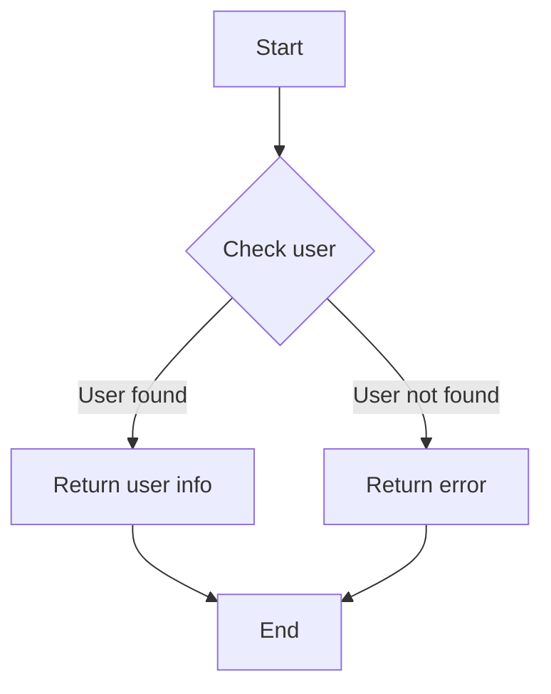
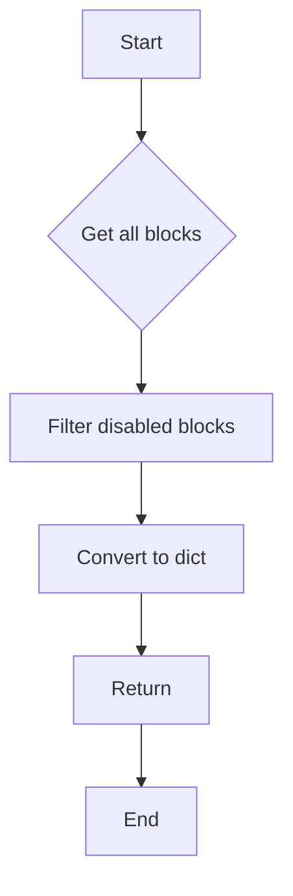
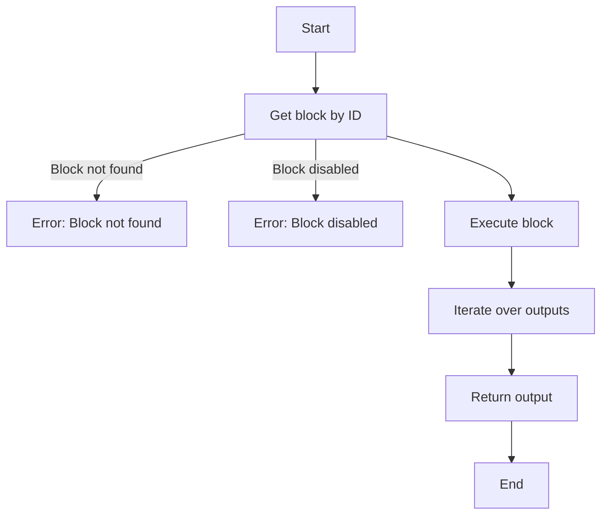
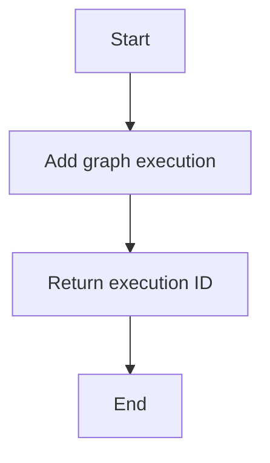
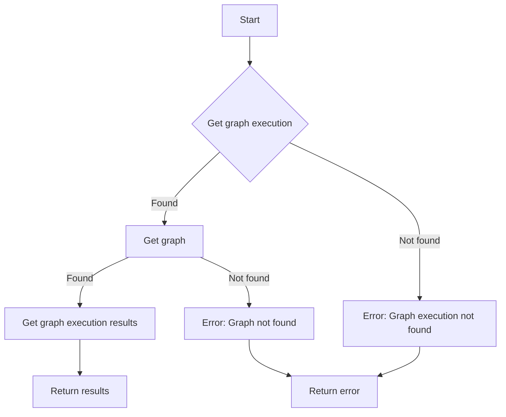
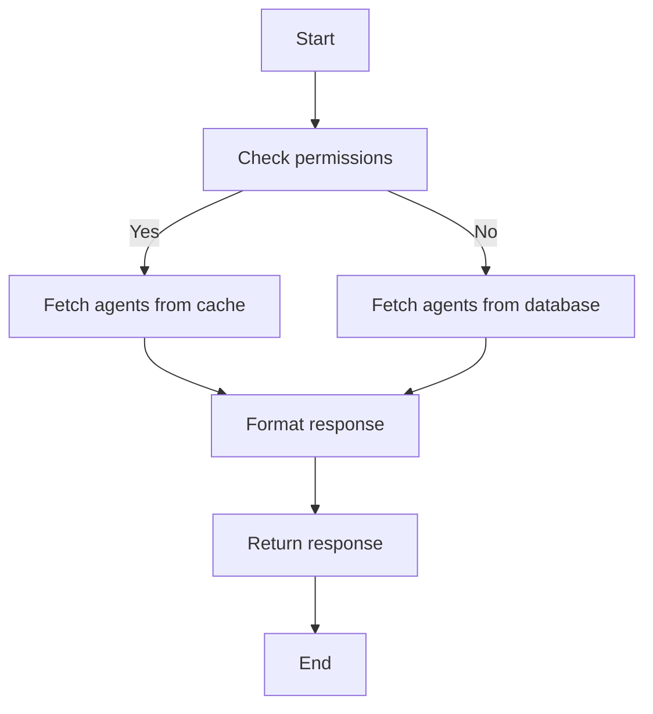
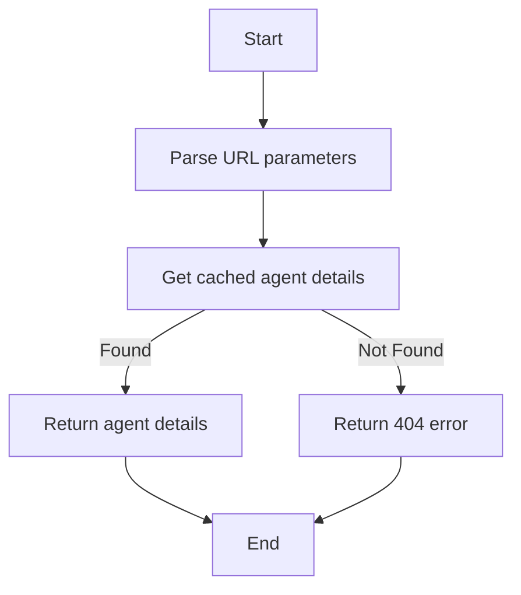
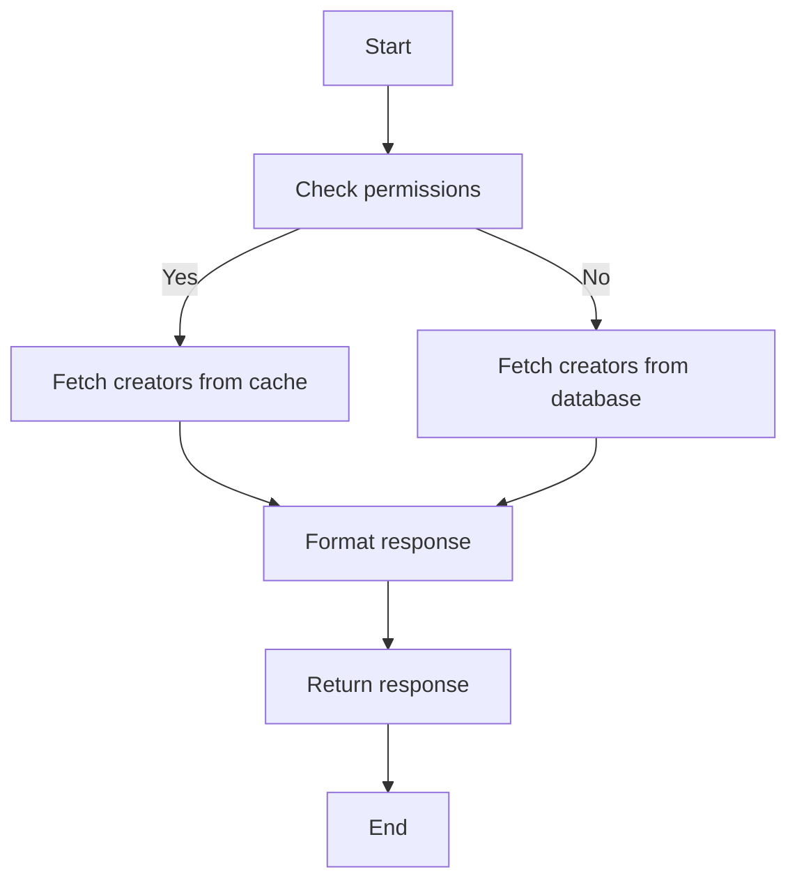
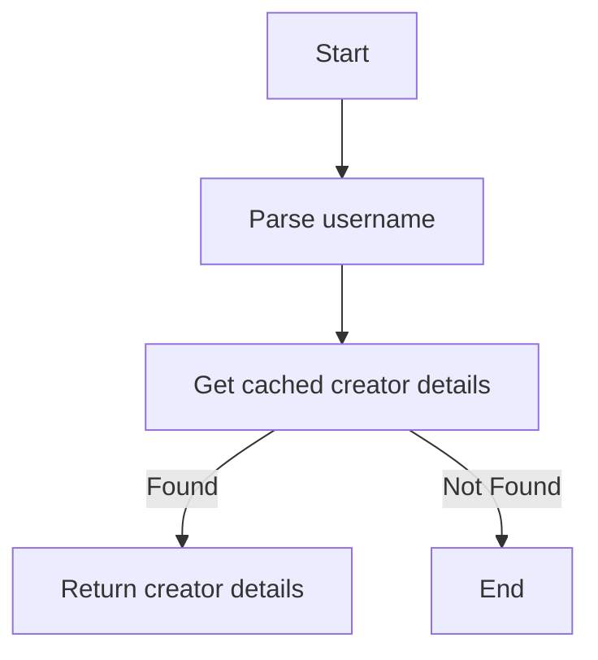

# `.\AutoGPT\autogpt_platform\backend\backend\api\external\v1\routes.py` 详细设计文档

This code defines a FastAPI application with endpoints for user information, graph block execution, and store agent and creator information. It includes authentication, permission checks, and caching mechanisms.

## 整体流程

```mermaid
graph TD
    A[Start] --> B[Get user info via /me endpoint]
    B --> C[Get graph blocks via /blocks endpoint]
    C --> D[Execute graph block via /blocks/{block_id}/execute endpoint]
    D --> E[Execute graph via /graphs/{graph_id}/execute/{graph_version} endpoint]
    E --> F[Get graph execution results via /graphs/{graph_id}/executions/{graph_exec_id}/results endpoint]
    F --> G[Get store agents via /store/agents endpoint]
    G --> H[Get store agent details via /store/agents/{username}/{agent_name} endpoint]
    H --> I[Get store creators via /store/creators endpoint]
    I --> J[Get store creator details via /store/creators/{username} endpoint]
    J --> K[End]
```

## 类结构

```
APIRouter (v1_router)
├── UserInfoResponse (class)
│   ├── id (str)
│   ├── name (Optional[str])
│   ├── email (str)
│   └── timezone (str)
├── ExecutionNode (TypedDict)
│   ├── node_id (str)
│   ├── input (Any)
│   └── output (dict[str, Any])
├── GraphExecutionResult (TypedDict)
│   ├── execution_id (str)
│   ├── status (str)
│   ├── nodes (list[ExecutionNode])
│   └── output (Optional[list[dict[str, str]]])
├── StoreAgentsResponse (class)
├── StoreAgentDetails (class)
├── CreatorsResponse (class)
└── CreatorDetails (class)
```

## 全局变量及字段


### `settings`
    
Contains application settings.

类型：`Settings`
    


### `logger`
    
Logger for the module.

类型：`logging.Logger`
    


### `v1_router`
    
API router for version 1 endpoints.

类型：`APIRouter`
    


### `UserInfoResponse.id`
    
Unique identifier for the user.

类型：`str`
    


### `UserInfoResponse.name`
    
Name of the user, if available.

类型：`Optional[str]`
    


### `UserInfoResponse.email`
    
Email address of the user.

类型：`str`
    


### `UserInfoResponse.timezone`
    
Timezone of the user, or 'not-set' if not set.

类型：`str`
    


### `ExecutionNode.node_id`
    
Unique identifier for the execution node.

类型：`str`
    


### `ExecutionNode.input`
    
Input data for the execution node.

类型：`Any`
    


### `ExecutionNode.output`
    
Output data from the execution node.

类型：`dict[str, Any]`
    


### `GraphExecutionResult.execution_id`
    
Unique identifier for the graph execution.

类型：`str`
    


### `GraphExecutionResult.status`
    
Status of the graph execution.

类型：`str`
    


### `GraphExecutionResult.nodes`
    
List of execution nodes involved in the graph execution.

类型：`list[ExecutionNode]`
    


### `GraphExecutionResult.output`
    
Output data from the graph execution, if completed.

类型：`Optional[list[dict[str, str]]]`
    
    

## 全局函数及方法


### `get_user_info`

获取当前用户的详细信息。

参数：

- `auth`：`APIAuthorizationInfo`，授权信息，用于验证用户身份。

返回值：`UserInfoResponse`，包含用户ID、姓名、电子邮件和时区。

#### 流程图



#### 带注释源码

```python
@v1_router.get(
    path="/me",
    tags=["user", "meta"],
)
async def get_user_info(
    auth: APIAuthorizationInfo = Security(
        require_permission(APIKeyPermission.IDENTITY)
    ),
) -> UserInfoResponse:
    user = await user_db.get_user_by_id(auth.user_id)
    if user:
        return UserInfoResponse(
            id=user.id,
            name=user.name,
            email=user.email,
            timezone=user.timezone,
        )
    else:
        raise HTTPException(status_code=404, detail="User not found.")
```


### `get_graph_blocks`

获取所有未禁用的块信息。

参数：

- 无

返回值：`Sequence[dict[Any, Any]]`，包含所有未禁用块的字典表示。

#### 流程图



#### 带注释源码

```python
@v1_router.get(
    path="/blocks",
    tags=["blocks"],
    dependencies=[Security(require_permission(APIKeyPermission.READ_BLOCK))],
)
async def get_graph_blocks() -> Sequence[dict[Any, Any]]:
    blocks = [block() for block in backend.data.block.get_blocks().values()]
    return [b.to_dict() for b in blocks if not b.disabled]
```


### `execute_graph_block`

This function executes a specific block within a graph based on the provided block ID and data.

参数：

- `block_id`：`str`，The unique identifier of the block to be executed.
- `data`：`BlockInput`，The input data required for the block execution.

返回值：`CompletedBlockOutput`，A dictionary containing the output data from the block execution.

#### 流程图



#### 带注释源码

```python
@v1_router.post(
    path="/blocks/{block_id}/execute",
    tags=["blocks"],
    dependencies=[Security(require_permission(APIKeyPermission.EXECUTE_BLOCK))],
)
async def execute_graph_block(
    block_id: str,
    data: BlockInput,
    auth: APIAuthorizationInfo = Security(
        require_permission(APIKeyPermission.EXECUTE_BLOCK)
    ),
) -> CompletedBlockOutput:
    obj = backend.data.block.get_block(block_id)
    if not obj:
        raise HTTPException(status_code=404, detail=f"Block #{block_id} not found.")
    if obj.disabled:
        raise HTTPException(status_code=403, detail=f"Block #{block_id} is disabled.")

    output = defaultdict(list)
    async for name, data in obj.execute(data):
        output[name].append(data)
    return output
```


### `execute_graph`

执行一个图形的执行，返回执行ID。

参数：

- `graph_id`：`str`，图形ID。
- `graph_version`：`int`，图形版本。
- `node_input`：`dict[str, Any]`，节点输入数据。

返回值：`dict[str, Any]`，包含执行ID。

#### 流程图



#### 带注释源码

```python
@v1_router.post(
    path="/graphs/{graph_id}/execute/{graph_version}",
    tags=["graphs"],
)
async def execute_graph(
    graph_id: str,
    graph_version: int,
    node_input: Annotated[dict[str, Any], Body(..., embed=True, default_factory=dict)],
    auth: APIAuthorizationInfo = Security(
        require_permission(APIKeyPermission.EXECUTE_GRAPH)
    ),
) -> dict[str, Any]:
    try:
        graph_exec = await add_graph_execution(
            graph_id=graph_id,
            user_id=auth.user_id,
            inputs=node_input,
            graph_version=graph_version,
        )
        return {"id": graph_exec.id}
    except Exception as e:
        msg = str(e).encode().decode("unicode_escape")
        raise HTTPException(status_code=400, detail=msg)
```


### get_graph_execution_results

获取特定图形执行的详细信息，包括执行状态、节点执行结果和输出。

参数：

- `graph_id`：`str`，图形的唯一标识符。
- `graph_exec_id`：`str`，图形执行的唯一标识符。
- `auth`：`APIAuthorizationInfo`，API授权信息。

返回值：`GraphExecutionResult`，包含执行ID、状态、节点和输出。

#### 流程图



#### 带注释源码

```python
@v1_router.get(
    path="/graphs/{graph_id}/executions/{graph_exec_id}/results",
    tags=["graphs"],
)
async def get_graph_execution_results(
    graph_id: str,
    graph_exec_id: str,
    auth: APIAuthorizationInfo = Security(
        require_permission(APIKeyPermission.READ_GRAPH)
    ),
) -> GraphExecutionResult:
    graph_exec = await execution_db.get_graph_execution(
        user_id=auth.user_id,
        execution_id=graph_exec_id,
        include_node_executions=True,
    )
    if not graph_exec:
        raise HTTPException(
            status_code=404, detail=f"Graph execution #{graph_exec_id} not found."
        )

    if not await graph_db.get_graph(
        graph_id=graph_exec.graph_id,
        version=graph_exec.graph_version,
        user_id=auth.user_id,
    ):
        raise HTTPException(status_code=404, detail=f"Graph #{graph_id} not found.")

    return GraphExecutionResult(
        execution_id=graph_exec_id,
        status=graph_exec.status.value,
        nodes=[
            ExecutionNode(
                node_id=node_exec.node_id,
                input=node_exec.input_data.get("value", node_exec.input_data),
                output={k: v for k, v in node_exec.output_data.items()},
            )
            for node_exec in graph_exec.node_executions
        ],
        output=(
            [
                {name: value}
                for name, values in graph_exec.outputs.items()
                for value in values
            ]
            if graph_exec.status == AgentExecutionStatus.COMPLETED
            else None
        ),
    )
```


### get_store_agents

Get a paginated list of agents from the store with optional filtering and sorting.

参数：

- `featured`：`bool`，Filter to only show featured agents
- `creator`：`str | None`，Filter agents by creator username
- `sorted_by`：`Literal["rating", "runs", "name", "updated_at"] | None`，Sort agents by "runs", "rating", "name", or "updated_at"
- `search_query`：`str | None`，Search agents by name, subheading and description
- `category`：`str | None`，Filter agents by category
- `page`：`int`，Page number for pagination (default 1)
- `page_size`：`int`，Number of agents per page (default 20)

返回值：`store_model.StoreAgentsResponse`，Paginated list of agents matching the filters

#### 流程图



#### 带注释源码

```python
@v1_router.get(
    path="/store/agents",
    tags=["store"],
    dependencies=[Security(require_permission(APIKeyPermission.READ_STORE))],
    response_model=store_model.StoreAgentsResponse,
)
async def get_store_agents(
    featured: bool = False,
    creator: str | None = None,
    sorted_by: Literal["rating", "runs", "name", "updated_at"] | None = None,
    search_query: str | None = None,
    category: str | None = None,
    page: int = 1,
    page_size: int = 20,
) -> store_model.StoreAgentsResponse:
    """
    Get a paginated list of agents from the store with optional filtering and sorting.

    Args:
        featured: Filter to only show featured agents
        creator: Filter agents by creator username
        sorted_by: Sort agents by "runs", "rating", "name", or "updated_at"
        search_query: Search agents by name, subheading and description
        category: Filter agents by category
        page: Page number for pagination (default 1)
        page_size: Number of agents per page (default 20)

    Returns:
        StoreAgentsResponse: Paginated list of agents matching the filters
    """
    if page < 1:
        raise HTTPException(status_code=422, detail="Page must be greater than 0")

    if page_size < 1:
        raise HTTPException(status_code=422, detail="Page size must be greater than 0")

    agents = await store_cache._get_cached_store_agents(
        featured=featured,
        creator=creator,
        sorted_by=sorted_by,
        search_query=search_query,
        category=category,
        page=page,
        page_size=page_size,
    )
    return agents
```


### `get_store_agent`

Get details of a specific store agent by username and agent name.

参数：

- `username`：`str`，Creator's username
- `agent_name`：`str`，Name/slug of the agent

返回值：`store_model.StoreAgentDetails`，Detailed information about the agent

#### 流程图



#### 带注释源码

```python
@v1_router.get(
    path="/store/agents/{username}/{agent_name}",
    tags=["store"],
    dependencies=[Security(require_permission(APIKeyPermission.READ_STORE))],
    response_model=store_model.StoreAgentDetails,
)
async def get_store_agent(
    username: str,
    agent_name: str,
) -> store_model.StoreAgentDetails:
    """
    Get details of a specific store agent by username and agent name.

    Args:
        username: Creator's username
        agent_name: Name/slug of the agent

    Returns:
        StoreAgentDetails: Detailed information about the agent
    """
    username = urllib.parse.unquote(username).lower()
    agent_name = urllib.parse.unquote(agent_name).lower()
    agent = await store_cache._get_cached_agent_details(
        username=username, agent_name=agent_name
    )
    return agent
```


### get_store_creators

Get a paginated list of store creators with optional filtering and sorting.

参数：

- `featured`: `bool`，Filter to only show featured creators
- `search_query`: `str | None`，Search creators by profile description
- `sorted_by`: `Literal["agent_rating", "agent_runs", "num_agents"] | None`，Sort by "agent_rating", "agent_runs", or "num_agents"
- `page`: `int`，Page number for pagination (default 1)
- `page_size`: `int`，Number of creators per page (default 20)

返回值：`store_model.CreatorsResponse`，Paginated list of creators matching the filters

#### 流程图



#### 带注释源码

```python
@v1_router.get(
    path="/store/creators",
    tags=["store"],
    dependencies=[Security(require_permission(APIKeyPermission.READ_STORE))],
    response_model=store_model.CreatorsResponse,
)
async def get_store_creators(
    featured: bool = False,
    search_query: str | None = None,
    sorted_by: Literal["agent_rating", "agent_runs", "num_agents"] | None = None,
    page: int = 1,
    page_size: int = 20,
) -> store_model.CreatorsResponse:
    """
    Get a paginated list of store creators with optional filtering and sorting.

    Args:
        featured: Filter to only show featured creators
        search_query: Search creators by profile description
        sorted_by: Sort by "agent_rating", "agent_runs", or "num_agents"
        page: Page number for pagination (default 1)
        page_size: Number of creators per page (default 20)

    Returns:
        CreatorsResponse: Paginated list of creators matching the filters
    """
    if page < 1:
        raise HTTPException(status_code=422, detail="Page must be greater than 0")

    if page_size < 1:
        raise HTTPException(status_code=422, detail="Page size must be greater than 0")

    creators = await store_cache._get_cached_store_creators(
        featured=featured,
        search_query=search_query,
        sorted_by=sorted_by,
        page=page,
        page_size=page_size,
    )
    return creators
```


### `get_store_creator`

Get details of a specific store creator by username.

参数：

- `username`：`str`，Creator's username

返回值：`store_model.CreatorDetails`，Detailed information about the creator

#### 流程图



#### 带注释源码

```python
@v1_router.get(
    path="/store/creators/{username}",
    tags=["store"],
    dependencies=[Security(require_permission(APIKeyPermission.READ_STORE))],
    response_model=store_model.CreatorDetails,
)
async def get_store_creator(
    username: str,
) -> store_model.CreatorDetails:
    """
    Get details of a specific store creator by username.

    Args:
        username: Creator's username

    Returns:
        CreatorDetails: Detailed information about the creator
    """
    username = urllib.parse.unquote(username).lower()
    creator = await store_cache._get_cached_creator_details(username=username)
    return creator
```


## 关键组件


### 张量索引与惰性加载

张量索引与惰性加载是用于高效处理大规模数据集的关键组件，它允许在需要时才加载数据，从而减少内存消耗和提高性能。

### 反量化支持

反量化支持是用于优化模型性能的关键组件，它允许在模型执行过程中动态调整量化参数，以适应不同的运行环境。

### 量化策略

量化策略是用于优化模型性能的关键组件，它通过减少模型中使用的数值精度来降低模型的复杂度和内存消耗。


## 问题及建议


### 已知问题

-   **全局变量和函数依赖**: 代码中存在大量的全局变量和函数调用，这可能导致代码的可维护性和可测试性降低。例如，`settings` 和 `logger` 是全局变量，它们在多个地方被引用，但修改这些变量可能会影响整个应用程序。
-   **重复的权限检查**: 在多个路由中，使用了相同的权限检查函数 `require_permission`。如果权限检查逻辑发生变化，需要修改多个地方，这增加了维护成本。
-   **异常处理**: 代码中使用了 `HTTPException` 来处理异常，但没有提供详细的错误信息，这可能会使得调试和错误追踪变得困难。
-   **代码风格**: 代码风格不一致，例如缩进和命名约定，这可能会影响代码的可读性。

### 优化建议

-   **模块化**: 将全局变量和函数封装到模块中，提高代码的可维护性和可测试性。
-   **权限检查**: 使用装饰器或中间件来统一处理权限检查，减少重复代码。
-   **异常处理**: 提供更详细的错误信息，并考虑使用自定义异常类来提高错误处理的灵活性。
-   **代码风格**: 使用代码风格指南（如 PEP 8）来统一代码风格，提高代码的可读性。
-   **缓存**: 对于频繁访问的数据，考虑使用缓存来提高性能。
-   **日志记录**: 使用更详细的日志记录来帮助调试和监控应用程序。
-   **单元测试**: 编写单元测试来确保代码的正确性和稳定性。
-   **API版本控制**: 考虑使用 API 版本控制来管理 API 变更。
-   **性能监控**: 实施性能监控来识别和优化性能瓶颈。
-   **安全性**: 对敏感数据进行加密，并确保 API 安全性。


## 其它


### 设计目标与约束

- 设计目标：
  - 提供一个RESTful API，用于管理用户信息、执行图块、执行图以及存储代理。
  - 确保API的安全性，通过权限验证来限制对敏感操作的访问。
  - 提供高效的缓存机制，以减少数据库访问次数，提高性能。
  - 确保API的响应时间在可接受范围内，提供良好的用户体验。

- 约束：
  - 必须使用FastAPI框架来构建API。
  - 必须使用Prisma ORM进行数据库操作。
  - 必须遵循RESTful设计原则。
  - 必须使用Pydantic进行数据验证。

### 错误处理与异常设计

- 错误处理：
  - 使用HTTPException来处理常见的HTTP错误，如404（未找到）和403（禁止访问）。
  - 对于自定义错误，提供详细的错误信息，以便客户端能够了解错误原因。

- 异常设计：
  - 使用try-except块来捕获可能发生的异常，并转换为适当的HTTP响应。

### 数据流与状态机

- 数据流：
  - 用户请求API，API处理请求并从数据库或其他服务获取数据。
  - 处理完请求后，API将响应数据发送回用户。

- 状态机：
  - 图块和图的执行状态可能包括“未开始”、“进行中”和“完成”。
  - 状态机用于跟踪和管理这些状态。

### 外部依赖与接口契约

- 外部依赖：
  - FastAPI
  - Prisma ORM
  - Pydantic
  - logging
  - urllib.parse
  - collections
  - typing
  - typing_extensions

- 接口契约：
  - 使用Pydantic模型来定义请求和响应的数据结构。
  - 使用FastAPI的依赖注入系统来处理权限验证。


    