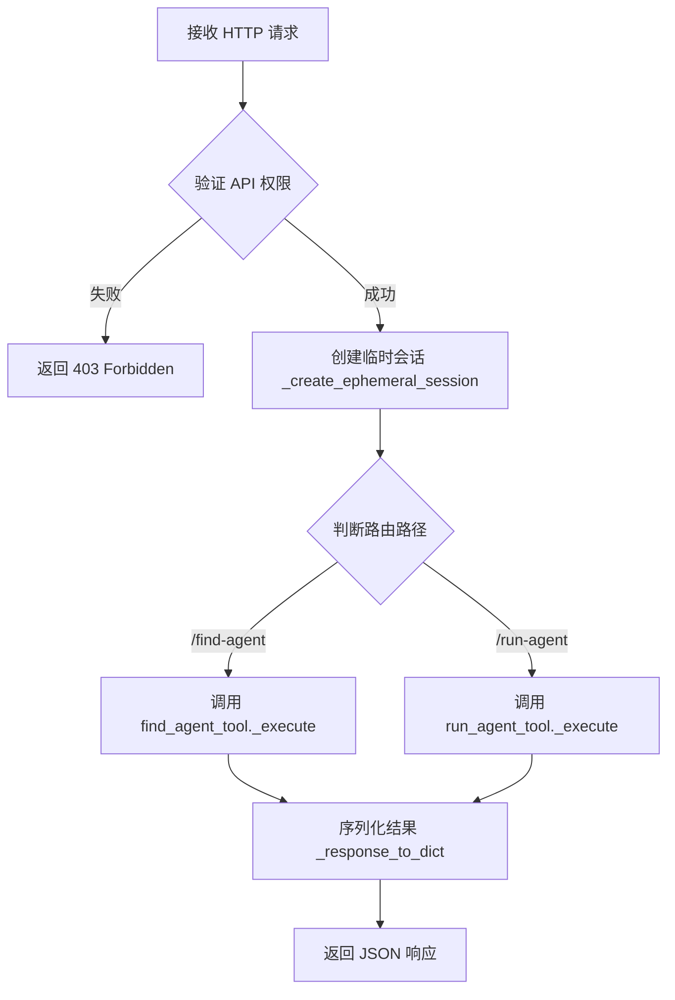
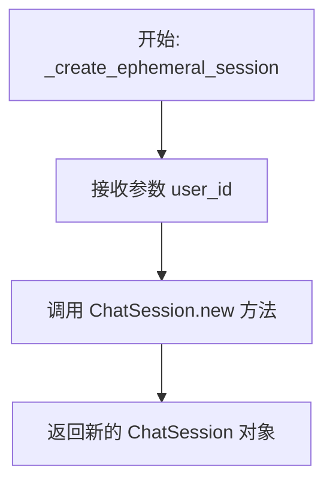
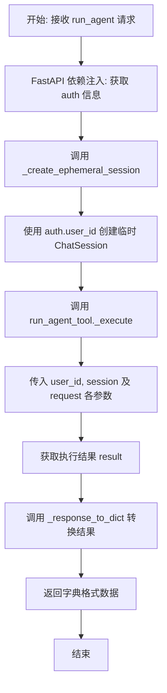

# `AutoGPT\autogpt_platform\backend\backend\api\external\v1\tools.py` 详细设计文档

该代码定义了一组用于外部访问聊天工具（Agent）的无状态 HTTP API 端点，包括查找 Agent 和运行/调度 Agent 的功能，通过创建临时会话（Ephemeral Sessions）来处理请求，并强制要求 API 密钥权限验证。

## 整体流程



## 类结构

```
pydantic.BaseModel
├── FindAgentRequest
└── RunAgentRequest
```

## 全局变量及字段


### `logger`
    
Logger instance for recording module events and errors.

类型：`logging.Logger`
    


### `tools_router`
    
FastAPI router instance defining the endpoints for external tools API.

类型：`fastapi.APIRouter`
    


### `FindAgentRequest.query`
    
Search query for finding agents.

类型：`str`
    


### `RunAgentRequest.username_agent_slug`
    
The marketplace agent slug (e.g., 'username/agent-name').

类型：`str`
    


### `RunAgentRequest.inputs`
    
Dictionary of input values for the agent.

类型：`dict[str, Any]`
    


### `RunAgentRequest.use_defaults`
    
Set to true to run with default values (user must confirm).

类型：`bool`
    


### `RunAgentRequest.schedule_name`
    
Name for scheduled execution (triggers scheduling mode).

类型：`str | None`
    


### `RunAgentRequest.cron`
    
Cron expression (5 fields: minute hour day month weekday).

类型：`str | None`
    


### `RunAgentRequest.timezone`
    
IANA timezone (e.g., 'America/New_York', 'UTC').

类型：`str`
    
    

## 全局函数及方法


### `_create_ephemeral_session`

为无状态 API 请求创建一个临时的会话对象。

参数：

-  `user_id`：`str`，用户的唯一标识符，用于初始化会话。

返回值：`ChatSession`，一个新创建的、非持久化的聊天会话实例。

#### 流程图



#### 带注释源码

```python
def _create_ephemeral_session(user_id: str) -> ChatSession:
    """Create an ephemeral session for stateless API requests."""
    # 调用 ChatSession 类的工厂方法 .new()
    # 传入 user_id 以创建一个新的、不持久化到 Redis 的会话实例
    return ChatSession.new(user_id)
```


### `find_agent`

Search for agents in the marketplace based on capabilities and user needs.

参数：

-  `request`：`FindAgentRequest`，Search query for finding agents
-  `auth`：`APIAuthorizationInfo`，Authentication information containing user ID and permissions, injected by FastAPI Security dependency

返回值：`dict[str, Any]`，List of matching agents or no results response

#### 流程图

```mermaid
graph TD
    A[开始: 接收 POST /tools/find-agent 请求] --> B[解析请求体 FindAgentRequest]
    B --> C[验证权限 APIAuthorizationInfo]
    C --> D[创建临时会话 _create_ephemeral_session]
    D --> E[调用 find_agent_tool._execute 执行查找]
    E --> F[处理结果并转换为字典 _response_to_dict]
    F --> G[返回响应 dict[str, Any]]
```

#### 带注释源码

```python
@tools_router.post(
    path="/find-agent",
)
async def find_agent(
    # 请求体，包含搜索查询字符串
    request: FindAgentRequest,
    # 依赖注入：验证 API 密钥权限并获取授权信息（包含 user_id）
    auth: APIAuthorizationInfo = Security(
        require_permission(APIKeyPermission.USE_TOOLS)
    ),
) -> dict[str, Any]:
    """
    Search for agents in the marketplace based on capabilities and user needs.

    Args:
        request: Search query for finding agents

    Returns:
        List of matching agents or no results response
    """
    # 为无状态 API 请求创建一个临时的会话对象
    # 注意：此处不使用 Redis 持久化，计数器归零
    session = _create_ephemeral_session(auth.user_id)
    
    # 调用核心工具逻辑查找代理
    # 传入用户 ID、临时会话以及查询内容
    result = await find_agent_tool._execute(
        user_id=auth.user_id,
        session=session,
        query=request.query,
    )
    
    # 将工具返回的响应对象转换为字典，以便 JSON 序列化
    return _response_to_dict(result)
```


### `run_agent`

通过HTTP无状态端点运行或调度市场代理的异步FastAPI路由处理程序。该函数负责接收请求、验证权限、创建临时会话，并委托底层工具执行具体的代理运行或调度逻辑。

参数：

-  `request`：`RunAgentRequest`，包含代理标识符（slug）、输入参数、是否使用默认值的标志以及可选的调度配置（如cron表达式和时区）的请求体。
-  `auth`：`APIAuthorizationInfo`，由FastAPI安全依赖注入的授权信息对象，包含用户身份信息（如user_id），用于权限验证和会话创建。

返回值：`dict[str, Any]`，包含代理执行或调度结果的字典，数据经过JSON序列化处理，可能包含设置要求、执行开始状态或错误信息。

#### 流程图



#### 带注释源码

```python
@tools_router.post(
    path="/run-agent",
)
async def run_agent(
    request: RunAgentRequest,
    auth: APIAuthorizationInfo = Security(
        require_permission(APIKeyPermission.USE_TOOLS)
    ),
) -> dict[str, Any]:
    """
    Run or schedule an agent from the marketplace.

    The endpoint automatically handles the setup flow:
    - Returns missing inputs if required fields are not provided
    - Returns missing credentials if user needs to configure them
    - Executes immediately if all requirements are met
    - Schedules execution if schedule_name and cron are provided

    For scheduled execution:
    - Cron format: "minute hour day month weekday"
    - Examples: "0 9 * * 1-5" (9am weekdays), "0 0 * * *" (daily at midnight)
    - Timezone: Use IANA timezone names like "America/New_York"

    Args:
        request: Agent slug, inputs, and optional schedule config

    Returns:
        - setup_requirements: If inputs or credentials are missing
        - execution_started: If agent was run or scheduled successfully
        - error: If something went wrong
    """
    # 为当前无状态API请求创建一个短暂的会话对象，不持久化到Redis
    session = _create_ephemeral_session(auth.user_id)
    
    # 调用底层工具执行代理运行或调度逻辑
    # 传递用户ID、临时会话以及从请求体中提取的参数（如slug、输入、配置等）
    result = await run_agent_tool._execute(
        user_id=auth.user_id,
        session=session,
        username_agent_slug=request.username_agent_slug,
        inputs=request.inputs,
        use_defaults=request.use_defaults,
        schedule_name=request.schedule_name or "",
        cron=request.cron or "",
        timezone=request.timezone,
    )
    
    # 将工具返回的响应对象转换为字典，以便进行HTTP JSON响应
    return _response_to_dict(result)
```


### `_response_to_dict`

将工具响应对象（ToolResponseBase）转换为字典，以便进行 JSON 序列化。

参数：

-  `result`：`ToolResponseBase`，需要被转换的工具响应对象

返回值：`dict[str, Any]`，包含序列化后工具响应数据的字典，用于构建 HTTP JSON 响应

#### 流程图

```mermaid
flowchart TD
    Start([开始: _response_to_dict]) --> Input[接收参数 result: ToolResponseBase]
    Input --> Dump[调用 result.model_dump 方法]
    Dump --> End([返回 dict[str, Any]])
```

#### 带注释源码

```python
def _response_to_dict(result: ToolResponseBase) -> dict[str, Any]:
    """Convert a tool response to a dictionary for JSON serialization."""
    # 调用 Pydantic 模型的 model_dump() 方法
    # 该方法将模型实例转换为标准的 Python 字典，方便 FastAPI 自动处理为 JSON 响应
    return result.model_dump()
```


## 关键组件


### tools_router
The FastAPI router instance that defines the HTTP endpoints for external agent tool interactions.

### Request Validation Models
Pydantic models (FindAgentRequest, RunAgentRequest) that define the schema, validation rules, and descriptions for incoming API payloads.

### Ephemeral Session Manager (_create_ephemeral_session)
A utility function that creates temporary, non-persisted ChatSession objects to handle stateless requests without Redis storage.

### Authentication and Authorization Middleware
Security dependencies (APIAuthorizationInfo, require_permission) that validate API keys and enforce access control (USE_TOOLS permission) for endpoints.

### Agent Tool Execution Services
External business logic modules (find_agent_tool, run_agent_tool) that handle the core operations of searching the marketplace and executing or scheduling agents.


## 问题及建议


### 已知问题

-   **速率限制机制缺失**：代码注释明确指出由于使用临时会话（Ephemeral Sessions），基于会话的速率限制（如 `max_agent_runs`）被绕过，且当前代码层未实现针对 API Key 的替代限流机制，这可能导致 API 被滥用。
-   **返回类型不透明**：端点函数的返回值类型注解为 `dict[str, Any]`，这导致 FastAPI 无法生成精确的 OpenAPI/Swagger 文档。前端或客户端无法获得响应结构的明确校验，降低了 API 的易用性和类型安全性。
-   **会话初始化潜在开销**：每一个请求都会调用 `_create_ephemeral_session` 创建一个新的 `ChatSession` 对象。如果 `ChatSession.new(user_id)` 内部涉及复杂的初始化逻辑或数据库查询，在高并发场景下可能会造成不必要的资源消耗和延迟。
-   **输入验证不够严格**：对于 `username_agent_slug`，虽然文档描述了格式（`username/agent-name`），但代码层（Pydantic 模型）并未使用正则表达式等进行严格格式校验，无效的格式可能在传递到深层逻辑后才报错，增加了无效请求的处理成本。

### 优化建议

-   **实现 API 层级的速率限制**：建议在中间件或路由依赖项中引入基于 Redis 的速率限制器，使用 `APIKey` ID 或 `User ID` 作为限流键，而非依赖会话状态，以防止 API 消费者过度调用。
-   **定义明确的响应模型**：将 `dict[str, Any]` 替换为具体的 Pydantic 模型（例如 `AgentSearchResponse` 和 `AgentRunResponse`），以便自动生成准确的 API 文档并为客户端提供数据校验能力。
-   **优化会话处理策略**：评估 `ChatSession.new` 的开销。如果仅用于无状态请求，考虑实现一个轻量级的 `SessionContext` 或仅传递必要的 User ID 和上下文信息，而非实例化完整的会话对象；或者如果必须使用，确保其初始化过程是异步且高效的。
-   **增强请求参数校验**：在 `RunAgentRequest` 中对 `username_agent_slug` 添加正则验证（例如 `^[a-zA-Z0-9_-]+/[a-zA-Z0-9_-]+$`），在入口处拦截格式错误的请求。
-   **引入依赖注入以提高可测试性**：将 `find_agent_tool` 和 `run_agent_tool` 的调用通过依赖注入的方式传入，而非直接导入调用，这样在单元测试中可以更容易地 Mock 这些工具的行为。


## 其它


### 设计目标与约束

本模块旨在为外部客户端提供无状态的HTTP接口，用于发现和执行智能体工具。主要设计目标和约束如下：
1. **无状态性**：端点不将会话数据持久化到Redis或数据库中。每个请求都会创建一个新的内存会话，计数器重置为零，确保服务的横向扩展能力。
2. **速率限制策略**：由于使用短暂会话，基于会话的速率限制（如`max_agent_runs`）在此处不生效。外部API消费者的速率限制必须通过API Key配额等外部机制单独管理。
3. **安全性**：所有端点强制要求`APIKeyPermission.USE_TOOLS`权限，确保只有持有有效且具有相应权限的API Key的请求才能通过。
4. **自动化流程处理**：`run-agent`端点设计为自动处理设置流程，即自动判断是返回所需输入配置、提示缺失凭据，还是直接执行或调度任务，以简化外部集成复杂度。

### 错误处理与异常设计

本模块采用分层错误处理策略，依赖于FastAPI的标准异常处理机制和底层工具逻辑：
1. **认证与授权异常**：通过`Security`依赖注入的`require_permission`拦截。如果API Key无效、过期或缺少`USE_TOOLS`权限，FastAPI将自动返回401 Unauthorized或403 Forbidden响应。
2. **请求验证异常**：通过Pydantic模型（`FindAgentRequest`, `RunAgentRequest`）自动验证。如果请求体缺失必填字段（如`query`或`username_agent_slug`）或类型不匹配，FastAPI将返回422 Unprocessable Entity错误详情。
3. **业务逻辑异常**：核心逻辑委托给`find_agent_tool`和`run_agent_tool`。若这些工具执行过程中抛出异常（如网络错误、内部服务错误、Agent不存在），将由FastAPI的全局异常处理器捕获。根据工具实现的不同，可能返回500 Internal Server Error或具体的业务错误码。
4. **Cron表达式验证**：虽然代码中使用了字符串字段接收Cron表达式，具体的Cron有效性验证逻辑依赖于`run_agent_tool`内部的实现，若验证失败应由该工具抛出相应异常。

### 数据流与状态机

数据流向清晰，严格遵循请求-响应模型，不维持服务端长期状态：
1. **请求接收**：客户端发送POST请求至`/tools/find-agent`或`/tools/run-agent`。
2. **权限校验**：中间件检查API Key及权限，提取`user_id`。
3. **会话创建**：调用`_create_ephemeral_session`为当前请求创建临时的、内存中的`ChatSession`对象。此对象仅在请求处理期间存在，请求结束后即被销毁。
4. **工具执行**：
   - **Find Agent**: 将查询传递给`find_agent_tool._execute`。
   - **Run Agent**: 将参数（如slug, inputs, schedule信息）传递给`run_agent_tool._execute`。该工具内部包含隐式状态判断（如检查是否缺少输入或凭据）。
5. **结果处理**：工具返回`ToolResponseBase`对象，经`_response_to_dict`转换为字典。
6. **响应返回**：FastAPI将字典序列化为JSON返回给客户端。

### 外部依赖与接口契约

本模块依赖于特定的内部组件和外部库，接口契约定义如下：
1. **Web框架**：
   - `fastapi.APIRouter`: 用于路由注册，定义前缀`/tools`。
   - `pydantic.BaseModel`: 用于请求体定义和验证。
2. **数据层**：
   - `prisma.enums.APIKeyPermission`: 提供权限枚举值，用于鉴权。
3. **认证模块** (`backend.data.auth.base`):
   - `APIAuthorizationInfo`: 认证信息载体，必须包含`user_id`属性。
4. **核心业务模块** (`backend.api.features.chat`):
   - `ChatSession`: 必须提供静态方法`new(user_id: str) -> ChatSession`以创建会话。
   - `find_agent_tool`: 必须提供异步方法`_execute(user_id, session, query) -> ToolResponseBase`。
   - `run_agent_tool`: 必须提供异步方法`_execute(user_id, session, username_agent_slug, inputs, use_defaults, schedule_name, cron, timezone) -> ToolResponseBase`。
   - `ToolResponseBase`: 必须是Pydantic模型，支持`model_dump()`方法序列化。
5. **中间件** (`backend.api.external.middleware`):
   - `require_permission`: 必须返回可调用对象，用于FastAPI的`Security`依赖注入，执行权限检查。

    