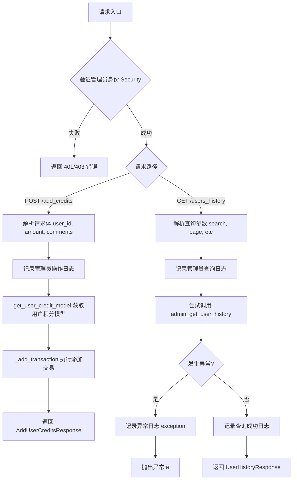
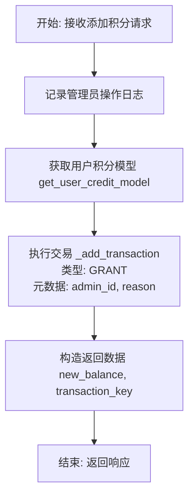
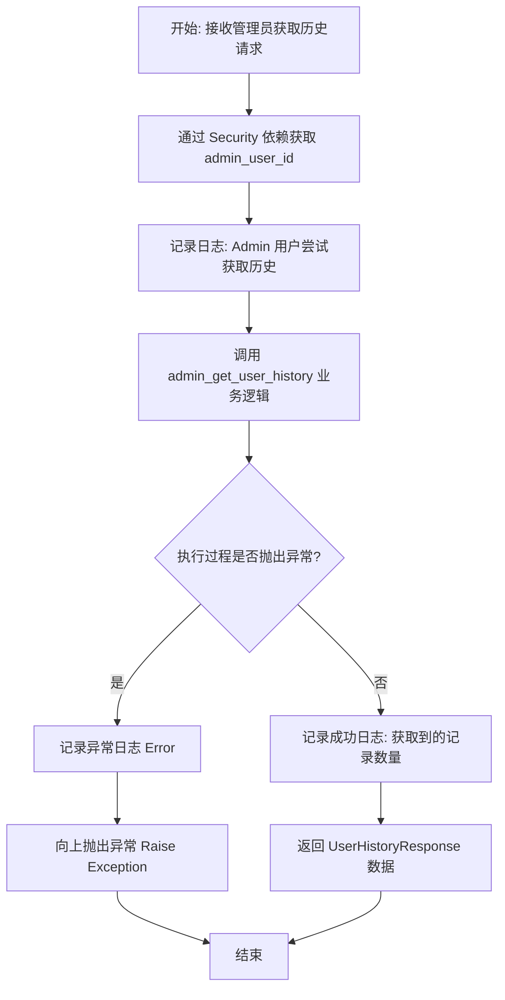

# `AutoGPT\autogpt_platform\backend\backend\api\features\admin\credit_admin_routes.py` 详细设计文档

该代码实现了一个基于 FastAPI 的管理员路由模块，主要用于管理员用户向指定用户账户添加积分（授予额度）以及获取所有用户的积分交易历史记录，包含身份验证、业务逻辑调用和异常处理。

## 整体流程



## 类结构

```
N/A (无自定义类定义)
(依赖的外部类: APIRouter, AddUserCreditsResponse, UserHistoryResponse)
```

## 全局变量及字段


### `router`
    
FastAPI 路由器实例，用于定义和管理管理员权限下的积分相关 API 端点

类型：`fastapi.APIRouter`
    


### `logger`
    
标准日志记录器对象，用于记录模块内的操作日志和错误信息

类型：`logging.Logger`
    


    

## 全局函数及方法


### `add_user_credits`

该函数是一个异步API接口端点，允许管理员向指定用户账户授予一定数量的积分，并记录操作原因及操作者信息。

参数：

- `user_id`：`str`，接收积分的用户唯一标识。
- `amount`：`int`，要增加的积分数值。
- `comments`：`str`，管理员添加积分时的备注或原因。
- `admin_user_id`：`str`，执行此操作的管理员ID，通过FastAPI的安全依赖自动注入。

返回值：`dict`，包含 `new_balance`（用户更新后的积分余额）和 `transaction_key`（本次交易的唯一标识）的字典。

#### 流程图



#### 带注释源码

```python
async def add_user_credits(
    user_id: typing.Annotated[str, Body()],
    amount: typing.Annotated[int, Body()],
    comments: typing.Annotated[str, Body()],
    admin_user_id: str = Security(get_user_id),
):
    # 记录管理员添加积分的操作日志，包含管理员ID、目标用户ID和积分数额
    logger.info(
        f"Admin user {admin_user_id} is adding {amount} credits to user {user_id}"
    )
    # 获取目标用户的积分模型实例
    user_credit_model = await get_user_credit_model(user_id)
    # 调用模型内部方法添加交易记录
    # 交易类型设定为 GRANT (授予)
    # 元数据包含管理员ID和操作备注，使用 SafeJson 进行安全封装
    new_balance, transaction_key = await user_credit_model._add_transaction(
        user_id,
        amount,
        transaction_type=CreditTransactionType.GRANT,
        metadata=SafeJson({"admin_id": admin_user_id, "reason": comments}),
    )
    # 返回操作后的新余额和交易键
    return {
        "new_balance": new_balance,
        "transaction_key": transaction_key,
    }
```


### `admin_get_all_user_history`

这是一个 FastAPI 路由处理函数，用于允许管理员用户分页检索所有用户的信用交易历史记录，支持通过关键词搜索和交易类型进行筛选。

参数：

- `admin_user_id`：`str`，通过安全依赖注入获取的当前管理员用户 ID，用于鉴权和审计日志。
- `search`：`Optional[str]`，用于搜索用户历史记录的可选关键词查询。
- `page`：`int`，当前请求的页码，用于分页显示，默认为 1。
- `page_size`：`int`，每页返回的记录数量，默认为 20。
- `transaction_filter`：`Optional[CreditTransactionType]`，用于按特定交易类型（如授予、使用等）筛选历史记录的可选枚举值。

返回值：`UserHistoryResponse`，包含用户信用历史记录列表及分页信息的响应对象。

#### 流程图



#### 带注释源码

```python
@router.get(
    "/users_history",
    response_model=UserHistoryResponse,
    summary="Get All Users History",
)
async def admin_get_all_user_history(
    admin_user_id: str = Security(get_user_id), # 通过 Security 依赖自动获取当前登录的管理员 ID
    search: typing.Optional[str] = None,       # 可选的搜索关键词，用于筛选特定用户
    page: int = 1,                             # 分页参数：当前页码，默认为 1
    page_size: int = 20,                       # 分页参数：每页大小，默认为 20
    transaction_filter: typing.Optional[CreditTransactionType] = None, # 可选的交易类型过滤器
):
    """ """
    # 记录管理员用户正在查询授予历史的日志
    logger.info(f"Admin user {admin_user_id} is getting grant history")

    try:
        # 调用业务逻辑层获取用户历史数据，传入分页、搜索和过滤参数
        resp = await admin_get_user_history(
            page=page,
            page_size=page_size,
            search=search,
            transaction_filter=transaction_filter,
        )
        # 记录成功获取历史记录的数量
        logger.info(f"Admin user {admin_user_id} got {len(resp.history)} grant history")
        # 返回包含历史记录的响应对象
        return resp
    except Exception as e:
        # 捕获并记录获取历史记录过程中的异常信息
        logger.exception(f"Error getting grant history: {e}")
        # 将异常继续抛出，由 FastAPI 的全局异常处理器处理
        raise e
```


## 关键组件


### Admin Router
FastAPI 路由器组件，用于定义和管理管理员相关的积分操作 API 端点，包含统一的前缀、标签以及基于 Security 的管理员权限验证依赖。

### Add User Credits Endpoint
负责处理向指定用户添加积分的异步 POST 请求，接收用户 ID、金额和备注，通过调用信用模型记录事务并返回新的余额和事务密钥。

### Get All Users History Endpoint
负责处理获取所有用户积分历史记录的异步 GET 请求，支持分页查询、用户名搜索以及按交易类型筛选，并包含异常捕获与日志记录。


## 问题及建议


### 已知问题

-   **违反封装原则**：在 `add_user_credits` 函数中，代码直接调用了 `user_credit_model._add_transaction` 方法（以下划线开头通常表示内部方法）。这违反了封装原则，导致 API 层直接依赖内部实现细节，增加了耦合度，一旦内部逻辑修改，接口将面临失效风险。
-   **无效的异常处理机制**：在 `admin_get_all_user_history` 函数中，`try...except` 块捕获了通用 `Exception`，仅记录日志便使用 `raise e` 原样抛出。这种做法不仅没有实际处理错误，反而干扰了 FastAPI 的全局异常处理机制，且可能导致堆栈信息直接泄露给客户端。
-   **输入参数缺乏校验**：`add_user_credits` 函数的 `amount` 参数在 API 层没有进行业务逻辑校验（例如限制为正整数）。尽管数据层可能有约束，但在 API 入口处缺少防御性编程可能导致不符合预期的业务行为（如扣除积分）。

### 优化建议

-   **引入请求模型（Pydantic Model）**：建议使用 Pydantic 模型（如 `AddCreditsRequest`）封装 `add_user_credits` 的请求参数，替代当前独立的 `Body` 参数。这不仅利用 Pydantic 自动进行类型和数据验证，还能提高代码的可维护性和接口文档的可读性。
-   **遵循 RESTful 资源定位规范**：建议将 `add_user_credits` 中的 `user_id` 参数从请求体移动到 URL 路径参数中（例如 `POST /admin/users/{user_id}/credits`），更符合 RESTful 风格中对特定资源进行操作的语义。
-   **移除冗余异常捕获**：移除 `admin_get_all_user_history` 中的 `try-except` 块，依赖 FastAPI 的全局异常处理器来统一捕获和记录未处理异常，保持业务逻辑代码的整洁。
-   **封装业务逻辑调用**：建议在 `user_credit_model` 或对应的服务层中提供公开的 `grant_credits` 方法，替代直接调用私有的 `_add_transaction`，以确保业务逻辑的封装性和清晰度。


## 其它


### 设计目标与约束

**设计目标：**
提供一个管理员专用的 HTTP API 接口，用于管理系统内的用户积分。主要功能包括向特定用户授予积分（增加余额）以及检索所有用户的积分交易历史记录。该模块旨在确保管理员能够高效、透明地干预用户积分状态。

**设计约束：**
1.  **访问控制**：所有路由仅限于拥有管理员权限的用户访问，通过 FastAPI 的 `Security` 依赖进行强制验证。
2.  **异步处理**：所有 I/O 操作（如数据库访问）必须使用 `async/await` 语法，以保证非阻塞的高并发性能。
3.  **数据一致性**：积分变更操作（`_add_transaction`）必须保证原子性，确保余额计算准确无误。
4.  **类型安全**：严格使用 Python 类型注解和 Pydantic 模型（`AddUserCreditsResponse`, `UserHistoryResponse`）进行请求和响应体的验证。

### 错误处理与异常设计

**总体策略：**
采用依赖 FastAPI 全局异常处理机制结合局部日志记录的策略。系统不吞没异常，而是记录详细的上下文信息后向上抛出，由框架统一转换为 HTTP 响应。

**具体处理逻辑：**
1.  **`admin_get_all_user_history` 接口**：
    *   实现了显式的 `try-except` 块。
    *   **异常捕获**：捕获所有继承自 `Exception` 的通用异常。
    *   **日志记录**：使用 `logger.exception` 记录完整的堆栈跟踪和错误信息。
    *   **异常传播**：使用 `raise e` 将异常继续向上抛出，交由上层处理或返回 500 Internal Server Error。
2.  **`add_user_credits` 接口**：
    *   未包含显式 `try-except`，依赖于数据访问层（`get_user_credit_model` 和 `_add_transaction`）抛出的业务异常或数据库异常。
    *   通过 `SafeJson` 包装元数据，防止因非法字符导致的序列化错误。
3.  **日志记录**：关键操作（如积分添加、历史查询）和错误情况均通过 `logger` 模块记录，包含操作者 ID 和关键参数，便于审计。

### 数据流与状态机

**数据流：**
1.  **请求阶段**：客户端发起 HTTP 请求，携带 Body 参数或 Query 参数。
2.  **认证阶段**：请求到达 FastAPI 路由，触发 `requires_admin_user` 依赖验证身份。
3.  **业务逻辑阶段**：
    *   **添加积分**：提取参数 -> 获取用户信用模型对象 -> 执行事务插入 -> 获取新余额和事务 Key -> 封装响应。
    *   **历史查询**：提取查询条件 -> 调用数据层查询 -> 获取分页历史数据 -> 封装响应。
4.  **响应阶段**：将 Pydantic 模型序列化为 JSON 并返回给客户端。

**状态机：**
该模块主要涉及用户积分状态的变更，核心状态转换如下：
*   **Idle (空闲)** -> **Granting (授分中)**：当管理员调用 `add_user_credits` 时，系统进入“授分中”状态。
*   **Granting (授分中)** -> **Updated (已更新)**：事务成功写入数据库，用户余额增加。
*   **Granting (授分中)** -> **Failed (失败)**：事务写入失败，状态回滚，余额不变。
*   查询操作 (`users_history`) 不改变系统状态，仅为对积分变更记录的快照读取。

### 外部依赖与接口契约

**外部依赖：**
1.  **`autogpt_libs.auth`**：提供身份认证功能。
2.  **`fastapi`**：Web 框架，提供路由、依赖注入和请求处理能力。
3.  **`prisma.enums`**：数据库枚举类型，定义交易类型（如 `CreditTransactionType.GRANT`）。
4.  **`backend.data.credit`**：核心数据访问模块，包含 `get_user_credit_model`（获取模型实例）和 `admin_get_user_history`（查询历史）。
5.  **`backend.util.json`**：工具类，提供 `SafeJson` 用于安全的 JSON 序列化。
6.  **`.model`**：本地模块，定义 API 请求和响应的数据结构（DTO）。

**接口契约：**
1.  **`get_user_credit_model(user_id: str)`**：
    *   *输入*：用户 ID 字符串。
    *   *输出*：返回一个用户信用模型对象，该对象必须实现 `_add_transaction` 方法。
2.  **`admin_get_user_history(...)`**：
    *   *输入*：分页参数、搜索关键词、交易类型过滤器。
    *   *输出*：返回一个符合 `UserHistoryResponse` 结构的对象，包含历史记录列表和分页元数据。
3.  **认证依赖 (`requires_admin_user`, `get_user_id`)**：
    *   *契约*：必须在请求头中包含有效的认证令牌；若通过验证，`get_user_id` 返回当前管理员的 UUID 字符串；若未通过，抛出 401 或 403 异常。

### 安全性设计

1.  **身份认证与授权**：
    *   路由器级别配置了 `dependencies=[Security(requires_admin_user)]`，确保所有挂载在该路由器下的端点（`/admin/add_credits`, `/admin/users_history`）均拒绝非管理员用户的访问。
2.  **操作审计**：
    *   所有关键操作（特别是涉及资产变更的积分添加）均记录操作日志，包含 `admin_user_id`，明确“谁”在“什么时间”执行了“什么操作”。
    *   在添加积分时，将 `admin_id` 和 `reason` 存入交易的 `metadata` 字段，实现不可抵赖的数据库级审计追踪。
3.  **输入验证**：
    *   利用 FastAPI 的 `Body()` 和 Pydantic 模型对输入参数进行类型和格式校验，防止注入攻击或非法数据类型导致的系统崩溃。
    *   使用 `SafeJson` 处理元数据，避免潜在的 JSON 序列化漏洞。

    