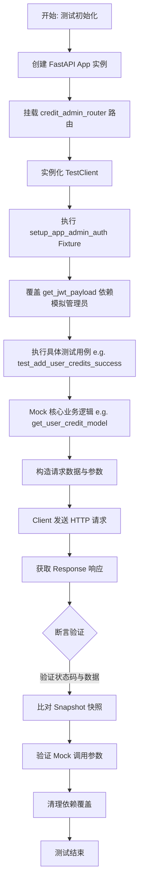
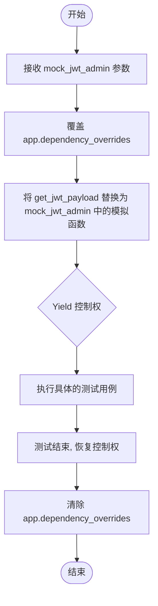
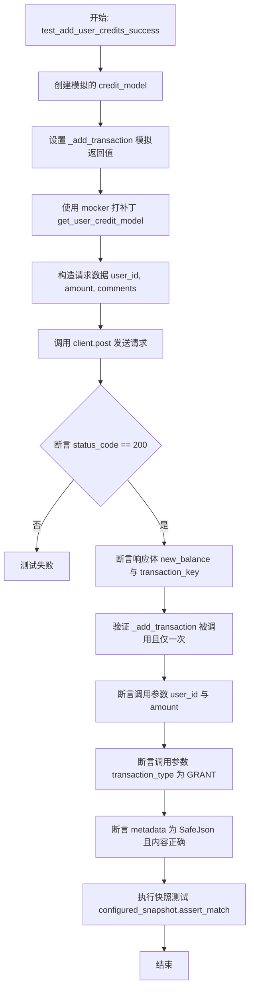
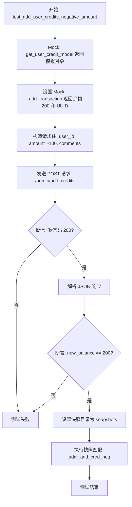
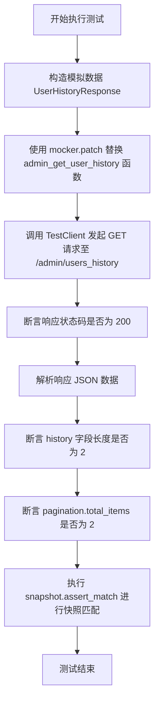
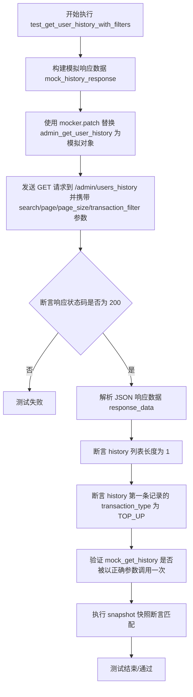
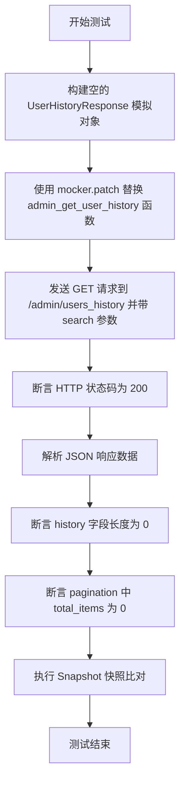
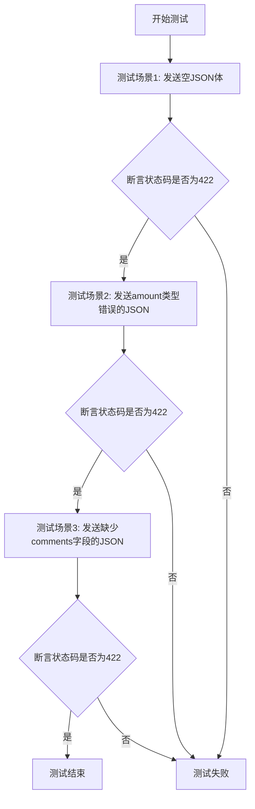
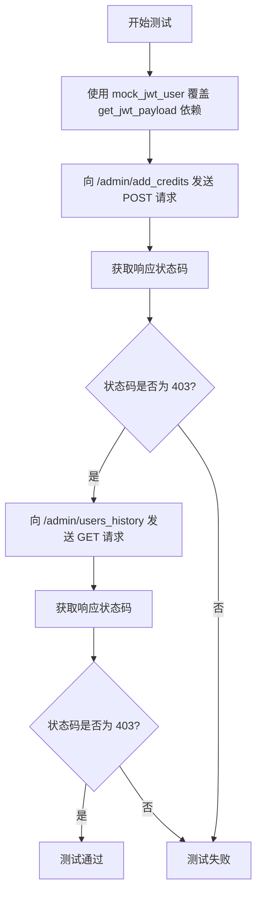

# `AutoGPT\autogpt_platform\backend\backend\api\features\admin\credit_admin_routes_test.py` 详细设计文档

该文件是一个基于 Pytest 的测试套件，用于验证管理员信用管理 API 的功能，涵盖了管理员添加或扣除用户积分、获取用户积分历史记录（支持搜索和过滤）、处理无效请求以及强制执行管理员角色权限访问控制等核心场景。

## 整体流程



## 类结构

```
Module: test_credit_admin_routes
├── Global Variables
│   ├── app
│   └── client
├── Fixtures
│   └── setup_app_admin_auth
└── Test Functions
    ├── test_add_user_credits_success
    ├── test_add_user_credits_negative_amount
    ├── test_get_user_history_success
    ├── test_get_user_history_with_filters
    ├── test_get_user_history_empty_results
    ├── test_add_credits_invalid_request
    └── test_admin_endpoints_require_admin_role
```

## 全局变量及字段


### `app`
    
用于测试的 FastAPI 应用程序实例，集成了信用管理路由。

类型：`fastapi.FastAPI`
    


### `client`
    
用于向测试应用发起 HTTP 请求的测试客户端。

类型：`fastapi.testclient.TestClient`
    


### `credit_admin_router`
    
从 credit_admin_routes 模块导入的路由器，包含管理员信用管理相关的端点定义。

类型：`fastapi.APIRouter`
    


    

## 全局函数及方法


### `setup_app_admin_auth`

这是一个Pytest测试夹具，用于在当前模块的所有测试函数执行前，自动覆盖FastAPI应用的JWT认证依赖项，以模拟管理员身份，并在测试结束后清理依赖覆盖，确保测试环境的隔离性和一致性。

参数：

- `mock_jwt_admin`：`Any`，一个Fixture对象，提供模拟的JWT认证相关的mock对象或字典。

返回值：`Generator`，生成器对象，用于控制测试的执行流程，在测试前后分别执行设置和清理操作。

#### 流程图



#### 带注释源码

```python
@pytest.fixture(autouse=True)
def setup_app_admin_auth(mock_jwt_admin):
    """Setup admin auth overrides for all tests in this module"""
    
    # 将FastAPI应用中的 get_jwt_payload 依赖项覆盖为mock对象
    # 这样在测试调用需要认证的接口时，会直接使用mock的数据，跳过真实认证
    app.dependency_overrides[get_jwt_payload] = mock_jwt_admin["get_jwt_payload"]
    
    # 暂停执行，将控制权交给测试用例
    yield
    
    # 测试用例执行完毕后，清除所有依赖项覆盖，恢复应用原始状态
    # 防止对后续测试或模块产生副作用
    app.dependency_overrides.clear()
```


### `test_add_user_credits_success`

该函数是一个单元测试，用于验证管理员成功为用户添加积分的场景。它通过 Mock 模拟了获取用户信用模型的逻辑，向 `/admin/add_credits` 接口发送 POST 请求，并校验了返回的状态码、JSON 数据（新余额和交易 ID）、以及后端 `_add_transaction` 方法被调用时的参数（包括交易类型和包含管理员 ID 和原因的元数据）。最后，该函数使用快照测试确保响应数据的结构符合预期。

参数：

-   `mocker`：`pytest_mock.MockerFixture`，Pytest-mock 提供的 fixture，用于模拟对象和打补丁，此处用于替换 `get_user_credit_model` 函数。
-   `configured_snapshot`：`Snapshot`，快照测试插件提供的 fixture，用于比对响应数据是否符合预设的快照文件。
-   `admin_user_id`：`str`，Fixture 提供的管理员用户 ID，用于验证请求元数据中的操作者 ID。
-   `target_user_id`：`str`，Fixture 提供的目标用户 ID，作为被添加积分的目标用户。

返回值：`None`，该函数为测试函数，无返回值，主要通过断言验证行为正确性。

#### 流程图



#### 带注释源码

```python
def test_add_user_credits_success(
    mocker: pytest_mock.MockerFixture,
    configured_snapshot: Snapshot,
    admin_user_id: str,
    target_user_id: str,
) -> None:
    """Test successful credit addition by admin"""
    # 1. 模拟 Credit Model 对象
    mock_credit_model = Mock()
    # 模拟 _add_transaction 异步方法，预设返回新的余额和交易ID
    mock_credit_model._add_transaction = AsyncMock(
        return_value=(1500, "transaction-123-uuid")
    )
    
    # 2. 使用 mocker 打补丁，替换路由中获取 credit model 的逻辑
    mocker.patch(
        "backend.api.features.admin.credit_admin_routes.get_user_credit_model",
        return_value=mock_credit_model,
    )

    # 3. 准备请求数据
    request_data = {
        "user_id": target_user_id,
        "amount": 500,
        "comments": "Test credit grant for debugging",
    }

    # 4. 发送 POST 请求到管理员添加积分接口
    response = client.post("/admin/add_credits", json=request_data)

    # 5. 验证 HTTP 状态码为 200
    assert response.status_code == 200
    response_data = response.json()
    # 验证返回的新余额和交易键
    assert response_data["new_balance"] == 1500
    assert response_data["transaction_key"] == "transaction-123-uuid"

    # 6. 验证内部逻辑：_add_transaction 方法被调用了一次
    mock_credit_model._add_transaction.assert_called_once()
    call_args = mock_credit_model._add_transaction.call_args
    # 验证位置参数：用户ID和金额
    assert call_args[0] == (target_user_id, 500)
    # 验证关键字参数：交易类型为 GRANT
    assert call_args[1]["transaction_type"] == prisma.enums.CreditTransactionType.GRANT
    
    # 验证关键字参数：metadata 是 SafeJson 对象且包含管理员ID和原因
    assert isinstance(call_args[1]["metadata"], SafeJson)
    actual_metadata = call_args[1]["metadata"]
    expected_data = {
        "admin_id": admin_user_id,
        "reason": "Test credit grant for debugging",
    }

    # SafeJson 继承自 Json，解析后的数据存储在 .data 属性中
    assert actual_metadata.data["admin_id"] == expected_data["admin_id"]
    assert actual_metadata.data["reason"] == expected_data["reason"]

    # 7. 执行快照测试，确保响应数据结构与预期一致
    configured_snapshot.assert_match(
        json.dumps(response_data, indent=2, sort_keys=True),
        "admin_add_credits_success",
    )
```


### `test_add_user_credits_negative_amount`

该函数用于测试管理员扣除用户积分的场景（通过传递负金额），验证系统能否正确处理负金额请求，并返回更新后的余额和事务详情，同时使用快照测试确保响应数据的一致性。

参数：

-   `mocker`：`pytest_mock.MockerFixture`，Pytest 的 fixture，用于模拟对象和函数的行为，此处用于替换实际的积分模型。
-   `snapshot`：`Snapshot`，用于快照测试的 fixture，用于将响应数据与预存的快照进行比对，确保输出格式稳定。

返回值：`None`，该函数为测试函数，主要通过断言来验证逻辑，不返回具体数值。

#### 流程图



#### 带注释源码

```python
def test_add_user_credits_negative_amount(
    mocker: pytest_mock.MockerFixture,
    snapshot: Snapshot,
) -> None:
    """Test credit deduction by admin (negative amount)"""
    # Mock the credit model
    # 创建一个假的 credit model 对象
    mock_credit_model = Mock()
    # 模拟 _add_transaction 方法，使其返回指定的余额和交易 ID
    # 这里模拟的是扣除后的余额为 200，交易 ID 为 "transaction-456-uuid"
    mock_credit_model._add_transaction = AsyncMock(
        return_value=(200, "transaction-456-uuid")
    )
    # 使用 patch 替换路径下的 get_user_credit_model 函数，使其返回我们创建的 mock 对象
    mocker.patch(
        "backend.api.features.admin.credit_admin_routes.get_user_credit_model",
        return_value=mock_credit_model,
    )

    # 准备请求数据
    # amount 为负数，代表扣除/退款操作
    request_data = {
        "user_id": "target-user-id",
        "amount": -100,
        "comments": "Refund adjustment",
    }

    # 使用测试客户端发送 POST 请求到 /admin/add_credits 接口
    response = client.post("/admin/add_credits", json=request_data)

    # 断言响应状态码为 200 (OK)
    assert response.status_code == 200
    # 获取响应的 JSON 数据
    response_data = response.json()
    # 断言响应中的 new_balance 与模拟返回的余额一致
    assert response_data["new_balance"] == 200

    # Snapshot test the response
    # 配置快照文件存储目录
    snapshot.snapshot_dir = "snapshots"
    # 将响应数据序列化为 JSON 字符串，并与名为 "adm_add_cred_neg" 的快照进行比对
    snapshot.assert_match(
        json.dumps(response_data, indent=2, sort_keys=True),
        "adm_add_cred_neg",
    )
```


### `test_get_user_history_success`

该函数是一个测试用例，旨在验证管理员成功检索用户信用历史记录的流程。它通过模拟后端数据服务，构造包含两条用户交易记录和分页信息的响应，测试 API 端点 `/admin/users_history` 在 GET 请求下是否能正确返回预期的 JSON 结构，并确保返回的数据条目数和分页总数符合预期，最后使用快照测试确认响应内容的一致性。

参数：

- `mocker`：`pytest_mock.MockerFixture`，pytest-mock 提供的 Fixture，用于在测试中模拟对象和函数。
- `snapshot`：`Snapshot`，pytest-snapshot 提供的 Fixture，用于进行快照测试以验证输出数据的稳定性。

返回值：`None`，该函数为单元测试函数，主要用于断言和验证，无直接的业务返回值。

#### 流程图



#### 带注释源码

```python
def test_get_user_history_success(
    mocker: pytest_mock.MockerFixture,
    snapshot: Snapshot,
) -> None:
    """Test successful retrieval of user credit history"""
    # 1. 准备模拟的响应数据，包含历史记录列表和分页信息
    mock_history_response = UserHistoryResponse(
        history=[
            UserTransaction(
                user_id="user-1",
                user_email="user1@example.com",
                amount=1000,
                reason="Initial grant",
                transaction_type=prisma.enums.CreditTransactionType.GRANT,
            ),
            UserTransaction(
                user_id="user-2",
                user_email="user2@example.com",
                amount=-50,
                reason="Usage",
                transaction_type=prisma.enums.CreditTransactionType.USAGE,
            ),
        ],
        pagination=Pagination(
            total_items=2,
            total_pages=1,
            current_page=1,
            page_size=20,
        ),
    )

    # 2. 使用 mocker 打补丁，替换实际的 admin_get_user_history 函数，
    #    使其直接返回上面构造的 mock_history_response
    mocker.patch(
        "backend.api.features.admin.credit_admin_routes.admin_get_user_history",
        return_value=mock_history_response,
    )

    # 3. 使用测试客户端向 /admin/users_history 发送 GET 请求
    response = client.get("/admin/users_history")

    # 4. 验证 HTTP 响应状态码是否为 200
    assert response.status_code == 200
    # 5. 解析响应体中的 JSON 数据
    response_data = response.json()
    
    # 6. 断言返回的历史记录列表中包含 2 条数据
    assert len(response_data["history"]) == 2
    # 7. 断言分页信息中的总条目数为 2
    assert response_data["pagination"]["total_items"] == 2

    # 8. 配置快照目录并执行快照测试，
    #    确保响应的 JSON 结构与内容与存储的快照文件一致
    snapshot.snapshot_dir = "snapshots"
    snapshot.assert_match(
        json.dumps(response_data, indent=2, sort_keys=True),
        "adm_usr_hist_ok",
    )
```


### `test_get_user_history_with_filters`

该函数用于测试在使用搜索和过滤参数的情况下，获取用户信用历史记录的接口功能。通过模拟后端逻辑返回特定的过滤数据，发送带有查询参数的 GET 请求，并验证响应的状态码、数据内容的正确性、后端调用参数的正确性以及响应数据的快照匹配。

参数：

-  `mocker`：`pytest_mock.MockerFixture`，Pytest 的 mocker fixture，用于模拟和替换后端函数的行为。
-  `snapshot`：`Snapshot`，快照测试 fixture，用于将响应数据与预存的快照进行比对。

返回值：`None`，这是一个测试函数，不返回业务数据，通过断言来验证逻辑。

#### 流程图



#### 带注释源码

```python
def test_get_user_history_with_filters(
    mocker: pytest_mock.MockerFixture,
    snapshot: Snapshot,
) -> None:
    """Test user credit history with search and filter parameters"""
    # 构造模拟的响应数据对象，包含一条 TOP_UP 类型的交易记录及分页信息
    mock_history_response = UserHistoryResponse(
        history=[
            UserTransaction(
                user_id="user-3",
                user_email="test@example.com",
                amount=500,
                reason="Top up",
                transaction_type=prisma.enums.CreditTransactionType.TOP_UP,
            ),
        ],
        pagination=Pagination(
            total_items=1,
            total_pages=1,
            current_page=1,
            page_size=10,
        ),
    )

    # 使用 mocker 模拟后端函数 admin_get_user_history，使其返回构造好的 mock_history_response
    mock_get_history = mocker.patch(
        "backend.api.features.admin.credit_admin_routes.admin_get_user_history",
        return_value=mock_history_response,
    )

    # 使用测试客户端发送 GET 请求，传入搜索词、分页和交易类型过滤参数
    response = client.get(
        "/admin/users_history",
        params={
            "search": "test@example.com",
            "page": 1,
            "page_size": 10,
            "transaction_filter": "TOP_UP",
        },
    )

    # 断言 HTTP 响应状态码为 200 (OK)
    assert response.status_code == 200
    # 获取响应的 JSON 数据
    response_data = response.json()
    # 断言返回的历史记录列表只有 1 条
    assert len(response_data["history"]) == 1
    # 断言该历史记录的交易类型确实是 "TOP_UP"
    assert response_data["history"][0]["transaction_type"] == "TOP_UP"

    # 验证后端模拟函数 admin_get_user_history 是否被调用，并且入参符合预期
    mock_get_history.assert_called_once_with(
        page=1,
        page_size=10,
        search="test@example.com",
        transaction_filter=prisma.enums.CreditTransactionType.TOP_UP,
    )

    # 执行快照测试，确保当前的 JSON 响应与存储的快照文件 "adm_usr_hist_filt" 一致
    snapshot.snapshot_dir = "snapshots"
    snapshot.assert_match(
        json.dumps(response_data, indent=2, sort_keys=True),
        "adm_usr_hist_filt",
    )
```


### `test_get_user_history_empty_results`

该测试函数用于验证当查询参数无法匹配任何用户积分记录时（例如搜索不存在的用户），管理员获取用户历史记录的 API 端点能否正确返回空结果集，并确保返回的分页信息符合预期。

参数：

- `mocker`：`pytest_mock.MockerFixture`，Pytest fixture，用于模拟后端业务逻辑函数 `admin_get_user_history` 的行为。
- `snapshot`：`Snapshot`，Pytest fixture，用于捕获当前响应数据并进行快照比对，确保输出格式稳定。

返回值：`None`，该函数为单元测试方法，无业务返回值，主要通过断言验证系统行为。

#### 流程图



#### 带注释源码

```python
def test_get_user_history_empty_results(
    mocker: pytest_mock.MockerFixture,
    snapshot: Snapshot,
) -> None:
    """Test user credit history with no results"""
    # 1. 准备模拟数据：构建一个空的 UserHistoryResponse 对象
    # history 为空列表，pagination 显示总项数为 0
    mock_history_response = UserHistoryResponse(
        history=[],
        pagination=Pagination(
            total_items=0,
            total_pages=0,
            current_page=1,
            page_size=20,
        ),
    )

    # 2. 模拟后端服务：使用 patch 替换原函数，使其返回上面构建的空响应
    mocker.patch(
        "backend.api.features.admin.credit_admin_routes.admin_get_user_history",
        return_value=mock_history_response,
    )

    # 3. 发送测试请求：使用测试客户端请求用户历史接口，参数设置为搜索不存在的关键词
    response = client.get("/admin/users_history", params={"search": "nonexistent"})

    # 4. 验证状态码：断言响应状态码为 200 OK
    assert response.status_code == 200
    response_data = response.json()
    
    # 5. 验证业务逻辑：断言返回的历史记录列表为空
    assert len(response_data["history"]) == 0
    # 6. 验证分页逻辑：断言分页信息中的总项数为 0
    assert response_data["pagination"]["total_items"] == 0

    # 7. 快照测试：将格式化后的 JSON 数据与预存快照文件进行比对，确保输出格式无误
    snapshot.snapshot_dir = "snapshots"
    snapshot.assert_match(
        json.dumps(response_data, indent=2, sort_keys=True),
        "adm_usr_hist_empty",
    )
```


### `test_add_credits_invalid_request`

该函数用于测试管理员端点在接收到无效请求（如缺少必填字段、数据类型错误或参数缺失）时的验证机制，确保API返回正确的HTTP 422（不可处理的实体）状态码。

参数：

-  无

返回值：`None`，该函数为测试用例，无返回值，通过断言验证结果。

#### 流程图



#### 带注释源码

```python
def test_add_credits_invalid_request() -> None:
    """Test credit addition with invalid request data"""
    # 测试用例 1: 发送空的请求体，验证缺少必填字段时的校验
    response = client.post("/admin/add_credits", json={})
    assert response.status_code == 422  # 期望返回 HTTP 422 Unprocessable Entity

    # 测试用例 2: 发送数据类型错误的请求体（amount为字符串而非数字）
    response = client.post(
        "/admin/add_credits",
        json={
            "user_id": "test",
            "amount": "not_a_number",  # 错误的类型
            "comments": "test",
        },
    )
    assert response.status_code == 422  # 期望返回 HTTP 422

    # 测试用例 3: 发送缺少 comments 字段的请求体
    response = client.post(
        "/admin/add_credits",
        json={
            "user_id": "test",
            "amount": 100,
            # 缺少 comments
        },
    )
    assert response.status_code == 422  # 期望返回 HTTP 422
```


### `test_admin_endpoints_require_admin_role`

该测试函数用于验证管理员端点是否正确实施了基于角色的访问控制（RBAC）。它模拟了一个非管理员用户的身份，并尝试访问敏感的管理员路由（`/admin/add_credits` 和 `/admin/users_history`），验证系统是否正确拒绝访问并返回 HTTP 403 Forbidden 状态码。

参数：

-  `mock_jwt_user`：`Fixture`，模拟非管理员用户身份的测试夹具，通常包含伪造的 JWT 载荷获取函数。

返回值：`None`，该函数为单元测试，不返回业务数据，仅通过断言验证行为是否符合预期。

#### 流程图



#### 带注释源码

```python
def test_admin_endpoints_require_admin_role(mock_jwt_user) -> None:
    """Test that admin endpoints require admin role"""
    # 模拟普通非管理员用户
    # 覆盖 FastAPI 的依赖项，使 get_jwt_payload 返回普通用户的信息
    app.dependency_overrides[get_jwt_payload] = mock_jwt_user["get_jwt_payload"]

    # 测试添加信用记录端点
    # 尝试以普通用户身份 POST 数据到管理员接口
    response = client.post(
        "/admin/add_credits",
        json={
            "user_id": "test",
            "amount": 100,
            "comments": "test",
        },
    )
    # 断言服务器返回 403 Forbidden，表示权限不足
    assert response.status_code == 403

    # 测试获取用户历史记录端点
    # 尝试以普通用户身份 GET 请求管理员接口
    response = client.get("/admin/users_history")
    # 断言服务器返回 403 Forbidden，表示权限不足
    assert response.status_code == 403
```


## 关键组件


### FastAPI 测试客户端

初始化包含管理积分路由的 FastAPI 应用程序和 TestClient，以模拟用于测试的 API 请求。

### 认证模拟层

使用依赖覆盖的机制，用于模拟 `get_jwt_payload`，允许在管理员和普通用户上下文之间切换以测试权限（例如 403 Forbidden 与 200 OK）。

### 积分交易路由

通过 `/admin/add_credits` 和 `/admin/users_history` 端点暴露的 API 接口，分别处理积分授予/扣除（包括负金额）和历史检索。

### 业务逻辑模拟

模拟数据库交互的模拟对象（`get_user_credit_model`、`admin_get_user_history`），用于隔离测试验证逻辑、参数转换（如 `SafeJson` 元数据处理）和状态码。

### 快照测试套件

使用快照插件验证响应序列化和结构一致性，确保 API 输出随时间的稳定性。

### 数据验证模型

使用 `UserTransaction`、`Pagination` 和 `UserHistoryResponse` 等模型定义 API 请求和响应的结构，确保类型安全和正确的序列化。


## 问题及建议


### 已知问题

-   **过度耦合内部实现细节**：测试代码通过 `mocker.patch` 模拟了具体的内部路径（如 `backend.api.features.admin.credit_admin_routes.get_user_credit_model`），并断言内部参数类型（如 `isinstance(call_args[1]["metadata"], SafeJson)`）。这种白盒测试方式导致测试脆弱，一旦内部代码重构（例如改变依赖注入方式或更换 `SafeJson` 为普通字典），即使 API 功能正常，测试也会失败。
-   **快照测试的潜在脆弱性**：大量使用 `pytest-snapshot` 对 JSON 字符串进行匹配。虽然这对于检测变更很有用，但如果 API 响应中增加了新字段、字段顺序发生变化，或者 JSON 序列化格式微调，快照测试都会失败。这种“全量或全无”的校验方式可能掩盖了针对关键字段的特定业务逻辑验证。
-   **依赖全局状态管理**：`app` 实例定义为模块级全局变量，并在 `test_admin_endpoints_require_admin_role` 中直接修改全局的 `dependency_overrides`。尽管有 `autouse` 的 fixture 负责清理，但跨测试共享全局应用状态违反了测试隔离的最佳实践，可能导致并发执行测试时出现状态污染问题。

### 优化建议

-   **引入参数化测试简化验证逻辑**：针对 `test_add_credits_invalid_request` 函数，建议使用 `@pytest.mark.parametrize` 装饰器将不同的无效输入数据集（缺失字段、类型错误等）合并为一个测试函数，从而减少重复代码，提高测试用例的可读性和维护性。
-   **利用 Pydantic 模型验证响应**：建议将 API 返回的 JSON 数据解析为定义好的 Pydantic 模型（如 `UserHistoryResponse`），而不是手动断言字典的键值。这样可以利用模型自动进行类型检查和字段完整性验证，确保响应结构符合接口契约。
-   **封装 Mock 对象创建逻辑**：测试中多次重复创建 `mock_credit_model` 和 `mock_history_response`。建议将其提取为独立的 Pytest fixture，以减少样板代码，使测试逻辑更聚焦于业务场景本身。
-   **改进快照与显式断言的平衡**：对于关键业务字段（如 `new_balance`，`transaction_key`），保留显式的 `assert` 语句；快照测试仅用于验证复杂的非关键数据结构。这可以在保证核心逻辑正确的同时，减少因非关键变更导致的快照失败。


## 其它


### 设计目标与约束

1.  **权限控制**：系统设计严格区分普通用户与管理员权限。所有 `/admin` 路由下的端点（如增加额度、查看历史）均要求调用者具备管理员角色，非管理员访问将受到限制（HTTP 403）。
2.  **数据完整性与可追溯性**：在进行信用额度变更（增加或扣减）时，必须记录操作原因（`comments`）以及执行操作的管理员 ID（`admin_id`），确保每一笔交易都有据可查。
3.  **输入验证**：API 接口对请求数据有严格的格式要求。例如，增加额度操作必须包含 `user_id`、`amount`（必须为数字）和 `comments` 字段，缺少或类型错误将导致请求被拒绝（HTTP 422）。
4.  **契约稳定性**：通过 Snapshot 测试（快照测试）约束 API 响应结构的稳定性，确保代码迭代过程中 API 返回的 JSON 格式不会发生非预期的破坏性变更。

### 错误处理与异常设计

1.  **验证失败 (HTTP 422)**：
    *   **触发条件**：当请求体中缺少必填字段（如 `user_id`、`amount`、`comments`）或字段类型不匹配（如 `amount` 为字符串）时。
    *   **处理逻辑**：FastAPI 自动验证请求模型，失败时返回 422 Unprocessable Entity 状态码，不执行后续业务逻辑。
2.  **权限不足 (HTTP 403)**：
    *   **触发条件**：当请求者的 JWT Payload 中不包含管理员角色标识时。
    *   **处理逻辑**：依赖注入 `get_jwt_payload` 校验失败或权限不足，拦截请求并返回 403 Forbidden 状态码。
3.  **业务逻辑层模拟**：
    *   在测试环境中，通过 Mock 对象模拟底层数据库交互，确保测试不依赖于真实数据库状态。
    *   正常业务流程返回 HTTP 200，并在响应体中包含操作结果（如 `new_balance`）或数据列表。

### 数据流与状态机

1.  **数据流**：
    *   **请求阶段**：客户端（TestClient）构造 HTTP 请求（POST 或 GET），附带认证 Token 或数据。
    *   **认证阶段**：请求进入 FastAPI 应用，通过依赖覆盖机制注入 Mock 的 JWT Payload，模拟用户身份认证。
    *   **路由处理**：请求匹配到 `/admin/add_credits` 或 `/admin/users_history` 路由。
    *   **业务逻辑**：路由调用被 Mock 的服务层函数（如 `get_user_credit_model` 或 `admin_get_user_history`）。
    *   **数据转换**：服务层返回的数据（如 `UserTransaction` 对象）被序列化为 JSON 格式。
    *   **响应阶段**：HTTP 响应返回给客户端，测试代码断言状态码和 JSON 结构。
2.  **状态机**：
    *   **用户信用状态**：用户余额根据交易类型（`GRANT`, `USAGE`, `TOP_UP`）发生变化。测试中模拟了从初始状态到变更后状态（如余额变为 1500）的转换。
    *   **认证状态**：系统在“已认证管理员”和“已认证普通用户”两种状态下表现不同。管理员可读写，普通用户访问受限。

### 外部依赖与接口契约

1.  **外部依赖**：
    *   **FastAPI**：Web 框架，提供路由、依赖注入和请求验证功能。
    *   **Pytest & Pytest-mock**：测试框架，提供 fixture 和 mock 功能，用于隔离测试环境。
    *   **Prisma Enums**：提供 `CreditTransactionType` 枚举（如 `GRANT`, `USAGE`, `TOP_UP`），用于强类型约束交易类型。
    *   **Autogpt Libs Auth**：依赖 `autogpt_libs.auth.jwt_utils` 中的 `get_jwt_payload` 进行身份解析。
2.  **接口契约**：
    *   **POST /admin/add_credits**：
        *   **Request**：`{"user_id": str, "amount": int/float, "comments": str}`
        *   **Response (200)**：`{"new_balance": int, "transaction_key": str}`
    *   **GET /admin/users_history**：
        *   **Query Params**：`search` (str, optional), `page` (int, optional), `page_size` (int, optional), `transaction_filter` (str/enum, optional)
        *   **Response (200)**：`{"history": UserTransaction[], "pagination": Pagination}`，其中 `UserTransaction` 包含 `user_id`, `user_email`, `amount`, `reason`, `transaction_type` 等字段。

    