# `.\AutoGPT\autogpt_platform\backend\backend\api\features\admin\execution_analytics_routes.py` 详细设计文档

The code provides an API for generating execution analytics and accuracy trends for graph executions, including fetching executions, generating activity summaries and correctness scores, and providing configuration details for analytics.

## 整体流程

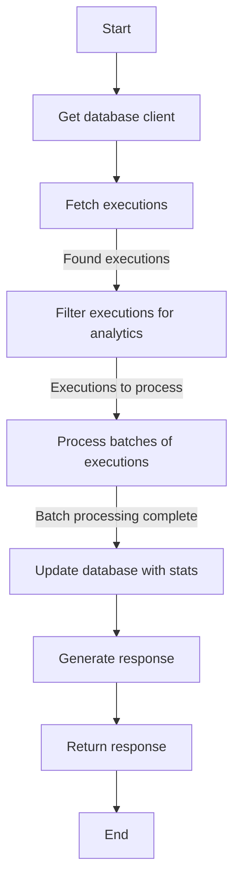

## 类结构

```
APIRouter (FastAPI router)
├── ExecutionAnalyticsRequest (Pydantic model)
│   ├── graph_id
│   ├── graph_version
│   ├── user_id
│   ├── created_after
│   ├── model_name
│   ├── batch_size
│   ├── system_prompt
│   ├── user_prompt
│   └── skip_existing
├── ExecutionAnalyticsResult (Pydantic model)
│   ├── agent_id
│   ├── version_id
│   ├── user_id
│   ├── exec_id
│   ├── summary_text
│   ├── score
│   ├── status
│   ├── error_message
│   ├── started_at
│   └── ended_at
├── ExecutionAnalyticsResponse (Pydantic model)
│   ├── total_executions
│   ├── processed_executions
│   ├── successful_analytics
│   ├── failed_analytics
│   ├── skipped_executions
│   └── results
├── ModelInfo (Pydantic model)
│   ├── value
│   ├── label
│   └── provider
├── ExecutionAnalyticsConfig (Pydantic model)
│   ├── available_models
│   ├── default_system_prompt
│   ├── default_user_prompt
│   └── recommended_model
└── AccuracyTrendsRequest (Pydantic model)
    ├── graph_id
    ├── user_id
    ├── days_back
    ├── drop_threshold
    ├── include_historical
    └── admin_user_id
```

## 全局变量及字段


### `logger`
    
Logger instance for logging messages.

类型：`logging.Logger`
    


### `settings`
    
Settings instance for configuration parameters.

类型：`backend.util.settings.Settings`
    


### `ExecutionAnalyticsRequest.graph_id`
    
Graph ID to analyze.

类型：`str`
    


### `ExecutionAnalyticsRequest.graph_version`
    
Optional graph version to analyze.

类型：`Optional[int]`
    


### `ExecutionAnalyticsRequest.user_id`
    
Optional user ID filter for the analysis.

类型：`Optional[str]`
    


### `ExecutionAnalyticsRequest.created_after`
    
Optional created date lower bound for the analysis.

类型：`Optional[datetime]`
    


### `ExecutionAnalyticsRequest.model_name`
    
Model to use for generation.

类型：`str`
    


### `ExecutionAnalyticsRequest.batch_size`
    
Batch size for concurrent processing.

类型：`int`
    


### `ExecutionAnalyticsRequest.system_prompt`
    
Custom system prompt (default: built-in prompt).

类型：`Optional[str]`
    


### `ExecutionAnalyticsRequest.user_prompt`
    
Custom user prompt with {{GRAPH_NAME}} and {{EXECUTION_DATA}} placeholders (default: built-in prompt).

类型：`Optional[str]`
    


### `ExecutionAnalyticsRequest.skip_existing`
    
Whether to skip executions that already have activity status and correctness score.

类型：`bool`
    


### `ExecutionAnalyticsResult.agent_id`
    
Agent ID associated with the execution.

类型：`str`
    


### `ExecutionAnalyticsResult.version_id`
    
Version ID of the execution.

类型：`int`
    


### `ExecutionAnalyticsResult.user_id`
    
User ID associated with the execution.

类型：`str`
    


### `ExecutionAnalyticsResult.exec_id`
    
Execution ID.

类型：`str`
    


### `ExecutionAnalyticsResult.summary_text`
    
Summary text of the execution.

类型：`Optional[str]`
    


### `ExecutionAnalyticsResult.score`
    
Correctness score of the execution.

类型：`Optional[float]`
    


### `ExecutionAnalyticsResult.status`
    
Status of the execution (e.g., 'success', 'failed', 'skipped').

类型：`str`
    


### `ExecutionAnalyticsResult.error_message`
    
Error message if the execution failed.

类型：`Optional[str]`
    


### `ExecutionAnalyticsResult.started_at`
    
Start time of the execution.

类型：`Optional[datetime]`
    


### `ExecutionAnalyticsResult.ended_at`
    
End time of the execution.

类型：`Optional[datetime]`
    


### `ExecutionAnalyticsResponse.total_executions`
    
Total number of executions analyzed.

类型：`int`
    


### `ExecutionAnalyticsResponse.processed_executions`
    
Number of executions processed.

类型：`int`
    


### `ExecutionAnalyticsResponse.successful_analytics`
    
Number of successful analytics operations.

类型：`int`
    


### `ExecutionAnalyticsResponse.failed_analytics`
    
Number of failed analytics operations.

类型：`int`
    


### `ExecutionAnalyticsResponse.skipped_executions`
    
Number of skipped executions.

类型：`int`
    


### `ExecutionAnalyticsResponse.results`
    
List of execution analytics results.

类型：`list[ExecutionAnalyticsResult]`
    


### `ModelInfo.value`
    
Value of the model (e.g., 'gpt-4o-mini').

类型：`str`
    


### `ModelInfo.label`
    
Label of the model for display (e.g., 'GPT 4 Turbo').

类型：`str`
    


### `ModelInfo.provider`
    
Provider of the model (e.g., 'OpenAI').

类型：`str`
    


### `ExecutionAnalyticsConfig.available_models`
    
List of available models with metadata.

类型：`list[ModelInfo]`
    


### `ExecutionAnalyticsConfig.default_system_prompt`
    
Default system prompt for generation.

类型：`str`
    


### `ExecutionAnalyticsConfig.default_user_prompt`
    
Default user prompt for generation.

类型：`str`
    


### `ExecutionAnalyticsConfig.recommended_model`
    
Recommended model for generation.

类型：`str`
    


### `AccuracyTrendsRequest.graph_id`
    
Graph ID to analyze for accuracy trends.

类型：`str`
    


### `AccuracyTrendsRequest.user_id`
    
Optional user ID filter for the accuracy trends analysis.

类型：`Optional[str]`
    


### `AccuracyTrendsRequest.days_back`
    
Number of days to look back for accuracy trends.

类型：`int`
    


### `AccuracyTrendsRequest.drop_threshold`
    
Alert threshold percentage for accuracy trends.

类型：`float`
    


### `AccuracyTrendsRequest.include_historical`
    
Whether to include historical data for charts.

类型：`bool`
    
    

## 全局函数及方法

### get_user_id

This function retrieves the user ID associated with the current request.

#### 参数

- `admin_user_id`: `str`，The ID of the admin user making the request.

#### 返回值

- `str`，The user ID associated with the current request.

#### 流程图

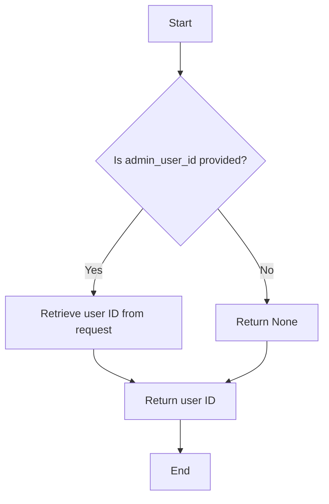

#### 带注释源码

```python
from fastapi import Security

def get_user_id(admin_user_id: str = Security(get_user_id)):
    """
    Retrieve the user ID associated with the current request.

    :param admin_user_id: The ID of the admin user making the request.
    :return: The user ID associated with the current request.
    """
    # Retrieve the user ID from the request
    return admin_user_id
```

### `requires_admin_user`

`requires_admin_user` 是一个装饰器，用于确保只有具有管理员权限的用户才能访问受保护的函数或方法。

#### 参数

- 无

#### 返回值

- 无

#### 流程图

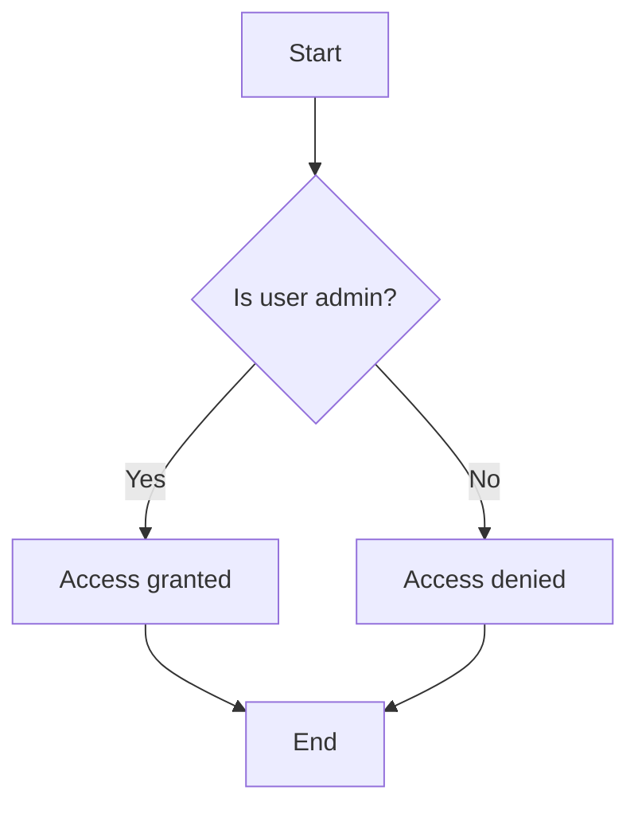

#### 带注释源码

```python
from fastapi import Security

def requires_admin_user(func):
    async def wrapper(*args, **kwargs):
        user_id = await Security(get_user_id)(func.__name__)
        if not user_id.is_admin:
            raise HTTPException(status_code=403, detail="Admin access required")
        return await func(*args, **kwargs)
    return wrapper
```


### `get_db_async_client`

获取异步数据库客户端。

参数：

- 无

返回值：`asyncio.Lock`，用于异步数据库连接的锁。

#### 流程图

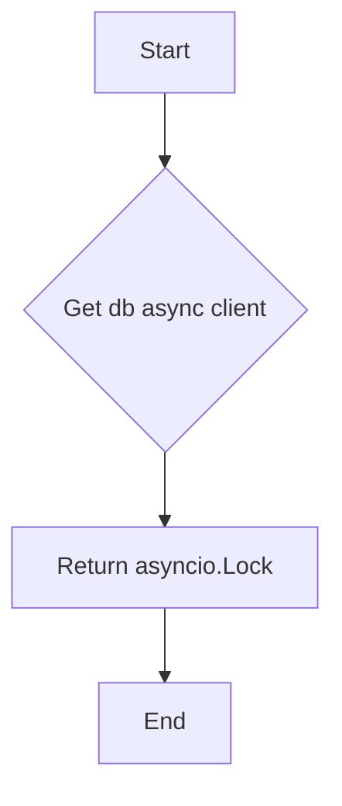

#### 带注释源码

```python
async def get_db_async_client():
    # Get database client
    db_client = await get_db_async_client()

    return db_client
```


### `get_accuracy_trends_and_alerts`

Get execution accuracy trends with moving averages and alert detection.

参数：

- `graph_id`：`str`，Graph ID to analyze
- `user_id`：`Optional[str]`，Optional user ID filter
- `days_back`：`int`，Number of days to look back
- `drop_threshold`：`float`，Alert threshold percentage
- `include_historical`：`bool`，Include historical data for charts

返回值：`AccuracyTrendsResponse`，Response containing accuracy trends and alerts

#### 流程图

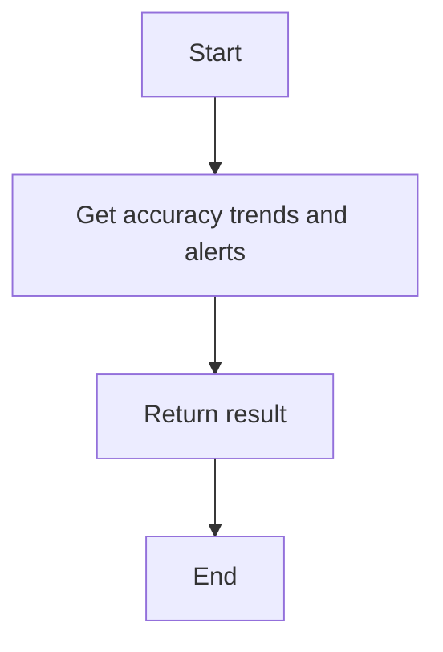

#### 带注释源码

```python
async def get_accuracy_trends_and_alerts(
    graph_id: str,
    days_back: int,
    user_id: Optional[str] = None,
    drop_threshold: float = 10.0,
    include_historical: bool = False,
) -> AccuracyTrendsResponse:
    """
    Get execution accuracy trends with moving averages and alert detection.
    Simple single-query approach.
    """
    # Implementation details would be here
    pass
```

### get_graph_executions

获取与给定条件匹配的图执行记录。

#### 参数

- `graph_id`: `str`，图ID，用于筛选执行记录。
- `graph_version`: `Optional[int]`，可选的图版本，用于筛选执行记录。
- `user_id`: `Optional[str]`，可选的用户ID，用于筛选执行记录。
- `created_time_gte`: `Optional[datetime]`，可选的创建时间下限，用于筛选执行记录。
- `statuses`: `list[ExecutionStatus]`，执行状态列表，用于筛选执行记录。

#### 返回值

- `list[GraphExecution]`，与给定条件匹配的图执行记录列表。

#### 流程图

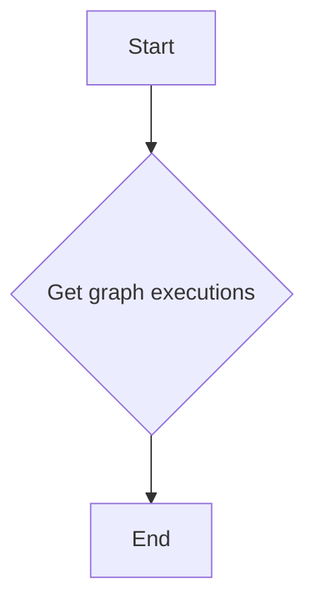

#### 带注释源码

```python
from backend.data.execution import GraphExecution

async def get_graph_executions(
    graph_id: str,
    graph_version: Optional[int] = None,
    user_id: Optional[str] = None,
    created_time_gte: Optional[datetime] = None,
    statuses: list[ExecutionStatus] = None,
) -> list[GraphExecution]:
    """
    Get graph executions based on the given criteria.

    :param graph_id: str, graph ID to filter executions
    :param graph_version: Optional[int], optional graph version to filter executions
    :param user_id: Optional[str], optional user ID to filter executions
    :param created_time_gte: Optional[datetime], optional created time lower bound to filter executions
    :param statuses: list[ExecutionStatus], list of execution statuses to filter executions
    :return: list[GraphExecution], list of graph executions that match the criteria
    """
    # Your implementation here
```

### update_graph_execution_stats

该函数用于更新数据库中特定图执行的统计信息。

#### 参数

- `graph_exec_id`: `str`，图执行的唯一标识符。
- `stats`: `GraphExecutionStats`，包含要更新的统计信息的对象。

#### 返回值

- 无返回值。

#### 流程图

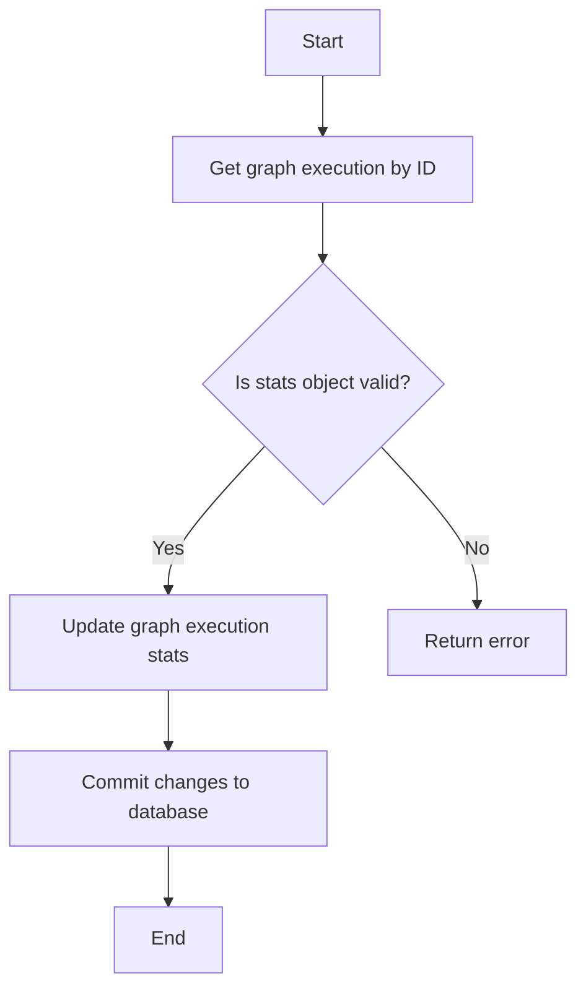

#### 带注释源码

```python
async def update_graph_execution_stats(graph_exec_id: str, stats: GraphExecutionStats):
    """
    Update the statistics for a specific graph execution in the database.

    :param graph_exec_id: The unique identifier for the graph execution.
    :param stats: The statistics object containing the data to update.
    """
    # Update the graph execution stats
    await db_client.execute(
        """
        UPDATE graph_executions
        SET stats = %s
        WHERE id = %s
        """,
        (stats.to_db(), graph_exec_id),
    )
```

### generate_activity_status_for_execution

This function generates an activity status for a given execution using AI.

#### 参数

- `graph_exec_id`: `str`，The ID of the graph execution.
- `graph_id`: `str`，The ID of the graph.
- `graph_version`: `int`，The version of the graph.
- `execution_stats`: `GraphExecutionStats`，The statistics of the execution.
- `db_client`: `Any`，The database client.
- `user_id`: `Optional[str]`，The user ID.
- `execution_status`: `str`，The status of the execution.
- `model_name`: `str`，The name of the model to use for generation.
- `skip_feature_flag`: `bool`，Whether to skip feature flags.
- `system_prompt`: `Optional[str]`，The system prompt.
- `user_prompt`: `Optional[str]`，The user prompt.
- `skip_existing`: `bool`，Whether to skip existing activity status.

#### 返回值

- `Optional[dict]`，A dictionary containing the activity status and correctness score.

#### 流程图

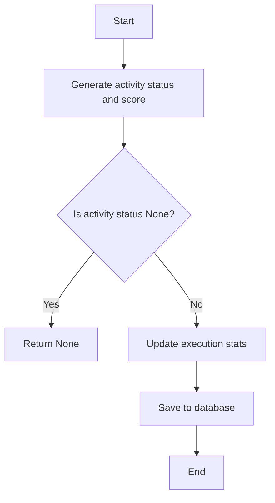

#### 带注释源码

```python
async def generate_activity_status_for_execution(
    graph_exec_id: str,
    graph_id: str,
    graph_version: int,
    execution_stats: GraphExecutionStats,
    db_client: Any,
    user_id: Optional[str] = None,
    execution_status: str = None,
    model_name: str = None,
    skip_feature_flag: bool = False,
    system_prompt: Optional[str] = None,
    user_prompt: Optional[str] = None,
    skip_existing: bool = False,
):
    """
    Generate activity status and correctness score for a given execution using AI.

    :param graph_exec_id: The ID of the graph execution.
    :param graph_id: The ID of the graph.
    :param graph_version: The version of the graph.
    :param execution_stats: The statistics of the execution.
    :param db_client: The database client.
    :param user_id: The user ID.
    :param execution_status: The status of the execution.
    :param model_name: The name of the model to use for generation.
    :param skip_feature_flag: Whether to skip feature flags.
    :param system_prompt: The system prompt.
    :param user_prompt: The user prompt.
    :param skip_existing: Whether to skip existing activity status.
    :return: A dictionary containing the activity status and correctness score.
    """
    # Your code here
```


### generate_model_label

Generate a user-friendly label from the model enum value.

参数：

- `model`：`LlmModel`，The model enum value to generate a label for.

返回值：`str`，A user-friendly label for the model.

#### 流程图

```mermaid
graph TD
    A[Start] --> B[Check if model value contains "/"]
    B -- Yes --> C[Split model value by "/"]
    B -- No --> D[Split model value by "-"]
    C --> E[Get model name from split parts]
    D --> E
    E --> F[Check if part is a date-like pattern]
    F -- Yes --> G[Skip part]
    F -- No --> H[Capitalize and format part]
    H --> I[Join formatted parts]
    I --> J[Format provider name]
    J --> K[Return label with provider prefix]
```

#### 带注释源码

```python
def generate_model_label(model: LlmModel) -> str:
    """Generate a user-friendly label from the model enum value."""
    value = model.value

    # For all models, convert underscores/hyphens to spaces and title case
    # e.g., "gpt-4-turbo" -> "GPT 4 Turbo", "claude-3-haiku-20240307" -> "Claude 3 Haiku"
    parts = value.replace("_", "-").split("-")

    # Handle provider prefixes (e.g., "google/", "x-ai/")
    if "/" in value:
        _, model_name = value.split("/", 1)
        parts = model_name.replace("_", "-").split("-")

    # Capitalize and format parts
    formatted_parts = []
    for part in parts:
        # Skip date-like patterns - check for various date formats:
        # - Long dates like "20240307" (8 digits)
        # - Year components like "2024", "2025" (4 digit years >= 2020)
        # - Month/day components like "04", "16" when they appear to be dates
        if part.isdigit():
            if len(part) >= 8:  # Long date format like "20240307"
                continue
            elif len(part) == 4 and int(part) >= 2020:  # Year like "2024", "2025"
                continue
            elif len(part) <= 2 and int(part) <= 31:  # Month/day like "04", "16"
                # Skip if this looks like a date component (basic heuristic)
                continue
        # Keep version numbers as-is
        if part.replace(".", "").isdigit():
            formatted_parts.append(part)
        # Capitalize normal words
        else:
            formatted_parts.append(
                part.upper()
                if part.upper() in ["GPT", "LLM", "API", "V0"]
                else part.capitalize()
            )

    model_name = " ".join(formatted_parts)

    # Format provider name for better display
    provider_name = model.provider.replace("_", " ").title()

    # Return with provider prefix for clarity
    return f"{provider_name}: {model_name}"
``` 


### get_execution_analytics_config

Get the configuration for execution analytics including:
- Available AI models with metadata
- Default system and user prompts
- Recommended model selection

参数：

- `admin_user_id`：`str`，The ID of the admin user making the request

返回值：`ExecutionAnalyticsConfig`，A configuration object containing available models, default prompts, and recommended model

#### 流程图

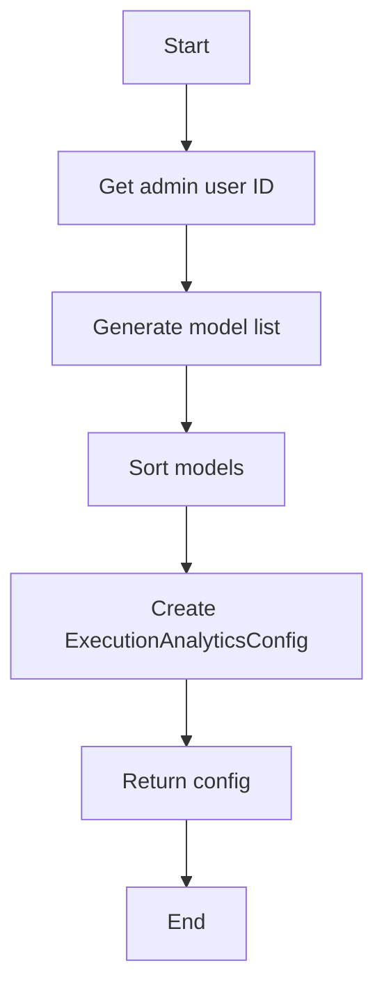

#### 带注释源码

```python
@router.get(
    "/execution_analytics/config",
    response_model=ExecutionAnalyticsConfig,
    summary="Get Execution Analytics Configuration",
)
async def get_execution_analytics_config(
    admin_user_id: str = Security(get_user_id),
):
    """
    Get the configuration for execution analytics including:
    - Available AI models with metadata
    - Default system and user prompts
    - Recommended model selection
    """
    logger.info(f"Admin user {admin_user_id} requesting execution analytics config")

    # Generate model list from LlmModel enum with provider information
    available_models = []

    # Function to generate friendly display names from model values
    def generate_model_label(model: LlmModel) -> str:
        """Generate a user-friendly label from the model enum value."""
        value = model.value

        # For all models, convert underscores/hyphens to spaces and title case
        # e.g., "gpt-4-turbo" -> "GPT 4 Turbo", "claude-3-haiku-20240307" -> "Claude 3 Haiku"
        parts = value.replace("_", "-").split("-")

        # Handle provider prefixes (e.g., "google/", "x-ai/")
        if "/" in value:
            _, model_name = value.split("/", 1)
            parts = model_name.replace("_", "-").split("-")

        # Capitalize and format parts
        formatted_parts = []
        for part in parts:
            # Skip date-like patterns - check for various date formats:
            # - Long dates like "20240307" (8 digits)
            # - Year components like "2024", "2025" (4 digit years >= 2020)
            # - Month/day components like "04", "16" when they appear to be dates
            if part.isdigit():
                if len(part) >= 8:  # Long date format like "20240307"
                    continue
                elif len(part) == 4 and int(part) >= 2020:  # Year like "2024", "2025"
                    continue
                elif len(part) <= 2 and int(part) <= 31:  # Month/day like "04", "16"
                    # Skip if this looks like a date component (basic heuristic)
                    continue
            # Keep version numbers as-is
            if part.replace(".", "").isdigit():
                formatted_parts.append(part)
            # Capitalize normal words
            else:
                formatted_parts.append(
                    part.upper()
                    if part.upper() in ["GPT", "LLM", "API", "V0"]
                    else part.capitalize()
                )

        model_name = " ".join(formatted_parts)

        # Format provider name for better display
        provider_name = model.provider.replace("_", " ").title()

        # Return with provider prefix for clarity
        return f"{provider_name}: {model_name}"

    # Include all LlmModel values (no more filtering by hardcoded list)
    recommended_model = LlmModel.GPT4O_MINI.value
    for model in LlmModel:
        label = generate_model_label(model)
        # Add "(Recommended)" suffix to the recommended model
        if model.value == recommended_model:
            label += " (Recommended)"

        available_models.append(
            ModelInfo(
                value=model.value,
                label=label,
                provider=model.provider,
            )
        )

    # Sort models by provider and name for better UX
    available_models.sort(key=lambda x: (x.provider, x.label))

    return ExecutionAnalyticsConfig(
        available_models=available_models,
        default_system_prompt=DEFAULT_SYSTEM_PROMPT,
        default_user_prompt=DEFAULT_USER_PROMPT,
        recommended_model=recommended_model,
    )
```

### generate_execution_analytics

This function generates activity summaries and correctness scores for graph executions.

参数：

- `request`：`ExecutionAnalyticsRequest`，The request object containing the parameters for execution analytics.
- `admin_user_id`：`str`，The ID of the admin user making the request.

返回值：`ExecutionAnalyticsResponse`，A detailed report of the analytics operation.

#### 流程图

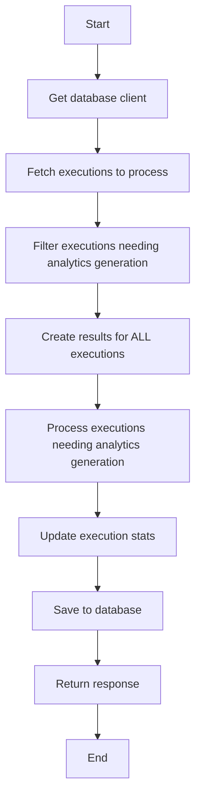

#### 带注释源码

```python
async def generate_execution_analytics(
    request: ExecutionAnalyticsRequest,
    admin_user_id: str = Security(get_user_id),
):
    """
    Generate activity summaries and correctness scores for graph executions.

    This endpoint:
    1. Fetches all completed executions matching the criteria
    2. Identifies executions missing activity_status or correctness_score
    3. Generates missing data using AI in batches
    4. Updates the database with new stats
    5. Returns a detailed report of the analytics operation
    """
    logger.info(
        f"Admin user {admin_user_id} starting execution analytics generation for graph {request.graph_id}"
    )

    try:
        # Get database client
        db_client = get_db_async_client()

        # Fetch executions to process
        executions = await get_graph_executions(
            graph_id=request.graph_id,
            graph_version=request.graph_version,
            user_id=request.user_id,
            created_time_gte=request.created_after,
            statuses=[
                ExecutionStatus.COMPLETED,
                ExecutionStatus.FAILED,
                ExecutionStatus.TERMINATED,
            ],  # Only process finished executions
        )

        logger.info(
            f"Found {len(executions)} total executions for graph {request.graph_id}"
        )

        # Filter executions that need analytics generation
        executions_to_process = []
        for execution in executions:
            # Skip if we should skip existing analytics and both activity_status and correctness_score exist
            if (
                request.skip_existing
                and execution.stats
                and execution.stats.activity_status
                and execution.stats.correctness_score is not None
            ):
                continue

            # Add execution to processing list
            executions_to_process.append(execution)

        logger.info(
            f"Found {len(executions_to_process)} executions needing analytics generation"
        )

        # Create results for ALL executions - processed and skipped
        results = []
        successful_count = 0
        failed_count = 0

        # Process executions that need analytics generation
        if executions_to_process:
            total_batches = len(
                range(0, len(executions_to_process), request.batch_size)
            )

            for batch_idx, i in enumerate(
                range(0, len(executions_to_process), request.batch_size)
            ):
                batch = executions_to_process[i : i + request.batch_size]
                logger.info(
                    f"Processing batch {batch_idx + 1}/{total_batches} with {len(batch)} executions"
                )

                batch_results = await _process_batch(batch, request, db_client)

                for result in batch_results:
                    results.append(result)
                    if result.status == "success":
                        successful_count += 1
                    elif result.status == "failed":
                        failed_count += 1

                # Small delay between batches to avoid overwhelming the LLM API
                if batch_idx < total_batches - 1:  # Don't delay after the last batch
                    await asyncio.sleep(2)

        # Add ALL executions to results (both processed and skipped)
        for execution in executions:
            # Skip if already processed (added to results above)
            if execution in executions_to_process:
                continue

            results.append(
                ExecutionAnalyticsResult(
                    agent_id=execution.graph_id,
                    version_id=execution.graph_version,
                    user_id=execution.user_id,
                    exec_id=execution.id,
                    summary_text=(
                        execution.stats.activity_status if execution.stats else None
                    ),
                    score=(
                        execution.stats.correctness_score if execution.stats else None
                    ),
                    status="skipped",
                    error_message=None,  # Not an error - just already processed
                    started_at=execution.started_at,
                    ended_at=execution.ended_at,
                )
            )

        response = ExecutionAnalyticsResponse(
            total_executions=len(executions),
            processed_executions=len(executions_to_process),
            successful_analytics=successful_count,
            failed_analytics=failed_count,
            skipped_executions=len(executions) - len(executions_to_process),
            results=results,
        )

        logger.info(
            f"Analytics generation completed: {successful_count} successful, {failed_count} failed, "
            f"{response.skipped_executions} skipped"
        )

        return response

    except Exception as e:
        logger.exception(f"Error during execution analytics generation: {e}")
        raise HTTPException(status_code=500, detail=str(e))
```

### `_process_batch`

#### 描述

`_process_batch` 是一个异步函数，用于处理一批执行项。它将执行项并发地传递给 `process_single_execution` 函数，以生成活动状态和正确性分数，并将结果保存到数据库。

#### 参数

- `executions`：`list[GraphExecution]`，要处理的执行项列表。
- `request`：`ExecutionAnalyticsRequest`，包含请求参数，如模型名称、批处理大小等。
- `db_client`：`AsyncDatabaseClient`，用于与数据库交互的客户端。

#### 返回值

- `list[ExecutionAnalyticsResult]`，包含每个执行项的处理结果。

#### 流程图

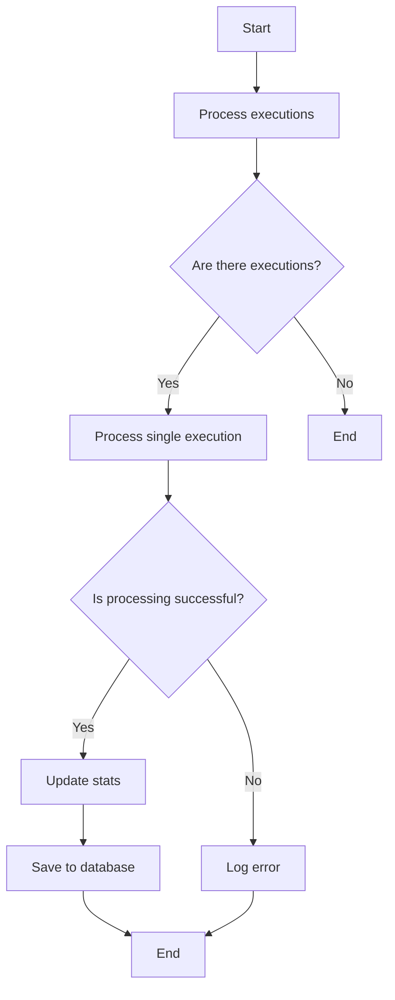

#### 带注释源码

```python
async def _process_batch(executions, request: ExecutionAnalyticsRequest, db_client):
    """Process a batch of executions concurrently."""

    if not settings.secrets.openai_internal_api_key:
        raise HTTPException(status_code=500, detail="OpenAI API key not configured")

    async def process_single_execution(execution):
        try:
            # Generate activity status and score using the specified model
            if execution.stats:
                if isinstance(execution.stats, GraphExecutionMeta.Stats):
                    stats_for_generation = execution.stats.to_db()
                else:
                    stats_for_generation = execution.stats
            else:
                stats_for_generation = GraphExecutionStats()

            activity_response = await generate_activity_status_for_execution(
                graph_exec_id=execution.id,
                graph_id=execution.graph_id,
                graph_version=execution.graph_version,
                execution_stats=stats_for_generation,
                db_client=db_client,
                user_id=execution.user_id,
                execution_status=execution.status,
                model_name=request.model_name,
                skip_feature_flag=True,  # Admin endpoint bypasses feature flags
                system_prompt=request.system_prompt or DEFAULT_SYSTEM_PROMPT,
                user_prompt=request.user_prompt or DEFAULT_USER_PROMPT,
                skip_existing=request.skip_existing,
            )

            if not activity_response:
                return ExecutionAnalyticsResult(
                    agent_id=execution.graph_id,
                    version_id=execution.graph_version,
                    user_id=execution.user_id,
                    exec_id=execution.id,
                    summary_text=None,
                    score=None,
                    status="skipped",
                    error_message="Activity generation returned None",
                    started_at=execution.started_at,
                    ended_at=execution.ended_at,
                )

            # Update the execution stats
            if execution.stats:
                if isinstance(execution.stats, GraphExecutionMeta.Stats):
                    updated_stats = execution.stats.to_db()
                else:
                    updated_stats = execution.stats
            else:
                updated_stats = GraphExecutionStats()

            updated_stats.activity_status = activity_response["activity_status"]
            updated_stats.correctness_score = activity_response["correctness_score"]

            # Save to database with correct stats type
            await update_graph_execution_stats(
                graph_exec_id=execution.id, stats=updated_stats
            )

            return ExecutionAnalyticsResult(
                agent_id=execution.graph_id,
                version_id=execution.graph_version,
                user_id=execution.user_id,
                exec_id=execution.id,
                summary_text=activity_response["activity_status"],
                score=activity_response["correctness_score"],
                status="success",
                started_at=execution.started_at,
                ended_at=execution.ended_at,
            )

        except Exception as e:
            logger.exception(f"Error processing execution {execution.id}: {e}")
            return ExecutionAnalyticsResult(
                agent_id=execution.graph_id,
                version_id=execution.graph_version,
                user_id=execution.user_id,
                exec_id=execution.id,
                summary_text=None,
                score=None,
                status="failed",
                error_message=str(e),
                started_at=execution.started_at,
                ended_at=execution.ended_at,
            )

    # Process all executions in the batch concurrently
    return await asyncio.gather(
        *[process_single_execution(execution) for execution in executions]
    )
```

### get_execution_accuracy_trends

This function retrieves execution accuracy trends and alerts for a specified graph.

参数：

- `graph_id`：`str`，Graph ID to analyze
- `user_id`：`Optional[str]`，Optional user ID filter
- `days_back`：`int`，Number of days to look back
- `drop_threshold`：`float`，Alert threshold percentage
- `include_historical`：`bool`，Include historical data for charts
- `admin_user_id`：`str`，Admin user ID for security

返回值：`AccuracyTrendsResponse`，Response containing accuracy trends and alerts

#### 流程图

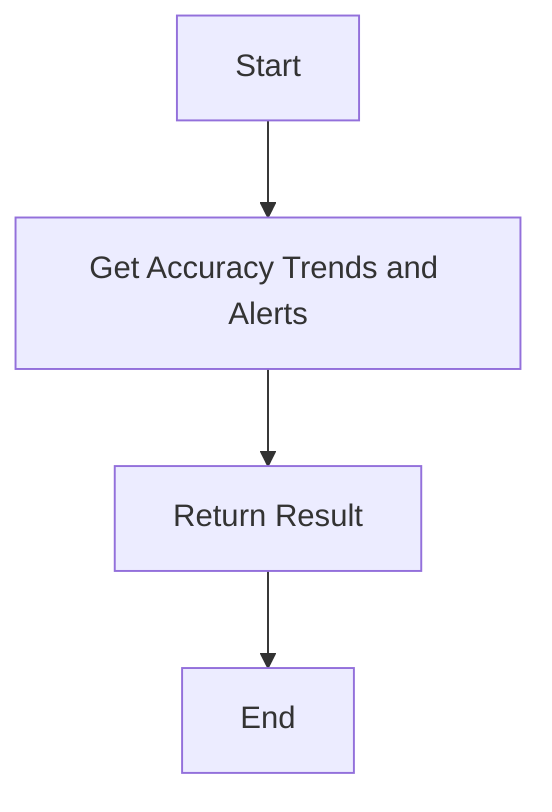

#### 带注释源码

```python
@router.get(
    "/execution_accuracy_trends",
    response_model=AccuracyTrendsResponse,
    summary="Get Execution Accuracy Trends and Alerts",
)
async def get_execution_accuracy_trends(
    graph_id: str,
    user_id: Optional[str] = None,
    days_back: int = 30,
    drop_threshold: float = 10.0,
    include_historical: bool = False,
    admin_user_id: str = Security(get_user_id),
) -> AccuracyTrendsResponse:
    """
    Get execution accuracy trends with moving averages and alert detection.
    Simple single-query approach.
    """
    logger.info(
        f"Admin user {admin_user_id} requesting accuracy trends for graph {graph_id}"
    )

    try:
        result = await get_accuracy_trends_and_alerts(
            graph_id=graph_id,
            days_back=days_back,
            user_id=user_id,
            drop_threshold=drop_threshold,
            include_historical=include_historical,
        )

        return result

    except Exception as e:
        logger.exception(f"Error getting accuracy trends for graph {graph_id}: {e}")
        raise HTTPException(status_code=500, detail=str(e))
```

## 关键组件


### 张量索引与惰性加载

张量索引与惰性加载是用于高效处理大规模数据集的关键组件，它允许在需要时才加载数据，从而减少内存消耗并提高性能。

### 反量化支持

反量化支持是用于将量化后的模型转换回原始精度模型的关键组件，它允许模型在量化后仍然保持高精度。

### 量化策略

量化策略是用于优化模型性能和减少模型大小的关键组件，它通过减少模型中使用的数值精度来实现。


## 问题及建议


### 已知问题

-   **代码重复**: `generate_model_label` 函数在 `get_execution_analytics_config` 和 `generate_activity_status_for_execution` 中被重复使用，可以考虑将其提取为全局函数或类方法以减少代码重复。
-   **异常处理**: 代码中存在多个地方抛出 `HTTPException`，但没有对异常进行详细的分类处理，建议根据不同的异常类型进行更细致的异常处理。
-   **日志记录**: 代码中使用了 `logger.info` 和 `logger.exception`，但没有对日志级别进行细致的控制，建议根据不同的日志级别进行分类记录。
-   **数据库操作**: 代码中使用了异步数据库操作，但没有对数据库连接进行有效的管理，建议使用连接池或事务管理来优化数据库操作。
-   **代码注释**: 代码中存在一些函数和方法的注释不够详细，建议补充更详细的注释以提高代码的可读性。

### 优化建议

-   **代码重构**: 将重复的 `generate_model_label` 函数提取为全局函数或类方法，减少代码重复。
-   **异常处理**: 根据不同的异常类型进行分类处理，例如，对于数据库操作异常和API调用异常进行不同的处理。
-   **日志记录**: 使用不同的日志级别记录不同的信息，例如，使用 `logger.debug` 记录调试信息，使用 `logger.info` 记录常规信息，使用 `logger.error` 记录错误信息。
-   **数据库操作**: 使用连接池或事务管理来优化数据库操作，提高数据库操作的效率和稳定性。
-   **代码注释**: 补充更详细的注释，特别是对于复杂的逻辑和算法，以提高代码的可读性和可维护性。
-   **性能优化**: 对于大量数据的处理，可以考虑使用批处理或分页查询来减少内存消耗和提高处理速度。
-   **安全性**: 对于敏感信息，如API密钥，应使用环境变量或配置文件进行管理，避免硬编码在代码中。


## 其它


### 设计目标与约束

- 设计目标：
  - 提供一个API端点，用于生成执行分析，包括活动摘要和正确性评分。
  - 提供一个API端点，用于获取执行准确度趋势和警报。
  - 确保只有管理员用户可以访问这些端点。
  - 确保所有操作都是异步执行的，以提高性能。
  - 确保所有数据都通过Pydantic模型进行验证，以防止无效数据。

- 约束：
  - 必须使用FastAPI框架。
  - 必须使用异步编程模式。
  - 必须使用OpenAI API进行文本生成。
  - 必须使用数据库进行数据存储。
  - 必须遵循RESTful API设计原则。

### 错误处理与异常设计

- 错误处理：
  - 使用FastAPI的HTTPException来处理所有HTTP错误。
  - 使用logging模块记录所有异常和错误。
  - 对于所有未处理的异常，返回500内部服务器错误。

- 异常设计：
  - 对于数据库操作，使用try-except块来捕获并处理可能的异常。
  - 对于OpenAI API调用，使用try-except块来捕获并处理可能的异常。
  - 对于所有外部依赖，使用try-except块来捕获并处理可能的异常。

### 数据流与状态机

- 数据流：
  - 用户通过API发送请求。
  - 请求被处理并生成响应。
  - 响应被发送回用户。

- 状态机：
  - 执行分析状态机：
    - 初始化：获取数据库客户端。
    - 获取执行：从数据库中获取所有完成的执行。
    - 过滤执行：过滤出需要分析的执行。
    - 处理批次：并发处理每个批次的执行。
    - 更新数据库：将分析结果保存到数据库。
    - 完成分析：返回分析结果。

### 外部依赖与接口契约

- 外部依赖：
  - FastAPI
  - Pydantic
  - OpenAI API
  - 数据库（例如PostgreSQL）

- 接口契约：
  - API端点定义了请求和响应的格式。
  - 所有API端点都遵循RESTful设计原则。
  - 所有API端点都使用JSON作为数据交换格式。

### 安全性

- 安全性：
  - 使用FastAPI的Security装饰器来确保只有管理员用户可以访问API端点。
  - 使用HTTPS来保护数据传输。
  - 使用环境变量来存储敏感信息，如API密钥。

### 性能

- 性能：
  - 使用异步编程模式来提高性能。
  - 使用批处理来减少数据库操作次数。
  - 使用并发处理来提高文本生成速度。

### 可维护性

- 可维护性：
  - 使用Pydantic模型来验证数据，提高代码的可维护性。
  - 使用logging模块来记录所有操作，方便调试和监控。
  - 使用异常处理来确保代码的健壮性。

### 测试

- 测试：
  - 编写单元测试来测试每个API端点。
  - 编写集成测试来测试整个系统。
  - 使用测试覆盖率工具来确保代码覆盖率。

### 文档

- 文档：
  - 使用FastAPI的自动文档功能来生成API文档。
  - 编写详细的代码注释，解释代码的功能和实现。
  - 编写用户手册，说明如何使用API端点。


    