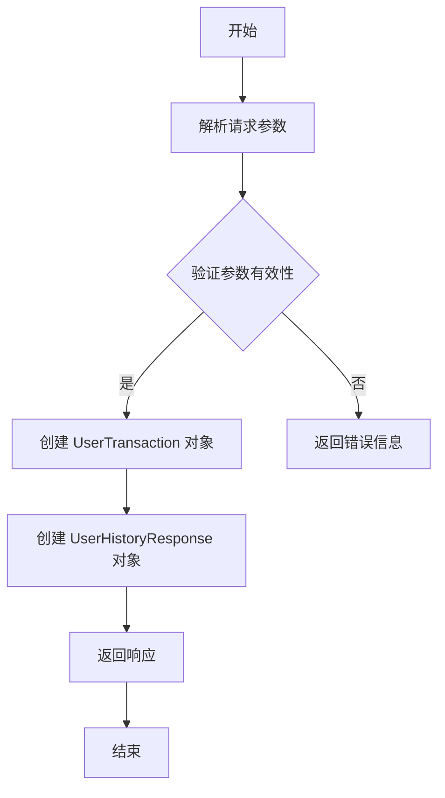

# `.\AutoGPT\autogpt_platform\backend\backend\api\features\admin\model.py` 详细设计文档

This code defines two Pydantic models for handling user transaction history and adding user credits responses.

## 整体流程



## 类结构

```
UserHistoryResponse (响应模型)
├── AddUserCreditsResponse (响应模型)
```

## 全局变量及字段


### `UserHistoryResponse`
    
Response model for listings with version history

类型：`BaseModel`
    


### `AddUserCreditsResponse`
    
Response model for adding user credits

类型：`BaseModel`
    


### `UserHistoryResponse.history`
    
List of UserTransaction objects representing the history

类型：`list[UserTransaction]`
    


### `UserHistoryResponse.pagination`
    
Pagination object for the history listing

类型：`Pagination`
    


### `AddUserCreditsResponse.new_balance`
    
The new balance after adding credits

类型：`int`
    


### `AddUserCreditsResponse.transaction_key`
    
Unique key for the transaction

类型：`str`
    
    

## 全局函数及方法


## 关键组件


### 张量索引与惰性加载

张量索引与惰性加载是指在处理大规模数据时，只对需要的数据进行索引和加载，以减少内存消耗和提高处理速度。

### 反量化支持

反量化支持是指系统对量化操作的反向操作的支持，以便在需要时能够恢复原始数据。

### 量化策略

量化策略是指对数据进行量化处理的方法，包括选择量化级别、量化范围等。


## 问题及建议


### 已知问题

-   **全局状态管理缺失**：代码中没有显示全局状态管理，这可能导致在处理多个用户或事务时难以维护状态的一致性。
-   **错误处理未定义**：代码中没有提供错误处理机制，当数据模型验证失败或数据访问出错时，没有明确的错误处理策略。
-   **代码复用性低**：`UserHistoryResponse` 和 `AddUserCreditsResponse` 类可能具有相似的结构，但代码中未体现复用逻辑，导致代码冗余。

### 优化建议

-   **引入全局状态管理**：考虑使用全局状态管理库或自定义状态管理逻辑，以维护跨多个请求的状态一致性。
-   **实现错误处理机制**：为数据模型验证和数据处理添加异常处理逻辑，确保在出现错误时能够提供清晰的错误信息。
-   **提高代码复用性**：通过提取公共逻辑或使用继承/组合等设计模式，减少代码冗余，提高代码的可维护性和可读性。
-   **文档化**：为代码添加详细的文档注释，包括类和方法的功能、参数和返回值描述，以便其他开发者更好地理解和使用代码。
-   **单元测试**：编写单元测试以确保代码的正确性和稳定性，特别是在进行代码重构或添加新功能时。


## 其它


### 设计目标与约束

- 设计目标：确保用户历史记录和信用增加的响应模型能够准确、高效地返回数据。
- 约束：使用Pydantic库来验证和序列化数据，确保数据的一致性和安全性。

### 错误处理与异常设计

- 错误处理：在数据验证失败时，应抛出Pydantic的验证错误。
- 异常设计：定义自定义异常类，以处理特定于应用程序的错误情况。

### 数据流与状态机

- 数据流：用户历史记录和信用增加的响应数据从后端模型传递到前端。
- 状态机：无状态机，因为这两个模型仅用于数据传输，不涉及状态转换。

### 外部依赖与接口契约

- 外部依赖：依赖于Pydantic库进行数据验证和序列化。
- 接口契约：通过定义BaseModel子类，确保与前端或API客户端的接口契约。


    