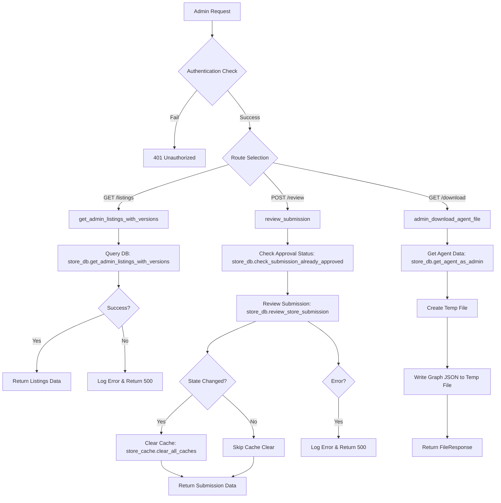
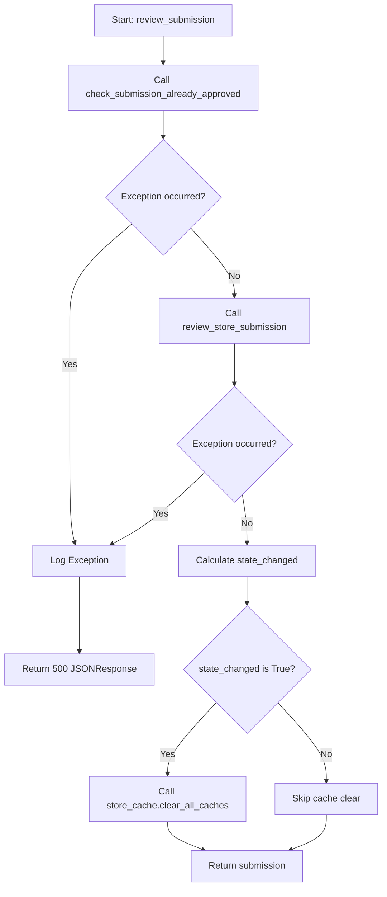
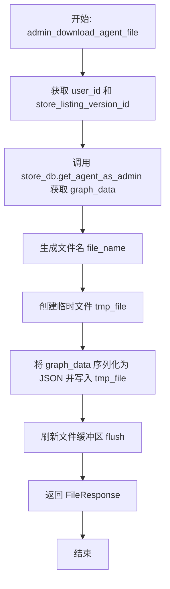

# `AutoGPT\autogpt_platform\backend\backend\api\features\admin\store_admin_routes.py` 详细设计文档

该代码模块定义了商店管理的后台API路由，主要功能包括供管理员获取带版本历史的商店列表、审核商店提交的代理状态（批准或拒绝）以及下载代理配置文件，同时集成了权限验证、数据库交互、缓存清理及异常处理机制。

## 整体流程



## 类结构

```
Module (admin.py)
├── Globals
│   ├── logger
│   └── router
└── Route Handlers (Functions)
    ├── get_admin_listings_with_versions
    ├── review_submission
    └── admin_download_agent_file
```

## 全局变量及字段


### `logger`
    
用于记录模块运行日志和异常信息的日志记录器实例。

类型：`logging.Logger`
    


### `router`
    
用于定义商店后台管理相关接口的 FastAPI 路由器对象，包含管理员权限校验。

类型：`fastapi.APIRouter`
    


    

## 全局函数及方法


### `get_admin_listings_with_versions`

Get store listings with their version history for admins. This provides a consolidated view of listings with their versions, allowing for an expandable UI in the admin dashboard.

参数：

-  `status`：`typing.Optional[prisma.enums.SubmissionStatus]`，按提交状态（如 PENDING, APPROVED, REJECTED）进行过滤
-  `search`：`typing.Optional[str]`，通过名称、描述或用户邮箱进行搜索
-  `page`：`int`，分页页码，默认为 1
-  `page_size`：`int`，每页条目数量，默认为 20

返回值：`store_model.StoreListingsWithVersionsResponse`，包含商店列表及其版本历史的响应对象（成功时）；或 `fastapi.responses.JSONResponse`（发生异常时，返回错误详情）。

#### 流程图

```mermaid
graph TD
    A[开始: get_admin_listings_with_versions] --> B[接收参数: status, search, page, page_size]
    B --> C[调用 store_db.get_admin_listings_with_versions]
    C -->{数据库查询是否成功?}
    D -- 是 --> E[返回列表数据 StoreListingsWithVersionsResponse]
    F -- 否 --> G[捕获异常 Exception]
    G --> H[记录错误日志 logger.exception]
    H --> I[返回 500 错误响应 JSONResponse]
    E --> J[结束]
    I --> J
```

#### 带注释源码

```python
@router.get(
    "/listings",
    summary="Get Admin Listings History",
    response_model=store_model.StoreListingsWithVersionsResponse,
)
async def get_admin_listings_with_versions(
    status: typing.Optional[prisma.enums.SubmissionStatus] = None,
    search: typing.Optional[str] = None,
    page: int = 1,
    page_size: int = 20,
):
    """
    Get store listings with their version history for admins.

    This provides a consolidated view of listings with their versions,
    allowing for an expandable UI in the admin dashboard.

    Args:
        status: Filter by submission status (PENDING, APPROVED, REJECTED)
        search: Search by name, description, or user email
        page: Page number for pagination
        page_size: Number of items per page

    Returns:
        StoreListingsWithVersionsResponse with listings and their versions
    """
    try:
        # 调用数据库层获取带有版本信息的列表数据
        # 将 API 层的参数映射传递给数据库查询函数
        listings = await store_db.get_admin_listings_with_versions(
            status=status,
            search_query=search,
            page=page,
            page_size=page_size,
        )
        # 成功获取数据，直接返回列表对象
        return listings
    except Exception as e:
        # 捕获未知异常，防止程序崩溃
        # 记录详细的错误日志以便排查问题
        logger.exception("Error getting admin listings with versions: %s", e)
        # 返回格式化的 JSON 错误响应，状态码为 500
        return fastapi.responses.JSONResponse(
            status_code=500,
            content={
                "detail": "An error occurred while retrieving listings with versions"
            },
        )
```


### `review_submission`

Review a store listing submission. This function handles the administrative action of approving or rejecting a store listing. It checks the previous state, updates the database with the review decision, clears relevant caches if the status has changed, and returns the updated submission data.

参数：

-  `store_listing_version_id`：`str`，The ID of the store listing version to review.
-  `request`：`store_model.ReviewSubmissionRequest`，The request body containing the review decision (is_approved), comments, and internal comments.
-  `user_id`：`str`，The ID of the authenticated admin user performing the review, obtained via dependency injection.

返回值：`store_model.StoreSubmission`，返回更新后的商店提交对象；若发生异常，则返回包含错误详情的 JSONResponse (status_code=500).

#### 流程图



#### 带注释源码

```python
async def review_submission(
    store_listing_version_id: str,
    request: store_model.ReviewSubmissionRequest,
    user_id: str = fastapi.Security(autogpt_libs.auth.get_user_id),
):
    """
    Review a store listing submission.

    Args:
        store_listing_version_id: ID of the submission to review
        request: Review details including approval status and comments
        user_id: Authenticated admin user performing the review

    Returns:
        StoreSubmission with updated review information
    """
    try:
        # 检查该提交是否已经被批准，以便后续判断状态是否发生变化
        already_approved = await store_db.check_submission_already_approved(
            store_listing_version_id=store_listing_version_id,
        )
        
        # 执行数据库层面的审核操作，更新状态和评论信息
        submission = await store_db.review_store_submission(
            store_listing_version_id=store_listing_version_id,
            is_approved=request.is_approved,
            external_comments=request.comments,
            internal_comments=request.internal_comments or "",
            reviewer_id=user_id,
        )

        # 判断审核后的状态是否与之前的状态不同
        state_changed = already_approved != request.is_approved
        
        # 如果状态发生了改变（例如从待审核变为批准），清除所有相关缓存以确保前端展示最新数据
        if state_changed:
            store_cache.clear_all_caches()
            
        # 返回更新后的提交信息
        return submission
    except Exception as e:
        # 捕获并记录异常，返回500错误
        logger.exception("Error reviewing submission: %s", e)
        return fastapi.responses.JSONResponse(
            status_code=500,
            content={"detail": "An error occurred while reviewing the submission"},
        )
```


### `admin_download_agent_file`

该函数用于管理员下载指定代理版本的文件。它通过检索数据库中的代理图数据，将其序列化为 JSON 格式，写入临时文件，并通过流式响应将文件返回给客户端。

参数：

- `user_id`：`str`，通过安全依赖注入获取的当前已认证用户的 ID
- `store_listing_version_id`：`str`，从 URL 路径中提取的要下载的代理版本的 ID

返回值：`fastapi.responses.FileResponse`，包含代理图数据的 HTTP 文件流响应

#### 流程图



#### 带注释源码

```python
async def admin_download_agent_file(
    # 通过 FastAPI Security 依赖注入获取当前已认证的用户 ID
    user_id: str = fastapi.Security(autogpt_libs.auth.get_user_id),
    # 从 URL 路径参数获取要下载的代理 ID
    store_listing_version_id: str = fastapi.Path(
        ..., description="The ID of the agent to download"
    ),
) -> fastapi.responses.FileResponse:
    """
    Download the agent file by streaming its content.

    Args:
        store_listing_version_id (str): The ID of the agent to download

    Returns:
        StreamingResponse: A streaming response containing the agent's graph data.

    Raises:
        HTTPException: If the agent is not found or an unexpected error occurs.
    """
    # 调用数据库层接口，以管理员权限获取代理的图数据
    graph_data = await store_db.get_agent_as_admin(
        user_id=user_id,
        store_listing_version_id=store_listing_version_id,
    )
    
    # 构造下载文件的名称，格式为 agent_{id}_v{version}.json
    file_name = f"agent_{graph_data.id}_v{graph_data.version or 'latest'}.json"

    # 创建一个临时文件，模式为写入，后缀为 .json，且不自动删除（delete=False）
    # 以便 FileResponse 能够发送该文件
    with tempfile.NamedTemporaryFile(
        mode="w", suffix=".json", delete=False
    ) as tmp_file:
        # 使用工具函数将 graph_data 对象转换为 JSON 字符串并写入临时文件
        tmp_file.write(backend.util.json.dumps(graph_data))
        # 确保数据写入磁盘
        tmp_file.flush()

        # 返回 FileResponse 对象，指定临时文件路径、下载文件名和媒体类型
        return fastapi.responses.FileResponse(
            tmp_file.name, filename=file_name, media_type="application/json"
        )
```


## 关键组件


### 商店列表管理组件
负责处理管理员获取商店列表及版本历史记录的请求，支持按提交状态和关键词进行筛选与分页查询。

### 提交审查流程组件
处理商店提交的审查逻辑，包括检查提交状态、执行批准或拒绝操作、更新数据库记录，并在状态变更时清除缓存。

### 智能体文件下载组件
为管理员提供智能体文件的下载功能，通过查询数据库获取图数据，并将其序列化为 JSON 临时文件以流式响应形式返回。


## 问题及建议


### 已知问题

-   **资源泄漏风险**：在 `admin_download_agent_file` 函数中，使用 `tempfile.NamedTemporaryFile` 创建文件时设置了 `delete=False`，且代码中没有提供任何机制（如 `BackgroundTask`）来在响应发送后删除该临时文件。长期运行或高并发场景下，这会导致服务器磁盘空间被耗尽。
-   **重复的错误处理逻辑**：每个路由端点函数都包含相同的 `try...except Exception` 结构来记录日志并返回 500 错误。这违反了 DRY（Don't Repeat Yourself）原则，增加了代码冗余，使得未来修改错误处理逻辑变得繁琐。
-   **缓存失效策略过于粗暴**：在 `review_submission` 中，当审核状态改变时，直接调用 `store_cache.clear_all_caches()` 清除所有缓存。如果系统包含大量不相关的缓存数据，这种全量清除会导致缓存击穿，瞬间增加数据库负载。
-   **不必要的磁盘 I/O**：`admin_download_agent_file` 将 JSON 数据写入磁盘临时文件仅为了立即将其作为文件响应发送。对于驻留在内存中的 JSON 对象，这种额外的磁盘读写操作是低效的。

### 优化建议

-   **使用内存流替代临时文件**：建议重构 `admin_download_agent_file`，使用 `io.BytesIO` 或 `io.StringIO` 将 JSON 数据保存在内存中，并结合 `fastapi.responses.StreamingResponse` 进行流式传输。这将消除磁盘 I/O 开销并自动解决文件清理问题。
-   **引入全局异常处理器**：利用 FastAPI 的异常处理机制（`@app.exception_handler`），创建一个全局异常处理器来统一捕获 `Exception`。这样可以移除各端点内的重复 `try/except` 块，简化代码逻辑，并统一错误响应格式。
-   **细化缓存失效策略**：建议将全量缓存清除改为基于 Key 的定向清除（例如只清除与该 Agent 相关的缓存键），或者使用带有标签的缓存机制。这能最大程度保留未受影响的缓存数据，提升系统性能。
-   **提升依赖注入与可测试性**：目前直接导入并使用 `store_db` 和 `store_cache` 模块。建议使用 FastAPI 的 `Depends` 依赖注入系统来传递这些服务。这样可以在测试时轻松替换为 Mock 对象，提高代码的可测试性和模块间的解耦。


## 其它


### 设计目标与约束

**设计目标**：提供一个专用于商店后台管理的 RESTful API 接口，赋予管理员查看列表历史、审核提交内容以及下载代理文件的权限，确保商店内容的合规性与质量。

**约束条件**：
1. **权限控制**：所有接口必须严格限定为仅管理员用户可访问，通过路由器级别的依赖注入强制执行。
2. **数据一致性**：在审核操作改变提交状态（如从待定变为批准）时，必须清理相关缓存以确保前台展示的数据即时更新。
3. **性能考量**：列表查询接口需支持分页和搜索功能，以应对大量数据的检索需求。

### 安全性设计

1. **身份验证与授权**：
   - 利用 `fastapi.Security` 结合 `autogpt_libs.auth.requires_admin_user`，在路由器级别全局应用依赖，确保所有通过 `/admin` 前缀的请求均来自已认证且具有管理员角色的用户。
   - 在审核接口中，通过 `autogpt_libs.auth.get_user_id` 获取当前操作用户 ID，用于记录审核人信息，实现操作审计追踪。

2. **输入验证**：
   - 利用 Pydantic 模型（`store_model.ReviewSubmissionRequest`）自动验证请求体数据结构和类型。
   - 利用 FastAPI 的路径参数和查询参数自动校验基本类型（如 `page` 为 `int`）。

### 外部依赖与接口契约

1. **数据持久化层 (`backend.api.features.store.db`)**：
   - `get_admin_listings_with_versions`：契约为接收状态、搜索词及分页参数，返回包含版本历史的商店列表数据。
   - `check_submission_already_approved`：契约为接收版本 ID，返回布尔值表示是否已审核。
   - `review_store_submission`：契约为接收版本 ID、审核状态、评语及审核人 ID，执行数据库更新并返回更新后的提交记录。
   - `get_agent_as_admin`：契约为接收用户 ID 和版本 ID，返回代理的图数据对象。

2. **缓存层 (`backend.api.features.store.cache`)**：
   - `clear_all_caches`：契约为无参函数，调用后应清除所有与商店相关的缓存键，确保数据一致性。

3. **认证与授权服务 (`autogpt_libs.auth`)**：
   - 提供用户身份验证和权限判断，确保调用方上下文安全。

### 业务逻辑与状态转换

1. **审核流程与状态机**：
   - **前置检查**：在执行审核前，系统会查询当前提交的审核状态。
   - **状态变更**：根据管理员请求 (`is_approved`) 更新数据库中的状态字段。
   - **缓存联动**：
     - 计算 `state_changed = already_approved != request.is_approved`。
     - 仅当状态发生实际改变（例如从 PENDING 变为 APPROVED）时，触发 `store_cache.clear_all_caches()`。这避免了不必要的缓存失效，优化了性能。
   - **记录**：无论状态是否改变，都会记录外部评语、内部评语及审核人 ID。

2. **文件下载流**：
   - 逻辑流程：鉴权 -> 获取图数据 -> 生成临时文件 -> 构建文件名 -> 返回 `FileResponse`。
   - 约束：使用 `tempfile.NamedTemporaryFile` 处理文件 I/O，确保大文件下载时的内存效率，并设置 `delete=False` 供 FastAPI 发送响应（后续由系统或文件系统清理，具体视系统配置而定）。

### 错误处理与异常设计

采用全局统一捕获并日志记录的策略，避免敏感错误信息直接泄露给前端，同时保证服务稳定性。

1. **捕获机制**：
   - 每个端点函数内部均包裹 `try-except Exception` 块，捕获所有未预期的运行时异常。

2. **处理动作**：
   - **日志记录**：使用 `logger.exception` 记录完整的堆栈跟踪信息，包含具体的错误上下文（如 "Error getting admin listings..."），便于运维排查。
   - **响应格式**：捕获异常后，统一返回 `fastapi.responses.JSONResponse`。
   - **状态码**：HTTP 状态码固定为 `500`。
   - **内容**：返回 JSON 格式，包含 `{"detail": "..."}`，内容为对用户友好的通用错误描述（如 "An error occurred while retrieving..."），而非底层技术错误细节。

3. **局限性**：
   - 当前设计为宽泛捕获，未对特定异常（如数据库连接失败、权限拒绝等）进行细分处理和返回特定的 HTTP 状态码（如 503, 403），未来可优化为精细化错误处理。

    