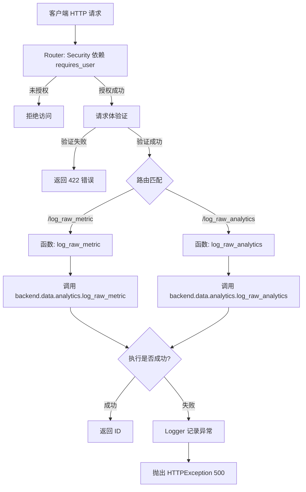
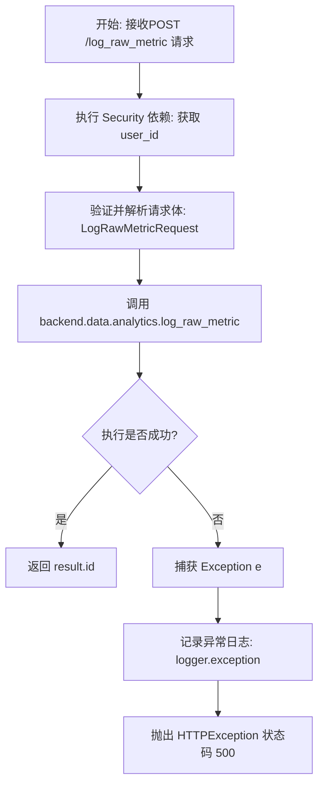
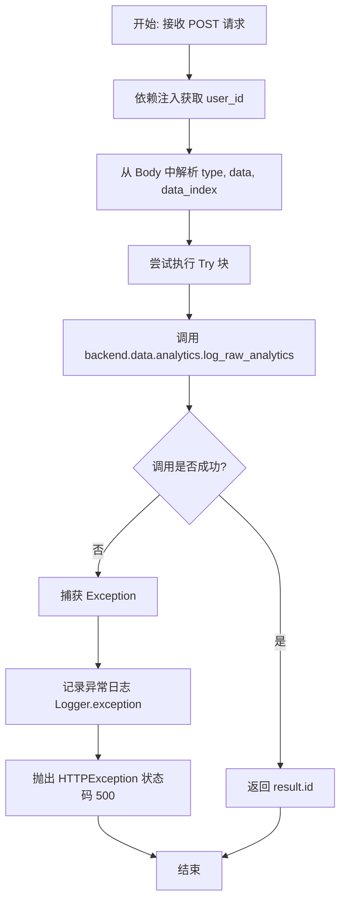

# `AutoGPT\autogpt_platform\backend\backend\api\features\analytics.py` 详细设计文档

该文件基于 FastAPI 框架，定义了用于记录用户原始指标和分析数据的 API 端点，通过身份验证保护请求，验证输入参数，并将数据处理委托给后端服务。

## 整体流程



## 类结构

```
pydantic.BaseModel
└── LogRawMetricRequest
```

## 全局变量及字段


### `router`
    
A FastAPI router instance configured to handle API endpoints with user authentication dependencies.

类型：`fastapi.APIRouter`
    


### `logger`
    
A logger instance used to record operational information and errors within the analytics API module.

类型：`logging.Logger`
    


### `LogRawMetricRequest.metric_name`
    
The name identifier for the raw metric being logged.

类型：`str`
    


### `LogRawMetricRequest.metric_value`
    
The numerical value of the raw metric, disallowing infinity or NaN.

类型：`float`
    


### `LogRawMetricRequest.data_string`
    
A string containing additional context or data associated with the metric.

类型：`str`
    
    

## 全局函数及方法


### `log_raw_metric`

这是一个异步的 FastAPI 路由处理函数，用于接收并记录用户的原始指标数据。它通过依赖注入获取已认证的用户ID，解析包含指标名称、数值和附加数据的请求体，将其转发给后端分析服务进行处理，并返回成功记录后的ID。若处理过程中发生异常，则记录错误日志并返回HTTP 500错误。

参数：

- `user_id`：`Annotated[str, fastapi.Security(get_user_id)]`，当前登录用户的唯一标识符，由FastAPI的安全依赖机制自动解析并注入。
- `request`：`LogRawMetricRequest`，包含指标数据的请求体对象，具体字段包括 metric_name（指标名称）、metric_value（指标数值）和 data_string（附加数据字符串）。

返回值：`str`，成功记录后返回的指标记录ID。如果发生错误，抛出 `fastapi.HTTPException`。

#### 流程图



#### 带注释源码

```python
@router.post(path="/log_raw_metric")
async def log_raw_metric(
    # 通过 FastAPI 的 Security 依赖注入，自动获取并验证当前请求的用户 ID
    user_id: Annotated[str, fastapi.Security(get_user_id)],
    # 请求体参数，FastAPI 会根据 LogRawMetricRequest 模型进行验证和序列化
    request: LogRawMetricRequest,
):
    try:
        # 调用后端数据分析模块，将用户信息和指标数据传递出去进行持久化处理
        result = await backend.data.analytics.log_raw_metric(
            user_id=user_id,
            metric_name=request.metric_name,
            metric_value=request.metric_value,
            data_string=request.data_string,
        )
        # 返回后端生成的记录 ID
        return result.id
    except Exception as e:
        # 捕获所有异常，记录包含上下文（指标名、用户ID、错误详情）的错误日志
        logger.exception(
            "Failed to log metric %s for user %s: %s", request.metric_name, user_id, e
        )
        # 返回 HTTP 500 错误响应，包含错误消息和排查提示
        raise fastapi.HTTPException(
            status_code=500,
            detail={
                "message": str(e),
                "hint": "Check analytics service connection and retry.",
            },
        )
```


### `log_raw_analytics`

该函数是一个 FastAPI 异步路由处理程序，用于接收并处理原始分析数据的记录请求。它从请求体中提取事件类型、数据载荷及索引字段，结合已认证的用户身份，调用后端数据分析服务进行存储，并返回记录的唯一标识符。

参数：

-  `user_id`：`Annotated[str, fastapi.Security(get_user_id)]`，通过 FastAPI 安全依赖注入的当前登录用户的 ID。
-  `type`：`Annotated[str, fastapi.Body(..., embed=True)]`，嵌入在请求体中的分析事件类型。
-  `data`：`Annotated[dict, fastapi.Body(..., embed=True, description="The data to log")]`，嵌入在请求体中的需要记录的具体数据内容。
-  `data_index`：`Annotated[str, fastapi.Body(..., embed=True, description="Indexable field for any count based analytical measures like page order clicking, tutorial step completion, etc.")]`，嵌入在请求体中的用于计数或排序的索引字段。

返回值：`str`，后端服务返回的记录 ID（result.id）。

#### 流程图



#### 带注释源码

```python
@router.post("/log_raw_analytics")
async def log_raw_analytics(
    # 通过 FastAPI Security 依赖自动获取当前认证用户的 ID
    user_id: Annotated[str, fastapi.Security(get_user_id)],
    # 从请求 Body 中获取 type 参数，并嵌入在 JSON 根节点
    type: Annotated[str, fastapi.Body(..., embed=True)],
    # 从请求 Body 中获取 data 参数，类型为字典，包含具体需记录的数据
    data: Annotated[
        dict,
        fastapi.Body(..., embed=True, description="The data to log"),
    ],
    # 从请求 Body 中获取 data_index 参数，用于基于计数的分析索引（如点击顺序）
    data_index: Annotated[
        str,
        fastapi.Body(
            ...,
            embed=True,
            description="Indexable field for any count based analytical measures like page order clicking, tutorial step completion, etc.",
        ),
    ],
):
    try:
        # 调用后端数据分析服务的异步方法，将参数传递过去进行持久化处理
        result = await backend.data.analytics.log_raw_analytics(
            user_id, type, data, data_index
        )
        # 返回处理结果的 ID
        return result.id
    except Exception as e:
        # 捕获处理过程中的任何异常，并记录详细的错误日志（包含用户 ID 和异常信息）
        logger.exception("Failed to log analytics for user %s: %s", user_id, e)
        # 向客户端返回 HTTP 500 错误，提示服务端内部错误及建议
        raise fastapi.HTTPException(
            status_code=500,
            detail={"message": str(e), "hint": "Ensure analytics DB is reachable."},
        )
```


## 关键组件


### FastAPI 路由
负责定义 API 端点（`/log_raw_metric`, `/log_raw_analytics`），处理 HTTP 请求分发，并通过依赖注入管理认证和请求生命周期。

### Pydantic 数据模型
`LogRawMetricRequest` 类，用于验证传入的指标请求数据，强制执行类型约束（如字符串非空、浮点数非 NaN）和结构完整性。

### 后端分析服务集成
与 `backend.data.analytics` 模块的交互层，负责将经过验证和认证的用户数据异步持久化到后端数据库中。

### 认证与安全依赖
基于 `autogpt_libs.auth` 的安全机制，通过 `requires_user` 和 `get_user_id` 确保只有经过身份验证的用户才能调用日志记录接口。

### 异常处理与日志记录
集中式错误捕获逻辑，记录详细的异常堆栈信息，并向客户端返回标准化的 HTTP 500 错误响应，包含错误消息和操作提示。


## 问题及建议


### 已知问题

-   **粗糙的异常处理**：在两个端点中均使用了 `except Exception as e` 捕获所有异常。这种做法会掩盖具体的错误类型（如数据库连接超时、参数校验失败等），导致客户端始终只能收到 500 错误，不利于问题的排查和客户端的精确重试。
-   **代码逻辑重复**：`log_raw_metric` 和 `log_raw_analytics` 函数中的 `try-except` 结构以及日志记录逻辑高度重复，违反了 DRY（Don't Repeat Yourself）原则，增加了维护成本。
-   **输入参数类型定义不严谨**：`log_raw_analytics` 接口中的 `data` 参数使用了 `dict` 类型，并且没有定义具体的 Pydantic 模型。这失去了强类型的优势，无法对传入的数据结构进行自动校验，也降低了自动生成 API 文档的准确性和可读性。

### 优化建议

-   **引入异步解耦机制**：分析数据记录通常是非关键路径操作。建议引入消息队列（如 Redis、RabbitMQ）或后台任务（如 Celery、FastAPI BackgroundTasks），将日志记录异步化。这样可以立即响应用户请求，显著降低接口延迟，避免因分析服务不可用或缓慢而影响主业务流程。
-   **使用 Pydantic 模型规范请求体**：为 `log_raw_analytics` 接口创建明确的 Pydantic 模型，替代现有的 `dict` 和分散的 `Body` 参数。这不仅能利用 Pydantic 进行严格的数据校验，还能让 Swagger/OpenAPI 文档更加清晰易懂。
-   **实现全局或局部异常处理器**：利用 Fastapi 的 `@app.exception_handler` 或 `@router.exception_handler`，统一处理来自 `backend.data.analytics` 层的业务异常。根据捕获的具体异常类型（如 `DatabaseError`, `ValidationError`）返回不同的 HTTP 状态码，而不是统一返回 500。
-   **增加接口限流**：考虑到分析接口可能被高频触发，建议在路由依赖中增加限流策略（如基于 Token 或 IP 的限流），防止恶意刷量或前端 Bug 导致的后端数据库过载。


## 其它


### 设计目标与约束

**设计目标：**
1.  **异步高性能**：基于 FastAPI 构建，利用 `async/await` 语法处理 I/O 密集型操作（如写入数据库），确保在高并发情况下不阻塞主线程。
2.  **数据完整性**：通过 Pydantic 模型严格验证输入数据的类型和格式（例如防止空字符串、限制无穷大数值），确保进入系统的数据符合预期。
3.  **安全可控**：强制所有接口调用必须经过身份验证，确保只有合法用户才能记录数据。

**约束条件：**
1.  **认证强制**：所有路由默认依赖 `requires_user`，且端点显式注入 `user_id`，拒绝未授权的匿名访问。
2.  **无状态设计**：API 设计遵循 RESTful 风格，服务端不维护客户端会话状态，状态管理由客户端或后端数据库层处理。
3.  **日志合规性**：所有数据记录操作必须附带用户 ID 和相关的数据字符串/索引，以便于后续的审计和追踪。

### 错误处理与异常设计

**异常处理策略：**
采用“统一捕获、记录日志、返回通用错误”的策略。

1.  **捕获范围**：在每个端点逻辑的核心代码块外层使用 `try-except Exception` 进行全量捕获。这意味着无论是业务逻辑抛出的特定异常还是运行时意外错误，都会被拦截。
2.  **日志记录**：一旦捕获异常，立即使用 `logger.exception` 记录完整的堆栈跟踪信息（包含上下文变量如 Metric Name 或 User ID），以便开发人员排查问题，但不会将堆栈信息直接暴露给前端用户。
3.  **客户端响应**：
    *   **状态码**：统一返回 `500 Internal Server Error`，表示服务器处理请求时发生错误。
    *   **响应体**：返回一个 JSON 对象，包含两个字段：
        *   `message`：具体的错误信息字符串。
        *   `hint`：给用户的操作提示（如“检查分析服务连接”），提升用户体验。

### 数据流与状态机

**数据流向：**
1.  **请求接收**：FastAPI 路由接收 HTTP POST 请求。
2.  **身份验证**：`fastapi.Security` 依赖链执行，解析请求头中的凭据，调用 `get_user_id` 获取当前用户 ID。如果失败，流程直接中断并返回 401/403。
3.  **数据校验**：
    *   对于 `/log_raw_metric`：请求体 JSON 被反序列化为 `LogRawMetricRequest` Pydantic 模型，验证字段约束（如 `min_length`）。
    *   对于 `/log_raw_analytics`：FastAPI 直接解析 Body 参数。
4.  **业务处理**：将验证后的数据和用户 ID 传递给 `backend.data.analytics` 模块进行持久化操作。
5.  **响应生成**：
    *   **成功**：提取持久化结果的 `id`，直接返回给客户端（默认 HTTP 200）。
    *   **失败**：触发 `except` 块，记录日志并返回 HTTP 500 错误响应。

**状态机：**
该模块是无状态的 API 层，不维护内部状态机。业务流程上的状态转换主要由外部数据库或消费者侧决定。

### 外部依赖与接口契约

**1. 身份验证库 (`autogpt_libs.auth`)**
*   **组件**：`requires_user`, `get_user_id`
*   **契约**：
    *   **输入**：HTTP 请求头（通常包含 Authorization Token）。
    *   **输出**：成功时返回表示用户的唯一标识符字符串 (`user_id`)；失败时抛出认证相关的 HTTP 异常（如 401 Unauthorized），终止后续业务逻辑。

**2. 业务逻辑模块 (`backend.data.analytics`)**
*   **组件**：`log_raw_metric`, `log_raw_analytics`
*   **契约**：
    *   **输入**：
        *   `user_id` (str): 用户标识。
        *   `metric_name`, `metric_value`, `data_string` 等 (str/float/dict): 具体业务数据。
    *   **输出**：返回一个结果对象，该对象必须包含 `id` 属性，用于表示记录的唯一标识。
    *   **异常**：可能抛出数据库连接错误、数据格式错误等 Exception，由 API 层捕获。

    