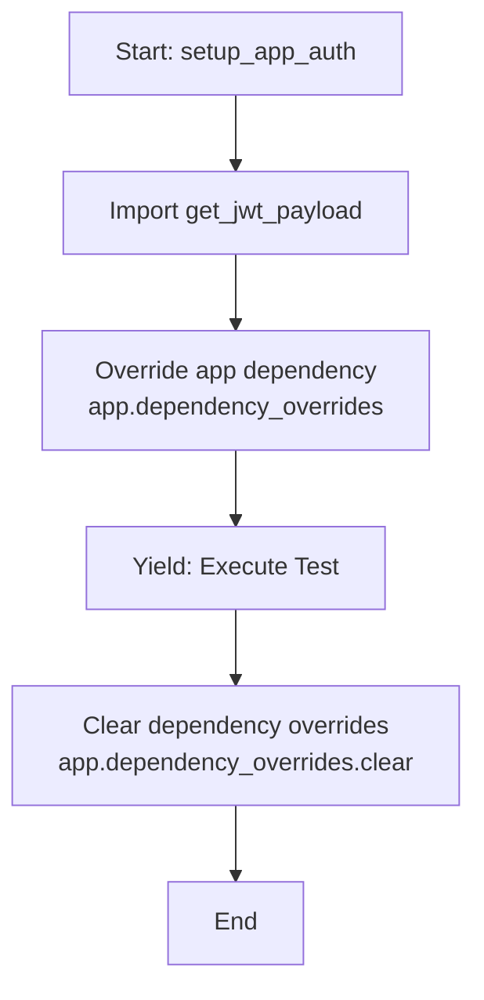
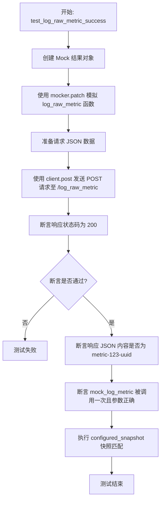
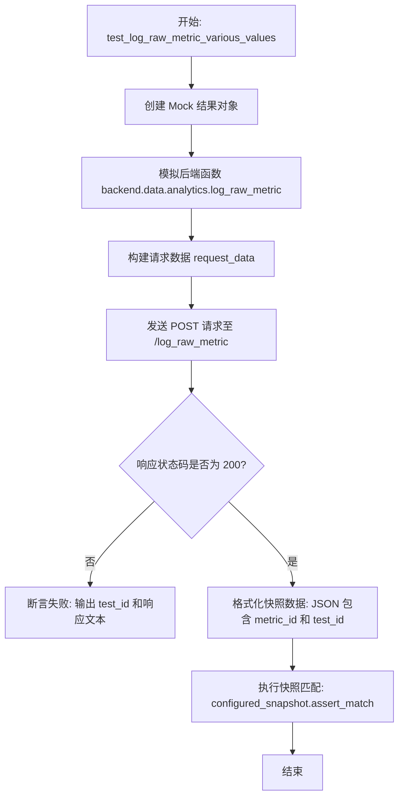
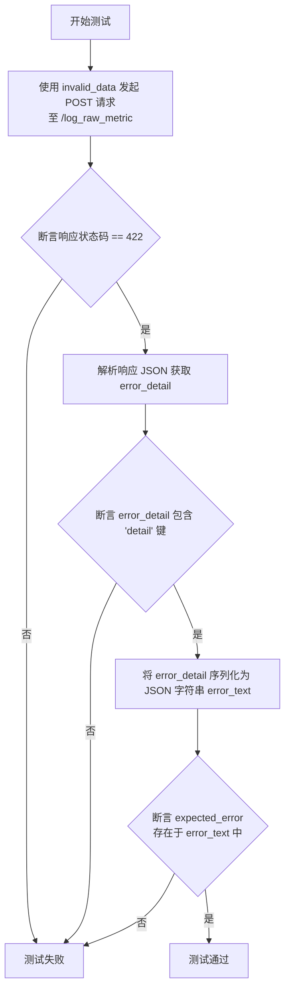
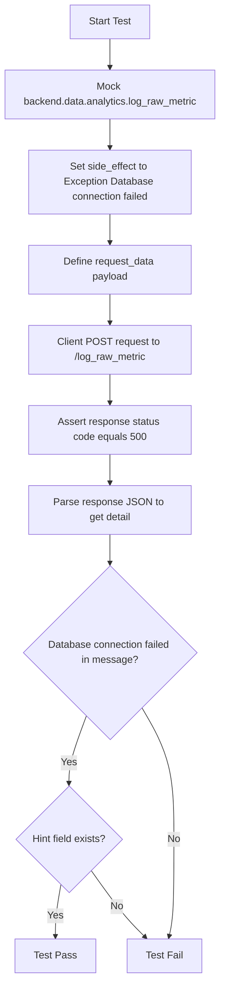
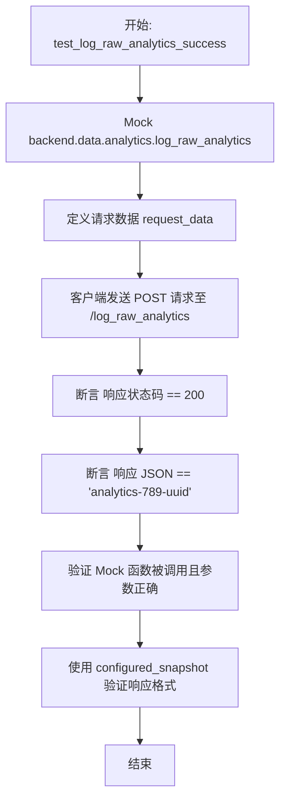
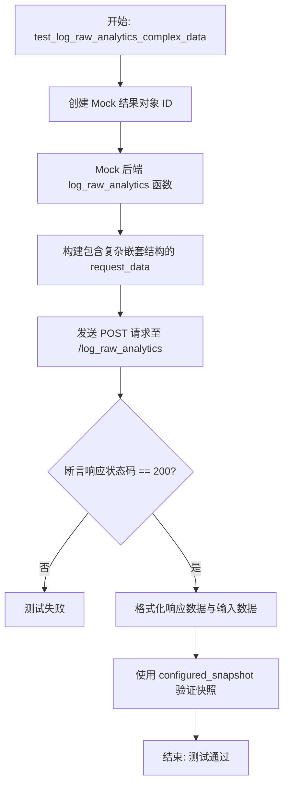
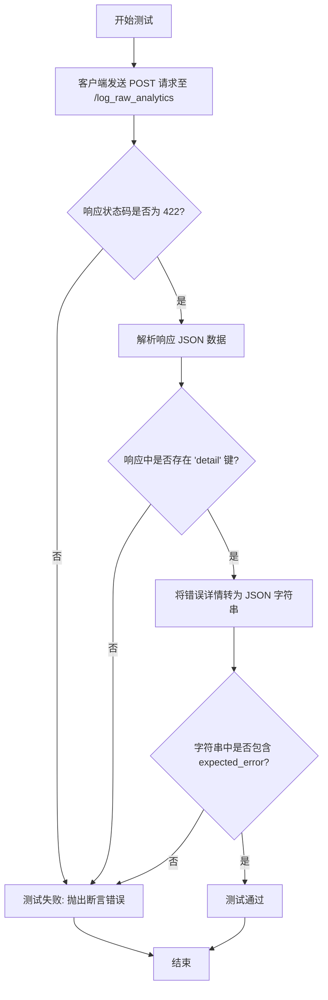
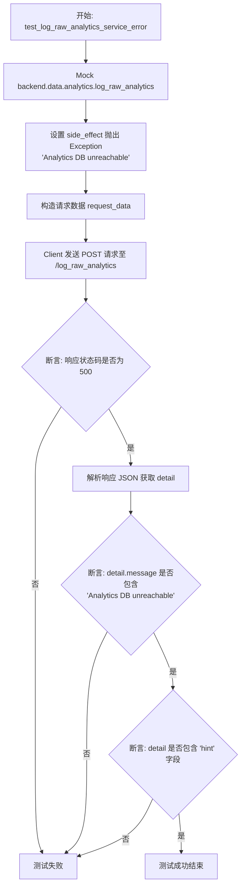

# `AutoGPT\autogpt_platform\backend\backend\api\features\analytics_test.py` 详细设计文档

该文件是一个基于 Pytest 的单元测试套件，用于验证 Analytics API 端点（包括原始指标记录和原始分析事件记录）的功能完整性、输入验证机制、参数化处理能力以及后端服务异常时的错误处理逻辑。

## 整体流程

```mermaid
graph TD
    A[开始测试] --> B[初始化 FastAPI 应用与测试客户端]
    B --> C[执行 setup_app_auth fixture]
    C --> D[覆盖 JWT 认证依赖]
    D --> E{执行测试用例}
    E --> F[Group: 指标测试 /log_raw_metric]
    E --> G[Group: 分析事件测试 /log_raw_analytics]
    F --> H[Mock backend.data.analytics]
    G --> H
    H --> I[发送 POST 请求]
    I --> J{断言响应}
    J -->|验证通过| K[匹配 Snapshot]
    J -->|验证失败| L[抛出 AssertionError]
    K --> M[结束]
    L --> M
    M --> N[清理依赖覆盖 app.dependency_overrides.clear()]
```

## 类结构

```
Test Module (test_analytics)
├── Global Variables
│   ├── app
│   └── client
├── Fixtures
│   └── setup_app_auth
└── Test Functions
   ├── Metric Tests Group
   │   ├── test_log_raw_metric_success
   │   ├── test_log_raw_metric_various_values
   │   ├── test_log_raw_metric_validation_errors
   │   └── test_log_raw_metric_service_error
   └── Analytics Tests Group
       ├── test_log_raw_analytics_success
       ├── test_log_raw_analytics_complex_data
       ├── test_log_raw_analytics_validation_errors
       └── test_log_raw_analytics_service_error
```

## 全局变量及字段


### `app`
    
FastAPI应用程序实例，配置了analytics路由，用于在此模块中测试API端点。

类型：`fastapi.FastAPI`
    


### `client`
    
TestClient实例，用于向FastAPI测试应用发送HTTP请求并验证响应。

类型：`fastapi.testclient.TestClient`
    


    

## 全局函数及方法


### `setup_app_auth`

一个 Pytest 夹具（Fixture），配置为在模块中的所有测试自动运行。它通过使用模拟的 JWT 用户负载覆盖 FastAPI 应用的 JWT 认证依赖，以便在不需要实际认证凭据的情况下进行测试，并在测试执行完毕后清除这些覆盖设置。

参数：

-   `mock_jwt_user`：`dict` 或 `Fixture`，提供模拟 JWT 用户数据的夹具，通常是一个字典，包含用于覆盖 `get_jwt_payload` 依赖的模拟函数。

返回值：`None`，该函数主要用于设置和清理测试环境，通过 `yield` 将控制权交给测试，本身不返回具体数值。

#### 流程图



#### 带注释源码

```python
@pytest.fixture(autouse=True)
def setup_app_auth(mock_jwt_user):
    """Setup auth overrides for all tests in this module."""
    # 导入需要覆盖的 JWT 负载获取函数
    from autogpt_libs.auth.jwt_utils import get_jwt_payload

    # 使用 mock_jwt_user 夹具提供的模拟函数覆盖 FastAPI 应用的依赖
    # 这样在测试调用需要认证的端点时，会直接使用模拟数据，跳过真实的 JWT 验证
    app.dependency_overrides[get_jwt_payload] = mock_jwt_user["get_jwt_payload"]
    
    # 暂停执行，将控制权交还给测试函数
    yield
    
    # 测试执行完毕后，清除所有依赖覆盖，恢复应用状态，避免影响后续测试
    app.dependency_overrides.clear()
```


### `test_log_raw_metric_success`

该函数用于测试原始指标记录接口的成功场景，通过模拟后端服务并验证 HTTP 响应状态码、返回内容以及服务调用参数的正确性，确保 API 能够正确处理并记录指标数据。

参数：

-  `mocker`：`pytest_mock.MockFixture`，pytest-mock 提供的 fixture，用于模拟（Mock）后端函数和对象的行为。
-  `configured_snapshot`：`Snapshot`，用于快照测试的 fixture，用于验证输出是否符合预存的快照文件。
-  `test_user_id`：`str`，测试用的用户 ID，通常由其他 fixture 注入，用于模拟认证用户的身份。

返回值：`None`，该函数为测试函数，主要用于断言验证，不返回具体数值。

#### 流程图



#### 带注释源码

```python
def test_log_raw_metric_success(
    mocker: pytest_mock.MockFixture,
    configured_snapshot: Snapshot,
    test_user_id: str,
) -> None:
    """Test successful raw metric logging."""
    # 1. 准备模拟返回的结果对象，设定 metric 的 ID 为 "metric-123-uuid"
    mock_result = Mock(id="metric-123-uuid")
    
    # 2. 使用 mocker.patch 替换后端的 'backend.data.analytics.log_raw_metric' 函数
    #    设置为异步模拟 (AsyncMock)，并指定返回值为上面准备的 mock_result
    mock_log_metric = mocker.patch(
        "backend.data.analytics.log_raw_metric",
        new_callable=AsyncMock,
        return_value=mock_result,
    )

    # 3. 准备发送给 API 的请求数据
    request_data = {
        "metric_name": "page_load_time",
        "metric_value": 2.5,
        "data_string": "/dashboard",
    }

    # 4. 使用 TestClient 向 /log_raw_metric 端点发送 POST 请求
    response = client.post("/log_raw_metric", json=request_data)

    # 5. 验证 HTTP 响应状态码是否为 200 (成功)
    assert response.status_code == 200, f"Unexpected response: {response.text}"
    
    # 6. 验证响应体中的 JSON 数据是否为预期的 ID 字符串
    assert response.json() == "metric-123-uuid"

    # 7. 验证后端模拟函数 log_raw_metric 是否被正确调用了一次
    #    并且传参 (user_id, metric_name, metric_value, data_string) 符合预期
    mock_log_metric.assert_called_once_with(
        user_id=test_user_id,
        metric_name="page_load_time",
        metric_value=2.5,
        data_string="/dashboard",
    )

    # 8. 使用快照测试验证响应数据格式是否符合预期快照
    configured_snapshot.assert_match(
        json.dumps({"metric_id": response.json()}, indent=2, sort_keys=True),
        "analytics_log_metric_success",
    )
```


### `test_log_raw_metric_various_values`

该函数是一个参数化测试，旨在验证当使用多种不同的数值（包括整数、零、负数、高精度浮点数、极大值和极小值）调用原始指标记录接口时，系统能否正确处理请求并与预期快照匹配。

参数：

-  `mocker`：`pytest_mock.MockFixture`，用于模拟后端逻辑的 pytest fixture，允许替换 `log_raw_metric` 的实现。
-  `configured_snapshot`：`Snapshot`，用于快照测试的 fixture，用于验证 API 响应是否符合预期。
-  `metric_value`：`float`，通过参数化注入的测试指标数值，用于覆盖各种数值边界情况。
-  `metric_name`：`str`，通过参数化注入的测试指标名称。
-  `data_string`：`str`，通过参数化注入的测试附加数据字符串。
-  `test_id`：`str`，通过参数化注入的测试用例标识符，用于区分不同的测试场景。

返回值：`None`，该函数为测试函数，主要用于断言和验证，不返回业务数据。

#### 流程图



#### 带注释源码

```python
@pytest.mark.parametrize(
    "metric_value,metric_name,data_string,test_id",
    [
        (100, "api_calls_count", "external_api", "integer_value"),
        (0, "error_count", "no_errors", "zero_value"),
        (-5.2, "temperature_delta", "cooling", "negative_value"),
        (1.23456789, "precision_test", "float_precision", "float_precision"),
        (999999999, "large_number", "max_value", "large_number"),
        (0.0000001, "tiny_number", "min_value", "tiny_number"),
    ],
)
def test_log_raw_metric_various_values(
    mocker: pytest_mock.MockFixture,
    configured_snapshot: Snapshot,
    metric_value: float,
    metric_name: str,
    data_string: str,
    test_id: str,
) -> None:
    """Test raw metric logging with various metric values."""
    # 创建一个模拟的返回结果对象，ID 包含 test_id 以便区分
    mock_result = Mock(id=f"metric-{test_id}-uuid")
    
    # 使用 mocker 替换后端的 log_raw_metric 函数，使其返回上述模拟结果
    mocker.patch(
        "backend.data.analytics.log_raw_metric",
        new_callable=AsyncMock,
        return_value=mock_result,
    )

    # 构造 POST 请求所需的 JSON 数据体
    request_data = {
        "metric_name": metric_name,
        "metric_value": metric_value,
        "data_string": data_string,
    }

    # 使用测试客户端向 /log_raw_metric 端点发送 POST 请求
    response = client.post("/log_raw_metric", json=request_data)

    # 断言响应状态码为 200，如果失败则打印包含 test_id 的错误信息
    assert response.status_code == 200, f"Failed for {test_id}: {response.text}"

    # 将响应数据格式化为 JSON 字符串，并与存储的快照进行匹配
    configured_snapshot.assert_match(
        json.dumps(
            {"metric_id": response.json(), "test_case": test_id},
            indent=2,
            sort_keys=True,
        ),
        f"analytics_metric_{test_id}",
    )
```


### `test_log_raw_metric_validation_errors`

该函数用于测试 `/log_raw_metric` 端点在接收到不符合验证规则的请求数据时，能否正确返回 HTTP 422 状态码以及包含预期错误信息的响应详情。它通过参数化测试覆盖了空请求、缺失字段、类型错误和空字符串等多种无效场景。

参数：

-  `invalid_data`：`dict`，包含无效字段或缺失必需字段的请求体数据，用于触发后端验证逻辑。
-  `expected_error`：`str`，预期在错误响应详情中出现的特定错误提示文本片段，用于验证错误信息的准确性。

返回值：`None`，该函数为测试用例，无返回值，主要通过断言验证行为。

#### 流程图



#### 带注释源码

```python
@pytest.mark.parametrize(
    "invalid_data,expected_error",
    [
        ({}, "Field required"),
        ({"metric_name": "test"}, "Field required"),
        (
            {"metric_name": "test", "metric_value": "not_a_number", "data_string": "x"},
            "Input should be a valid number",
        ),
        (
            {"metric_name": "", "metric_value": 1.0, "data_string": "test"},
            "String should have at least 1 character",
        ),
        (
            {"metric_name": "test", "metric_value": 1.0, "data_string": ""},
            "String should have at least 1 character",
        ),
    ],
    ids=[
        "empty_request",
        "missing_metric_value_and_data_string",
        "invalid_metric_value_type",
        "empty_metric_name",
        "empty_data_string",
    ],
)
def test_log_raw_metric_validation_errors(
    invalid_data: dict,
    expected_error: str,
) -> None:
    """Test validation errors for invalid metric requests."""
    # 向 /log_raw_metric 端点发送 POST 请求，传入构造的无效数据
    response = client.post("/log_raw_metric", json=invalid_data)

    # 断言 HTTP 状态码为 422 (Unprocessable Entity)，表示请求格式正确但语义错误
    assert response.status_code == 422

    # 获取响应体的 JSON 数据
    error_detail = response.json()
    
    # 断言错误详情中包含 'detail' 字段，这是 FastAPI 验证错误的标准格式
    assert "detail" in error_detail, f"Missing 'detail' in error: {error_detail}"

    # 将错误详情对象转换为 JSON 格式的字符串
    error_text = json.dumps(error_detail)
    
    # 断言预期的错误信息字符串包含在响应文本中，确保错误提示符合预期
    assert (
        expected_error in error_text
    ), f"Expected '{expected_error}' in error response: {error_text}"
```


### `test_log_raw_metric_service_error`

该函数用于测试当分析服务后端发生异常（如数据库连接失败）时，`/log_raw_metric` API端点的错误处理机制。它模拟后端服务抛出异常的情况，并验证API能够正确返回HTTP 500状态码以及包含错误详情的响应体。

参数：

-  `mocker`：`pytest_mock.MockFixture`，Pytest mocker fixture，用于模拟（Mock）后端依赖的行为。
-  `test_user_id`：`str`，用于测试的用户ID fixture。

返回值：`None`，该函数为测试函数，无返回值，主要通过断言验证行为。

#### 流程图



#### 带注释源码

```python
def test_log_raw_metric_service_error(
    mocker: pytest_mock.MockFixture,
    test_user_id: str,
) -> None:
    """Test error handling when analytics service fails."""
    # 模拟后端的 log_raw_metric 函数，使其在被调用时抛出异常
    mocker.patch(
        "backend.data.analytics.log_raw_metric",
        new_callable=AsyncMock,
        side_effect=Exception("Database connection failed"),
    )

    # 准备发送给 API 的请求数据
    request_data = {
        "metric_name": "test_metric",
        "metric_value": 1.0,
        "data_string": "test",
    }

    # 调用 /log_raw_metric 端点发送 POST 请求
    response = client.post("/log_raw_metric", json=request_data)

    # 验证 HTTP 响应状态码为 500 (Internal Server Error)
    assert response.status_code == 500
    
    # 获取响应体中的错误详情
    error_detail = response.json()["detail"]
    
    # 验证错误消息包含预期的异常信息
    assert "Database connection failed" in error_detail["message"]
    
    # 验证错误响应中包含提示信息字段
    assert "hint" in error_detail
```


### `test_log_raw_analytics_success`

Test successful raw analytics logging. This test case mocks the backend analytics service, sends a POST request containing user action data to the `/log_raw_analytics` API endpoint, and validates that the service returns a 200 status code, the correct analytics ID, and that the underlying data layer function was invoked with the expected parameters. It also verifies the response against a pre-configured snapshot.

参数：

-   `mocker`: `pytest_mock.MockFixture`, Pytest fixture used to mock objects and functions.
-   `configured_snapshot`: `Snapshot`, Pytest fixture used to assert that the output matches a stored snapshot.
-   `test_user_id`: `str`, Fixture providing the ID of the test user for authentication context.

返回值：`None`, 该函数没有返回值，主要用于断言和验证。

#### 流程图



#### 带注释源码

```python
def test_log_raw_analytics_success(
    mocker: pytest_mock.MockFixture,
    configured_snapshot: Snapshot,
    test_user_id: str,
) -> None:
    """Test successful raw analytics logging."""
    # 1. 模拟后端日志记录函数，使其返回一个带有预设 ID 的 Mock 对象
    mock_result = Mock(id="analytics-789-uuid")
    mock_log_analytics = mocker.patch(
        "backend.data.analytics.log_raw_analytics",
        new_callable=AsyncMock,
        return_value=mock_result,
    )

    # 2. 准备测试用的请求数据，包含类型、详细数据和索引
    request_data = {
        "type": "user_action",
        "data": {
            "action": "button_click",
            "button_id": "submit_form",
            "timestamp": "2023-01-01T00:00:00Z",
            "metadata": {"form_type": "registration", "fields_filled": 5},
        },
        "data_index": "button_click_submit_form",
    }

    # 3. 发送 POST 请求到测试客户端
    response = client.post("/log_raw_analytics", json=request_data)

    # 4. 验证 HTTP 状态码为 200，表示请求成功
    assert response.status_code == 200, f"Unexpected response: {response.text}"
    
    # 5. 验证返回的 JSON 数据即为预期的 ID
    assert response.json() == "analytics-789-uuid"

    # 6. 验证后端模拟函数是否被正确调用，且参数（用户ID、类型、数据、索引）均符合预期
    mock_log_analytics.assert_called_once_with(
        test_user_id,
        "user_action",
        request_data["data"],
        "button_click_submit_form",
    )

    # 7. 验证响应数据的快照，确保输出格式与预期一致
    configured_snapshot.assert_match(
        json.dumps({"analytics_id": response.json()}, indent=2, sort_keys=True),
        "analytics_log_analytics_success",
    )
```


### `test_log_raw_analytics_complex_data`

该测试函数旨在验证系统能够正确处理并记录包含复杂嵌套结构的分析数据。它模拟了后端数据层的日志记录行为，构建了一个包含多层嵌套（如列表、字典、混合类型）的“代理执行”数据负载，通过 FastAPI 测试客户端发送 POST 请求，并断言响应状态码及数据内容是否符合预期快照。

参数：

- `mocker`: `pytest_mock.MockFixture`, Pytest 的 fixture，用于创建和管理模拟对象（Mock）。
- `configured_snapshot`: `Snapshot`, Pytest 的 fixture，用于执行快照测试以验证输出内容的一致性。

返回值：`None`, 测试函数本身不返回值，通过内部的断言语句来判断测试是否通过。

#### 流程图



#### 带注释源码

```python
def test_log_raw_analytics_complex_data(
    mocker: pytest_mock.MockFixture,
    configured_snapshot: Snapshot,
) -> None:
    """Test raw analytics logging with complex nested data structures."""
    # 1. 准备 Mock 对象，模拟数据库返回的 ID
    mock_result = Mock(id="analytics-complex-uuid")
    
    # 2. 使用 mocker 补丁替换后端实际的 log_raw_analytics 函数
    # 使其在测试中返回上面定义的 mock_result，避免真实数据库操作
    mocker.patch(
        "backend.data.analytics.log_raw_analytics",
        new_callable=AsyncMock,
        return_value=mock_result,
    )

    # 3. 构造复杂的请求数据，包含嵌套的字典和列表
    request_data = {
        "type": "agent_execution",
        "data": {
            "agent_id": "agent_123",
            "execution_id": "exec_456",
            "status": "completed",
            "duration_ms": 3500,
            "nodes_executed": 15,
            "blocks_used": [  # 列表包含字典
                {"block_id": "llm_block", "count": 3},
                {"block_id": "http_block", "count": 5},
                {"block_id": "code_block", "count": 2},
            ],
            "errors": [],
            "metadata": {  # 嵌套字典
                "trigger": "manual",
                "user_tier": "premium",
                "environment": "production",
            },
        },
        "data_index": "agent_123_exec_456",
    }

    # 4. 发送 POST 请求到测试客户端的指定端点
    response = client.post("/log_raw_analytics", json=request_data)

    # 5. 断言 HTTP 响应状态码为 200 (成功)
    assert response.status_code == 200

    # 6. 使用快照断言验证 JSON 响应
    # 将返回的分析 ID 和原始记录的数据格式化为 JSON 字符串
    # 并与预存的快照文件进行比对，确保结构一致
    configured_snapshot.assert_match(
        json.dumps(
            {"analytics_id": response.json(), "logged_data": request_data["data"]},
            indent=2,
            sort_keys=True,
        ),
        "analytics_log_analytics_complex_data",
    )
```


### `test_log_raw_analytics_validation_errors`

测试针对无效分析请求的验证错误。该函数通过参数化的方式接收各种无效的请求数据（如空请求、缺少必填字段、类型错误等），向 `/log_raw_analytics` 端点发送 POST 请求，并验证系统是否返回正确的 422 状态码以及预期的错误信息。

参数：

-  `invalid_data`：`dict`，包含无效字段或缺失字段的请求载荷，用于触发 API 的验证机制。
-  `expected_error`：`str`，预期的错误提示字符串片段，用于验证响应错误详情的准确性。

返回值：`None`，无返回值，该函数作为测试用例，主要通过断言来验证行为是否符合预期。

#### 流程图



#### 带注释源码

```python
def test_log_raw_analytics_validation_errors(
    invalid_data: dict,
    expected_error: str,
) -> None:
    """Test validation errors for invalid analytics requests."""
    # 使用测试客户端模拟发送包含无效数据的 POST 请求
    response = client.post("/log_raw_analytics", json=invalid_data)

    # 断言 HTTP 响应状态码为 422，表示请求格式正确但语义错误（验证失败）
    assert response.status_code == 422
    
    # 获取响应体的 JSON 内容
    error_detail = response.json()
    
    # 断言响应中包含 'detail' 字段，FastAPI 验证错误通常包含此字段
    assert "detail" in error_detail, f"Missing 'detail' in error: {error_detail}"

    # 将响应对象序列化为字符串以便进行内容匹配
    error_text = json.dumps(error_detail)
    
    # 断言预期的错误信息字符串存在于响应文本中，确保具体错误原因正确
    assert (
        expected_error in error_text
    ), f"Expected '{expected_error}' in error response: {error_text}"
```


### `test_log_raw_analytics_service_error`

该函数用于测试当后端分析服务发生故障（如数据库不可达）时，`/log_raw_analytics` API 端点的错误处理机制。它通过模拟服务层抛出异常，验证应用是否能正确捕获异常并返回带有详细错误信息的 HTTP 500 响应。

参数：

- `mocker`：`pytest_mock.MockFixture`，Pytest-mock 提供的 fixture，用于模拟对象和函数的行为。
- `test_user_id`：`str`，测试用的用户 ID 字符串，用于模拟已认证用户的上下文。

返回值：`None`，该函数为测试用例，无返回值，主要通过断言验证系统行为。

#### 流程图



#### 带注释源码

```python
def test_log_raw_analytics_service_error(
    mocker: pytest_mock.MockFixture,
    test_user_id: str,
) -> None:
    """Test error handling when analytics service fails."""
    # 使用 mocker 替换后端 analytics 模块的 log_raw_analytics 函数
    # 模拟该函数在执行时抛出异常，模拟数据库连接失败的场景
    mocker.patch(
        "backend.data.analytics.log_raw_analytics",
        new_callable=AsyncMock,
        side_effect=Exception("Analytics DB unreachable"),
    )

    # 准备发送给 API 的测试数据
    request_data = {
        "type": "test_event",
        "data": {"key": "value"},
        "data_index": "test_index",
    }

    # 调用客户端的 post 方法，向 /log_raw_analytics 端点发送请求
    response = client.post("/log_raw_analytics", json=request_data)

    # 验证服务器是否返回了 500 Internal Server Error 状态码
    assert response.status_code == 500
    
    # 获取响应体中的错误详情
    error_detail = response.json()["detail"]
    
    # 验证错误消息中包含预期的异常信息
    assert "Analytics DB unreachable" in error_detail["message"]
    # 验证错误详情中包含 'hint' 字段，确保错误信息结构完整
    assert "hint" in error_detail
```


## 关键组件


### FastAPI 测试客户端配置
初始化 FastAPI 应用、包含 analytics 路由并创建 TestClient，用于模拟发送 HTTP 请求至分析端点。

### JWT 认证模拟
利用 `dependency_overrides` 替换真实的 `get_jwt_payload` 函数，为测试提供虚拟的认证用户，绕过真实的身份验证流程。

### 指标日志记录测试套件
针对 `/log_raw_metric` 端点的测试集合，涵盖成功场景、不同数值类型的输入、字段验证错误以及后端服务异常处理。

### 分析日志记录测试套件
针对 `/log_raw_analytics` 端点的测试集合，涵盖成功记录、复杂嵌套数据的处理、字段验证错误以及后端服务异常处理。

### 快照测试机制
利用 `pytest-snapshot` 插件，将 API 的 JSON 响应与预存的快照文件进行比对，以确保响应格式的稳定性。


## 问题及建议


### 已知问题

-   **与实现细节过度耦合**：在 `test_log_raw_metric_service_error` 和 `test_log_raw_analytics_service_error` 中，测试用例直接断言了异常的具体消息字符串（如 "Database connection failed"）。如果后端逻辑修改了异常文本但保持 HTTP 状态码不变，测试将会失败，导致测试维护成本增加。
-   **模拟路径硬编码**：使用 `mocker.patch("backend.data.analytics.log_raw_metric", ...)` 时，目标路径是以字符串形式硬编码的。如果进行代码重构导致模块路径变更，这些测试将无法正确打桩，导致测试失败或误测。
-   **全局变量管理风险**：`app` 和 `client` 对象在模块层级作为全局变量初始化。尽管 `TestClient` 通常设计为同步使用，但全局状态会使得在不同测试场景下（例如需要不同的 App 配置或依赖覆盖时）难以隔离测试环境。

### 优化建议

-   **使用 Fixture 管理应用生命周期**：建议将 `FastAPI` 实例和 `TestClient` 的创建移至 `pytest.fixture` 函数中，并设置合理的作用域（如 `module` 或 `session`），以明确资源初始化和清理的边界，提高测试的隔离性和可读性。
-   **引入测试数据生成库**：建议使用 `Faker` 或 `FactoryBoy` 等库动态生成测试数据（如 `request_data`），替代当前硬编码的 JSON 字典。这不仅能覆盖更广泛的边缘情况（如超长字符串、特殊字符），还能减少编写重复测试数据的工作量。
-   **改进错误断言逻辑**：在验证错误响应（如 422 或 500 错误）时，避免将整个响应 JSON 序列化为字符串后进行子串匹配（`in error_text`）。建议直接解析 JSON 对象，验证具体的字段路径和值，以增强断言的准确性和对 JSON 格式变化的鲁棒性。
-   **封装通用的错误测试辅助函数**：针对服务异常测试（Service Error），可以编写一个通用的辅助函数或 fixture，接受 mock 的异常对象和期望的状态码，以此消除 `test_log_raw_metric_service_error` 和 `test_log_raw_analytics_service_error` 中的重复代码逻辑。


## 其它


### 设计目标与约束

**设计目标：**
1.  **API 契约验证**：确保 `/log_raw_metric` 和 `/log_raw_analytics` 端点的输入验证（基于 Pydantic 模型）、输出格式及 HTTP 状态码符合 API 规范。
2.  **异常处理鲁棒性**：验证 API 层在接收到无效数据（客户端错误）或下游服务抛出异常（服务端错误）时，能够返回结构正确且包含有用信息的错误响应。
3.  **业务逻辑隔离**：通过 Mock 技术（`unittest.mock.AsyncMock`）将测试与实际的数据库或业务逻辑层解耦，实现快速、独立的单元测试。
4.  **输出一致性保证**：利用 `pytest-snapshot` 确保成功的 API 响应结构在代码迭代过程中保持稳定，防止意外更改影响前端集成。

**约束：**
1.  **无外部依赖**：测试不得连接真实的数据库或外部认证服务，所有依赖必须通过 Fixture 或 Mock 覆盖。
2.  **认证覆盖**：所有测试必须在已认证的上下文中运行，使用 `setup_app_auth` fixture 强制覆盖 JWT 依赖。
3.  **测试隔离性**：每个测试用例必须独立运行，依赖覆盖必须在测试结束后清理（通过 `yield` 实现），避免状态污染。

### 错误处理与异常设计

**验证错误（HTTP 422）：**
*   **设计机制**：利用 FastAPI 的自动请求验证。测试用例通过传入缺失字段、错误数据类型（如字符串代替数字）或空字符串来触发 Pydantic 验证错误。
*   **预期行为**：API 必须返回 HTTP 422 状态码，响应体 JSON 中必须包含 `detail` 字段，且错误信息中需包含特定的提示文本（如 "Field required", "Input should be a valid number"）。

**服务端错误（HTTP 500）：**
*   **设计机制**：通过 `mocker.patch` 模拟 `backend.data.analytics` 模块中的业务逻辑函数抛出通用 `Exception`（如数据库连接失败）。
*   **预期行为**：API 全局异常处理器必须捕获该异常，返回 HTTP 500 状态码。响应体中的 `detail` 对象必须包含原始异常消息（`message` 字段）和调试提示（`hint` 字段）。

**边界值与类型处理：**
*   **数值处理**：专门设计了参数化测试，覆盖整数、零、负数、高精度浮点数及极大/极小值，确保后端能正确处理数值类型的边缘情况。

### 数据流与状态机

**测试数据流：**
1.  **初始化**：`setup_app_auth` fixture 拦截 FastAPI 的依赖注入链，替换 `get_jwt_payload` 为 mock 用户身份，并挂载 analytics router 到测试应用实例。
2.  **请求发送**：`fastapi.testclient.TestClient` 模拟 HTTP POST 请求，携带 JSON payload 发送至目标端点。
3.  **拦截与处理**：
    *   FastAPI 路由层接收请求，进行 Pydantic 模型验证。
    *   验证通过后，路由调用业务逻辑层（此处已被 `AsyncMock` 替换）。
    *   Mock 对象根据预设配置返回模拟的业务对象（如 `Mock(id="...")`）或抛出异常。
4.  **响应生成**：FastAPI 将业务逻辑层的返回值序列化为 JSON，或将异常转换为错误响应。
5.  **断言与快照**：测试代码接收响应，断言状态码和 JSON 结构，并可选地使用 Snapshot 插件记录响应内容以供回归对比。

**状态管理：**
*   **应用依赖状态**：测试过程中使用了 `app.dependency_overrides` 修改应用全局状态。这是一个可变状态，通过 fixture 的 `yield` 机制确保在每次测试后执行 `clear()`，恢复应用至初始状态，保证测试间的幂等性。

### 外部依赖与接口契约

**外部依赖项：**
1.  **FastAPI & TestClient**：提供 Web 框架模拟和测试客户端能力。
2.  **Pytest & Pytest-Mock**：提供测试运行时、Fixture 管理及 Mock 对象（`mocker`）。
3.  **Autogpt Libs (auth)**：外部认证库。测试中通过 Mock 替换其 `get_jwt_payload` 函数，解除对真实 JWT 验证逻辑的依赖。
4.  **Backend Data Analytics**：被测端点调用的实际业务逻辑模块。测试中完全隔离该模块，使用 `AsyncMock` 模拟其异步函数行为（`log_raw_metric`, `log_raw_analytics`）。

**接口契约：**
1.  **`POST /log_raw_metric` 契约**：
    *   **输入**：`metric_name` (非空字符串), `metric_value` (数字), `data_string` (非空字符串)。
    *   **输出 (Success)**：HTTP 200, Body: 返回创建的 Metric ID (字符串)。
    *   **输出 (Error)**：HTTP 422 (验证失败) 或 HTTP 500 (服务内部错误)。

2.  **`POST /log_raw_analytics` 契约**：
    *   **输入**：`type` (字符串), `data` (字典对象), `data_index` (字符串)。
    *   **输出 (Success)**：HTTP 200, Body: 返回创建的 Analytics ID (字符串)。
    *   **输出 (Error)**：HTTP 422 (验证失败) 或 HTTP 500 (服务内部错误)。

3.  **认证接口契约**：
    *   测试假设应用期望一个包含用户 ID (`test_user_id`) 的 JWT Payload 结构，并通过依赖注入系统传递给业务逻辑层。

### 测试策略与覆盖率

**测试策略：**
1.  **参数化测试**：使用 `@pytest.mark.parametrize` 对单一端点进行多场景覆盖（例如：各种数值类型的 metric，各种缺失字段的错误请求），显著减少重复代码并提高覆盖密度。
2.  **快照测试**：引入 `Snapshot` 依赖，对成功的响应体进行快照记录。这用于非关键性的响应格式验证，确保在重构过程中响应结构不被意外破坏。
3.  **Mock 驱动测试**：所有后端交互均被 Mock，测试重点在于 HTTP 层的入口和出口行为，而非业务逻辑的实现细节。

**覆盖范围：**
*   覆盖了所有端点的成功路径。
*   覆盖了所有必填字段的验证规则。
*   覆盖了数据类型的校验规则。
*   覆盖了异常捕获路径。
*   覆盖了复杂嵌套数据结构的序列化能力。

    