# `.\AutoGPT\autogpt_platform\backend\backend\api\features\builder\db.py` 详细设计文档

This code provides functionality for managing and retrieving blocks, agents, and providers in a system, including searching, pagination, and caching.

## 整体流程

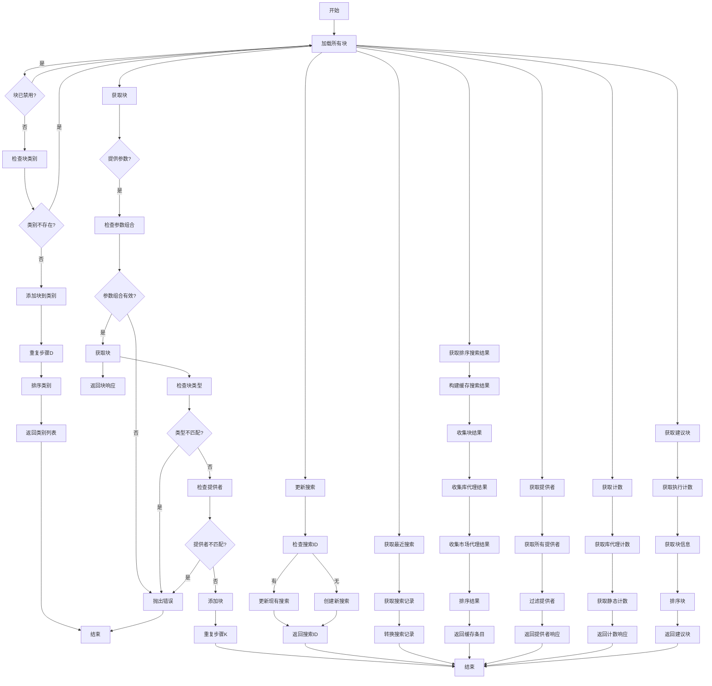

## 类结构

```
ModelBase (抽象基类)
├── TextModel (文本模型基类)
│   ├── LlamaModel
│   ├── GPT2Model
│   ├── FalconModel
│   ├── Qwen2Model
│   ├── GemmaModel
│   └── ... 
└── _ScoredItem
    ├── item
    ├── filter_type
    ├── score
    └── sort_key
```

## 全局变量及字段


### `logger`
    
Logger instance for logging messages.

类型：`logging.Logger`
    


### `llm_models`
    
List of LLM model names in lowercase and space-separated format.

类型：`list[str]`
    


### `MAX_LIBRARY_AGENT_RESULTS`
    
Maximum number of library agents to return in a single request.

类型：`int`
    


### `MAX_MARKETPLACE_AGENT_RESULTS`
    
Maximum number of marketplace agents to return in a single request.

类型：`int`
    


### `MIN_SCORE_FOR_FILTERED_RESULTS`
    
Minimum score required for an item to be included in filtered results.

类型：`float`
    


### `SearchResultItem`
    
Type alias for the result item type, which can be a block, library agent, or store agent.

类型：`type[BlockInfo | library_model.LibraryAgent | store_model.StoreAgent]`
    


### `_ScoredItem`
    
Dataclass representing a scored search result item.

类型：`dataclass`
    


### `_SearchCacheEntry`
    
Dataclass representing a search cache entry with items and total item counts.

类型：`dataclass`
    


### `BlockCategoryResponse`
    
Dataclass representing a block category response.

类型：`dataclass`
    


### `BlockResponse`
    
Dataclass representing a block response with blocks and pagination.

类型：`dataclass`
    


### `Pagination`
    
Dataclass representing pagination details.

类型：`dataclass`
    


### `Provider`
    
Dataclass representing a provider.

类型：`dataclass`
    


### `ProviderResponse`
    
Dataclass representing a provider response with providers and pagination.

类型：`dataclass`
    


### `CountResponse`
    
Dataclass representing a count response.

类型：`dataclass`
    


### `SearchEntry`
    
Dataclass representing a search entry.

类型：`dataclass`
    


### `BlockInfo`
    
Type alias for the block information type.

类型：`type[BlockSchema]`
    


### `FilterType`
    
Type alias for the filter type enum.

类型：`type[enum]`
    


### `ProviderName`
    
Type alias for the provider name enum.

类型：`type[enum]`
    


### `BlockType`
    
Type alias for the block type enum.

类型：`type[enum]`
    


### `_ScoredItem.item`
    
The search result item.

类型：`SearchResultItem`
    


### `_ScoredItem.filter_type`
    
The filter type of the search result item.

类型：`FilterType`
    


### `_ScoredItem.score`
    
The score of the search result item.

类型：`float`
    


### `_ScoredItem.sort_key`
    
The sort key of the search result item.

类型：`str`
    


### `_SearchCacheEntry.items`
    
The list of search result items.

类型：`list[SearchResultItem]`
    


### `_SearchCacheEntry.total_items`
    
The total count of items for each filter type.

类型：`dict[FilterType, int]`
    


### `BlockCategoryResponse.name`
    
The name of the block category.

类型：`str`
    


### `BlockCategoryResponse.total_blocks`
    
The total number of blocks in the category.

类型：`int`
    


### `BlockCategoryResponse.blocks`
    
The list of block information objects in the category.

类型：`list[BlockInfo]`
    


### `BlockResponse.blocks`
    
The list of block information objects.

类型：`list[BlockInfo]`
    


### `BlockResponse.pagination`
    
The pagination details of the block response.

类型：`Pagination`
    


### `Pagination.total_items`
    
The total number of items in the pagination.

类型：`int`
    


### `Pagination.total_pages`
    
The total number of pages in the pagination.

类型：`int`
    


### `Pagination.current_page`
    
The current page number in the pagination.

类型：`int`
    


### `Pagination.page_size`
    
The page size in the pagination.

类型：`int`
    


### `Provider.name`
    
The name of the provider.

类型：`str`
    


### `Provider.description`
    
The description of the provider.

类型：`str`
    


### `Provider.integration_count`
    
The count of integrations provided by the provider.

类型：`int`
    


### `ProviderResponse.providers`
    
The list of provider objects.

类型：`list[Provider]`
    


### `ProviderResponse.pagination`
    
The pagination details of the provider response.

类型：`Pagination`
    


### `CountResponse.my_agents`
    
The count of user's library agents.

类型：`int`
    


### `CountResponse.all_blocks`
    
The count of all blocks.

类型：`int`
    


### `CountResponse.input_blocks`
    
The count of input blocks.

类型：`int`
    


### `CountResponse.action_blocks`
    
The count of action blocks.

类型：`int`
    


### `CountResponse.output_blocks`
    
The count of output blocks.

类型：`int`
    


### `CountResponse.integrations`
    
The count of integrations.

类型：`int`
    


### `CountResponse.marketplace_agents`
    
The count of marketplace agents.

类型：`int`
    


### `SearchEntry.search_query`
    
The search query string.

类型：`str`
    


### `SearchEntry.filter`
    
The list of filter types.

类型：`list[FilterType]`
    


### `SearchEntry.by_creator`
    
The list of creators to filter by.

类型：`list[str]`
    


### `SearchEntry.search_id`
    
The search ID string.

类型：`str`
    
    

## 全局函数及方法


### `get_block_categories`

Retrieve a list of block categories with a specified number of blocks from each category.

参数：

- `category_blocks`：`int`，The number of blocks to include in each category. Default is 3.

返回值：`list[BlockCategoryResponse]`，A list of `BlockCategoryResponse` objects, each containing the name, total number of blocks, and a list of block information for the category.

#### 流程图

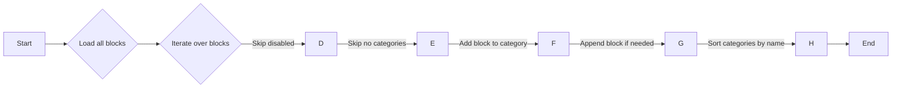

#### 带注释源码

```python
def get_block_categories(category_blocks: int = 3) -> list[BlockCategoryResponse]:
    categories: dict[BlockCategory, BlockCategoryResponse] = {}

    for block_type in load_all_blocks().values():
        block: AnyBlockSchema = block_type()
        # Skip disabled blocks
        if block.disabled:
            continue
        # Skip blocks that don't have categories (all should have at least one)
        if not block.categories:
            continue

        # Add block to the categories
        for category in block.categories:
            if category not in categories:
                categories[category] = BlockCategoryResponse(
                    name=category.name.lower(),
                    total_blocks=0,
                    blocks=[],
                )

            categories[category].total_blocks += 1

            # Append if the category has less than the specified number of blocks
            if len(categories[category].blocks) < category_blocks:
                categories[category].blocks.append(block.get_info())

    # Sort categories by name
    return sorted(categories.values(), key=lambda x: x.name)
```


### `get_blocks`

Get blocks based on either category, type or provider.

参数：

- `category`：`str | None`，The category of the blocks to fetch.
- `type`：`BlockType | None`，The type of the blocks to fetch.
- `provider`：`ProviderName | None`，The provider of the blocks to fetch.
- `page`：`int`，The page number of the results.
- `page_size`：`int`，The number of items per page.

返回值：`BlockResponse`，A response containing the blocks and pagination information.

#### 流程图

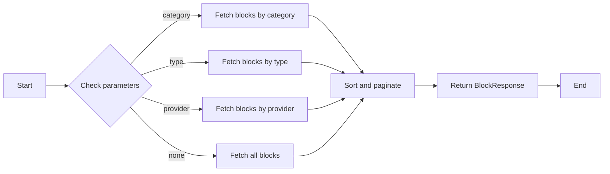

#### 带注释源码

```python
def get_blocks(
    *,
    category: str | None = None,
    type: BlockType | None = None,
    provider: ProviderName | None = None,
    page: int = 1,
    page_size: int = 50,
) -> BlockResponse:
    """
    Get blocks based on either category, type or provider.
    Providing nothing fetches all block types.
    """
    # Only one of category, type, or provider can be specified
    if (category and type) or (category and provider) or (type and provider):
        raise ValueError("Only one of category, type, or provider can be specified")

    blocks: list[AnyBlockSchema] = []
    skip = (page - 1) * page_size
    take = page_size
    total = 0

    for block_type in load_all_blocks().values():
        block: AnyBlockSchema = block_type()
        # Skip disabled blocks
        if block.disabled:
            continue
        # Skip blocks that don't match the category
        if category and category not in {c.name.lower() for c in block.categories}:
            continue
        # Skip blocks that don't match the type
        if (
            (type == "input" and block.block_type.value != "Input")
            or (type == "output" and block.block_type.value != "Output")
            or (type == "action" and block.block_type.value in ("Input", "Output"))
        ):
            continue
        # Skip blocks that don't match the provider
        if provider:
            credentials_info = block.input_schema.get_credentials_fields_info().values()
            if not any(provider in info.provider for info in credentials_info):
                continue

        total += 1
        if skip > 0:
            skip -= 1
            continue
        if take > 0:
            take -= 1
            blocks.append(block)

    return BlockResponse(
        blocks=[b.get_info() for b in blocks],
        pagination=Pagination(
            total_items=total,
            total_pages=(total + page_size - 1) // page_size,
            current_page=page,
            page_size=page_size,
        ),
    )
```


### get_block_by_id

Get a specific block by its ID.

参数：

- `block_id`：`str`，The ID of the block to retrieve.

返回值：`BlockInfo | None`，The `BlockInfo` object of the block if found, otherwise `None`.

#### 流程图

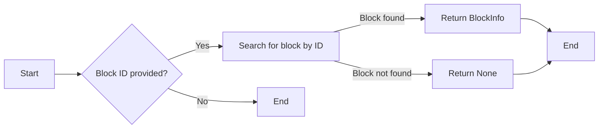

#### 带注释源码

```python
def get_block_by_id(block_id: str) -> BlockInfo | None:
    """
    Get a specific block by its ID.
    """
    for block_type in load_all_blocks().values():
        block: AnyBlockSchema = block_type()
        if block.id == block_id:
            return block.get_info()
    return None
```


### update_search

Upsert a search request for the user and return the search ID.

参数：

- `user_id`：`str`，The unique identifier for the user.
- `search`：`SearchEntry`，The search request containing the search query, filter, and by creator information.

返回值：`str`，The search ID of the upserted search request.

#### 流程图

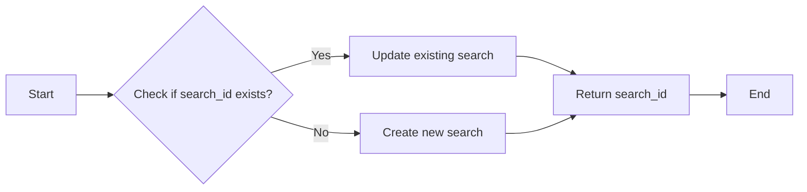

#### 带注释源码

```python
async def update_search(user_id: str, search: SearchEntry) -> str:
    """
    Upsert a search request for the user and return the search ID.
    """
    if search.search_id:
        # Update existing search
        await prisma.models.BuilderSearchHistory.prisma().update(
            where={
                "id": search.search_id,
            },
            data={
                "searchQuery": search.search_query or "",
                "filter": search.filter or [],  # type: ignore
                "byCreator": search.by_creator or [],
            },
        )
        return search.search_id
    else:
        # Create new search
        new_search = await prisma.models.BuilderSearchHistory.prisma().create(
            data={
                "userId": user_id,
                "searchQuery": search.search_query or "",
                "filter": search.filter or [],  # type: ignore
                "byCreator": search.by_creator or [],
            }
        )
        return new_search.id
```


### `get_recent_searches`

Get the user's most recent search requests.

参数：

- `user_id`：`str`，The ID of the user for whom to retrieve recent searches.
- `limit`：`int`，The maximum number of recent searches to retrieve. Defaults to 5.

返回值：`list[SearchEntry]`，A list of `SearchEntry` objects representing the user's most recent search requests.

#### 流程图

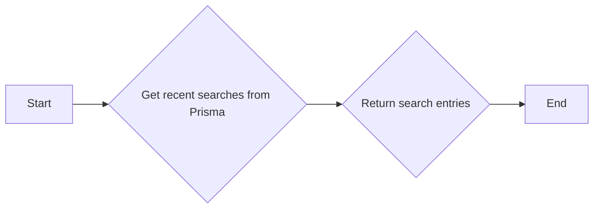

#### 带注释源码

```python
async def get_recent_searches(user_id: str, limit: int = 5) -> list[SearchEntry]:
    """
    Get the user's most recent search requests.
    """
    searches = await prisma.models.BuilderSearchHistory.prisma().find_many(
        where={
            "userId": user_id,
        },
        order={
            "updatedAt": "desc",
        },
        take=limit,
    )
    return [
        SearchEntry(
            search_query=s.searchQuery,
            filter=s.filter,  # type: ignore
            by_creator=s.byCreator,
            search_id=s.id,
        )
        for s in searches
    ]
```


### `get_sorted_search_results`

This function retrieves and sorts search results based on user preferences and search criteria.

参数：

- `user_id`: `str`，The unique identifier for the user performing the search.
- `search_query`: `str | None`，The search query string provided by the user.
- `filters`: `Sequence[FilterType]`，The list of filters to apply to the search results.
- `by_creator`: `Sequence[str] | None`，The list of creators to filter the search results by.

返回值：`_SearchCacheEntry`，A cache entry containing the sorted search results and the total number of items for each filter type.

#### 流程图

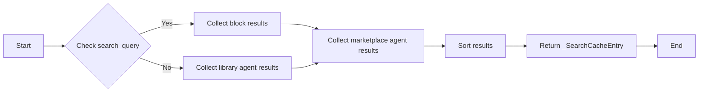

#### 带注释源码

```python
async def get_sorted_search_results(
    *,
    user_id: str,
    search_query: str | None,
    filters: Sequence[FilterType],
    by_creator: Sequence[str] | None = None,
) -> _SearchCacheEntry:
    normalized_filters: tuple[FilterType, ...] = tuple(sorted(set(filters or [])))
    normalized_creators: tuple[str, ...] = tuple(sorted(set(by_creator or [])))
    return await _build_cached_search_results(
        user_id=user_id,
        search_query=search_query or "",
        filters=normalized_filters,
        by_creator=normalized_creators,
    )
```


### `_build_cached_search_results`

#### 描述

该函数负责构建缓存的搜索结果。它根据用户ID、搜索查询、过滤器以及创作者信息，从库代理、市场代理和块中收集相关项目，并计算它们的分数。然后，它将这些项目排序并返回一个包含项目列表和项目总数的缓存条目。

#### 参数

- `user_id`: `str`，用户的唯一标识符。
- `search_query`: `str`，搜索查询字符串。
- `filters`: `tuple[FilterType, ...]`，搜索过滤器类型。
- `by_creator`: `tuple[str, ...]`，创作者ID列表。

#### 返回值

- `_SearchCacheEntry`，包含搜索结果项列表和项目总数的缓存条目。

#### 流程图

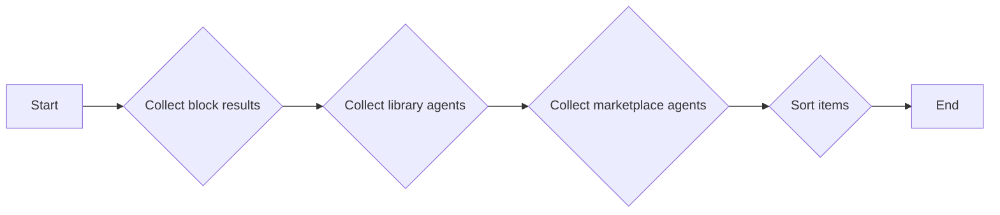

#### 带注释源码

```python
@cached(ttl_seconds=300, shared_cache=True)
async def _build_cached_search_results(
    user_id: str,
    search_query: str,
    filters: tuple[FilterType, ...],
    by_creator: tuple[str, ...],
) -> _SearchCacheEntry:
    normalized_query = (search_query or "").strip().lower()

    include_blocks = "blocks" in filters
    include_integrations = "integrations" in filters
    include_library_agents = "my_agents" in filters
    include_marketplace_agents = "marketplace_agents" in filters

    scored_items: list[_ScoredItem] = []
    total_items: dict[FilterType, int] = {
        "blocks": 0,
        "integrations": 0,
        "marketplace_agents": 0,
        "my_agents": 0,
    }

    block_results, block_total, integration_total = _collect_block_results(
        normalized_query=normalized_query,
        include_blocks=include_blocks,
        include_integrations=include_integrations,
    )
    scored_items.extend(block_results)
    total_items["blocks"] = block_total
    total_items["integrations"] = integration_total

    if include_library_agents:
        library_response = await library_db.list_library_agents(
            user_id=user_id,
            search_term=search_query or None,
            page=1,
            page_size=MAX_LIBRARY_AGENT_RESULTS,
        )
        total_items["my_agents"] = library_response.pagination.total_items
        scored_items.extend(
            _build_library_items(
                agents=library_response.agents,
                normalized_query=normalized_query,
            )
        )

    if include_marketplace_agents:
        marketplace_response = await store_db.get_store_agents(
            creators=list(by_creator) or None,
            search_query=search_query or None,
            page=1,
            page_size=MAX_MARKETPLACE_AGENT_RESULTS,
        )
        total_items["marketplace_agents"] = marketplace_response.pagination.total_items
        scored_items.extend(
            _build_marketplace_items(
                agents=marketplace_response.agents,
                normalized_query=normalized_query,
            )
        )

    sorted_items = sorted(
        scored_items,
        key=lambda entry: (-entry.score, entry.sort_key, entry.filter_type),
    )

    return _SearchCacheEntry(
        items=[entry.item for entry in sorted_items],
        total_items=total_items,
    )
```

### _collect_block_results

#### 描述

该函数用于收集与搜索查询相关的块结果，包括块和集成。

#### 参数

- `normalized_query`：`str`，搜索查询的标准化版本。
- `include_blocks`：`bool`，是否包含块。
- `include_integrations`：`bool`，是否包含集成。

#### 返回值

- `tuple[list[_ScoredItem], int, int]`，包含以下元素：
  - `list[_ScoredItem]`：搜索结果列表。
  - `int`：块的总数。
  - `int`：集成总数。

#### 流程图

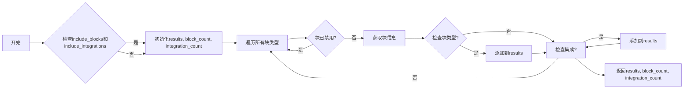

#### 带注释源码

```python
def _collect_block_results(
    *,
    normalized_query: str,
    include_blocks: bool,
    include_integrations: bool,
) -> tuple[list[_ScoredItem], int, int]:
    results: list[_ScoredItem] = []
    block_count = 0
    integration_count = 0

    if not include_blocks and not include_integrations:
        return results, block_count, integration_count

    for block_type in load_all_blocks().values():
        block: AnyBlockSchema = block_type()
        if block.disabled:
            continue

        block_info = block.get_info()
        credentials = list(block.input_schema.get_credentials_fields().values())
        is_integration = len(credentials) > 0

        if is_integration and not include_integrations:
            continue
        if not is_integration and not include_blocks:
            continue

        score = _score_block(block, block_info, normalized_query)
        if not _should_include_item(score, normalized_query):
            continue

        filter_type: FilterType = "integrations" if is_integration else "blocks"
        if is_integration:
            integration_count += 1
        else:
            block_count += 1

        results.append(
            _ScoredItem(
                item=block_info,
                filter_type=filter_type,
                score=score,
                sort_key=_get_item_name(block_info),
            )
        )

    return results, block_count, integration_count
```

### `_build_library_items`

#### 描述

该函数用于构建图书馆项目的项目项列表。它接收图书馆代理列表和查询字符串，然后根据查询字符串对代理进行评分，并返回评分后的项目列表。

#### 参数

- `agents`：`list[library_model.LibraryAgent]`，图书馆代理列表。
- `normalized_query`：`str`，标准化后的查询字符串。

#### 返回值

- `list[_ScoredItem]`，评分后的项目列表。

#### 流程图

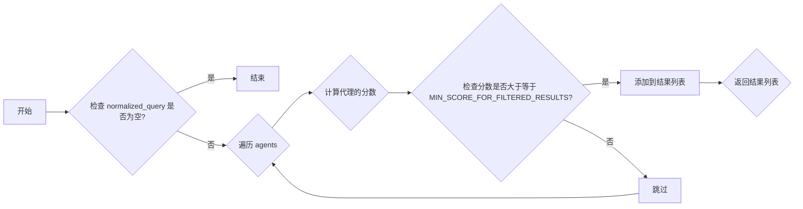

#### 带注释源码

```python
def _build_library_items(
    *,
    agents: list[library_model.LibraryAgent],
    normalized_query: str,
) -> list[_ScoredItem]:
    results: list[_ScoredItem] = []

    for agent in agents:
        score = _score_library_agent(agent, normalized_query)
        if not _should_include_item(score, normalized_query):
            continue

        results.append(
            _ScoredItem(
                item=agent,
                filter_type="my_agents",
                score=score,
                sort_key=_get_item_name(agent),
            )
        )

    return results
```

### _build_marketplace_items

#### 描述

该函数用于构建市场代理项的列表。它接收市场代理列表和查询字符串，然后根据查询字符串对代理进行评分，并返回一个包含评分项的列表。

#### 参数

- `agents`：`list[store_model.StoreAgent]`，市场代理列表。
- `normalized_query`：`str`，标准化后的查询字符串。

#### 返回值

- `list[_ScoredItem]`，包含评分项的列表。

#### 流程图

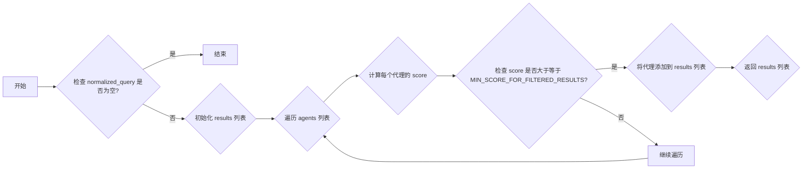

#### 带注释源码

```python
def _build_marketplace_items(
    *,
    agents: list[store_model.StoreAgent],
    normalized_query: str,
) -> list[_ScoredItem]:
    results: list[_ScoredItem] = []

    for agent in agents:
        score = _score_store_agent(agent, normalized_query)
        if not _should_include_item(score, normalized_query):
            continue

        results.append(
            _ScoredItem(
                item=agent,
                filter_type="marketplace_agents",
                score=score,
                sort_key=_get_item_name(agent),
            )
        )

    return results
```


### get_providers

This function retrieves a list of providers based on a search query and pagination parameters.

参数：

- `query`：`str`，The search query to filter providers by name or description.
- `page`：`int`，The page number of the results to retrieve.
- `page_size`：`int`，The number of providers to retrieve per page.

返回值：`ProviderResponse`，A response object containing the list of providers and pagination information.

#### 流程图

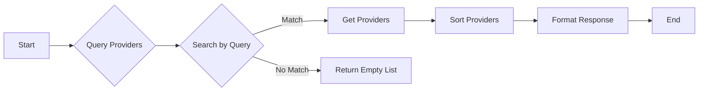

#### 带注释源码

```python
def get_providers(
    query: str = "",
    page: int = 1,
    page_size: int = 50,
) -> ProviderResponse:
    providers = []
    query = query.lower()

    skip = (page - 1) * page_size
    take = page_size

    all_providers = _get_all_providers()

    for provider in all_providers.values():
        if (
            query not in provider.name.value.lower()
            and query not in provider.description.lower()
        ):
            continue
        if skip > 0:
            skip -= 1
            continue
        if take > 0:
            take -= 1
            providers.append(provider)

    total = len(all_providers)

    return ProviderResponse(
        providers=providers,
        pagination=Pagination(
            total_items=total,
            total_pages=(total + page_size - 1) // page_size,
            current_page=page,
            page_size=page_size,
        ),
    )
```


### get_counts

Get counts of various elements such as blocks, integrations, and marketplace agents.

参数：

-  `user_id`：`str`，The user ID for which to get the counts.
-  ...

返回值：`CountResponse`，A response object containing the counts of various elements.

#### 流程图

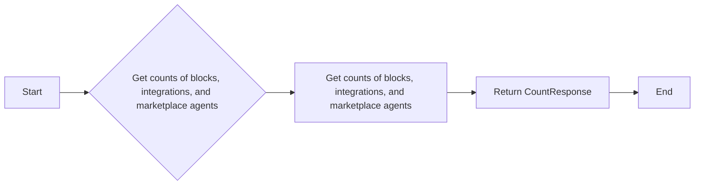

#### 带注释源码

```python
async def get_counts(user_id: str) -> CountResponse:
    my_agents = await prisma.models.LibraryAgent.prisma().count(
        where={
            "userId": user_id,
            "isDeleted": False,
            "isArchived": False,
        }
    )
    counts = await _get_static_counts()
    return CountResponse(
        my_agents=my_agents,
        **counts,
    )
```


### `_get_static_counts`

#### 描述

获取块、集成和市场代理的计数。此函数将结果缓存以避免不必要的数据库查询和计算。

#### 参数

- 无

#### 返回值

- `CountResponse`，包含块、集成和市场代理的计数。

#### 流程图

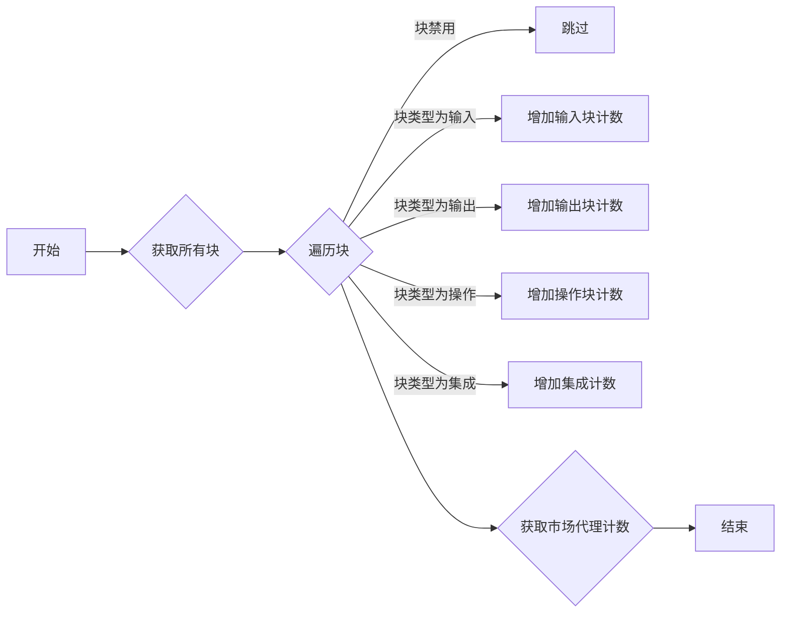

#### 带注释源码

```python
@cached(ttl_seconds=3600)
async def _get_static_counts():
    """
    Get counts of blocks, integrations, and marketplace agents.
    This is cached to avoid unnecessary database queries and calculations.
    """
    all_blocks = 0
    input_blocks = 0
    action_blocks = 0
    output_blocks = 0
    integrations = 0

    for block_type in load_all_blocks().values():
        block: AnyBlockSchema = block_type()
        if block.disabled:
            continue

        all_blocks += 1

        if block.block_type.value == "Input":
            input_blocks += 1
        elif block.block_type.value == "Output":
            output_blocks += 1
        else:
            action_blocks += 1

        credentials = list(block.input_schema.get_credentials_fields().values())
        if len(credentials) > 0:
            integrations += 1

    marketplace_agents = await prisma.models.StoreAgent.prisma().count()

    return {
        "all_blocks": all_blocks,
        "input_blocks": input_blocks,
        "action_blocks": action_blocks,
        "output_blocks": output_blocks,
        "integrations": integrations,
        "marketplace_agents": marketplace_agents,
    }
```

### _matches_llm_model

This function checks if the given schema class has any field annotated with `LlmModel` and if the query string contains any value from the `llm_models` list.

#### 参数

- `schema_cls`：`type[BlockSchema]`，The schema class to check.
- `query`：`str`，The query string to match against the `llm_models`.

#### 返回值

- `bool`，`True` if the query matches any value in `llm_models`, otherwise `False`.

#### 流程图

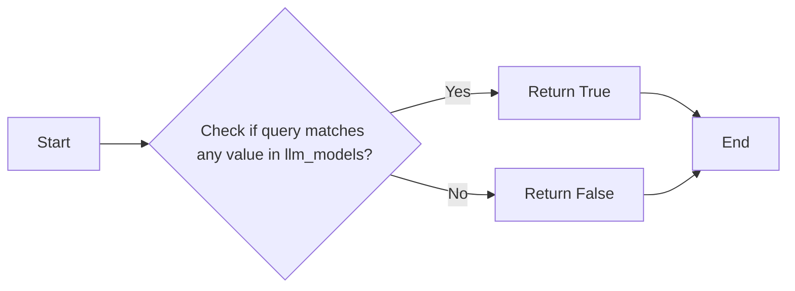

#### 带注释源码

```python
def _matches_llm_model(schema_cls: type[BlockSchema], query: str) -> bool:
    for field in schema_cls.model_fields.values():
        if field.annotation == LlmModel:
            # Check if query matches any value in llm_models
            if any(query in name for name in llm_models):
                return True
    return False
```

### _score_block

#### 描述

该函数用于计算给定块（Block）的得分，基于其名称、描述、类别和提供者等信息与搜索查询的相似度。

#### 参数

- `block`：`AnyBlockSchema`，表示要评分的块对象。
- `block_info`：`BlockInfo`，表示块的详细信息。
- `normalized_query`：`str`，表示标准化后的搜索查询。

#### 返回值

- `float`，表示块的得分。

#### 流程图

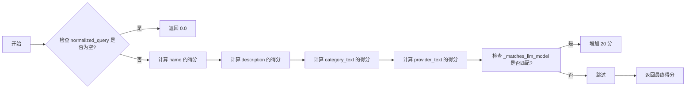

#### 带注释源码

```python
def _score_block(
    block: AnyBlockSchema,
    block_info: BlockInfo,
    normalized_query: str,
) -> float:
    if not normalized_query:
        return 0.0

    name = block_info.name.lower()
    description = block_info.description.lower()
    score = _score_primary_fields(name, description, normalized_query)

    category_text = " ".join(
        category.get("category", "").lower() for category in block_info.categories
    )
    score += _score_additional_field(category_text, normalized_query, 12, 6)

    credentials_info = block.input_schema.get_credentials_fields_info().values()
    provider_names = [
        provider.value.lower()
        for info in credentials_info
        for provider in info.provider
    ]
    provider_text = " ".join(provider_names)
    score += _score_additional_field(provider_text, normalized_query, 15, 6)

    if _matches_llm_model(block.input_schema, normalized_query):
        score += 20

    return score
```

### _score_library_agent

该函数用于计算图书馆代理的得分。

参数：

- `agent`：`library_model.LibraryAgent`，图书馆代理对象，包含代理的名称、描述、指令和创建者名称。

返回值：`float`，图书馆代理的得分。

#### 流程图

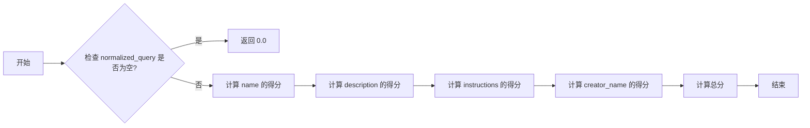

#### 带注释源码

```python
def _score_library_agent(
    agent: library_model.LibraryAgent,
    normalized_query: str,
) -> float:
    if not normalized_query:
        return 0.0

    name = agent.name.lower()
    description = (agent.description or "").lower()
    instructions = (agent.instructions or "").lower()

    score = _score_primary_fields(name, description, normalized_query)
    score += _score_additional_field(instructions, normalized_query, 15, 6)
    score += _score_additional_field(
        agent.creator_name.lower(), normalized_query, 10, 5
    )

    return score
```

### _score_store_agent

该函数用于计算市场代理的得分，基于代理的名称、描述和子标题与查询的相似度。

#### 参数

- `agent`：`store_model.StoreAgent`，市场代理对象。
- `normalized_query`：`str`，标准化后的查询字符串。

#### 返回值

- `float`，市场代理的得分。

#### 流程图

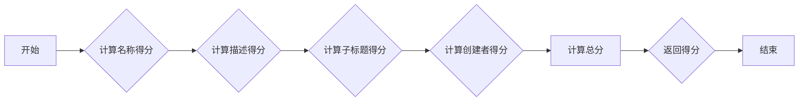

#### 带注释源码

```python
def _score_store_agent(
    agent: store_model.StoreAgent,
    normalized_query: str,
) -> float:
    if not normalized_query:
        return 0.0

    name = agent.agent_name.lower()
    description = agent.description.lower()
    sub_heading = agent.sub_heading.lower()

    score = _score_primary_fields(name, description, normalized_query)
    score += _score_additional_field(sub_heading, normalized_query, 12, 6)
    score += _score_additional_field(agent.creator.lower(), normalized_query, 10, 5)

    return score
```

### _score_block

该函数用于计算给定块的得分，基于其名称、描述和其他属性与搜索查询的相似度。

#### 参数

- `block`：`AnyBlockSchema`，当前块的对象。
- `block_info`：`BlockInfo`，当前块的详细信息。
- `normalized_query`：`str`，标准化后的搜索查询。

#### 返回值

- `float`，块的得分。

#### 流程图

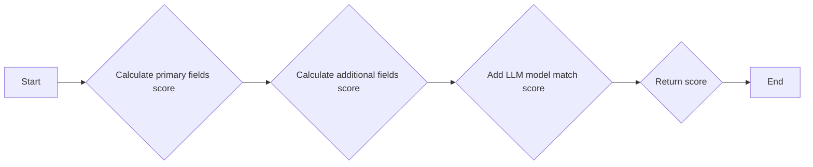

#### 带注释源码

```python
def _score_block(
    block: AnyBlockSchema,
    block_info: BlockInfo,
    normalized_query: str,
) -> float:
    if not normalized_query:
        return 0.0

    name = block_info.name.lower()
    description = block_info.description.lower()
    score = _score_primary_fields(name, description, normalized_query)

    category_text = " ".join(
        category.get("category", "").lower() for category in block_info.categories
    )
    score += _score_additional_field(category_text, normalized_query, 12, 6)

    credentials_info = block.input_schema.get_credentials_fields_info().values()
    provider_names = [
        provider.value.lower()
        for info in credentials_info
        for provider in info.provider
    ]
    provider_text = " ".join(provider_names)
    score += _score_additional_field(provider_text, normalized_query, 15, 6)

    if _matches_llm_model(block.input_schema, normalized_query):
        score += 20

    return score
```

### _score_block

该函数用于计算给定块的得分，基于其名称、描述、类别和提供者等信息与搜索查询的相似度。

#### 参数

- `block`：`AnyBlockSchema`，当前块的信息。
- `block_info`：`BlockInfo`，当前块的详细信息。
- `normalized_query`：`str`，标准化后的搜索查询。

#### 返回值

- `float`，块的得分。

#### 流程图

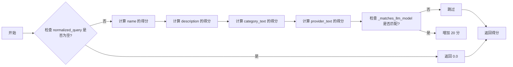

#### 带注释源码

```python
def _score_block(
    block: AnyBlockSchema,
    block_info: BlockInfo,
    normalized_query: str,
) -> float:
    if not normalized_query:
        return 0.0

    name = block_info.name.lower()
    description = block_info.description.lower()
    score = _score_primary_fields(name, description, normalized_query)

    category_text = " ".join(
        category.get("category", "").lower() for category in block_info.categories
    )
    score += _score_additional_field(category_text, normalized_query, 12, 6)

    credentials_info = block.input_schema.get_credentials_fields_info().values()
    provider_names = [
        provider.value.lower()
        for info in credentials_info
        for provider in info.provider
    ]
    provider_text = " ".join(provider_names)
    score += _score_additional_field(provider_text, normalized_query, 15, 6)

    if _matches_llm_model(block.input_schema, normalized_query):
        score += 20

    return score
```

### _should_include_item

该函数用于决定是否应该包含一个项目（如块、库代理或市场代理）在搜索结果中。

#### 参数

- `score`：`float`，项目的评分。
- `normalized_query`：`str`，标准化后的搜索查询。

#### 返回值

- `bool`，如果项目应该包含在搜索结果中，则返回 `True`，否则返回 `False`。

#### 流程图

```mermaid
graph LR
A[开始] --> B{评分 >= MIN_SCORE_FOR_FILTERED_RESULTS?}
B -- 是 --> C[返回 True]
B -- 否 --> D[返回 False]
C --> E[结束]
D --> E
```

#### 带注释源码

```python
def _should_include_item(score: float, normalized_query: str) -> bool:
    if not normalized_query:
        return True
    return score >= MIN_SCORE_FOR_FILTERED_RESULTS
```

### get_block_categories

获取块类别列表。

参数：

- `category_blocks`：`int`，指定每个类别中要包含的块的数量。

返回值：`list[BlockCategoryResponse]`，包含块类别的列表。

#### 流程图

```mermaid
graph LR
A[开始] --> B{加载所有块}
B --> C{遍历块}
C --> D{块已禁用?}
D -- 是 --> C
D -- 否 --> E{块有类别?}
E -- 否 --> C
E -- 是 --> F{类别不在列表中?}
F -- 是 --> G{添加类别}
F -- 否 --> H{增加块数量}
H --> I{块数量小于category_blocks?}
I -- 是 --> J{添加块信息}
I -- 否 --> C
J --> C
G --> C
C --> K{结束}
```

#### 带注释源码

```python
def get_block_categories(category_blocks: int = 3) -> list[BlockCategoryResponse]:
    categories: dict[BlockCategory, BlockCategoryResponse] = {}

    for block_type in load_all_blocks().values():
        block: AnyBlockSchema = block_type()
        # Skip disabled blocks
        if block.disabled:
            continue
        # Skip blocks that don't have categories (all should have at least one)
        if not block.categories:
            continue

        # Add block to the categories
        for category in block.categories:
            if category not in categories:
                categories[category] = BlockCategoryResponse(
                    name=category.name.lower(),
                    total_blocks=0,
                    blocks=[],
                )

            categories[category].total_blocks += 1

            # Append if the category has less than the specified number of blocks
            if len(categories[category].blocks) < category_blocks:
                categories[category].blocks.append(block.get_info())

    # Sort categories by name
    return sorted(categories.values(), key=lambda x: x.name)
```

### get_providers

This function retrieves a list of providers based on a search query, page number, and page size. It returns a `ProviderResponse` object containing the providers and pagination information.

参数：

- `query`：`str`，The search query to filter providers by name or description.
- `page`：`int`，The page number to retrieve.
- `page_size`：`int`，The number of providers to retrieve per page.

返回值：`ProviderResponse`，A response object containing the providers and pagination information.

#### 流程图

```mermaid
graph LR
A[Start] --> B{Query Providers}
B --> C{Search by Query}
C --> D{Get Providers}
D --> E[End]
```

#### 带注释源码

```python
def get_providers(
    query: str = "",
    page: int = 1,
    page_size: int = 50,
) -> ProviderResponse:
    providers = []
    query = query.lower()

    skip = (page - 1) * page_size
    take = page_size

    all_providers = _get_all_providers()

    for provider in all_providers.values():
        if (
            query not in provider.name.value.lower()
            and query not in provider.description.lower()
        ):
            continue
        if skip > 0:
            skip -= 1
            continue
        if take > 0:
            take -= 1
            providers.append(provider)

    total = len(all_providers)

    return ProviderResponse(
        providers=providers,
        pagination=Pagination(
            total_items=total,
            total_pages=(total + page_size - 1) // page_size,
            current_page=page,
            page_size=page_size,
        ),
    )
```


### `get_suggested_blocks`

Get the top blocks based on the number of executions in the last 30 days.

参数：

- `count`：`int`，The number of top blocks to return. Default is 5.

返回值：`list[BlockInfo]`，A list of BlockInfo objects representing the top blocks.

#### 流程图

```mermaid
graph LR
A[Start] --> B{Calculate timestamp threshold}
B --> C{Query execution counts}
C --> D{Sort blocks by execution count}
D --> E{Return top blocks}
E --> F[End]
```

#### 带注释源码

```python
@cached(ttl_seconds=3600)
async def get_suggested_blocks(count: int = 5) -> list[BlockInfo]:
    suggested_blocks = []
    # Sum the number of executions for each block type
    # Prisma cannot group by nested relations, so we do a raw query
    # Calculate the cutoff timestamp
    timestamp_threshold = datetime.now(timezone.utc) - timedelta(days=30)

    results = await query_raw_with_schema(
        """
        SELECT
            agent_node."agentBlockId" AS block_id,
            COUNT(execution.id) AS execution_count
        FROM {schema_prefix}"AgentNodeExecution" execution
        JOIN {schema_prefix}"AgentNode" agent_node ON execution."agentNodeId" = agent_node.id
        WHERE execution."endedTime" >= $1::timestamp
        GROUP BY agent_node."agentBlockId"
        ORDER BY execution_count DESC;
        """,
        timestamp_threshold,
    )

    # Get the top blocks based on execution count
    # But ignore Input and Output blocks
    blocks: list[tuple[BlockInfo, int]] = []

    for block_type in load_all_blocks().values():
        block: AnyBlockSchema = block_type()
        if block.disabled or block.block_type in (
            backend.data.block.BlockType.INPUT,
            backend.data.block.BlockType.OUTPUT,
            backend.data.block.BlockType.AGENT,
        ):
            continue
        # Find the execution count for this block
        execution_count = next(
            (row["execution_count"] for row in results if row["block_id"] == block.id),
            0,
        )
        blocks.append((block.get_info(), execution_count))
    # Sort blocks by execution count
    blocks.sort(key=lambda x: x[1], reverse=True)

    suggested_blocks = [block[0] for block in blocks]

    # Return the top blocks
    return suggested_blocks[:count]
``` 


## 关键组件


### 张量索引与惰性加载

张量索引与惰性加载是代码中用于高效处理大型数据集的关键组件。它们允许在需要时才加载数据，从而减少内存消耗并提高性能。

### 反量化支持

反量化支持是代码中用于处理量化数据的关键组件。它允许对量化数据进行反量化处理，以便进行进一步的分析或操作。

### 量化策略

量化策略是代码中用于优化数据表示和处理的组件。它通过减少数据精度来减少内存消耗和计算时间，同时保持足够的精度以满足应用需求。


## 问题及建议


### 已知问题

-   **全局变量和函数依赖**: 代码中存在多个全局变量和函数，如 `load_all_blocks`、`_get_all_providers` 和 `_get_static_counts`，这些函数和变量可能需要外部依赖或配置，但代码中并未明确说明这些依赖的来源和配置方式。
-   **数据库操作**: 代码中使用了 Prisma ORM 进行数据库操作，但未提供数据库连接配置和错误处理机制，这可能导致数据库连接问题或数据不一致。
-   **缓存策略**: 代码中使用了缓存来提高性能，但缓存策略可能需要根据实际情况进行调整，例如缓存过期时间、缓存失效机制等。
-   **代码重复**: 代码中存在一些重复的代码片段，例如 `_score_block`、`_score_library_agent` 和 `_score_store_agent` 函数，这可能导致维护成本增加。
-   **异常处理**: 代码中缺少异常处理机制，例如数据库查询失败、网络请求失败等，这可能导致程序崩溃或无法恢复。

### 优化建议

-   **明确依赖和配置**: 在代码中明确说明全局变量和函数的依赖来源和配置方式，例如数据库连接配置、缓存配置等。
-   **数据库操作优化**: 实现数据库连接池和错误处理机制，确保数据库操作的稳定性和数据一致性。
-   **缓存策略优化**: 根据实际情况调整缓存策略，例如缓存过期时间、缓存失效机制等，以提高性能和降低资源消耗。
-   **代码重构**: 对重复的代码进行重构，减少代码冗余，提高代码可维护性。
-   **异常处理**: 实现异常处理机制，确保程序在遇到错误时能够优雅地处理，并提供相应的错误信息。


## 其它


### 设计目标与约束

- 设计目标：
  - 提供一个模块化的代码结构，以便于维护和扩展。
  - 实现高效的数据检索和搜索功能，以支持大量数据。
  - 确保代码的可读性和可维护性。
  - 遵循最佳实践，如代码复用、异常处理和日志记录。

- 约束：
  - 代码必须与现有的数据库和API兼容。
  - 代码必须支持多用户并发访问。
  - 代码必须满足性能要求，如响应时间和吞吐量。
  - 代码必须遵循安全最佳实践，如数据加密和访问控制。

### 错误处理与异常设计

- 错误处理：
  - 使用try-except块捕获和处理可能发生的异常。
  - 定义自定义异常类，以便于更好地描述错误情况。
  - 在日志中记录错误信息，以便于调试和监控。

- 异常设计：
  - 异常设计应遵循PEP 8指南。
  - 异常应具有明确的名称和描述。
  - 异常应提供足够的信息，以便于开发者诊断问题。

### 数据流与状态机

- 数据流：
  - 数据流应遵循单一职责原则。
  - 数据流应清晰，易于理解。
  - 数据流应支持数据验证和转换。

- 状态机：
  - 状态机应描述系统的不同状态和转换条件。
  - 状态机应支持状态持久化和恢复。

### 外部依赖与接口契约

- 外部依赖：
  - 列出所有外部依赖项，如数据库、API和服务。
  - 描述每个依赖项的版本和配置。

- 接口契约：
  - 定义每个接口的输入和输出参数。
  - 描述接口的预期行为和错误处理。
  - 提供接口的示例代码和测试用例。

    