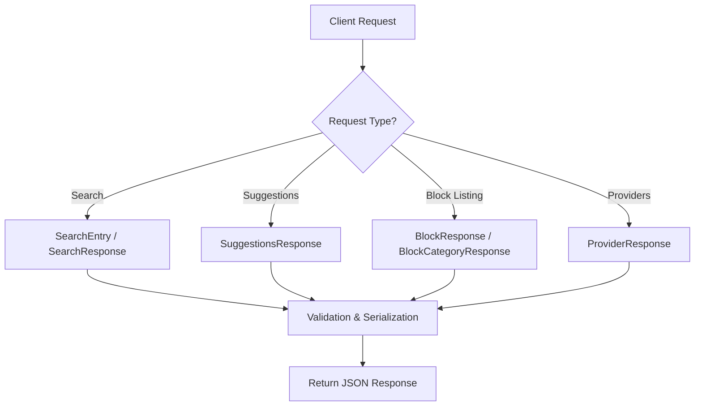

# `AutoGPT\autogpt_platform\backend\backend\api\features\builder\model.py` 详细设计文档

该文件主要定义了用于搜索功能、建议系统、模块分类及集成管理的一组 Pydantic 数据模型，用于规范 API 请求与响应的数据结构。

## 整体流程



## 类结构

```
BaseModel (pydantic)
├── SearchEntry
├── SuggestionsResponse
├── BlockCategoryResponse
├── BlockResponse
├── Provider
├── ProviderResponse
├── SearchResponse
└── CountResponse
```

## 全局变量及字段


### `FilterType`
    
定义搜索过滤器类型的字面量，包含块、集成、市场代理和我的代理。

类型：`Literal["blocks", "integrations", "marketplace_agents", "my_agents"]`
    


### `BlockType`
    
定义块类别的字面量，包含全部、输入、动作和输出。

类型：`Literal["all", "input", "action", "output"]`
    


### `SearchEntry.search_query`
    
用户输入的搜索查询字符串。

类型：`str | None`
    


### `SearchEntry.filter`
    
用于限制搜索范围的过滤器类型列表。

类型：`list[FilterType] | None`
    


### `SearchEntry.by_creator`
    
用于筛选特定作者作品的创建者名称列表。

类型：`list[str] | None`
    


### `SearchEntry.search_id`
    
用于标识和追踪特定搜索会话的唯一ID。

类型：`str | None`
    


### `SuggestionsResponse.otto_suggestions`
    
由助手 Otto 生成的建议查询字符串列表。

类型：`list[str]`
    


### `SuggestionsResponse.recent_searches`
    
用户最近执行的搜索条目历史记录。

类型：`list[SearchEntry]`
    


### `SuggestionsResponse.providers`
    
可用的集成服务提供商名称列表。

类型：`list[ProviderName]`
    


### `SuggestionsResponse.top_blocks`
    
热门或推荐的块信息列表。

类型：`list[BlockInfo]`
    


### `BlockCategoryResponse.name`
    
块类别的名称。

类型：`str`
    


### `BlockCategoryResponse.total_blocks`
    
该类别下的块总数。

类型：`int`
    


### `BlockCategoryResponse.blocks`
    
属于该类别的块详细信息列表。

类型：`list[BlockInfo]`
    


### `BlockCategoryResponse.model_config`
    
Pydantic 模型配置，指定枚举值等行为。

类型：`dict`
    


### `BlockResponse.blocks`
    
块信息的列表，通常用于分页展示。

类型：`list[BlockInfo]`
    


### `BlockResponse.pagination`
    
包含分页元数据（如当前页、总页数）的对象。

类型：`Pagination`
    


### `Provider.name`
    
集成服务提供商的名称。

类型：`ProviderName`
    


### `Provider.description`
    
集成服务提供商的描述文本。

类型：`str`
    


### `Provider.integration_count`
    
该提供商拥有的集成数量。

类型：`int`
    


### `ProviderResponse.providers`
    
提供商对象的列表。

类型：`list[Provider]`
    


### `ProviderResponse.pagination`
    
包含分页元数据的对象。

类型：`Pagination`
    


### `SearchResponse.items`
    
搜索结果项的列表，包含块、库代理或商店代理。

类型：`list[BlockInfo | LibraryAgent | StoreAgent]`
    


### `SearchResponse.search_id`
    
对应此次搜索请求的唯一标识符。

类型：`str`
    


### `SearchResponse.total_items`
    
按过滤器类型分类的搜索结果总数统计。

类型：`dict[FilterType, int]`
    


### `SearchResponse.pagination`
    
包含搜索结果分页元数据的对象。

类型：`Pagination`
    


### `CountResponse.all_blocks`
    
系统中所有块的总数。

类型：`int`
    


### `CountResponse.input_blocks`
    
输入类型块的数量。

类型：`int`
    


### `CountResponse.action_blocks`
    
动作类型块的数量。

类型：`int`
    


### `CountResponse.output_blocks`
    
输出类型块的数量。

类型：`int`
    


### `CountResponse.integrations`
    
可用集成的总数。

类型：`int`
    


### `CountResponse.marketplace_agents`
    
市场中可用代理的数量。

类型：`int`
    


### `CountResponse.my_agents`
    
当前用户拥有的代理数量。

类型：`int`
    
    

## 全局函数及方法


## 关键组件


### 搜索与发现组件
管理与用户搜索交互相关的数据模型，包括查询参数、搜索建议（自动完成）、最近搜索历史记录以及跨区块、集成和代理的多类型搜索结果的聚合。

### 区块管理组件
表示核心区块系统的数据结构，定义区块类型（输入、动作、输出）、分类响应格式以及处理区块列表的分页逻辑。

### 提供商集成组件
处理与外部服务提供商相关联的数据，标准化提供商元数据、描述及其分页列表的输出格式。

### 系统统计组件
用于报告系统中各可用资源（例如输入/输出/动作区块、集成以及市场/私有代理）数量的结构，以支持仪表盘和统计显示。


## 问题及建议


### 已知问题

-   **类型反序列化歧义风险**：`SearchResponse` 中的 `items` 字段使用了联合类型 `BlockInfo | library_model.LibraryAgent | store_model.StoreAgent`。在没有显式鉴别器的情况下，Pydantic 在反序列化时需要按顺序尝试匹配，如果不同模型之间存在字段重叠，可能导致解析错误或性能下降。
-   **数据结构定义不一致**：`CountResponse` 类中硬编码了具体的统计字段（如 `all_blocks`, `input_blocks` 等），而 `FilterType` 中定义的筛选类型是 `blocks`。这种粒度的不一致（一个是汇总的 "blocks"，一个是细分的 "input/action/output"）会导致前端对接时的逻辑映射困难，且扩展性差。
-   **高耦合的模型依赖**：该文件直接导入了具体的业务模型（`library_model.LibraryAgent`, `store_model.StoreAgent`）。这使得搜索 API 的数据契约与底层业务模型的实现细节强绑定，一旦内部模型结构变更，API 接口将直接受到影响，违反了解耦原则。
-   **输入验证缺失**：`SearchEntry` 模型中的字段（如 `search_query`, `filter`）均为可选且默认为 `None`。缺乏字段间的组合校验（例如：是否允许 `search_query` 和 `filter` 同时为空？），这可能将无效的查询请求传递到业务逻辑层，增加不必要的处理开销。

### 优化建议

-   **引入类型鉴别器**：对于 `SearchResponse.items`，建议在 `BlockInfo`、`LibraryAgent` 等模型中增加统一的 `type` 或 `discriminator` 字段，并在 Pydantic 模型中使用 `Field(discriminator='type')` 来明确指定类型判定逻辑，提高解析的准确性和效率。
-   **使用 DTO 解耦 API 层**：不要直接返回内部业务模型。建议定义专门的 API 响应 DTO（Data Transfer Object），将 `BlockInfo`、`LibraryAgent` 等内部对象映射为统一的搜索结果视图。这样可以在不破坏 API 契约的情况下自由修改内部业务逻辑。
-   **统一筛选与计数模型**：重新设计 `FilterType` 和 `CountResponse` 的关系。建议使用更通用的字典结构或支持动态枚举的模型来替代硬编码字段，或者将 `FilterType` 的粒度细化以匹配 `CountResponse`，确保前后端数据结构的一致性和可扩展性。
-   **增加 Pydantic 验证器**：在 `SearchEntry` 类中添加 `model_validator` 或 `field_validator`，强制约束至少提供 `search_query` 或 `filter` 中的一个，以在数据入口层拦截无效请求。


## 其它


### 设计目标与约束

1.  **类型安全与数据验证**：利用 `pydantic.BaseModel` 强制执行严格的类型检查，确保 API 请求和响应的数据结构符合预期，减少运行时错误。
2.  **枚举约束**：通过 `typing.Literal` 严格限定 `FilterType` 和 `BlockType` 等字段的取值范围，防止无效的过滤类型传入系统。
3.  **接口一致性**：引入通用的 `Pagination` 模型，确保所有包含列表数据的响应（如 `BlockResponse`, `ProviderResponse`）遵循一致的分页结构，便于前端处理。
4.  **序列化控制**：在 `BlockCategoryResponse` 中显式配置 `model_config = {"use_enum_values": False}`，约束枚举字段在序列化为 JSON 时必须使用枚举名称（例如 "AI"）而非其底层值，保证了 API 契约的稳定性。

### 数据流与状态机

1.  **数据聚合流向**：该模块充当数据聚合层的定义者。数据从不同的子模块（`backend.data.block`, `backend.api.features.library`, `backend.api.features.store`, `backend.integrations.providers`）提取，通过本模块定义的模型统一封装，最终流向客户端。
2.  **请求/响应生命周期**：
    *   **输入阶段**：客户端发起搜索请求，`SearchEntry` 作为数据载体捕获用户的查询参数、过滤条件和创建者信息。
    *   **处理阶段**：后端根据 `SearchEntry` 的参数在不同数据源（块、集成、市场代理等）中进行检索。
    *   **输出阶段**：根据检索类型的不同，后端实例化相应的响应模型（如 `SuggestionsResponse`, `SearchResponse`, `CountResponse`），将异构数据（BlockInfo, LibraryAgent 等）整合在同构的列表或字典中返回。
3.  **状态关联**：`SearchEntry` 和 `SearchResponse` 中包含 `search_id` 字段，用于在无状态或异步的搜索场景下关联特定的搜索会话，但本模块仅负责数据结构定义，不维护具体状态机。

### 外部依赖与接口契约

1.  **`pydantic`**：核心依赖，提供 `BaseModel` 基类和数据验证逻辑。系统依赖其版本行为（特别是 V2 的 `model_config` 语法）。
2.  **`backend.api.features.library.model`**：依赖 `LibraryAgent` 类。契约规定该类必须是一个可被 Pydantic 验证的对象，用于在搜索结果中代表“我的代理”或“库代理”。
3.  **`backend.api.features.store.model`**：依赖 `StoreAgent` 类。契约规定该类用于在搜索结果中代表“市场代理”。
4.  **`backend.data.block`**：依赖 `BlockInfo` 类。契约规定该类是所有块相关响应（`SuggestionsResponse`, `BlockResponse` 等）的核心数据单元。
5.  **`backend.integrations.providers`**：依赖 `ProviderName` 枚举。契约规定了提供者名称的合法集合。
6.  **`backend.util.models`**：依赖 `Pagination` 类。契约规定了分页元数据的具体字段结构，用于统一列表型响应的分页行为。

### 错误处理与异常设计

1.  **验证异常**：本模块依赖 Pydantic 的自动验证机制。当客户端传入的数据不符合模型定义（例如向 `FilterType` 字段传入了未定义的字符串，或者字段类型不匹配）时，Pydantic 会抛出 `ValidationError`。API 层应当捕获此异常并返回 422 Unprocessable Entity 状态码。
2.  **空值处理**：`SearchEntry` 中的多个字段（如 `search_query`, `filter`）被设计为可选（`| None`）。这表明下游的业务逻辑必须能够处理这些字段为 `None` 的情况（例如，当 `filter` 为空时，应默认搜索所有类型）。
3.  **枚举序列化一致性**：通过 `BlockCategoryResponse` 的配置，系统对枚举的序列化方式进行了显式约束。如果依赖的枚举类发生变更且未更新此配置，可能导致序列化错误或前端接收到意外的数据格式。

    