# `.\AutoGPT\autogpt_platform\backend\backend\api\features\builder\routes.py` 详细设计文档

This code defines a FastAPI application that provides an API for managing suggestions, block categories, blocks, providers, and search functionalities for a Builder platform.

## 整体流程

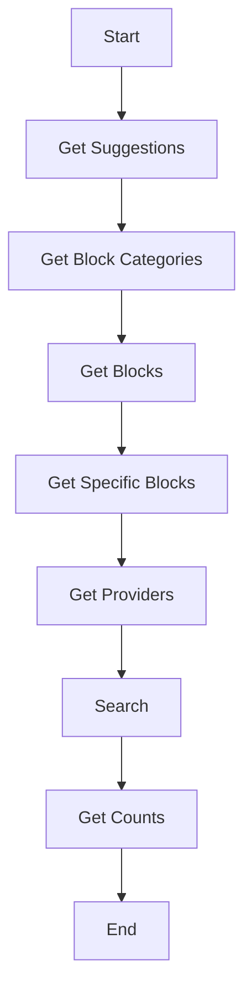

## 类结构

```
APIRouter (FastAPI Router)
├── get_suggestions
│   ├── user_id
│   └── return SuggestionsResponse
├── get_block_categories
│   ├── blocks_per_category
│   └── return Sequence[BlockCategoryResponse]
├── get_blocks
│   ├── category
│   ├── type
│   ├── provider
│   ├── page
│   ├── page_size
│   └── return BlockResponse
├── get_specific_blocks
│   ├── block_ids
│   └── return list[BlockInfo]
├── get_providers
│   ├── page
│   ├── page_size
│   └── return ProviderResponse
├── search
│   ├── user_id
│   ├── search_query
│   ├── filter
│   ├── search_id
│   ├── by_creator
│   ├── page
│   ├── page_size
│   └── return SearchResponse
└── get_counts
   ├── user_id
   └── return CountResponse
```

## 全局变量及字段


### `logger`
    
Logger instance for logging messages.

类型：`logging.Logger`
    


### `router`
    
FastAPI router instance for defining routes.

类型：`fastapi.APIRouter`
    


### `ProviderName`
    
Enum for different provider names.

类型：`backend.integrations.providers.ProviderName`
    


### `Pagination`
    
Pagination class for handling pagination.

类型：`backend.util.models.Pagination`
    


### `builder_db`
    
Module for database operations.

类型：`module`
    


### `builder_model`
    
Module for model definitions.

类型：`module`
    


### `get_user_id`
    
Function to get the user ID from the security context.

类型：`function`
    


### `requires_user`
    
Dependency to require a user for the request.

类型：`function`
    


### `sanitize_query`
    
Function to sanitize the search query.

类型：`function`
    


### `get_suggestions`
    
Function to get suggestions for the Blocks Menu.

类型：`function`
    


### `get_block_categories`
    
Function to get block categories with a specified number of blocks per category.

类型：`function`
    


### `get_blocks`
    
Function to get blocks based on category, type, or provider.

类型：`function`
    


### `get_specific_blocks`
    
Function to get specific blocks by their IDs.

类型：`function`
    


### `get_providers`
    
Function to get all integration providers with their block counts.

类型：`function`
    


### `search`
    
Function to search for blocks, marketplace agents, and user library agents.

类型：`function`
    


### `get_counts`
    
Function to get item counts for the menu categories in the Blocks Menu.

类型：`function`
    


### `SuggestionsResponse.otto_suggestions`
    
List of Otto suggestions.

类型：`list[str]`
    


### `SuggestionsResponse.recent_searches`
    
Sequence of recent searches.

类型：`Sequence[...]`
    


### `SuggestionsResponse.providers`
    
List of providers.

类型：`list[ProviderName]`
    


### `SuggestionsResponse.top_blocks`
    
Sequence of top blocks.

类型：`Sequence[...]`
    


### `BlockCategoryResponse.category_name`
    
Name of the block category.

类型：`str`
    


### `BlockCategoryResponse.blocks`
    
Sequence of blocks in the category.

类型：`Sequence[...]`
    


### `BlockResponse.blocks`
    
Sequence of blocks.

类型：`Sequence[...]`
    


### `BlockInfo.id`
    
ID of the block.

类型：`str`
    


### `BlockInfo.name`
    
Name of the block.

类型：`str`
    


### `BlockInfo.description`
    
Description of the block.

类型：`str`
    


### `BlockInfo.category`
    
Category of the block.

类型：`str`
    


### `BlockInfo.type`
    
Type of the block.

类型：`str`
    


### `BlockInfo.provider`
    
Provider of the block.

类型：`ProviderName`
    


### `ProviderResponse.provider_name`
    
Name of the provider.

类型：`str`
    


### `ProviderResponse.block_count`
    
Block count of the provider.

类型：`int`
    


### `SearchResponse.items`
    
Sequence of search items.

类型：`Sequence[...]`
    


### `SearchResponse.search_id`
    
Search ID.

类型：`str`
    


### `SearchResponse.total_items`
    
Total number of items in the search.

类型：`int`
    


### `SearchResponse.pagination`
    
Pagination information.

类型：`Pagination`
    


### `CountResponse.counts`
    
Dictionary of counts for different categories.

类型：`dict`
    
    

## 全局函数及方法


### `sanitize_query`

This function is designed to sanitize a given query string to prevent SQL injection by escaping special characters.

参数：

- `query`：`str | None`，The query string to be sanitized. If `None`, the function returns `None`.

返回值：`str | None`，The sanitized query string or `None` if the input was `None`.

#### 流程图

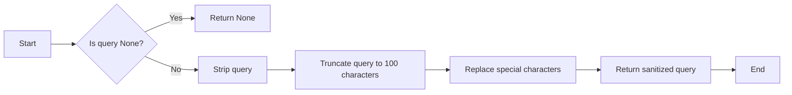

#### 带注释源码

```python
def sanitize_query(query: str | None) -> str | None:
    if query is None:
        return query
    query = query.strip()[:100]
    return (
        query.replace("\\", "\\\\")
        .replace("%", "\\%")
        .replace("_", "\\_")
        .replace("[", "\\[")
        .replace("]", "\\]")
        .replace("'", "\\'")
        .replace('"', '\\"')
        .replace(";", "\\;")
        .replace("--", "\\--")
        .replace("/*", "\\/*")
        .replace("*/", "\\*/")
    )
```


### get_suggestions

Get all suggestions for the Blocks Menu.

参数：

- `user_id`：`str`，The user ID for which to get suggestions.

返回值：`builder_model.SuggestionsResponse`，A response object containing the suggestions for the Blocks Menu.

#### 流程图

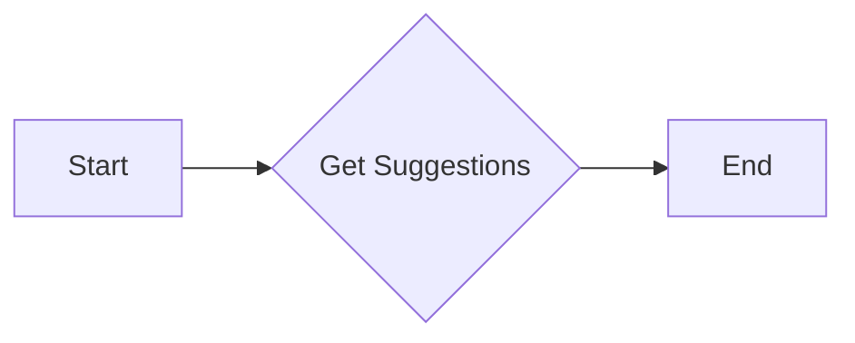

#### 带注释源码

```python
@router.get(
    "/suggestions",
    summary="Get Builder suggestions",
    response_model=builder_model.SuggestionsResponse,
)
async def get_suggestions(
    user_id: Annotated[str, fastapi.Security(get_user_id)],
) -> builder_model.SuggestionsResponse:
    """
    Get all suggestions for the Blocks Menu.
    """
    return builder_model.SuggestionsResponse(
        otto_suggestions=[
            "What blocks do I need to get started?",
            "Help me create a list",
            "Help me feed my data to Google Maps",
        ],
        recent_searches=await builder_db.get_recent_searches(user_id),
        providers=[
            ProviderName.TWITTER,
            ProviderName.GITHUB,
            ProviderName.NOTION,
            ProviderName.GOOGLE,
            ProviderName.DISCORD,
            ProviderName.GOOGLE_MAPS,
        ],
        top_blocks=await builder_db.get_suggested_blocks(),
    )
```


### get_block_categories

Get all block categories with a specified number of blocks per category.

参数：

- `blocks_per_category`：`int`，The number of blocks to return per category.

返回值：`Sequence[builder_model.BlockCategoryResponse]`，A sequence of block category responses.

#### 流程图

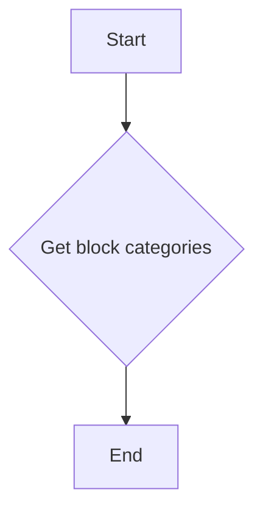

#### 带注释源码

```python
@router.get(
    "/categories",
    summary="Get Builder block categories",
    response_model=Sequence[builder_model.BlockCategoryResponse],
)
async def get_block_categories(
    blocks_per_category: Annotated[int, fastapi.Query()] = 3,
) -> Sequence[builder_model.BlockCategoryResponse]:
    """
    Get all block categories with a specified number of blocks per category.
    """
    return builder_db.get_block_categories(blocks_per_category)
```


### get_blocks

Get blocks based on either category, type, or provider.

参数：

- `category`：`str | None`，The category of the blocks to retrieve.
- `type`：`builder_model.BlockType | None`，The type of the blocks to retrieve.
- `provider`：`ProviderName | None`，The provider of the blocks to retrieve.
- `page`：`int`，The page number of the blocks to retrieve.
- `page_size`：`int`，The number of blocks per page to retrieve.

返回值：`builder_model.BlockResponse`，A response containing the blocks based on the given criteria.

#### 流程图

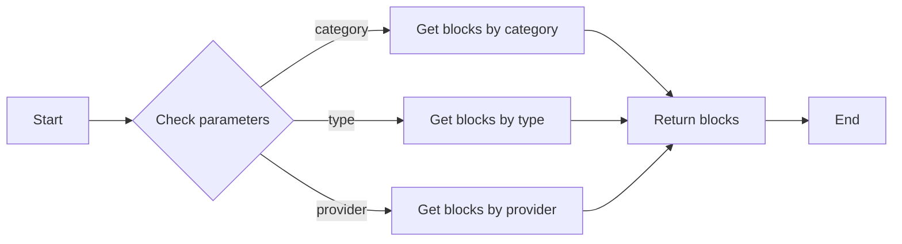

#### 带注释源码

```python
@router.get(
    "/blocks",
    summary="Get Builder blocks",
    response_model=builder_model.BlockResponse,
)
async def get_blocks(
    category: Annotated[str | None, fastapi.Query()] = None,
    type: Annotated[builder_model.BlockType | None, fastapi.Query()] = None,
    provider: Annotated[ProviderName | None, fastapi.Query()] = None,
    page: Annotated[int, fastapi.Query()] = 1,
    page_size: Annotated[int, fastapi.Query()] = 50,
) -> builder_model.BlockResponse:
    """
    Get blocks based on either category, type, or provider.
    """
    return builder_db.get_blocks(
        category=category,
        type=type,
        provider=provider,
        page=page,
        page_size=page_size,
    )
```


### get_specific_blocks

Get specific blocks by their IDs.

参数：

- `block_ids`：`list[str]`，A list of block IDs to retrieve.

返回值：`list[builder_model.BlockInfo]`，A list of `BlockInfo` objects corresponding to the provided block IDs.

#### 流程图

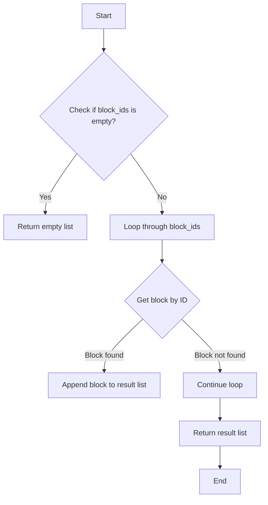

#### 带注释源码

```python
@router.get(
    "/blocks/batch",
    summary="Get specific blocks",
    response_model=list[builder_model.BlockInfo],
)
async def get_specific_blocks(
    block_ids: Annotated[list[str], fastapi.Query()],
) -> list[builder_model.BlockInfo]:
    """
    Get specific blocks by their IDs.
    """
    blocks = []
    for block_id in block_ids:
        block = builder_db.get_block_by_id(block_id)
        if block:
            blocks.append(block)
    return blocks
```


### get_providers

Get all integration providers with their block counts.

参数：

- `page`：`int`，The page number for pagination.
- `page_size`：`int`，The number of items per page for pagination.

返回值：`builder_model.ProviderResponse`，A response containing the list of providers and their block counts.

#### 流程图

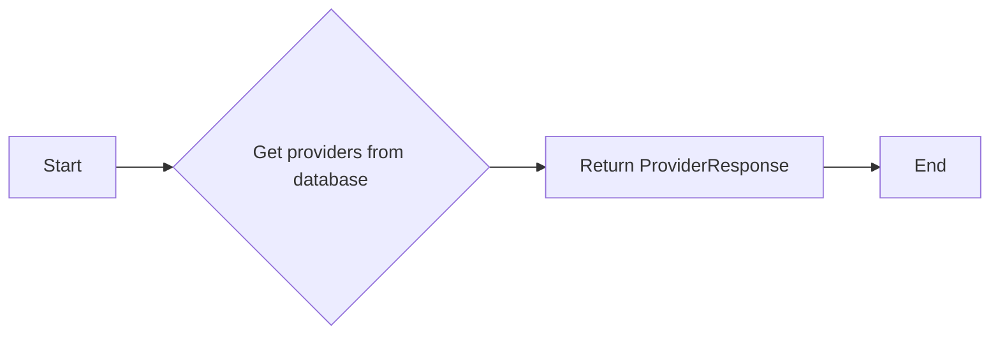

#### 带注释源码

```python
@router.get(
    "/providers",
    summary="Get Builder integration providers",
    response_model=builder_model.ProviderResponse,
)
async def get_providers(
    page: Annotated[int, fastapi.Query()] = 1,
    page_size: Annotated[int, fastapi.Query()] = 50,
) -> builder_model.ProviderResponse:
    """
    Get all integration providers with their block counts.
    """
    return builder_db.get_providers(
        page=page,
        page_size=page_size,
    )
```


### search

Search for blocks (including integrations), marketplace agents, and user library agents.

参数：

- `user_id`：`str`，The unique identifier for the user performing the search.
- `search_query`：`str | None`，The search query string. If not provided, the search will return all types.
- `filter`：`list[builder_model.FilterType] | None`，The filters to apply to the search. If not provided, all types are returned.
- `search_id`：`str | None`，The ID of the search entry to update.
- `by_creator`：`list[str] | None`，The creators to filter by.
- `page`：`int`，The page number of the results to return.
- `page_size`：`int`，The number of items per page.

返回值：`builder_model.SearchResponse`，A response containing the search results, search ID, total items, and pagination information.

#### 流程图

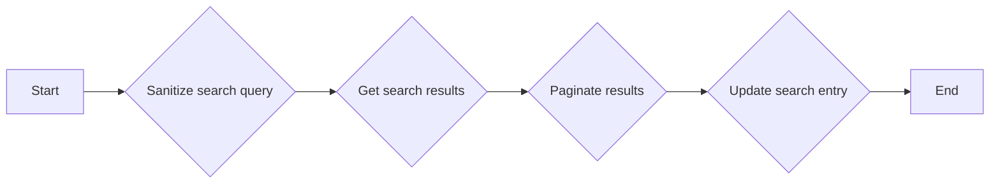

#### 带注释源码

```python
@router.get(
    "/search",
    summary="Builder search",
    tags=["store", "private"],
    response_model=builder_model.SearchResponse,
)
async def search(
    user_id: Annotated[str, fastapi.Security(get_user_id)],
    search_query: Annotated[str | None, fastapi.Query()] = None,
    filter: Annotated[list[builder_model.FilterType] | None, fastapi.Query()] = None,
    search_id: Annotated[str | None, fastapi.Query()] = None,
    by_creator: Annotated[list[str] | None, fastapi.Query()] = None,
    page: Annotated[int, fastapi.Query()] = 1,
    page_size: Annotated[int, fastapi.Query()] = 50,
) -> builder_model.SearchResponse:
    """
    Search for blocks (including integrations), marketplace agents, and user library agents.
    """
    # If no filters are provided, then we will return all types
    if not filter:
        filter = [
            "blocks",
            "integrations",
            "marketplace_agents",
            "my_agents",
        ]
    search_query = sanitize_query(search_query)

    # Get all possible results
    cached_results = await builder_db.get_sorted_search_results(
        user_id=user_id,
        search_query=search_query,
        filters=filter,
        by_creator=by_creator,
    )

    # Paginate results
    total_combined_items = len(cached_results.items)
    pagination = Pagination(
        total_items=total_combined_items,
        total_pages=(total_combined_items + page_size - 1) // page_size,
        current_page=page,
        page_size=page_size,
    )

    start_idx = (page - 1) * page_size
    end_idx = start_idx + page_size
    paginated_items = cached_results.items[start_idx:end_idx]

    # Update the search entry by id
    search_id = await builder_db.update_search(
        user_id,
        builder_model.SearchEntry(
            search_query=search_query,
            filter=filter,
            by_creator=by_creator,
            search_id=search_id,
        ),
    )

    return builder_model.SearchResponse(
        items=paginated_items,
        search_id=search_id,
        total_items=cached_results.total_items,
        pagination=pagination,
    )
```


### get_counts

Get item counts for the menu categories in the Blocks Menu.

参数：

- `user_id`：`str`，The unique identifier for the user.

返回值：`builder_model.CountResponse`，A response object containing the counts of different items in the Blocks Menu.

#### 流程图

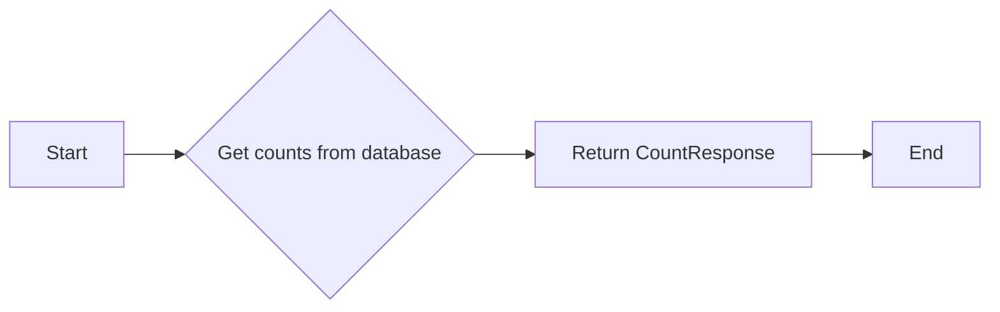

#### 带注释源码

```python
@router.get(
    "/counts",
    summary="Get Builder item counts",
    response_model=builder_model.CountResponse,
)
async def get_counts(
    user_id: Annotated[str, fastapi.Security(get_user_id)],
) -> builder_model.CountResponse:
    """
    Get item counts for the menu categories in the Blocks Menu.
    """
    return await builder_db.get_counts(user_id)
```


### `get_suggestions`

Get all suggestions for the Blocks Menu.

参数：

- `user_id`：`str`，The user ID for which suggestions are being retrieved.

返回值：`builder_model.SuggestionsResponse`，A response object containing the suggestions for the Blocks Menu.

#### 流程图

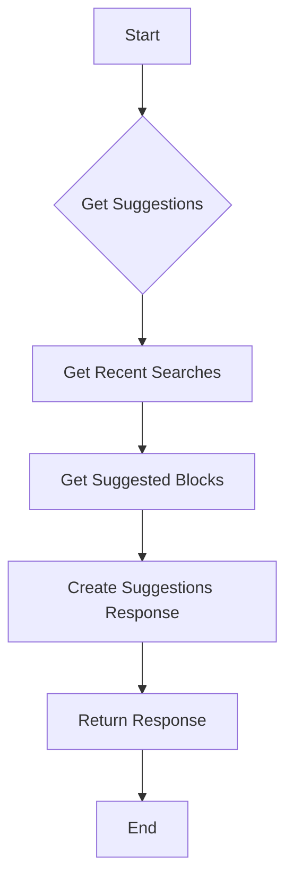

#### 带注释源码

```python
@router.get(
    "/suggestions",
    summary="Get Builder suggestions",
    response_model=builder_model.SuggestionsResponse,
)
async def get_suggestions(
    user_id: Annotated[str, fastapi.Security(get_user_id)],
) -> builder_model.SuggestionsResponse:
    """
    Get all suggestions for the Blocks Menu.
    """
    return builder_model.SuggestionsResponse(
        otto_suggestions=[
            "What blocks do I need to get started?",
            "Help me create a list",
            "Help me feed my data to Google Maps",
        ],
        recent_searches=await builder_db.get_recent_searches(user_id),
        providers=[
            ProviderName.TWITTER,
            ProviderName.GITHUB,
            ProviderName.NOTION,
            ProviderName.GOOGLE,
            ProviderName.DISCORD,
            ProviderName.GOOGLE_MAPS,
        ],
        top_blocks=await builder_db.get_suggested_blocks(),
    )
```


### `get_block_categories`

Get all block categories with a specified number of blocks per category.

参数：

- `blocks_per_category`：`int`，The number of blocks to return per category.

返回值：`Sequence[builder_model.BlockCategoryResponse]`，A sequence of block category responses.

#### 流程图

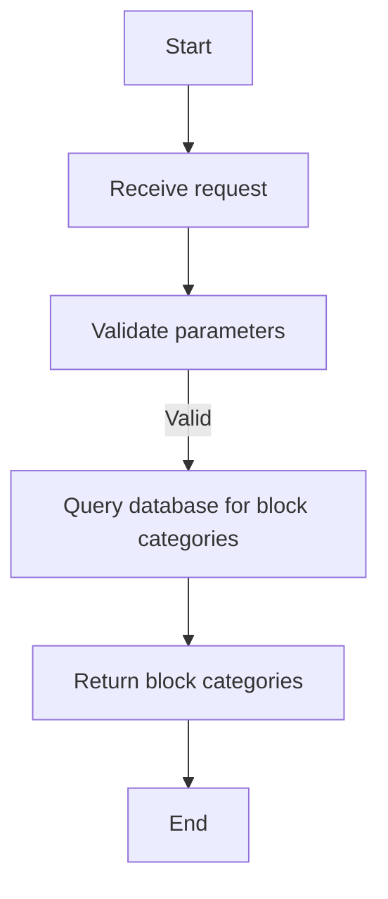

#### 带注释源码

```python
@router.get(
    "/categories",
    summary="Get Builder block categories",
    response_model=Sequence[builder_model.BlockCategoryResponse],
)
async def get_block_categories(
    blocks_per_category: Annotated[int, fastapi.Query()] = 3,
) -> Sequence[builder_model.BlockCategoryResponse]:
    """
    Get all block categories with a specified number of blocks per category.
    """
    return builder_db.get_block_categories(blocks_per_category)
```


### `get_blocks`

Get blocks based on either category, type, or provider.

参数：

- `category`：`str | None`，The category of the blocks to retrieve.
- `type`：`builder_model.BlockType | None`，The type of the blocks to retrieve.
- `provider`：`ProviderName | None`，The provider of the blocks to retrieve.
- `page`：`int`，The page number of the blocks to retrieve.
- `page_size`：`int`，The number of blocks per page.

返回值：`builder_model.BlockResponse`，A response containing the blocks based on the given criteria.

#### 流程图

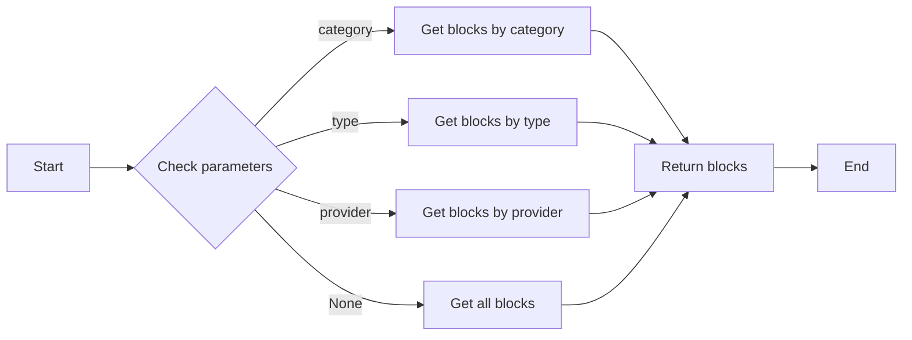

#### 带注释源码

```python
@router.get(
    "/blocks",
    summary="Get Builder blocks",
    response_model=builder_model.BlockResponse,
)
async def get_blocks(
    category: Annotated[str | None, fastapi.Query()] = None,
    type: Annotated[builder_model.BlockType | None, fastapi.Query()] = None,
    provider: Annotated[ProviderName | None, fastapi.Query()] = None,
    page: Annotated[int, fastapi.Query()] = 1,
    page_size: Annotated[int, fastapi.Query()] = 50,
) -> builder_model.BlockResponse:
    """
    Get blocks based on either category, type, or provider.
    """
    return builder_db.get_blocks(
        category=category,
        type=type,
        provider=provider,
        page=page,
        page_size=page_size,
    )
```


### get_specific_blocks

Get specific blocks by their IDs.

参数：

- `block_ids`：`list[str]`，A list of block IDs to retrieve.

返回值：`list[builder_model.BlockInfo]`，A list of `BlockInfo` objects corresponding to the provided block IDs.

#### 流程图

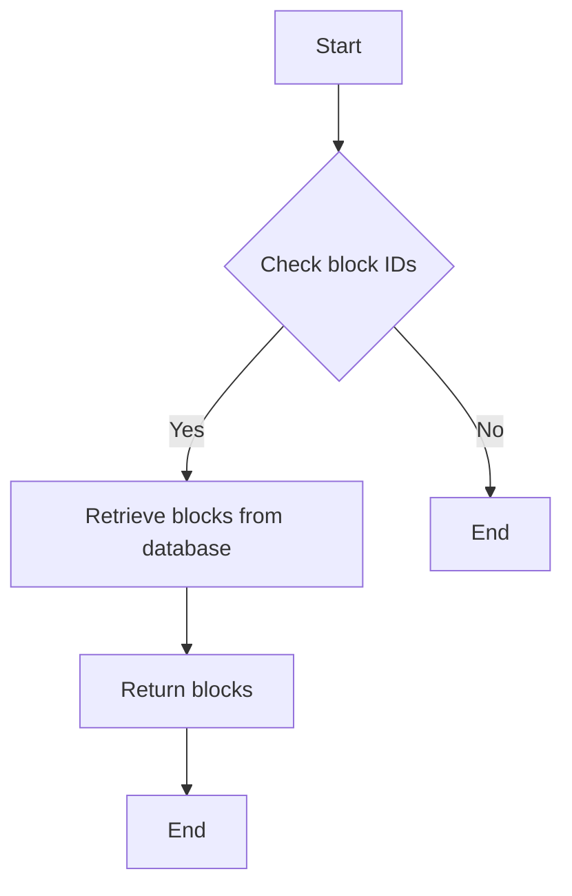

#### 带注释源码

```python
@router.get(
    "/blocks/batch",
    summary="Get specific blocks",
    response_model=list[builder_model.BlockInfo],
)
async def get_specific_blocks(
    block_ids: Annotated[list[str], fastapi.Query()],
) -> list[builder_model.BlockInfo]:
    """
    Get specific blocks by their IDs.
    """
    blocks = []
    for block_id in block_ids:
        block = builder_db.get_block_by_id(block_id)
        if block:
            blocks.append(block)
    return blocks
```


### `get_providers`

Get all integration providers with their block counts.

参数：

- `page`：`int`，The page number for pagination.
- `page_size`：`int`，The number of items per page for pagination.

返回值：`builder_model.ProviderResponse`，A response containing the list of providers and their block counts.

#### 流程图

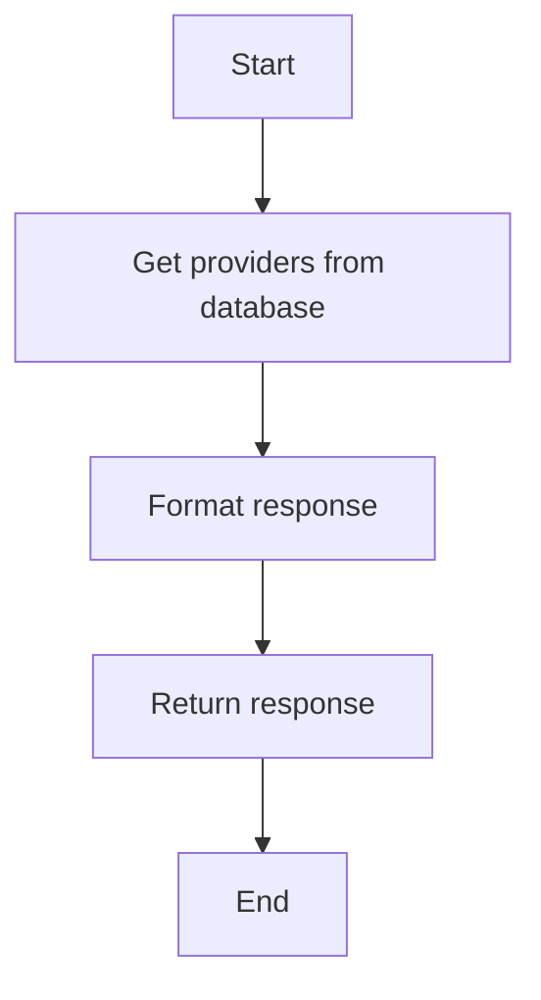

#### 带注释源码

```python
@router.get(
    "/providers",
    summary="Get Builder integration providers",
    response_model=builder_model.ProviderResponse,
)
async def get_providers(
    page: Annotated[int, fastapi.Query()] = 1,
    page_size: Annotated[int, fastapi.Query()] = 50,
) -> builder_model.ProviderResponse:
    """
    Get all integration providers with their block counts.
    """
    return builder_db.get_providers(
        page=page,
        page_size=page_size,
    )
```


### `APIRouter.search`

This function is a part of the FastAPI router and is used to handle search requests for blocks, integrations, marketplace agents, and user library agents.

参数：

- `user_id`：`str`，The unique identifier for the user performing the search.
- `search_query`：`str | None`，The search query string. If not provided, the search will return all types.
- `filter`：`list[builder_model.FilterType] | None`，The filters to apply to the search. If not provided, it defaults to searching for all types.
- `search_id`：`str | None`，The ID of the search entry to update.
- `by_creator`：`list[str] | None`，The creators to filter by.
- `page`：`int`，The page number of the results to return.
- `page_size`：`int`，The number of items per page.

返回值：`builder_model.SearchResponse`，A response object containing the search results, search ID, total items, and pagination information.

#### 流程图


#### 带注释源码

```python
@router.get(
    "/search",
    summary="Builder search",
    tags=["store", "private"],
    response_model=builder_model.SearchResponse,
)
async def search(
    user_id: Annotated[str, fastapi.Security(get_user_id)],
    search_query: Annotated[str | None, fastapi.Query()] = None,
    filter: Annotated[list[builder_model.FilterType] | None, fastapi.Query()] = None,
    search_id: Annotated[str | None, fastapi.Query()] = None,
    by_creator: Annotated[list[str] | None, fastapi.Query()] = None,
    page: Annotated[int, fastapi.Query()] = 1,
    page_size: Annotated[int, fastapi.Query()] = 50,
) -> builder_model.SearchResponse:
    """
    Search for blocks (including integrations), marketplace agents, and user library agents.
    """
    # If no filters are provided, then we will return all types
    if not filter:
        filter = [
            "blocks",
            "integrations",
            "marketplace_agents",
            "my_agents",
        ]
    search_query = sanitize_query(search_query)

    # Get all possible results
    cached_results = await builder_db.get_sorted_search_results(
        user_id=user_id,
        search_query=search_query,
        filters=filter,
        by_creator=by_creator,
    )

    # Paginate results
    total_combined_items = len(cached_results.items)
    pagination = Pagination(
        total_items=total_combined_items,
        total_pages=(total_combined_items + page_size - 1) // page_size,
        current_page=page,
        page_size=page_size,
    )

    start_idx = (page - 1) * page_size
    end_idx = start_idx + page_size
    paginated_items = cached_results.items[start_idx:end_idx]

    # Update the search entry by id
    search_id = await builder_db.update_search(
        user_id,
        builder_model.SearchEntry(
            search_query=search_query,
            filter=filter,
            by_creator=by_creator,
            search_id=search_id,
        ),
    )

    return builder_model.SearchResponse(
        items=paginated_items,
        search_id=search_id,
        total_items=cached_results.total_items,
        pagination=pagination,
    )
```


### get_counts

Get item counts for the menu categories in the Blocks Menu.

参数：

- `user_id`：`str`，The unique identifier for the user.

返回值：`builder_model.CountResponse`，A response object containing the counts of different items in the Blocks Menu.

#### 流程图

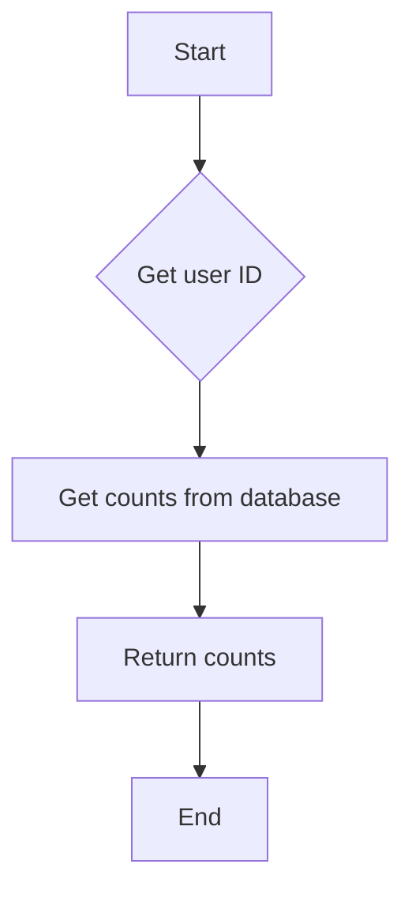

#### 带注释源码

```python
@router.get(
    "/counts",
    summary="Get Builder item counts",
    response_model=builder_model.CountResponse,
)
async def get_counts(
    user_id: Annotated[str, fastapi.Security(get_user_id)],
) -> builder_model.CountResponse:
    """
    Get item counts for the menu categories in the Blocks Menu.
    """
    return await builder_db.get_counts(user_id)
```


## 关键组件


### 张量索引与惰性加载

张量索引与惰性加载是用于高效处理大规模数据集的关键组件，通过延迟计算和按需加载数据，减少内存消耗并提高性能。

### 反量化支持

反量化支持是用于处理量化数据的关键组件，它能够将量化数据转换回原始数据格式，以便进行进一步处理和分析。

### 量化策略

量化策略是用于优化模型性能的关键组件，它通过减少模型参数的精度来降低计算复杂度和内存占用，同时尽量保持模型的准确性。


## 问题及建议


### 已知问题

-   **代码重复**：`sanitize_query` 函数在多个地方被调用，这可能导致维护困难。建议将其封装为一个类方法或全局函数，并在需要的地方调用。
-   **异常处理**：代码中缺少异常处理机制，例如在数据库查询失败时。建议添加适当的异常处理来确保系统的健壮性。
-   **代码可读性**：部分函数和变量命名不够清晰，这可能会影响代码的可读性和可维护性。建议使用更具描述性的命名。
-   **全局变量**：`logger` 被用作全局变量，这可能会在多线程环境中导致问题。建议使用依赖注入来管理日志记录器。

### 优化建议

-   **重构 `sanitize_query`**：将 `sanitize_query` 函数封装为一个类方法或全局函数，并在需要的地方调用，以减少代码重复。
-   **添加异常处理**：在数据库查询和其它可能抛出异常的地方添加 try-except 块，以处理异常情况。
-   **改进命名**：使用更具描述性的命名来提高代码的可读性。
-   **依赖注入**：使用依赖注入来管理 `logger`，以避免在多线程环境中的潜在问题。
-   **代码审查**：进行代码审查，以发现潜在的问题并改进代码质量。
-   **单元测试**：编写单元测试来确保代码的正确性和稳定性。
-   **性能优化**：分析代码性能，并针对热点进行优化。
-   **文档化**：为代码添加必要的文档，以提高代码的可维护性。


## 其它


### 设计目标与约束

- 设计目标：
  - 提供一个RESTful API，用于管理Builder的块、分类、搜索和计数。
  - 确保API响应时间快速，以提供良好的用户体验。
  - 确保API易于扩展和维护。
- 约束：
  - 必须使用FastAPI框架。
  - 必须使用数据库进行数据存储。
  - 必须遵循RESTful设计原则。

### 错误处理与异常设计

- 错误处理：
  - 使用FastAPI的异常处理机制来捕获和处理异常。
  - 定义自定义异常类，以便更好地描述错误情况。
- 异常设计：
  - 对于数据库查询错误，返回适当的HTTP状态码（如500）和错误消息。
  - 对于无效的请求参数，返回400 Bad Request状态码和错误消息。

### 数据流与状态机

- 数据流：
  - 用户发起请求，API处理请求并从数据库获取数据。
  - API将数据转换为响应模型并返回给用户。
- 状态机：
  - API的状态机由请求类型（GET、POST等）和请求参数控制。
  - 每个请求都经过一系列的状态转换，最终生成响应。

### 外部依赖与接口契约

- 外部依赖：
  - FastAPI
  - Pydantic
  - SQLAlchemy
  - Autogpt_libs
- 接口契约：
  - 使用Pydantic模型来定义请求和响应的数据结构。
  - 使用FastAPI的依赖注入系统来处理认证和授权。
  - 使用SQLAlchemy来处理数据库操作。


    