# `.\AutoGPT\autogpt_platform\backend\backend\api\features\chat\completion_consumer.py` 详细设计文档

This module provides a consumer for chat operation completion messages from Redis Streams, handling success and failure notifications and updating the system accordingly.

## 整体流程

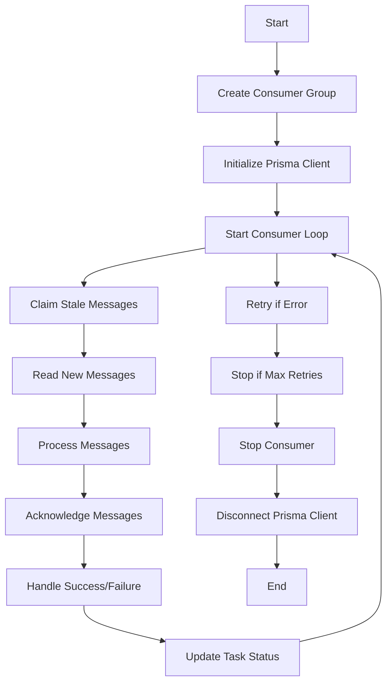

## 类结构

```
ChatCompletionConsumer (Consumer)
├── OperationCompleteMessage (Message Model)
└── stream_registry (Registry Module)
```

## 全局变量及字段


### `logger`
    
Logger instance for logging messages.

类型：`logging.Logger`
    


### `config`
    
Configuration object for chat services.

类型：`ChatConfig`
    


### `_consumer`
    
Global instance of the ChatCompletionConsumer class.

类型：`ChatCompletionConsumer`
    


### `OperationCompleteMessage.operation_id`
    
Unique identifier for the operation that completed.

类型：`str`
    


### `OperationCompleteMessage.task_id`
    
Identifier for the task associated with the operation.

类型：`str`
    


### `OperationCompleteMessage.success`
    
Indicates whether the operation was successful.

类型：`bool`
    


### `OperationCompleteMessage.result`
    
Result data for a successful operation.

类型：`dict | str | None`
    


### `OperationCompleteMessage.error`
    
Error message for a failed operation.

类型：`str | None`
    


### `ChatCompletionConsumer._consumer_task`
    
Task representing the consumer loop.

类型：`asyncio.Task | None`
    


### `ChatCompletionConsumer._running`
    
Indicates whether the consumer is running.

类型：`bool`
    


### `ChatCompletionConsumer._prisma`
    
Prisma client instance for database operations.

类型：`Prisma | None`
    


### `ChatCompletionConsumer._consumer_name`
    
Unique name for the consumer instance in Redis consumer group.

类型：`str`
    


### `logging.Logger.logger`
    
Logger instance for logging messages.

类型：`logging.Logger`
    


### `ChatConfig.config`
    
Configuration object for chat services.

类型：`ChatConfig`
    


### `_consumer._consumer`
    
Global instance of the ChatCompletionConsumer class.

类型：`ChatCompletionConsumer`
    


### `OperationCompleteMessage.operation_id`
    
Unique identifier for the operation that completed.

类型：`str`
    


### `OperationCompleteMessage.task_id`
    
Identifier for the task associated with the operation.

类型：`str`
    


### `OperationCompleteMessage.success`
    
Indicates whether the operation was successful.

类型：`bool`
    


### `OperationCompleteMessage.result`
    
Result data for a successful operation.

类型：`dict | str | None`
    


### `OperationCompleteMessage.error`
    
Error message for a failed operation.

类型：`str | None`
    


### `ChatCompletionConsumer._consumer_task`
    
Task representing the consumer loop.

类型：`asyncio.Task | None`
    


### `ChatCompletionConsumer._running`
    
Indicates whether the consumer is running.

类型：`bool`
    


### `ChatCompletionConsumer._prisma`
    
Prisma client instance for database operations.

类型：`Prisma | None`
    


### `ChatCompletionConsumer._consumer_name`
    
Unique name for the consumer instance in Redis consumer group.

类型：`str`
    
    

## 全局函数及方法

### `get_redis_async`

该函数是一个异步函数，用于获取Redis客户端连接。

#### 参数

- 无

#### 返回值

- `redis`: `Any`，Redis客户端连接

#### 流程图

```mermaid
graph LR
A[get_redis_async()] --> B{获取Redis客户端连接}
B --> C[返回Redis客户端连接]
```

#### 带注释源码

```python
async def get_redis_async():
    """获取Redis客户端连接。

    Returns:
        redis: Any，Redis客户端连接
    """
    redis = await redis_client.get_redis_async()
    return redis
```

### process_operation_success

#### 描述

`process_operation_success` 是一个异步函数，用于处理成功完成的操作。它接收一个任务对象和一个结果对象，然后使用 Prisma 客户端更新数据库中的任务状态。

#### 参数

- `task`：`stream_registry.ActiveTask`，表示要更新的任务对象。
- `result`：`dict | str | None`，表示操作成功时的结果数据。

#### 返回值

- 无返回值。

#### 流程图

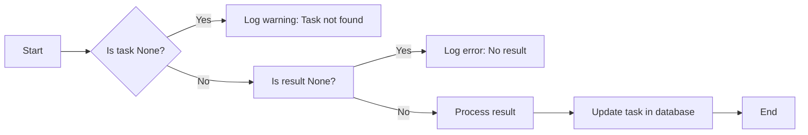

#### 带注释源码

```python
async def _handle_success(self, task: stream_registry.ActiveTask, message: OperationCompleteMessage) -> None:
    """Handle successful operation completion."""
    prisma = await self._ensure_prisma()
    await process_operation_success(task, message.result, prisma)
```


### process_operation_failure

This function handles failed operation completion by logging the error and updating the task status in the database.

参数：

- `task`：`stream_registry.ActiveTask`，The task object that completed with failure.
- `error`：`str`，The error message associated with the failed operation.

返回值：`None`，This function does not return a value.

#### 流程图

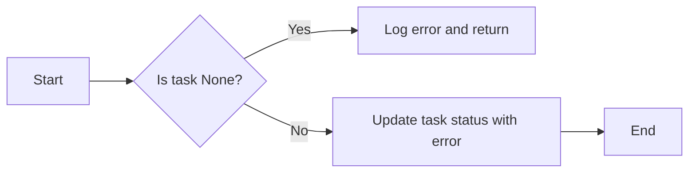

#### 带注释源码

```python
async def process_operation_failure(task: stream_registry.ActiveTask, error: str) -> None:
    """Handle failed operation completion.

    Args:
        task: The task object that completed with failure.
        error: The error message associated with the failed operation.
    """
    prisma = await self._ensure_prisma()
    await prisma.task.update(
        where={"task_id": task.task_id},
        data={"status": "failed", "error": error},
    )
    logger.error(f"Operation failed for task {task.task_id}: {error}")
```


### start_completion_consumer

This function starts the global completion consumer, which listens for completion notifications from external services and triggers appropriate updates via `process_operation_success` or `process_operation_failure`.

#### 参数

- 无

#### 返回值

- 无

#### 流程图

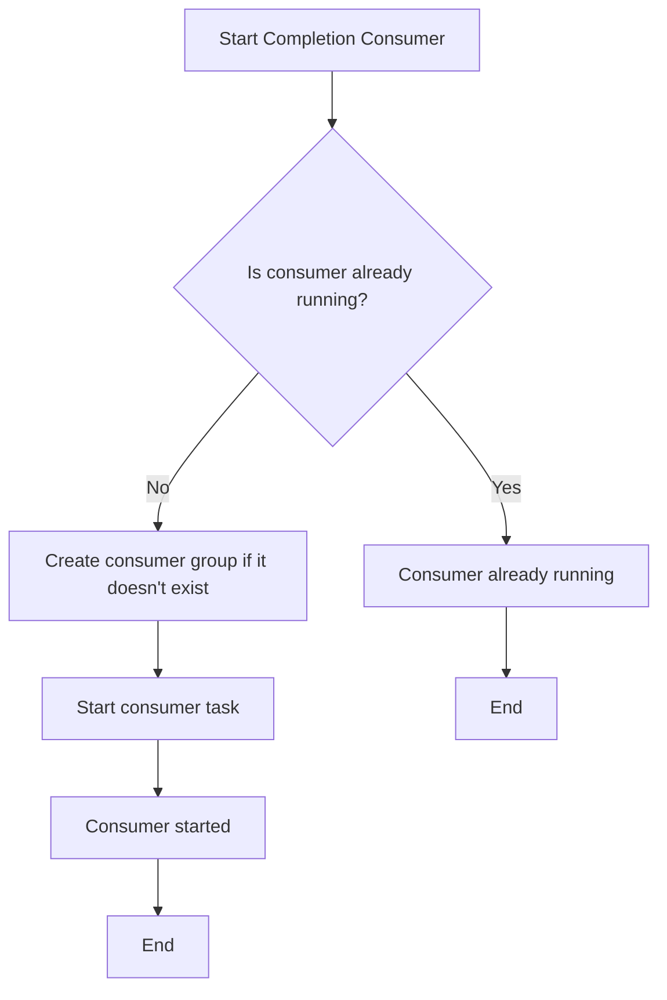

#### 带注释源码

```python
async def start_completion_consumer() -> None:
    """Start the global completion consumer."""
    global _consumer
    if _consumer is None:
        _consumer = ChatCompletionConsumer()
    await _consumer.start()
```

### `stop_completion_consumer`

停止全局完成消费者。

参数：

- 无

返回值：无

#### 流程图

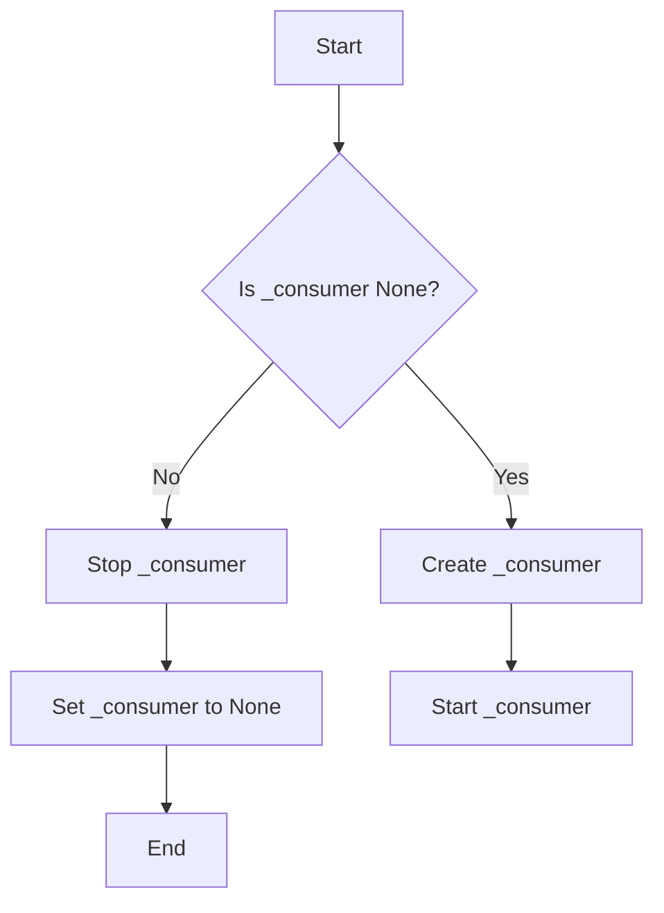

#### 带注释源码

```python
async def stop_completion_consumer() -> None:
    """Stop the global completion consumer."""
    global _consumer
    if _consumer:
        await _consumer.stop()
        _consumer = None
```


### publish_operation_complete

Publishes an operation completion message to Redis Streams.

参数：

- operation_id：`str`，The operation ID that completed.
- task_id：`str`，The task ID associated with the operation.
- success：`bool`，Whether the operation succeeded.
- result：`dict | str | None`，The result data (for success).
- error：`str | None`，The error message (for failure).

返回值：`None`，No return value, the operation is asynchronous.

#### 流程图

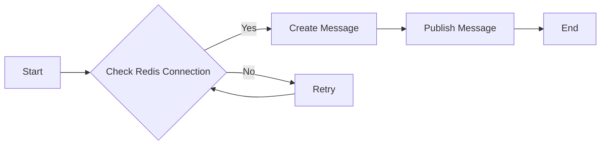

#### 带注释源码

```python
async def publish_operation_complete(
    operation_id: str,
    task_id: str,
    success: bool,
    result: dict | str | None = None,
    error: str | None = None,
) -> None:
    """Publish an operation completion message to Redis Streams.

    Args:
        operation_id: The operation ID that completed.
        task_id: The task ID associated with the operation.
        success: Whether the operation succeeded.
        result: The result data (for success).
        error: The error message (for failure).
    """
    message = OperationCompleteMessage(
        operation_id=operation_id,
        task_id=task_id,
        success=success,
        result=result,
        error=error,
    )

    redis = await get_redis_async()
    await redis.xadd(
        config.stream_completion_name,
        {"data": message.model_dump_json()},
        maxlen=config.stream_max_length,
    )
    logger.info(f"Published completion for operation {operation_id}")
```


### `ChatCompletionConsumer.start`

Starts the completion consumer.

参数：

- 无

返回值：`None`，无返回值

#### 流程图

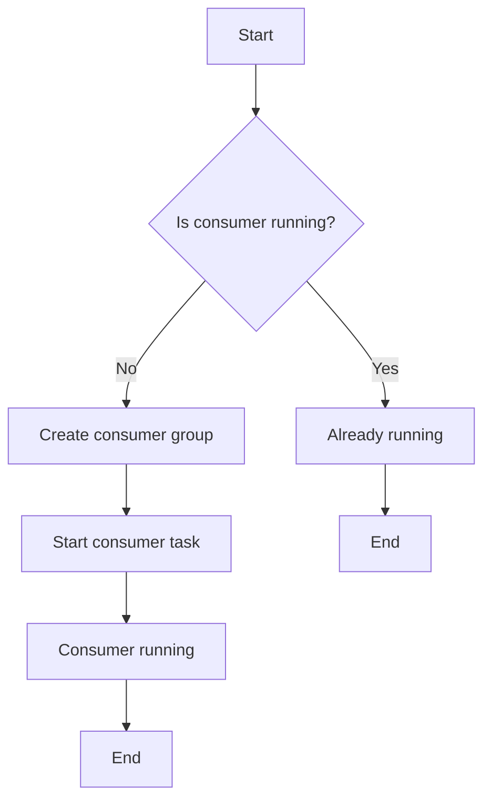

#### 带注释源码

```python
async def start(self) -> None:
    """Start the completion consumer."""
    if self._running:
        logger.warning("Completion consumer already running")
        return

    # Create consumer group if it doesn't exist
    try:
        redis = await get_redis_async()
        await redis.xgroup_create(
            config.stream_completion_name,
            config.stream_consumer_group,
            id="0",
            mkstream=True,
        )
        logger.info(
            f"Created consumer group '{config.stream_consumer_group}' "
            f"on stream '{config.stream_completion_name}'"
        )
    except ResponseError as e:
        if "BUSYGROUP" in str(e):
            logger.debug(
                f"Consumer group '{config.stream_consumer_group}' already exists"
            )
        else:
            raise

    self._running = True
    self._consumer_task = asyncio.create_task(self._consume_messages())
    logger.info(
        f"Chat completion consumer started (consumer: {self._consumer_name})"
    )
```


### `ChatCompletionConsumer.stop`

Stops the ChatCompletionConsumer instance, canceling its task and disconnecting its Prisma client.

参数：

- 无

返回值：`None`，无返回值

#### 流程图

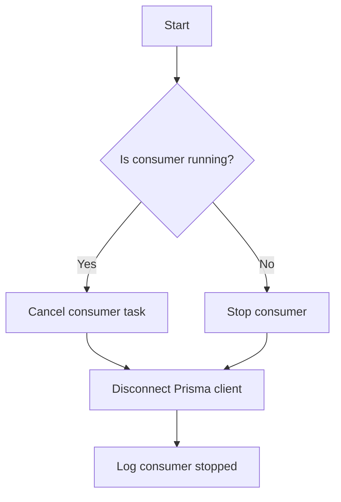

#### 带注释源码

```python
async def stop(self) -> None:
    """Stop the completion consumer."""
    self._running = False

    if self._consumer_task:
        self._consumer_task.cancel()
        try:
            await self._consumer_task
        except asyncio.CancelledError:
            pass
        self._consumer_task = None

    if self._prisma:
        await self._prisma.disconnect()
        self._prisma = None
        logger.info("[COMPLETION] Consumer Prisma client disconnected")

    logger.info("Chat completion consumer stopped")
``` 


### `_ensure_prisma`

Lazily initializes the Prisma client on first use.

参数：

- `None`：`Prisma`，This parameter is not explicitly defined in the function signature but is inferred from the context. It represents the Prisma client instance that will be returned.

返回值：`Prisma`，The Prisma client instance that is connected to the database.

#### 流程图

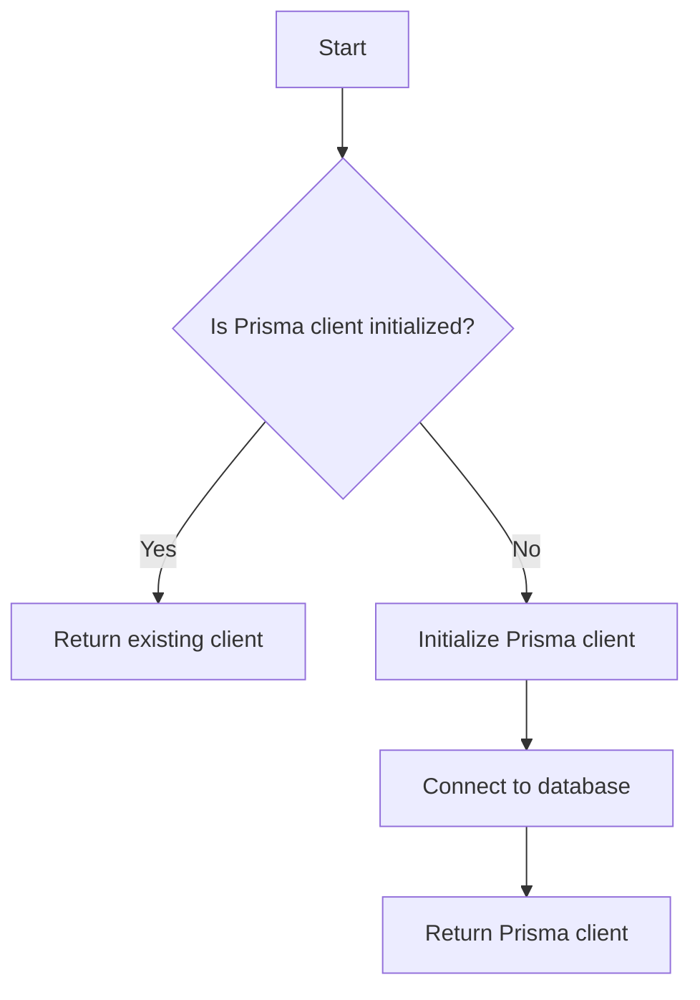

#### 带注释源码

```python
async def _ensure_prisma(self) -> Prisma:
    """Lazily initialize Prisma client on first use."""
    if self._prisma is None:
        database_url = os.getenv("DATABASE_URL", "postgresql://localhost:5432")
        self._prisma = Prisma(datasource={"url": database_url})
        await self._prisma.connect()
        logger.info("[COMPLETION] Consumer Prisma client connected (lazy init)")
    return self._prisma
```


### ChatCompletionConsumer._consume_messages

#### 描述

该函数是`ChatCompletionConsumer`类的一个异步方法，它负责从Redis Streams中读取消息，并处理完成操作的消息。

#### 参数

- 无

#### 返回值

- 无

#### 流程图

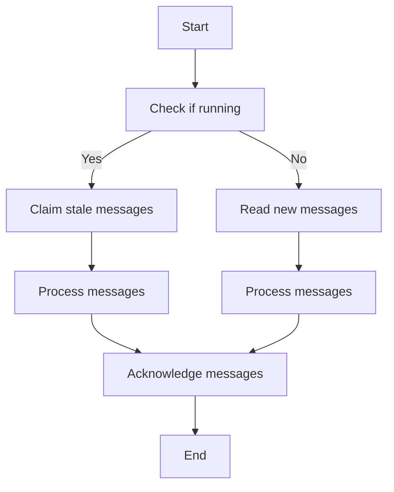

#### 带注释源码

```python
async def _consume_messages(self) -> None:
    """Main message consumption loop with retry logic."""
    max_retries = 10
    retry_delay = 5  # seconds
    retry_count = 0
    block_timeout = 5000  # milliseconds

    while self._running and retry_count < max_retries:
        try:
            redis = await get_redis_async()

            # Reset retry count on successful connection
            retry_count = 0

            while self._running:
                # First, claim any stale pending messages from dead consumers
                # Redis does NOT auto-redeliver pending messages; we must explicitly
                # claim them using XAUTOCLAIM
                try:
                    claimed_result = await redis.xautoclaim(
                        name=config.stream_completion_name,
                        groupname=config.stream_consumer_group,
                        consumername=self._consumer_name,
                        min_idle_time=config.stream_claim_min_idle_ms,
                        start_id="0-0",
                        count=10,
                    )
                    # xautoclaim returns: (next_start_id, [(id, data), ...], [deleted_ids])
                    if claimed_result and len(claimed_result) >= 2:
                        claimed_entries = claimed_result[1]
                        if claimed_entries:
                            logger.info(
                                f"Claimed {len(claimed_entries)} stale pending messages"
                            )
                            for entry_id, data in claimed_entries:
                                if not self._running:
                                    return
                                await self._process_entry(redis, entry_id, data)
                except Exception as e:
                    logger.warning(f"XAUTOCLAIM failed (non-fatal): {e}")

                # Read new messages from the stream
                messages = await redis.xreadgroup(
                    groupname=config.stream_consumer_group,
                    consumername=self._consumer_name,
                    streams={config.stream_completion_name: ">"},
                    block=block_timeout,
                    count=10,
                )

                if not messages:
                    continue

                for stream_name, entries in messages:
                    for entry_id, data in entries:
                        if not self._running:
                            return
                        await self._process_entry(redis, entry_id, data)

        except asyncio.CancelledError:
            logger.info("Consumer cancelled")
            return
        except Exception as e:
            retry_count += 1
            logger.error(
                f"Consumer error (retry {retry_count}/{max_retries}): {e}",
                exc_info=True,
            )
            if self._running and retry_count < max_retries:
                await asyncio.sleep(retry_delay)
            else:
                logger.error("Max retries reached, stopping consumer")
                return
```


### `_process_entry`

Process a single stream entry and acknowledge it on success.

参数：

- `redis`：`Any`，Redis client connection
- `entry_id`：`str`，The stream entry ID
- `data`：`dict[str, Any]`，The entry data dict

返回值：`None`，No return value

#### 流程图

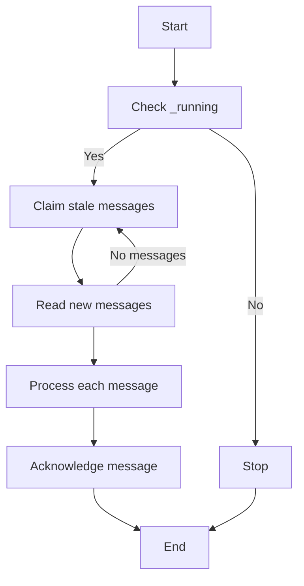

#### 带注释源码

```python
async def _process_entry(self, redis: Any, entry_id: str, data: dict[str, Any]) -> None:
    """Process a single stream entry and acknowledge it on success.

    Args:
        redis: Redis client connection
        entry_id: The stream entry ID
        data: The entry data dict
    """
    try:
        # Handle the message
        message_data = data.get("data")
        if message_data:
            await self._handle_message(
                message_data.encode()
                if isinstance(message_data, str)
                else message_data
            )

        # Acknowledge the message after successful processing
        await redis.xack(
            config.stream_completion_name,
            config.stream_consumer_group,
            entry_id,
        )
    except Exception as e:
        logger.error(
            f"Error processing completion message {entry_id}: {e}",
            exc_info=True,
        )
        # Message remains in pending state and will be claimed by
        # XAUTOCLAIM after min_idle_time expires
```


### `_handle_message`

Handle a completion message using our own Prisma client.

参数：

- `body`：`bytes`，The raw message body received from the Redis stream.

返回值：`None`，No return value, the method is asynchronous and performs actions within the context.

#### 流程图

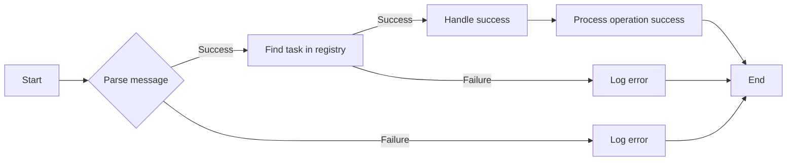

#### 带注释源码

```python
async def _handle_message(self, body: bytes) -> None:
    """Handle a completion message using our own Prisma client."""
    try:
        data = orjson.loads(body)
        message = OperationCompleteMessage(**data)
    except Exception as e:
        logger.error(f"Failed to parse completion message: {e}")
        return

    logger.info(
        f"[COMPLETION] Received completion for operation {message.operation_id} "
        f"(task_id={message.task_id}, success={message.success})"
    )

    # Find task in registry
    task = await stream_registry.find_task_by_operation_id(message.operation_id)
    if task is None:
        task = await stream_registry.get_task(message.task_id)

    if task is None:
        logger.warning(
            f"[COMPLETION] Task not found for operation {message.operation_id} "
            f"(task_id={message.task_id})"
        )
        return

    logger.info(
        f"[COMPLETION] Found task: task_id={task.task_id}, "
        f"session_id={task.session_id}, tool_call_id={task.tool_call_id}"
    )

    # Guard against empty task fields
    if not task.task_id or not task.session_id or not task.tool_call_id:
        logger.error(
            f"[COMPLETION] Task has empty critical fields! "
            f"task_id={task.task_id!r}, session_id={task.session_id!r}, "
            f"tool_call_id={task.tool_call_id!r}"
        )
        return

    if message.success:
        await self._handle_success(task, message)
    else:
        await self._handle_failure(task, message)
```


### `_handle_success`

Handle successful operation completion.

参数：

- `task`：`stream_registry.ActiveTask`，The task associated with the operation that completed successfully.
- `message`：`OperationCompleteMessage`，The completion message containing details about the operation.

返回值：`None`，No return value.

#### 流程图

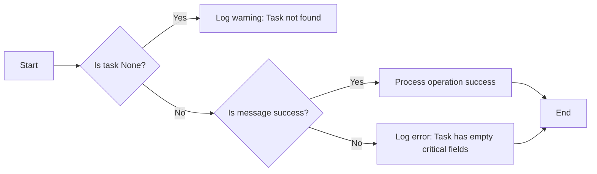

#### 带注释源码

```python
async def _handle_success(self, task: stream_registry.ActiveTask, message: OperationCompleteMessage) -> None:
    """Handle successful operation completion."""
    prisma = await self._ensure_prisma()
    await process_operation_success(task, message.result, prisma)
```


### `_handle_failure`

Handle failed operation completion.

参数：

- `task`：`stream_registry.ActiveTask`，The task associated with the operation that failed.
- `message`：`OperationCompleteMessage`，The message containing details about the failed operation.

返回值：`None`，No return value.

#### 流程图

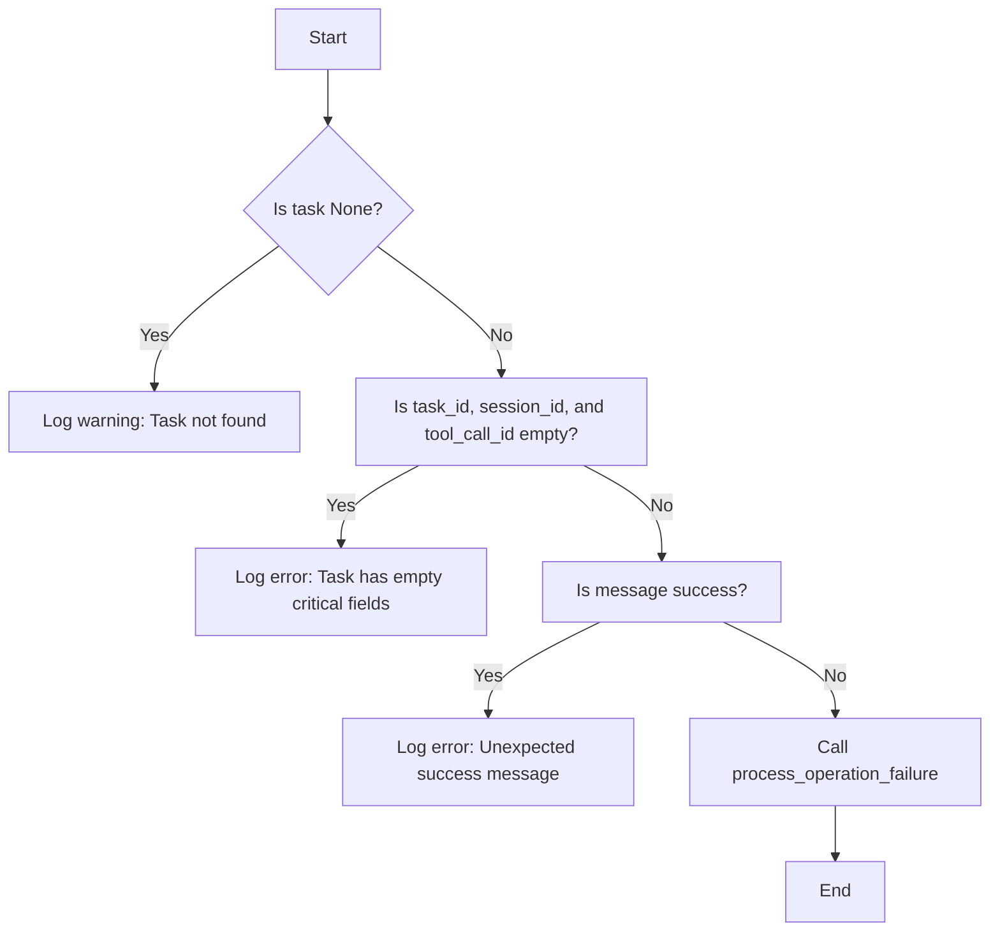

#### 带注释源码

```python
async def _handle_failure(self, task: stream_registry.ActiveTask, message: OperationCompleteMessage) -> None:
    """Handle failed operation completion."""
    prisma = await self._ensure_prisma()
    await process_operation_failure(task, message.error, prisma)
```


## 关键组件


### 张量索引与惰性加载

张量索引与惰性加载是代码中用于高效处理和存储大量数据的关键组件。它们允许在需要时才加载数据，从而减少内存消耗和提高性能。

### 反量化支持

反量化支持是代码中用于处理和转换数据的关键组件。它允许将数据从一种格式转换为另一种格式，以便进行进一步的处理和分析。

### 量化策略

量化策略是代码中用于优化数据处理过程的关键组件。它通过选择合适的量化方法来减少数据的大小，同时保持数据的准确性和完整性。


## 问题及建议


### 已知问题

-   **全局变量和类实例共享**: `_consumer` 作为全局变量，用于存储 `ChatCompletionConsumer` 的实例。这可能导致在多线程环境中出现竞争条件，因为 `start_completion_consumer` 和 `stop_completion_consumer` 函数可能会同时被调用。
-   **异常处理**: 代码中存在一些异常处理，但可能需要更详细的异常处理逻辑，特别是在 `start` 和 `_consume_messages` 方法中，这些方法可能会抛出异常，但没有明确说明如何处理这些异常。
-   **配置管理**: 代码中使用了 `ChatConfig` 类来管理配置，但配置的来源和变更管理没有详细说明，这可能导致配置管理上的困难。
-   **日志记录**: 代码中使用了 `logging` 模块进行日志记录，但没有明确说明日志级别和日志格式，这可能会影响日志的可读性和可管理性。
-   **代码重复**: `process_operation_success` 和 `process_operation_failure` 方法在 `ChatCompletionConsumer` 类中重复出现，可以考虑将其移动到单独的模块或类中，以减少代码重复。

### 优化建议

-   **线程安全**: 使用线程锁或其他同步机制来确保 `_consumer` 的线程安全。
-   **异常处理**: 在关键方法中添加更详细的异常处理逻辑，确保在发生异常时能够正确地记录错误信息并采取适当的恢复措施。
-   **配置管理**: 使用配置文件或环境变量来管理配置，并确保配置的变更能够被及时更新。
-   **日志记录**: 明确日志级别和日志格式，并考虑使用日志管理工具来集中管理日志。
-   **代码重构**: 将 `process_operation_success` 和 `process_operation_failure` 方法移动到单独的模块或类中，以减少代码重复并提高代码的可维护性。
-   **性能优化**: 考虑使用异步编程的最佳实践来提高代码的执行效率，例如使用 `asyncio` 模块的 `run_in_executor` 方法来避免阻塞操作。
-   **错误处理与异常设计**: 在处理消息时，确保对可能出现的错误进行适当的处理，例如在处理消息时捕获异常并记录错误信息。
-   **数据流与状态机**: 确保数据流和处理逻辑符合预期的状态机模型，以便于理解和维护。
-   **外部依赖与接口契约**: 明确外部依赖的版本和接口契约，以便于与其他组件集成。


## 其它


### 设计目标与约束

- **设计目标**:
  - 实现一个可靠的聊天操作完成消息消费者，用于从外部服务接收完成通知。
  - 确保消息处理的高效性和准确性。
  - 保持与现有基础设施（如Redis Streams）的兼容性。

- **约束**:
  - 必须使用Redis Streams进行消息传递。
  - 必须处理消息重连和消息重放。
  - 必须支持消费者组以实现负载均衡和故障恢复。

### 错误处理与异常设计

- **错误处理**:
  - 使用try-except块捕获和处理可能发生的异常。
  - 记录错误信息并采取适当的恢复措施，例如重试或停止消费者。

- **异常设计**:
  - 定义自定义异常类以处理特定错误情况。
  - 使用异常链来传递错误信息。

### 数据流与状态机

- **数据流**:
  - 消息从外部服务通过Redis Streams发送到消费者。
  - 消费者处理消息并更新数据库状态。

- **状态机**:
  - 定义任务状态机以跟踪任务从创建到完成的各个阶段。

### 外部依赖与接口契约

- **外部依赖**:
  - Redis Streams
  - Prisma ORM
  - Pydantic 数据验证

- **接口契约**:
  - 定义清晰的接口契约，包括输入参数和输出结果。
  - 确保接口的一致性和可维护性。


    