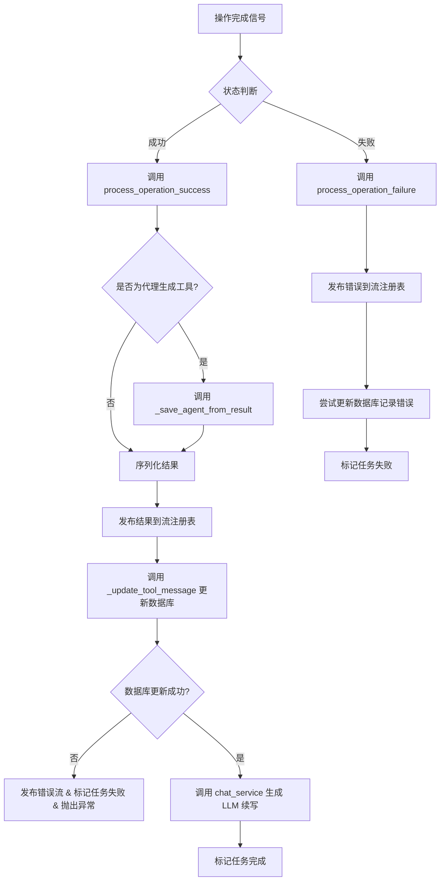
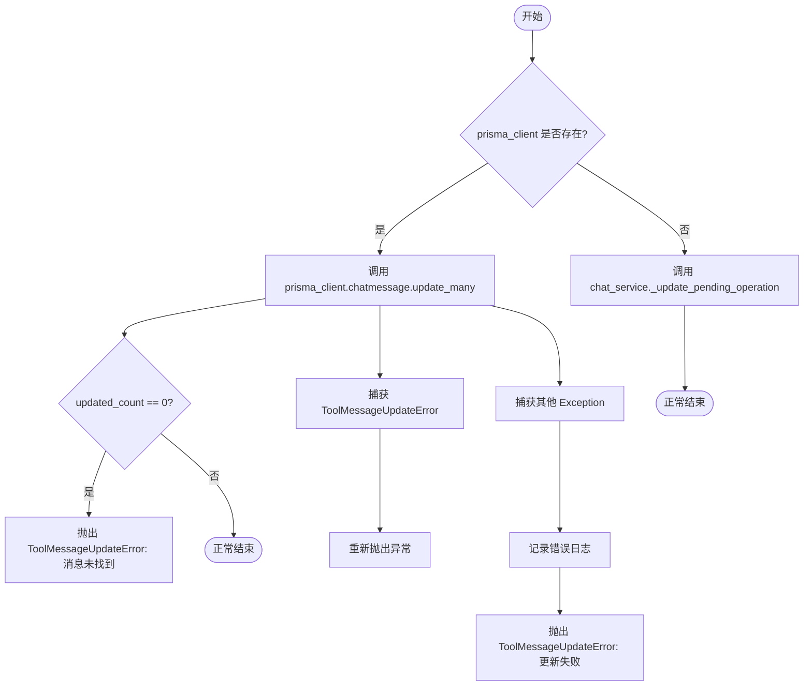
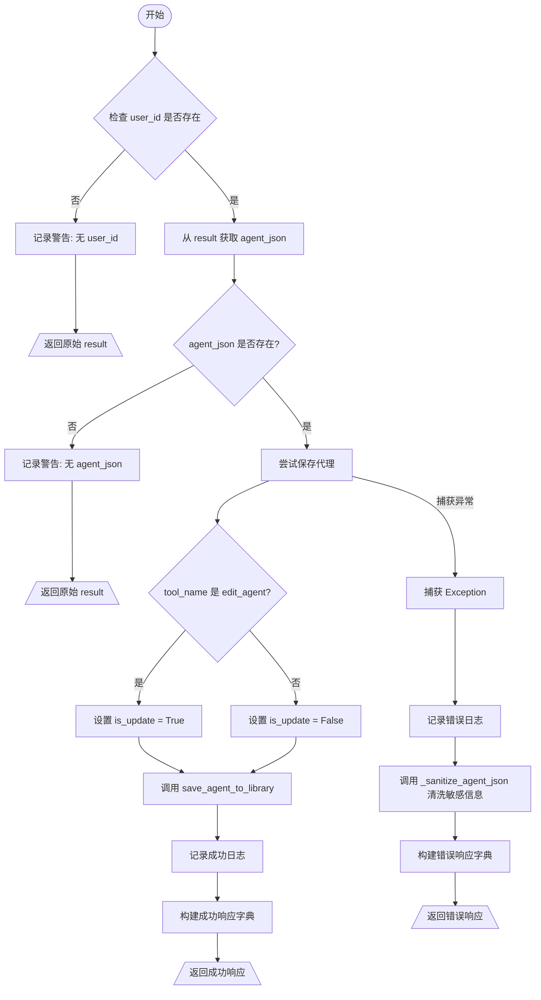
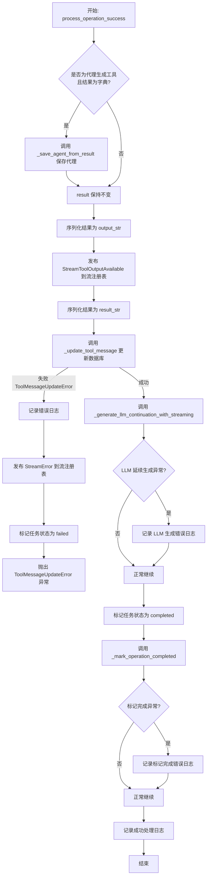
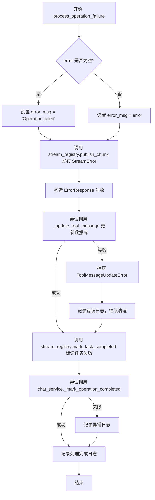

# `AutoGPT\autogpt_platform\backend\backend\api\features\chat\completion_handler.py` 详细设计文档

该代码提供了一个统一的处理逻辑，用于管理从 Redis Streams 消费者和 HTTP webhook 端点发起的操作的成功与失败完成，包括数据库更新、代理生成结果保存、流式输出发布和状态管理。

## 整体流程



## 类结构

```
Exception (内置基类)
└── ToolMessageUpdateError
```

## 全局变量及字段


### `AGENT_GENERATION_TOOLS`
    
A set containing the names of tools (e.g., 'create_agent', 'edit_agent') that generate agent_json which needs to be saved to the library.

类型：`set[str]`
    


### `SENSITIVE_KEYS`
    
A frozen set of keyword strings (e.g., 'api_key', 'password') that identify sensitive data to be redacted from agent_json before being returned in error responses.

类型：`frozenset[str]`
    


### `logger`
    
The module-level logger instance used for recording operational events, errors, and debugging information regarding completion handling.

类型：`logging.Logger`
    


    

## 全局函数及方法


### `_sanitize_agent_json`

递归清理 agent_json，通过移除敏感键以防止敏感信息泄露。

参数：

-   `obj`：`Any`，待清理的对象，可以是字典、列表或基本类型。

返回值：`Any`，已清理的副本，其中敏感键已被移除或替换为 "[REDACTED]"。

#### 流程图

```mermaid
flowchart TD
    A[开始: _sanitize_agent_json] --> B{obj 是字典 dict?}
    B -- 是 --> C[遍历 obj.items 键值对]
    C --> D{键 k 在 SENSITIVE_KEYS 中?}
    D -- 是 --> E[值设置为 [REDACTED]]
    D -- 否 --> F[递归调用 _sanitize_agent_json v]
    E --> G[构建新字典]
    F --> G
    G --> H[返回新字典]
    B -- 否 --> I{obj 是列表 list?}
    I -- 是 --> J[遍历列表中的每一项]
    J --> K[对每一项递归调用 _sanitize_agent_json]
    K --> L[返回新列表]
    I -- 否 --> M[返回原始对象 obj]
```

#### 带注释源码

```python
def _sanitize_agent_json(obj: Any) -> Any:
    """Recursively sanitize agent_json by removing sensitive keys.

    Args:
        obj: The object to sanitize (dict, list, or primitive)

    Returns:
        Sanitized copy with sensitive keys removed/redacted
    """
    # 检查输入对象是否为字典类型
    if isinstance(obj, dict):
        # 使用字典推导式创建新字典
        return {
            # 如果键（转为小写）存在于敏感键集合 SENSITIVE_KEYS 中，则将值替换为 "[REDACTED]"
            k: "[REDACTED]" if k.lower() in SENSITIVE_KEYS else _sanitize_agent_json(v)
            for k, v in obj.items()
        }
    # 检查输入对象是否为列表类型
    elif isinstance(obj, list):
        # 使用列表推导式，对列表中的每一项递归调用 _sanitize_agent_json 并返回新列表
        return [_sanitize_agent_json(item) for item in obj]
    # 如果是基本数据类型（如 str, int, None 等），直接返回原值
    else:
        return obj
```


### `_update_tool_message`

Update tool message in database.

参数：

-  `session_id`：`str`，The session ID
-  `tool_call_id`：`str`，The tool call ID to update
-  `content`：`str`，The new content for the message
-  `prisma_client`：`Prisma | None`，Optional Prisma client. If None, uses chat_service.

返回值：`None`，无返回值

#### 流程图



#### 带注释源码

```python
async def _update_tool_message(
    session_id: str,
    tool_call_id: str,
    content: str,
    prisma_client: Prisma | None,
) -> None:
    """Update tool message in database.

    Args:
        session_id: The session ID
        tool_call_id: The tool call ID to update
        content: The new content for the message
        prisma_client: Optional Prisma client. If None, uses chat_service.

    Raises:
        ToolMessageUpdateError: If the database update fails. The caller should
            handle this to avoid marking the task as completed with inconsistent state.
    """
    try:
        if prisma_client:
            # 情况1: 使用提供的 Prisma 客户端 (例如来自 Redis 消费者的独立连接)
            updated_count = await prisma_client.chatmessage.update_many(
                where={
                    "sessionId": session_id,
                    "toolCallId": tool_call_id,
                },
                data={"content": content},
            )
            # 检查是否有行被更新 - 0 表示消息未找到
            if updated_count == 0:
                raise ToolMessageUpdateError(
                    f"No message found with tool_call_id={tool_call_id} in session {session_id}"
                )
        else:
            # 情况2: 使用服务层函数 (例如来自 HTTP webhook 端点)
            await chat_service._update_pending_operation(
                session_id=session_id,
                tool_call_id=tool_call_id,
                result=content,
            )
    except ToolMessageUpdateError:
        # 捕获特定的更新错误并直接重新抛出
        raise
    except Exception as e:
        # 捕获其他所有异常，记录日志并包装为 ToolMessageUpdateError
        logger.error(f"[COMPLETION] Failed to update tool message: {e}", exc_info=True)
        raise ToolMessageUpdateError(
            f"Failed to update tool message for tool_call_id={tool_call_id}: {e}"
        ) from e
```


### `serialize_result`

将结果序列化为具有合理默认值的 JSON 字符串。

参数：

-  `result`：`dict | list | str | int | float | bool | None`，要序列化的结果。可以是字典、列表、字符串、数字、布尔值或 None。

返回值：`str`，结果的 JSON 字符串表示。仅当结果显式为 None 时返回 '{"status": "completed"}'。

#### 流程图

```mermaid
flowchart TD
    A[开始: 输入 result] --> B{result 是 str 类型?}
    B -- 是 --> C[直接返回 result]
    B -- 否 --> D{result 是 None?}
    D -- 是 --> E[返回 '{"status": "completed"}']
    D -- 否 --> F[使用 orjson.dumps 序列化 result]
    F --> G[将结果解码为 utf-8 字符串]
    G --> H[返回字符串]
```

#### 带注释源码

```python
def serialize_result(result: dict | list | str | int | float | bool | None) -> str:
    """Serialize result to JSON string with sensible defaults.

    Args:
        result: The result to serialize. Can be a dict, list, string,
            number, boolean, or None.

    Returns:
        JSON string representation of the result. Returns '{"status": "completed"}'
        only when result is explicitly None.
    """
    # 如果结果已经是字符串，则直接返回
    if isinstance(result, str):
        return result
    # 如果结果为 None，返回默认的完成状态 JSON 字符串
    if result is None:
        return '{"status": "completed"}'
    # 对于其他类型（dict, list 等），使用 orjson 序列化并解码为 UTF-8 字符串
    return orjson.dumps(result).decode("utf-8")
```


### `_save_agent_from_result`

该函数用于在操作结果中包含 `agent_json` 时，尝试将生成的代理配置保存到用户的代理库中。它会根据工具名称判断是创建还是更新代理，并返回包含保存详情或错误信息的响应字典。

参数：

-  `result`：`dict[str, Any]`，包含操作结果（可能包含 `agent_json`）的字典。
-  `user_id`：`str | None`，用于保存代理的用户 ID，如果为空则跳过保存。
-  `tool_name`：`str`，工具名称，用于判断是新建代理（`create_agent`）还是编辑代理（`edit_agent`）。

返回值：`dict[str, Any]`，如果成功，返回包含代理详细信息的成功字典；如果失败或数据不完整，返回原始结果或包含错误信息及清洗后敏感数据的字典。

#### 流程图



#### 带注释源码

```python
async def _save_agent_from_result(
    result: dict[str, Any],
    user_id: str | None,
    tool_name: str,
) -> dict[str, Any]:
    """Save agent to library if result contains agent_json.

    Args:
        result: The result dict that may contain agent_json
        user_id: The user ID to save the agent for
        tool_name: The tool name (create_agent or edit_agent)

    Returns:
        Updated result dict with saved agent details, or original result if no agent_json
    """
    # 1. 校验用户ID是否存在，如果不存在则无法保存，直接返回原结果
    if not user_id:
        logger.warning("[COMPLETION] Cannot save agent: no user_id in task")
        return result

    # 2. 从结果中提取 agent_json，如果不存在则无需保存，直接返回原结果
    agent_json = result.get("agent_json")
    if not agent_json:
        logger.warning(
            f"[COMPLETION] {tool_name} completed but no agent_json in result"
        )
        return result

    try:
        # 3. 导入保存代理的具体实现函数
        from .tools.agent_generator import save_agent_to_library

        # 4. 根据工具名称判断是更新还是新建操作
        is_update = tool_name == "edit_agent"
        
        # 5. 执行保存操作，获取生成的图对象和库代理对象
        created_graph, library_agent = await save_agent_to_library(
            agent_json, user_id, is_update=is_update
        )

        # 6. 记录成功日志
        logger.info(
            f"[COMPLETION] Saved agent '{created_graph.name}' to library "
            f"(graph_id={created_graph.id}, library_agent_id={library_agent.id})"
        )

        # 7. 构建并返回包含代理详细信息的成功响应
        return {
            "type": "agent_saved",
            "message": f"Agent '{created_graph.name}' has been saved to your library!",
            "agent_id": created_graph.id,
            "agent_name": created_graph.name,
            "library_agent_id": library_agent.id,
            "library_agent_link": f"/library/agents/{library_agent.id}",
            "agent_page_link": f"/build?flowID={created_graph.id}",
        }
    except Exception as e:
        # 8. 异常处理：记录错误日志
        logger.error(
            f"[COMPLETION] Failed to save agent to library: {e}",
            exc_info=True,
        )
        # 9. 返回错误响应，但不中断整个流程。
        # 注意：在返回前对 agent_json 进行清洗，移除敏感信息（如 API Key）
        return {
            "type": "error",
            "message": f"Agent was generated but failed to save: {str(e)}",
            "error": str(e),
            "agent_json": _sanitize_agent_json(agent_json),
        }
```


### `process_operation_success`

处理成功的操作完成，包括保存生成的代理（如果适用），将结果发布到流注册表，更新数据库记录，触发 LLM 继续对话，并标记任务为完成状态。

参数：

- `task`：`stream_registry.ActiveTask`，表示已完成操作的活跃任务对象。
- `result`：`dict | str | None`，操作执行返回的结果数据。
- `prisma_client`：`Prisma | None`，可选的 Prisma 数据库客户端，若为 None 则使用 `chat_service` 中的默认连接。

返回值：`None`，无返回值。

#### 流程图



#### 带注释源码

```python
async def process_operation_success(
    task: stream_registry.ActiveTask,
    result: dict | str | None,
    prisma_client: Prisma | None = None,
) -> None:
    """Handle successful operation completion.

    Publishes the result to the stream registry, updates the database,
    generates LLM continuation, and marks the task as completed.

    Args:
        task: The active task that completed
        result: The result data from the operation
        prisma_client: Optional Prisma client for database operations.
            If None, uses chat_service._update_pending_operation instead.

    Raises:
        ToolMessageUpdateError: If the database update fails. The task will be
            marked as failed instead of completed to avoid inconsistent state.
    """
    # 如果是代理生成工具且结果为字典，则保存代理到库
    if task.tool_name in AGENT_GENERATION_TOOLS and isinstance(result, dict):
        result = await _save_agent_from_result(result, task.user_id, task.tool_name)

    # 准备输出字符串（如果结果为 None 则替换为默认状态对象）
    result_output = result if result is not None else {"status": "completed"}
    output_str = (
        result_output
        if isinstance(result_output, str)
        else orjson.dumps(result_output).decode("utf-8")
    )

    # 将工具输出可用性事件发布到流注册表，通知前端
    await stream_registry.publish_chunk(
        task.task_id,
        StreamToolOutputAvailable(
            toolCallId=task.tool_call_id,
            toolName=task.tool_name,
            output=output_str,
            success=True,
        ),
    )

    # 将结果序列化为用于数据库存储的字符串
    result_str = serialize_result(result)
    try:
        # 更新数据库中的工具消息状态
        await _update_tool_message(
            session_id=task.session_id,
            tool_call_id=task.tool_call_id,
            content=result_str,
            prisma_client=prisma_client,
        )
    except ToolMessageUpdateError:
        # 数据库更新失败 - 记录错误并将任务标记为失败，以避免状态不一致
        logger.error(
            f"[COMPLETION] DB update failed for task {task.task_id}, "
            "marking as failed instead of completed"
        )
        await stream_registry.publish_chunk(
            task.task_id,
            StreamError(errorText="Failed to save operation result to database"),
        )
        await stream_registry.mark_task_completed(task.task_id, status="failed")
        raise

    # 尝试生成 LLM 后续响应并流式传输
    try:
        await chat_service._generate_llm_continuation_with_streaming(
            session_id=task.session_id,
            user_id=task.user_id,
            task_id=task.task_id,
        )
    except Exception as e:
        # 如果 LLM 继续生成失败，仅记录日志，不中断整体流程
        logger.error(
            f"[COMPLETION] Failed to generate LLM continuation: {e}",
            exc_info=True,
        )

    # 将任务标记为已完成并释放 Redis 锁
    await stream_registry.mark_task_completed(task.task_id, status="completed")
    try:
        # 标记底层操作为已完成
        await chat_service._mark_operation_completed(task.tool_call_id)
    except Exception as e:
        # 如果标记完成操作失败，记录错误
        logger.error(f"[COMPLETION] Failed to mark operation completed: {e}")

    # 记录成功处理完成的日志
    logger.info(
        f"[COMPLETION] Successfully processed completion for task {task.task_id}"
    )
```


### `process_operation_failure`

处理操作失败场景，负责向流注册表发布错误信息，更新数据库中的工具消息状态，并将任务标记为失败状态。

参数：

-  `task`：`stream_registry.ActiveTask`，发生失败操作的活跃任务对象。
-  `error`：`str | None`，操作产生的错误信息字符串。
-  `prisma_client`：`Prisma | None`，可选的数据库客户端。如果未提供，则使用 chat_service 进行更新。

返回值：`None`，无返回值。

#### 流程图



#### 带注释源码

```python
async def process_operation_failure(
    task: stream_registry.ActiveTask,
    error: str | None,
    prisma_client: Prisma | None = None,
) -> None:
    """Handle failed operation completion.

    Publishes the error to the stream registry, updates the database with
    the error response, and marks the task as failed.

    Args:
        task: The active task that failed
        error: The error message from the operation
        prisma_client: Optional Prisma client for database operations.
            If None, uses chat_service._update_pending_operation instead.
    """
    # 确定错误信息，如果未提供则使用默认值
    error_msg = error or "Operation failed"

    # 1. 向流注册表发布错误事件，通知客户端
    await stream_registry.publish_chunk(
        task.task_id,
        StreamError(errorText=error_msg),
    )

    # 2. 准备错误响应对象，包含错误详情
    error_response = ErrorResponse(
        message=error_msg,
        error=error,
    )
    
    # 3. 尝试更新数据库中的工具消息内容
    try:
        await _update_tool_message(
            session_id=task.session_id,
            tool_call_id=task.tool_call_id,
            content=error_response.model_dump_json(),
            prisma_client=prisma_client,
        )
    except ToolMessageUpdateError:
        # 4. 如果数据库更新失败，记录错误日志，但继续执行后续的清理流程（标记任务失败）
        logger.error(
            f"[COMPLETION] DB update failed while processing failure for task {task.task_id}, "
            "continuing with cleanup"
        )

    # 5. 将任务标记为失败（并释放 Redis 锁）
    await stream_registry.mark_task_completed(task.task_id, status="failed")
    
    # 6. 尝试标记底层操作为已完成（清理状态）
    try:
        await chat_service._mark_operation_completed(task.tool_call_id)
    except Exception as e:
        # 7. 清理过程中发生异常仅记录日志
        logger.error(f"[COMPLETION] Failed to mark operation completed: {e}")

    # 8. 记录处理完成的日志
    logger.info(f"[COMPLETION] Processed failure for task {task.task_id}: {error_msg}")
```


## 关键组件


### 敏感数据清洗机制
通过递归遍历对象并过滤预定义的敏感键（如 API 密钥、密码），确保在返回错误响应时不会泄露用户凭证等敏感信息。

### 数据库状态更新组件
封装了向数据库更新工具消息内容的逻辑，支持使用独立的 Prisma 客户端或服务层函数，并在更新失败时抛出特定异常以保持状态一致性。

### 结果序列化组件
将操作结果（字典、列表或原始类型）转换为 JSON 字符串，并为空结果提供默认的状态完成响应，确保输出格式的一致性。

### Agent 库持久化组件
专门用于处理 `create_agent` 或 `edit_agent` 等工具的执行结果，将生成的 Agent JSON 数据保存到库中并返回保存后的详细信息。

### 操作成功处理流程
协调操作成功后的完整生命周期，包括将结果发布到流注册表、更新数据库记录、触发 LLM 续写以及最终标记任务为完成状态。

### 操作失败处理流程
协调操作失败后的处理流程，包括向流注册表发布错误信息、更新数据库记录错误详情以及标记任务为失败状态。


## 问题及建议


### 已知问题

-   **循环导入变通方案**：函数 `_save_agent_from_result` 在函数体内部导入 `save_agent_to_library`，这表明 `completion_handler.py` 和 `tools.agent_generator` 之间存在循环依赖问题，这是一种架构异味。
-   **封装破坏与耦合**：代码直接访问 `chat_service` 的私有方法（以下划线开头的方法，如 `_update_pending_operation` 和 `_mark_operation_completed`）。这破坏了封装性，使得代码对 `chat_service` 模块的内部实现细节高度依赖，重构风险高。
-   **状态不一致风险（代理保存失败）**：在 `process_operation_success` 中，如果保存代理到库失败（`_save_agent_from_result` 捕获异常），该函数会返回一个包含错误信息的字典。然而，主流程仍将其作为成功结果处理（`StreamToolOutputAvailable(success=True)`），并写入数据库。这会导致工具执行标记为成功，但实际业务目标（保存代理）未达成，且将错误信息记录为成功内容。
-   **静默的 LLM 续写失败**：在 `process_operation_success` 中，调用 `chat_service._generate_llm_continuation_with_streaming` 失败时仅记录错误日志，不抛出异常或改变任务状态。这可能导致用户期望的后续对话生成被静默跳过，而用户无法感知。
-   **冗余的空值处理逻辑**：`process_operation_success` 中手动处理了 `result` 为 `None` 的情况（`result if result is not None else {"status": "completed"}`），而 `serialize_result` 函数内部已经包含了完全相同的逻辑（`if result is None: return '{"status": "completed"}'`），导致逻辑重复。

### 优化建议

-   **配置外部化**：将硬编码的全局常量 `AGENT_GENERATION_TOOLS` 和 `SENSITIVE_KEYS` 移至配置文件（如 `config.py` 或环境变量）中，以便在无需修改代码的情况下进行维护和扩展。
-   **统一数据库访问层**：重构 `_update_tool_message` 的实现，避免使用 `prisma_client | None` 的可选参数模式来切换不同的数据源（直接 Prisma 客户端 vs Service 层）。建议使用依赖注入或上下文管理器模式，明确当前应使用的数据库连接上下文。
-   **增强反序列化安全性**：在 `_sanitize_agent_json` 函数中增加递归深度检查或对象大小限制，防止处理恶意构造的超大或超深嵌套 JSON 对象时导致堆栈溢出或性能耗尽。
-   **提取公共流处理逻辑**：`process_operation_success` 和 `process_operation_failure` 中均包含向 `stream_registry` 发布消息和调用 `mark_task_completed` 的逻辑。建议将这些通用的步骤提取为装饰器或辅助函数（如 `finalize_task`），以减少代码重复并确保操作流程的一致性。
-   **改进错误响应结构**：在 `_save_agent_from_result` 返回错误结果时，或者在 `process_operation_failure` 中，建议使用标准化的错误码而不仅仅是字符串消息，以便前端或其他消费者能够编程式地处理不同类型的错误。


## 其它


### 设计目标与约束

1.  **数据一致性优先**：这是系统的核心设计目标。在处理操作成功时，数据库的更新是关键路径。如果数据库更新失败，系统必须回滚任务状态，将其标记为失败，而不是成功，以防止前端显示成功但后端数据未保存的不一致状态。
2.  **安全性**：系统必须严格防止敏感信息泄露。通过 `_sanitize_agent_json` 函数，确保在日志记录或错误返回中，包含 API Key、密码等敏感字段的 `agent_json` 会被自动脱敏。
3.  **模块解耦与复用**：该模块设计为被 Redis 消费者和 HTTP Webhook 两个不同的入口点调用。为了适应不同的上下文环境（如消费者可能有独立的数据库连接，Webhook 使用共享服务），数据库更新逻辑支持注入可选的 `Prisma` 客户端实例。
4.  **异步非阻塞**：所有涉及 I/O（数据库、网络流、LLM 生成）的操作均使用 `async/await` 模式，确保在高并发场景下不会阻塞事件循环。
5.  **容错性**：对于非关键路径的失败（如 LLM 续生成失败、最终状态标记释放锁失败），系统记录错误但不中断主流程，确保核心的“结果保存”和“任务状态标记”完成。

### 错误处理与异常设计

1.  **自定义异常**：定义了 `ToolMessageUpdateError`，专门用于封装数据库更新过程中的失败。这是一个受检异常（在逻辑意义上），用于向调用者明确指示数据持久化阶段出现了问题。
2.  **关键路径异常处理**：
    *   在 `process_operation_success` 中，如果 `_update_tool_message` 抛出 `ToolMessageUpdateError`，系统会立即进入“回滚”逻辑：
        *   向流注册表发布错误信息。
        *   将任务状态显式标记为 `failed`。
        *   重新抛出异常，终止后续处理。
3.  **非关键路径异常处理**：
    *   在 `process_operation_success` 中，`_generate_llm_continuation_with_streaming` 的失败仅记录日志，不影响任务成功状态。
    *   在 `process_operation_failure` 中，数据库更新失败被视为非致命错误（因为任务本身已失败），仅记录日志，继续执行清理和标记任务结束的操作。
4.  **异常转换**：底层的数据库操作或其他异常（如 `Exception`）被捕获并转换为特定领域的异常（如 `ToolMessageUpdateError`），同时保留原始堆栈信息以便调试。

### 数据流与状态机

1.  **成功处理流**：
    *   **输入**：`ActiveTask` 和 `result` 数据。
    *   **预处理**：检查工具类型，如果是 `create_agent/edit_agent`，调用 `_save_agent_from_result` 保存 Agent 到库并更新 result。
    *   **序列化**：将 result 序列化为 JSON 字符串。
    *   **通知**：通过 `stream_registry.publish_chunk` 推送 `StreamToolOutputAvailable` 事件。
    *   **持久化**：调用 `_update_tool_message` 更新数据库。**（关键检查点）**
    *   **分支**：
        *   若持久化失败：切换至失败处理流，推送错误，标记状态为 `failed`。
        *   若持久化成功：调用 LLM 续生成服务，然后标记状态为 `completed`。
2.  **失败处理流**：
    *   **输入**：`ActiveTask` 和 `error` 消息。
    *   **通知**：通过 `stream_registry.publish_chunk` 推送 `StreamError` 事件。
    *   **持久化**：尝试更新数据库存储错误信息（允许失败）。
    *   **清理**：标记任务状态为 `failed`，释放相关锁。
3.  **状态机**：
    *   任务状态主要从 `Active`（由 `ActiveTask` 隐含）转换到终态。
    *   终态有两个：`completed` 和 `failed`。
    *   一旦进入 `failed` 状态（无论是由于操作初始失败，还是处理过程中的 DB 更新失败），不可逆。

### 外部依赖与接口契约

1.  **Prisma (ORM)**：
    *   **契约**：提供 `update_many` 方法用于数据持久化。期望数据库中有 `ChatMessage` 表，包含 `sessionId`、`toolCallId` 和 `content` 字段。支持异步操作。
2.  **stream_registry (内部模块)**：
    *   **`publish_chunk(task_id, chunk)`**：用于将操作结果或错误实时推送到前端流。要求 `chunk` 必须是 Pydantic 模型（如 `StreamToolOutputAvailable`, `StreamError`）。
    *   **`mark_task_completed(task_id, status)`**：用于更新任务的最终状态并释放 Redis 分布式锁。`status` 只能是 "completed" 或 "failed"。
3.  **chat_service (内部模块)**：
    *   **`_update_pending_operation(...)`**：备用的数据库更新方法，当未提供独立 `Prisma` 客户端时使用。
    *   **`_generate_llm_continuation_with_streaming(...)`**：用于在工具执行成功后触发 LLM 的后续生成。
    *   **`_mark_operation_completed(tool_call_id)`**：用于清理操作级别的标记。
4.  **orjson (第三方库)**：
    *   **契约**：用于高性能的 JSON 序列化（`dumps`）和反序列化，要求输出为 UTF-8 字符串。
5.  **tools.agent_generator (内部模块)**：
    *   **`save_agent_to_library(...)`**：处理 Agent 的创建或更新逻辑。返回 `created_graph` 和 `library_agent` 对象。

    