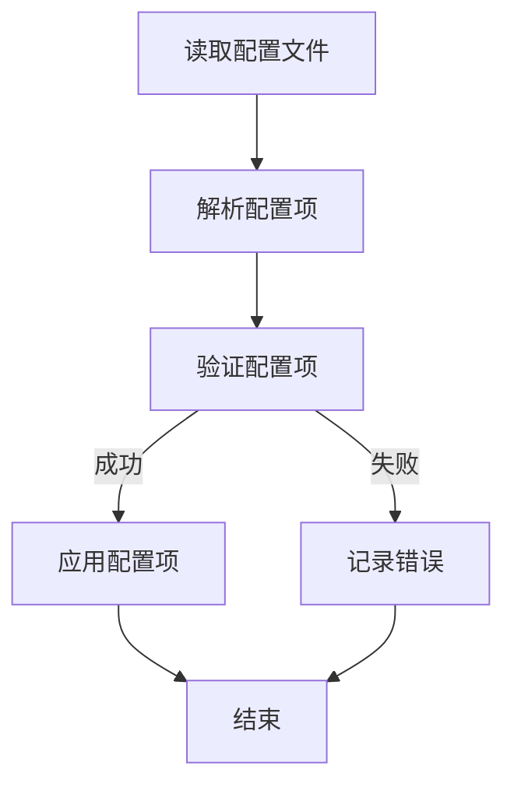
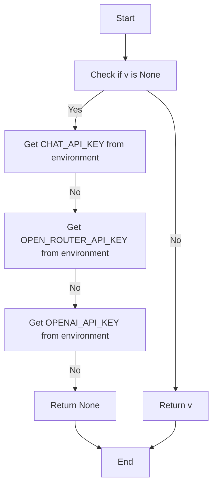

# `.\AutoGPT\autogpt_platform\backend\backend\api\features\chat\config.py` 详细设计文档

This file provides configuration management for a chat system, including API keys, model configurations, session TTLs, and other settings.

## 整体流程



## 类结构

```
ChatConfig (配置类)
```

## 全局变量及字段


### `model`
    
Default model to use

类型：`str`
    


### `title_model`
    
Model to use for generating session titles (should be fast/cheap)

类型：`str`
    


### `api_key`
    
OpenAI API key

类型：`str | None`
    


### `base_url`
    
Base URL for API (e.g., for OpenRouter)

类型：`str | None`
    


### `session_ttl`
    
Session TTL in seconds

类型：`int`
    


### `max_context_messages`
    
Maximum context messages

类型：`int`
    


### `stream_timeout`
    
Stream timeout in seconds

类型：`int`
    


### `max_retries`
    
Maximum number of retries

类型：`int`
    


### `max_agent_runs`
    
Maximum number of agent runs

类型：`int`
    


### `max_agent_schedules`
    
Maximum number of agent schedules

类型：`int`
    


### `long_running_operation_ttl`
    
TTL in seconds for long-running operation tracking in Redis (safety net if pod dies)

类型：`int`
    


### `stream_ttl`
    
TTL in seconds for stream data in Redis (1 hour)

类型：`int`
    


### `stream_max_length`
    
Maximum number of messages to store per stream

类型：`int`
    


### `stream_completion_name`
    
Redis Stream name for operation completions

类型：`str`
    


### `stream_consumer_group`
    
Consumer group name for completion stream

类型：`str`
    


### `stream_claim_min_idle_ms`
    
Minimum idle time in milliseconds before claiming pending messages from dead consumers

类型：`int`
    


### `task_meta_prefix`
    
Prefix for task metadata hash keys

类型：`str`
    


### `task_stream_prefix`
    
Prefix for task message stream keys

类型：`str`
    


### `task_op_prefix`
    
Prefix for operation ID to task ID mapping keys

类型：`str`
    


### `internal_api_key`
    
API key for internal webhook callbacks (env: CHAT_INTERNAL_API_KEY)

类型：`str | None`
    


### `langfuse_prompt_name`
    
Name of the prompt in Langfuse to fetch

类型：`str`
    


### `thinking_enabled`
    
Enable adaptive thinking for Claude models via OpenRouter

类型：`bool`
    


### `PROMPT_PATHS`
    
Prompt paths for different contexts

类型：`dict[str, str]`
    


### `ChatConfig.model`
    
Default model to use

类型：`str`
    


### `ChatConfig.title_model`
    
Model to use for generating session titles (should be fast/cheap)

类型：`str`
    


### `ChatConfig.api_key`
    
OpenAI API key

类型：`str | None`
    


### `ChatConfig.base_url`
    
Base URL for API (e.g., for OpenRouter)

类型：`str | None`
    


### `ChatConfig.session_ttl`
    
Session TTL in seconds

类型：`int`
    


### `ChatConfig.max_context_messages`
    
Maximum context messages

类型：`int`
    


### `ChatConfig.stream_timeout`
    
Stream timeout in seconds

类型：`int`
    


### `ChatConfig.max_retries`
    
Maximum number of retries

类型：`int`
    


### `ChatConfig.max_agent_runs`
    
Maximum number of agent runs

类型：`int`
    


### `ChatConfig.max_agent_schedules`
    
Maximum number of agent schedules

类型：`int`
    


### `ChatConfig.long_running_operation_ttl`
    
TTL in seconds for long-running operation tracking in Redis (safety net if pod dies)

类型：`int`
    


### `ChatConfig.stream_ttl`
    
TTL in seconds for stream data in Redis (1 hour)

类型：`int`
    


### `ChatConfig.stream_max_length`
    
Maximum number of messages to store per stream

类型：`int`
    


### `ChatConfig.stream_completion_name`
    
Redis Stream name for operation completions

类型：`str`
    


### `ChatConfig.stream_consumer_group`
    
Consumer group name for completion stream

类型：`str`
    


### `ChatConfig.stream_claim_min_idle_ms`
    
Minimum idle time in milliseconds before claiming pending messages from dead consumers

类型：`int`
    


### `ChatConfig.task_meta_prefix`
    
Prefix for task metadata hash keys

类型：`str`
    


### `ChatConfig.task_stream_prefix`
    
Prefix for task message stream keys

类型：`str`
    


### `ChatConfig.task_op_prefix`
    
Prefix for operation ID to task ID mapping keys

类型：`str`
    


### `ChatConfig.internal_api_key`
    
API key for internal webhook callbacks (env: CHAT_INTERNAL_API_KEY)

类型：`str | None`
    


### `ChatConfig.langfuse_prompt_name`
    
Name of the prompt in Langfuse to fetch

类型：`str`
    


### `ChatConfig.thinking_enabled`
    
Enable adaptive thinking for Claude models via OpenRouter

类型：`bool`
    


### `ChatConfig.PROMPT_PATHS`
    
Prompt paths for different contexts

类型：`dict[str, str]`
    
    

## 全局函数及方法


### ChatConfig.get_api_key

Get the API key for the chat system from environment variables or default values.

参数：

- `v`：`str | None`，The current value of the `api_key` field.

返回值：`str | None`，The API key for the chat system.

#### 流程图



#### 带注释源码

```python
@field_validator("api_key", mode="before")
@classmethod
def get_api_key(cls, v):
    """Get API key from environment if not provided."""
    if v is None:
        # Try to get from environment variables
        # First check for CHAT_API_KEY (Pydantic prefix)
        v = os.getenv("CHAT_API_KEY")
        if not v:
            # Fall back to OPEN_ROUTER_API_KEY
            v = os.getenv("OPEN_ROUTER_API_KEY")
        if not v:
            # Fall back to OPENAI_API_KEY
            v = os.getenv("OPENAI_API_KEY")
    return v
```


### ChatConfig.get_base_url

Get the base URL for the chat system from environment variables or default to a predefined value.

参数：

- `v`：`str | None`，The current value of the base URL field.

返回值：`str`，The base URL for the chat system.

#### 流程图

```mermaid
graph TD
    A[Start] --> B{Check if v is None}
    B -- Yes --> C[Set v to CHAT_BASE_URL]
    B -- No --> D{Check if CHAT_BASE_URL is set}
    D -- Yes --> E[Set v to CHAT_BASE_URL]
    D -- No --> F{Check if OPENROUTER_BASE_URL is set}
    F -- Yes --> G[Set v to OPENROUTER_BASE_URL]
    F -- No --> H{Check if OPENAI_BASE_URL is set}
    H -- Yes --> I[Set v to OPENAI_BASE_URL]
    H -- No --> J[Set v to "https://openrouter.ai/api/v1"]
    J --> K[End]
```

#### 带注释源码

```python
@field_validator("base_url", mode="before")
@classmethod
def get_base_url(cls, v):
    """Get base URL from environment if not provided."""
    if v is None:
        # Check for OpenRouter or custom base URL
        v = os.getenv("CHAT_BASE_URL")
        if not v:
            v = os.getenv("OPENROUTER_BASE_URL")
            if not v:
                v = os.getenv("OPENAI_BASE_URL")
                if not v:
                    v = "https://openrouter.ai/api/v1"
    return v
``` 


### ChatConfig.get_internal_api_key

This method retrieves the internal API key for webhook callbacks if not provided.

参数：

- `v`：`str | None`，The current value of the internal API key.

返回值：`str | None`，The internal API key for webhook callbacks.

#### 流程图

```mermaid
graph TD
    A[Start] --> B{Is v None?}
    B -- Yes --> C[Set v to os.getenv("CHAT_INTERNAL_API_KEY")]
    B -- No --> D[Return v]
    C --> E[End]
    D --> E
```

#### 带注释源码

```python
    @field_validator("internal_api_key", mode="before")
    @classmethod
    def get_internal_api_key(cls, v):
        """Get internal API key from environment if not provided."""
        if v is None:
            v = os.getenv("CHAT_INTERNAL_API_KEY")
        return v
```

## 关键组件


### 张量索引与惰性加载

张量索引与惰性加载是用于高效处理和存储大量数据的技术，通过延迟计算和按需加载数据来优化性能。

### 反量化支持

反量化支持是指系统能够处理和转换不同量化的数据，以适应不同的计算环境和需求。

### 量化策略

量化策略是用于优化模型性能和资源使用的技术，通过减少模型参数的精度来降低计算复杂度和内存占用。


## 问题及建议


### 已知问题

-   **环境变量依赖**: 代码中大量使用环境变量来获取配置信息，这可能导致配置管理复杂且难以追踪。如果环境变量未正确设置，可能会导致配置错误。
-   **默认值设置**: 代码中某些字段设置了默认值，但这些默认值可能不是最佳实践，特别是在生产环境中。应该根据实际需求来设置默认值。
-   **字段验证**: 虽然使用了`field_validator`来验证某些字段，但可能还有其他字段需要验证以确保数据的有效性。
-   **代码重复**: `get_api_key`、`get_base_url`和`get_internal_api_key`方法在功能上相似，存在代码重复的问题。

### 优化建议

-   **配置管理**: 考虑使用配置文件或配置管理系统来管理配置，这样可以更容易地追踪和修改配置。
-   **默认值审查**: 审查并验证所有默认值，确保它们符合生产环境的需求。
-   **字段验证**: 扩展字段验证逻辑，确保所有必要的数据都经过验证。
-   **代码重构**: 重构重复的代码，例如将`get_api_key`、`get_base_url`和`get_internal_api_key`方法合并为一个通用方法。
-   **文档**: 为配置字段提供更详细的文档，包括每个字段的用途、默认值和可能的值范围。
-   **异常处理**: 增加异常处理逻辑，以处理配置错误或环境变量未设置的情况。


## 其它


### 设计目标与约束

- 设计目标：
  - 提供一个统一的配置管理接口，用于管理聊天系统的各种配置。
  - 支持从环境变量中读取配置，以便于配置的灵活性和安全性。
  - 使用Pydantic库来验证配置的有效性，确保配置的准确性。
- 约束：
  - 配置项应遵循RESTful API设计原则，易于扩展和维护。
  - 配置项应支持默认值，以便于快速部署和测试。
  - 配置项应支持环境变量覆盖，以便于不同环境下的配置差异。

### 错误处理与异常设计

- 错误处理：
  - 当配置项无效时，应抛出异常，并提供清晰的错误信息。
  - 当环境变量未设置时，应提供默认值或抛出异常。
- 异常设计：
  - 使用自定义异常类来处理特定的错误情况，例如配置错误、环境变量错误等。
  - 异常类应提供详细的错误信息和堆栈跟踪，以便于问题的诊断和修复。

### 数据流与状态机

- 数据流：
  - 配置数据从环境变量读取，并通过Pydantic进行验证和解析。
  - 验证后的配置数据存储在内存中，供系统使用。
- 状态机：
  - 系统在启动时读取配置，并在配置发生变化时重新加载配置。
  - 系统在运行过程中，根据配置进行相应的操作。

### 外部依赖与接口契约

- 外部依赖：
  - Pydantic库：用于配置验证和解析。
  - os库：用于读取环境变量。
- 接口契约：
  - 配置接口：提供统一的配置管理接口。
  - 环境变量接口：提供环境变量读取接口。


    