# `.\AutoGPT\autogpt_platform\backend\backend\api\features\chat\db.py` 详细设计文档

This file contains asynchronous database operations for managing chat sessions, including creating, updating, and retrieving chat sessions and their messages.

## 整体流程

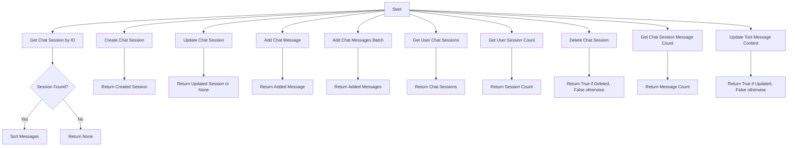

## 类结构

```
ChatSessionOperations (主模块)
├── PrismaChatSession (Prisma ORM 模型)
│   ├── id (str)
│   ├── userId (str)
│   ├── credentials (SafeJson)
│   ├── successfulAgentRuns (SafeJson)
│   ├── successfulAgentSchedules (SafeJson)
│   ├── totalPromptTokens (int)
│   ├── totalCompletionTokens (int)
│   └── title (str)
│   └── Messages (PrismaChatMessage, 一对多关系)
└── PrismaChatMessage (Prisma ORM 模型)
    ├── id (str)
    ├── Session (PrismaChatSession, 外键)
    ├── role (str)
    ├── sequence (int)
    ├── content (str)
    ├── name (str)
    ├── toolCallId (str)
    ├── refusal (str)
    ├── toolCalls (SafeJson)
    └── functionCall (SafeJson)
```

## 全局变量及字段


### `logger`
    
Logger instance for logging messages.

类型：`logging.Logger`
    


### `SafeJson`
    
Utility class for safely serializing and deserializing JSON data.

类型：`backend.util.json.SafeJson`
    


### `PrismaChatSession.id`
    
Unique identifier for the chat session.

类型：`str`
    


### `PrismaChatSession.userId`
    
Identifier for the user associated with the chat session.

类型：`str`
    


### `PrismaChatSession.credentials`
    
Credentials associated with the chat session.

类型：`SafeJson`
    


### `PrismaChatSession.successfulAgentRuns`
    
Successful agent runs associated with the chat session.

类型：`SafeJson`
    


### `PrismaChatSession.successfulAgentSchedules`
    
Successful agent schedules associated with the chat session.

类型：`SafeJson`
    


### `PrismaChatSession.totalPromptTokens`
    
Total prompt tokens used in the chat session.

类型：`int`
    


### `PrismaChatSession.totalCompletionTokens`
    
Total completion tokens used in the chat session.

类型：`int`
    


### `PrismaChatSession.title`
    
Title of the chat session.

类型：`str`
    


### `PrismaChatSession.Messages`
    
List of chat messages associated with the chat session.

类型：`list[PrismaChatMessage]`
    


### `PrismaChatMessage.id`
    
Unique identifier for the chat message.

类型：`str`
    


### `PrismaChatMessage.Session`
    
Reference to the chat session the message belongs to.

类型：`PrismaChatSession`
    


### `PrismaChatMessage.role`
    
Role of the message sender.

类型：`str`
    


### `PrismaChatMessage.sequence`
    
Sequence number of the message within the chat session.

类型：`int`
    


### `PrismaChatMessage.content`
    
Content of the chat message.

类型：`str`
    


### `PrismaChatMessage.name`
    
Name associated with the message.

类型：`str`
    


### `PrismaChatMessage.toolCallId`
    
Identifier for the tool call associated with the message.

类型：`str`
    


### `PrismaChatMessage.refusal`
    
Refusal reason associated with the message.

类型：`str`
    


### `PrismaChatMessage.toolCalls`
    
Tool calls associated with the message.

类型：`SafeJson`
    


### `PrismaChatMessage.functionCall`
    
Function call associated with the message.

类型：`SafeJson`
    
    

## 全局函数及方法

### get_chat_session

Get a chat session by ID from the database.

参数：

- `session_id`：`str`，The ID of the chat session to retrieve.

返回值：`PrismaChatSession | None`，The retrieved chat session or `None` if not found.

#### 流程图

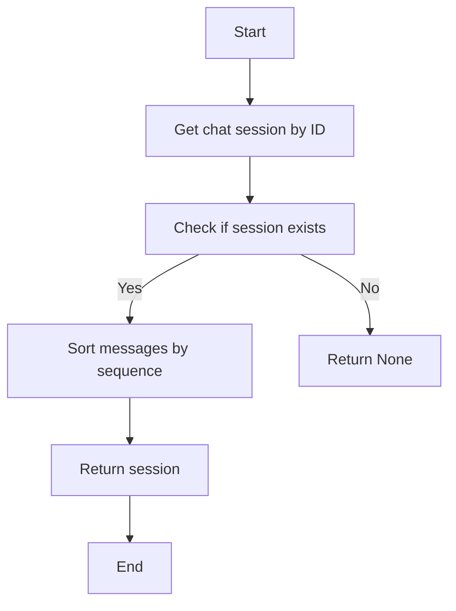

#### 带注释源码

```python
async def get_chat_session(session_id: str) -> PrismaChatSession | None:
    """Get a chat session by ID from the database."""
    session = await PrismaChatSession.prisma().find_unique(
        where={"id": session_id},
        include={"Messages": True},
    )
    if session and session.Messages:
        # Sort messages by sequence in Python - Prisma Python client doesn't support
        # order_by in include clauses (unlike Prisma JS), so we sort after fetching
        session.Messages.sort(key=lambda m: m.sequence)
    return session
```

### create_chat_session

Create a new chat session in the database.

参数：

- `session_id`：`str`，The unique identifier for the chat session.
- `user_id`：`str`，The identifier for the user associated with the chat session.

返回值：`PrismaChatSession`，The created chat session object.

#### 流程图

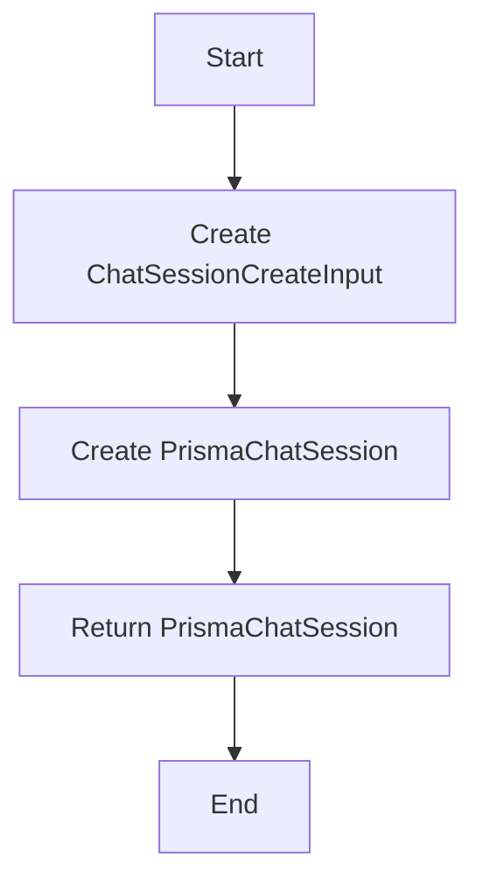

#### 带注释源码

```python
async def create_chat_session(
    session_id: str,
    user_id: str,
) -> PrismaChatSession:
    """Create a new chat session in the database."""
    data = ChatSessionCreateInput(
        id=session_id,
        userId=user_id,
        credentials=SafeJson({}),
        successfulAgentRuns=SafeJson({}),
        successfulAgentSchedules=SafeJson({}),
    )
    return await PrismaChatSession.prisma().create(data=data)
```

### update_chat_session

更新聊天会话的元数据。

#### 参数

- `session_id`：`str`，会话的唯一标识符。
- `credentials`：`dict[str, Any] | None`，可选，会话的凭据信息。
- `successful_agent_runs`：`dict[str, Any] | None`，可选，成功的代理运行信息。
- `successful_agent_schedules`：`dict[str, Any] | None`，可选，成功的代理调度信息。
- `total_prompt_tokens`：`int | None`，可选，总的提示令牌数。
- `total_completion_tokens`：`int | None`，可选，总的完成令牌数。
- `title`：`str | None`，可选，会话的标题。

#### 返回值

- `PrismaChatSession | None`，更新后的会话对象，如果没有找到会话则返回 `None`。

#### 流程图

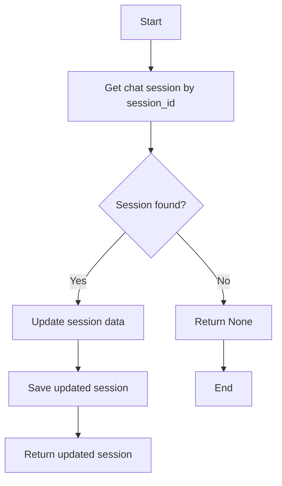

#### 带注释源码

```python
async def update_chat_session(
    session_id: str,
    credentials: dict[str, Any] | None = None,
    successful_agent_runs: dict[str, Any] | None = None,
    successful_agent_schedules: dict[str, Any] | None = None,
    total_prompt_tokens: int | None = None,
    total_completion_tokens: int | None = None,
    title: str | None = None,
) -> PrismaChatSession | None:
    """Update a chat session's metadata."""
    data: ChatSessionUpdateInput = {"updatedAt": datetime.now(UTC)}

    if credentials is not None:
        data["credentials"] = SafeJson(credentials)
    if successful_agent_runs is not None:
        data["successfulAgentRuns"] = SafeJson(successful_agent_runs)
    if successful_agent_schedules is not None:
        data["successfulAgentSchedules"] = SafeJson(successful_agent_schedules)
    if total_prompt_tokens is not None:
        data["totalPromptTokens"] = total_prompt_tokens
    if total_completion_tokens is not None:
        data["totalCompletionTokens"] = total_completion_tokens
    if title is not None:
        data["title"] = title

    session = await PrismaChatSession.prisma().update(
        where={"id": session_id},
        data=data,
        include={"Messages": True},
    )
    if session and session.Messages:
        # Sort in Python - Prisma Python doesn't support order_by in include clauses
        session.Messages.sort(key=lambda m: m.sequence)
    return session
```

### add_chat_message

Add a message to a chat session.

参数：

- `session_id`：`str`，The ID of the chat session to which the message is to be added.
- `role`：`str`，The role of the message sender.
- `sequence`：`int`，The sequence number of the message within the chat session.
- `content`：`str | None`，The content of the message. Optional.
- `name`：`str | None`，The name of the message sender. Optional.
- `tool_call_id`：`str | None`，The ID of the tool call associated with the message. Optional.
- `refusal`：`str | None`，The reason for refusal, if applicable. Optional.
- `tool_calls`：`list[dict[str, Any]] | None`，The tool calls associated with the message. Optional.
- `function_call`：`dict[str, Any] | None`，The function call associated with the message. Optional.

返回值：`PrismaChatMessage`，The created chat message.

#### 流程图

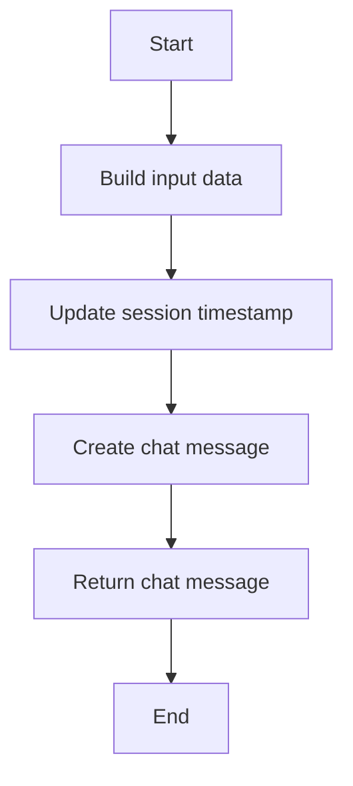

#### 带注释源码

```python
async def add_chat_message(
    session_id: str,
    role: str,
    sequence: int,
    content: str | None = None,
    name: str | None = None,
    tool_call_id: str | None = None,
    refusal: str | None = None,
    tool_calls: list[dict[str, Any]] | None = None,
    function_call: dict[str, Any] | None = None,
) -> PrismaChatMessage:
    """Add a message to a chat session."""
    # Build input dict dynamically rather than using ChatMessageCreateInput directly
    # because Prisma's TypedDict validation rejects optional fields set to None.
    # We only include fields that have values, then cast at the end.
    data: dict[str, Any] = {
        "Session": {"connect": {"id": session_id}},
        "role": role,
        "sequence": sequence,
    }

    # Add optional string fields
    if content is not None:
        data["content"] = content
    if name is not None:
        data["name"] = name
    if tool_call_id is not None:
        data["toolCallId"] = tool_call_id
    if refusal is not None:
        data["refusal"] = refusal

    # Add optional JSON fields only when they have values
    if tool_calls is not None:
        data["toolCalls"] = SafeJson(tool_calls)
    if function_call is not None:
        data["functionCall"] = SafeJson(function_call)

    # Run message create and session timestamp update in parallel for lower latency
    _, message = await asyncio.gather(
        PrismaChatSession.prisma().update(
            where={"id": session_id},
            data={"updatedAt": datetime.now(UTC)},
        ),
        PrismaChatMessage.prisma().create(data=cast(ChatMessageCreateInput, data)),
    )
    return message
```

### add_chat_messages_batch

Add multiple messages to a chat session in a batch.

参数：

- `session_id`：`str`，The ID of the chat session to add messages to.
- `messages`：`list[dict[str, Any]]`，A list of message dictionaries to add to the chat session.
- `start_sequence`：`int`，The starting sequence number for the messages.

返回值：`list[PrismaChatMessage]`，A list of created PrismaChatMessage objects.

#### 流程图

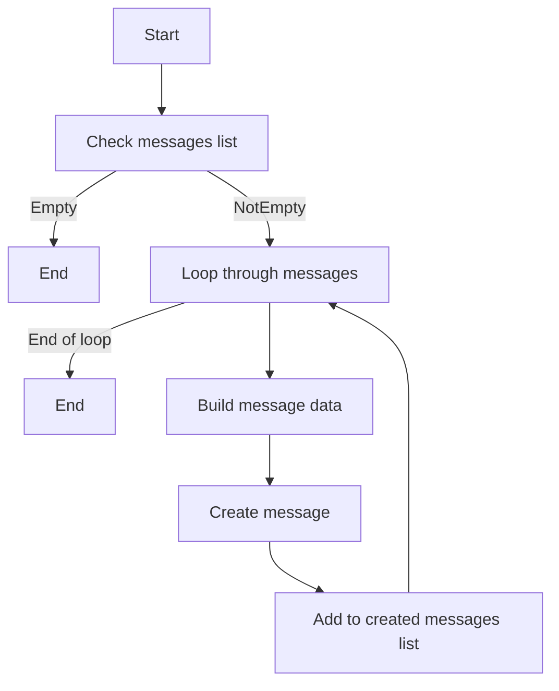

#### 带注释源码

```python
async def add_chat_messages_batch(
    session_id: str,
    messages: list[dict[str, Any]],
    start_sequence: int,
) -> list[PrismaChatMessage]:
    """Add multiple messages to a chat session in a batch.

    Uses a transaction for atomicity - if any message creation fails,
    the entire batch is rolled back.
    """
    if not messages:
        return []

    created_messages = []

    async with transaction() as tx:
        for i, msg in enumerate(messages):
            # Build input dict dynamically rather than using ChatMessageCreateInput
            # directly because Prisma's TypedDict validation rejects optional fields
            # set to None. We only include fields that have values, then cast.
            data: dict[str, Any] = {
                "Session": {"connect": {"id": session_id}},
                "role": msg["role"],
                "sequence": start_sequence + i,
            }

            # Add optional string fields
            if msg.get("content") is not None:
                data["content"] = msg["content"]
            if msg.get("name") is not None:
                data["name"] = msg["name"]
            if msg.get("tool_call_id") is not None:
                data["toolCallId"] = msg["tool_call_id"]
            if msg.get("refusal") is not None:
                data["refusal"] = msg["refusal"]

            # Add optional JSON fields only when they have values
            if msg.get("tool_calls") is not None:
                data["toolCalls"] = SafeJson(msg["tool_calls"])
            if msg.get("function_call") is not None:
                data["functionCall"] = SafeJson(msg["function_call"])

            created = await PrismaChatMessage.prisma(tx).create(
                data=cast(ChatMessageCreateInput, data)
            )
            created_messages.append(created)

        # Update session's updatedAt timestamp within the same transaction.
        # Note: Token usage (total_prompt_tokens, total_completion_tokens) is updated
        # separately via update_chat_session() after streaming completes.
        await PrismaChatSession.prisma(tx).update(
            where={"id": session_id},
            data={"updatedAt": datetime.now(UTC)},
        )

    return created_messages
```

### get_user_chat_sessions

Get chat sessions for a user, ordered by most recent.

#### 参数

- `user_id`：`str`，The ID of the user for whom to retrieve chat sessions.
- `limit`：`int`，The maximum number of chat sessions to retrieve. Default is 50.
- `offset`：`int`，The number of chat sessions to skip before starting to retrieve. Default is 0.

#### 返回值

- `list[PrismaChatSession]`，A list of chat sessions for the specified user, ordered by most recent.

#### 流程图

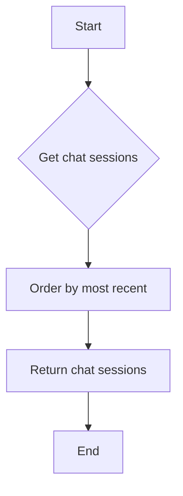

#### 带注释源码

```python
async def get_user_chat_sessions(
    user_id: str,
    limit: int = 50,
    offset: int = 0,
) -> list[PrismaChatSession]:
    """Get chat sessions for a user, ordered by most recent."""
    return await PrismaChatSession.prisma().find_many(
        where={"userId": user_id},
        order={"updatedAt": "desc"},
        take=limit,
        skip=offset,
    )
```

### get_user_session_count

Get the total number of chat sessions for a user.

参数：

- `user_id`：`str`，The ID of the user for which to count the chat sessions.

返回值：`int`，The total number of chat sessions for the user.

#### 流程图

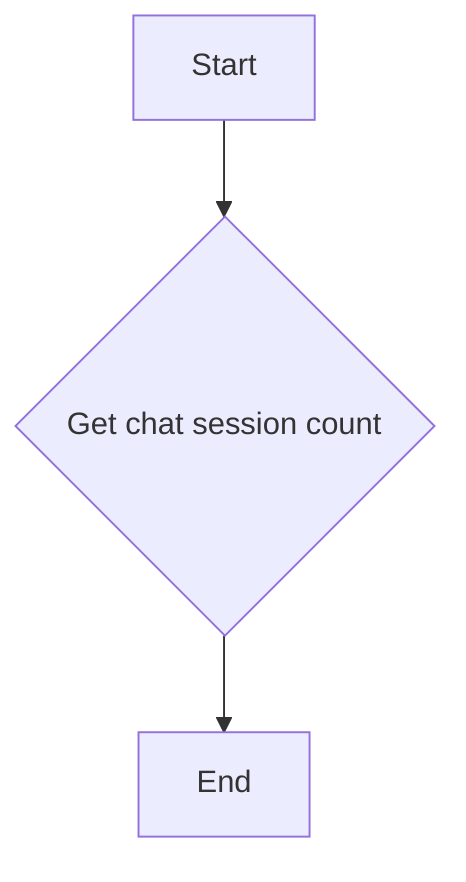

#### 带注释源码

```python
async def get_user_session_count(user_id: str) -> int:
    """Get the total number of chat sessions for a user."""
    return await PrismaChatSession.prisma().count(where={"userId": user_id})
```

### delete_chat_session

#### 描述

Delete a chat session and all its messages. If a `user_id` is provided, it validates that the session belongs to this user before deletion, preventing unauthorized deletion of other users' sessions.

#### 参数

- `session_id`：`str`，The session ID to delete.
- `user_id`：`str | None`，If provided, validates that the session belongs to this user before deletion.

#### 返回值

- `bool`，True if deleted successfully, False otherwise.

#### 流程图

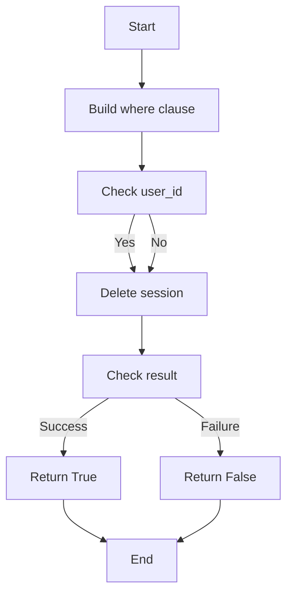

#### 带注释源码

```python
async def delete_chat_session(session_id: str, user_id: str | None = None) -> bool:
    """Delete a chat session and all its messages.

    Args:
        session_id: The session ID to delete.
        user_id: If provided, validates that the session belongs to this user
            before deletion. This prevents unauthorized deletion of other
            users' sessions.

    Returns:
        True if deleted successfully, False otherwise.
    """
    try:
        # Build typed where clause with optional user_id validation
        where_clause: ChatSessionWhereInput = {"id": session_id}
        if user_id is not None:
            where_clause["userId"] = user_id

        result = await PrismaChatSession.prisma().delete_many(where=where_clause)
        if result == 0:
            logger.warning(
                f"No session deleted for {session_id} "
                f"(user_id validation: {user_id is not None})"
            )
            return False
        return True
    except Exception as e:
        logger.error(f"Failed to delete chat session {session_id}: {e}")
        return False
```

### get_chat_session_message_count

Get the number of messages in a chat session.

参数：

- `session_id`：`str`，The ID of the chat session to count messages for.

返回值：`int`，The number of messages in the chat session.

#### 流程图

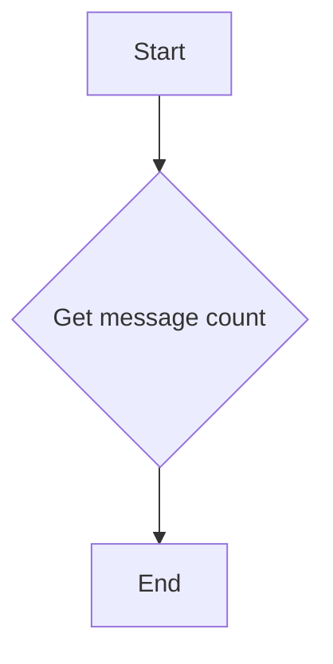

#### 带注释源码

```python
async def get_chat_session_message_count(session_id: str) -> int:
    """Get the number of messages in a chat session."""
    count = await PrismaChatMessage.prisma().count(where={"sessionId": session_id})
    return count
```

### update_tool_message_content

#### 描述

Update the content of a tool message in chat history. Used by background tasks to update pending operation messages with final results.

#### 参数

- `session_id`: `str`，The chat session ID.
- `tool_call_id`: `str`，The tool call ID to find the message.
- `new_content`: `str`，The new content to set.

#### 返回值

- `bool`，True if a message was updated, False otherwise.

#### 流程图

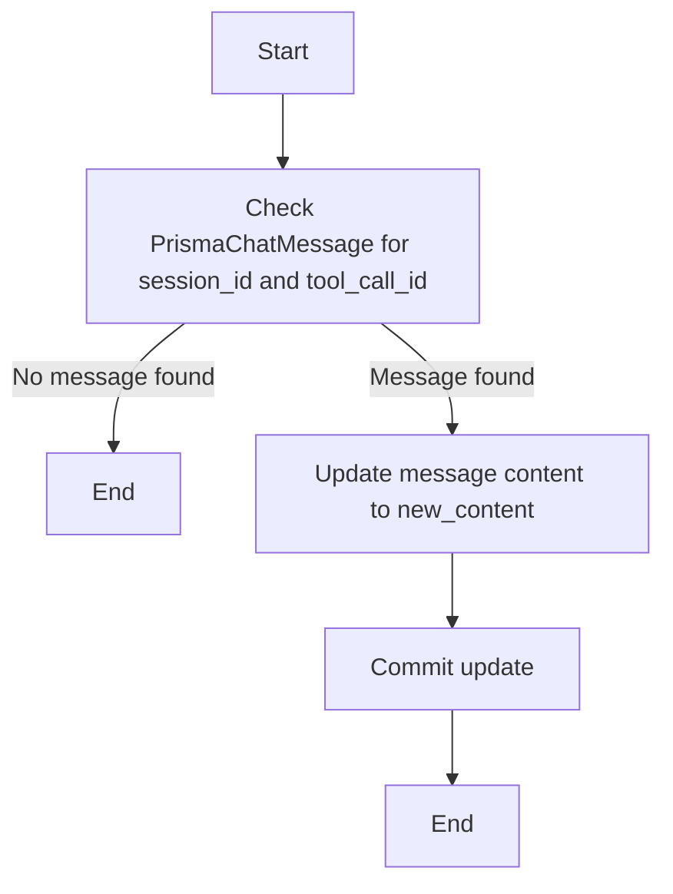

#### 带注释源码

```python
async def update_tool_message_content(
    session_id: str,
    tool_call_id: str,
    new_content: str,
) -> bool:
    """Update the content of a tool message in chat history.

    Used by background tasks to update pending operation messages with final results.

    Args:
        session_id: The chat session ID.
        tool_call_id: The tool call ID to find the message.
        new_content: The new content to set.

    Returns:
        True if a message was updated, False otherwise.
    """
    try:
        result = await PrismaChatMessage.prisma().update_many(
            where={
                "sessionId": session_id,
                "toolCallId": tool_call_id,
            },
            data={
                "content": new_content,
            },
        )
        if result == 0:
            logger.warning(
                f"No message found to update for session {session_id}, "
                f"tool_call_id {tool_call_id}"
            )
            return False
        return True
    except Exception as e:
        logger.error(
            f"Failed to update tool message for session {session_id}, "
            f"tool_call_id {tool_call_id}: {e}"
        )
        return False
```

### PrismaChatSession.prisma().find_unique

#### 描述

该函数通过 Prisma ORM 查询数据库以获取具有指定 ID 的唯一聊天会话。

#### 参数

- `where`: `ChatSessionWhereInput`，指定要查找的会话的筛选条件。
- `include`: `Any`，指定要包含在查询结果中的相关数据。

#### 返回值

- `PrismaChatSession | None`，如果找到匹配的会话，则返回 `PrismaChatSession` 对象；如果没有找到，则返回 `None`。

#### 流程图

```mermaid
graph TD
    A[Start] --> B[PrismaChatSession.prisma().find_unique]
    B --> C{Session found?}
    C -- Yes --> D[Return session]
    C -- No --> E[Return None]
    D --> F[End]
    E --> F
```

#### 带注释源码

```python
async def get_chat_session(session_id: str) -> PrismaChatSession | None:
    """Get a chat session by ID from the database."""
    session = await PrismaChatSession.prisma().find_unique(
        where={"id": session_id},
        include={"Messages": True},
    )
    if session and session.Messages:
        # Sort messages by sequence in Python - Prisma Python client doesn't support
        # order_by in include clauses (unlike Prisma JS), so we sort after fetching
        session.Messages.sort(key=lambda m: m.sequence)
    return session
```


### PrismaChatSession.prisma().create

This function creates a new chat session in the database.

参数：

- `data`：`ChatSessionCreateInput`，The input data for creating a new chat session.

返回值：`PrismaChatSession`，The created chat session object.

#### 流程图

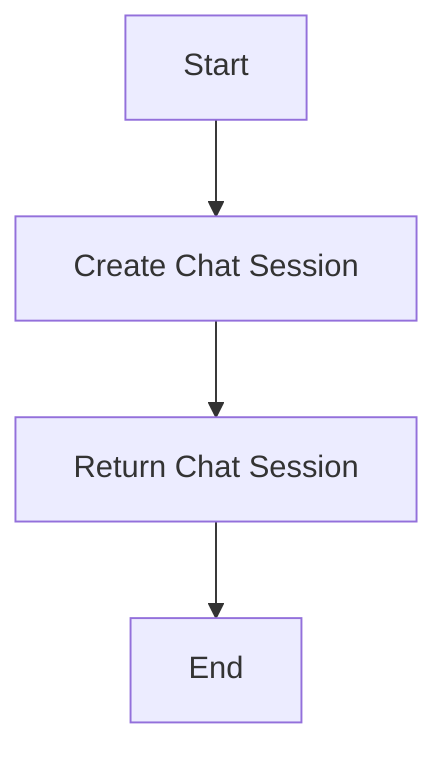

#### 带注释源码

```python
async def create_chat_session(
    session_id: str,
    user_id: str,
) -> PrismaChatSession:
    """Create a new chat session in the database."""
    data = ChatSessionCreateInput(
        id=session_id,
        userId=user_id,
        credentials=SafeJson({}),
        successfulAgentRuns=SafeJson({}),
        successfulAgentSchedules=SafeJson({}),
    )
    return await PrismaChatSession.prisma().create(data=data)
```


### PrismaChatSession.prisma().update

This function updates a chat session's metadata in the database.

参数：

- `session_id`：`str`，The ID of the chat session to update.
- `credentials`：`dict[str, Any] | None`，Optional credentials to update for the chat session.
- `successful_agent_runs`：`dict[str, Any] | None`，Optional successful agent runs to update for the chat session.
- `successful_agent_schedules`：`dict[str, Any] | None`，Optional successful agent schedules to update for the chat session.
- `total_prompt_tokens`：`int | None`，Optional total prompt tokens to update for the chat session.
- `total_completion_tokens`：`int | None`，Optional total completion tokens to update for the chat session.
- `title`：`str | None`，Optional title to update for the chat session.

返回值：`PrismaChatSession | None`，The updated chat session or `None` if not found.

#### 流程图

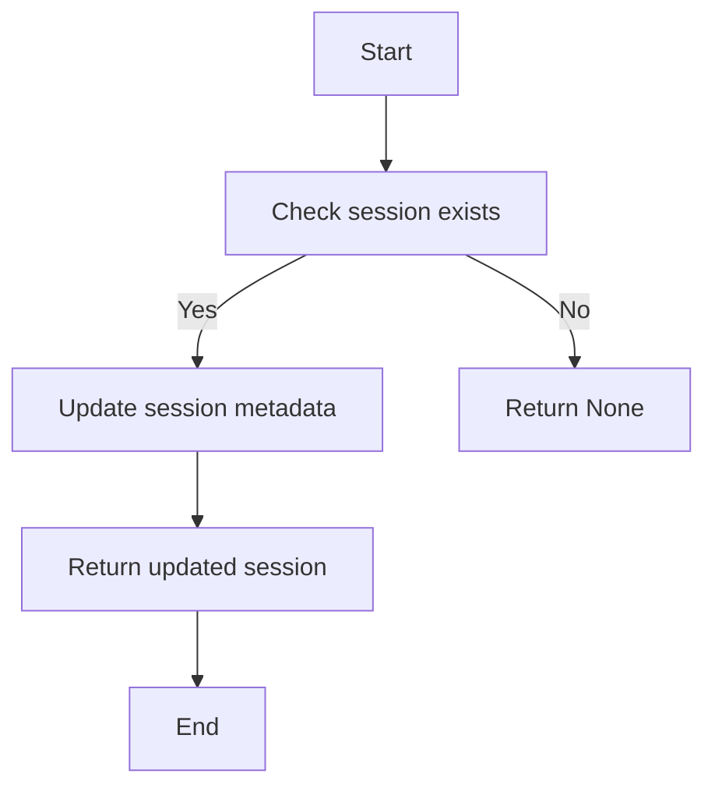

#### 带注释源码

```python
async def update_chat_session(
    session_id: str,
    credentials: dict[str, Any] | None = None,
    successful_agent_runs: dict[str, Any] | None = None,
    successful_agent_schedules: dict[str, Any] | None = None,
    total_prompt_tokens: int | None = None,
    total_completion_tokens: int | None = None,
    title: str | None = None,
) -> PrismaChatSession | None:
    """Update a chat session's metadata."""
    data: ChatSessionUpdateInput = {"updatedAt": datetime.now(UTC)}

    if credentials is not None:
        data["credentials"] = SafeJson(credentials)
    if successful_agent_runs is not None:
        data["successfulAgentRuns"] = SafeJson(successful_agent_runs)
    if successful_agent_schedules is not None:
        data["successfulAgentSchedules"] = SafeJson(successful_agent_schedules)
    if total_prompt_tokens is not None:
        data["totalPromptTokens"] = total_prompt_tokens
    if total_completion_tokens is not None:
        data["totalCompletionTokens"] = total_completion_tokens
    if title is not None:
        data["title"] = title

    session = await PrismaChatSession.prisma().update(
        where={"id": session_id},
        data=data,
        include={"Messages": True},
    )
    if session and session.Messages:
        # Sort in Python - Prisma Python doesn't support order_by in include clauses
        session.Messages.sort(key=lambda m: m.sequence)
    return session
```


### PrismaChatMessage.prisma().create

This function creates a new chat message in the database using the Prisma client.

参数：

- `data`：`ChatMessageCreateInput`，The data to create the chat message with.

返回值：`PrismaChatMessage`，The created chat message.

#### 流程图

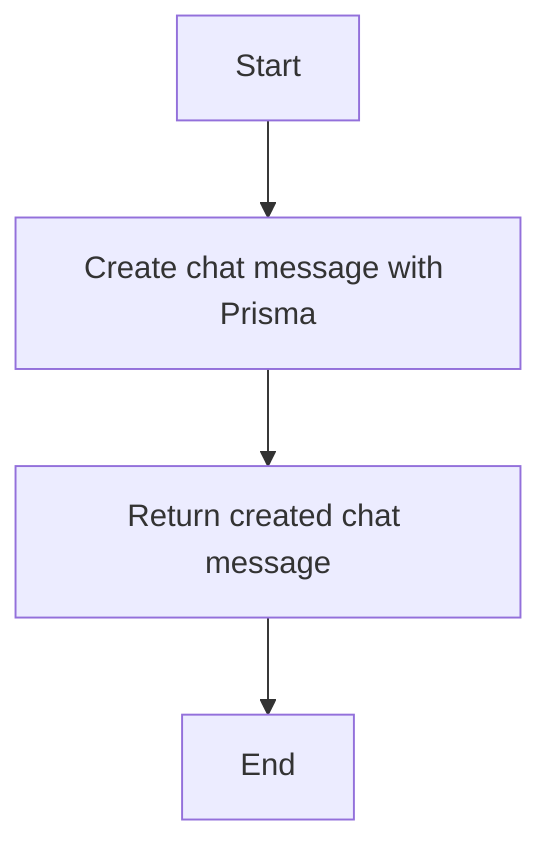

#### 带注释源码

```python
async def add_chat_message(
    session_id: str,
    role: str,
    sequence: int,
    content: str | None = None,
    name: str | None = None,
    tool_call_id: str | None = None,
    refusal: str | None = None,
    tool_calls: list[dict[str, Any]] | None = None,
    function_call: dict[str, Any] | None = None,
) -> PrismaChatMessage:
    """Add a message to a chat session."""
    # Build input dict dynamically rather than using ChatMessageCreateInput directly
    # because Prisma's TypedDict validation rejects optional fields set to None.
    # We only include fields that have values, then cast at the end.
    data: dict[str, Any] = {
        "Session": {"connect": {"id": session_id}},
        "role": role,
        "sequence": sequence,
    }

    # Add optional string fields
    if content is not None:
        data["content"] = content
    if name is not None:
        data["name"] = name
    if tool_call_id is not None:
        data["toolCallId"] = tool_call_id
    if refusal is not None:
        data["refusal"] = refusal

    # Add optional JSON fields only when they have values
    if tool_calls is not None:
        data["toolCalls"] = SafeJson(tool_calls)
    if function_call is not None:
        data["functionCall"] = SafeJson(function_call)

    # Run message create and session timestamp update in parallel for lower latency
    _, message = await asyncio.gather(
        PrismaChatSession.prisma().update(
            where={"id": session_id},
            data={"updatedAt": datetime.now(UTC)},
        ),
        PrismaChatMessage.prisma().create(data=cast(ChatMessageCreateInput, data)),
    )
    return message
```


### PrismaChatSession.prisma().update_many

This function updates multiple chat messages in the database.

参数：

- `where`: `ChatSessionWhereInput`，A Prisma query input to specify which messages to update.
- `data`: `ChatSessionUpdateInput`，The data to update in the database.

返回值：`int`，The number of messages updated.

#### 流程图

```mermaid
graph TD
    A[Start] --> B[Execute PrismaChatSession.prisma().update_many]
    B --> C[Get number of updated messages]
    C --> D[End]
```

#### 带注释源码

```python
async def update_tool_message_content(
    session_id: str,
    tool_call_id: str,
    new_content: str,
) -> bool:
    """Update the content of a tool message in chat history.

    Used by background tasks to update pending operation messages with final results.

    Args:
        session_id: The chat session ID.
        tool_call_id: The tool call ID to find the message.
        new_content: The new content to set.

    Returns:
        True if a message was updated, False otherwise.
    """
    try:
        result = await PrismaChatMessage.prisma().update_many(
            where={
                "sessionId": session_id,
                "toolCallId": tool_call_id,
            },
            data={
                "content": new_content,
            },
        )
        if result == 0:
            logger.warning(
                f"No message found to update for session {session_id}, "
                f"tool_call_id {tool_call_id}"
            )
            return False
        return True
    except Exception as e:
        logger.error(
            f"Failed to update tool message for session {session_id}, "
            f"tool_call_id {tool_call_id}: {e}"
        )
        return False
```


## 关键组件


### 张量索引与惰性加载

张量索引与惰性加载是代码中用于高效处理大量数据的关键组件。它允许在需要时才加载数据，从而减少内存消耗和提高性能。

### 反量化支持

反量化支持是代码中用于处理量化数据的关键组件。它允许对量化数据进行反量化处理，以便进行进一步的分析或操作。

### 量化策略

量化策略是代码中用于处理量化数据的关键组件。它定义了如何对数据进行量化，以及如何从量化数据中恢复原始数据。


## 问题及建议


### 已知问题

-   **Prisma Python Client Limitations**: The Prisma Python client does not support ordering in include clauses, which requires sorting to be done in Python after fetching data. This could be inefficient for large datasets.
-   **Dynamic Data Handling**: The code dynamically builds input dictionaries for creating and updating chat messages and sessions. This could be error-prone and hard to maintain, especially if the Prisma models change.
-   **Error Handling**: The error handling is basic, logging errors and returning False. More detailed error information or retries could be implemented.
-   **Asynchronous Database Operations**: While the code is asynchronous, the actual database operations are not optimized for concurrent execution. This could lead to performance bottlenecks.
-   **Lack of Input Validation**: The code does not perform explicit input validation for the parameters passed to functions, which could lead to unexpected behavior or security vulnerabilities.

### 优化建议

-   **Optimize Prisma Queries**: Use Prisma's query capabilities to the fullest, including ordering and filtering directly in the database queries to reduce the amount of data transferred and processed in Python.
-   **Refactor Dynamic Data Handling**: Consider using Prisma's `create` and `update` functions with explicit field handling to avoid dynamic data construction and potential errors.
-   **Enhance Error Handling**: Implement more robust error handling, including retries for transient errors and detailed error responses to the caller.
-   **Improve Asynchronous Performance**: Use asynchronous programming patterns more effectively, such as batching database operations or using connection pooling.
-   **Add Input Validation**: Validate inputs before processing them to ensure data integrity and prevent security issues.
-   **Consider Caching**: Implement caching for frequently accessed data to reduce database load and improve response times.
-   **Logging and Monitoring**: Enhance logging to include more context and implement monitoring to track performance and errors in production.


## 其它


### 设计目标与约束

- 设计目标：
  - 提供高效、可靠的数据库操作接口，用于管理聊天会话和消息。
  - 支持异步操作，以优化性能和响应时间。
  - 确保数据的一致性和完整性。
  - 提供灵活的查询和更新功能，以适应不同的业务需求。

- 约束：
  - 使用 Prisma ORM 进行数据库操作，以简化数据库交互。
  - 限制对数据库的直接访问，以避免潜在的安全风险。
  - 遵循异步编程的最佳实践，确保代码的可扩展性和性能。
  - 限制对全局变量的使用，以减少代码的耦合性和提高可维护性。

### 错误处理与异常设计

- 错误处理：
  - 使用 try-except 块捕获可能发生的异常，并记录错误日志。
  - 对于数据库操作失败，返回适当的错误信息或异常。
  - 对于用户输入错误，提供清晰的错误提示。

- 异常设计：
  - 定义自定义异常类，以处理特定的错误情况。
  - 使用异常链，以便在调用链中传播异常。

### 数据流与状态机

- 数据流：
  - 用户请求创建或更新聊天会话。
  - 系统异步执行数据库操作，创建或更新会话和消息。
  - 系统返回操作结果或错误信息。

- 状态机：
  - 聊天会话可能处于创建、更新、删除等状态。
  - 系统根据操作类型和数据库响应更新会话状态。

### 外部依赖与接口契约

- 外部依赖：
  - Prisma ORM：用于数据库操作。
  - asyncio：用于异步编程。
  - logging：用于日志记录。

- 接口契约：
  - 定义清晰的函数签名和参数类型。
  - 使用类型注解提高代码的可读性和可维护性。
  - 提供文档说明函数的功能和用法。


    