# `.\AutoGPT\autogpt_platform\backend\backend\api\features\chat\model.py` 详细设计文档

The code manages chat sessions, including creating, retrieving, updating, and deleting sessions, as well as caching and locking mechanisms to handle concurrent access.

## 整体流程

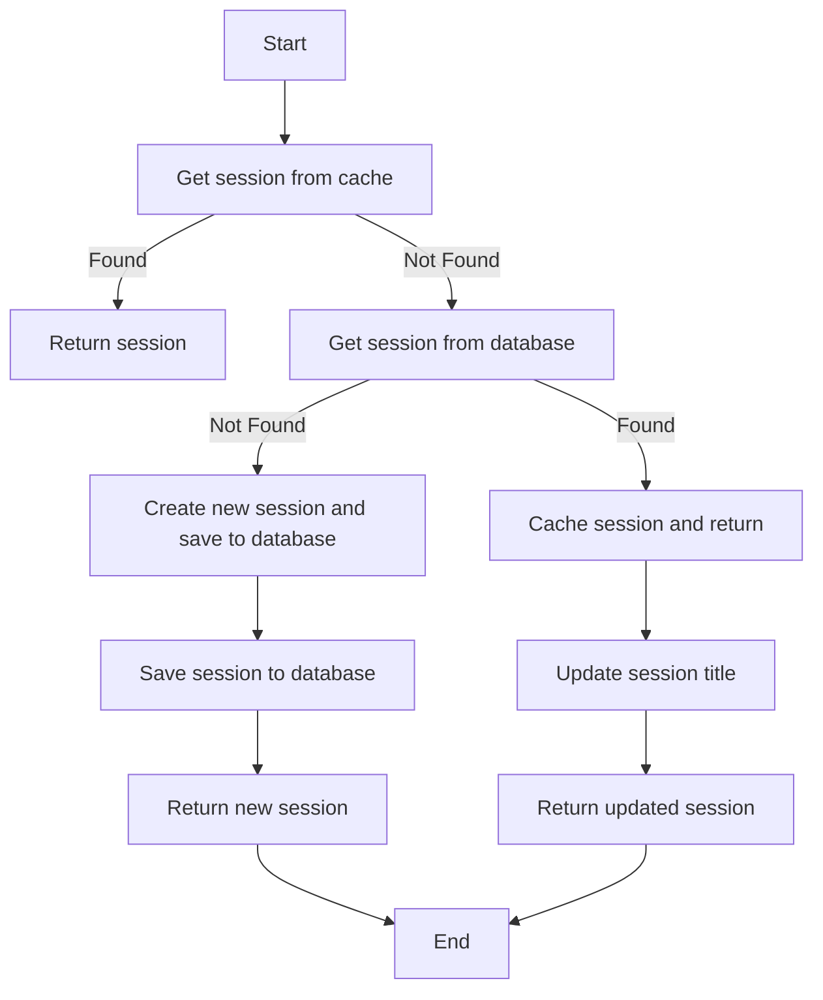

## 类结构

```
ChatSessionManager (主类)
├── ChatMessage (消息模型)
│   ├── role
│   ├── content
│   ├── name
│   ├── tool_call_id
│   ├── refusal
│   └── tool_calls
│   └── function_call
├── Usage (使用情况模型)
│   ├── prompt_tokens
│   ├── completion_tokens
│   └── total_tokens
└── ChatSession (会话模型)
    ├── session_id
    ├── user_id
    ├── title
    ├── messages
    ├── usage
    ├── credentials
    ├── started_at
    ├── updated_at
    └── successful_agent_runs
    └── successful_agent_schedules
```

## 全局变量及字段


### `logger`
    
Logger instance for logging messages.

类型：`logging.Logger`
    


### `config`
    
Configuration object for chat settings.

类型：`ChatConfig`
    


### `CHAT_SESSION_CACHE_PREFIX`
    
Prefix for Redis cache keys for chat sessions.

类型：`str`
    


### `_session_locks`
    
Dictionary to store session locks for concurrency control.

类型：`WeakValueDictionary[str, asyncio.Lock]`
    


### `_session_locks_mutex`
    
Mutex to synchronize access to the session locks dictionary.

类型：`asyncio.Lock`
    


### `ChatMessage.role`
    
Role of the message sender.

类型：`str`
    


### `ChatMessage.content`
    
Content of the message.

类型：`str | None`
    


### `ChatMessage.name`
    
Name associated with the message, if any.

类型：`str | None`
    


### `ChatMessage.tool_call_id`
    
ID of the tool call associated with the message, if any.

类型：`str | None`
    


### `ChatMessage.refusal`
    
Refusal reason, if the message is a refusal.

类型：`str | None`
    


### `ChatMessage.tool_calls`
    
List of tool calls associated with the message, if any.

类型：`list[dict] | None`
    


### `ChatMessage.function_call`
    
Function call associated with the message, if any.

类型：`dict | None`
    


### `Usage.prompt_tokens`
    
Number of prompt tokens used.

类型：`int`
    


### `Usage.completion_tokens`
    
Number of completion tokens generated.

类型：`int`
    


### `Usage.total_tokens`
    
Total number of tokens used.

类型：`int`
    


### `ChatSession.session_id`
    
Unique identifier for the chat session.

类型：`str`
    


### `ChatSession.user_id`
    
User identifier associated with the chat session.

类型：`str`
    


### `ChatSession.title`
    
Title of the chat session, if any.

类型：`str | None`
    


### `ChatSession.messages`
    
List of messages in the chat session.

类型：`list[ChatMessage]`
    


### `ChatSession.usage`
    
List of usage statistics for the chat session.

类型：`list[Usage]`
    


### `ChatSession.credentials`
    
Credentials associated with the chat session.

类型：`dict[str, dict]`
    


### `ChatSession.started_at`
    
Timestamp when the chat session started.

类型：`datetime`
    


### `ChatSession.updated_at`
    
Timestamp when the chat session was last updated.

类型：`datetime`
    


### `ChatSession.successful_agent_runs`
    
Count of successful agent runs in the chat session.

类型：`dict[str, int]`
    


### `ChatSession.successful_agent_schedules`
    
Count of successful agent schedules in the chat session.

类型：`dict[str, int]`
    
    

## 全局函数及方法


### `_parse_json_field`

解析可能以字符串、字典或列表形式存储的JSON字段。

参数：

- `value`：`str | dict | list | None`，可能以字符串、字典或列表形式存储的值。
- `default`：`Any`，当`value`为`None`时返回的默认值。

返回值：`Any`，解析后的值。

#### 流程图

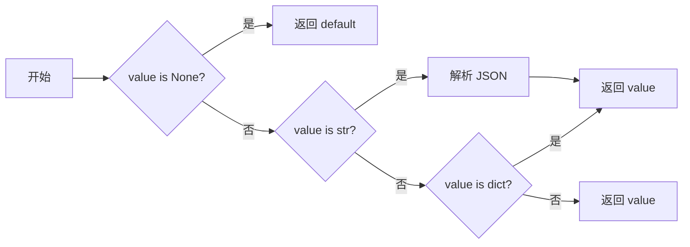

#### 带注释源码

```python
def _parse_json_field(value: str | dict | list | None, default: Any = None) -> Any:
    """Parse a JSON field that may be stored as string or already parsed."""
    if value is None:
        return default
    if isinstance(value, str):
        return json.loads(value)
    return value
```


### `_get_session_cache_key`

Get the Redis cache key for a chat session.

参数：

- `session_id`：`str`，The unique identifier for the chat session.

返回值：`str`，The Redis cache key for the chat session.

#### 流程图

```mermaid
graph LR
A[Start] --> B{Get session_id}
B --> C[Concatenate "chat:session:" with session_id]
C --> D[Return concatenated string]
D --> E[End]
```

#### 带注释源码

```python
def _get_session_cache_key(session_id: str) -> str:
    """Get the Redis cache key for a chat session."""
    return f"{CHAT_SESSION_CACHE_PREFIX}{session_id}"
```


### `_get_session_lock`

获取或创建特定会话的锁，以防止并发更新。

参数：

- `session_id`：`str`，会话的唯一标识符

返回值：`asyncio.Lock`，用于同步访问会话的锁

#### 流程图

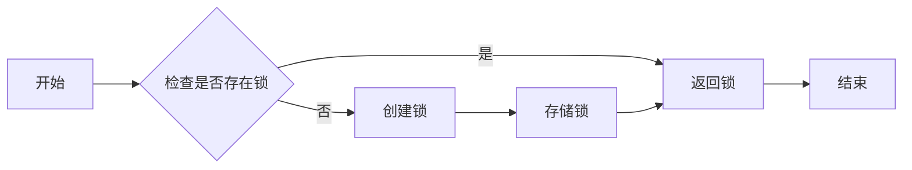

#### 带注释源码

```python
async def _get_session_lock(session_id: str) -> asyncio.Lock:
    """Get or create a lock for a specific session to prevent concurrent upserts.

    Uses WeakValueDictionary for automatic cleanup: locks are garbage collected
    when no coroutine holds a reference to them, preventing memory leaks from
    unbounded growth of session locks.
    """
    async with _session_locks_mutex:
        lock = _session_locks.get(session_id)
        if lock is None:
            lock = asyncio.Lock()
            _session_locks[session_id] = lock
        return lock
```


### `_get_session_from_cache`

#### 描述

该函数从Redis缓存中获取一个聊天会话。如果缓存中没有找到会话，则返回`None`。

#### 参数

- `session_id`：`str`，会话的唯一标识符。

#### 返回值

- `ChatSession | None`，如果找到会话，则返回`ChatSession`对象；如果没有找到，则返回`None`。

#### 流程图

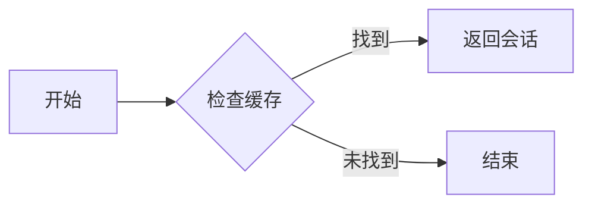

#### 带注释源码

```python
async def _get_session_from_cache(session_id: str) -> ChatSession | None:
    """Get a chat session from Redis cache."""
    redis_key = _get_session_cache_key(session_id)
    async_redis = await get_redis_async()
    raw_session: bytes | None = await async_redis.get(redis_key)

    if raw_session is None:
        return None

    try:
        session = ChatSession.model_validate_json(raw_session)
        logger.info(
            f"Loading session {session_id} from cache: "
            f"message_count={len(session.messages)}, "
            f"roles={[m.role for m in session.messages]}"
        )
        return session
    except Exception as e:
        logger.error(f"Failed to deserialize session {session_id}: {e}", exc_info=True)
        raise RedisError(f"Corrupted session data for {session_id}") from e
```

### cache_chat_session

Cache a chat session in Redis.

参数：

- `session`：`ChatSession`，The chat session to cache.

返回值：`None`，No return value.

#### 流程图

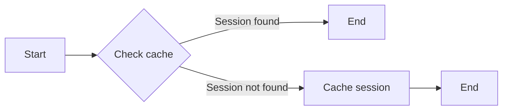

#### 带注释源码

```python
async def _cache_session(session: ChatSession) -> None:
    """Cache a chat session in Redis."""
    redis_key = _get_session_cache_key(session.session_id)
    async_redis = await get_redis_async()
    await async_redis.setex(redis_key, config.session_ttl, session.model_dump_json())
```


### `cache_chat_session(session: ChatSession)`

Cache a chat session in Redis without persisting to the database.

参数：

- `session`：`ChatSession`，The chat session to cache.

返回值：`None`，No return value, the function is void.

#### 流程图

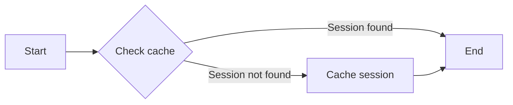

#### 带注释源码

```python
async def cache_chat_session(session: ChatSession) -> None:
    """Cache a chat session in Redis without persisting to the database."""
    await _cache_session(session)
```


### `invalidate_session_cache(session_id: str)`

Invalidate a chat session from Redis cache.

参数：

- `session_id`：`str`，The session ID of the chat session to invalidate from the cache.

返回值：`None`，This function does not return a value.

#### 流程图

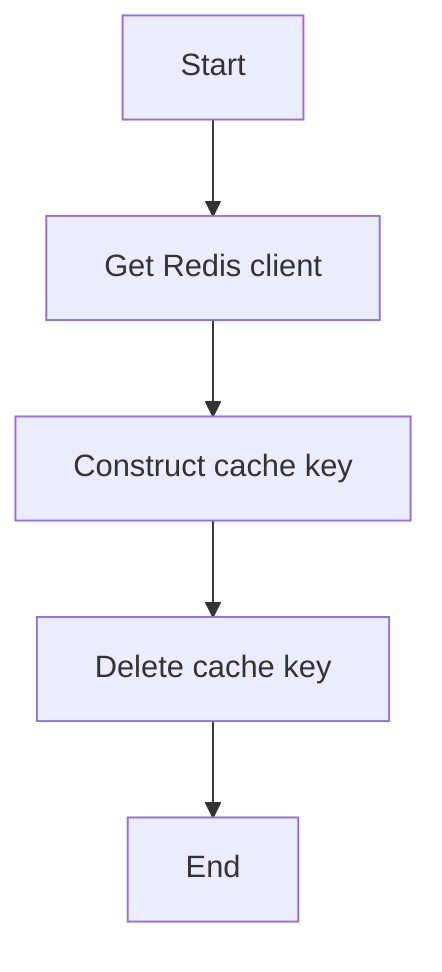

#### 带注释源码

```python
async def invalidate_session_cache(session_id: str) -> None:
    """Invalidate a chat session from Redis cache.

    Used by background tasks to ensure fresh data is loaded on next access.
    This is best-effort - Redis failures are logged but don't fail the operation.
    """
    try:
        redis_key = _get_session_cache_key(session_id)
        async_redis = await get_redis_async()
        await async_redis.delete(redis_key)
    except Exception as e:
        # Best-effort: log but don't fail - cache will expire naturally
        logger.warning(f"Failed to invalidate session cache for {session_id}: {e}")
```


### `_get_session_from_db`

#### 描述

该函数从数据库中获取一个聊天会话。

#### 参数

- `session_id`: `str`，会话的唯一标识符。

#### 返回值

- `ChatSession | None`，如果找到会话，则返回`ChatSession`对象；如果没有找到，则返回`None`。

#### 流程图

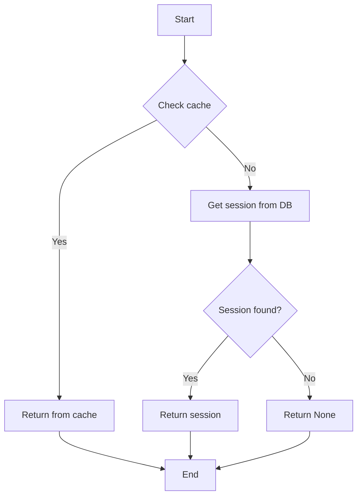

#### 带注释源码

```python
async def _get_session_from_db(session_id: str) -> ChatSession | None:
    """Get a chat session from the database."""
    prisma_session = await chat_db.get_chat_session(session_id)
    if not prisma_session:
        return None

    messages = prisma_session.Messages
    logger.info(
        f"Loading session {session_id} from DB: "
        f"has_messages={messages is not None}, "
        f"message_count={len(messages) if messages else 0}, "
        f"roles={[m.role for m in messages] if messages else []}"
    )

    return ChatSession.from_db(prisma_session, messages)
```

### _save_session_to_db

#### 描述

该函数负责将聊天会话保存或更新到数据库中。如果会话不存在于数据库中，则创建一个新的会话；如果会话已存在，则更新其信息。

#### 参数

- `session`：`ChatSession`，要保存或更新的会话对象。
- `existing_message_count`：`int`，已存在于数据库中的消息数量。

#### 返回值

- `None`：无返回值。

#### 流程图

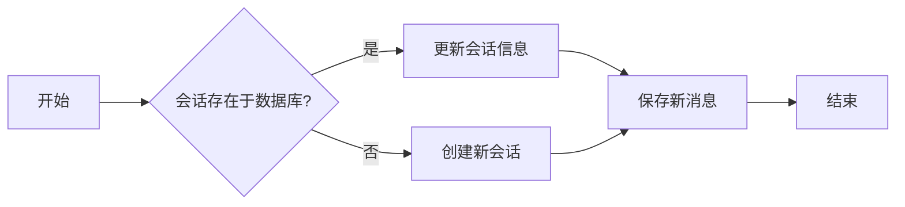

#### 带注释源码

```python
async def _save_session_to_db(
    session: ChatSession, existing_message_count: int
) -> None:
    """Save or update a chat session in the database."""
    # Check if session exists in DB
    existing = await chat_db.get_chat_session(session.session_id)

    if not existing:
        # Create new session
        await chat_db.create_chat_session(
            session_id=session.session_id,
            user_id=session.user_id,
        )
        existing_message_count = 0

    # Calculate total tokens from usage
    total_prompt = sum(u.prompt_tokens for u in session.usage)
    total_completion = sum(u.completion_tokens for u in session.usage)

    # Update session metadata
    await chat_db.update_chat_session(
        session_id=session.session_id,
        credentials=session.credentials,
        successful_agent_runs=session.successful_agent_runs,
        successful_agent_schedules=session.successful_agent_schedules,
        total_prompt_tokens=total_prompt,
        total_completion_tokens=total_completion,
    )

    # Add new messages (only those after existing count)
    new_messages = session.messages[existing_message_count:]
    if new_messages:
        messages_data = []
        for msg in new_messages:
            messages_data.append(
                {
                    "role": msg.role,
                    "content": msg.content,
                    "name": msg.name,
                    "tool_call_id": msg.tool_call_id,
                    "refusal": msg.refusal,
                    "tool_calls": msg.tool_calls,
                    "function_call": msg.function_call,
                }
            )
        logger.info(
            f"Saving {len(new_messages)} new messages to DB for session {session.session_id}: "
            f"roles={[m['role'] for m in messages_data]}, "
            f"start_sequence={existing_message_count}"
        )
        await chat_db.add_chat_messages_batch(
            session_id=session.session_id,
            messages=messages_data,
            start_sequence=existing_message_count,
        )
```


### `get_chat_session`

Get a chat session by ID, checking Redis cache first, falling back to database if not found, and caching database results back to Redis.

参数：

- `session_id`：`str`，The session ID to fetch.
- `user_id`：`str | None`，If provided, validates that the session belongs to this user. If None, ownership is not validated (admin/system access).

返回值：`ChatSession | None`，The ChatSession object if found, otherwise None.

#### 流程图

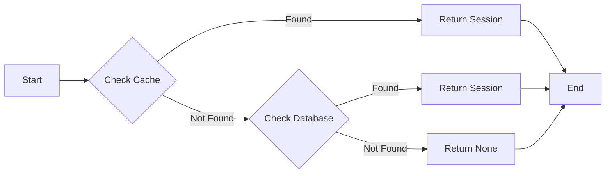

#### 带注释源码

```python
async def get_chat_session(
    session_id: str,
    user_id: str | None = None,
) -> ChatSession | None:
    """Get a chat session by ID.

    Checks Redis cache first, falls back to database if not found.
    Caches database results back to Redis.

    Args:
        session_id: The session ID to fetch.
        user_id: If provided, validates that the session belongs to this user.
            If None, ownership is not validated (admin/system access).

    Returns:
        The ChatSession object if found, otherwise None.
    """
    # Try cache first
    try:
        session = await _get_session_from_cache(session_id)
        if session:
            # Verify user ownership if user_id was provided for validation
            if user_id is not None and session.user_id != user_id:
                logger.warning(
                    f"Session {session_id} user id mismatch: {session.user_id} != {user_id}"
                )
                return None
            return session
    except RedisError:
        logger.warning(f"Cache error for session {session_id}, trying database")
    except Exception as e:
        logger.warning(f"Unexpected cache error for session {session_id}: {e}")

    # Fall back to database
    logger.info(f"Session {session_id} not in cache, checking database")
    session = await _get_session_from_db(session_id)

    if session is None:
        logger.warning(f"Session {session_id} not found in cache or database")
        return None

    # Verify user ownership if user_id was provided for validation
    if user_id is not None and session.user_id != user_id:
        logger.warning(
            f"Session {session_id} user id mismatch: {session.user_id} != {user_id}"
        )
        return None

    # Cache the session from DB
    try:
        await _cache_session(session)
        logger.info(f"Cached session {session_id} from database")
    except Exception as e:
        logger.warning(f"Failed to cache session {session_id}: {e}")

    return session
```


### upsert_chat_session

This function updates a chat session in both the cache and the database. It uses session-level locking to prevent race conditions when concurrent operations attempt to upsert the same session simultaneously.

#### 参数

- `session`：`ChatSession`，The chat session to update.

#### 返回值

- `ChatSession`：The updated chat session.

#### 流程图

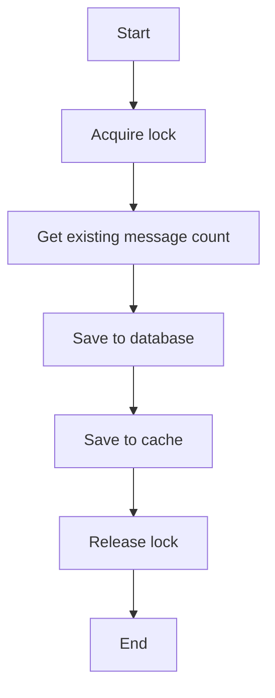

#### 带注释源码

```python
async def upsert_chat_session(
    session: ChatSession,
) -> ChatSession:
    """Update a chat session in both cache and database.

    Uses session-level locking to prevent race conditions when concurrent
    operations (e.g., background title update and main stream handler)
    attempt to upsert the same session simultaneously.

    Raises:
        DatabaseError: If the database write fails. The cache is still updated
            as a best-effort optimization, but the error is propagated to ensure
            callers are aware of the persistence failure.
        RedisError: If the cache write fails (after successful DB write).
    """
    # Acquire session-specific lock to prevent concurrent upserts
    lock = await _get_session_lock(session.session_id)

    async with lock:
        # Get existing message count from DB for incremental saves
        existing_message_count = await chat_db.get_chat_session_message_count(
            session.session_id
        )

        db_error: Exception | None = None

        # Save to database (primary storage)
        try:
            await _save_session_to_db(session, existing_message_count)
        except Exception as e:
            logger.error(
                f"Failed to save session {session.session_id} to database: {e}"
            )
            db_error = e

        # Save to cache (best-effort, even if DB failed)
        try:
            await _cache_session(session)
        except Exception as e:
            # If DB succeeded but cache failed, raise cache error
            if db_error is None:
                raise RedisError(
                    f"Failed to persist chat session {session.session_id} to Redis: {e}"
                ) from e
            # If both failed, log cache error but raise DB error (more critical)
            logger.warning(
                f"Cache write also failed for session {session.session_id}: {e}"
            )

        # Propagate DB error after attempting cache (prevents data loss)
        if db_error is not None:
            raise DatabaseError(
                f"Failed to persist chat session {session.session_id} to database"
            ) from db_error

        return session
```


### `create_chat_session(user_id: str)`

Create a new chat session and persist it.

参数：

- `user_id`：`str`，The user ID associated with the chat session.

返回值：`ChatSession`，The created chat session.

#### 流程图

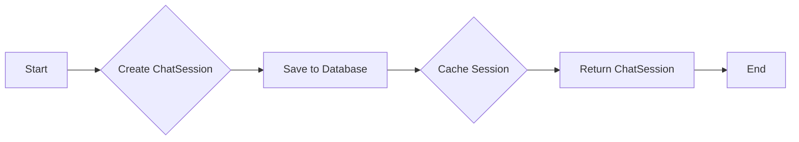

#### 带注释源码

```python
async def create_chat_session(user_id: str) -> ChatSession:
    """Create a new chat session and persist it.

    Raises:
        DatabaseError: If the database write fails. We fail fast to ensure
            callers never receive a non-persisted session that only exists
            in cache (which would be lost when the cache expires).
    """
    session = ChatSession.new(user_id)

    # Create in database first - fail fast if this fails
    try:
        await chat_db.create_chat_session(
            session_id=session.session_id,
            user_id=user_id,
        )
    except Exception as e:
        logger.error(f"Failed to create session {session.session_id} in database: {e}")
        raise DatabaseError(
            f"Failed to create chat session {session.session_id} in database"
        ) from e

    # Cache the session (best-effort optimization, DB is source of truth)
    try:
        await _cache_session(session)
    except Exception as e:
        logger.warning(f"Failed to cache new session {session.session_id}: {e}")

    return session
```


### `get_user_sessions`

Get chat sessions for a user from the database with total count.

参数：

- `user_id`：`str`，The user ID for which to fetch the chat sessions.
- `limit`：`int`，The maximum number of sessions to return. Defaults to 50.
- `offset`：`int`，The number of sessions to skip before starting to return results. Defaults to 0.

返回值：`tuple[list[ChatSession], int]`，A tuple containing a list of `ChatSession` objects and the total count of sessions for the user.

#### 流程图

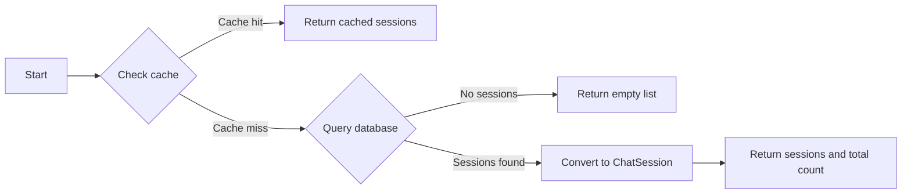

#### 带注释源码

```python
async def get_user_sessions(
    user_id: str,
    limit: int = 50,
    offset: int = 0,
) -> tuple[list[ChatSession], int]:
    """Get chat sessions for a user from the database with total count.

    Args:
        user_id: The user ID for which to fetch the chat sessions.
        limit: The maximum number of sessions to return. Defaults to 50.
        offset: The number of sessions to skip before starting to return results. Defaults to 0.

    Returns:
        A tuple of (sessions, total_count) where total_count is the overall
        number of sessions for the user (not just the current page).
    """
    # Try cache first
    try:
        session = await _get_session_from_cache(session_id)
        if session:
            # Verify user ownership if user_id was provided for validation
            if user_id is not None and session.user_id != user_id:
                logger.warning(
                    f"Session {session_id} user id mismatch: {session.user_id} != {user_id}"
                )
                return None
            return session
    except RedisError:
        logger.warning(f"Cache error for session {session_id}, trying database")
    except Exception as e:
        logger.warning(f"Unexpected cache error for session {session_id}: {e}")

    # Fall back to database
    logger.info(f"Session {session_id} not in cache, checking database")
    session = await _get_session_from_db(session_id)

    if session is None:
        logger.warning(f"Session {session_id} not found in cache or database")
        return None

    # Verify user ownership if user_id was provided for validation
    if user_id is not None and session.user_id != user_id:
        logger.warning(
            f"Session {session_id} user id mismatch: {session.user_id} != {user_id}"
        )
        return None

    # Cache the session from DB
    try:
        await _cache_session(session)
        logger.info(f"Cached session {session_id} from database")
    except Exception as e:
        logger.warning(f"Failed to cache session {session_id}: {e}")

    return session
```


### delete_chat_session

Delete a chat session from both cache and database.

参数：

- `session_id`：`str`，The session ID to delete.
- `user_id`：`str | None`，If provided, validates that the session belongs to this user before deletion. This prevents unauthorized deletion.

返回值：`bool`，True if deleted successfully, False otherwise.

#### 流程图

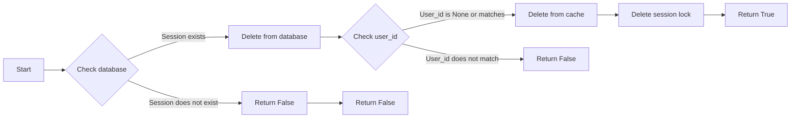

#### 带注释源码

```python
async def delete_chat_session(session_id: str, user_id: str | None = None) -> bool:
    """Delete a chat session from both cache and database.

    Args:
        session_id: The session ID to delete.
        user_id: If provided, validates that the session belongs to this user
            before deletion. This prevents unauthorized deletion.

    Returns:
        True if deleted successfully, False otherwise.
    """
    # Delete from database first (with optional user_id validation)
    # This confirms ownership before invalidating cache
    deleted = await chat_db.delete_chat_session(session_id, user_id)

    if not deleted:
        return False

    # Only invalidate cache and clean up lock after DB confirms deletion
    try:
        redis_key = _get_session_cache_key(session_id)
        async_redis = await get_redis_async()
        await async_redis.delete(redis_key)
    except Exception as e:
        logger.warning(f"Failed to delete session {session_id} from cache: {e}")

    # Clean up session lock (belt-and-suspenders with WeakValueDictionary)
    async with _session_locks_mutex:
        _session_locks.pop(session_id, None)

    return True
```


### update_session_title

Update only the title of a chat session.

参数：

- `session_id`：`str`，The session ID to update.
- `title`：`str`，The new title to set.

返回值：`bool`，True if updated successfully, False otherwise.

#### 流程图

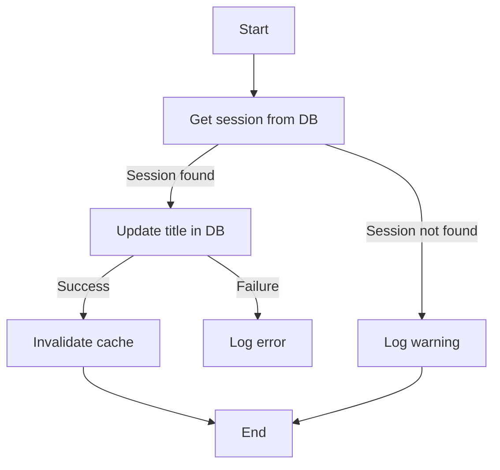

#### 带注释源码

```python
async def update_session_title(session_id: str, title: str) -> bool:
    """Update only the title of a chat session.

    Args:
        session_id: The session ID to update.
        title: The new title to set.

    Returns:
        True if updated successfully, False otherwise.
    """
    try:
        result = await chat_db.update_chat_session(session_id=session_id, title=title)
        if result is None:
            logger.warning(f"Session {session_id} not found for title update")
            return False

        # Invalidate cache so next fetch gets updated title
        try:
            redis_key = _get_session_cache_key(session_id)
            async_redis = await get_redis_async()
            await async_redis.delete(redis_key)
        except Exception as e:
            logger.warning(f"Failed to invalidate cache for session {session_id}: {e}")

        return True
    except Exception as e:
        logger.error(f"Failed to update title for session {session_id}: {e}")
        return False
```


### `ChatSession.new`

创建一个新的 `ChatSession` 对象。

参数：

- `user_id`：`str`，用户ID，用于创建会话。

返回值：`ChatSession`，返回创建的 `ChatSession` 对象。

#### 流程图

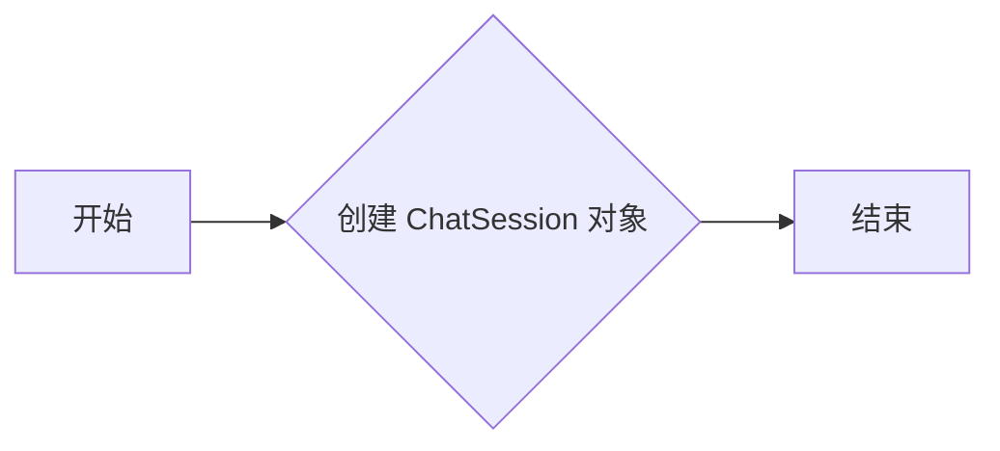

#### 带注释源码

```python
class ChatSession(BaseModel):
    # ...

    @staticmethod
    def new(user_id: str) -> "ChatSession":
        return ChatSession(
            session_id=str(uuid.uuid4()),
            user_id=user_id,
            title=None,
            messages=[],
            usage=[],
            credentials={},
            started_at=datetime.now(UTC),
            updated_at=datetime.now(UTC),
        )
```


### `ChatSession.from_db`

Convert Prisma models to Pydantic ChatSession.

参数：

- `prisma_session`：`PrismaChatSession`，The Prisma model representing the chat session.
- `prisma_messages`：`list[PrismaChatMessage] | None`，The list of Prisma models representing the chat messages associated with the session. Defaults to `None`.

返回值：`ChatSession`，The Pydantic model representing the chat session.

#### 流程图

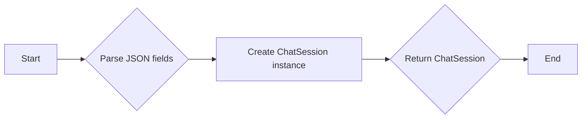

#### 带注释源码

```python
@staticmethod
def from_db(
    prisma_session: PrismaChatSession,
    prisma_messages: list[PrismaChatMessage] | None = None,
) -> "ChatSession":
    """Convert Prisma models to Pydantic ChatSession."""
    messages = []
    if prisma_messages:
        for msg in prisma_messages:
            messages.append(
                ChatMessage(
                    role=msg.role,
                    content=msg.content,
                    name=msg.name,
                    tool_call_id=msg.toolCallId,
                    refusal=msg.refusal,
                    tool_calls=_parse_json_field(msg.toolCalls),
                    function_call=_parse_json_field(msg.functionCall),
                )
            )

    # Parse JSON fields from Prisma
    credentials = _parse_json_field(prisma_session.credentials, default={})
    successful_agent_runs = _parse_json_field(
        prisma_session.successfulAgentRuns, default={}
    )
    successful_agent_schedules = _parse_json_field(
        prisma_session.successfulAgentSchedules, default={}
    )

    # Calculate usage from token counts
    usage = []
    if prisma_session.totalPromptTokens or prisma_session.totalCompletionTokens:
        usage.append(
            Usage(
                prompt_tokens=prisma_session.totalPromptTokens or 0,
                completion_tokens=prisma_session.totalCompletionTokens or 0,
                total_tokens=(prisma_session.totalPromptTokens or 0)
                + (prisma_session.totalCompletionTokens or 0),
            )
        )

    return ChatSession(
        session_id=prisma_session.id,
        user_id=prisma_session.userId,
        title=prisma_session.title,
        messages=messages,
        usage=usage,
        credentials=credentials,
        started_at=prisma_session.createdAt,
        updated_at=prisma_session.updatedAt,
        successful_agent_runs=successful_agent_runs,
        successful_agent_schedules=successful_agent_schedules,
    )
```


### `ChatSession.to_openai_messages`

Converts the messages within a chat session to OpenAI's `ChatCompletionMessageParam` format.

参数：

- `self`：`ChatSession`，The chat session object containing the messages to convert.

返回值：`list[ChatCompletionMessageParam]`，A list of OpenAI `ChatCompletionMessageParam` objects representing the session's messages.

#### 流程图

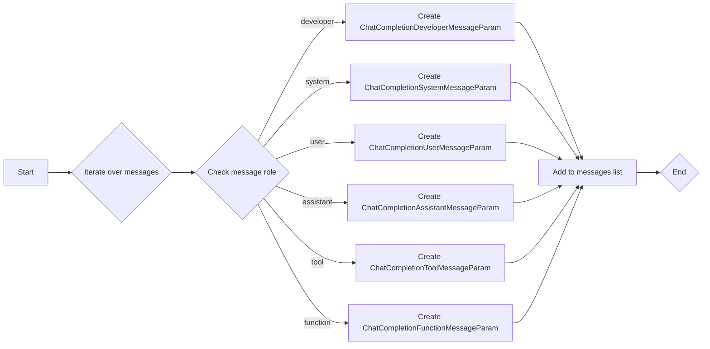

#### 带注释源码

```python
def to_openai_messages(self) -> list[ChatCompletionMessageParam]:
    messages = []
    for message in self.messages:
        if message.role == "developer":
            m = ChatCompletionDeveloperMessageParam(
                role="developer",
                content=message.content or "",
            )
            if message.name:
                m["name"] = message.name
            messages.append(m)
        elif message.role == "system":
            m = ChatCompletionSystemMessageParam(
                role="system",
                content=message.content or "",
            )
            if message.name:
                m["name"] = message.name
            messages.append(m)
        elif message.role == "user":
            m = ChatCompletionUserMessageParam(
                role="user",
                content=message.content or "",
            )
            if message.name:
                m["name"] = message.name
            messages.append(m)
        elif message.role == "assistant":
            m = ChatCompletionAssistantMessageParam(
                role="assistant",
                content=message.content or "",
            )
            if message.function_call:
                m["function_call"] = FunctionCall(
                    arguments=message.function_call["arguments"],
                    name=message.function_call["name"],
                )
            if message.refusal:
                m["refusal"] = message.refusal
            if message.tool_calls:
                t: list[ChatCompletionMessageToolCallParam] = []
                for tool_call in message.tool_calls:
                    # Tool calls are stored with nested structure: {id, type, function: {name, arguments}}
                    function_data = tool_call.get("function", {})

                    # Skip tool calls that are missing required fields
                    if "id" not in tool_call or "name" not in function_data:
                        logger.warning(
                            f"Skipping invalid tool call: missing required fields. "
                            f"Got: {tool_call.keys()}, function keys: {function_data.keys()}"
                        )
                        continue

                    # Arguments are stored as a JSON string
                    arguments_str = function_data.get("arguments", "{}")

                    t.append(
                        ChatCompletionMessageToolCallParam(
                            id=tool_call["id"],
                            type="function",
                            function=Function(
                                arguments=arguments_str,
                                name=function_data["name"],
                            ),
                        )
                    )
                m["tool_calls"] = t
            if message.name:
                m["name"] = message.name
            messages.append(m)
        elif message.role == "tool":
            messages.append(
                ChatCompletionToolMessageParam(
                    role="tool",
                    content=message.content or "",
                    tool_call_id=message.tool_call_id or "",
                )
            )
        elif message.role == "function":
            messages.append(
                ChatCompletionFunctionMessageParam(
                    role="function",
                    content=message.content,
                    name=message.name or "",
                )
            )
    return messages
``` 


## 关键组件


### 张量索引与惰性加载

用于高效地索引和访问大型数据集，通过延迟加载减少内存消耗。

### 反量化支持

提供对反量化操作的支持，以优化性能和资源使用。

### 量化策略

实现量化策略，以减少模型大小和提高推理速度。


## 问题及建议


### 已知问题

-   **全局变量和函数的命名一致性**：代码中存在一些全局变量和函数的命名不一致，例如`CHAT_SESSION_CACHE_PREFIX`和`_get_session_cache_key`，这可能会造成混淆。
-   **异常处理**：代码中存在一些异常处理，但可能需要更详细的异常处理逻辑，以确保在出现错误时能够提供更清晰的错误信息。
-   **日志记录**：虽然代码中使用了日志记录，但可能需要更详细的日志记录，以便更好地追踪和调试问题。
-   **代码重复**：在`_get_session_from_db`和`_save_session_to_db`函数中存在一些代码重复，可以考虑提取公共逻辑以减少代码重复。
-   **数据库操作**：数据库操作可能需要进一步的优化，例如使用批量插入和更新操作以提高效率。

### 优化建议

-   **统一命名规范**：建议统一全局变量和函数的命名规范，以提高代码的可读性和可维护性。
-   **改进异常处理**：建议改进异常处理逻辑，确保在出现错误时能够提供更清晰的错误信息，并采取相应的恢复措施。
-   **增强日志记录**：建议增强日志记录，记录关键操作和潜在问题，以便于问题追踪和调试。
-   **减少代码重复**：建议提取公共逻辑，减少代码重复，以提高代码的可维护性。
-   **优化数据库操作**：建议优化数据库操作，例如使用批量插入和更新操作，以提高数据库操作的效率。
-   **考虑使用缓存策略**：对于频繁访问的数据，可以考虑使用更有效的缓存策略，例如使用内存缓存或分布式缓存，以提高数据访问速度。
-   **代码测试**：建议编写单元测试和集成测试，以确保代码的质量和稳定性。
-   **性能监控**：建议实施性能监控，以便及时发现和解决性能问题。


## 其它


### 设计目标与约束

- 设计目标：
  - 提供一个高效、可扩展的聊天会话管理服务。
  - 确保聊天会话数据的一致性和持久性。
  - 提供对聊天会话的快速访问和检索。
  - 支持异步操作以处理高并发场景。

- 约束：
  - 使用Redis缓存来提高性能和减少数据库负载。
  - 使用Pydantic模型来验证和序列化聊天会话数据。
  - 异步操作以避免阻塞和提升响应速度。
  - 与Prisma ORM集成以简化数据库操作。

### 错误处理与异常设计

- 错误处理：
  - 使用自定义异常类`DatabaseError`和`RedisError`来处理数据库和Redis操作中的错误。
  - 在数据库和Redis操作中捕获异常，并记录错误信息。
  - 将异常传播给调用者，以便调用者可以处理错误。

- 异常设计：
  - `DatabaseError`: 表示数据库操作失败。
  - `RedisError`: 表示Redis操作失败。

### 数据流与状态机

- 数据流：
  - 用户创建聊天会话，会话数据存储在数据库中。
  - 聊天消息通过会话ID进行索引和存储。
  - 会话数据可以通过Redis缓存进行快速访问。

- 状态机：
  - 聊天会话状态包括：创建、更新、删除、检索。
  - 每个状态都有相应的操作和转换。

### 外部依赖与接口契约

- 外部依赖：
  - Prisma ORM：用于数据库操作。
  - Redis：用于缓存会话数据。
  - Pydantic：用于数据验证和序列化。

- 接口契约：
  - `ChatSession`类定义了聊天会话的数据结构和操作。
  - `ChatMessage`类定义了聊天消息的数据结构。
  - `Usage`类定义了会话使用情况的数据结构。
  - `chat_db`模块定义了与数据库的交互接口。
  - `backend.util`模块提供了辅助函数和异常处理。
  - `backend.data.redis_client`模块提供了Redis客户端接口。
  - `openai`模块提供了与OpenAI API的交互接口。


    